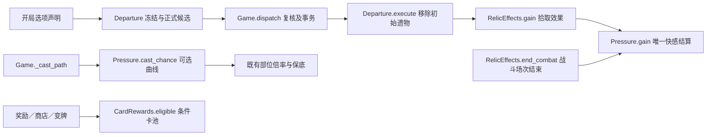

# 内容创作指南（内容包、生成规则与模板）

本文件说明“现在如何生成、扩展时必须遵守什么、哪些能力尚未实现”，并保留各家族的设计表模板。规则数值见 `./game-design.md`，装备结构见 `./equipment-design.md`，卡牌见 `./cards.md`，逐怪数值见 `./enemies-first-floor.md`，监狱来源见 `./prison.md`。执行接口（唯一入口、事务、存档、随机、窗口检查）见 `.zcode/skills/spire-architecture/SKILL.md` 与 `.zcode/skills/repo-ops/SKILL.md`。

## 1. 两条创作路径

| 路径 | 适用 | 做法 |
| --- | --- | --- |
| 内容包（JSON） | 复用已有机制的新装备模板、性玩具、道具、遗物、敌人、事件 | 从 `content/templates/` 复制，改 id 与数值后放进 `content/packs/`，运行 `tools/check-content.ps1`，显示 `CONTENT PASS` 后完全重启游戏开新局 |
| 源码扩展 | 新物理结构、新敌人行为、新卡牌效果、新事件效果 | 在对应注册表与执行处实现，并同步文案、存档校验、投影与测试 |

- 五类内容包 kind 与真实来源见 `spire-godot/content/README.md`（格式版本1，`event` 为2）。
- 校验顺序：所有文件一起检查，任何一个错误则这一批外部内容全部不启用，游戏使用内置内容；不读取或执行包内脚本。文件最多256个、每个最多1MB、子文件夹最多8层。
- 卡牌不能通过内容包新增（外部内容包不支持卡牌 JSON）。

## 2. 定义、生成与执行三层

| 内容 | 定义 | 正式生成／取得入口 | 内部执行入口 |
| --- | --- | --- | --- |
| 普通拘束具 | `data/equipment.gd::TEMPLATES/MATERIALS/WEAR_TEXTS` | 敌人模板池、警卫合法方案、事件配方、监狱、练习 | `Game._installation_reason`／`_install_template` |
| 复合拘束具 | `data/composites.gd::spec/GENERATION` | 警卫／事件筛选、监狱指定组合 | `_assembly_reason`／`_install_assembly` |
| 链接绳 | `data/links.gd`（材料方法复用 equipment） | 含绳索／皮带类的普通池、显式 `link_rope` 池、明确练习配置 | `_install_link` 与端点清理 |
| 性玩具装备 | `data/special_equipment.gd::TYPES/DESIGNS/RANDOM_POOLS/prison_pool` | 敌人 `special_pool`、事件 `special_install`、监狱池、练习 | `Game._install_special` 与既有解除／触发管线 |
| 随身／已安装道具 | `data/field_tools.gd::TYPES` | 商店 `TOOLS+PRICES`、休息服务、事件、监狱发现池、练习 | `_gain_tool`、原道具候选与执行 |
| 遗物 | `data/relics.gd::TYPES/REWARDS/BOSS_POOL/shop_pool` | 初始配置；随机奖励统一经 `RelicRewards.available` 按来源筛选，供单件抽取 `offer` 与 Boss 三选一 `battle_drop` 使用 | `core/relic_effects.gd` |
| 敌人／遭遇 | `data/enemies.gd::TYPES/ENCOUNTERS`、`data/first_floor_enemy_pools.gd::POOLS` | 塔路冻结遭遇、精英／塔顶配置、练习 | `_spawn_enemies`、`core/enemy_plans.gd`、`core/guard.gd` |
| 事件 | `data/room_events.gd::TYPES`（由内容包登记） | 抵达事件房时从本局未出现事件中抽取 | `core/room_events.gd` |
| 卡牌 | `data/card_rules.gd::SPECS/BUFFS` | `COMMON/UNCOMMON/RARE/REWARDS` 与专用来源 | `core/card_effects.gd` |

- “注册即生效”风险：`EquipmentOffers.ordinary` 的空 `templates` 会枚举所有有合法槽的普通模板，警卫通用选装可能立即选到新增定义；事件定义也会进入塔路全表抽取。要让草稿“注册但暂停生成”，必须先补来源过滤，或把草稿留在文档里。
- 定义、活动池、实例、显示是四层；登记定义不代表完成生成，界面不按名称分支决定资格。新增内容必须同时接入真实规则、存档校验、状态／结果投影与测试。
- `RelicRewards.available` 只读查询当前来源的可选遗物，返回独立数组，不推进随机或写入已见记录；抽取及奖励冻结仍由 `offer`／`battle_drop` 完成。Boss 候选共用 `RelicEffects.gain_reason` 检查领取资格，不在各奖励来源重复判定。

## 3. 随机域与结果保存

完整随机域清单与盐值只维护在 `data/balance.gd::RNG_SALTS`；Game 初始化按该表创建全部零计数，Snapshot 按同表要求“完整且无额外域”，每个计数为非负整数。新增域必须登记该表并覆盖实际执行与保存恢复；破坏存档结构时提升 `Snapshot.REVISION`；加性字段不升版，允许且只允许一次有定义默认值的回填（本局标识 `initial_seed` 由当时的 `seed` 回填，见 `docs/spec/seed-identity.md`）。不要借显示代码或全局 `rand*` 增加不可重放的抽取。

| 内容 | 随机来源 | 何时决定、如何保留 |
| --- | --- | --- |
| 塔路连线、房型 | `Tower.generate(run_seed)` 的局部带种子随机器 | 生成整张塔路时写入房间 |
| 事件 ID | `event` | 抵达时排除本局 `event_seen` 后抽取并记录；放弃也不退回池中 |
| 普通房间弱／强遭遇备选 | `encounter` | 生成塔路备选；首次进入按已完成普通战斗数选定并写入 `encounter_selected` |
| 敌人计划／施加选择、材料版本 | `enemy`／`equipment` | 预告保存池与规格要求，出手时选择实际装备 |
| 事件施加方案、有效钥匙、候选遗物 | `event` | 进入事件时保存于 `room_event` |
| 事件三选一奖励牌 | `reward` | 选择并成功支付代价后生成并保存 |
| 战后／休息奖励牌 | `reward` | 对应奖励阶段生成后保存 |
| 商店／宝箱 | 种子、塔路代数、房间 ID 派生的局部随机器 | 首次进入生成 `stock`，领取后标记；重开面板不补货 |
| 战斗距墙、施法、牢房位置、探索摔倒、牌堆、掉落、立绘 | `position`／`magic`／`explore`／`fall`／`deck`／`item_drop`／`enemy_visual` | 沿各自既有调用点与存档计数 |

本局标识＝（`state.initial_seed`，`state.tower_generation`）：出狱返塔与出口“继续游玩”都改写当前塔路种子并使次数 +1，初始种子不变。标识只回答“哪一局”，不保证单独复现当前进度——当前塔路种子与各随机域计数随游玩推进，房间库还按 `seed`＋`tower_generation`＋房间 ID 派生；精确复现由反馈一并上传的存档承担（`SaveStore.fixed_point_text`，见 `docs/spec/feedback-deployment.md`）。玩家可在地图角落查看并复制该标识（复制文本同时标出当前塔路种子），复制是只读显示操作，不推进随机、不写盘、不改任何状态。

事件按稳定ID在每局内最多出现一次；存档／读档保留记录与已选事件；出狱返塔、出口继续游玩都开始新局并清空记录。池耗尽时事件房成为可通过的空房间、不发奖励；练习指定事件不占正式局记录。目前没有通用权重、稀有度、幕数门槛或保底配置引擎——不能只添加 `weight/rarity/act` 就声称生效。

## 4. 装备、道具与遗物的生成约束

淫魔法卡池由卡牌声明 `reward_pool: "lewd_magic"`，先沿 `Character.allowed_card` 检查解锁遗物的角色限制，再沿 `CardRewards.eligible` 检查是否持有对应遗物；奖励、商店和开局变牌复用该资格。角色兼容性仍先行筛选，已持有卡牌与冻结存档的合法性不依赖之后是否仍持有解锁遗物。目前未加入此标签的正式卡牌，等待后续设计，不生成占位牌。遗物与曲线规则见 [game-design.md](game-design.md)。



- 普通装备的等级、紧度、容量、精准位置、三档添加优先级与“先补空小部位”的排序见 `./game-design.md` §6.5；`EquipmentOffers.preferred` 在同优先级内优先选择能覆盖空小部位的方案。
- 链接候选统一读 `EquipmentOffers.links`：区域内纵向子部位可任意相连，跨区域只取相邻边界，股绳仅接手腕／大腿根；每对物理装备最多一条；复合按真实组件共享额度；`contact_points` 随两端保存并复核。
- 新增普通单件可安装部位时必须同步提供 `Equipment.WEAR_TEXTS` 正文，不能退回“已装在某处”的占位句。
- 五级只是规格最高的普通牢房：追加与替换只用已登记的高安全组合（`PRISON_SECURITY[5]`）与合法填充流程，不新增专用组合或终局配置；不得引用旧 `security/terminal` 固定架的1000耐久或零伤害倍率作为普通模板。
- 道具逐一选择来源：商店 `data/room_services.gd::TOOLS+PRICES`、事件效果／奖励、休息服务、`core/prison.gd` 活动发现池或练习配置。传送符（折返符）有定义与使用逻辑但不进入任何随机生成池——正式新局抵达塔底时获得1张，见 `./game-design.md` §14。
- 遗物新增 hook 必须先有真实读取／触发代码（当前已消费的数值 hook：`battle_mana`、`capacity`、`preparation_turns`、`opening_draw`、`turn_draw`、`turn_energy_step`、`combat_retention_layers`、`pickup_cards` 等）；事件钩子为挣扎归零、卡牌滑脱降档、飞踢落地与实际魔力支付。断缚护腕等带额外条件的遗物由 `RelicEffects` 处理，不能只写一个看似合理的 `modifiers` 键。
- 随机遗物来自 `REWARDS` 并排除已持有；初始余烬护符与指定事件遗物只登记 `TYPES`。当前没有每个敌人的独立掉落表，不要凭敌人模板的 `loot` 字段发物品。

快感汲取器（`pleasure_extractor`）：罕见遗物，每次高潮后魔瓶魔力＋10；普通、滑精与剧情高潮共用结算，批量高潮按实际次数累计。直接补充魔瓶，不占手动存入次数，不受角色魔力上限限制。沿既有遗物魔力钩子写入，不增加存档字段。

```text
快感阈值／上限重算／资源均分／剧情高潮
  → Pressure._apply_overloads（实际次数）
  → RelicEffects.climax → _mana_hook（climax_flask_mana × 次数）
  → state.flask_mana → 共用魔瓶视图
```

清醒项链（`lucidity_necklace`）：稀有遗物，高潮时，下回合多抽1张牌。普通、滑精、强制与剧情高潮共用触发；多次累计，记入各遗物实例的 `relic_counters`，读档与场景切换保留到下一个玩家回合。回合开始先领取并清空既有待抽数量，之后本回合新触发的高潮留到再下一回合；实际抽牌沿统一牌堆、手牌上限和洗牌规则。百变怪沿既有规则独立计数、重新变形时清空自身计数。

```text
Pressure._apply_overloads（实际次数）
  → RelicEffects.climax → 遗物待抽计数累加／既有魔瓶补充
下一玩家回合开始 → RelicEffects.turn_draw（领取并清空待抽）
  → Game._draw（基础抽牌＋遗物额外抽牌）
只读图标与详情 → RelicEffects.counter（待抽数量）
```

### 淫魔法专用遗物

下列四件以 `required_relic: desire_cube_pro_max` 声明随机池门槛，共用 `RelicRewards.available` 筛选；仅持有欲望魔方 Pro Max 时进入商店、宝箱、精英及随机遗物来源。快感汲取器、清醒项链不受此门槛影响。百变怪的形态池不走奖励筛选，仍可变为这四件。

| 遗物 | 品质 | 规则 |
| --- | --- | --- |
| 洗脑耳环 | 普通 | 每次正向快感获得结算，在倍率之后额外＋2；合并进同次增长，不递归触发自身，仍受快感上限保护。 |
| 催眠发卡 | 稀有 | 每次实际主动／被动降低快感后获得10快感；包括支付快感，不包括高潮回落、初始化与读档。 |
| 淫纹连体丝 | 罕见 | 每玩家回合获得1层蓄力；每实际消耗1层蓄力获得5快感，清除或过期不算消耗。高潮保留正面奖励及计数，免除扣魔力、能量清零、弃牌／中断、下回合乏力、蓄力减半与滑精惩罚，快感设为当前上限50%。 |
| 淫纹丝手套 | 普通 | 所有实际魔法／淫魔法施法成功率额外＋25个百分点，最高100%，不绕过身体使用限制；每次施法成功获得5快感。 |

```text
随机来源 → RelicRewards.available → required_relic → 原品质抽取
百变怪 → 原 transform_pool（不受专用奖励池门槛影响）
快感增长 → Pressure.gain（额外＋2并统一结算）
主动／被动减快感 → Pressure.lose → RelicEffects.trigger
实际蓄力消耗／施法成功 → 同一 trigger（repeat）
  → 既有 relic_pending → flush → Pressure.gain（逐次触发，避免付款中断卡牌移动）
  → 动作落地、敌方行动后、开场抽牌前后、旅行抵达前及会话清场前结清
玩家开场／高潮 → 共用回合及高潮入口 → 连体丝效果
```

## 5. 敌人与遭遇

- 三层数据：`TYPES[type]` 定义个体（必须声明 `name/hp/order/behavior/visual`，弱怪再加后台 `strength`），`ENCOUNTERS[id].members` 组合个体，`first_floor_enemy_pools.gd::POOLS` 决定第一幕普通房间的遭遇；`enemy_library.gd::CLASSIFICATIONS` 独立分类个体。新增怪物须完成三层引用，不把敌人类型直接塞进遭遇池。
- `strength` 是后台正整数（弱怪允许1或2），参与弱怪总强度2与强怪组合总强度4的预算，不缩放生命、品质或紧度，不写入玩家视图，不显示在战斗、图鉴或教程。
- 已实现行为：

| behavior | 行动骨架 | 附加定义 |
| --- | --- | --- |
| `restraint` | 初级二档随机施加→加固同类（优先自身来源）→准备→中级三档附着并离场 | `install_pool/final_pool`，按真实子位置与最低品质过滤 |
| `attachment` | 准备两次→固定部位附着并离场 | `attachment_slot/attachment_pool`（当前为中级三档口球，只能附着在空闲嘴部） |
| `dispenser` | 准备→佩戴→停顿，循环不离场 | `special_pool` 显式白名单 |
| `lock` | 预告上锁→上锁，循环不离场 | 只处理已有合法装备 |
| `drone` | 首动施加捕缚→循环（处理胶带／捕缚＋10／发呆） | 见 `./enemies-first-floor.md` |
| `guard` | 警卫序列、附加行动、收押准备与执行 | `core/guard.gd`，不是任意动作数组解释器 |
| `humanoid` | 按显式动作表的循环与逮捕 | `core/enemy_plans.gd` 分支 |
| `sequence` | 仪式点数驱动的施加／加固 | 魔法阵专用分支 |
| `puppeteer`/`puppet`/`six_bind` | 精英与首领专用计划 | 见 `./enemies-first-floor.md` |

- 意图时机：加固预告不指定目标，只在出手时按玩家当时状态寻找；生成意图时若没有任何合法加固目标，就改选该敌人已有的施加意图（保留其数量、池、等级与紧度），没有则空过。已预告的加固在出手时无目标便空过、消耗该次行动并推进步骤，不改成临时施加；批量缺额同样空过。特殊装备有“拘束具”词条，但其可加固／可锁／可替换资格仍读自身规则。
- 施加与替换的完整定义只维护在 `./equipment-design.md` §14。
- 眼部受限隐藏未来意图与准备细节，实际造成的变化仍写结果与日志；动画只读正式敌方行动事件，不能在动画结束时再改装备。

## 6. 事件定义

事件条目需要 `name/intro/start_node/nodes`；单节点定义的节点 id 固定为 `choice`，多节点定义按 `start_node` 进入并只允许向后引用或进入 `result`。

- 节点字段：`allow_refuse/unavailable/relic_gate/random_freeze/outcome_draw/frozen_form/empty_node/choices`；每个选择需唯一 `id/label/reward`，配 `recipe`、`effects` 或 `outcomes`。
- 普通流程：进入并冻结方案 → 选择 → 原子施加代价 → 选牌／钥匙／结果 → 容量整理 → 地图；多阶段流程：进入阶段并冻结该阶段全部选项 → 选择并原子提交 → 后续阶段或结果 → 通用收尾 → 地图。两者都不触发普通战后恢复，也不给额外整备回合。
- 现有配方：`free_basic`（优先绳／皮带，初级一档）、`tighten_or_medium`（加固一档，无可加固则中级二档绳／皮带）、`locked_assembly`（单手套／单腿套／拘束衣，中级、各组件二档并锁住预先公开的可锁组件）。早期设计记录的 `wager` 配方与 `reward:"keys"` 当前校验不接受。
- 普通效果白名单：`install / special_install / assembly / tighten / tighten_to / unlock / mana_loss / mana_gain / mana_restore_full / mana_max_loss / flask_mana_gain / pressure / card / tool / relic / remove_card / ease_restraint / remove_restraints / hold_special / restore_held`。`mana_restore_full` 恢复到当前上限；`mana_max_loss` 永久降低上限并压低超出的当前魔力，且不能令上限低于1；`flask_mana_gain` 直接增加贴身魔瓶储量、不受角色上限约束、不占手动存入次数；`remove_restraints` 只接收选择器冻结的1—4个不同实例，全部复核后原子解除。
- 作者层生成器：普通与多阶段选项都可用 `install_random{templates,count,grade,tier,locked,allow_links?}` 与 `tighten_random{count,to_tier,templates?}`（数量1—4，进入阶段时沿 `event` 域展开成具体效果，运行状态与快照不保存生成器）；`special_install_random{types,replace?,fallback?}` 只冻结当前有合法位置的性玩具，省略 `fallback` 时无空位就不生成该选项；`random_amount{effect,minimum,maximum,source?}` 只包装 `mana_loss/mana_gain/flask_mana_gain/pressure` 并冻结含上下限的整数。未知效果拒绝；新增效果必须同时实现执行、前后说明、快照与测试。
- 选择器：普通与多阶段选项共用 `selector`，`count` 可要求1—4个不同实例，卡牌可排除诅咒（`exclude_curses`），拘束具可排除性玩具（`include_special:false`）；正文占位符与 `$selected` 在冻结后替换。UI 只拿到当前阶段标题、介绍、公开说明、选择数量与选择ID。
- 条件：规范拼写 `conditions`（1—8条，每条自带 `mode`）与兼容拼写 `availability` 互斥；`optional` 显示但禁用并给出 `reason`，`hidden` 不生成，任一 `hidden` 命中即隐藏，`reason` 按声明顺序换行连接。`no_chastity_lock` 按正式特殊装备族判断，佩戴平板锁时选项可见但不可提交。
- 离开：`allow_refuse:true` 自动追加保留ID `refuse` 的付费离开（损失至多10魔力、无奖励、不足扣剩余全部）；为假时不生成默认离开，作者可用无奖励空 `effects` 提供免费离开。多节点定义的起始节点必须能离开。
- 跨事件链：`next` 可写 `{"event":"已登记事件id","node":"目标节点id"}`，同一 `room_event` 实例改写为目标事件的 `id` 与 `stage`；`values` 与 `held` 延续，暂存 `key` 整条链唯一，`cleanup_effects` 取并集并各执行一次，`chain` 键只在真跳转时写入，遗物按目标事件定义重算。不能引用自身，回到已走过的事件会被拒绝；当前12份内容都不使用链。
- 事件战斗：选项可声明 `encounter{id,requires_defeat,victory_effects,victory_report,result_status}`，复用正式遭遇与胜利清理，胜利后执行冻结效果并回到事件结果页；`requires_defeat:true` 时装备空间耗尽不算胜利；载入状态保存在 `room_event.battle`。
- 事件道具：`item_rewards:[{id,pool}]` 从1—6个道具池各冻结一件，进入共用战利品窗口逐件领取或放弃；容量已满时就地禁止领取，继续即放弃剩余行并直接完成事件，不进整备。
- 平板锁文案差分：通用 `report_variants/source_variants` 按已佩戴特殊装备族选择正文，进入阶段时冻结为普通文字；不按事件ID分支，也不改快感、高潮、魔力损失、筹码、随机、装备或卡牌效果。
- 一次性剧情演出（先取下原性玩具、结束后装回）不改变状态，按真实装备名描写即可；只有取下期间会开放选择、影响空位或参与判定时才用 `hold_special/restore_held`，并要求对应 `cleanup_effects` 收尾。

## 7. 塔路与新内容入口

塔路结构、固定楼层与前进规则见 `./game-design.md` §9.3；新增房型必须同时接生成约束、房间字段校验、进入／离开、地图图标与说明、测试，不能用固定楼层表重建第二张塔。普通房间保存 `encounter_choices`，首次进入才按实际已完成普通战斗选择弱／强池并写入 `encounter_selected`；`last_strong_group` 跨房、存读档与逃狱重建保留，新局清空。

## 8. 设计表模板

标成“需要补逻辑”的内容不得当作已支持配置；例子数值只演示格式。

### 8.1 每项内容必填的交接表

```text
内容 ID：英文 snake_case，稳定不复用
日常名称：
家族：普通拘束具 / 复合拘束具 / 链接 / 特殊部位装备 / 道具 / 遗物 / 敌人 / 遭遇 / 事件
状态：设计草稿 / 仅练习 / 正式生成（明确选一种）
玩法目的：
规则来源：
复用的现有机制：
新增机制及需要改动的执行处：没有则写“无”
定义位置：
生成来源与排除来源：具体到注册表、池或调用处
抽取时机、随机域、结果保存位置：
合法目标与不足时处理：无目标 / 满容量 / 重复持有 / 阶段不符
持续状态与终止条件：
界面：名称、位置、费用、关键数值、可用或不可用原因
结果：成功 / 失败 / 部分进展 / 到期 / 失去目标的具体提示
教程：名词解释，与真实规则一致
素材：资源键、占位资源、后续替换点
存档：新字段、合法值、恢复后的下一步；没有新字段也检查新 ID 引用
验收：最小正例、最近反例、边界、原子回滚、随机重放、实际 UI
不在本次范围：
```

### 8.2 普通拘束具

```text
类型 ID / 日常名称：
材料：rope / leather / tape / plastic / cloth
等级：允许的 grade、min_grade；对应等级材料版本必须存在
最大耐久：由 Equipment.maximum 取得，不单写另一张数值表
初始紧度：来源选 1/2/3 档，耐久比 40% / 80% / 100%
规则槽 slots：
精准位置：允许哪些真实 points；安装是否指定 point
左右：成对普通覆盖 / 已有单侧结构
容量：复用原点容量；更改必须单独说明规则变更
层级与封闭：是否被套体挡住，如何判定外层
是否固定躯干：否 / 是（现仅身后）
支持方法：strain / slip / manual / lock 各 true 或 false
实时条件：触及、精细动作、外层、姿态、墙面／工具
不能滑脱原因：结构禁止还是紧度导致，二者不能混写
附加效果：优先复用既有材料／部位规则；新增效果列出执行点
损坏／滑脱成功后：移除单件、清理依附链接与效果
生成：敌人专用池 / 警卫通用池 / 事件配方 / 监狱 / 练习
验收：来源能选到；错误槽拒绝；满点拒绝；层级合法；伤害与清理正确
```

```json
{
  "sample_ankle_belt": {
    "name": "窄皮带",
    "material": "leather",
    "slots": ["ankle"],
    "strain": true,
    "slip": true,
    "manual": true,
    "lock": true,
    "min_grade": 1
  }
}
```

不写实例耐久、随机权重或当前锁状态；来源通过正式安装工厂提供 `grade`、初始／最大耐久、`locked`、`source` 与可选精准位置。模板 `name` 不必写部位前缀。该样例是未登记的 `sample_` ID，不会加入游戏。

### 8.3 复合拘束具

```text
family / variant / straps：
名称 / 最低等级：
根的真实覆盖 coverage：
关闭的部位 closed：
可生成组合：是否加入 Composites.GENERATION，哪些来源继续筛选

逐组件填写一行：
part ID | 日常名称 | 已有 template | coverage | contact | points | side | independent

每组件的来源初始值：grade、tier、locked（默认继承还是明确覆盖）
共享关系：哪些部位实际指向同一组件，不能重复计算耐久
结构条件：先处理哪些组件，才允许滑脱或拆除套体
局部损坏：套体归零后其他组件移除还是留下
外层／封闭：哪些后装物品被禁止，哪些真实内层可以保留
链接依附：可以接到哪一件真实组件，组件消失时怎样清理
手部与工具接触：按哪个真实接触位置检查，展示位置是否不同
安装原子性：任一部位容量／结构失败则整件不安装
验收：完整安装、逐组件解除、拆套留带、封闭边界、链接清理、恢复后继续
```

`data/composites.gd::spec` 返回 `kind/variant/straps/name/coverage/closed/parts/minimum`；组件用 `part(label, template, coverage, contact, independent=false)` 构建，需要时加真实 `points/side`。以下只是内部安装参数说明，不是可自动导入的新模板：`_install_assembly("glove","long",source,2,2,overrides,"cross")`。新 family 还需实现 spec、校验、结构解除与状态／目标投影。

### 8.4 链接与特殊装备

```text
链接类型与名称：
材质／等级／初始耐久：沿既有链接定义
端A：真实装备或组件 ID 的选择条件
端B：真实装备或组件 ID 的选择条件
方向与额度：向上／向下，区域内剩余子部位数
阻止哪件装备滑脱：退出方向明确声明，不能全体统一封锁
解除方式：挣扎 / 徒手 / 切割；无滑脱
清理：任一端失去必要目标即级联删除并释放额度
验收：两端合法、额度、重复连接、级联清理、接触点复核
```

```text
特殊装备 ID / 名称 / family：
TYPES 字段：energy_gain / turn_gain / duration / stimulates / material_text / detail
DESIGNS 字段：grade / maximum / ratio / slots / methods / tools / environments /
             damage_factor / capacity_cost
初始耐久 = maximum × ratio；品质与最大耐久固定，不套普通材料随机表
触发：实际支付正能量一次 / 玩家回合开始并扣一回合电量 / duration=0 持续
刺激正文：STIMULATION_TEXTS 提供当前佩戴时的具体公式
解除：可达的手部路线，或真实环境条件（wall / sharp / hook）
验收：容量整件原子、同族上限、电量耗尽保留、逐件损伤、混合到期
```

### 8.5 道具、遗物与敌人

```text
道具：TYPES 字段 name / uses / damage / materials，可选 operation、mouth_install、
      trigger_damage_types；operation 省略为 cut，现只有 cut/unlock/escape
安装：1能量、不扣次数；取回0能量；随身与安装共用同一物品与剩余次数
来源：逐一选择商店 / 事件 / 休息服务 / 监狱发现池 / 练习

遗物：TYPES 字段 name / detail / rarity / modifiers（可加 trigger 与 pickup_cards）
随机来源必须进 REWARDS 并排除已持有；指定事件遗物可只登记 TYPES
新 hook 必须先有真实读取／触发代码

敌人：TYPES 必须声明 name / hp / order / behavior / visual，弱怪再加 strength
装备池：install_pool / final_pool / special_pool / attachment_pool
遭遇：ENCOUNTERS[id].members 为 {type, grade} 列表，可附 pressure 与 rank
入场资格：FirstFloor.eligible 按当时真实装备筛选，不允许预支未来装备
```

### 8.6 事件

```text
事件 ID / 名称 / 开场介绍：
start_node 与 nodes：每个节点的 allow_refuse / unavailable / relic_gate /
  random_freeze / outcome_draw / frozen_form / empty_node / choices
每个选择：唯一 id / label / reward，配 recipe、effects 或 outcomes
代价与收益：具体数值、是否可拒绝、拒绝费
冻结时机：进入时冻结什么，提交时复核什么
容量与回滚：满容量、无合法目标、部分失败时的结果
正文与文案：使用 WEAR_TEXTS 或通用效果说明，不写事件ID特判分支
验收：正例、最近反例、无效目标、原子回滚、只读询问、读档不重抽
```

## 9. 提交与验证清单

### 数据导出与文档更新

- Wiki／数据导出取基础属性时，读取内容成功注册后的正式注册表；遭遇成员覆盖的 `hp`、周目倍率与收押加成应另列实例属性，不能混入敌人基础生命。练习文案只作说明，不能作为取数来源。
- `Content.ensure` 失败时保留原注册表，游戏可继续运行；导出必须检查 `Content.report.ok`、文件数量及本次要求的内容 ID 集合，失败不得发布不完整结果。缺失或空目录也不能因读到零条记录而冒充完整内容；当前正式包有 12 份事件文件，后续以版本对应的内容清单为准。
- `tools/check-content.ps1` 每次启动独立 Godot 进程，只编译检查指定目录，不安装定义、不写存档。它成功仅代表目录内文件合法，不证明游戏已安装这些定义，也不证明空目录拥有完整内容。`Content.loaded` 与角色注册均有进程内静态状态；每次实际导出同样使用新进程，不复用前次注册表。
- 当前仓库未实现 Wiki 构建器；上述要求是后续接入约束，不能把现有内容校验器记成 Wiki 导出验收。
- 人工机制文章记录适用源码提交及依赖的规则文件／符号；依赖改变时标记待复核。数值更新同步练习说明、英文与相关测试，执行结果按日期追加到 `docs/record/verification.md`，历史测试结论不改写为当前通过。

- 定义与来源引用正确；暂缓内容没有进入通用枚举或正式池；指定来源确实能取得或施加它。
- 最小成功、最近失败、容量／精准位置／层级／等级边界、无合法目标时的回退；失败前后状态、随机、编号、费用与日志全部不变。
- 相同种子与行动序列可重放；预览不消耗随机；中途保存恢复不重抽、不重复发奖或触发。
- 复合与链接的局部解除与残留、特殊装备的逐件损伤与混合到期、瞬时与持续效果都有清理。
- 可用／不可用原因、精确位置、耐久／紧度、费用、真实结果与教程解释完整；术语详情放教程，决策必需数值就近显示。
- 新内容复用目标框、部位详情、状态栏、行动日志与已安装工具入口；同一物理目标跨子部位去重显示，但不合并真实实例。
- 新增用例登记到 `tests/test_game.gd`／`tests/ui_smoke.gd`，交叉范围登记 `tests/suite_selection.gd`；不另起测试框架。流程夹具降低生命不能冒充正常难度试玩。检查命令按受影响分类运行，见 `.zcode/skills/repo-ops/SKILL.md`。
