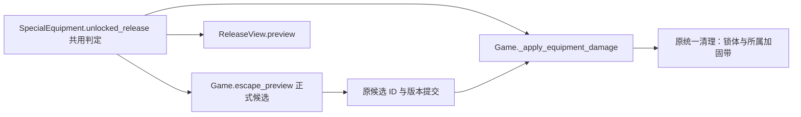
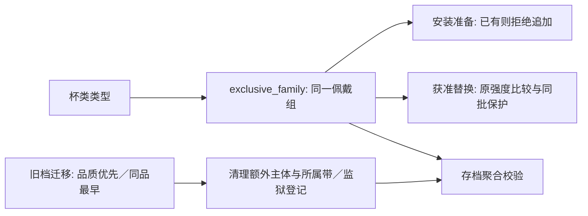

# 装备模板与结构真源

本文件是装备模板、材料分档、复合结构、链接、肩部、躯干固缚、性玩具、五级监狱规格与施加／替换的唯一真源。共用数值（耐久、紧度、降档、伤害、手部辅助、堆叠、锁）见 `./game-design.md` §6；敌人可用的装备池见 `./enemies-first-floor.md`；监狱补装规格见 `./prison.md`；诅咒平板锁分支见 `./cursed-plate-lock.md`；内容包字段与模板填写表见 `./content.md`。

代码真源：`data/equipment.gd`、`data/composites.gd`、`data/links.gd`、`data/special_equipment.gd`、`data/environments.gd`、`core/equipment_application.gd`、`core/equipment_offers.gd`、`core/equipment_replacement.gd`、`core/shoulder_links.gd`、`core/torso_binding.gd`。

## 1. 通用阅读规则

- “有挣扎／滑脱”表示方法存在，仍须通过目标选择、层级与结构检查；结构禁滑脱独立于紧度。
- 所有普通滑脱受三档免疫；挂钩、魔力松缚等明示的特殊滑脱只突破紧度免疫，不突破结构禁滑脱。
- “徒手”指双手自由时的直接解除或部分自由时降一档，两者都要求实际触及且未锁；不是重新引入扣件目标。
- “切割”读取工具材料兼容与姿态范围；不是所有工具都能切所有部位。
- “可锁”只授予上锁资格，不自动生成锁；皮革可锁不再沿用旧手指／脚掌／脚趾的禁锁例外。
- 每个组件只保存一份耐久；紧度为整数1／2／3档，同档内按耐久百分比比较，只有百分比相等才算并列；等级与施加紧度独立。
- 挂钩作用范围是站姿上半身与躺姿脚踝／脚掌／脚趾，坐姿无入口；材料清单不能扩大该范围。

## 2. 材料与等级适配

| 材料族 | 初级版本 | 中级版本 | 高级版本 |
| --- | --- | --- | --- |
| 普通绳索 | 粗劣麻绳、柔软棉绳 | 尼龙绳、加强棉绳 | 魔导纤维绳 |
| 细绳 | 粗劣麻细绳、柔软棉细绳 | 尼龙细绳、加强棉细绳 | 魔导纤维细绳 |
| 皮革（含细皮带） | 老化薄皮革、柔软皮革 | 厚牛皮、加强皮革 | 魔导皮革 |
| 胶带 | 纸质胶带、普通布胶带 | 布基胶带、纤维加强胶带 | 魔导封印胶带 |
| 扎带 | 劣质塑料扎带、标准尼龙扎带 | 工业尼龙扎带、加强树脂扎带 | 魔导树脂扎带 |
| 眼罩布料 | 普通遮光布带 | 加厚遮光布带 | 加强遮光布带 |

- 最大耐久由等级读取：初／中／高＝10／16／24（`data/balance.gd::BASIC_DURABILITY/MEDIUM_DURABILITY/HIGH_DURABILITY`）。
- “魔导”只保留材料名与高阶耐久定位，没有禁魔、自动收紧或资源吸收效果；细皮带只保留小部位规格。
- 长短与组件结构可以提高装备级别，不能只按最弱材料把大型复合装备放进初级池。

## 3. 普通单件模板

| 模板 | 覆盖部位 | 等级 | 挣扎 | 滑脱 | 徒手 | 可锁 |
| --- | --- | --- | --- | --- | --- | --- |
| 普通绳索拘束 | 大小臂、手腕、手掌、大小腿、脚踝、脚掌（颈部需独立用途声明） | 初/中/高 | 有 | 有 | 有 | 否 |
| 细绳拘束 | 手指、手掌、脚掌、脚趾 | 初/中/高 | 有 | 有 | 有 | 否 |
| 普通皮带拘束 | 与普通绳索同范围 | 初/中/高 | 有 | 有 | 有 | 是 |
| 细皮带拘束 | 手指、手掌、脚掌、脚趾 | 初/中/高 | 有 | 有 | 有 | 是 |
| 普通胶带拘束 | 上下肢合法普通部位（眼／嘴另有模板） | 初/中/高 | 有 | 有 | 无 | 否 |
| 普通扎带拘束 | 上下肢合法普通部位，不含眼／嘴 | 初/中/高 | 有 | 有 | 无 | 否 |

- 普通绳索与普通皮带不用于手指／脚趾，不接受肩部普通圈；肩部由链接结构表达。
- 手指、手掌、脚掌、脚趾容量2；其他普通部位容量3；混合材质不额外扩容。
- 默认双侧共同固定；脚踝不设计独立左右佩戴；脚趾模板表示双侧大脚趾共同固定，不拆成十根。
- 同材料作用不同部位时基础耐久共用材料版本，不因部位数量重复计耐久。
- 绳、皮革、胶带可由小石片与锯条切割；扎带只由明确兼容塑料的工具处理。
- 胶带不恢复干燥粘性禁滑脱或浸湿解法。

| 部位 | 默认共同固定的影响 |
| --- | --- |
| 大臂 | 限制上臂展开，贡献上肢0.5；不自动封手指 |
| 小臂 | 限制双小臂独立活动，贡献上肢0.5 |
| 手腕 | 关闭双手独立活动，贡献上肢2；保留未被限制的手指／手掌能力 |
| 手掌 | 握持受限、双手共同固定；默认不封手指 |
| 手指 | 对应手精细操作关闭；双侧受限时不能执行普通手势 |
| 大腿 | 限制大幅分腿，贡献下肢0.5 |
| 小腿 | 限制左右小腿独立伸展，贡献下肢0.5 |
| 脚踝 | 关闭独立踢击、允许条件合法的并腿动作，贡献下肢2 |
| 脚掌 | 限制独立调整与支撑；不默认强制倒地 |
| 脚趾 | 关闭脚趾操作及双足自由分开，不自动关闭髋膝共同运动 |

手掌／手指合计贡献最多1，脚掌／脚趾同理；等级4要求真实完整覆盖（判定见 `./game-design.md` §5.1）。

## 4. 眼部与口部模板

口球组合：普通固定＋普通口球＝初级；马具固定＋普通口球、普通固定＋假阳具口球＝中级；马具固定＋假阳具口球＝高级。一件装备、占用一个嘴部位置、一条耐久，沿用等级耐久、紧度、锁、徒手、卡牌与嘴部施法接口，不新增触发效果。中级的两种组合由既有 `variant` 区分，初级两种材质版本都是普通组合，高级为双升级组合；马具款复用原结构禁滑脱与逐眼罩紧度比例比较，解除直接移除整件。附属头部马具不再单独生成，堵嘴胶带不变。

| 模板 | 等级 | 限制 | 挣扎 | 滑脱 | 徒手 | 可锁 |
| --- | --- | --- | --- | --- | --- | --- |
| 布带眼罩 | 初/中/高 | 视觉受阻 | 无 | 有 | 双手条件与触及合法时可处理 | 否 |
| 皮革眼罩 | 中/高 | 沿用眼罩视觉受阻 | 无 | 有 | 未锁且手部条件与触及合法时可处理 | 是 |
| 胶带眼罩 | 初/中/高 | 视觉受阻 | 无 | 有 | 本批无快速松解 | 否 |
| 普通口部固定装备 | 初/中/高 | 影响嘴部施法成功率，倍率见 `./game-design.md` §4.3 | 有 | 有 | 外部固定为皮革且未锁、触及时可处理 | 是，仅皮革目标 |
| 堵嘴胶带 | 初/中/高 | 同上 | 有 | 有 | 本批无快速松解 | 否 |
| 马具式头部固定结构 | 中/高 | 维持口部固定并附加结构禁滑脱 | 有 | 无 | 仅满足真实触及、未锁与既定结构解除条件时 | 是，仅皮革组件 |

- 普通口部只保存一份真实固定目标耐久，不为外观补第二条耐久。
- 眼部最大堆叠容量固定为2，各类眼罩共享；分层必须来自真实结构来源。
- 嘴部最多两件，仅胶带类能追加到已有装备上：允许口球＋胶带、胶带＋胶带；不允许追加第二件口球，也不能在胶带内补入口球。不同材料共存时胶带固定在更外层，同材料沿用普通同层堆叠。敌人获准替换装备时仍走原品质比较与外露规则，不视为追加。
- 任意真实眼部装备遮挡即隐藏全部敌人意图（规则见 `./game-design.md` §12），不按紧度分档。
- 眼罩位于马具式外层之下时：外层当前耐久比例大于该眼罩则禁止滑脱，小于等于则通过该结构检查，普通三档免疫另算。
- 挂钩可处理普通眼罩／普通口部的合法滑脱目标并突破紧度封锁，但不能处理马具自身的结构禁滑脱。
- 石片与锯条不开放头颈切割。

## 5. 小型复合：单侧手部包裹

覆盖同侧手掌＋手指，左右为不同实例，每侧最多一件；等级按胶带材料版本，无独立扣件或锁。同侧精细操作与握持关闭，另一手独立检查；单侧包裹不直接等于双手共同固定。安装时同侧手掌与手指都必须没有已有装备；可被后来合法外层覆盖，解除仍按外露条件。可挣扎、可滑脱、不能徒手快速解开、可由兼容工具切割；组件自身一条耐久，归零整件移除。

## 6. 皮革复合装备

### 6.1 单手套

| 版本 | 覆盖 | 等级 |
| --- | --- | --- |
| 短型 | 大臂、小臂、手腕，不包手掌手指 | 中/高 |
| 长型 | 短型＋手掌、手指 | 中/高 |

- 默认固定双臂在身后；短型保留未被其他装备关闭的手指精细能力，长型同时关闭双手精细操作与握持。
- 套体在每个真实覆盖部位占一件容量；跨部位套体按物理ID去重，不把显示位置重复相加。
- 套体一条耐久；直／交叉肩带均左右独立耐久与紧度，皮革可锁。
- 套体保留挣扎路线；肩带有效数量修正见 §9。任意肩带已解除、套体非三档、无额外外层／自身加固时，下一次针对它的挣扎类伤害行为触发直接脱下整件（条件在行动开始时检查，刚解除肩带的那次不触发）。
- 切割只要求有一处在工具范围内且外露的真实接触位置；整体滑脱与特殊脱下检查全部套体外层。
- 同时最多一件；长型完整时不在手掌／手指外侧追加普通件，先有的小部位装备可作为内层保留。
- 未锁且能触及的肩带可徒手处理；套体不按普通皮带一键解开。

### 6.2 单腿套

| 版本 | 套体覆盖 | 外带位置 | 等级 |
| --- | --- | --- | --- |
| 短上段 | 大腿 | 大腿根、膝上各一条 | 中/高 |
| 短下段 | 小腿、脚踝 | 膝下、脚踝各一条 | 中/高 |
| 长至脚踝 | 大腿、小腿、脚踝 | 大腿根、膝上、膝下、脚踝各一条 | 中/高 |
| 长至脚趾 | 前述＋脚掌、脚趾 | 同长至脚踝，不另加脚趾外带 | 中/高 |

- 套体一条耐久，每条外带独立，全部皮革组件可单独上锁。
- 套体与外带有挣扎路线；外带有滑脱路线；套体整体滑脱必须先解除全部外带，并检查合法外层与连接。
- 套体破坏后仍有效的外带保留在原部位，保留耐久、锁与引用，不重抽、不补满；界面归为“遗留外带”。
- 同段短套不可重复；上下短段可并存并可被一件长套合法覆盖；同一时刻最多一长套，不可在长套内部补装短套。
- 挂钩站姿不能处理腿部套体；躺姿可处理脚踝外带以及覆盖踝／足并满足整体滑脱前置的套体。

### 6.3 拘束衣

- 中/高级，初级不生成；衣身覆盖肩部、上肢与手部，默认封闭袖部，手指不能完成精细操作。
- 只保留衣身、袖部连接、下摆固定三个功能组件，各自独立耐久，皮革组件可锁。
- 袖部连接不提供滑脱，可由合法徒手或工具处理；下摆固定为环绕结构并有滑脱路线；两者都解除后才开放衣身整体滑脱。
- 衣身归零时依附组件随整件清理；整件最多一件；允许事先存在的合法手部内层，拒绝后来向封闭上肢区域追加普通件或普通链接。
- 单手套与拘束衣按封闭冲突排除组合。

## 7. 躯干固缚（本规则只写在此处）

大臂、小臂、手腕的普通单件拘束具在施加或加固至整数三档时，自动随机取得一种躯干固缚；手掌、手指、复合组件与普通链接不触发。专用躯干固定绳／带不再生成或接受安装；本状态不另占普通容量。

| 形式 | 结构含义 | 耐久与堆叠 |
| --- | --- | --- |
| 连接式 | 躯干与手臂各自被束住再连接 | 独立连接耐久（初／中／高＝10／16／24）；挣扎不受堆叠优先级与除数影响，滑脱受影响 |
| 一体式 | 同一件拘束具将躯干与手臂一起束住 | 无独立耐久；处理原装备，挣扎与滑脱均受堆叠影响 |

- 两种均默认身后；大臂状态只把手部范围中的大腿排除，小臂／手腕状态另排除占位位置3。适用于所有姿态，不额外封锁手肘、占位位置1／2、手势魔法或已安装环境工具的身体接触。
- 状态依附原装备，降到二／一档仍存在；一体式随原装备移除，连接式也可通过耗尽独立耐久解除，原装备耐久与紧度不变。
- 连接耗尽后保留已触发记录，不因原装备持续三档自动再生；加固结果为三档时刷新形式与连接耐久（含二档加固到三档）。
- 仅原装备处于其重合位置最外层时生效；已有外层遮挡时暂不生效，外层移除后恢复。施加重合复合装备时先取消状态再施加，失败不清除。
- 随机形式使用独立随机域，预览不消耗随机；存档严格验证附着关系、独立耐久与形式，不迁移旧专用装备。
- 实现：`core/torso_binding.gd`（`MAXIMUM`、`eligible`、刷新与级联清理）。

## 8. 普通链接绳

- 链接不占拘束具容量；一对具体物理拘束具之间至多一条；每件拘束具向上／向下分别计数，上限为该固定位置在本区域内对应方向剩余子部位数，最低1（最低1只是额度，不凭空产生目标）。大腿根上1／下2，大腿中部上1／下1，膝盖上方上2／下1。
- 复合装备按实际组件及固定点连接，同一物理组件的同方向链接共享额度；链接绳自身不能再作为普通链接的连接对象。
- 每条链接及待执行意图保存 `contact_points`（两处真实子部位），不按名称或显示位置推断；无精确位置的旧存档不迁移。
- 向下链接滑脱加成：普通单件只有向下普通链接、没有向上链接时，滑脱伤害×1.25（`data/balance.gd::LOOSE_DAMAGE_BONUS`）。方向沿大臂→小臂→手腕→手掌→手指及大腿→小腿→脚踝→脚掌→脚趾判断，不按姿态或两端保存顺序；多条向下链接只算一次。普通／魔法滑脱与移动被动共用，链接失效立即重算；挣扎、固定切割、降档与挂钩不因此加值；链接绳自身、肩部链接、躯干固缚连接与复合组件不套用。
- 股绳（性玩具）可作普通链接的一端，仅连接手腕或大腿根：相对手腕为下端、相对大腿为上端，方向不随姿态或保存顺序改变；不取得普通单件的1.25倍率，也不额外占用手腕／大腿容量。已佩戴股绳会被入狱链接配额纳入合法配对，但不自动新增股绳。
- 可挣扎、合法徒手解开／松解、兼容切割；无滑脱；挂钩与魔法滑脱都不能处理它。徒手与工具须能触及至少一处外露连接；链接自身只用自己的紧度计算挣扎，不继承两端的锁与堆叠减伤。
- 任一端失去全部必要目标即级联删除链接并立即释放方向额度；新装备不自动加入旧连接。
- 生成需要显式链接名额；普通池含绳索类或皮带类时自动获得合法链接候选（其余合法项档，见 `./game-design.md` §6.5）。
- 实现：`data/links.gd`、`EquipmentOffers.links`、`Game._install_link`。

## 9. 肩部链接（本规则只写在此处）

`core/shoulder_links.gd` 是游戏正式管线内的共用助手；自动附带、警卫额外施加与练习都走同一安装与清理逻辑。

- 命名按基础类型生成（左肩绳／右肩皮带等）；属于肩部链接拘束，不是肩部普通绳圈，也不是躯干固缚附件。安装、检查与解除位置都在左／右肩，界面归入“颈肩→肩部”。
- 来源：以现有、合法且外露的大臂上侧／手肘上方拘束为连接对象，左右成对施加，任一侧不合法则整对不写入；大臂区域普通单件施加或加固达到整数三档时自动附带一对。
- 每件原装备最多1对，自动附带与额外施加共用上限；不同原装备可各有多对，肩部同层、不限总件数。
- 左右各保存独立耐久、紧度、交叉状态与解除状态；初始紧度按初／中／高级1／2／3档，耐久读取品质基础表10／16／24（暂定）；自动附带继承原件基础类型与品质，额外施加读取自身配置。
- 原件滑脱修正：依附原件的有效肩带2条→原件本体不可滑脱；1条→原件可滑脱但普通／魔法滑脱效果×0.5；0条→恢复原效果。其他原有条件、环境资格与乘区仍检查；0条不保证必然可滑脱。该数量规则同样适用于单手套套体。
- 肩带自身不可挣扎；徒手、切割、挂钩、上锁及普通／魔法滑脱按基础类型、材料、触及、环境、费用与方法资格正常对接，不给原本不支持的方法开放资格。
- 交叉：每侧紧度达到3档时进入交叉并获得自身不可滑脱；降到2档保留该封锁，降到1档解除；再次升到3档重新进入交叉。未达到过3档的2档肩带不推定为交叉。交叉是历史状态，普通／魔法滑脱及滑脱路线挂钩均不能绕过。
- 原件降档后已有肩带保留；原件解除则级联解除；单侧解除只移除该侧效果。
- 补回：普通单件原件再次加固到3档时补回缺失肩带，仍受每件最多1对约束；持续停留三档不在预览或普通回合中自动再生；补回不重置仍存在那一侧的独立耐久与状态。
- 肩部滑脱倍率按肩部1.20（见 `./game-design.md` §6.2）；肩带无挣扎路线，因此不进入移动被动抽选。
- 不采用旧项目肩绳与躯干紧贴拘束的闭环引用；肩部链接与躯干固缚分别维护。

## 10. 自身加固结构

“加固一次”是现有装备升档；“自身加固结构”是实际另有的组件，二者分开。只有模板明确声明的真实外带／连接才作为单手套等快速解除的结构阻挡；不创建没有耐久、没有解除入口的抽象“已加固”阻挡。通用加固结构列表暂不扩充，已有马具按兼容前置生成。

## 11. 性玩具装备

`data/special_equipment.gd` 统一乳头、肉棒与双穴三块区域；`TYPES` 维护家族、触发与刺激位置，`DESIGNS` 维护固定品质、耐久、初始紧度、真实覆盖、容量消耗、方法与环境白名单。

| 区域 | 精准位置 | 容量 | 敏感度倍率 |
| --- | --- | ---: | ---: |
| 乳头 | 乳头 | 2 | ×1.0 |
| 肉棒 | 柱身／龟头／冠沟／马眼 | 2／2／2／1 | ×0.6／×1.5／×1.5／×1.5 |
| 双穴 | 小穴／后庭 | 1／1 | ×1.0／×1.0 |

- 品质与最大耐久按款式固定（当前10／16／24），初始耐久＝最大×80%；不套普通材料随机表。
- 同族只能存在一个物理根；龟头杯、全包杯、马眼全包杯、强制榨精飞机杯的全部品质共用杯类名额，最多佩戴一件。覆盖多位置的榨精杯必须一次取得全部容量，任一位置冲突即整件拒绝。裆部股绳例外：一个物理根同时显示在小穴与后庭，容量消耗0、同族上限1，只计算小穴刺激。
- 随机池：`SpecialEquipment.RANDOM_POOLS` 是敌人与事件的通用名单（初级含乳夹、乳头环、柱身环、冠沟环、马眼棒、两类跳蛋与股绳；外置震动棒自中级起）。飞机杯家族不进通用池。监狱使用独立 `prison_pool`（警戒度3级起加入同等级飞机杯），见 `./prison.md`。
- 触发与到期：

| 配置 | 触发与到期 |
| --- | --- |
| `energy_gain>0` | 每次行动实际支付正能量时触发一次，不按点数重复 |
| `turn_gain>0, duration>0` | 玩家回合开始触发一次并消耗一回合电量 |
| `duration=0` | 无电量倒计时，按声明方式持续生效 |

- 电量：初／中／高有限电量＝6／9／12个玩家回合开始（`SpecialEquipment.BATTERY_TURNS`）。耗尽只停止该装备的全部自动刺激，装备本身保留；解除后才从身体与状态栏清除。
- 刺激公式：基础刺激 × 部位敏感度 × 锁内震动系数 × 当前来源倍率 ＝ 实际快感；电量耗尽与限时结束显示0。
- 解除与环境：普通挣扎／滑脱继续使用真实紧度、锁、堆叠与手部辅助。手部够不到时需要真实环境：乳夹跳蛋支持挂钩／墙面，乳头环支持挂钩／尖锐处，柱身环与冠沟环支持三类，马眼棒仅挂钩，榨精杯支持挂钩／墙面，外置按摩棒支持三类；魔力松缚不要求环境。环境类别登记在 `data/environments.gd`（`wall`／`sharp`／`hook`），不新增直接拆除候选。
- 小穴与后庭无线跳蛋不接受挣扎或滑脱卡，只有双臂、双腕、双手掌与手指全部自由时才出现一次花费1能量的直接取出；裆部股绳在手能够到时可正常出牌，够不到时支持挂钩／尖锐处／墙面。
- 马眼棒高潮滑脱：三档硅胶马眼棒在佩戴期间每次高潮受到 `6－当前紧度档位－装备等级` 点固定滑脱伤害（`SpecialEquipment.CLIMAX_SLIP_BASE`）。该伤害直接削减耐久，不读取力量、蓄力、普通伤害乘区、遗物倍率、手部辅助或环境；连续高潮逐次按上一击后的紧度重算，归零立即解除。马眼全包榨精杯属于独立杯体家族，不适用。
- 马眼全包榨精杯：中级款覆盖柱身、龟头、冠沟与马眼，最大耐久16、有限电量9回合；每次消耗能量与玩家回合开始基础值见下表。
- 杯类基础值统一按下表读取，再应用既有倍率；固定带不产生额外基础值。

| 杯类 | 品质 | 牵扯基础值 | 回合开始基础值 |
| --- | --- | --- | --- |
| 龟头杯 | 中级／高级 | 2／3 | 8／11 |
| 全包杯 | 中级／高级 | 4／6 | 11／14 |
| 马眼全包杯 | 中级／高级 | 6／8 | 14／18 |
| 强制杯 | 高级 | 8 | 16 |

- 全包榨精杯与马眼全包榨精杯达到紧度3档时，自动创建一个带 `owner_id` 的同品质固定带。固定带容量0且只接受已安装切割类道具伤害；存在时封锁普通滑脱与魔力松缚，挣扎仍直接伤害杯体。固定带被切断后记录在主体上，三档杯体继续合法存在且不重新生成固定带；杯体解除时统一清理仍存在的所属固定带。
- 固定带主体以 `none／active／removed` 保存状态；当前存档缺失该字段时拒绝恢复。`save_revision=52` 的旧档在校验前按真实主体与所属固定带迁移一次，写回后使用现行版本。

### 11.1 平板锁家族（三型号）

| 型号 | 覆盖 | 附加 |
| --- | --- | --- |
| 中级负数平板锁 | 柱身、龟头、冠沟 | — |
| 中级负数平板锁（导尿管） | 前述＋同品质同紧度内置马眼棒 | 与独立马眼棒互斥，优先 |
| 高级负数跳蛋锁（导尿管） | 前述＋同级无线跳蛋 | 先合计全部覆盖部位原刺激，再乘0.4 |

- 锁体同一时间最多一件，安装会原子移除被覆盖的旧性玩具；安装即真实上锁并显示锁定。上锁时接受开锁与滑脱／魔法滑脱路线（没有加固带时上锁不关闭滑脱），开锁后增加挣扎路线。
- 紧度达到3档时自动创建一个带 `owner_id` 的独立加固带：容量0、只接受固定切割类道具伤害；锁体仍上锁且加固带存在时不能滑脱。正式开锁后任意正数挣扎／滑脱伤害直接解除整件，无视所属加固带及其紧度，不必先切带；解除锁体同时级联移除加固带。零伤害不解除，原手部／环境使用条件仍适用，诅咒分支仍需专属钥匙。

- 组件类型不得被独立安装或进入生成池；普通性玩具不能替换平板锁，锁只允许换成等级更高或功能更多的型号。
- 记 S＝品质＋紧度。佩戴时快感上限＋S×5，锁覆盖位置以外的来源快感×（1＋0.05×S）；比普通性玩具先合计覆盖部位刺激再乘倍率。
- 高潮保留：佩戴锁高潮后保留 `S×当前系数` 快感，系数初始3、每次高潮＋1，默认上限10（`CHASTITY_CLIMAX_FACTOR_LIMIT`）；“抖M专用版”偏好开启时无上限。系数跨取下、重戴与续塔保留，只有新开一局重置。
- 滑精：锁与任意马眼装备同时存在时，高潮改为滑精（保持当前高潮、不能行动，下两个玩家回合各少1能量并损失10魔力、下一玩家回合固定后手），免除高潮即时魔力损失；重复触发刷新为两回合。
- 主页“贞操锁池”默认关闭且仅在“扶她出去”关闭时可选；开启后随机施加性玩具时按默认25%选择平板锁分支（可按5%调整），只在存在合法新锁或单向升级时掷概率，否则把概率完整归还普通性玩具。诅咒平板锁分支见 `./cursed-plate-lock.md`。

## 12. 五级监狱规格（由 `PRISON_SECURITY[5]` 驱动）

五级只是规格最高的普通牢房，不是终局：收押仍按 `Prison.equipment_spec`／`intake_equipment` 施加追加与替换，规格完全由 `data/balance.gd::PRISON_SECURITY[5]` 决定——高级、三档、普通＋定制复合；普通／复合件追加名额为 `CAPTURE_EXTRA_BASE＋警戒度`＝6件，特殊装备取默认2件并保持三档，无收紧步骤。3级起固定佩戴上锁的限制项圈。随后经统一入口进入牢房和巡视，可走开门、通风口或钥匙路线，传送符仍仅限一至四级，不进入高安全监室、不做全身覆盖校验（流程与刑期见 `./prison.md` §5）。

`Prison.high_security()`、迁移行 `prison_high_security`、`capture.terminal_equipment` 与旧 `security/terminal` 材料定义均已删除；旧档携带 `capture.terminal_equipment` 时在读档时丢弃（`Game.restore_snapshot`），`prison_end` 相位声明与只读投影仅用于旧档。

## 13. 身体查看、手部辅助与易滑脱位置

- 普通部位按 `Equipment.points` 的真实位置展开，空位保留；跨位置套体在各位置引用同一组件，耐久与计数不复制。口部与大臂之间的入口显示为“颈肩”，数字是按物理ID去重后的合计件数，左右肩带各计一条；脖颈暂为空位。
- 手部触及投影与辅助加值规则见 `./game-design.md` §6.2；`core/contact.gd` 提供精准触及、躯干限制、链接接触处与外层检查，`core/hand_assist.gd` 只组合辅助侧别、加值与原因。
- 部位倍率与移动被动按 `./game-design.md` §6.2 与 `core/slip_motion.gd::FACTORS`；`Equipment.slip_points` 提供规则位置，不从立绘或显示分组推断。

## 14. 施加与替换

### 14.1 唯一入口

普通、复合与特殊来源都交给 `core/equipment_application.gd`。声明包含 `pool`、`templates`、`count`、`grade`、`tier` 及显式 `replace` 权限；普通与特殊池的 `templates` 是各自注册表ID，复合池使用已登记的家族或 `family/variant/straps` 选择器。`EquipmentOffers` 只查询、不消耗随机；`Application.choose` 推进调用者指定的随机域；`execute` 组织独立多件施加；`execute_concrete` 调用原工厂，满位且允许替换时进入 `Replacement.plan/execute`。

- 敌人替换同时要求 `humanoid` 与该次意图 `replace`；事件安装效果默认 `replace: false`；权限不绕过结构、层级、特殊同族规则或方法资格。
- 监狱在警戒度3级起显式开放定制复合池；入狱不开放替换，巡视缺装补装才开放。
- 玩家主动佩戴（如自缚）以 `voluntary` 参数跳过闪避与魔女蓄力抵挡；默认 `false` 保留原敌人／事件抵挡。

### 14.2 替换比较值

- 初级／中级／高级计1／2／3；基础比较值＝等级＋当前紧度。
- 上锁装备＋1；本次规格明确要求上锁的新装备同样计入，不能为通过比较临时加锁。
- 旧装备按本次替换会消失的链接数量额外加值，每条＋1；能合法转接的不加。
- 复合装备不读全身统一最高紧度，按参与比较的实际子部位读取对应组件的等级、实时紧度与锁状态；肩带按链接接口数量归入大臂上部计算，仅用于本节。
- 只能替换参与位置的最外层装备；需要整件拆除的旧复合装备，不能在其他受影响部位仍被外层阻挡时隔层取出。
- 先寻找满足容量的最小移除集合，优先件数少的方案，再优先低总值目标，同值可随机；不多拆不妨碍安装的装备。

### 14.3 三类替换判定

- 新普通单件替换旧普通单件：旧比较值≤新比较值即可，仍须通过实际子位置、容量、最外层与其他安装条件。
- 新复合装备替换覆盖范围内的旧装备：只比较安装确实需要腾位的项目，逐实际子部位计算；旧值≤该处新值计入较弱侧（等值计较弱），旧值＞计入较强侧；较弱侧数量必须严格多于较强侧。全部覆盖位置都无需腾位时直接安装。
- 一批新普通单件替换旧复合装备：必须同一次施加、覆盖其全部实际子部位、数量不少于覆盖子部位数且每处新值严格大于旧值；不能跨回合累计或用某处较强补偿别处不足。
- 所有替换还必须产生真实装备变化：只换编号或来源、品质／款式／耐久／锁／连接关系均不变的原样替换拒绝，也不计入敌人的可替换空间。查询、随机选择与执行复用同一检查，拒绝时不改变装备、资源、日志或随机。

### 14.4 链接与批量

先确定整套替换方案与新装备实际组件，再判断哪些链接能在原具体连接位置合法转接（保留身份、另一端、耐久、紧度与锁）；无法保留的链接允许随成功替换消失，但须先把损失计入旧装备比较值。同一替换组按动作执行前状态整体检查，全部成功才移除旧装备、安装新装备并处理连接，失败保持整组原样。同批已成功安装的装备与组件受内部替换保护（`protected_ids`），后续选择不得移除或连带清除；预演失败恢复原状态与反馈记录器。已替换旧装备不自动转入背包或生成地面掉落，除非来源另外声明。

### 14.5 自动升级

自动升级先按原状态确定完整移除集合，再删除主体与其附属件，不依赖装备数组顺序。候选查询与冻结提交统一检查同批 `protected_ids`，返回 `removed` 字段的真实物理ID差集，供敌人与巡视日志读取实际替换结果。

普通获准替换 `Replacement.execute` 与场景强制替换 `Replacement.force_special` 保留各自权限规则，但副本预演成功后统一经 `_commit_changes` 写回实际变化字段；未变化的敌人、手牌等容器保留身份，失败不写回装备、资源、随机或反馈。两种结果的 `removed` 均记录完整物理ID差集（包含级联移除的附属件），断开的连接另记 `lost_links`；返回装备不得成为状态的可写别名。

## 15. 只读投影与图鉴口径

图鉴与装备详情只展示基础值与真实实例投影：普通装备显示品质、锁效果、口部施法倍率（读 `./game-design.md` §4.3 的统一倍率并列出本件三档合计）、眼罩的意图遮挡；复合装备逐组件显示实际耐久与方法，并简述肩带数量、整体解除前置与遗留外带；链接显示向下1.25倍率；特殊装备显示实际部位倍率、手部／环境前置、取出费用、电量耗尽仍保留，以及平板锁的已有特殊效果。耐久显示为“当前／上限”，整数不显示小数尾零。只读投影不改变候选、费用、伤害、施法概率、装备实例、日志、存档或随机。

## 16. 实现与验证入口

- 结构：`data/equipment.gd`、`data/composites.gd`、`data/links.gd`、`data/special_equipment.gd`。
- 事务：`core/equipment_application.gd`、`core/equipment_replacement.gd`、`core/equipment_offers.gd`、`Game._install_template/_install_assembly/_install_link/_install_special`。
- 专题助手：`core/shoulder_links.gd`、`core/torso_binding.gd`、`core/installed_tools.gd`（已安装工具）、`core/hand_assist.gd`。
- 检查命令与分类见 `skills/repo-ops/SKILL.md`；验证结论见 `docs/record/verification.md`。

### 嘴部叠加的共用通道

容量由 `Equipment.capacity` 同时提供部位总上限与来件可用上限；`Game._prepare_installation` 统一检查并确定混合材料的真实层级，唯一工厂写入实例。替换计划按同一容量接口计算需求，界面与解除方法读取已有层级查询，不单独判断胶带。

### 杯类唯一名额

`SpecialEquipment.exclusive_family` 将全部 `CUP_FAMILIES` 归为同一佩戴互斥组；安装、获准替换的强度比较与实例聚合校验均读取它，刺激与外观仍读取各自原家族。旧存档的重复杯具保留品质最高的一件，同品质保留最早佩戴者；多余主体与所属固定带一起移除，并同步清除监狱登记中的对应ID，不算违规。其它装备与已累计资源不重置。

