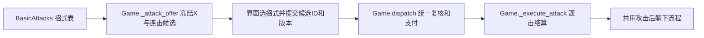
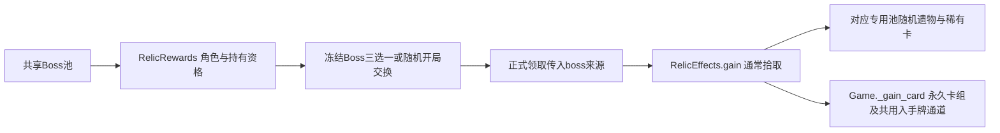

# 《紧缚尖塔》玩法与资源真源

本文件是玩法流程、资源、奖励、遗物与事件数值的唯一真源。同一事实不在其它文档重写：

| 主题 | 真源 |
| --- | --- |
| 卡牌数值、关键词、牌区、增益、卡牌音乐 | `./cards.md` |
| 装备模板、复合/链接/肩部/躯干固缚、施加与替换 | `./equipment-design.md` |
| 第一幕敌人逐怪行动与出场池 | `./enemies-first-floor.md` |
| 监狱、刑期、巡视、援军 | `./prison.md` |
| 诅咒平板锁分支 | `./cursed-plate-lock.md` |
| 角色2 覆盖值 | `./character-two.md` |
| 内容包、注册表、随机域、事件效果白名单 | `./content.md` |
| 键位与输入 | `./input-controls.md` |

数值集中在 `data/balance.gd`；未注明者仍属可调原型值。所有玩家行动只有唯一提交入口 `Game.dispatch(candidate_id, expected_version)`，显示层只读 `get_view()`。

## 1. 游戏基础

- PC 优先的 Godot 单机爬塔；玩家用随身体状态变化的固定行动攻击敌人，用卡组挣脱、调度与准备，两者共用能量。
- 敌人主要施加、加固、上锁装备，不造成生命伤害；拘束改变身体能力，不是第二条生命条。
- 战后保留装备、耐久、锁、组件、连接、魔力与明确允许跨战的增益。
- 不迁入旧网页版的连续高度、地图格移动、复杂接触几何、扣件、绳结、装备脱落中间状态与词条；卡牌升级暂不设计；驷马与折叠姿态不在本批范围。

## 2. 属性与资源

| 项目 | 现值与规则 | 出处 |
| --- | --- | --- |
| 力量 | 角色值＋常驻遗物＋当前手牌加值（最低0）；加入挣扎与体术每段基础伤害，不加火球与固定切割 | `RelicEffects`、`BasicAttacks` |
| 灵巧 | 加入普通／魔法滑脱基础值；丝袜按实际滑脱部位判定，一件跨多部位最多＋2 | `data/relics.gd::TYPES`、`Cards` |
| 能量 | 每玩家回合恢复，基础3；攻击、卡牌、姿态转换共同消耗 | `data/balance.gd::ENERGY` |
| 魔力 | 上限100，初始满；战斗与整备不自然恢复 | `data/balance.gd::MANA_MAX` |
| 快感 | 0—阈值100；达到阈值立即高潮并保留余数 | `core/pressure.gd` |
| 临时魔力 | 每层魔力预备立即提供5点，独立余额无上限；优先抵扣耗魔 | `Cards::RESERVE_MANA_VALUE` |
| 蓄力 | 每层使主动挣扎／滑脱／体术基础＋3；普通模式每次消耗1层，全量模式一次清空 | `data/balance.gd::CHARGE_BONUS` |
| 贴身魔瓶 | 初始0，无容量上限，不占道具格，每次存取至多10点；战斗中每回合存入、取出各最多3次；整备每回合最多存入3次，取出不限次数；牢房探索回合最多存入1次，取出不限次数；其他非战斗阶段存取不限次数 | `core/mana_flask.gd` |
| 随身道具容量 | 3－上肢扣减－下肢扣减（范围1—3） | `Game.capacity` |

跨场次保留上限：额外能量1点、蓄力2层、临时魔力20点；乌龟壳各＋2（3点／4层／30点）。战斗中积累不受保留上限截断；入狱与续局清空。

## 3. 回合、时序与场次边界

- 回合开始按姿态确定先后手并冻结敌人意图：站／坐为先手（玩家→敌人），躺为后手（敌人→玩家）；本回合内换姿态不重判先后手。眼部被真实装备遮挡时意图隐藏，见 §12。
- 每个行动完成后立即更新装备、能力、目标与姿态条件；敌人本回合施加的装备立即生效。
- 打断延后目标行动阶段一回合，不删除、不重抽；所有打断技共用冷却（使用后下一回合不可再用）。
- 最后一名敌人被击败或离场：当前行动结算完成后立即结束战斗，剩余能量作废。多敌遭遇整场只发一次奖励、一次回魔与整备。
- 装备空间耗尽逮捕：场上所有存活人形／机械敌人都无法再对玩家合法添加、加固或有效替换装备时预告逮捕，下一次敌人行动收押。原样换回同状态的装备不算有效替换；仍可加固到三档或依法上锁仍算加固。
- 饱和离场：场上已无人形／机械敌人时敌人离场但不算击败，停止依附效果，正常发放一次战后奖励并进入整备；必须击败的战斗不适用饱和奖励。
- 长战斗门槛：非Boss战中，当前战斗回合≥15，且身上拘束具数量≥20或总紧度≥40时，在行动／回合结算边界执行。数量与总紧度沿佩戴件数口径：普通装备和特殊装备各算一件，复合装备按有效主体算一件，附属组件、连接绳、限制项圈不重复计入。非人形怪（包括机械怪）自动离场，保留生命且不算击败、不触发击败分裂；全部敌人离场后按胜利正常结算一次。没有捕缚机制的人形怪改为逮捕预备，下一次未被打断的敌方行动执行原收押流程；满足门槛时可反复准备，重复判定不覆盖当前打断。已有捕缚机制的人形怪沿用原机制。混合敌群中的人形怪仍在场时不提前胜利；Boss战及其全部随从整体排除。
- 战斗结束顺序：遗物回魔 → 奖励 → 整备回合（基础3，整备沙漏＋1）→ 超载整理 → 离开；可提前结束，未用回合不兑换资源。战斗结束效果统一延到整备结束只触发一次；休息离开只清理、不触发战斗结束收益。
- 特殊场次：牢房与休息各开自己的场次，战后整备沿用原战斗场次；整备正常进入新回合，但开场与每场一次效果不重置。
- 投降：战斗且有存活敌人时可用（含高潮中断期），二次确认后走正式收押，不发放战斗奖励。

## 4. 快感、过载与施法成功率

### 4.1 分档与过载后果

| 快感占上限 | 分档 |
| --- | --- |
| 0 | 平稳 |
| 0—40% | 低压 |
| 40—80% | 紧张 |
| 80—100% | 高压 |

| 事件 | 结算 |
| --- | --- |
| 高潮一次 | 立即损失20自身魔力；下一玩家回合能量−1（可叠加）；清空剩余能量、弃牌、取消未完成选牌，点击“继续 · 本回合已过载”推进 |
| 滑精（佩戴平板锁＋马眼条件） | 免除即时魔力损失，改为后续两个玩家回合开始时各损失10魔力、能量−1；下一玩家回合固定后手；重复触发刷新为2回合 |
| 事件阶段高潮 | 即时扣20自身魔力，不延后、不刷新滑精回合 |

高潮中后续的解除、抽牌及能力／遗物计数仍正常结算，但回能实际获得0点，不能重新获得本回合可用能量；下一回合能量奖励照常保留。能量获得统一经 `Game._gain_energy`，不会因拘束之拥等后续回能使已完成的行动与高潮回滚。

数值出处：`data/balance.gd::OVERLOAD_MANA=20`、`SLIP_EJACULATION_MANA=10`、`OVERLOAD_ENERGY=1`；滑精判定见 `core/pressure.gd::_apply_overloads`。

每次高潮后，蓄力层数减半，剩余层数向下取整（5→2、1→0）；一次结算多次时逐次减半。普通、滑精及事件／脚本触发统一适用。蓄力归零时关闭全量模式，仍有剩余时保留当前模式；后续跨回合与整备保留沿原规则。数值为 `OVERLOAD_CHARGE_RETENTION=0.5`，在同一高潮结算入口执行。

### 4.2 主动降低

- 深呼吸：每回合最多2次、1能量，基础降低20快感并获得下回合能量＋1。嘴部拘束等级＋紧度总值2／3／4／5／6 对应实际降低16／12／8／4／0；高级且三档禁用（不付费、不发放能量）。
- 完全自由：角色没有任何普通／复合拘束、组件、肩带、链接或特殊装备且未被捕缚时，每个实际回合结束快感−2（固定减值，不经增长倍率）。
- 冰心诀等遗物减值与该规则叠加。

### 4.3 施法成功率（本规则只写在此处）

同一套公式用于卡牌魔法、固定火球与牢门开锁。令 p＝当前快感占上限比例：

| p | 基础成功率 |
| --- | --- |
| ≤0.5 | 100% |
| >0.5 | x＝clamp((p−0.5)/0.5, 0, 1)，成功率＝(1−x)² |

持有“欲望魔方 Pro Max”时，上表改为 `P(p)=[4p(1−p)]^(ln(0.5)/ln(0.75))`，p 仍为当前快感／当前上限，限制在0—1。快感0%／100%时基础成功率0%，25%／75%时50%，50%时100%；关于50%对称且连续。仅替换施法的快感基值，后续部位拘束倍率、保底与必定成功、0%不可施放的规则均保留；牢房移动等非施法用途不改用该曲线。

参考点：50%→100%，60%→64%，75%→25%，90%→4%，100%→0。出处 `core/pressure.gd::cast_chance`，`data/balance.gd::CAST_SAFE_PRESSURE=0.5`、`CAST_FALLOFF_POWER=2`。

| 施法部位 | 额外条件与乘区 |
| --- | --- |
| 嘴部 | 乘口部装备等级倍率初／中／高＝0.5／0.25／0.0，再乘当前紧度倍率一／二／三档＝1.5／1.0／0.5 |
| 手部 | 默认双手的手掌和手指都自由；持有施法动作教程时放宽为任意一只完整自由手 |
| 手部或嘴部 | 任一可用即可，自动取当前成功率最高的路径 |
| 无 | 无额外身体条件，仍判成功率 |

- 倍率出处 `data/balance.gd::MOUTH_CAST_GRADE`、`MOUTH_CAST_TIGHTNESS`；口部装备模板见 `./equipment-design.md`，本文件不重复列装备行为。
- 最终成功率四舍五入到0.01%，显示、可用性与抽签共用该值；成功率0时不可施放并显示原因，不扣费、不掷随机。
- 成功／失败都结算已支付的能量与魔力；失败返还50%本次实际耗魔（自身与临时魔力分别返还至原池），能量不退，卡牌留手（含消耗牌），不产生伤害、开锁或后续连段。不可用、费用不足或过期提交不属于施法失败，不支付任何费用。
- 施法随机使用独立 `magic` 随机域；预览／悬停不抽随机，存档保存计数。
- 免费准备面不掷成功率但仍检查身体条件；定咒卷轴与余烬晶石提供本回合保底成功，不绕过身体、目标与资源资格。

## 5. 身体能力与姿态

### 5.1 束缚等级

| 上肢／下肢 | 贡献 |
| --- | ---: |
| 大臂／大腿 | 0.5 |
| 小臂／小腿 | 0.5 |
| 手腕／脚踝 | 2 |
| 手掌、手指／脚掌、脚趾 | 任意命中合计1，全部命中也不再增加 |

0分为0级；>0且<2为1级；2至<3为2级；≥3但未全覆盖为3级；区域全部计数部位实际受限才是4级。同部位堆叠不重复计分，复合组件按真实覆盖计数；肩带与链接只有明确限制对应部位时才贡献。

具体能力（手指精细、握持、双手独立、屈肘、上臂展开、触及范围、双腿独立、髋、膝、足部支撑、脚趾精细）可直接关闭动作；身后／躯干固定限制体术与触及，但不额外要求魔法手势在身前完成。

### 5.2 姿态转换

| 腿部等级 | 站→坐 | 坐→站 | 坐→躺 | 躺→坐 |
| --- | ---: | ---: | ---: | ---: |
| 0—1 | 1 | 2 | 1 | 2 |
| 2 | 1 | 3 | 1 | 2 |
| 3 | 1 | 3 | 1 | 3 |
| 4 | 1 | 4 | 1 | 3 |

双臂等级≤1时每一步再减1能量（最低0）；贴墙时再减1（多面墙不重复）。零费转换不刷新能量、次数或先后手。不能支付能量绕过结构上无法完成的转换。

### 5.3 距墙与室内移动

普通战斗开始时独立随机距墙1—4格，使用独立随机域并存档；牢房内反抗狱警战的位置规则见 [监狱设计](prison.md)。休息房与首次入狱初始为0并已贴墙。室内距离限定0—4，到达0获得贴墙，离开0失去。

| 现有房间间移动回合 | 室内每次距离 | 每次能量 |
| --- | ---: | ---: |
| 1（正常站立） | 2 | 1 |
| 2（小步） | 2 | 2 |
| 3（短步） | 1 | 2 |
| 5或10（并腿、坐躺挪动） | 1 | 3 |

墙面加成、贴墙起身、工具安装／使用／取回、挂钩与通风口都检查同一个贴墙状态；贴墙不另存第二份 Buff。

### 5.4 固定攻击

| 攻击 | 能量 | 默认形态 | 右键形态 |
| --- | ---: | --- | --- |
| 肘击 | 1 | 8点×1 | 4点×2 |
| 近身短打 | 2 | 18点×1 | 6点×3 |
| 腿部 | 2／2／1 | 正义飞踢（站姿、双腿自由、可连续使用） | 横扫（全体5点、不打断）／站着踢（8点，腿部≥1禁用）／坐着踢（6点，腿部≥4禁用） |
| 火球术 | 首发1，之后0 | 攻击敌人；魔力基础10 | — |
| 深呼吸 | 1 | 见 §4.2 | — |

- 体术每段伤害＝（招式基础伤害＋基础伤害加成＋当前总力量＋蓄力加成）×对应部位严密度伤害倍率×其他增伤倍率×敌人受伤倍率，再受敌人护身屏障等限制。力量、蓄力仍在严密度乘区之前相加；普通蓄力加3，全量蓄力加3×层数，整次体术只消耗一次，多段每段沿用该次冻结收益。双臂／双腿严密度0—4级的伤害倍率为100%／100%／80%／60%／40%，出处 `data/balance.gd::BODY_DAMAGE`，统一计算入口 `BasicAttacks.physical_damage`。肘击与近身短打取双臂等级，踢击与横扫取双腿等级。招式可用条件独立判断，手臂体术仍3级起不可用；小魔女腿部施法成功率沿角色2原规则。
- 坐姿踢击与并腿动作共用3回合冷却（第1回合用后第4回合恢复），换姿态不刷新；正义飞踢、横扫、站着踢／坐着踢不读写这组冷却。
- 连续踢！：坐姿腿部动作，耗尽使用前的全部剩余能量X，至少需要1能量；连续攻击同一目标X＋1次，每次基础伤害3，逐击沿用力量、蓄力与腿部体术倍率。腿部严密度4级禁用；无自带打断、不读写踢击冷却。X≥3时在连击结束后躺下，提前击杀仍躺下且不转移目标；捕缚固定姿势时沿用既有攻击后躺下限制。X费用不受固定体术减费影响。

- 躺姿只提供魔法攻击；挣脱、道具与合法起身仍可用。
- 火球术以嘴部施法并按施法成功率判定；满足手部施法条件时获得威力加成（基础8→12，出处 `data/basic_attacks.gd::fireball_damage`、`data/balance.gd::FIREBALL/FIREBALL_ASSISTED`）。每玩家回合默认2次上限，首发1能量、之后0能量；失败不消耗次数。

## 6. 装备的统一规则

装备模板、复合结构、链接、肩部与性玩具清单见 `./equipment-design.md`；本节只写一切装备共用的数值与判定。

### 6.1 耐久、紧度、加固与降档

令 p＝当前耐久／最大耐久。

| 状态 | 比例 | 初次按该档施加 |
| --- | --- | --- |
| 解除 | p＝0 | 不适用 |
| 一档 | 0＜p≤0.4 | 0.4 |
| 二档 | 0.4＜p≤0.8 | 0.8 |
| 三档 | 0.8＜p≤1 | 1 |

- 加固：一档→0.8，二档→1，三档补满；最大耐久与等级不变。
- 统一降一档保持档内进度：三档 p'＝0.4＋2(p−0.8)；二档 p'＝p−0.4；一档归零移除。
- 耐久归零立即移除，不保留松垮、卡住或等待脱落的中间状态。
- 紧度是整数1／2／3档；同档内按耐久百分比比较，只有百分比相等才算并列。

### 6.2 伤害

- 挣扎＝基础＋力量；滑脱＝基础＋灵巧；再乘（1－紧度减免率）。40%耐久减免率为0，更低加伤，更高减伤。
- 三档免疫普通滑脱；明确声明的特殊滑脱只突破紧度免疫，不突破结构禁滑脱。
- 上锁使最终挣扎伤害×0.5（软化扣环改为×0.75），不影响滑脱、切割与魔法降档。
- 手部辅助：每只手先看手指自由，手指受限贡献0；手指自由时手掌可用＋1、手掌不能用＋0.5，两手相加最多＋2，适用于挣扎／滑脱／魔法滑脱，不耗能、不消耗层数。出处 `core/hand_assist.gd`、`core/contact.gd`。
- 部位倍率（主动普通滑脱与魔法滑脱，复合件覆盖多点取最大）：肩部1.20／1.20／1.20；大腿根1.50／1.20／1.20；大腿中部1.30／1.10／1.10；膝盖上方1.20／1.05／1.05；膝盖下方1.30／1.10／1.10；小腿中间1.20／1.05／1.05；脚掌与脚趾1.00／1.20／1.20（站／坐／躺）。出处 `core/slip_motion.gd::FACTORS`。
- 移动被动：每完成一次正能量室内位移、每个跨房实际移动回合、每次付费探索移动各触发一次；从每个适用点最外层且支持挣扎的物理件中随机抽取，按物理ID去重，伤害＝（部位系数＋角色与遗物灵巧）×现行滑脱乘区，不加手牌灵巧、环境加成、辅助与蓄力。

### 6.3 堆叠与目标

- 普通部位最多3件，手指／手掌／脚掌／脚趾最多2件；眼口容量与嘴部叠加条件见 [装备设计](equipment-design.md) §4。材料混合不增加容量。
- 分层滑脱只选最外层，判定读取同部位最高耐久比例，伤害仍扣目标本身；不分层滑脱可选任一合法目标，非最高紧度时最终伤害再减半。
- 挣扎选最高紧度目标，分层并列取最内侧，不分层并列由玩家选择。

| 目标档位 | 堆叠除数（N为该部位相应档位有效装备数） |
| --- | --- |
| 三档 | N3＋0.5N2 |
| 二档 | 0.75N2＋0.25N1 |
| 一档 | max(1, 0.5N1) |

- 数量包含目标本身；复合装备与其组件不重复计数，跨部位同一组件一次伤害只算一次。
- 链接不占普通容量，也不进入堆叠除数。

### 6.4 锁

皮革目标可上锁，同一目标只有未锁／已锁，重复上锁不叠加；复合装备按实际组件上锁。开锁只移除锁，不改耐久、不解除装备。绳索、细绳、皮带、细皮带、胶带、扎带保留材料与适用部位概念；旧干湿与粘性例外不继承。

### 6.5 等级、生成顺序与添加优先级

等级由种类、结构、基础最大耐久共同定义；施加紧度独立，加固、损耗与上锁不改等级。

| 类型 | 初级 | 中级 | 高级 |
| --- | --- | --- | --- |
| 普通绳／细绳／皮带／细皮带／胶带／扎带 | 基础材料 | 中档材料 | 加强材料 |
| 普通／胶带眼罩、单侧手部包裹 | 基础版本 | 中档版本 | 高耐久版本 |
| 躯干固缚 | 三档单件触发 | 三档单件触发 | 三档单件触发 |
| 单手套、单腿套 | 不进池 | 开放 | 强化结构版本 |
| 拘束衣 | 不进池 | 较少 | 常规 |
| 链接绳 | 独立池 | 独立池 | 独立池 |

生成顺序：来源材料限定与等级 → 枚举合法模板及目标 → 筛选最高添加优先级 → 按权重选结构／模板／目标／材料版本 → 独立初始紧度 → 公开冻结 → 执行复核。

| 优先级 | 部位 |
| --- | --- |
| 1 | 未拘束手腕 |
| 2 | 未拘束嘴部、手指（二者同级） |
| 3 | 所有其他合法新增：其他空部位、脚掌、脚趾、已有装备的手腕／手指／其他部位，以及链接类拘束具 |

- “未拘束”读真实装备覆盖，不是区域束缚等级；独立腕部装备即使不增加活动等级，也使该腕成为已有装备。
- 先检查来源可用材料、装备等级、精确侧别、容量、层级、封闭结构与连接前提，再在合法候选中取最高优先级；缺少合法候选跳到下一档，不强装。
- 同档内先选能覆盖尚无拘束具的小部位的方案，再考虑重复叠加或链接；只有该档没有空小部位可加时才从该档其余方案选择，不跨档找空位。小部位使用真实精确安装点（大臂上侧／手肘上方、小臂两段、大腿三段、左右手掌／手指）。
- “提升区域紧密度”通过先补空小部位实现，不按区域等级、提升幅度或空点数量评分；区域已4级仍可优先补其尚空的小部位。
- 复合按实际覆盖部位中的最高原优先级归档，其主体与组件真实覆盖的小部位均计为已有拘束；手部按真实左右侧别判断。
- 普通池含绳索类或皮带类时自动包含合法链接绳（显式 `link_rope` 池也可用），归其余合法项，不继承两端的较高优先级；必须已有两端真实装备，不免费补端。纯胶带、扎带、口球、复合或特殊装备池不会自动扩充为绳索／皮带池。
- 明确指定材料或部位的技能／事件先限定范围，再执行此顺序；连续批量生成时每装一件后更新状态再生成下一件。
- 本顺序只决定新增目标，不改变加固、上锁与替换的既定目标规则；没有新增目标不自动变成加固，除非该技能明确声明。

## 7. 卡组与场次中的牌

- 初始10张（角色1：用力！×4、顾涌！×4、魔力撑隙×1、魔力松缚×1），每回合抽5，手牌上限10。卡牌数值与两面效果见 `./cards.md`。
- 普通牌用后弃置，抽牌堆耗尽洗入弃牌堆；回合末弃手牌，保留牌除外。
- 消耗牌本场战斗及随后整备不恢复，下一场新战斗重建完整牌堆；牢房每次完整检查后把消耗牌移回弃牌堆。
- 非能力牌打出后先进入内部“使用中”牌区，自身效果、自动顺延与复放全部结束后才进弃牌堆或消耗区；使用中的牌不参与本次效果触发的重洗。
- 中途反抗不提前恢复，反抗战斗继承当前牌组状态；再次入狱重建完整牌组。
- 诅咒牌与状态牌的不打出、保留、支付触发等行为见 `./cards.md`；诅咒不随战斗结束消失，只有明确删牌／解除诅咒才永久移除。

## 8. 遭遇、敌人与失败

- 第一幕弱怪按当前装备条件筛选并随机组队至总强度2（可一只强度2或两只强度1），前三场普通战斗使用弱池，之后按总强度4的已登记强怪组合抽取并排除上一场组合；精英与塔顶为固定遭遇。逐怪行动、装备池、生命与强度见 `./enemies-first-floor.md`。
- 敌人意图在执行时复核目标：加固目标失效则改选其他合法目标，全无目标则空过；上锁同理。改变目标写入行动日志，不增加操作次数、不提前行动、不取消打断。
- 失败＝被收押：保留装备、魔力、卡组、遗物，清增益、没收道具，按安全等级追加装备与链接，结束当前场次遗物，不给胜利奖励或整备。流程与数值见 `./prison.md`。
- 捕缚是独立战斗状态（共用进度条、来源叠加、出现期间的姿态与移动限制、达到100后的收押）：来源与逐敌人数值见 `./enemies-first-floor.md` §6。

## 9. 奖励、整备、房间与塔路

### 9.1 战后与整备

- 战后战利品弹窗按行显示卡牌、道具、遗物；卡牌行打开三选一，Boss 遗物打开独立三选一；可跳过该行，跳过不发放内容、不退款、不重抽。
- 奖励牌可跳过，不撤销已发生的事件代价；新道具先进待整理区，整备末尾选择携带。
- 整备沿用当前手牌／抽牌堆／弃牌堆／消耗区，正常补能抽弃；奖励新牌加入永久卡组及当前弃牌堆。

### 9.2 商店、宝箱与休息

商店货币是魔力，可选自身魔力或魔瓶付款（单次付款只用一种来源，不足即拒绝整笔交易，不自动混付）；商店付款不是施法，不能用临时魔力，不触发施法返还与耗魔遗物。付款演出与付款后对白只读取本次进店后的交易；进店和浏览商品不触发付款CG，换塔复用房间编号不得继承旧店演出。

| 商品 | 价格 |
| --- | ---: |
| 普通牌／罕见牌／稀有牌 | 20／30／50 |
| 普通遗物／罕见遗物／稀有遗物／特殊补位遗物 | 50／70／100／45 |
| 小石片／锯条／开锁针 | 10／15／18 |
| 药剂与卷轴 | 各15 |
| 删牌 | 初始30，每成功购买一次固定＋20（30／50／70／90／110……），每店一次，次数跨店与出狱保留，新局归零 |
| 拘束解除 | 普通件20，完整复合＋15，处理组件中有锁再＋10（锁定复合件共45） |
| 刷新商品 | 初始50，每成功刷新一次翻倍（50／100／200／400……）；整局累计，换店、出狱与Boss后继续下一轮不重置，新局归零 |

出处：`data/room_services.gd::CARD_PRICES/RELIC_PRICES/PRICES/RELEASE/REMOVE_INCREASE`；回归断言见 `tests/service_cases.gd::removal_prices`。

会员卡为商店限定稀有遗物，本体原价100魔力，只能用自身魔力购买。获得后立即使商店全部商品、删牌与拘束解除服务五折，其余交易仍沿用各自的付款来源规则。库存保存原价，候选、显示及实际付款统一计算折后价，允许小数；删牌先按累计次数计算原价，再打折，读档及重进商店不重复折扣。会员卡不可叠加，不进入战斗、宝箱或Boss遗物池。

- 商店货位固定2普通＋2罕见＋1稀有卡牌、4种不同道具、3个一般遗物货位；卡牌与道具在各自池内不放回抽取，不读取卡牌稀有率修正；遗物按普通50%／罕见33%／稀有17%，抽中空品质池时按§10.1的品质补位规则处理。库存与已售状态随房间保存，重开界面不补货。
- 店主立绘右上角可付费刷新全部商品，按同一货位规则重新抽取并补满已售货位；已购所得、删牌服务已用状态保持。刷新沿用自身／魔瓶付款、平板锁限制及会员卡五折；不足或过期提交不扣款、不涨价、不改变库存和随机。库存和累计次数随快照保存；不新增购物中途存档点，正式SL遵循既有场景固定点。
- 宝箱免费领取1件遗物，不进行付款判断；可以不领取直接离开，不能返回重复领取。
- 休息房共6回合：花3回合随机得1张稀有卡／花3回合从三张已冻结的罕见卡中选一张／花3回合补50魔瓶魔力，也可跳过保留全部回合；罕见候选入场冻结、组内不重复，固定稀有度抽取不推进稀有率修正。挂钩每房3次，休息内禁用卡牌自由效果、不自然回魔。

| 宝箱 | 出现率 | 普通 | 罕见 | 稀有 |
| --- | ---: | ---: | ---: | ---: |
| 小宝箱 | 50% | 75% | 25% | 0% |
| 中宝箱 | 33% | 35% | 50% | 15% |
| 大宝箱 | 17% | 0% | 75% | 25% |

- 精英战每场掉一件遗物（整队一次），普通战不掉遗物；奖励以独立 `relic` 随机域生成；滚木无效果、可重复领取并只显示一个图标计数。
- 战后道具掉落：每幕初始40%，本战掉落后下次−10个百分点，未掉落＋10，限制0—100%；每场成功结束的战斗最多掉1件，使用独立 `item_drop` 随机域；收押、事件、休息与领奖不执行掉落。

### 9.3 塔路与前进

- 一幕共7列、15层普通房间、6条路径，第16层固定首领六缚，第17层出口；只连接相邻楼层，不交叉、不跳层，生成后固定。
- 固定层：第1层普通战斗、第9层宝箱、第15层休息；前5层不出现休息／精英，第14层不出现休息。房间配额按商店5%、休息12%、事件22%、精英8%、其余战斗形成候选袋后打乱分配，并限制同父分支与相邻重复。
- 只能沿当前房间的真实连线前往相邻上一层；无连线的相邻房间、其他分支、跨层与已走过房间都不可进入。点击不可达节点只显示原因，不移动、不付费、不推进随机。
- 出发时固定起点、终点与本段行程；每个移动回合重新检查真实连线，无效行程在时间、资源与移动被动结算前拒绝。

| 当前姿态与实际固定 | 移动表现 | 相对速度 | 相邻房间耗时 |
| --- | --- | ---: | ---: |
| 站，双腿未共同固定 | 正常行走 | 5 | 1回合 |
| 站，仅大腿共同固定 | 小步行走 | 3 | 2回合 |
| 站，小腿共同固定 | 短步移动 | 2 | 3回合 |
| 站，脚踝／脚掌／脚趾任一共同固定 | 并腿跳跃 | 1 | 5回合 |
| 坐／躺 | 挪动 | 0.5 | 10回合 |

- 统一路程5，耗时＝向上取整(5/速度)；多个站姿限制取最慢一项。自行开牢门要求相对速度≥1；移动本身不抽牌、不补能、不消耗“下一玩家回合”增益、不额外收能量。
- 离房：完成整备／奖励／整理后点击相连节点即同时结束当前房间并出发；剩余整备／休息回合在出发时放弃。未完成的战斗、领奖、事件选择、过载与手牌续段不能借选点跳过。
- 本局标识＝（初始种子 `state.initial_seed`，塔路次数 `state.tower_generation`＋1）。地图工作区角落显示“初始种子 N · 第 K 次塔路”，点击复制含四要素的文本（初始种子／第几次塔路／当前塔路种子／精确复现需同批存档）；复制只写剪贴板，不派发候选、不读随机、不写盘。标识只回答“哪一局”，不保证单独复现当前进度（见 `./content.md` §3）。

### 9.4 第0层开局选择

正式新局在第0层冻结五项选择：卡牌、资源／遗物、代价交换、固定的“失去初始遗物换随机Boss遗物”，以及第四项下方的“失去你的初始遗物，获得欲望魔方 Pro Max”。第五项仅限魔法少女，移除余烬护符；小魔女仍为原四项。欲望魔方 Pro Max 同时进入两名角色的Boss遗物池，也能从随机Boss遗物交换取得。只能选择其中一项。查看与场景 SL 不重抽；练习场与续塔不重复发放。旧存档的四项开局继续按原冻结结果显示。

| 类型 | 选项 |
| --- | --- |
| 卡牌 | 移除1张牌；变化1张基础牌（普通／罕见）；罕见卡三选一 |
| 资源 | 魔瓶＋40；魔力上限＋10并恢复10；随机普通遗物；道具容量永久＋1并随机药剂1瓶 |
| 代价 | 魔力上限−10换稀有卡三选一；自身魔力−40换随机稀有遗物；随机诅咒换魔瓶＋100；加入用力！／顾涌！各1换普通／罕见遗物各1；佩戴中级三档无锁手腕绳索换随机罕见遗物 |

选项权威为 `data/departure.gd`，生成与原子结算在 `core/departure.gd`；选择本身零回合，不触发战斗开始／结束收益。开启主页“抖M专用版”时初始遗物替换为诅咒平板锁，选项减少为卡牌／资源／代价三类（见 `./cursed-plate-lock.md`）。

## 10. 遗物、属性与特殊战斗

### 10.1 遗物表

- 百变怪：商店限定罕见遗物。每次类战斗场次开始时，从当前角色可用、非拾取触发且非Boss遗物中随机选择形态，包含滚木及已持有遗物。重复形态额外生效一份，累计进度和触发次数独立。形态持续至下次场次开始重新随机；战斗接续的整备和普通换回合不重抽。重抽清空百变怪上一形态进度，不影响原遗物；存档保存当前形态与独立进度。
- 扫描全能王：商店限定罕见遗物，沿用罕见遗物价格及商店支付规则。拾取时从当前卡组选择一张牌，复制进卡组及弃牌堆；基础牌（含小魔女基础牌及脱缚练习各阶段）、双面都唯一的能力牌不可选。复制保留永久卡牌实例信息、分配新编号，不复制本场临时增益。可跳过，空候选时也可返回；复制／跳过后不能再次触发；正常续玩及SL沿用[场景固定点](../spec/save-fixed-points.md)，不新增购物中途存档点。

`data/relics.gd::TYPES` 是遗物名称、稀有度、效果与触发钩子的唯一真源；下表为现行摘要。

| 名称 | 稀有度 | 效果 |
| --- | --- | --- |
| 余烬护符 | 普通 | 战后整备结束时恢复10魔力；休息结束不触发；初始持有，不入随机池 |
| 折叠工具匣 | 普通 | 随身道具容量＋1 |
| 小宝石 | 普通 | 每场第一个玩家回合额外获得1能量（战斗、整备、休息与牢房共用同一入口） |
| 准备背包 | 普通 | 每场第一个玩家回合额外抽2张牌（同一入口） |
| 小刻印 | 普通 | 战斗开始时恢复5魔力 |
| 体术书 | 普通 | 力量＋1 |
| 草莓 | 普通 | 拾取时魔力上限＋6并恢复6 |
| 传单 | 普通 | 进入商店时向魔瓶补充20魔力 |
| 爆炒麻辣米线 | 普通 | 战斗／牢房／休息开始时获得2层蓄力 |
| 冰心诀 | 普通 | 回合结束时快感−3 |
| 回身缎带 | 普通 | 战斗中并腿踢击后躺下，本回合下一次躺→坐少1能量；每玩家回合1次 |
| 整备沙漏 | 罕见 | 战后整备延长1回合 |
| 西兰花 | 罕见 | 战后整备或牢房探索结束时若魔力≤上限50%恢复20；休息不触发 |
| 断缚护腕 | 罕见 | 挣扎直接使目标归零后，行动结束获得1层蓄力；每玩家回合1次，连带移除不算 |
| 破铜烂铁机器人 | 罕见 | 持有时，机械系敌人的体术减伤改为25%，即受到75%的物理伤害；多段逐段、群攻逐目标计算。魔法、固定伤害与非机械敌人不受影响。与复制到同效果的遗物并存仍为25%，不加算 |
| 日晷 | 罕见 | 每洗牌3次获得2能量；0—2次进度跨战斗保留，开场初始化牌堆不计数。复刻原版：一次抽牌未满足数量且抽尽两堆时，末尾空洗牌也计1次；因此空抽牌堆、1张弃牌抽2张计2次。起始两堆皆空、抽0张或手牌已满不计数 |
| 大魔棒 | 罕见 | 每成功打出1张带技能词条的牌积攒1点，0费牌计数，复放不额外计数；点数跨回合、跨战斗与存读档保留。右键遗物图标消耗全部点数，恢复等量自身魔力；到15点自动兑换并清空。恢复不超过魔力上限，满魔兑换也清空；不消耗能量或推进回合 |
| 护腕 | 普通 | 手腕被拘束时力量＋2；动态判定，多件不叠加，手腕恢复自由后失效 |
| 怨灵系带 | 普通 | 灵巧＋1 |
| 空灵挂件 | 普通 | 每个整备回合结束时恢复1魔力，不超过上限；提前结束整备不补未经过的回合 |
| 智力斗篷 | 普通 | 有固定耗魔数值的魔法牌最终耗魔每件－1、最低0，可重复获得并叠加；耗尽全部魔力的牌保持原规则；普通遗物池耗尽时替代滚木补位，其他品质保持滚木 |
| 游丝指环 | 罕见 | 每回合首次卡牌滑脱使拘束具降档或解除，行动结束抽1张牌 |
| 光滑的丝袜 | 罕见 | 腿部、脚踝与足部灵巧＋2 |
| 奥利哈基米 | 罕见 | 回合结束时若本回合未消耗魔力，恢复8魔力 |
| 魔血 | 罕见 | 力量＋2；回合开始时快感＋5 |
| 斧护符 | 罕见 | 进入精英房、Boss房或监狱时恢复20魔力 |
| 虾滑 | 罕见 | 拾取时魔力上限＋12并恢复12 |
| 欧内的手 | 罕见 | 拾取时把1张无“消耗”的魔术手加入卡组 |
| M当劳 | 罕见 | 商店限定、仅魔瓶付款；拾取时魔力上限＋10并回满 |
| 会员卡 | 稀有 | 商店限定，购买与五折规则见§9.2 |
| 开心小fa | 罕见 | 每累计3个玩家回合获得1能量；进度跨战斗保留 |
| 优秀学员毕业证书 | 罕见 | 用力！与顾涌！的卡面基础伤害＋4 |
| 乌龟壳 | 稀有 | 跨战斗保留上限：额外能量3点、蓄力4层、临时魔力30点 |
| 绿色小鸟 | 稀有 | 每场战斗（含随后整备）、牢房探索与休息的前6个玩家回合，快感不超过上限−1 |
| 寸止钢印 | 罕见 | 每场类战斗1次，数值达到快感上限时快感减半，然后获得3层蓄力；绿色小鸟先限幅，未达上限不耗次数。战斗与接续整备共享次数，休息与牢房探索各自刷新；剧情直接高潮不触发。减半后仍达上限则照常结算高潮。百变怪独立计次，前一份减半后不达上限时后一份不消耗；图标显示剩余次数，读档保留。 |
| 大理石 | 稀有 | 所有来源的快感增长×0.6 |
| 余烬晶石 | 稀有 | 每回合首次耗魔施法必定成功 |
| 成王之礼精装修订重置版 | 稀有 | 每场战斗第7回合结束对全体在场敌人各造成77点固定伤害，每场一次 |
| 魔力耳坠 | 稀有 | 每场战斗每累计消耗30魔力获得1能量 |
| 甜甜圈 | 稀有 | 未使用能量保留到下一回合 |
| 欲望魔方 | 稀有 | 每被施加一件拘束（复合整件计1次）恢复5魔力 |
| 一只小猪 | 稀有 | 始终视为贴墙；环境工具仍需真实接触 |
| 施法动作教程 | 稀有 | 只需一只手的手掌和手指自由即满足手部施法条件 |
| 触手朋友 | 稀有 | 使用道具不受身体、姿势与触及限制；切割与尖锐工具随身视为已固定 |
| 红烧鱼香茄子 | 稀有 | 拾取时魔力上限＋20并恢复20 |
| 放大镜 | 稀有 | 奖励可选牌数＋1 |
| 秘密武器 | 稀有 | 脚趾可代替手部施法并取较高成功率；脚趾装备等级＋紧度合计2—6时每次牵扯基础快感＋1／2／3／4／6，多件累加 |
| 魅纹师的针匣 | 稀有 | 每回合开始额外抽1张牌；指定事件遗物，不入通用池 |
| 软化扣环 | 稀有 | 上锁拘束具的挣扎倍率由×0.5提高到×0.75；指定事件遗物，不入通用池 |
| 滚木 | 特殊 | 无效果，可重复领取，按图标右下角数量记录份数 |
| 魔女护符·辣椒炒肉拌面 | 角色2专属 | 见 `./character-two.md` |

Boss 遗物池与开局交换只从下表生成，不进入商店、宝箱或精英池：

| Boss遗物 | 效果 |
| --- | --- |
| 抖M印记 | 能量上限＋1；战斗中永远后手，在回合开始确定，本回合换姿态不改变先后手 |
| 豆包／DeepSeek | 同一件遗物，仅在战斗、战后整备、休息及监狱之外右键图标双向切换；能量上限＋1。豆包接管战斗、休息和监狱各自的首个玩家回合，战后整备不接管；DeepSeek 仍在战斗、战后整备、休息和监狱首回合开始时将能量清零，保留玩家操作（可使用合法零费动作或重新获得能量）；玩家自行结束回合，结束效果照常触发 |
| 纹身贴 | 最大能量＋1；拾取时向卡组加入2张淫纹 |
| 诅咒眼罩 | 最大能量＋1；拾取时以高级、三档、上锁的皮革眼罩替换眼部装备并永久佩戴（不再可施加／替换／加固／开锁／解除，事件预演也拒绝解除） |
| 套娃 | 拾取时从普通、罕见、稀有遗物池各生成1件，二级界面分别领取或跳过；领取时才执行拾取效果，品质耗尽按本节补位规则处理 |
| 缚纹金字塔 | 回合结束不再弃手牌；出牌弃置、诅咒触发、虚无与场次结束流程照常 |
| 闪耀的灯球 | 最大能量＋1；拾取时魔力上限−50，当前魔力收至新上限；不足以支付完整代价时不进入候选 |
| 诅咒平板锁 | 能量上限＋1；拾取时强制佩戴三档高级平板锁，只能用下一个Boss的专属钥匙解除；详见 `./cursed-plate-lock.md` |
| 葫芦酒壶 | 拾取时把固有的「般若汤-其一」加入卡组；详见 `./cards.md` |
| 欲望魔方 Pro Max | 两名角色共用，魔法少女保留初始兑换。拾取获得50快感；每场战斗结束（沿现有规则在整备结束时结算，收押则即时结算）获得10快感，休息和牢房探索结束不触发。快感获得走通常增益与过载规则。施法曲线见§4.3，持有时开放角色兼容的淫魔法卡池 |

欲望魔方 Pro Max 从Boss池取得时（包括第0层随机Boss遗物交换）额外赠送：1件随机专用遗物、1张随机淫魔法稀有卡，以及1张永久加入卡组并立即进入手牌的「心痒难耐」。普通基础牌不替换；手牌满时新牌进入弃牌堆。战后领取的新手牌保留到首个整备回合，之后正常弃牌；永久卡组副本不带这次保留。专用遗物沿 `required_relic` 标记筛选，排除已持有项，耗尽用滚木兜底；稀有卡按当前角色适配后限定 `reward_pool="lewd_magic"`，没有合法候选时写明未能获得，不改抽其它池。固定第五项兑换不发这份额外奖励，继续使用原基础牌替换。抽取在正式拾取事务内只结算一次，存档恢复与重复领取不重抽。

初始能量上限3，增加最大能量的遗物相加；增加的是后续回合的恢复基数，不补当回合能量。

豆包接管依次执行：随机是否改变姿态及目标姿态 → 随机是否向墙移动 → 随机执行1—2次可用行动栏动作 → 从左到右打牌（包括新抽牌，能量耗尽停止）→ 随机存取魔瓶0—3次 → 正常结束回合。卡面及目标从合法候选随机选择；没有可用动作时跳过相应步骤，所有支付、限制和效果沿正常规则。失败后留在手中的牌本次不反复尝试，实际重新抽到后可再次使用。中途胜利、收押或进入其他阶段时停止接管；不代领战利品。若卡牌禁止结束回合，归还操作权，保留该限制，不自动投降。

豆包接管期间主角不弹出对话气泡，自动行动台词保留在日志且不在接管结束后补弹；手动行动的新台词正常显示。豆包接管期间锁定游戏界面的鼠标、键盘、触屏及系统返回操作；屏幕中的模拟鼠标按正式候选移动、点击，台词从遗物图标下方的半透明气泡弹出（背景75%不透明度，文字与边框保持清晰）。每步移动约0.65秒，点击提示0.25秒；无语音时台词按长度停留2.4—5秒，启用语音时至少等到对应录音播完再进行下一步，气泡覆盖完整录音。两套原创对白按接管回合稳定选择，不消耗玩法随机；20类对白各有A/B两条用户提供的中文录音，与当前字幕差分一致，额外选择共用选择对白与语音。主菜单「练习与自定义」提供「豆包练习 · 首回合接管」，通过正常遗物获取与战斗初始化进入漂浮玩具箱战斗。

声音设置提供独立豆包语音开关与音量，默认开启、32%；不改变卡牌音乐设置。关闭时立即停止当前录音，字幕和接管照常，重新开启只播放后续台词。普通刷新不重播；返回主页、重新开局及跨阶段时停止旧录音，胜利等结果对白可在其所属结果阶段自然播完。界面语言切换仍沿本地化字幕，中文录音保持原声；素材来源与逐条映射见 `spire-godot/assets/audio/doubao/SOURCE.md`。

DeepSeek 首回合顶部显示「大肥鱼吃掉了你的白饭」，不锁定操作、不自动结束回合。图鉴的豆包条目同时列出豆包与DeepSeek各自图标、描述；战斗悬停仍只显示当前形态。

上述四类阶段内禁止切换模式，首回合开始时记录当前模式；阶段内后续回合与监狱巡视返回不再接管。豆包在战斗转入整备后归还操作权，旧整备接管进度恢复后也不再接管；DeepSeek仍对战斗和整备分别计首回合。原始快照保存接管进度与随机游标，查看和刷新不改变下一步；正式存档仍遵循场景起点固定点规则，不新增接管中途自动保存。

### 10.2 力量与灵巧

力量＝角色值＋常驻遗物＋当前手牌加值（最低0），加入挣扎与三组体术每段基础伤害；灵巧加入普通／魔法滑脱基础值。丝袜按被处理装备的实际滑脱部位判定，一件跨多部位最多＋2。先加基础，再计算紧度、链接、锁、堆叠与位置倍率；既有不可用条件与三档免疫不变，环境真实加成在倍率外。

### 10.3 特殊战斗生命周期

统一 `combat` 保存场次序号、进行中／首回合标记、待继承能量与耳坠余数，与敌人来源用的 `encounter` 编号分离。每场触发按场次序号记账，回合次数用 `tick`。巡视只暂停当前牢房场次，保留待继承能量与耳坠进度；反抗结束当前牢房并开始真实战斗；离开牢房、结束整备与被收押都结束所在场次，战斗结束遗物只结算一次。卡牌能力、定咒与“本场”伤害增益可用于特殊战斗，并在本场结束清除。

### 10.4 续局与出口

- 击败六缚后领取三选一稀有卡与三选一Boss遗物，完成整备才开放出口；抵达出口本身不治疗、不清装备。
- 出口选择“继续游玩”（最多三轮）：怪物生命按1／1.5／2倍缩放（首领数值见[第一幕敌人](enemies-first-floor.md)），使用全新种子重建塔路，保留卡组、遗物、属性成长、随身物与警戒，清除全部装备、捕缚与战斗临时效果，魔力补到上限，快感固定−40并设为站姿。本次重建使本局标识的塔路次数 +1（`state.tower_generation`，出狱返塔同）；初始种子 `state.initial_seed` 不变。

## 11. 事件

事件房在抵达时从本局未出现的事件中抽取，同局不重复；生成机制、效果白名单与作者层字段见 `./content.md`。

| 事件 | 选择与结果 |
| --- | --- |
| 缚疗修女 | 恢复20魔力并佩戴两件随机初级二档普通单件（明确排除链接绳、复合与性玩具）；或高潮一次后删1张自选牌；或免费离开。任一拘束件无法合法安装时整项不出现 |
| 拘束具堆里的微光 | 首次成功率25%，每次失败＋10%，第九次必成；每次尝试无论成败都原子新增一件随机初级二档普通单件（排除链接绳、复合、性玩具）。成功获得一件未持有的随机遗物 |
| 魅纹师的空房 | 回火：指定并同时完全解除两件普通拘束具（少于两件不出现）；翻查：获得魅纹师的针匣并取得永久诅咒淫纹（已持有针匣则不出现）；或离开 |
| 偷渡商人的魔药箱 | 赊账：魔瓶＋90并获得诅咒敏感；或不赊离开 |
| 漂浮皮带群 | 硬闯：三只初级漂浮皮带的指定事件战斗，胜利获得软化扣环（已持有时隐藏）；或接受灌注：恢复25魔力并向卡组加入淫纹。事件战斗胜利后提供正常战后整备 |
| 女药师的试饮摊 | 魔力补剂：恢复25魔力；解缚溶剂：完全解除一件普通拘束具（无目标则不出现）；魅魔特调：获得一件入场冻结的随机遗物并取得敏感（遗物池用尽则不出现） |
| 废弃储物室 | 三个待领取行：药剂、卷轴、工具各随机一件；逐行领取，容量已满则灰置；继续即放弃其余并直接完成事件 |
| 缚梦客房 | 睡到自然醒：魔力回满并原子佩戴三件中级一档普通单件（排除链接绳，任一件无位置则不出现）；拔走床芯：魔力上限永久−8并取得入场冻结的随机遗物 |
| 神秘女人的雕像 | 插入并高潮一次后删1张真实牌；或触发30—60的随机魔瓶魔力；或离开 |
| 迷宫测绘队 | 独自探险：魔瓶＋100并原子佩戴两件中级二档普通单件（排除链接绳，任一件无位置则不出现）；结伴而行：魔瓶＋30 |
| 魅魔的三局赌牌 | 三局赌牌；第三局的解除并戴回原有性玩具只作正文演出，不改装备状态 |
| 魅魔魔力当铺 | 三项交易事件；佩戴平板锁时使用对应差分正文 |

- 拒绝费固定最多10魔力（不足扣剩余全部）；作者声明的免费离开不生成默认收费拒绝。
- 事件奖励类别只有 `common/uncommon/rare/relic/keys/none`；普通／罕见／稀有卡牌奖励分别从对应稀有度生成3张候选（放大镜＋1），可跳过，已付代价不退。

## 12. 眼部受限与意图观察

任何仍覆盖眼部的真实装备都隐藏所有存活敌人的当前意图（普通施加、加固、上锁、蓄力、附加行动、连动与收押准备），不论档位与名称；多件需全部解除。隐藏期间统一显示“意图未知 · 视线受阻”，不通过提示、历史字段或日志透露计划；已发生的装备与资源结果仍保留。解除最后一件眼部装备后立即显示已经冻结的意图，不重抽、不补敌人行动、不改变当回合先后手。

## 13. 存档与恢复

- 每张实体卡必须在抽牌堆、手牌、弃牌堆或消耗区恰好出现一次，类型一致；正式行动与恢复共用同一检查。商店与事件删除的是选中的那张实体牌。
- 进度自动写盘只在进入更高楼层、战斗结束（含收押）、整备结束时触发，由正式迁移声明生成 checkpoint；场景内行动及快速 SL 恢复不再写盘，新局、手动“保存场景起点”和地图批注仍保留原写盘入口。
- 主页恢复最近一次磁盘保存的起点；菜单“快速 SL”恢复当前场景的内存起点，两者共用恢复流程但不保证恢复到同一时刻。
- 内存场景起点仍按原流程冻结：战斗从首次可操作的第一回合恢复，包括已结算的开场效果、初始手牌、敌人、装备、魔力、能量与随机状态；不重新洗随机、不重复发开场遗物。
- 恢复只替换通过校验的完整状态并刷新操作版本，不重新初始化、不补结算；失败保留当前游戏。文件编码版本与快照修订号分开维护：当前 `Snapshot.REVISION` 直接接受；比它早的三档修订号（`core/snapshot.gd::REINFORCEMENT_STATE_REVISION`／`core/snapshot.gd::CUP_STACK_REVISION`／`core/snapshot.gd::IRON_DRONE_REVISION`）由 `core/game.gd::restore_snapshot` 在 `Snapshot.check` 之前按迁移链升级并写回当前修订（`core/snapshot.gd::migrate_cup_stacks`、`core/snapshot.gd::migrate_iron_drone` 与 `data/special_equipment.gd::migrate_reinforcement_state`）；迁移判定旧档数据不完整时整档拒绝、保留当前游戏；其余修订号（更早、更新、缺 `save_revision` 或非整数）一律拒绝，不做迁移。加性字段不升版，缺 `state.initial_seed` 的旧档在 `restore_snapshot` 单点回填为当时的 `seed`（类型不符仍拒绝）。

## 14. 已知缺口（未实现或未冻结，不得当作既有功能）

- 颈部普通装备的限制与用途未冻结，敌人池暂不生成该模板；其他跨区链接、驷马与折叠固定不生成。
- 卡牌升级、第二／第三幕、最终难度与平衡数值（力量灵巧初值、伤害曲线、道具次数、移动耗时）待统一配值。
- 折返符（传送符）不再进入任何随机生成池：正式新局抵达塔底时获得1张，入狱保留原实例与剩余次数，练习场沿用原配置。

## 15. 练习入口

主页“练习与自定义”的权威名单与开放配置在 `data/equipment_catalog.gd`（`Tower.PRACTICES` 另登记基础装备／链接／单手套及豆包接管练习）。练习使用正式候选、事务、奖励与存档管线，只替换开局夹具：装备与结构专题（普通四材质与切割、链接、短／长单手套、肩部链接与三档肩绳、躯干固缚、长短单腿套叠层、拘束衣、双侧包裹、眼罩与马具口球、眼口胶带、组件链接、高级材料、性玩具、平板锁、压力）、角色与卡牌（henshin 音乐战斗、高潮练习）、敌人（各弱怪／强怪／精英与组合）、监狱（收押、巡视延期、出口守卫、牢房探索）与全部事件。练习不占正式局记录，不参与出口续局。
