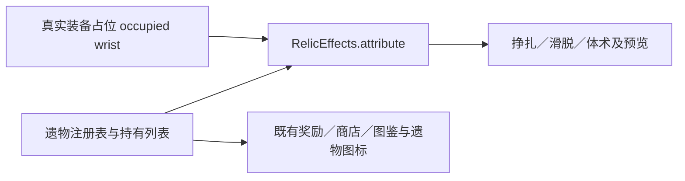
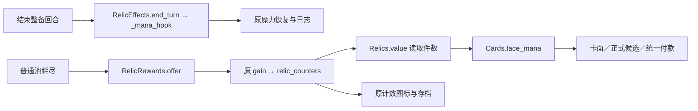
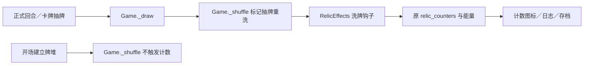

# 变更与开发记录

## 2026-09-21 图鉴牌面原图检视

- 图鉴卡面及派生卡点击后检视当前画风、当前正反面的原始纹理；默认完整居中，可切换1:1原始像素并滚动。点击暗色空白处返回，不设置关闭按钮；Esc与安卓返回同样可用。
- 通道：`图鉴卡面点击 → 当前CardIllustration.texture → ArtInspection → 现有模态输入边界`；视图关闭同步释放活动节点，保留图鉴选择和位置，不改游戏状态。契约见 [界面文档](../spec/release-interface.md)。仅源码与文档，未打包或发布。

## 2026-09-21 精简施法失败提示

- 卡牌悬停与施法详情删去“能量照扣，原牌留手／卡牌留手”后缀，保留退款信息；同步对应英文。仅文案改动，未打包或发布。

## 2026-09-20 商店刷新与整局递增费用

- 店主立绘右上角新增显示当前费用的刷新按钮；原价序列、整局累计范围和补货规则见 [游戏设计§9.2](../design/game-design.md#92-商店宝箱与休息)。
- 通道：`按钮 → service_refresh候选 → 原商店付款事务 → shop_refreshes＋1 → 共用库存生成器 → 新候选及界面`。进店与刷新复用同一抽货逻辑，刷新随机由种子、房间、塔轮与累计次数确定；浏览不推进随机。
- 保留已购所得、每店删牌已用状态及跨店涨价；沿用付款来源限制与会员卡折扣。同步中英文和真实按钮／快照／付款边界用例，仅源码与文档，未打包或发布。

## 2026-09-20 牢房探索魔瓶存入次数

- 牢房探索存入限制按最新确认调整；反抗战斗与整备沿用原规则，具体数值见 [游戏设计](../design/game-design.md)。
- 共用通道：`阶段＋操作 → ManaFlask.limit → 候选拒绝／执行计数／只读视图 → UI次数圆点`；复用玩家回合重置与已有存档计数，不新增另一套状态。
- 新用例覆盖用尽拒绝、部分魔力存入、读档保持、下回合重置、巡视／反抗／整备边界与真实按钮操作。仅修改源码与文档，未打包或发布。

## 2026-09-20 欲望魔方Boss来源与小魔女淫魔法版本

- 欲望魔方 Pro Max 加入两角色Boss遗物池；Boss来源赠品与固定兑换的区别、随机池及心痒难耐发牌规则见 [游戏设计](../design/game-design.md)。普通奖励和商店不直接提供魔方。
- 七张淫魔法卡复制为小魔女独立定义，蓄力同值转精神集中，保留其他数值及原版；见 [角色2](../design/character-two.md)。图鉴和卡面使用对应版本。
- 新增双角色正式奖励、随机限定池、重复领取、快照及实际出牌验证，UI经奖励点击进入整备确认赠送手牌仍可使用。独立只读审查通过；仅源码与文档，未打包或发布。

## 2026-09-20 坐姿腿部动作「连续踢！」

- 新招式通过腿部动作切换入口使用；规则见 [基础动作](../design/game-design.md)。候选、X能量支付、多段伤害、姿势豁免与攻击后躺下均复用原攻击通道。
- 新增规则边界与真实右键／拖放用例；原战神形态列表、固定费用减费测试适配新增招式，保留原有覆盖。补齐对应英文。
- 仅修改源码与文档，未打包、发布或提交；独立只读审查未发现明确问题。验证见 [验证记录](verification.md)。

> 路径说明：本卷正文保留撰写当时的文件路径（旧 `docs/<名>.md` 现按类归入 `docs/spec|design|guide|record|history/`）；需要定位时按文件名搜索。


记录类，只追加；按日期倒序。规范与契约见 `docs/spec/`，验证结论见 `verification.md`，发布说明见 `release-notes/`。
本文取代原 `spire-godot/README.md`（该文件已删除）。2026-09-17 v0.17.1 一节来自作者侧 `spire-godot/README.md`
的 v0.17.1 改动（6 行），正文逐字保留；其中链接已按本目录更新。
2026-09-15 及更早各节逐字保留：正文内链接沿用迁移前同目录相对路径，本次只更新指向 `release-notes/`、
`proposals/`、`verification.md`、`equipment-performance.md`、`equipment-reference-audit.md` 与仓库根 `AGENTS.md` 的链接；
已按批次迁往 `docs/spec/`、`docs/design/`、`docs/guide/` 等目录的文档，按文件名搜索定位（其中已定位的链接已更新）。
无日期小节（`启动`／`基本操作`／`架构与维护位置`／`规则与内容文档`／`开发检查`／`美术与生成工具`／
`存档与继续游戏`／`进阶可能设计`）为索引类小节，不是按日条目。


## 本局回顾：战报面板（只读紧凑地图＋进度行＋卡组）（2026-09-19）

域：`ui/run_review.gd`（新建，面板唯一组装入口）、`ui/route_map.gd`（`read_only` 复用同一渲染器与坐标）、`ui/main.gd`（路线屏与通关屏两个入口、`show_run_review` 抽屉接线、复制按钮作为角标的第二视图）、`assets/localization/{zh_CN,en_US}.json`（新增 `ui.run_review.*` 8 条）、`tests/route_ui_cases.gd`（新增 `run_review(t)`，场景 A–J）；契约 `docs/spec/run-review.md`、依赖约束 `docs/spec/run-review-dependencies.md`。按协调者记录的人类裁定取「杀戮尖塔式」回顾：只读紧凑地图＋进度行，不做类型计数表与节点清单；入口给路线屏与通关屏，`view.route` 为空（练习局／牢房）时不建控件。面板是纯只读显示入口：三块取源为 `ui.seed_report_text()`、`view.route`、`ui.view.deck_cards`，唯一写动作是复制按钮经既有 `ui.copy_seed()`；回顾地图不接 `room_selected`／`drawings_changed`，`core/`、`data/`、快照版本与反馈域零改动。规则门 643 条、窗口门 304 条通过，逐条敏感性实测与未跑项见[验证记录](verification.md)。本片只改源码、测试与文案资源，未打包、未推送。

## PR #6：监狱流程与内容包路径整合（2026-09-19）

域：监狱、内容加载、打包配置、教程与英文。按用户“以 PR 优先”合并 `prison-cell-baseline`：五级警戒进入普通牢房，使用最高规格的追加名额；反抗战暂停巡视与刑期计时并保留牢房位置；内容包根收口到 `PACKS_ROOT`／`packs_root()`，Windows 与 Android 导出前检查对应配置。整合时补齐内容校验工具的旧接口调用，纠正教程中残留的终局、全身补满上锁和战斗计刑期说法，补齐英文动态手册。保留此前测试维护和双方历史记录。专项规则 6634 条、窗口 268 条通过，范围与证据见 [验证记录](verification.md)。按用户要求并入 main 并同步 GitHub；本次不改版本号、不打包或更新 Release。

## 测试与文档维护（2026-09-19）

域：测试导航与现行契约索引。按当前快捷栏、悬浮提示和效果详情更新三份 UI 测试，修正 7 条过时交互失败；保留缺图检查与原有规则断言。清理测试中的 60 处旧文档路径、旧章节号和重复注释，删除项目地图重复项，将事件契约中的历史 PR 范围改为现行维护约束。专项规则 1306 条、窗口 444 条通过；已知 28 张卡牌缺图未解决。证据与未验证范围见 [验证记录](verification.md)。按用户要求同步 GitHub，本次不更新安装包或 Release。

## v0.17.1：0.17修复版（2026-09-17）

域：打包与发布；契约 `release-v0.17.1.txt`、`pr2-integration-review-2026-09-17.md`。

修复版统一为0.17.1，Android安装版本10且签名保持。成品包含Windows64 ZIP、Android APK及附说明许可的ZIP，并提供PC／安卓合集双层加密7z；两层均使用本次交付指定密码。版本内容见[修复版说明](release-notes/release-v0.17.1.txt)，成品检查及回归边界见[验证记录](verification.md)。原v0.17发布与标签保留。

2026-09-17架构与存档整合：选择性接入GitHub PR #2的装备查询索引、按需文案、节点事件、统一状态迁移与固定点写盘；保留当前模块目录和指引。补齐成长牌离手后显示、旧候选详情调用及重开时访问旧目标的问题，并更新保存提示和翻译生成来源。首批受影响分类分别通过规则7996项、UI1280项；随后修复18条基线失败：更新17条过时测试前提、修正主页保存提示越界，相关规则2013项与UI164项逐批通过。范围与证据见[整合审查](../history/pr2-integration-review-2026-09-17.md)及[验证记录](verification.md)；未宣称全项目通过，未合并远端PR、打包或发布。

## v0.17：小魔女与界面更新（2026-09-15）

域：`ui/target_queries.gd`、`data/field_tools.gd`、`core/tool_rules.gd`；契约 `ui-scene-refresh.md`、`equipment-performance.md`、`character-two.md` 等。

2026-09-15发布准备：修复Android通用下拉框的触摸选择、长列表滑动和返回关闭，防止弹窗覆盖按钮时误选。Windows / Android导出统一读取0.17版本；Android安装版本9，沿用原发布签名。版本内容见[发布说明](release-notes/release-v0.17.txt)，验收范围见[验证记录](verification.md)。

2026-09-15目标查询收拢：点击、拖牌和快捷栏共用ui/target_queries.gd中的身体目标归并、载荷解析与解除查询；主界面保留输入与展示编排。保留两面牌、自动唯一目标、捕缚额外目标、牢门开锁及各入口原不可用原因顺序，不保存跨刷新候选。七场景9730项新旧查询对照一致，分类结果见[验证记录](verification.md)。

2026-09-15小魔女立绘：用户提供的三张原图经本地白底抠图后分别接入站、坐、躺姿势；左侧身体栏使用站姿窄裁版，并向左调整人物至画框中间。坐姿补清帽内和脚边白底，躺姿补清双腿间白底；当前没有拘束差分，佩戴后保持对应姿势默认图。未改变玩法、存档、随机或角色1立绘，未打包或发布。

2026-09-15工具模块分层：20个读取对局状态的方法从data/field_tools.gd移到core/tool_rules.gd，数值表与纯说明保留唯一来源；g.Tools入口保持，图鉴与掉落只依赖所需数据。24组场景、33次正式安装／取回的新旧对照一致。维护边界和分类验证见[验证记录](verification.md)。

2026-09-15架构跟进：主立绘和身体栏的角色判断合并到共享显示策略，统一消费当前View，移除两处对实时角色规则的间接读取；避免独立快照与当前对局不一致时混用角色外观。精简立绘数据也交由共享模块生成，补齐单手套外观传到战场时遗漏的字段。模块边界、当前维护风险和验证结果见[验证记录](verification.md)，显示契约见[UI场景说明](ui-scene-refresh.md)。

2026-09-15快捷栏性能跟进：一次格子更新共用部位、装备及排序来源，默认四格的全组卡牌扫描16→8次，带选牌数据时24→4次；不跨刷新缓存，翻面和手动选目标即时生效。五种装备场景9600组新旧显示与候选对照一致，具体测量及分类验证见[性能记录](equipment-performance.md)。

2026-09-14小魔女扩展：图鉴内可独立切换角色卡牌／遗物；基础动作更名施法预备，每部位每回合成功释放限1次。新开局加入魔力松缚与可永久进化的脱缚练习，移除初始魔术手；新增魔力抽调、耐心耐心～、忍耐、杂鱼♡～杂鱼♡～、窃取权柄，魔力涌流拘束面耗魔20。具体分面、进化段数及回合限制见[角色2规则](character-two.md)。未打包或发布。

2026-09-14快捷框耐久条：装备名右侧新增无数字的剩余耐久条，切换装备和实际受损后同步更新；空部位隐藏。进度条不拦截点击与拖牌，继续使用原详情开关。

2026-09-14图鉴卡牌：原牌与衍生牌均展示注册表基础费用、效果和魔力角标，翻面及提示不读取当前对局的拘束、属性、能力、施法概率或临时费用；汇流等动态收益保留公式。手牌、卡组及商店维持实时显示。仅显示修复，未打包。

2026-09-14快捷框详情：点击区域框展开当前拘束具的三级详情，再点同一框关闭；换框直接切换详情。对应栏位快捷键同样开关，左右箭头切装备继续展开详情。关闭后保留当前目标，可直接点牌使用。

2026-09-14快捷解除修复：魔力撑除等降紧牌和术式解锁等开锁牌补入快捷栏，选中装备后直接点牌、拖牌均复用原施法候选。目标无锁、魔力不足或牌面不适用时显示原原因，不自动改用其他装备。

2026-09-14快捷栏跟进：四区箭头改为左右两端整高点击区，中央保留装备信息；区域选择复用对应动作栏位的快捷键，默认头颈Z／手胸X／性器V／臀腿F，并跟随自定义键位。选中后←／→继续切换装备，切回动作页恢复原动作快捷键。

2026-09-14工具显示：墙缝位置统一显示实际离地高度；安装后当前能触发的工具加入状态栏“环境”分类，显示图标和剩余次数，点击打开道具详情。随身物品不加入，使用规则与费用不变；中英文已同步。

2026-09-14监狱收押事件页：战败后先进入一次性的收押页面，棕发狱警完成押送、逐件佩戴实际新增的拘束具／连接绳／性玩具，并榨精一次、即时取走精液中的最多20魔力；平板锁及低魔力使用独立正文。点击“进入牢房”后页面关闭，不再把收押对白作为普通牢房日志反复弹出。中英文与专项验证同步，未做截图、打包或发布。

2026-09-14监狱巡视演出：每次接受例行检查和出狱前额外巡视都追加一次狱警手部榨精，高潮立即损失最多20自身魔力；平板锁与低魔力各有独立正文。例行巡视使用用户指定紫发狱警图，收押、额外巡视及正常出狱对白使用棕发资深狱警图；对白框不显示名字，正常出狱切换场景后仍会弹出。规则边界见[监狱期限与出狱起点](prison-release.md)，本批不做截图、不打包、不发布。

2026-09-14大量装备跟进：一次只读刷新内复用装备查询，折叠详情按需创建，候选重复查找合并；继续按完整参数复用解除／施法预览，并按牌面共用候选费用。全卡牌双面资料合批生成，跨部位装备基础显示资料同轮复用。实测、适用范围和回归见[性能记录](equipment-performance.md)，逐类对象持有关系与高频接口见[拘束对象引用追踪](equipment-reference-audit.md)。

2026-09-13本地PC交付：已按用户要求单独生成`outputs/紧缚尖塔demo-v0.17-Windows64.zip`，未上传或发布；独立启动、成品角色2与存档、ZIP解压校验通过，未做全项目回归。以下未打包说明是本次交付前的开发记录。

主菜单选择「角色2 · 蓄能魔女」后开始新游戏。四部位蓄力与释放、精神集中、11张初始卡组和专属改单已经接入；魔术手自由面使下2次手部基础动作忽略拘束条件。局内图鉴和教程显示角色2说明。所有改单仅属于角色2，角色1沿用0.16内容；详情见[角色2规则](character-two.md)。当前为源码开发版，已有0.16发布包保持原样；本轮没有打包或发布。

## v0.16 发布（2026-09-13）

域：界面、存档。

当前发布版本0.16：Windows 64位与Android ARM64／ARMv7，Android versionCode为8，沿用原包名和签名。下载及注意事项见[发布说明](release-notes/release-v0.16.md)。按用户最新要求停止剩余回归，仅进行导出、签名和文件完整性检查；不得将本版记录为全量回归通过。下列“未打包”条目为此前开发阶段的历史记录。

2026-09-13项目跟进优化：英文显示跳过无效模板扫描，动态翻译预解析并使用有容量上限的缓存；实际道具详情英文刷新中位耗时约16.5→4.0ms。补齐汇流两面英文，修正亚像素滚动误报和依赖旧开局的排序夹具；商店、免费宝箱、反馈、帧率与界面分类验证见[验证记录](verification.md)。不扩展存档专项，不打包。

2026-09-13性玩具文案：全部已登记家族的装备详情改为具体说明当前刺激方式，并显示“基础刺激×部位倍率×可选锁内系数×当前来源倍率＝实际快感”；装备刺激状态改用短投影，多部位装备只显示一次，不再重复解除牌与环境教程。玩法数值不变，未打包。

2026-09-13显示设置：帧率上限可选60／120／240帧／无上限，默认60帧；垂直同步独立开关，默认开启。主页与游戏内共用，即时生效并自动保存。无上限只取消软件限帧，垂直同步仍可能限制到显示器刷新率；显示页内部滚动，中英文同步，未打包。

2026-09-13：同一局地图画线在快速SL和保存后读档时保留，每笔结束及清除自动保存；新开游戏清空。画线独立于场景起点的游戏状态，不改变行动、资源或随机结果。

2026-09-13运行优化：游戏显示最高60帧，静态背景与30帧装饰动画分层；道具选择、目标展开和说明开合只刷新详情，保留列表、滚动位置和底层场景，统一清理失效行动控件。真实道具超量、恢复容量和最后一件丢弃均通过；规则与容量不变。性能测量及1033项规则／342项窗口验证见[验证记录](verification.md)，未打包。

2026-09-13跟进检查：修复本地化弱模板误匹配及重载目录残留旧译文，补齐主页模式开关与“唯一”的英文显示；语义消息现为32条。新增规则、接口和测试检查记录见[验证记录](verification.md)，存档专项仍延期，未打包。

2026-09-13商店删牌：初始30魔力，每成功付费删牌后固定＋20，依次30／50／70／90……；每店一次，续轮保留累计次数，主界面新游戏归零。付款、入口价格、日志及当前存档同步，未打包。

2026-09-13完全自由降快感：没有拘束具、链接、特殊装备或捕缚时，每个实际回合结束快感－2，最低0；战斗／类战斗及移动共用，状态说明与教程同步，未打包。

2026-09-13余火：拘束面需本回合成功使用过火球术，额外抽牌耗魔改为8；自由面的火球基础伤害＋4持续本回合。卡面、状态与当前回合存档记录同步，复用现有规则／窗口测试，未打包。

## 战斗与整备衔接（2026-09-11）

域：契约 `localization.md`、`game-design.md`、`first-floor-enemy-library.md`。

henshin拘束面3能量、自由面4能量，基础40魔力，消耗与原效果保持。击败敌人后先领取奖励，原场次保持开启；进入整备时开始下一个玩家回合，正常回能、弃牌和抽牌，沿用原抽牌堆、弃牌堆、消耗区、能力与增益。保留牌仍按原规则保留，不重建卡组，也不重复触发开场遗物、每场一次效果或绿色小鸟保护。奖励新牌加入永久卡组及当前弃牌堆。

战斗结束效果统一延至整备结束，只触发一次；提前结束与回合耗尽共用，后续整理道具不再触发。届时清除能力、定咒、本场增益及临时状态牌。休息离开仍完成清理，但不触发战斗结束收益。事件战斗同样接续整备；没有整备的监狱出口战在领奖完毕时结算一次。被收押沿原流程立即结束并清空可带资源。

跨战额外能量默认最多1点：下回合能量与甜甜圈保留的未用能量共用上限；无甜甜圈时普通未用能量不保留。蓄力默认最多2层、临时魔力默认最多20点。乌龟壳改为三者跨战保留上限各＋2层，分别为3点能量／4层蓄力／30点临时魔力（临时魔力每层5点）。同一战斗与整备期间不截断积累，获得遗物不补回此前丢失资源。下一回合乏力延续到首个整备回合，使用一次后清除。

RuleChangePackage：沿原combat.active/serial/turn、牌区和资源字段，修改胜利→领奖→整备→离开的场次边界，不增加存档字段或随机域。影响候选、原子提交、快照校验、费用投影、遗物／状态／教程文案和具名资源反馈；版本拒绝保持回滚。十四交互轴中阶段、牌区、增益、资源、版本与敌方来源清理受影响，部位、层级、锁、材质、姿势、地图几何等原资格不变。验证双方费用、首次整备正常补能抽牌、消耗区／能力保持、自然／提前结束、休息、事件战、奖励页恢复、资源上下界及收押，不做旧档迁移、不打包。

# 紧缚尖塔 · Godot 塔路原型

2026-09-13自由站姿平板锁差分：使用三张用户对齐原图本地提取平板锁与加固带两层，战场立绘按真实装备状态显示；无锁、受限姿态和坐／躺立绘保持原规则。未调用生成工具，未打包。

2026-09-13英文版：沿本地化框架加入English语言选项、38条语义译文及4536条全运行时兼容译文，覆盖现有界面、卡牌、装备、商店、事件、对白、叙事、日志和动态参数显示。核心、高频词与整套卡牌名已人工整理，其余长篇正文为第一轮英文稿；玩法状态、数值、随机与存档不变，本轮未打包。说明见`docs/localization.md`。

2026-09-13漂浮锁离场：开启平板锁池后，无可上锁目标时固定尝试附加中级2档负数平板锁再离场，不受概率设置影响，无法佩戴仍离场；关闭时保留原行为。首页概率范围改为5%～100%，步长5%，原0%偏好读取为5%。本批不打包。

2026-09-13六缚踢击反馈：并腿踢击后躺下会在下一回合转为后手，六缚先行动。修正其已行动时误显示“暂不行动”的悬浮说明，明确本回合已行动、下回合重新显示意图；真实空闲和眼罩遮挡保持各自说明。回归覆盖实际装备／状态牌／收束变化、连续后手回合和快照恢复；未打包。

2026-09-13事件平板锁差分：缚疗修女“净化”、魅魔三局赌牌第三局和魔力典当铺三项交易会按真实佩戴的平板锁切换正文，改用乳房／小穴刺激，肉棒只能顶动锁板，精液从锁具下流出；次数、资源、筹码、惩罚和固定玩具安装不变。新增通用特殊装备族文案条件，content／events规则633项通过，未运行截图测试，未打包。

2026-09-13新增接口检查：修复自动升级留下旧附属件、漏报移除结果及绕过批次保护的问题，统一单件与整组替换的保护边界；同步赠牌图鉴标记和火球首发费用的旧测试。保留原规则入口、费用及随机域，未打包。范围、失败复现及最终检查结果见docs/verification.md。

2026-09-12马眼棒：佩戴时每次高潮受到`6－当前紧度档位－装备等级`点固定滑脱伤害，连续高潮逐次重算，耐久归零即解除；装备详情、图鉴和机械日志已同步。相关规则与窗口检查通过，未重新打包。

2026-09-12休息奖励统一为三张等宽奖励卡，回合花费位置一致，底部只保留一个跳过入口。规则1038项、窗口291项通过，画面已检查；未重新打包。

图鉴补充：般若汤列表只保留其一，其二／其三／其四／好汤统一在其一详情展示；搜索任一衍生名称也定位到其一。相关规则354项、窗口72项通过，未打包。

2026-09-12图鉴：重复的特殊衍生版本并入原版详情，同页展示、独立翻面；般若汤页面可查看后续生成的全部卡牌。列表不重复占位，搜索衍生名称可找到相关页面。encyclopedia规则358项、窗口67项通过，未重新打包。

2026-09-12新增检查：同步地图休息房的奖励说明，移除冻结与投影的两个单元素循环；接口窗口测试按赠牌共图、既有卡面版式、可搜索的资源规则和最新怪物血量更新，塔顶路线按整备结束统一结算。保留长文滚动、真实输入、回滚与资源边界覆盖。检查范围及最终结果见docs/verification.md；未重新打包。

2026-09-11新增罕见遗物“欧内的手”：拾取时，将1张不带“消耗”的魔术手加入永久卡组及当前弃牌堆。该赠牌两面费用、嘴部施法与效果相同，但使用后正常弃置，可再次抽到；已有普通魔术手不变。赠牌不进入随机卡池，在魔术手图鉴详情注明遗物来源并展示，遗物进入通用罕见奖励及商店池。不打包。

2026-09-11新增罕见魔法牌“魔术手”：1能量、基础20魔力，双面嘴部施法，成功后消耗。拘束面“降紧3。超级顺延。”，每次降1档，原目标未解除则继续；解除后先按同精准部位→同大部位→同区域顺延，区域无合法目标才从全身按手腕→口部／手指→其他部位补选，同级随机。最多累计降3档，无合法目标才提前结束，整张只施法和付费一次。自由面按2026-09-12修订改为下2次手部体术忽略拘束限制与减益，按自由态结算；详见同文档最新条目。失败沿原施法规则扣费、留手，不产生效果。

2026-09-11平衡调整：两种魔法阵均降为仪式3，正常施加数量为4、7、10……件。强怪池“四只弱怪”改为四种不同的强度1小怪，仍总强度4；普通弱怪战保留原抽取规则。

2026-09-11术式解锁拘束面降为0能量，默认消耗10魔力；开拘束具与牢门共用费用。自由面仍为1能量，获得2层魔力预备。

2026-09-11新增普通技能“运气”：两面2能量、无魔力费用。自由面要求口部无拘束，获得1层蓄力，下一次体术费用－1（最低0）；拘束面滑脱8×2。两面均选择并消耗另一张当前手牌，运气自身正常弃置，永久卡组不变。加入普通奖励／商店牌池，卡面与图鉴使用同一配置和独立SVG图标。拘束面先选拘束具，再选真实手牌，两项选定后一次提交；取消、版本过期或目标失效均不扣费。不打包。

2026-09-11六缚新增高潮逮捕：角色累计第4次高潮时准备逮捕，此后每次高潮都再次触发。任意现有打断均可取消本次逮捕；取消后下一回合恢复原行动，之后继续检测下一次高潮。普通装备空间耗尽逮捕仍按原延后规则处理。本次仅更新源码，未重新打包。

2026-09-11主页新增“扶她出去”开关，默认关闭并保存到本地显示设置。开启后左侧与战斗立绘统一固定使用初始站姿透明素材，不显示拘束差分或随姿态切图；关闭恢复正常显示。玩法规则不变，未重新打包。

2026-09-11施加顺序调整：原三档优先级不变（空手腕→空口部／空手指→其余合法项），同档内先向没有拘束具的小部位施加，再考虑叠加；按真实小部位和左右侧别判断，不按区域数值评分。敌人、监狱与事件共用，未重新打包。

2026-09-11并拢飞踢与并腿蹬击改为（基础伤害＋力量＋蓄力）整体乘双腿衰减倍率，预览与实际伤害同步。本次为发布后的源码调整，未重新打包。

2026-09-11按用户要求交付v0.12：PC成品为`../outputs/紧缚尖塔demo-v0.12-Windows64.zip`，安卓为`../outputs/spire-v0.12-android-20260911-v012/spire-v0.12.apk`。两端源码一致，发布包无存档／个人设置。按用户后续要求停止整体测试，仅完成成品启动、包内资源、版本、签名和压缩包校验；安卓未做真机安装测试。

2026-09-11开信刀play两面改为“每使用3张技能牌”，未满3张的计数跨回合保留，本场结束清除。伤害和费用保持不变。

2026-09-13更新罕见能力“拘束之拥”：自由面2费，每挣脱1件拘束具抽1张并恢复1能量，抽牌与回能均可叠加；拘束面1费，每被佩戴1件拘束具，下回合抽1张。两面持续整场、可反复触发；待抽张数显示在对应状态图标，卡面保持固定说明。加入罕见卡池及图鉴，配有独立小画。

2026-09-11正义飞踢与灌注：正义飞踢改为2能量、18伤害，使用站着踢的双腿活动自由条件；取消自带打断、冷却和首回合限制，可连续使用。新增稀有魔法“灌注”，无施法部位要求，沿快感值成功率：自由面1能量20魔力，下一次手部体术附加1层打断；拘束面2能量10魔力，下一次腿部体术附加1层打断。肘击／近身短打计手部，近身短打／各类踢击计腿部。对应完整动作消耗增益，多段只打断一次，不与自带打断或已延迟意图叠加；两面同时作用于近身短打时一并消耗。同一面不叠加，进入稀有战后和商店池。沿现有卡牌增益、匹配攻击、候选与存档，不打包。

2026-09-11独立卡牌／遗物奖励统一使用战后弹窗：覆盖战斗、Boss、事件选牌、休息卡牌奖励和宝箱。选牌与遗物可单独跳过，其他奖励仍可领取；休息跳过保留全部回合。选项绑定的奖励照常结算；套娃拾取后打开三件遗物的独立领取页，可逐件领取或跳过。

2026-09-11教程基础操作置顶：顶部教程书默认打开“基础操作”，导航首项与全部条目开头同步置顶。前三项简要说明电脑右键／手机长按翻面、卡牌与行动拖动、选择具体拘束具；保留定向打开其他教程分类。不改玩法，不打包。

2026-09-11卡牌说明精简：敏感的“自动保留”改为“保留”；玩弄与玩弄＋仅删除重复的“本场临时牌”尾句，卡牌及效果保留；火动力学显示“火球术施法成功率＋25%”。

2026-09-11术式解锁自由面改为获得2层魔力预备（10点临时魔力）；仍为1费、需要手部条件，不耗自身魔力、不判施法。双重解锁自由面保持1层。

2026-09-11顶栏信息排布：地点、回合、行动顺序、距墙与警戒度统一放入紧凑深色信息带，地点采用暖金底色，行动状态使用冷青／暗红小标，其余数值居中对齐、细线分隔。保留完整数值和原只读投影；教程书及右侧按钮位置保持，不打包。

2026-09-11教程书入口移到上方栏位：位于警戒度右侧、状态左侧，使用暖金底色、亮金边框与柔和高亮。菜单内移除重复入口；顶部按钮仍调用原_open_tutorial／共享抽屉，切换、关闭和Esc不改变游戏状态。压紧警戒度标签宽度，为教程书留出独立位置，其他顶栏入口保持。

2026-09-11基础卡数值：用力！与顾涌！基础伤害由5提高到6，费用及自由面效果不变；优秀学员毕业证书仍加4，持有时卡面为10，波及沿当前卡面一半计算。

2026-09-11新增普通魔法卡“汲取”（siphon）：拘束面0能量，恢复5魔力，无身体要求且不判施法；自由面1能量，恢复10魔力并抽2张牌，要求腿部束缚等级＝0，按嘴部吟唱成功率判定。两面不消耗魔力、不消耗卡牌，成功后正常弃置，恢复不超过上限；自由面失败沿现有规则扣能量、保留手牌且不给予效果。复用self_faces、energy_cost、mana_gain、draw、free_max_levels和逐面cast配置，加入普通战后／商店牌池。卡面、图鉴及候选读取共享定义；添加现有风格SVG图标，不增加专属规则接口，不适配旧档、不打包。

2026-09-11 v0.12回魔调整：激发魔力两面恢复20魔力；小刻印开场恢复5魔力。均恢复自身魔力，不超过角色上限。

2026-09-11卡牌波及：挣扎波及同位置其他拘束具；滑脱在同一装备栏分组的其他位置各选紧度最低的可滑脱装备1件，并列随机。波及取当前卡面伤害的50%，按各目标倍率计算，多段逐段触发；目标先被波及解除时，顺延跳过它。当前仅更新源码，不打包。

2026-09-11深呼吸：1能量，基础降低25快感；嘴部等级＋紧度总值2／3／4／5／6分别衰减20%／40%／60%／80%／100%，高级3档禁用。每次成功使用仍获得完整的下回合能量＋1，可累加。

2026-09-11逮捕条件修正：包括六缚在内的人形、机械敌人，在场上所有存活敌人都无法再添加、加固或有效替换装备时，预告逮捕并在下一次行动收押。仅更新编号或来源的原样替换不再计入；真实换装、修复、上锁和新链接仍须按原规则检查。

2026-09-11装备名称修正：`mouth_tape`的玩家可见名称固定为“堵嘴胶带”，内部稳定ID与规则不变。

2026-09-11事件佩戴文案修正：人物协助与活化拘束具分别使用独立的部位差分。迷宫测绘队、缚梦客房和拘束具堆里的微光改为拘束具自行缠上的正文；魅纹师事件删去旁白中的诅咒规则说明。

2026-09-11日志与事件文案精简：状态规则集中在状态窗口，行动日志只报本次状态变化与实际结果。已逐项检查12个事件，注语仅补充按钮未表达的奖惩、概率和选择信息；公共收尾改为“离开”。内容包支持显式空注语，随机分支继续保留公开预告。删牌、换牌和解除所选拘束具的结果正文不再追加同义尾句。

2026-09-11单件出牌修正：全身只剩一个拘束具目标时，左键单击手牌直接打出，省去部位选择与“打出”确认。多目标、费用不足和捕缚条分歧保留原选择／原因；数字键仍只选牌。

2026-09-11新增润滑油：每瓶3次，选择一个身体分组，本场可滑脱三级紧度拘束具，滑脱最终伤害×2；无身体／口部减效条件，重复不叠加。已加入掉落及商店，道具栏直接选择分组，状态栏查看作用部位。

拖出需要目标的卡牌、行动或选项时，立即显示所有合法目标；取消／完成后收起。平时只在可交互处高亮，意图说明和敌人快捷选择保留。

敌人被打断时只显示打断图标，不再同时显示原意图；停顿回合结束后自动恢复原意图。

2026-09-11商店付款演出：保留现有店主立绘；进店、挑选商品、魔瓶付款与余额不足均使用店主普通对话框。自身魔力付款时，上半身无拘束显示自行射精付款；有拘束则在飞机杯、手交、足交中冻结一种小演出，使用用户提供的四张原图，确认后回到已经完成的交易。

“翘腿无视”已加入用户提供图片的正式版立绘，本地去掉白底和座面阴影，保留人物、饮料及吸管，沿用原卡面暗色背景。图鉴可在正式版与原测试版之间切换。

2026-09-10魅魔的魔力典当铺插图：接入用户提供的原图，正式事件与练习共用，完整等比显示。

2026-09-10神秘女人的雕像插图：接入用户提供的原图，正式事件与练习共用，完整等比显示。

2026-09-10缚梦客房插图：接入用户提供的原图，正式事件与练习共用，完整等比显示。

2026-09-10拘束具堆里的微光插图：接入用户提供的原图，正式事件与练习共用，完整等比显示。

2026-09-10缚疗修女插图：接入用户提供的修女原图，正式事件与练习共用，完整等比显示。

2026-09-10女药师的试饮摊插图：接入用户提供的药师原图，正式事件与练习共用，完整等比显示。

2026-09-10魅纹师的空房插图：接入用户提供的魔镜与针匣原图，正式事件与练习共用，完整等比显示。

2026-09-10偷渡商人的魔药箱插图：接入用户提供的商人原图，正式事件与练习共用，保持原比例完整显示。

2026-09-10迷宫测绘队插图：使用用户提供原图，正式事件与练习共用左侧画框，完整等比显示。

2026-09-10事件插图：「废弃储物室」使用确认后的日系二次元版本，「漂浮皮带群」使用减少数量后的版本；正式事件与练习共用左侧画框，完整等比显示。

图鉴新增“道具”分类，分药剂、卷轴和工具，可搜索名称与效果。收录全部现有道具，展示基础数值、使用次数、条件以及安装后的触发效果。

2026-09-10场景SL：重新进入游戏或菜单“快速SL”回到当前场景起点，战斗恢复第一回合的原始手牌、敌人、资源与随机状态。商店和事件恢复进入时，离开后已完成的收益保留。旧格式存档不适配。

2026-09-10蓄力图标可右键切换全量释放：下一次触发将全部层数按每层＋3计入伤害并用完，随后恢复普通模式。v0.12改为本场结束蓄力最多保留2层、临时魔力最多保留20点；乌龟壳将两项上限提高至4层／30点，并将跨战额外能量上限从1点提高至3点，战斗与整备来源同等处理。

设置新增“窗口／无边框窗口／全屏”三种显示模式和分辨率选择，支持720p、810p、900p、1080p、1440p和4K窗口尺寸。全屏使用显示器原生分辨率；切回窗口恢复之前所选尺寸。显示设置自动保存，主页与游戏内均可调整。

道具安装入口合并为“安装到墙缝”，点开后选择低、中、高；各高度的费用和不可用原因仍直接显示。

道具现在随时可以丢弃，已安装工具也适用。不消耗能量、魔力或回合，丢弃后无法取回；地图、战后奖励和巡视等阶段都可从道具栏操作。

2026-09-10魔瓶存入、取出即时更新自身魔力条和瓶内余额，不再等待转移飘字；连续操作期间旧动画也不会把余额跳回去。原存取限制保留。

道具详情补齐具体伤害、适用材料、使用次数和安装触发规则；地图等只读阶段也可查看，商店复用相同效果说明。

2026-09-10魔力预备类卡面恢复明确正文“获得N层魔力预备”；数值徽章保留，悬停说明每层提供5点临时魔力。

巡视周期改为安全等级1—5对应16／14／12／10／8回合；每次检查结束重新计时。当前5级仍进入高安全监室终局，牢房练习从16回合开始。

2026-09-10游戏内左上角改为当前层数、回合数和先后手；牢房显示自身回合，非战斗状态明确标注，距墙信息继续保留。

滑脱提示区分肩带固定与外层覆盖：显示实际阻碍及需先处理的装备。同一套体在手掌／手指等合并目标中只显示一次，解除条件与伤害不变。

塔顶出口显示“感谢游玩这次demo”，可结束返回菜单，或保留卡组、遗物和成长继续挑战。最多三轮，怪物基础生命依次为1倍／1.5倍／2倍；第三轮出口只能结束。继续时生成全新塔路，解除可解除的拘束、组件、链接和特殊装备，并补满当前魔力上限；诅咒眼罩永久保留。每次击败首领分别提供三选一稀有卡与三选一Boss遗物；Boss池耗尽时沿用滚木兜底。

行动日志中的准备类动作统一简写为“准备捕缚”“蓄力”“停顿”等，敌人名称只在标题显示；实际失败原因仍保留。

地图界面扩展至主区域顶端和底部，右侧移动消息栏缩窄；遗物集中在地图左上方，悬停说明和计数保留。总览、定位、旅行控制与右键绘画照常使用。

左下资源框按捕缚状态自适应：无捕缚时快感、魔力两行展开；有捕缚时切为三行紧凑排列，解除后恢复。魔瓶和牌堆位置保持稳定。战场捕缚条随魔力条处于信息窗口下层，不再穿透状态说明；关闭窗口后仍可原位拖牌处理。

地图支持按住右键自由绘画，画线跟随滚动与总览缩放，点击“清除画线”清空当前地图。左键选路线和拖图照常使用；当前会话内保留画线，新局或加载后清空。

2026-09-10卡图区扩大到牌高约2/3，现有横向素材按原比例完整居中，上下由背景衔接；费用与标题保留顶部。下方长效果／使用条件可滚动阅读，悬停补充全文，翻面回到顶部。所有卡牌展示共用此布局。

2026-09-10教程书统一为简短规则说明：用短句列出条件、效果和数值，精简重复解释、敌人术语与装备条目。分类和搜索保持原用法。

地图节点悬停只高亮，不再弹窗；点击不可达房间仍显示具体原因。删除房间说明中的怪物池／生成规则，以及移动消息区的重复教学文字。

2026-09-10统一怪物图鉴说明：用短句、行动箭头和明确数值展示机制，合并捕缚通则与分裂数量，出现位置跟随当前遭遇配置。

主页标题区只保留放大的“紧缚尖塔”四字；右侧继续游戏、开始、图鉴、教程等菜单照常使用。

2026-09-10商店按品质调整魔力价格：普通／罕见／稀有卡牌15／25／40，遗物45／65／90；特殊补位遗物45，道具和服务费用不变。

战场上方拖拽说明栏已删除，拖动固定动作只显示名称；不可用原因在目标旁显示。卡组、图鉴、奖励、事件、塔路与设置的重复操作提示一并精简，具体效果、费用、概率及选择条件保留。

2026-09-10精简卡牌悬停：抽牌不再附带教程弹窗，检索仅保留一句说明；其他关键词及卡牌备注同步去重，保留特殊规则和施法信息。

玩偶师组合的战场站位改为玩偶在左、玩偶师在右，名称、血条、状态和选取区域随立绘同步排列。

2026-09-10状态整理：角色增益／限制与敌人已有特性使用图标和数值角标，悬停说明、点击查看详情。状态总览改为自适应紧凑图卡；属性、保留牌与同类刺激来源合并，独立期限／能力进度保留。遗物的触发机会及计数归遗物横栏，装备限制归装备详情；敌人头顶仅保留行动意图。

拖牌时的装备目标显示小图标与耐久条，40%／80%分界使用亮金色加深色描边。悬停只显示装备名、本次伤害数值及种类；附加切割单列，链接倍率已计入，不重复费用或装备参数。非伤害效果及具体失败原因保留。套体复用已有透明图，30张普通材质图在本地去底色，缺图仍用真实名称。

2026-09-10基础动作栏改为铺满战场横排的五个等宽动作格，费用、实际伤害、连击次数与火球剩余次数／施法率直接可见。长说明移至悬停，禁用原因保留在格内，支持原点击、右键切换及拖放。

2026-09-10卡牌魔力标记：即时消耗／获得放在右上角，消耗为负、获得为正；临时魔力按实际点数显示为紫色标记。无即时魔力变化时隐藏，翻面同步；正文保留追加耗魔与延迟触发条件。

新增精英「玩偶师」：96生命，已接入精英池、图鉴和主页独立练习。召唤带生命保护的玩偶，随后赋予嘲讽与受击施加；之后循环缝补、复合装束、特殊装束。玩偶的溢出伤害全额转给玩偶师，击败玩偶师即清除玩偶。

2026-09-10卡面文字统一精简：效果使用“挣扎5、蓄力1、检索魔法2、临时魔力1”等关键词，身体条件、目标范围和区域限制另行列出。区域综合数值统一称“束缚等级”，单件装备仍称“紧度”。翻面同步更新悬浮解释；手牌、卡组、商店、奖励及图鉴共用显示，数值与使用规则不变。

2026-09-10新增稀有能力「魔力回路」（2费）：自由面每消耗30魔力恢复1能量，拘束面每消耗20魔力获得1层蓄力；计入自身与临时魔力，可叠加，分别显示累计进度。自由面要求上身、腿部束缚等级均为0。

2026-09-10卡牌修订：一点点抽出基础滑脱5点，绷紧再挣基础挣扎4点；翘腿无视拘束面仅限腿部拘束具。术式解锁自由面获得2层魔力预备（10点临时魔力），双重解锁自由面保持1层（5点），删除储备术式与开锁免能量。蓄力每层基础＋3同时用于主动挣扎、普通／魔法滑脱及原体术，每次命中消耗1层，多段逐段处理；被动移动与纯倍率群体效果不使用。找准松处拘束面改为获得1层蓄力、抽1张牌，无需装备目标；自由面仍先保留1张再抽1张。余势复演的相关说明统一写“拘束面”。

新增「蓄势待发」：1费、10魔力的普通嘴部魔法，两面均消耗指定手牌；拘束获得3层蓄力，自由使下一次体术费用－1（最低0，不叠加）。先选牌后施法，失败两张牌均留手，成功后本牌正常弃置。

新增「翘腿无视」：1费普通技能；拘束面对腿部拘束具造成8点滑脱并抽1，自由面0费抽1，要求腿部束缚等级≤1。已加入普通卡池。

新增「魔路检索」：1费普通技能，无消耗。自由面抽2张魔力牌，上身束缚等级≥1时不可用；拘束面抽1张魔力牌。按卡面「魔法」词条定向抽取，「猛火下山」同步显示魔法／能力双词条并可被检索。

「强欲之壶」：0费罕见技能，拘束／自由面均抽2张牌，消耗。已加入罕见卡池，最多抽到10张手牌。

2026-09-10漂浮敌人插图：漂浮绳索、皮带、锁、口球替换为与卡面同系列的平滑SVG。已有简洁绘制的其他敌人及用户提供的魅魔警卫立绘保留；战场、练习和图鉴共用原角色控件。

「逐层抽离」拘束面为滑脱4×3、顺延；「接连挣动」拘束面为挣扎4×3、顺延。两张仍为2费罕见技能，自由面保持原效果。

2026-09-10卡面插图更新：23张沿用怪物素材的卡牌全部换成与「控火」同系列的独立SVG，火焰精通同步统一；当前35张卡牌都有专属插图。手牌、图鉴、商店、奖励、牌组和卡牌动画共用，规则与操作不变。

新增「连续挣」：1费普通技能，消耗。挣扎面5次1点伤害、顺延；自由面获得2层蓄力。共用现有顺延机制，已登记普通卡池。

2026-09-10新增「余势复演」：1费罕见技能，无消耗。自由面令下一次火球术免费额外施放一次；挣扎面令下一张成功打出的、双面效果不同的挣扎面牌免费额外释放一次。原「控火」保留。只作用原目标，失效跳过；复放不占火球次数、不重复移动实体卡。

2026-09-10新增普通魔法牌余火：0费、基础5魔力、手部施法。自由面令下一次成功火球术基础伤害＋4；挣扎面抽1张，剩余魔力足够时自动再支付固定5魔力抽1张。

新增「猪神之皇焚」：3费稀有技能，挣扎面6×5伤害并顺延，自由面获得5层蓄力。顺延按指定部位、左栏大部位、原大片区域依次查找最外层；自动处理剩余段数，整张只付一次费用。

新增「猛火下山」：1费、10基础魔力、嘴部施法的罕见能力。本场每使用一次火球术抽1张牌，群体与失败使用均只触发一次。双面效果相同、不叠加。

2026-09-10施法失败通用修订：仍支付能量和魔力，但卡牌留在手中，包括带“消耗”的魔法牌；成功后才按原规则弃置或消耗。失败没有法术效果，也不会自动获得跨回合保留。

新增「灵活变通」：1费罕见能力，回合开始时自由面获得5点临时魔力，挣扎面获得1层蓄力。

2026-09-10新增普通魔法牌死灰复燃，1费、基础10魔力、手部施法。两面均在成功后刷新本回合火球术次数，恢复到包含炫火加成的当前上限；成功后正常弃置。

2026-09-10新增罕见1费能力炫火：自由面火球术每回合3→4次；挣扎面可从装备详情对选中的外层拘束具使用半伤魔法火球。敌人／装备共享次数，失败扣次，换回合重置。火焰精通两面改为2费。

预备魔力每层改为5点临时魔力：独立无上限，优先抵扣法术与卡牌耗魔，不能存瓶或购物；跨回合保留，本场结束最多保留20点，乌龟壳将临时魔力保留上限提高至30点。

2026-09-10新增稀有能力牌火动力学，2费：自由面将火球术变为群攻；挣扎面使火球术成功率在倍率之后额外＋25个百分点，最高100%。两面可共存、同面不叠加，持续本场。

2026-09-10新增普通技能牌控火，1费、消耗：自由面在上半身无拘束时永久增加火球术基础伤害1点，挣扎面获得10点临时魔力。技能不判施法，永久加值跨战斗保留。

2026-09-11休息处：共6回合，随机获得1张稀有卡，花费3回合、剩3回合；罕见卡三选一花费3回合、剩3回合。罕见候选在入场时固定；稀有卡在领取时随机抽取，查看和返回不抽取。也可选择补充50魔瓶魔力（花费3回合），或不领增益直接休息6回合。奖励互斥，领取后才触发实际休息开场；扣除的回合不执行回合效果。


2026-09-10明确henshin自由面不可叠加：同场仅一份伤害×2，卡面与状态说明直接标注，重复使用显示具体原因并保持原拒绝扣费／消耗规则。

2026-09-10新增罕见能力牌开信刀play，1费：每使用3张技能牌（跨回合累计），自由面对全体敌人造成5伤害，挣扎面对全部最外层拘束具造成3点挣扎伤害（只乘倍率）。状态栏显示进度。

2026-09-10新增罕见遗物奥利哈基米：玩家回合结束时，本回合未消耗魔力则恢复8魔力，不超过上限；牢房、休息与整备同样生效。

2026-09-11调整稀有遗物绿色小鸟：每场战斗、牢房、休息和整备的前6回合，快感值最多为当前快感上限－1；第7回合恢复正常，超出部分不累积。图标显示剩余保护回合。


2026-09-10新增稀有遗物红烧鱼香茄子：拾取时永久增加20魔力上限，并恢复20魔力，加入一般稀有遗物池。


2026-09-10新增稀有遗物触手朋友：道具不受身体、姿势和触及限制，药剂仍受口部影响；随身切割／尖锐工具视为固定，对全身提供原有出牌触发加成。

2026-09-10新增普通遗物爆炒麻辣米线：每场战斗、牢房、休息与整备开始时获得2层蓄力，可与已有蓄力叠加。


2026-09-10新增普通遗物传单：进入每间商店时，贴身魔瓶补充20点魔力。加入一般遗物池，重开界面不重复触发。

2026-09-10新增特殊遗物滚木：没有效果；抽中的遗物品质池耗尽时替代发放，可重复领取，图标右下角显示持有数量。

2026-09-10新增稀有遗物成王之礼精装修订重置版：每场第7个玩家回合结束，对全部在场敌人各造成77点固定伤害，每场一次；共用击败／分裂结算，图标显示回合进度。

2026-09-10新增罕见遗物大理石：战斗或牢房探索结束时，魔力≤当前上限50%则恢复20；先于余烬护符，休息与整备不触发。

2026-09-10新增稀有遗物一只小猪：始终视为贴墙，接入起身、探索摔倒保护及墙面加成；实际距离不变，墙上工具与挂钩仍需真实接触。

2026-09-10新增普通遗物小宝石：每场战斗／牢房／休息／整备的第一回合额外获得1能量，加入一般遗物池并提供独立宝石图标。

2026-09-10新增稀有遗物欲望魔方：每被施加一件拘束具恢复5魔力，加入一般遗物池；复合整件一次，独立链接与特殊装备计入，加固和附属组件不计。

2026-09-10遗物新增：罕见“开心小fa”，每累计3个玩家回合获得1能量，计数跨战斗保留；战斗、整备、休息与牢房均计入，地图不计。累计类遗物在顶部小图标与遗物图卡右下角显示数字，魔力耳坠同步显示原耗魔余数。

2026-09-10商店扩容：固定2普通／2罕见／1稀有卡牌、4种道具和3个一般遗物货位。药剂／卷轴加入商店池，暂定各15魔力；抽中的遗物品质池耗尽时以滚木补位。三排同时陈列，日志点击后打开浮窗。

2026-09-10界面更新：主页、装备、塔路、商店、事件、卡组、状态和奖励统一为青黑暗底、细金属角饰与青蓝高亮；遗物在场景上方横排图标，悬停显示完整说明，搜索／筛选和滚动条同步主题。魔瓶在非行动页面自动收紧底框。验证范围见[验证记录](verification.md)。

2026-09-10手部计分更新：任一侧手掌或手指有拘束，上肢手部合计＋1，左右／掌指不重复计分；左右握持、施法和辅助能力仍独立判定。

2026-09-10药剂更新：站姿要求上肢拘束分值＜1（含0.5）且能握持；达到1须坐／躺，坐躺可绕过手指握持要求。嘴部拘束仍使药效减半，卷轴／工具不享受握持豁免。详见[游戏设定6.2](../design/game-design.md)。

2026-09-10强怪池更新：新增双魔导无人机、双看着不妙的魔法阵、绳蛇＋强度1弱怪、多面手＋奴隶贩子，共八种组合。绳蛇强度改为3，生命与行动不变；所有组合总强度4，连续不重复同组。完整名单见[第一幕敌人设定](first-floor-enemy-library.md)。

独立的 Godot 电脑版卡牌 RPG 原型。当前闭环为：**塔底选路 → 战斗、事件、休息、商店或宝箱 → 十五层后挑战六缚 → 试炼出口**。失败分支进入牢房；逃离后经监狱休息点与出口精英战，保留角色进度、用新种子回到塔底。

当前先做第一幕；后续章节、卡牌升级和最终数值平衡另行安排。存档按2026-09-10更新采用场景起点SL，旧档不适配。当前检查范围和结果统一记录在[验证记录](verification.md)，不把历史批次通过数当作当前全项目结论。

## 启动

Windows 双击 **开始游戏.vbs**，直接打开游戏，不显示命令行窗口；原 **开始游戏.cmd** 也会转交同一启动器。也可在 Godot 中导入 `project.godot` 后按 F5。启动器自动寻找 Godot 4，本机已验证 4.7.2；其他电脑找不到引擎时，将 `GODOT_BIN` 指向 Godot 可执行文件。启动失败会弹出具体原因。

这是独立项目，不需要安装旧网页 Demo 的依赖。主页提供新游戏、继续、教程书、图鉴、练习和设置；设置可调整显示模式、分辨率与行动展示速度。

## 基本操作

左下“贴身魔瓶”可存取魔力：单次最多10点，每回合最多存入2次，取出不限次数并遵守药剂规则。商店顶端可切换自身／魔瓶付款，魔瓶付款不折损。

1. 点击敌人后使用固定攻击，或把攻击直接拖到实际目标。姿态行动可点击或拖到人物，共用正式能量与身体条件。
2. 右键切换卡牌两面。拘束效果拖到身体部位，再落到具体装备卡；也可先拖到人物再选目标。自由效果在条件满足时点击或拖到人物使用。错误目标、费用不足及结构阻挡均显示具体原因。
3. 结束回合后查看已结算的敌方动作；“跳过展示”只跳动画。敌人离场后领取一次奖励，再进入整备或当前流程规定的下一阶段。
4. 在塔图点击真实连线上的可达节点前进。可滚轮／拖动浏览、查看整塔与定位当前房间，不能跳层或跨线。
5. 点击左侧身体部位展开装备详情；顶部状态、遗物、道具、卡组和教程提供对应信息。道具先选使用位置，再选实际目标；已安装切割工具随符合条件的出牌伤害触发。
6. 牢房通过地点卡选择探索与设施操作；蒙眼时使用方向摸索。练习菜单可独立进入装备、敌人和有／无眼罩牢房场景，所有行动复用正式规则。

界面仅展示可见事实；具体数值、身体资格、施法路径、费用及不可用原因以正式投影和当前规则文档为准。不要从旧截图、历史批次说明或菜单数量反推规则。

## 架构与维护位置

| 职责 | 唯一维护入口 |
|---|---|
| 状态、行动候选、版本复核与提交 | `core/game.gd`；UI 不写游戏状态 |
| 只读展示与结构化反馈 | `core/game_view.gd`、`status_view.gd`、`intent_view.gd` 及反馈模块 |
| 装备施加与替换 | `equipment_application.gd`、`equipment_replacement.gd`；实例仍由 Game 工厂创建 |
| 接触、辅助、肩带、躯干与移动滑脱 | `contact.gd`、`hand_assist.gd`、`shoulder_links.gd`、`torso_binding.gd`、`slip_motion.gd` |
| 敌方计划、警卫行动、捕缚 | `enemy_plans.gd`、`guard.gd`、`capture_bind.gd` |
| 卡牌、遗物、道具及奖励 | `core/` 中各自的 effects／rewards／consumables 模块；共享原回合与提交流程 |
| 额外复演与多段卡牌 | `action_replay.gd`复用`Cards.resolve`和原攻击结算；原卡序列与目标由`card_effects.gd`维护 |
| 魔力付款与临时池 | `Game._mana_payment`统一拆分；`mana_flask.gd`负责转移，`RelicEffects.end_combat`清理临时池 |
| 房间事件、商店与牢房 | `room_events.gd`、`room_services.gd`、`prison.gd`、`prison_space.gd` |
| 数值、内容定义与生成池 | `data/`；敌人定义和遭遇在 `enemies.gd`，第一幕池只在 `first_floor_enemy_pools.gd` |
| 界面与输入 | `ui/`；`ui/shell/` 的 `.tscn` 拆分主布局、顶栏和身体栏，`ui/elements/` 复用立绘与敌人分组；卡面、装备卡和拖放目标共用既有组件 |
| 内容包 | `content/packs/` → `core/content_catalog.gd` 全量校验、原子登记到现有注册表 |
| 测试、检查脚本及产物 | `tests/`、`tools/`；日志与可重建产物写入 `build/` |

同名的 `data/room_events.gd` 与 `core/room_events.gd` 分别负责定义和执行，不是重复实现。物理件、装备目标和行动目标也有不同集合语义，不能仅按名称相似合并。普通与复合工厂共用各自只读准备结果；复合安装统一使用 `_install_assembly`，不恢复已删除的单手套旧转发接口。

新增机制先确定数据、执行与展示的归属，再接入现有候选和事务；不要为缩短文件增加转发层、专用框架或第二套状态。用户只要求“写入设定”时只改文档，明确要求实施后才注册内容及修改运行代码。

## 规则与内容文档

| 内容 | 文档 |
|---|---|
| 当前游戏规则与后续设计范围 | [游戏设计](../design/game-design.md) |
| 装备结构、安装、替换与解除 | [装备设计](../design/equipment-design.md) |
| 卡牌类型、施法路径、双面与奖励 | [卡牌框架](card-framework.md) |
| 怪物定义、行动与第一幕出场 | [第一幕敌人设定](first-floor-enemy-library.md) |
| 实现边界与扩展接口 | [内容扩展接口](content-extension.md) |
| 数据来源与设计表 | [生成规则](content-generation.md)、[设计模板](content-templates.md) |
| JSON 字段、模板与加载 | [内容包说明](../../spire-godot/content/README.md) |
| 牢房探索与环境接触 | [探索说明](proposals/prison-exploration-proposal.md)、[环境接口](proposals/environment-interaction-proposal-v1.md) |
| 动作文案 | [文案替换指南](../guide/action-copy-guide.md)，正文为 `data/action_copy.json` |
| 检查范围、失败记录和验证日志 | [验证记录](verification.md) |
| 协作约束 | [AGENTS.md](../../AGENTS.md) |

`content/templates/` 提供五类不自动启用的 JSON 模板；多阶段事件另有 `.disabled` 示例。复制需要的模板到 `content/packs/`、修改 ID 并校验，重启新局加载。新增效果仍须实现正式规则，不能仅填文案使其生效。卡牌目前没有额外 JSON 加载接口。

## 开发检查

在本目录运行 PowerShell。日常只检查本次实际受影响的完整分类，无需每次先列计划或跑全量：

```powershell
.\tools\check.ps1                                    # 快速检查：architecture + runner
.\tools\check.ps1 -Suite casting                     # 只跑完整 casting 分类
.\tools\check.ps1 -Suite witch_character             # 完整魔女角色规则；已纳入唯一归属和交叉影响登记
.\tools\check.ps1 -Suite casting -Impact             # 加上直接关联的交叉分类
.\tools\check.ps1 -UIOnly -UISuite keyboard,rewards   # 只跑指定窗口模块
.\tools\check.ps1 -RerunFailed "build/checks/<运行号>"  # 续跑失败和未执行分类
```

`-Suite`支持逗号分隔，重复分类只执行一次；默认不再自动带入交叉分类。共享核心或跨模块修改验收时加`-Impact`，或者明确列全受影响分类；影响范围只从初始请求扩展一次，不递归扩张。`contact`是虚拟影响区域，使用`-Suite contact -Impact`。规则与窗口一起跑时使用`-Suite <分类> -UI -UISuite <窗口模块>`；仅写`-UI`会运行快速规则与home窗口检查。

默认第一个失败分类结束后停止，避免后续连带报错。需要收集更多断言失败时加`-KeepGoing`，只继续当前规则或UI阶段；运行时错误始终停止，规则阶段失败不会进入UI。所有检查保留退出码、错误日志、完成标记与超时门禁，不把最后出现PASS当作成功依据。

每轮日志及`summary.json`独立存入`build/checks/<运行号>/`，记录通过、失败、未执行分类和源码指纹。`-RerunFailed`接受该目录或报告文件，只续跑剩余完整分类；修复涉及新区域时另加一次对应分类检查。续跑通过仅代表本轮范围通过，不能合并历史结果宣称全项目通过。检查期间代码、内容或已登记资源发生变化时整轮标为`source_changed`，续跑全部原选范围。

按当前进度选择测试项目（2026-09-11）：

| 进度／改动 | 规则分类 | 窗口分类 | 执行时机 |
| --- | --- | --- | --- |
| 新增能力牌、跨回合计数与装备触发 | `card_power` | `card_power` | 当前开发；例如开信刀、拘束之拥、紧缚爱好 |
| 扩展卡牌、灌注与火球联动 | `card_expansion`，体术联动补`basic_attacks` | `card_power`，按影响补`basic_attacks`／`casting` | 当前开发 |
| 普通／Boss遗物与触发 | `relics` | 按影响选`rewards`／`status` | 当前开发 |
| 奖励选择、领取与基础卡牌交互 | `rewards` | `rewards`，键盘入口补`keyboard` | 当前开发；不再隐式运行上述三个规则项目 |
| 首页／图鉴／施法界面 | 按规则影响选择 | `home`／`encyclopedia`／`casting` | 各自完整模块；首页不再包含图鉴和存档恢复，施法不再包含整套能力卡窗口 |
| 已有装备、牢房、敌人、地图、事件等 | 原有同名分类 | 原有对应模块 | 稳定维护：改动或明确受影响才运行，历史完成项不反复全跑 |
| 存档及首页恢复 | `persistence` | `persistence`／`home_persistence` | 延期到Demo完成后跟进；已有用例和已知失败保留，未算作通过 |
| 完整正常游玩与旧综合窗口长流程 | `normal_play` | `normal_play`／`baseline` | 明确要求里程碑验收时运行 |
| 测试器与架构底线 | `runner`／`architecture` | — | 默认快速检查 |

`-ListOnly`会标出当前开发、按改动维护、延期和长流程项目；这些标签只说明执行时机，不会悄悄跳过显式选择的分类或all。旧批次记录中的rewards／casting／home指当时范围，不能用旧通过数证明重组后的项目已通过。只做当前状态往返验证的内存快照断言仍留在其功能分类，不属于旧档兼容工程。

测试归属由runner检查：每个带run入口的案例文件必须可从唯一分类到达，全部分类一起执行时也不能重复调用同一案例。新增同类功能先补现有分类；只有像本次这样职责已经形成独立大块时才拆出项目，不按日期或每张新卡复制一套回归。

测试细则以当前规则为准：历史功能删除后仅检查旧名称“仍不存在”的用例可以移除；同一前提与行为的重复检查只保留一个权威归属，独有条件和真实输入继续验证。过期版本／目标拒绝、费用／回滚／随机隔离等有效反例保留，不能仅凭文字相似删除。商贩静态配置归规则项目，深层引用只读归architecture；已知失败须修正事实或记录延期，不能作为“过期”直接删除。

以下选项仅在需要时使用：

- `-ListOnly`：列范围与抽样模式，不执行测试，也不代表通过。查看全部分类可用`-Suite all -UI -UISuite all -ListOnly`。
- `-Exhaustive`：所选分类使用完整16／24／201随机样本；修改生成器、怪池、随机域或新增随机分支时必须使用。日常仍用已登记代表种子，定向行为、边界、回滚与真实交互不采样。
- `-Suite all -UI -UISuite all`：完整规则与窗口回归，仅在明确要求时运行；规则all自动启用完整随机样本，包含normal_play长流程和存档专项。当前存档工作延期，不自动安排该专项；排除任何分类的运行不能称为完整all。
- `-Suite runner -VerifyRunner`：测试器自身检查，包含范围参数误用、故意脚本错误、超时、失败停止与继续执行反例。`-UIOnly`只能用`-UISuite`选窗口，单独传`-UISuite`还必须启用`-UI`或`-UIOnly`；不能静默忽略指定范围。
  > **本条已取代（superseded，2026-09-17；新口径见 `docs/check-routing.md` §4.3 与 §7-1）**：`-VerifyRunner` 里的"失败停止／继续执行"反例改为**隔离反例**——`negative-isolation-assertion`／`-runtime`／`-load`／`-ui` 要求首个套件失败（含真实脚本错误与加载失败）后其余套件照常跑完、`unrun=[]`、`rules.retry` 只含失败套件。历史日志原文保留不动。
- `-Import`：本批新增素材需要导入时使用；首次没有`.godot`时自动导入。
- `-Screenshots <已有截图名>`：只在布局、美术修改或视觉排错时使用，默认不截图。
- `-TimeoutSeconds 600`：按已选分类耗时调整，默认每个引擎进程300秒。明确执行`normal_play`或大范围窗口回归时使用`-TimeoutSeconds 3600`；超时仍是失败，不缩减种子、行动上限或终点断言。

JSON内容包单独使用`.\tools\check-content.ps1`，模板使用`-Path content/templates`。正常试玩分类保留完整生命与真实开局；流程夹具只能证明接线，不能作为难度或通关率验证。保留有效行为覆盖，删除经核对过期的测试并整合同条件重复项；不适配旧档，不因测试完成而自动打包。
## 美术与生成工具

人物使用用户提供的源图，经本地抠图后保持比例；战场姿态和装备栏差分各自读取正式投影。资源来源及裁图参数见 [美术记录](../../spire-godot/assets/art/ART-NOTES.md)，第三方授权见 [素材授权](../../spire-godot/assets/vendor/CREDITS.md)。没有导入《杀戮尖塔》原作素材。

`tools/` 中的 Python 脚本用于复现已有抠图和差分；依赖版本在 `tools/cutout-requirements.txt`。运行前按美术记录准备对应源图，不把这些脚本当作游戏启动步骤。`.godot/`、`build/` 是缓存和产物，不手工改运行时代码副本，不因没有静态引用就删除动态加载素材。

## 存档与继续游戏

顶部菜单中的“存档 / 继续”提供继续塔路、继续练习和保存当前进度。每次成功操作后自动写入当前场景起点；同场景内的打牌、购买、事件选择和巡视不推进起点。跨场景成功提交时才冻结新起点。翻牌、查看面板、取消拖放或被拒绝的操作不写存档。重启先显示主界面，由玩家选择继续塔路或练习，完成状态也保留，只有明确开始新局才重新生成。

正式塔路和练习各保留一份当前存档及上一次成功保存的备份。练习进入监狱、逃回塔底之后仍归练习档。开始新的塔路只覆盖塔路档，开始练习只覆盖练习档。存档在Godot用户数据目录的`saves/`中，随项目移动不会放进源码目录；本批测试使用独立的`build/save-tests-*`和`build/save-ui-*`，不读取或覆盖玩家存档。

菜单快速SL、主页继续及磁盘恢复共用场景起点：原牌堆顺序、敌人、资源、装备、冻结结果和随机状态一并恢复，同场景后续行动撤销。只重建显示和开场抽牌动画并递增操作版本，不额外抽随机数、发放收益或推进回合。原来的拖放请求失效，后续操作继续走同一个规则入口。

先写临时文件并校验，再保留旧版备份、替换主文件。写入失败会显示“存档异常”，当前游戏仍可继续，原文件保留；主文件损坏时尝试备份并提示可能回到前一步。不兼容版本不自动回退或覆盖；启动或运行中恢复失败均返回主界面并显示原因，暂停自动保存，直到继续另一份有效存档或明确重开。原内存进度和存档文件保留。

存档数值保留完整64位整数和浮点位值，名称类型也保留。`core/snapshot.gd`在规则校验前检查内容结构；`core/save_store.gd`统一编码、格式版本、校验和、文件替换与备份。新新卡牌、装备、敌人、事件仍查同一套内容注册表。文件编码格式版本只读取`SaveStore.FORMAT`，游戏快照修订号只读取`Snapshot.REVISION`；两者分别维护。旧档统统不适配，缺失或不匹配修订号时拒绝恢复并提示开始新游戏。后续破坏结构或规则兼容的修改必须提升修订号。

存档批次验证：2285项规则断言通过；完整窗口552项通过，最后文件版本保护修订后的存档窗口专项33项通过。正式存档格式1，暂定数值未改。


2026-09-10新增罕见遗物优秀学员毕业证书：用力！／顾涌！卡面基础伤害6→10，装备和捕缚结算、手牌及卡组一览同步；使用通用card_base_bonuses配置，加入一般遗物池。


装备栏与图鉴共用装备图片映射。现有拘束具、复合装备和链接绳已显示对应图片；特殊装备先接入已有的硅胶棒系列旧图，其余缺图项保持文字显示。

2026-09-11平衡调整：蓄势待发保留1能量／10魔力／嘴部施法，两面先消耗指定手牌，拘束获得3层蓄力，自由使下一次体术费用－1（最低0，不叠加）；体术包括肘击、近身短打及全部踢击形态，不含火球。减费沿正式候选费用与原攻击完成钩子消耗，检查／失败提交不消耗。专心致志基础6、每次成长＋3；强力肘击拘束面抽1；强欲之壶0费抽2消耗、改入罕见池；魔血力量＋3且回合开始快感＋5；游丝指环改为卡牌滑脱降档或直接解除后抽1，每玩家回合一次。其他卡牌、遗物数值不变。

2026-09-11行动日志默认收起：main.gd初始状态与_reset_interface统一action_log_open=false，进入新局、练习或恢复场景后保留右上“行动日志”按钮；普通刷新不自动展开。手动打开、固定、收起与L键继续使用原接口，不影响日志记录或存档数据。

2026-09-11：事件页面删除立绘下方的“奇遇”标签。

2026-09-11并腿踢击：kick第0形态的站姿并拢飞踢和坐姿并腿蹬击均在使用后变为躺姿，保留原伤害与打断区别；全部第0形态共用kick_last和3回合冷却（第1回合用后，第4回合恢复），切换姿势或新增／解除腿部拘束不刷新。横扫、站着踢／坐着踢仍独立可重复。固定姿态捕缚阻止无法兑现躺下代价的并腿踢击，显示具体原因；不再免除躺下代价。实际躺下复用原fell和回身缎带，界面风险、冷却状态和遗物文案同步；牢房通风口仍用原独立回合次数。


2026-09-11新增独立Boss遗物池：纹身贴、诅咒眼罩、套娃、缚纹金字塔、闪耀的灯球。Boss奖励三选一，原稀有卡奖励保留；图鉴可按Boss筛选。回合按当前最大能量恢复，普通战斗、整备、休息和牢房共用。仅修改源码，未打包。

2026-09-11道具界面优化：缩小窗口并加入对应的药瓶、卷轴和工具图标，默认展示核心效果及剩余次数，完整规则点击“使用说明”展开。删除重复零费用与丢弃说明，保留实际不可用原因和正式使用／安装／取回／丢弃操作。道具相关规则1096项、最终窗口108项通过，已检查代表画面；本批未打包发布。

2026-09-11基础牌更名：奋力挣动→用力！，扭身抽离→顾涌！。卡面、图鉴、日志及相关说明沿共享卡名同步，玩法不变，未打包。

2026-09-11消耗手牌选择：直接在当前手牌区点击高亮目标牌，不再弹二级窗口；同名牌分别选择，取消不扣费。数字键与Esc共用同一流程，正式施法和消耗效果不变。窗口相关358项断言通过，未打包。

2026-09-11魔力撑隙自由面改为获得2层魔力预备（10点临时魔力），1能量及其余效果不变；卡面与临时魔力徽章同步，未打包。

2026-09-11新增3费稀有能力牌「紧缚爱好」：两面同效，本场按当前每件普通拘束根、复合拘束整件或性玩具动态获得力量＋1、灵巧＋1；连接绳和组件不重复计数。能力生效后，每成功打出拘束面牌固定增加10快感，不受手牌快感倍率影响。装备增减与恢复存档后立即重算；含专属卡图、状态说明和规则／窗口测试。本批仅修改v0.12源码，未打包发布。

2026-09-11遗物抽取取消“见过即移出池”：未买、未领的遗物可以在同一局再次出现；仅排除已持有与同一商店批次的重复。已有商品和奖励保持冻结。

2026-09-11新增商店限定罕见遗物M当劳：65魔瓶魔力购买，拾取时自身魔力上限＋10并回满。仅加入商店罕见分支，与普通罕见遗物共享原抽取概率；不进战后／事件／宝箱奖励池。商店价格直接标注魔瓶，其他付款来源显示具体限制，图鉴同步。

2026-09-11新增普通技能「借力打力」：1能量。拘束面造成当前佩戴拘束具数量×2的基础挣扎伤害，排除特殊装备、复合按整件计数；自由面要求上身束缚等级＝0，获得1层闪避和1层蓄力。卡面随佩戴数量实时更新，加入普通奖励与商店池，图鉴和独立图标同步。不打包。
2026-09-11首次战斗自动打开基础操作教程，本地记录已展示，后续启动和新局不再自动弹出，仍可手动打开。“扶她出去”默认关闭。未打包。
2026-09-11新增罕见遗物「斧护符」：进入精英房、Boss房或监狱时恢复20自身魔力；实际入场触发，受魔力上限限制，同次入场不重复。普通奖励、商店、图鉴与图标已接入，未打包。

## 2026-09-11 放大镜

域：卡牌与奖励、存档。

稀有遗物「放大镜」（magnifying_glass）：选奖励牌时可选数量＋1，默认3张变4张；同一窗口中已经生成的奖励牌不受拾取影响。战斗、精英、Boss、事件和休息处都沿reward_offer在生成时读取reward_card_options；显式传入数量的商店抽样保留2普通／2罕见／1稀有。休息处分别冻结4张稀有与4张罕见，费用仍为5／3回合；跳过、只领取1张和原随机稀有率保持。普通遗物奖励池与商店池收录，图鉴／奖励／顶部遗物栏共用放大镜SVG和说明。当前快照允许持有遗物后的既有3张或新4张奖励，休息两组须完整且等长，不适配旧档。新增规则覆盖冻结拾取、随机复现、各来源第四张领取、费用、快照和商店边界；窗口覆盖原3张、新4张布局、第四张点击及跳过。不打包。2026-09-11控火自由面：火球术基础伤害永久＋2，要求手部自由且上身束缚等级≤1；1费普通技能、消耗与拘束面效果保持。未打包。

- 2026-09-11六缚空闲回合：原七步循环末尾、六缚齐收之后加入1次idle，循环长度统一为EnemyPlans.SIX_CYCLE_LENGTH=8。开场两步保持，首个空闲为stage10，随后stage11重新戏弄封缚，第二轮调教为stage13／16。空闲沿正式敌方行动管线推进一次，复用等待图标、暂不行动说明与日志；不新增施加、加固、状态牌或收束。第一轮初级／后续中级按新周期计算；快照品质校验同步复用周期常量。打断保留原步骤，高潮和空间耗尽逮捕优先级不变；无新存档字段，不适配旧档，不打包。
- 新增罕见魔法「汲取力量」：1费、手部施法；自由面自动消耗全部魔法手牌、每张恢复10魔力；拘束面消耗全部非魔法手牌、每张获得1层蓄力，附逐张消耗动画。

## v0.13双平台打包（2026-09-11）

域：打包与发布、检查与测试。

按用户明确要求直接打包，未运行整体测试、发布检测脚本或成品启动探针。项目版本0.13；Windows文件／产品版本0.13.0.0；Android versionName=0.13、versionCode=5，沿用org.magic.spire与既有发布签名。两个平台运行源码清单一致，导出成功；保留打包过程所需的签名、对齐、版本／资源完整性处理，未进行安卓真机安装。

成品：outputs/紧缚尖塔demo-v0.13-Windows64.zip（Windows x64便携包）与outputs/spire-v0.13-android-20260911-v013/spire-v0.13.apk（ARM64＋ARMv7）。发布包不携带存档和个人设置；校验和记录在outputs/spire-v0.13-checksums.json。导出日志：build/package-20260911-v013及build/android-20260911-v013。后续改动仍需用户明确要求后再打包。
## 套娃二级遗物领取（2026-09-11）

域：卡牌与奖励、界面。

按用户最新确认，选中套娃后先生成并固定普通、罕见、稀有遗物各1件，立即显示三张带图标、品质、名称和完整说明的遗物卡。每件独立领取或跳过，可以全部领取；领取一件后其余两件仍可操作。完成或跳过剩余后返回原奖励界面，套娃本身标记已领取，卡牌等奖励继续保留。此要求覆盖此前套娃自动发放、不追加二级领取的限定。

core/relic_bundle维护候选、冻结记录、领取／跳过及只读投影；UI只提交正式候选。领取时复用RelicEffects.gain执行真实拾取效果；生成、查看与跳过不发放增益。无新随机域，使用relic域；查看、重复渲染与逐件领取不重抽，零能量／零回合。普通池各品质无候选时分别使用滚木，同名滚木用索引区分三份奖励。未完成界面只提供当前三件的选择与返回，阻止底层奖励或战斗操作绕过领取流程。

新增relic_bundle存档字段；快照修订39，校验来源、三档固定品质、真实领取状态和归属，当前快照可恢复选到一半的界面，不兼容旧存档。注册在relics、rewards关联分类，实际窗口用例覆盖打开／逐件领取／跳过／返回；键盘复用奖励界面焦点边界。相关规则与窗口专项已通过；不重新打包。
套娃二级界面验收：relics／architecture／rewards共1225项规则断言通过；keyboard／rewards窗口324项断言通过，源码指纹稳定。包含原生点击套娃、三卡说明、单件领取与跳过、继续领取剩余、返回原奖励页和键盘边界。报告build/checks/20260911T125605998-48992/summary.json。未重新打包。

横扫基础伤害现为5点，费用与使用条件不变。


## 怪物血量上调（2026-09-11）

域：战斗与敌人、检查与测试。

按用户确认：漂浮口球18→24；漂浮绳索／胶带／扎带24→30；漂浮锁24→28；一团分不清的拘束具42→56；游动的绳蛇40→60；奴隶贩子40→56；多面手44→60；魅魔警卫70→90；玩偶师72→96。其余基础血量保持，包括漂浮皮带30、玩具箱30、小法阵30／大法阵40、无人机32、拘束盒64、一团绳／皮带48、一堆绳／皮带96、玩偶10及六缚220。

仅修改敌人基础生命数据，沿原敌人工厂、正式攻击和只读图鉴／血条生效。续局仍从新基础值乘1／1.5／2；一堆系列直接分裂使用原继承血量，不因小怪基础血量增加而重算；一团绳死亡产生的普通绳索沿新30生命。行动、分裂条件、强度、奖励、减伤及成长不改。不打包。专项覆盖三轮工厂血量、两发基础火球后的存活与3能量50伤害的实际攻击序列，复核既有敌人／警卫／奴隶贩子／窗口与路线用例。

本批血量用例及相关敌人／警卫窗口断言通过；完整分类仍有同期战后结算断言失败和运行期间源码变更，未标记整体通过。详见docs/verification.md血量调整验证记录。未打包。

战斗／整备衔接最终验收：7194项规则、1211项窗口断言通过，源码稳定。henshin最终采用拘束2费／自由4费。报告见docs/verification.md“战斗延续至整备与跨战保留验收”；未打包。

## v0.14发布包（2026-09-11）

域：打包与发布、检查与测试。

按用户要求生成Windows和Android v0.14发布包。项目显示版本0.14，Windows文件／产品版本0.14.0.0；Android versionName=0.14、versionCode=6，沿用org.magic.spire及既有发布签名，ARM64＋ARMv7。

新Windows包取消“开始前请读.txt”，保留基础操作教学与许可文件。Windows及Android发布目录和ZIP都原样加入项目根目录“版本更新内容.txt”，文件及压缩包内文本均与用户原文件SHA256一致，不改写正文。Android ZIP附APK及安装说明；原APK也可单独安装。

成品位于项目根outputs：紧缚尖塔demo-v0.14-Windows64.zip、紧缚尖塔demo-v0.14-Android.zip；独立APK位于spire-v0.14-android-20260911-v014/spire-v0.14.apk。校验和见spire-v0.14-checksums.json。双平台运行源码清单相同且导出期间稳定，Windows包资源探针及成品启动通过，Android签名／对齐／版本／资源探针通过；无存档或个人设置，未做安卓真机安装。本次仅打包与成品检查，未重跑完整玩法回归。

导出日志：build/package-20260911-v014、build/android-20260911-v014。Windows验证：build/package-check-20260911T134455943；APK资源验证：build/android-probe-20260911T134556438。不涉及远程上传或托管。

2026-09-12卡组浏览修正：默认按显示牌面的费用升序，同费按中文名称排列；名称排序独立，稀有度不参与比较。术式解锁等双面费用、翻面后的费用筛选同步，获得顺序与真实牌堆保持。排序回归通过；interface分类其他8项旧测试失败见docs/verification.md，未打包。

## 拖牌至不可选部位的悬浮提示修正（2026-09-12）

域：装备与解除、界面。

拖牌经过无目标的身体部位时，不再生成空的三列装备选择框；改为正常宽度的部位提示“这张牌不能用于该部位”，显示时使用实际部位名称。移到可用部位恢复正式目标列表，移回无效部位清除旧列表；取消或无效位置松手清理提示，不提交行动。过期操作仍要求重新选择。悬浮窗统一把全局锚点换算到界面本地坐标，窗口缩放后继续对齐；卡牌及基础动作拖动预览显示在左侧栏上方，偏离鼠标且不拦截目标。

RuleChangePackage：仅UI候选消费、浮窗位置、显示层级及临时控件清理；复用原正式候选、版本校验和提交。玩法数值、部位资格、事务、资源、回合、牌区、随机、日志、存档及十四规则交互轴不变，无迁移。玩家可见变化为准确的部位不可选原因，机械日志与叙事N/A（悬停不执行动作）。

验收：targeting／intent完整窗口专项132项断言通过，源码指纹稳定；覆盖普通及缩放布局、重复悬停、无效→有效→无效目标切换、拖动预览层级和无效松手状态不变。报告build/checks/20260911T140442769-57360/summary.json；截图build/ui-unavailable-body-drag.png已人工检查。未重打包，现有v0.14成品不包含本次后续修正。

## v0.14原位更新发布包（2026-09-12）

域：打包与发布、检查与测试。

按用户要求将当前源码重新导出，仍命名v0.14，已替换outputs/紧缚尖塔demo-v0.14-Windows64.zip与紧缚尖塔demo-v0.14-Android.zip。包含拖牌至不可选部位的悬浮提示、缩放定位与拖动预览层级修正以及导出时当前工作区内容；不修改版本。Windows仍为0.14.0.0，Android仍为versionName 0.14／versionCode 6、org.magic.spire与原发布签名，ARM64＋ARMv7。

导出批次20260912-v014-refresh，两端源码清单一致且导出期间稳定。Windows成品资源／启动检查通过（build/package-check-20260911T142745493）；APK签名／对齐／版本及资源检查通过（build/android-20260912-v014-refresh、build/android-probe-20260911T142830397）。逐文件检查ZIP内容与导出目录SHA256一致，原样保留版本更新内容.txt且无开始前请读／清读、存档或签名私钥；更新outputs/spire-v0.14-checksums.json。仅打包和成品检查，无完整玩法回归或安卓真机安装测试。

当前独立APK位于outputs/spire-v0.14-android-20260912-v014-refresh/spire-v0.14.apk；Windows展开目录为outputs/spire-v0.14-windows-x64-20260912-v014-refresh。旧带日期导出目录仅保留为历史归档，同名正式ZIP已替换。

## 魔术手自由面：两次自由态手部体术（2026-09-12）

域：契约 `hannya-change.md`。

按用户新要求，自由面由闪避2改为接下来2次手部体术忽略拘束限制和减益，按自由态结算。适用于肘击／近身短打及连击，每个完整行动只用1次；近身短打的腿部拘束门槛同样忽略。保留站姿、能量、每回合使用次数、无力化、敌方嘲讽／减伤，以及力量、蓄力和其他正常增益。踢击、火球、卡牌挣扎和装备操作不消耗次数，也不获得这项自由态效果。重复成功使用刷新至2次，不累加；跨回合和战斗→整备保留，本场整备结束或被收押时清除。真实装备与角色限制不修改。

普通魔术手和欧内的手赠牌共用定义；1能量、20基础魔力、嘴部施法及失败规则不变。拘束面降紧3／超级顺延不变，原版消耗、赠牌正常弃置不变。卡面简写“下2次手部体术无视拘束限制与减益（按自由态）”；状态图标使用卡图并展示剩余次数，完整说明保留触发范围、每次完整攻击计一次和刷新规则；成功体术日志报告剩余次数。

RuleChangePackage：新增card_buff_uses计数映射，与card_buffs共同校验，由共享grant_buff与consume_attack_buffs更新；自由态仅作用正式体术候选计算，执行继续原支付／版本复核／多段伤害管线。Snapshot.REVISION升40，不兼容旧档，不新增迁移或随机域。影响状态、候选、体术数值、提交与结束清理、日志、卡面／状态／图鉴；十四交互轴中的部位拘束资格、资源、增益、阶段、版本与多段计数覆盖，装备层级／材质／锁／环境／地图与施加逻辑不改。用例归card_expansion及现有card_power窗口，复核basic_attacks／casting／status／guard／relics／architecture；存档专项依项目约定延期，不重新打包。


魔术手自由面验收（2026-09-12）：card_expansion／relics／basic_attacks／architecture／casting／status／guard完整规则分类2434项断言通过，报告build/checks/20260912T083032727-25604/summary.json，源码指纹稳定。窗口首次新增点击用例未先切换肘击形态，导致2项断言失败；仅修正测试为先原生右键切连击再点击当前目标，未改动玩法逻辑。随后card_power完整窗口252项全部通过且源码稳定，报告build/checks/20260912T083312287-25388/summary.json；包含普通／赠牌实际效果、双面文案、状态图标2→1、多段只计一次、费用和原拘束面回归。截图build/ui-magic-hand-free.png已检查，显示正式肘击连击4×2及攻击反馈；次数由原生操作后的状态图标断言验证。未运行整体回归或重打包。
2026-09-12新增Boss遗物「葫芦酒壶」及四级般若汤：拾取加入永久固有的其一，逐级获得属性、体术强化和临时牌。同等级继续升级，低等级或满级只生成好汤；嘴部影响饮用费用，上身受限时需坐／躺。等级与全部临时衍生牌在整备结束清除。卡面、状态、图鉴和SVG同步，规则见[般若汤设计](proposals/hannya-change.md)。未重新打包。

## 进阶可能设计

[进阶可能设计](proposals/advanced-design-ideas.md)记录暂未启用的候选机制。2026-09-13起暂停快感提高耗魔：卡面及实际施法按基础费用，原公式和后台开关保留；快感对施法成功率的影响照常生效。

## 第0层开局选择（2026-09-12）

域：`data/departure.gd`、`core/departure.gd`。

正式新局在第0层提供四类选项：卡牌、资源／遗物、代价交换、初始遗物交换。前三类各随机出现一项，第四类固定失去余烬护符并获得随机Boss遗物。只显示分类和效果，不另命名；可在选择前查看塔路或直接出发，不能先进入第一层再回头领取。练习场和续塔不重复发放开局奖励。

2026-09-13定制开局：首页贞操锁池下新增“用「诅咒平板锁」替换初始遗物”，默认不勾选，只有池开启且固定立绘关闭时可操作；关闭池或开启固定立绘会取消勾选。勾选后的正式新局通过原遗物拾取流程替换余烬护符，保留该遗物全部效果，只生成并居中显示前三类开局选项，保留直接出发，不再生成第4项Boss交换。偏好单独保存，只在新局读取；练习、继续游戏和场景SL沿原进度，不会根据首页当前勾选重新替换遗物。

卡牌池：移除1张牌；变化1张基础牌（普通／罕见）；罕见卡三选一。资源池：魔瓶＋40；魔力上限＋10并恢复10；随机普通遗物；道具容量永久＋1且随机药剂1瓶。代价池：魔力上限－10换稀有卡三选一；自身魔力－40换随机稀有遗物；随机诅咒换魔瓶＋100；加入用力！／顾涌！各1换普通／罕见遗物各1；佩戴中级、紧度3、无锁手腕绳索换随机罕见遗物。Boss拾取沿现有正式流程，包含相应代价与套娃后续领取。

入场以种子冻结四项、奖励牌、变化目标对应结果和随机遗物／药剂／诅咒；查看与场景SL不重抽。删牌／变化／三选一进入共用风格的奖励选牌弹窗；进入选牌后不可跳过，最终选择才原子支付代价并获得奖励。零回合，不触发战斗开始／结束收益，保留原地图层号。选牌与结果只显示只读投影，派发正式departure候选，经现有版本复核和回滚提交。

RuleChangePackage：data/departure.gd为选项权威；core/departure.gd负责生成、候选、原子效果、投影和校验；state.departure保存冻结选项、选择阶段、结果及永久容量修正，快照修订41，不适配旧档。影响状态、候选、事务、资源、牌区、装备施加、遗物拾取、当前快照、UI／日志；随机结果使用独立种子本地流，不推进战斗、事件、卡牌稀有度修正等现有随机域。十四交互轴中阶段／资源／牌区／装备来源受影响；部位层级、材料、锁、姿势、伤害、施法、地图连线与战斗规则不改。新用例归tower，窗口归home，兼顾services／rewards／relics／content／architecture交叉验证；覆盖全部选项、正例、无效目标／不足资源反例、重复提交、回滚、只读、SL冻结和练习隔离。本次不打包。

第0层检查已通过：4900条规则断言、360条窗口断言，稳定报告见docs/verification.md。本次未更新发布包。

## 休息房自由面禁用漏判修复（2026-09-12）

域：压力与快感、界面。

汲取自由面及其他self_faces／self_target卡牌此前因自目标提前返回，跳过了休息房自由效果禁用检查。现在Cards.reason先按真实牌面执行休息阶段限制，再检查各类目标。正式候选、提交复核和卡面availability共用同一具体原因“休息房禁止卡牌自由效果。”；禁止打出时不支付、不回魔、不抽牌、不判施法、不写行动日志。汲取拘束面仍为0费回5魔力，战斗／整备自由面仍正常；专心致志第二拘束面不视作自由效果。

RuleChangePackage：修复现有规则遗漏，不新增规则、状态、随机域或存档修订。影响候选、卡面低亮与原因、提交资格；回滚保持全状态不变。资源／抽牌／施法日志只在正式成功提交后出现，禁用不伪造日志；十四交互轴中阶段与真实牌面受影响，身体、层级、锁、材料、姿势、伤害及其他费用不变。测试归card_expansion（汲取及全体自目标自由面、拘束面最近反例、第二拘束面、整备和旧候选复核），UI归siphon，交叉检查casting／card_power／card_growth／services。无旧档适配，不打包。

2026-09-12火球术：每回合首次主动使用1能量，后续0能量。敌人／自解共用，失败也计首发，复放不重付，刷新次数不重收；原魔力与次数规则保持。核心相关分类和基础攻击窗口通过，遗物旧赠牌断言另有1项失败，详见docs/verification.md。未打包。

2026-09-12：henshin／品相完美版本已接入雨爱DJ音乐；战斗循环至领奖、监狱单次、整备休息不播放。设置→声音可切换出牌音乐并调音量，默认开启20%，立即生效并保存。未打包。

2026-09-12：练习与自定义新增henshin战斗练习，开场提供普通／品相完美henshin各1张，正常规则对战两只敌人，可直接体验双面效果及音乐。未打包。

2026-09-12：音乐开关改为暂停／继续，重复打出同曲目牌不重播。所有歌曲共用开始0.65秒淡入、结束0.6秒淡出和换曲过渡；专项检查通过，未打包。

2026-09-12音乐收尾延长：领奖界面弹出后，战斗音乐用4秒逐渐淡出；离开监狱同样沿用4秒。歌曲切换保留0.6秒过渡，开始淡入仍0.65秒。只改共用播放器时长，不延迟领奖操作，不打包。

2026-09-12：般若汤-其二接入《鸳鸯戏》前61秒，素材首尾各1秒淡入淡出；卡牌说明已补播放提示，henshin练习开场增加其二。共用全部音乐规则，未打包。

2026-09-12音乐练习入口显名：原henshin入口改为“音乐战斗练习 · henshin／般若汤-其二”，场景短名“音乐战斗练习”，练习提示同时列雨爱与鸳鸯戏。稳定ID及开场三张赠牌、费用、规则不变；home窗口验证完整入口名称与其二实际在手。未打包。

2026-09-12新增“高潮练习”：以99快感进入普通战斗，佩戴现有初级马眼棒，开场额外抽入一张普通“用力！”。打出后正常支付1能量，马眼棒增加6快感并通过正式管线进入高潮；没有新增专用牌。相关规则1131项、窗口68项通过，报告`build/checks/20260912T121519974-12696/summary.json`；未打包。
## 2026-09-12 平板锁系列

域：契约 `cursed-plate-lock.md`、`card-framework.md`。

新增中级「负数平板锁」、中级「负数平板锁（导尿管）」与高级「负数跳蛋锁（导尿管）」以及自动附加的专属加固带。锁体覆盖肉棒子部位，佩戴后显示并处于真实上锁状态，沿用普通上锁规则；没有加固带时保留滑脱路线，3档附带的切割专用加固带会在锁体仍上锁时阻止滑脱。开锁后任意正数滑脱会解除整件，即使加固带仍在也一样。导尿管按同级马眼棒判定，高级跳蛋锁对全部覆盖位置计算同级无线跳蛋总刺激后×0.4。品质＋紧度同时提高快感上限和锁外快感倍率，高潮保留系数在本局永久成长；锁与马眼同时存在时改为滑精，后两回合各少1能量且下一回合固定后手。

主页新增“贞操锁池”开关，默认关闭，只在“扶她出去”关闭时可选；默认抽取概率25%，上下箭头按5%调整。普通性玩具不能替换锁，平板锁只允许向更高等级或更多功能单向升级；没有合法升级时锁不再进入候选，其概率归还普通性玩具。当前快照修订43，不迁移旧档；本批尚未打包。

2026-09-13：该装备家族的全项目玩家可见名称统一为“平板锁”。练习与自定义新增“平板锁练习”，开场佩戴已上锁的高级3档负数跳蛋锁（导尿管）及自动附加的高级平板锁加固带，提供术式解锁、小石片和锯条；可按正式规则练习切带滑脱或开锁后正数滑脱解除。普通新局和随机池不受练习夹具影响。


2026-09-13全面检查：批量装备保护名单与单件接口保持一致；道具按钮合用一个渲染入口，安装／取回部位说明恢复就近显示。休息奖励窗口测试只归`rewards`，`services`保留商店／宝箱及实际抵达流程。旧地图开局、战斗结束清理、首发火球、波及、复合目标和套娃奖励测试已按当前流程维护。正常游玩策略在单场第30回合起可正式投降并继续牢房路线，仍保留原步数上限与失败条件。全范围验收排除延期的`persistence/home_persistence`，具体源码指纹、分类、失败复现与最终结果统一见`docs/verification.md`，不把修复中的不同源码报告相加称为通过。

身体侧栏原“颈部”改名“颈肩”：数字合计颈部与肩部的独立物件，左右肩带各计一条；展开后仍分区显示，肩带不占颈部容量。正常试玩测试也已接入视觉受阻时的正式方向探索，仅记忆已提交方向，不读取隐藏地图。

2026-09-13：新增Boss遗物诅咒平板锁，强制佩戴三档、无限持续的独立锁分支；击败下一个Boss后获得专属钥匙并自动整件取下，能量上限＋1保留。普通同类装备不变。见 [诅咒平板锁](cursed-plate-lock.md)。未打包。

2026-09-13出牌顺序改为先结算效果、后弃置／消耗。正在使用的牌不参与自己触发的弃牌重洗：抽牌堆和弃牌堆都为空时，打出抽牌牌不会抽回自己，效果结束后普通牌才进入弃牌堆。内部`play`牌区承接多段牌与保存恢复，界面不新增牌堆入口；快照修订升至45，旧档不迁移。RuleChangePackage覆盖牌区守恒、抽牌、连续效果、中断、版本回滚、移动动画与牌堆数量；费用、数值、目标、身体／装备、随机算法、卡面和叙事不变，详见docs/card-framework.md。

## v0.15 发布完成（2026-09-13）

域：契约 `feedback-deployment.md`、`game-design.md`、`character-two.md`。

按用户要求将当前工作区打包为Windows／Android 0.15。Windows文件及产品版本0.15.0.0；Android versionName 0.15、versionCode 7，org.magic.spire及既有发布签名保持，支持ARM64＋ARMv7。

交付：项目根outputs/紧缚尖塔demo-v0.15-Windows64.zip、outputs/紧缚尖塔demo-v0.15-Android.zip；独立APK为outputs/spire-v0.15-android-20260913-v015/spire-v0.15.apk。校验清单outputs/spire-v0.15-checksums.json。版本更新内容.txt原样加入两端，正文及ZIP内SHA256与原件一致。

导出批次20260913-v015；两端运行源码清单一致，各自导出期间稳定。Windows包资源及成品启动检查通过（build/package-check-20260912T163957862）；Android发布签名／对齐／版本／内容包哈希检查通过（build/android-20260913-v015），包内资源探针通过（build/android-probe-20260912T163957866）。ZIP已逐文件检查数量、长度及SHA256；无存档、个人设置、私钥或开发目录。复核脚本build/finalize-v015.ps1。仅版本与打包配置变更，未重跑完整玩法回归，未做安卓真机安装测试。

2026-09-13：魔力药剂和魔瓶取出在非战斗（含整备和选择阶段）及牢房探索中免除身体／姿势条件；战斗条件和嘴部减效保留。恢复魔力不推进阶段或回合，未打包。
2026-09-13诅咒平板锁平衡：默认版内置跳蛋每场只在前6个玩家回合开始时生效，所有平板锁的高潮后快感保留系数最高10；导尿管牵扯、锁具限制与Boss钥匙不变。主页新增“抖M专用版”新局开关，开启后恢复旧版无限震动与系数不封顶。装备详情和状态悬浮窗改为按当前穿戴逐件说明刺激方式、触发时机与最终数值，教程同步；快照修订提升，不迁移旧档，不打包。

2026-09-13商店整理：共同付款限制集中在付款区域说明，商品和删牌列表不再逐项重复；各自价格、限制与交易规则保留。定向规则661项、窗口255项通过，未打包。
2026-09-13游戏内反馈：行动日志上方「问题与建议」支持文字、截图、可选行动日志、提交预览与失败草稿保留。收件邮箱不显示在玩家界面。窗口采用左侧表单、右侧截图、底部梯子提示与提交按钮；Google Apps Script转发服务源码已附带，但公网部署与收件验收尚未完成，当前不具备真实发送条件。部署步骤见[feedback-deployment.md](../spec/feedback-deployment.md)，本批未打包。

2026-09-13战斗人物：选择框宽度收窄约26%，人物及脚下资源条左移24像素，人物大小保持。人物专项通过，未打包。

2026-09-14「再利用」更名「魔路精通」，两个角色共用：自由面全临时魔力付款失败时改为获得1能量；拘束面上下区域均≥2时失败退100%魔力并获得1能量，均≥3取消0费牌每回合2次限制。两面互斥，限额随回合重置，条件动态判定。henshin拘束3费、自由4费，完美版不改；详见docs/game-design.md和docs/verification.md。

2026-09-13电池加强：初／中／高电量型特殊装备续航由4／6／8提升至6／9／12回合（＋50%），有限电量复合装备同步。新装和充电使用新容量，现有剩余电量保持；专项通过，未打包。

2026-09-13耗魔调整：普通高潮立即损失20自身魔力；滑精后续两个玩家回合各损失10。状态、教程与日志同步，相关规则和界面检查通过，未打包。

2026-09-13：入狱增加按整件计数的保底与额外补装；达到保底只收紧。三级起佩戴无耐久、不占件数的限制项圈：开锁后双臂自由才能取下，普通henshin禁用，完美版可直接解除。监狱警戒度在携带卡组/遗物继续游玩时保留，仅新游戏归零。本批未打包，具体规则与检查见docs/game-design.md、docs/verification.md。

2026-09-13：0.17角色2蓄力补丁——手部／嘴部／精神法术成功后消耗对应全部蓄力，按释放前层数计算伤害；失败保留、腿部飞踹消耗1层。角色1与存档格式不变，验证和本地补丁记录见docs/verification.md。

2026-09-14：角色2平衡修订，初始75魔力／快感上限、50魔瓶魔力及魔女护符，伤害、蓄力抵挡、精神集中保留、专属卡牌与遗物调整。仅角色2生效；细节见docs/character-two.md，验证见docs/verification.md。

2026-09-14：修复持续高潮时投降入口被隐藏的问题。仍有敌人的战斗保留二次确认投降；无限模式原效果与正常回合结算保持，相关记录见docs/verification.md。

2026-09-14体术格显示更新：名称和伤害放大后同排居中，费用和附加信息在下一行居中，保留右下快捷键、等宽动作轨道及原点击／右键／拖放。验证范围与截图见docs/verification.md。

## 监狱期限与出狱起点（2026-09-14）

域：契约 `prison-release.md`、`release-interface.md`。

安全等级1／2／3／4累计20／30／50回合／不自动出狱。牢房、反抗战及其整备的实际回合累计；一次违规检查最多追加8回合，正常充电和恢复消耗牌不追加。到期先自动执行一次不重置正常巡视周期的临时检查；不通过则处罚并延长8回合，下次到期再检查。通过后按当前等级施加出狱装备，进入地图显示的10—11层非休息、非宝箱区域选择；警戒度不因此提高。出口守卫改为固定稀有卡三选一、原遗物奖励与60魔瓶魔力，同样进入起点选择。塔内怪物生命在周目倍率后加（安全等级－1，最低0）×普通10／精英20／Boss30；分裂不重复添加。继续游玩的塔底规则保持。

RuleChangePackage与测试边界见docs/prison-release.md。到期出狱和巡视延期练习均从正式收押、真实装备登记和第1回合开始，不预设检查结果或缩短刑期；出口守卫练习保留收押装备与正常敌人血量。两种出狱后，新地图普通战斗从第一场起全部使用强怪池，精英与Boss保持各自遭遇，存读档保留房间池配置。快照修订52，不迁移旧档。本批不打包、不发布，不构成新大版本完成。


2026-09-14人形敌人装备流程排查：核对六缚、奴隶贩子、多面手、玩偶师／玩偶及警卫，未发现额外替换权限或已声明加固后备漏接；补充满位替换、分区加固与双件加固上锁的enemies回归案例。没有改动其他敌人行动表，结果见docs/verification.md；未打包。


2026-09-14体术栏：连击名称与伤害默认字号稍缩小，并按实际文字宽度自适应，避免“肘击 · …”省略号。已有墙缝工具时同样验证完整显示；basic_attacks窗口123项通过，未打包。


2026-09-14界面位置：踢击移到近身短打左边；身体栏“性器”移到“臀腿”上面。仅调整显示顺序，原操作与快捷键保持。验证记录见docs/verification.md，未打包。

2026-09-14快捷挣脱横栏：最右侧切换动作／快捷挣脱两页；先选小部位再点挣扎或滑脱牌，也可拖牌。四区右键切小部位、显示装备耐久与不可用原因，第五格收纳已安装道具；探索、整备及休息保留动作栏和深呼吸。规则费用与存档不变，说明见docs/release-interface.md，验证见docs/verification.md；未打包。

2026-09-14左侧捕缚条：整行支持拖牌，与战场捕缚条共用原候选和版本检查；两处同步高亮，错误牌或失效拖放不消耗。验证见docs/verification.md，未打包。

2026-09-14快捷目标跟进：四区左右箭头和←／→循环拘束具，默认优先外层可挣扎的最低紧度项，联动左上小部位及装备详情；手动目标固定，不自动换到另一件。踢击X、近身短打V；探索保留火球术，炫火自解继续支持拖放。相关说明与验证在docs/release-interface.md及docs/verification.md，未打包。

2026-09-17瞬时反馈批次：成功提交后按既有返回键 `resource_feedback` 出三种加性效果——快感上涨出全屏滤镜（峰值随当前快感比、淡出0.12—0.40秒），蓄力增加／全量蓄力切换／深呼吸出四边边框（用时长与强度区分来源，不用颜色），普攻与伤害卡出数像素震动（挣扎双脉冲、滑脱单次略长；只位移反馈层、布局不动）。同一次提交的多次上涨合并为一次，淡出期间再涨只刷新强度不重启计时；全屏层忽略鼠标，特效期间点击照常生效。`core/resource_feedback.gd` 的 `FIELDS` 增 `pressure`；不新增规则接口，不改数值、候选、存档与随机。验证与两条新登记的既有红项（`pressure` UI 2 条、`rewards` UI 1 条）见docs/record/verification.md；未打包、未推送。

2026-09-18瞬时反馈批次指针：上一条2026-09-17中「用时长与强度区分来源，不用颜色」与「只位移反馈层、布局不动」两句已被2026-09-18定稿取代。新行为：边框按触发族一族一色（深呼吸白／蓄力·下回合能量黄／魔力族蓝，色令牌在 `ui/visual_theme.gd`），震动改为位移承载全部已提交控件的 `GameLayout`、脉冲结束精确复位（效果后整帧与效果前逐像素相同），快感滤镜仍为粉色。回溯阅读09-17条目时以本行为准；映射、判据、门禁与指纹见docs/record/verification.md第三次返工及其收口条目。


2026-09-18 PR #4／#5 本地整合（文档结构、瞬时反馈）：按用户「以 PR 为优先」采用 #4 的根级单一指引、项目 skills、docs 五类目录、许可与打包路径迁移，以及 #5 的 receipt 驱动瞬时反馈。移除 PR 已取代的模块指引、旧文档副本与旧指引检查器，不保留第二套规范。补修 `Fade.refresh` 重启淡出及 `_return_home` 残留反馈层的问题，新增真实 Tween 时间线和返回主页交互回归。当前契约明确尚未实现的 commit／present／dirty section 方案，并区分 core 单次查询索引与具备失效条件的 UI 只读复用。当前版本仍为 0.17.1；此次仅本地源码整合与 Windows 验证导出，未推送、未发布。验证与既有失败见本次 verification 记录。


2026-09-18 v0.17.2 发布批次：按用户要求将 PR #4／#5 整合及反馈补修登记为 0.17.2，Windows 文件版本 0.17.2.0、Android 安装版本 11。提供 Windows ZIP、Android APK／ZIP 与两层使用同一指定密码的完整合集；实际成品、压缩验证与发布结果见本日验证记录。本批保留并披露 8 条旧界面测试失败，不宣称完整回归或安卓真机验收。


2026-09-19 练习说明维护：敌人生命描述改读正式注册表，消除练习中的旧数值副本；玩偶师开场说明与实际行为一致。更新英文动态模板、清理退休源文并补充缺译。新增正式开局／只读／注册表调整／英文参数回归，同步记录内容检查和后续 Wiki 取数的边界；仅本地维护，验证详见本日 verification 记录。


2026-09-19五级监狱最小基线：把正常牢房方案同样应用到警戒度5，不再进入终局。`Prison.enter` 删除 `security>=5` 特殊分支，五级与一至四级共用同一入场路径（`begin_combat`→按 `PRISON_SECURITY[5]` 的收押清单→`Prison.initial`（巡视8回合）→`Space.initial`→躺姿靠墙→重建牌堆→牢房第1回合）；5级仍是本级最高规格（高级3档、普通＋定制复合、`PRISON_SENTENCE[4]=0` 不自动出狱），但只能靠开门／通风口／狱警钥匙逃脱（传送符仍限1–4级）。随之删除 `Prison.high_security()`、迁移行 `prison_high_security`、`capture.terminal_equipment` 的写入与快照校验、候选“查看终局”分支与高安全监室入场 `_emit`；旧档携带 `capture.terminal_equipment` 时在读档丢弃、不再校验，`prison_end` 相位声明与只读投影仅服务旧档。文案（`data/tutorial.gd`）与设计文档（`prison.md` §5、`equipment-design.md` §12、`content.md`、`equipment-query-seam.md`、`transition-pipeline.md`）同步。验证：规则门9套件5513断言、窗口门prison 217断言，均退出码0、指纹未漂移；未跑 oracle／像素／性能（按人指示留到定稿轮），未打包、未推送。详见 docs/record/verification.md。

2026-09-19内容包根改为单一常量：`core/content_catalog.gd` 删除按构建类型判断的 `directory()`（两处 `has_feature`），改为常量 `PACKS_ROOT := "res://content/packs"`（开发值：编辑器、测试与 Android 包内资源）＋唯一访问器 `packs_root()`（`"adjacent"` → 可执行文件旁的 `content/packs`；其它值原样使用）。发布值由打包时手工翻转：`tools/package.ps1` 导出前断言 `"adjacent"`、`tools/package-android.ps1` 断言 `"res://content/packs"`（共用 `tools/assert-packs-root.ps1`，失败消息给出文件与要改的整行，不自动改；Android 的 packs 打进 APK 经 `res://` 读取，翻成 `"adjacent"` 反而丢内容，故断言方向与 Windows 相反）。`tools/launch.ps1` 仍只拼 `--path <游戏目录>`（本分支从未传入该开关，未改）；`docs/spec/packaging.md`「域」收取值、翻转步骤与断言的唯一正文，`docs/spec/project-map.md` 只留指针。检查：`tests/content_cases.gd::packs_root_single_switch`（常量值为开发值／非 adjacent 值原样返回／adjacent 解析式）与 `tests/architecture_cases.gd::content_pack_root_has_no_build_feature_branch`（无 `has_feature`、单一常量＋访问器、开关／探针／缓存不得回归、core・ui・data 只有 content_catalog.gd 拼内容包路径）更新，镜像用例删除；规则门4套件1563断言退出码0、指纹未漂移；翻转常量敏感性实测 content 5 条红、architecture 2 条红。未跑 oracle／像素／性能与真实打包（打包断言以一次性 pwsh 探针跑四例正反例），未打包、未推送。详见 docs/record/verification.md。

2026-09-19牢房计时战斗内暂停＋战斗不重置牢房位置：`core/prison.gd::completed_turn` 增加相位守卫，`state.phase=="battle"` 时直接返回，反抗战的战斗回合不再推进 `served_turns`，出狱到期检查（`release_inspection`）不会在战斗内触发；回到牢房后的第一个牢房回合才到期，并沿用原8回合延期语义。`prison.left` 仍只由 `Prison.end_turn` 递减且只在牢房相位被调用，`served_turns` 仍只有这一个递增点，未新增第二套计时或第二个到期判定点；出口战因 `escape()` 已清空 `prison` 而不受影响。反抗战开战同时删除 `Prison.execute` 的 `"resist"` 分支里 `g.state.wall_distance=g._initial_wall_distance(true)`：战斗保留牢房内位置，返回牢房由 `Prison.after_preparation` 从 `Space.wall_distance(prison.space.position)` 重算；牢房内进入战斗只有这一个入口。`docs/design/prison.md` §2 计时与反抗两条改为「反抗战期间整套牢房计时暂停……返回牢房后从暂停处继续」「战斗开始时保留当前牢房位置，不重置离墙距离」（resist 日志与 `Prison.won` 文案经核对已同口径，未改）。新增 `tests/prison_cases.gd::battle_pause_cases`：战斗回合不推进计时也不触发到期检查、开战前后离墙距离不变、返回牢房沿用同一位置与暂停值、回到牢房首回合按8回合延期、持钥匙仍受到期处罚。敏感性实测还原两处改动即5条新 check 红。规则门 `prison,persistence,tower_progression,exploration` 2671断言、窗口门 prison 217断言，均退出码0、指纹 `409D2AF2…` 未漂移。未跑 oracle／像素／性能（按人指示留到定稿轮），未打包、未推送。详见 docs/record/verification.md。

2026-09-19本局种子标识（地图角标）与反馈附带固定点存档：`state.initial_seed` 在 `core/game.gd::_init` 写入一次（`_restart_tower` 只改 `seed` 与 `tower_generation`），`restore_snapshot` 在**副本**上、`Snapshot.check` 之前做唯一回填（缺 `initial_seed` 的旧档取当时的 `seed`；`Snapshot.REVISION` 不升、`core/snapshot.gd` 零改动、`_scene_key` 不变）；`core/game_view.gd` 追加只读键 `initial_seed`／`tower_generation`（既有键与顺序不动）；新增只读入口 `core/save_store.gd::fixed_point_text(game, map_drawings)`（无文件访问、不写盘、不做大小判定，唯一序列化仍是 `pack()`，文本与主档写入内容同源）。地图工作区 `RouteMessages` 标题行右端新增 `SeedChip`（文本「初始种子 X · 第 N 次塔路」，N＝`tower_generation+1`；点击只写剪贴板与显示态，四要素复制文本＝`紧缚尖塔 · 初始种子 … · 第 … 次塔路 · 当前塔路种子 …（精确复现需同批上传的存档）`，显示 1.2 s「已复制」后复原；可见性判据只有「路线屏是否渲染」，战斗屏与练习屏没有，不改规则／候选／随机／写盘）。反馈页新增默认勾选的「一并附带当前进度存档」与常驻披露说明；提交前先对同一 `endpoint` 做 GET `schema` 探测，仅 `schema>=2` 才在 payload 里带 `save`（不支持或探测失败按旧格式提交并显示「当前反馈服务暂不支持附带存档。」，探测与附件失败都不阻塞提交）；附件在草稿身份内只捕获一次（解码后 ≤2 MiB），失败重试沿用同一编号与逐字相同的 body，不写进草稿文件、不上传 `.bak`。`tools/feedback-service/Code.gs` 校验并转发 `save`（对象形状／`name` 安全名／base64 与解码上限／信封 `format==2`，原始 POST 上限 9→12 MiB 字符，回执哈希不含 `save`），GET 声明 `schema:2`（报告格式 `p.schema` 仍为 1）；离线 `test.cjs` 覆盖接受、十类拒绝与同编号去重，不联网、不发信。验证：规则门5分类2546断言退出0、旁证 localization 164断言退出0、窗口门4分类710断言退出1（唯一红＝既有登记 `interface` 28 张 `witch_*` 缺立绘）、`node tools/feedback-service/test.cjs` 退出0；未跑 oracle／像素／性能、未打包、未推送、未部署服务端。详见 docs/record/verification.md。

2026-09-19 控火调整：稀有度由普通改为稀有，自由面火球术永久基础加伤由＋2改为＋1并保留消耗；拘束面仍获得2层魔力预备，移除消耗、使用后进弃牌堆。卡面、图鉴与奖励卡池读取同一规则配置；小魔女仍不提供此牌。验证见本日 verification 记录。本次仅改源码与文档，未打包、推送或发布。


2026-09-19 控火稀有度修正：按用户最新更正，控火最终为罕见，移入罕见卡池；取代上一条中的稀有设定。自由面永久加伤＋1及消耗、拘束面2层魔力预备且不消耗保持。现行设计表、卡面与图鉴同步。未打包或发布。


## 2026-09-19｜卡牌：猪神之皇焚

按用户所指“猪神之黄昏”对应现有boar_emperor_blaze：拘束面升级为超级顺延，自由面获得6层蓄力，牌名沿用登记名。现行数值见[卡牌设计](../design/cards.md)。只调整SPECS的follow_through_scope与free_effects和CARD_INFO模板；数据定义→正式出牌→既有顺延／效果执行→状态与卡面投影。复用已有全身补选与charge入口，无新判定或写入路径。3能量、挣扎6×5、稀有度、物理牌弃置、每段蓄力消费和随机域不变。更新跨区域后继、区域内优先、五段上限、费用与版本拒绝、已有蓄力累加及真实拖牌用例；普通顺延不跨区域的反例继续由chain／peel／repeated_strain覆盖。未打包或发布。


2026-09-19 魔瓶次数：战斗中每回合存入、取出分别最多3次；战斗外不限存取次数，战后领奖时立即解除次数限制。界面显示两组独立剩余次数，中英文提示同步。每次转移量及余额规则沿用；验证见本日记录。未打包、推送或发布。


2026-09-19 玩偶师与玩偶：护身屏障改为每个正式战斗回合共用的最终伤害额度，所有现有伤害来源经统一入口限伤；状态图标显示剩余额度，不标层数。玩偶生命、普通反击余量与缝补后的补充、循环顺序按[敌人设计](../design/enemies-first-floor.md)执行；额外准备与普通反击库存分开。当前余量保存到真实敌人实例，刷新和快照恢复不补满；不引入旧档迁移，缺少新计数的旧玩偶师战斗快照拒绝恢复。仅源码和文档，未打包、推送或发布。

独立审查补正：超级顺延关键词与目标详情共用CardRules.SUPER_FOLLOW_THROUGH_TEXT，普通顺延仍读原正文，消除目标详情误写“不跨区域”；卡牌设计表在原稀有条目直接更新，不保留重复数值。

2026-09-19 平板锁：开锁后一次有效挣扎即可整件取下，无视所属加固带及其紧度；原开锁后滑脱规则保留。正式候选、数值预览和执行同步，锁体解除时统一清理所属加固带；零伤害、手部／环境要求与诅咒专属解除分支保持。检查与独立审查见本日验证记录。未打包或发布。


## 2026-09-19｜卡牌：交感形态

新增3费稀有能力卡，注册池、卡面、专属矢量图、状态说明和中英文一并接入。现行效果见[卡牌设计](../design/cards.md)。结构：SPECS→正式出牌→powers→Cards.begin_turn→已有apply_effects；扩展原buff_requirement支持零拘束条件，并通过turn_start_requirements只在触发时使用。原restraint_roots新增默认保留特殊装备的可选参数，条件只排除special_equipment，原调用行为不变。通用效果表补mana／pressure操作，分别按上限恢复自身魔力、进入Pressure.gain；临时魔力与能量复用原reserve_mana／energy。没有另建回合入口、存档字段或随机域。能量效果日志统一用“获得”避免将回合赠能写成退款。

## 2026-09-19｜卡牌：无尽魔法少女战神

新增两位角色共用的稀有能力牌无尽魔法少女战神，嘴部施法与全魔力支付沿统一卡牌通道处理；本场基础动作豁免拘束、快感值与姿势，全部踢击形态经既有右键循环选择。补齐独立卡图、中英文展示及专属成功台词。具体规则见 [卡牌真源](../design/cards.md)。本次仅修改源码，未打包或发布。

交感形态审查补正：限制项圈属于非特殊装备，条件查询通过原restraint_roots的可选include_lock_only参数纳入；旧调用默认计数不变。新增仅戴项圈阻止／解除恢复、自由双层、普通高潮与大理石倍率用例，卡图来源登记ART-NOTES。

## 2026-09-19｜普通遗物护腕：实现结构

规则见[遗物表](../design/game-design.md)。登记 wrist_bracer 并加入普通随机池；既有 occupied("wrist") 读取真实单件／复合占位，RelicEffects.attribute 唯一属性入口按持有与占位派生加成，不写入角色基础属性或保存额外状态。所有伤害及预览沿原属性通道消费；装备增减不需第二套刷新钩子。




## 2026-09-19｜卡牌：布阵

新增罕见双面能力牌布阵、独立 SVG 卡图、卡面条件与中英文文案，规则见[卡牌真源](../design/cards.md)。能力实例保存首张魔法剩余次数；候选费用、卡面费用与施法预览统一读取 Cards.first_magic，正式 Cards.play 在施法尝试后、效果与复放前消耗，玩家回合刷新与本场结束清理沿既有能力生命周期处理。支持两面共同生效和叠加、打出当回合立即生效、0费牌触发，存读档保留真实次数。未新增 UI 规则通道，本次仅源码，未打包或发布。

同次增补怨灵系带，复用注册表 modifiers.dexterity 与 Relics.value → RelicEffects.attribute 通道，无新增判定或状态写入。护腕最终按用户更正仅增加力量，详见遗物表；两个遗物均接入普通奖励／商店池与原生矢量图标、中文／英文说明。

## 2026-09-19｜空灵挂件与智力斗篷：实现结构

空灵挂件在原 RelicEffects.end_turn 的 prepare 相位接入 _mana_hook；正常恢复到魔力上限，提前结束整备不结算未经过的回合。智力斗篷使用现有 collectible 与 relic_counters 保存件数、去重图标和正式拾取入口；扩展现有 collectible 契约，仅允许普通品质、card_mana_discount 单一效果的可叠加遗物，沿原验证入口检查。Cards.face_mana 统一在现行耗魔结果上减去总件数并限制最低0，按卡牌真实 magic 标签判定；不减能量或基本行动耗魔。普通池耗尽由 RelicRewards.offer 按已抽到的品质返回智力斗篷，其他品质保持滚木，不改随机抽品质概率。




## 2026-09-19｜无尽魔法少女战神卡面文案

两面正文精简为耗魔门槛与本场战斗效果；嘴部无拘束沿用条件栏，火球术包含关系、踢击切换提示与费用／冷却／次数说明放入现有详情。数据流：`CARD_INFO → card_metadata → 卡面正文`；`CARD_INFO.note → 图鉴与卡牌悬浮详情`。同步两条英文，不改数值、施法条件或效果。

2026-09-19 本轮四件普通遗物实现完成：护腕、怨灵系带、空灵挂件与可叠加的智力斗篷，最终数值与条件见遗物表。用户确认耗尽全部魔力的特殊牌不受斗篷减费；牢门解锁牌沿统一牌费通道减费。专项规则、窗口检查与独立审查已通过，证据见本日验证记录。未打包或发布。


## 2026-09-19｜行动日志并入菜单

游戏菜单“行动日志”统一承接原场景行动结果与菜单详细记录，详细记录默认折叠，支持返回菜单。场景只保留问题与建议入口，删除独立日志按钮、固定侧栏及其显示状态；L 沿原抽屉通道开关。数据流为 `菜单／L → show_log → _log_drawer → view.action_log／view.logs`，不改日志生成、存档或行动规则。原侧栏固定与点击穿透用例因入口被替换迁移为抽屉返回／展开／遮罩拦截验证；保留目标选择、拖动、行动费用文本、回合文本和只读状态验证。

## 2026-09-19｜罕见遗物日晷：实现结构

参考原版日晷：每累计3次抽牌堆重洗获得2能量，计数跨战斗。沿用 relic_counters 保存0—2余数，遗物图标读取既有counter投影；新遗物进入罕见奖励／商店池。洗牌算法复用 Game._shuffle，开场建立牌堆不触发；抽牌重洗处显式标记触发遗物，统一送入 RelicEffects 的洗牌钩子。查询不洗牌、不消耗随机、不写计数。




## 2026-09-19｜遗物：大魔棒

新增罕见遗物大魔棒，规则见[遗物表](../design/game-design.md)。计数复用 relic_counters 与既有成功出牌记录，遗物图标使用只读 counter 投影；右键经 relic_discharge 正式候选提交，自动满点与手动兑换统一走 RelicEffects.discharge。注册罕见获取池、独立 SVG 图标与中英文说明；不新增回合或存档状态副本。本次仅源码，未打包或发布。

## 2026-09-19｜商店：会员卡

新增商店限定稀有遗物会员卡，仅本体限定自身魔力付款；持有后全部商品、删牌与解除拘束服务五折。统一折后价用于显示、正式候选、支付和服务日志，库存继续保留原价；补齐图鉴、图标与英文。规则见 [游戏设计§9.2](../design/game-design.md)。


## 2026-09-19｜扫描全能王

商店限定罕见遗物接入现有shop_pool。结构：`RelicEffects.gain → RelicBundle.start → 正式copy候选 → _gain_card → 新编号的卡组／弃牌堆实例`；选择窗口复用DeckBrowser，仅提交候选。复用CardRewards.eligible排除已持有的双面唯一能力牌，沿现有relic_bundle保存领取中状态，不新增玩家命令或卡牌复制写入通道。

2026-09-19 日晷实现完成：罕见遗物，规则与空洗牌边界见遗物表；接入奖励／商店、计数存档、原创矢量图标和中英文说明。日晷专项规则与真实窗口断言通过，整组status仍有并行开发的大魔棒失败且源码在检查期间变化，详见验证记录。未打包发布。

## 2026-09-19｜百变怪实现结构

`持有来源 → 当前形态定义 → 原有效果结算`。持有列表只保存实体遗物，百变怪形态单独入状态。数值读取统一经 Game.relic_value，触发／累计以持有来源为键，形态解析共用 Relics.definition。RelicEffects.begin_combat 是重抽入口；快感倍率和商店折扣逐来源相乘。图标、右键兑换与存档读取同一来源投影。
## 2026-09-19｜普通技能：鲤鱼打挺

- 卡牌定义与边界见[卡牌真源](../design/cards.md)。复用保留词条、next_attack增益及对应攻击后的统一消耗；总力量沿RelicEffects.attribute取值，由Cards.energy_cost统一供费用显示与正式付款。BasicAttacks.posture集中计算招式采用的姿态，不修改玩家真实姿态。
- 姿态改变由Game.change_posture收口普通姿态行动与卡牌效果，复用捕缚姿态判定及既有姿态后触发。调用图：`卡牌定义 → Cards.energy_cost/reason → 正式提交 → Cards.resolve → next_attack增益／Game.change_posture`；`体术候选 → BasicAttacks.posture → 正式攻击 → Cards.consume_attack_buffs`。UI只消费既有卡牌、状态与候选投影。
- 加入普通奖励卡池、独立SVG与中英文说明；本次只改源码及文档，不打包或发布。

## 2026-09-19｜左栏完整立绘查看

- 在身体栏立绘右下角加入放大按钮，点击后复用当前 EquipmentPortrait，占满左栏并按比例完整显示；使用不透明底色覆盖原部位、资源和魔瓶控件。
- 鼠标或触屏点击左栏外收起，Esc 也可收起；点击被消费，不穿透为背后的行动。放大前清理快捷键选择及待执行的长按结束回合；普通刷新保留放大态，新开局恢复。
- 展示态、尺寸恢复与输入判定收口 BodySidebar；主界面和触屏桥接共用入口，不修改规则或存档。契约与数据流见 [解缚界面契约](../spec/release-interface.md)。仅源码与文档，未打包发布。

## 2026-09-19｜Boss遗物：抖M印记与豆包／DeepSeek

- 新增抖M印记：能量上限＋1，战斗每回合确定为后手；新增豆包：能量上限＋1，接管战斗、战后整备、休息及监狱各自首回合。
- 豆包依用户顺序执行姿态、向墙移动、1—2次可用行动栏动作、左到右手牌（含新抽牌）、魔瓶存取、正常结束回合。姿态、移动与魔瓶可随机不做；费用、次数、目标及行动资格全部沿正式候选。没有合法行动则跳过，失败留手牌不原地反复重试，中途离开阶段立即停止，不自动领取奖励或投降。
- 同一豆包遗物可右键切为蓝色小鲸鱼 DeepSeek，能量加成不叠两份；DeepSeek 正常结束四类阶段的首回合，回合结束效果照常触发。按用户最终要求，仅非类战斗阶段允许切换；阶段内首回合结束后也仍禁止切换。图鉴／悬浮说明分行列明规则，中文及英文同步。
- 实现及验证入口：`core/first_turn_control.gd`、`tests/first_turn_control_cases.gd`、`tests/first_turn_control_ui_cases.gd`；规则真源在 `docs/design/game-design.md`，提交接缝在 `docs/spec/response-pipeline.md`。仅源码与素材，不打包或发布。

## 2026-09-19｜漂浮口球与漂浮锁同场唯一

- 出场限制声明在敌人定义 `unique_in_group`，弱池与强组合继续共用 `FirstFloor.roll`。数据流为“入场候选 → 有界／可重复强度预算检查 → 抽取并移除唯一类型 → 原房间名单冻结”。不修改已冻结的敌群，不新增界面替换名单入口。
- 具体规则见[第一幕出场池](../design/enemies-first-floor.md)。测试涵盖实际入场、同类型不足不能成对补齐、其他类型允许重复、口球与锁各一只可共存、失败不耗随机。仅源码、测试和文档，未打包或发布。

## 2026-09-19｜魔路精通门槛与共鸣数值

- 规则真源见[能力牌定义](../design/cards.md)。魔路精通拘束面的使用及持续门槛、取消0费次数限制的佩戴条件，与共鸣自由面的回合开始效果一并更新；卡面、状态详情和英文目录同步。
- 数据流：`Rules.BUFFS → buff_requirement / worn_count（紧度筛选）→ failure_unlimited → failure_outcome / progress_text → 原提交写入`。沿用现有装备计数入口，未筛选调用保持原行为；实时变化不会刷新本回合已消耗的转换次数。
- 共鸣继续由原 `turn_start_effects → begin_turn → apply_effects` 处理每份能力。仅源码、测试及文档，未打包发布。

## 2026-09-19｜豆包描述精简

按用户要求删除豆包描述中的行动顺序、随机不做说明及DeepSeek效果解释，只保留能量加成、适用阶段首回合接管与阶段外切换提示。英文同步；DeepSeek自己的说明与实际机制不变。

## 2026-09-19｜共鸣自由面费用澄清

- 按用户澄清，前次“1→2”指自由面能量费用：共鸣自由面改为2费，回合开始效果恢复每份1层闪避。拘束面仍1费，魔路精通规则保持。
- 数据流沿用 `SPECS.self_faces.free.energy_cost → energy_cost → 候选／卡面／原支付`，以及 `BUFFS.resonance_free.turn_start_effects → begin_turn`；同步中文卡面、状态、英文目录及卡牌真源，无新增运行时入口。

## 2026-09-19｜罕见魔法技能：紧缚检索

- 定义及分组边界见[卡牌真源](../design/cards.md)「紧缚检索」。复用双面施法、付费、主动佩戴、抽牌与复放管线；SelfBinding 原随机安装步骤提取共用，不新增存档状态。
- 拘束面计数与卡面/候选文本读取同一身体分组查询，包含只有一侧手部被拘束、肩带位于颈肩、跨部位复合装备的实际覆盖，排除特殊三区并去重。
- 加入罕见奖励/商店卡池、原创SVG及兼容英文目录；玩家仅需正常翻面和出牌。仅源码和文档，未打包发布。

## 2026-09-19｜罕见遗物：破铜烂铁机器人

新增遗物、奖励／商店获取资格、专属SVG及中英文文案。规则见[遗物表](../design/game-design.md)。结构：`遗物定义 → Enemies.damage_multiplier → 主角／小魔女攻击预览、坚硬状态、Game._damage_enemy实际扣血`；扩展原倍率入口并要求提供当前规则上下文，使用mechanical稳定标签及RelicEffects.definition读遗物效果，兼容百变怪且同类覆盖不相加。无需新增存档字段或独立伤害结算通道。本次未打包或发布。

## 2026-09-19｜豆包接管表现与DeepSeek首回合

- 用户头像经内置 imagegen 转为像素遗物图标；接入两套原创对白、遗物下方气泡、模拟鼠标与逐步停顿。接管锁覆盖鼠标、键盘、触屏和系统返回，结束后恢复操作；动作沿原候选和事务提交。
- 增加正常战斗初始化的豆包练习。DeepSeek 改为首回合开始时能量清零，保留玩家行动与主动结束回合；顶部提示「大肥鱼吃掉了你的白饭」。
- 豆包图鉴内独立展示DeepSeek的蓝鲸图标和新描述，不把该效果写进豆包战斗悬停描述。同步中英文。仅源码与素材，未打包发布。

## 2026-09-19｜高潮损失一半蓄力

- 规则真源见[快感规则](../design/game-design.md)。沿现有 `gain／balance_mana／scripted_climax／settle_maximum → Pressure._apply_overloads → charge → 状态投影与存档` 通道，按每次触发减半并向下取整；归零复用 `_clear_charge` 关闭全量模式，无新增存档字段。
- 日志补充蓄力前后值，蓄力状态、快感详情与教程同步说明，中英文兼容目录及生成器同步。未修改已有魔力与能量惩罚、跨场保留规则。未打包发布。
## 2026-09-19：魔力附着

新增罕见魔法能力牌「魔力附着」，进入罕见卡池，1能量／10魔力，无部位施法，两面成功打出均获得1层蓄力。自由面为体术提供额外10魔力的半威力群攻，余额不足恢复原招式；拘束面成功打出技能牌后可支付5魔力获得蓄力。两面独立右键开关，可共存，同面不叠加。追加费用优先临时魔力，单次攻击／出牌只支付一次；新增卡图、开关状态、存档和英文文案。未打包或发布。

## 2026-09-20｜普通技能：拘束就是力量！

规则见[卡牌真源](../design/cards.md)。复用佩戴件数计数与worn_resource收益，增加蓄力资源路由；双拘束面声明复用bound_modes并支持成对self，候选、标签、休息限制和复放均读原牌面语义。接入普通奖励／商店卡池、消耗关键词、专属SVG及中英文实时预览；不新增存档字段，未打包发布。
## 2026-09-20：修复小魔女「耐心耐心～」提前失效

将保护施法预备的增益从回合末清理改为下回合开始清理，覆盖当前回合结束后的敌方行动。保护期间敌人仍可正常施加拘束，但不消耗施法预备来抵挡；下回合开始恢复通常的抵挡规则。状态栏同步显示「下回合开始」。沿用统一增益清理与原存档 ID，不新增计时器；本场结束照常清理。未打包发布。

## 2026-09-20｜非战斗动作栏对齐

修复整备、休息和监狱中火球术禁用说明换行撑高按钮的问题。占位按钮使用与深呼吸、切换按钮相同的高度，标题与说明在内部居中排版，完整原因保留在悬浮提示。沿用原动作栏与候选通道，不改变规则与交互。未打包发布。
## 2026-09-20：预备咏唱自由面改为下回合

自由面成功打出后预约「下回合施法成功率固定100%」，本回合不提高成功率；下回合开始自动启用，该回合末结束。拘束面维持本回合效果，费用、嘴部施法、保留与消耗不变。当前生效与下回合预约可共存，预约不可重复叠加，本场结束清除预约。卡面、状态与英文同步；未打包发布。

## 2026-09-20｜豆包不接管战后整备

豆包仅在战斗、休息与监狱首回合接管，战后整备由玩家操作；旧整备接管进度恢复后也不会锁定输入。DeepSeek四阶段首回合能量清零不变，模式仍只允许在四类阶段之外切换。遗物说明、豆包练习提示与英文同步。核对现有随机流程：姿态可随机不变或选择合法姿态，基础动作随机选合法候选1—2次；本次不改变随机算法。当前两套40条台词按用户要求导出为本地TXT。未打包发布。

## 2026-09-20｜中级马眼全包榨精杯与固定带

- 新增中级马眼全包榨精杯：中级品质、16耐久、9回合电量，覆盖柱身／龟头／冠沟／马眼；每次消耗能量基础快感8，回合开始基础快感18，进入现有监狱杯具分支。
- 普通与马眼全包榨精杯在紧度3档时自动附带同品质固定带。固定带是独立零容量部件，存在时封锁普通与魔法滑脱；杯体仍可被挣扎直接破坏。普通全包杯与马眼全包杯互斥。
- 固定带只能通过“已安装且能够接触目标的切割道具＋挣扎／滑脱牌”受到伤害；卡牌本身对带体不造成伤害。完全切断后主体保存移除状态，不会重新生成；主体解除时级联清理仍存在的固定带。
- 存档版本升至53；版本52在严格校验前迁移固定带状态，现行快照缺少状态字段时拒绝恢复。图鉴、装备详情及英文兼容目录同步。仅源码、测试和文档，未打包或发布。

## 2026-09-20｜罕见技能：活动媚肉

规则见[卡牌真源](../design/cards.md)。双面复用回合属性增益与既有增益计数器；层数统一由buff_stacks消费，属性由RelicEffects.attribute聚合，卡牌无需施法或新存档字段。状态展示叠加后的属性总量，回合结束与提前离开整备统一清除回合增益。接入罕见卡池、原创SVG和中英文，正常弃牌。未打包发布。

## 2026-09-20｜旧校验跟随现行内容

更新巡视恢复的蓄力断言及遗物池耗尽后的窗口领取／购买预期；保留正式动作、奖励数量和支付验证。装备目录从固定总数改为必需稳定ID与设计键集配对；小魔女专项只由独立分类执行，移除core重复调用。只改测试与记录，验证范围及并行工作区限制见[验证记录](verification.md)。未提交、推送、打包或发布。

## 2026-09-20｜DeepSeek像素形象与接管对话

根据用户图片以imagegen生成蓝发女仆、倒扣铁盆帽的透明像素形象，共用遗物图标映射替换DeepSeek在遗物栏与图鉴中的显示；保留原效果。豆包接管期间只显示豆包气泡，主角台词记入日志但不弹出，结束后刷新也不补弹；手动行动新台词照常显示。未打包发布。

## 2026-09-20｜鲤鱼打挺服从捕缚强制效果

修正鲤鱼打挺自由面盖过捕缚固定姿势的问题，拘束面的起身继续遵守捕缚规定的顺序。共用体术查询承担判定，界面没有独立放行逻辑；说明及专项验证同步。仅源码调整，未打包发布。

## 2026-09-20｜架构接口与用例归属检查

补齐测试归属检查对规则／UI根入口及run(self)调用的识别，防止已注册专项被内联重复执行；继续排除共享运行器故障探针。现有投影隔离校验增加首回合接管及双面能力启停场景；[响应管线](../spec/response-pipeline.md)同步实际提交签名与异步展示失效条件。本批未修改生产规则，检查证据与范围见[验证记录](verification.md)。未提交、推送、打包或发布。

## 2026-09-20｜嘴部两件上限与胶带外层

按用户确认，仅胶带可追加到已有嘴部装备上；混材胶带记录为真实外层。部位容量与来件容量共用 `Equipment.capacity`，候选、安装及获准替换沿原通道处理，解除和显示读取既有层级。规则见[装备设计](../design/equipment-design.md)；教程与中英文原因同步。未打包发布。

## 2026-09-20｜进店误弹旧付款CG

修复换塔后进入同编号商店，未消费、未扣魔力却弹出上一张地图付款CG的问题。既有进店日志增加稳定shop_entry标记，商店投影只读取本次访问的交易；旧无标记记录按阶段边界截断。正常购买、删牌、解除服务与魔瓶付款继续沿原流程，不清历史日志、不改存档版本。未打包发布。

## 2026-09-20｜杯类互斥与五级监狱连续高潮

- 原因：原先仅普通全包杯和马眼全包杯互斥，其余杯类按不同家族占位；两件覆盖位置容量允许的杯具会分别产生开场刺激。高级马眼全包杯与高级强制榨精飞机杯合计在大理石后仍为110.52／回合，超过100阈值；五级8回合巡视会给12回合电池重新充满，造成重复清空能量的持续循环。
- 所有杯类统一佩戴互斥组，普通安装、正式施加、获准替换及存档校验共用；普通特殊装备的其它家族与容量保持原规则。
- 存档revision54兼容52／53：重复杯具保留品质最高者，同品质保留最早实例；清理额外杯具、所属带体及监狱登记，不计作违规；revision52旧杯原本没有固定带时保持无带。迁移也处理事件暂存列表。详细规则见[装备设计](../design/equipment-design.md)。
- 补正入狱普通／复合装备配额排除连接绳；连接绳仍在收押后按原独立配额追加。未打包或发布。

## 2026-09-20｜铁男接入第一幕塔顶首领池

- 第一幕塔顶改为六缚与铁男两个正式遭遇等权抽取。铁男战生成150生命本体、50生命捕缚无人机和50生命拘束盒；小魔女进入该遭遇时三者生命额外×1.3。铁男死亡会立即关闭两个随行单位，普通楼层中的无人机与拘束盒不受影响。
- 铁男开场施加30/100捕缚并进入五步循环；捕缚限制坐姿／躺姿，解除后使铁男发呆一次并失去机械减伤2回合。普通平板锁经装备替换事务换成中级紧度3马眼全包榨精杯；诅咒平板锁与小魔女分支改装4件中级紧度2其他性玩具。
- 捕缚累计每消耗3能量触发主动刺激型特殊装备；无人机存活时追加胶带、捕缚＋5、随机遥控耗电和随机上锁。五步强化按紧度、等级、特殊装备、普通／特殊数量四组循环累计，并同步提升重新捕缚值、施加数量、加固量和上锁数。
- 图鉴、地图、意图图标、战斗反馈、快照校验与首领通用胜利／出口文案同步接入。原未落地提案已删除，现行规则收口到 `docs/design/enemies-first-floor.md`。未打包或发布。

### 2026-09-20｜铁男独立矢量立绘

- 新绘制透明SVG重装机械形象：双锁扣胸舱、液压钳爪、肩背捕缚机械臂与青色扫描灯。作为测试版画风接入既有Arena素材映射，战斗与图鉴共用；来源详见 `spire-godot/assets/art/ART-NOTES.md`。
- 铁男外观标识改为独立的 `iron_man`；补充真实塔顶入口的透明立绘加载断言和截图。仅更新源码与美术资源，未打包发布。


## 2026-09-20 欲望魔方 Pro Max（Codex）

- 魔法少女开局第四项下方新增专属初始遗物兑换；小魔女开局和图鉴不出现。
- 接入拾取／战斗结算快感与新的对称施法曲线，具体数值见 [玩法真源](../design/game-design.md)。
- 淫魔法卡牌的角色与持有遗物资格接入共用卡池入口，等待后续实际卡牌设计。
- 补充图标、本地化、存档兼容及行为验证，结果见验证册同日同名记录。本次未打包发布。

## 2026-09-20 · 寸止钢印

- 新增罕见遗物「寸止钢印」，进入现有随机遗物池。数值触发、类战斗次数与绿色小鸟优先顺序见 [玩法设计](../design/game-design.md)。
- 复用快感限幅入口、遗物触发场次记录与动态计数器；补齐独立图标和英文文案。

## 2026-09-20｜快感汲取器

- 新增罕见遗物快感汲取器，规则见 [内容设计](../design/content.md)。共用高潮结算调用既有遗物魔瓶补充通道；补齐随机来源、独立图标与中英文展示。
- 添加规则与真实界面输入用例；仅修改源码，未打包或发布。

## 2026-09-20｜淫魔法条件卡池首批

- 接入心痒难耐、自我满足、心理暗示、强打精神、爱欲魔纹、强制寸止、强制高潮；条件卡池与各面规则见 [卡牌设计](../design/cards.md)。
- 快感支付、实际增长累计能力、次回合效果和选牌消耗沿既有提交与牌区通道；心理暗示同时覆盖普通出牌与监狱牢门出牌。新增共用爱心角标、法阵插图和英文文案。
- 仅修改源码、内容及文档；未打包或发布。

## 2026-09-20｜清醒项链

- 新增稀有遗物清醒项链：按用户确认采用下回合额外抽牌，具体规则与数据流见 [内容设计](../design/content.md)。遗物图标展示待抽数量，补齐独立 SVG 与中英文说明。
- 高潮奖励共用 `RelicEffects.climax`，下一玩家回合的抽牌领取前移到开场效果之前，避免当轮新触发奖励被提前兑现。复用遗物计数与正式抽牌通道，不增加顶层存档字段。
- 仅修改源码，未打包或发布。

## 2026-09-20｜替换回执完整性与旧嘴部校验

强制装备替换现在完整返回级联移除的附属件ID，并将断开的链接单列；普通与强制替换共用一处差异状态写回，保留未变容器引用与失败回滚。六缚测试改为分别验证嘴部空位追加胶带和满位拒绝弱替换后的外层加固，补齐强制替换的回执、引用、断链和迟失败验证。接口见[装备设计](../design/equipment-design.md)，证据见[验证记录](verification.md)。未提交、推送、打包或发布。

## 2026-09-20｜取消存档大小限制

- 存档读写取消原8 MiB容量上限；主档和备份均保留原有完整性校验及恢复流程。契约见 [固定点存档](../spec/save-fixed-points.md)。

## 2026-09-20｜豆包对白语音

- 用户提供的A/B两套共40条中文录音按现有对白cue逐条接入，字幕与语音共用一次选择；录音长度参与接管等待，避免长句被下一步截断。交还操作台词只播放一次。
- 声音页加入独立豆包语音开关及音量，并保存到显示偏好；普通刷新不重播，返回主页或切换会话停止旧语音。未打包发布。

### 2026-09-20｜豆包默认音量降低

- 按用户要求将默认语音音量调整为原值的40%（80%→32%），同步初始化、缺键回退与既有UI断言；自定义声音偏好沿原读取流程。

## 2026-09-20 · 小魔女反馈与拘束诱导

- 窃取权柄为结束回合按钮增加锁定纹样；脱缚练习的悬浮简介显示实体牌升级进度。
- 小魔女探索／牢房不显示角色1火球术；基础施法动作简化标题，副行显示实际能量、魔力与概率。
- 新增0费罕见双拘束技能「拘束诱导」，数值、持续与补装规则见 [角色2设计](../design/character-two.md)。

## 2026-09-20 · 命运同担稀有度

- 命运同担由罕见调整为稀有，同步稀有奖励池与图鉴共用定义，费用和两面效果不变。敌人离场机制按用户要求暂停检查，本次未修改。


## 2026-09-20｜四件淫魔法专用遗物

- 新增洗脑耳环、催眠发卡、淫纹连体丝、淫纹丝手套及对应矢量图标、中英文说明；数值与触发定义见 [内容设计](../design/content.md#淫魔法专用遗物)。仅这四件需要欲望魔方 Pro Max 才进入随机奖励池，百变怪形态池保持可用；快感汲取器与清醒项链不受此门槛影响。
- 主动／被动减快感共用实际损失入口，高潮回落不触发发卡。重复奖励沿既有待发队列结算，在出牌完成及阶段边界清空，避免打断施法付款／卡牌移动或转场漏发。连体丝保留高潮计数与正向奖励并免除负面惩罚；手套增加25个百分点成功率，仍遵守身体限制。
- 本次仅修改源码、素材和文档，未打包或发布。

## 2026-09-20｜奖励池接口收口与旧采样更新

- Boss 遗物资格统一经 `RelicRewards.available`，单件抽取与战后三选一复用；通用查询传入 boss 时返回正确来源，保持原有抽取顺序和奖励冻结流程。
- 更新既有奖励采样：区分未解锁与已解锁卡池，保留全部注册奖励牌可达性，检查全部非 reward 随机域不变；补充 Boss 低魔力、角色限制、查询隔离及池耗尽边界。
- 验证与审查见 [验证记录](verification.md) 同日同主题条目；本次仅源码、测试和文档维护。

## 2026-09-20 · 小魔女力量内容过滤

- 小魔女卡池递归排除任一牌面及关联增益中的力量属性、按装备件数获得力量与力量条件；覆盖汇流、活动媚肉、紧缚爱好、拘束就是力量！及鲤鱼打挺。
- 小魔女遗物池排除体术书、魔血与护腕；奖励、商店、直接授予、百变怪及图鉴共用资格过滤。角色1资格不变。

## 2026-09-20｜v0.18 玩法更新与发布配置

- 汇集当前已完成的卡牌、遗物、铁男、豆包语音、界面及架构维护；版本与发布说明统一为0.18，Android安装版本递增至12并沿用原签名。
- 发布前更新开局恢复、监狱位置、敌人注册与嘴部满位测试；角色2成品探针不再绑定0.17版本号。完整变更见 [版本说明](release-notes/release-v0.18.txt)，实际验证范围见 [验证记录](verification.md)。
- 按用户要求停止后续试玩／UI回归；提供Windows、Android普通包，本地双层加密包仅包含PC，不上传GitHub。

## 2026-09-20 铁男捕缚收押与练习

- 修复铁男满捕缚执行收押后，捕缚已清空却仍按战斗状态重算意图，导致正式提交回滚的问题；保留满100后下一敌方行动收押的共用时机。
- 铁男与其他捕缚敌人共用满进度判定，不再要求共用条中必须包含铁男自身来源；非战斗阶段仍保留敌人结构与强化记录校验，不把历史意图当作当前战斗预告。
- 练习菜单新增「铁男练习」，进入铁男、捕缚无人机、魔导拘束盒的完整正式遭遇，沿用角色生命倍率，并提供中英文说明。

## 2026-09-20｜近高潮耗能行动回滚修复

- 修复诅咒平板锁与拘束之拥自由面联动时，高潮后的解除回能导致整次耗能行动被回滚的问题。
- 高潮期间的回能实际获得0，拘束解除、抽牌及遗物计数正常结算；规则及证据分别见 [玩法设计](../design/game-design.md) 与 [验证记录](verification.md)。仅源码修复，未打包发布。

## 2026-09-20｜新增机制校验关联维护

- 补齐回能联动与共用捕缚收押的6项测试影响关系，修改相关上游域并启用 `-Impact` 时沿既有分类补跑；保持默认范围、单次展开和去重。
- repo-ops 明确唯一影响声明的方向及新增联动用例的接入要求。架构边界核对、敏感性红灯及实际通过／失败范围见 [验证记录](verification.md) 同日同主题条目；本次未改玩法或发布。


## 2026-09-20｜铁男站位、装备维护与强化撤回

- 铁男与捕缚无人机交换显示位置，左至右为无人机／拘束盒／铁男，生命40／40／120；行动顺序保持原规则，图鉴生命同步按定义派生。
- 开场杯具改为中级紧度2；补电时也执行佩戴／替换，杯具与不可佩戴时的替代特殊装备分别按当前强化层数升级。耗能累计阈值改为4，开场、重新捕缚与补电共用施加入口。完整数值见 [第一幕敌人设计](../design/enemies-first-floor.md#82-铁男)。
- 解除铁男捕缚降低1层强化并撤回该层派生效果；普通／复合施加共用原新增、替换及剩余次数加固路径。捕缚阈值查询统一供结算与存档校验使用，修复合法耗能余数保存后无法恢复的问题。
- 未打包、发布或提交。

## 2026-09-20 杯类基础值下调

- 七种杯类装备的牵扯基础值降低2、回合开始基础值降低4；原牵扯基础值为0的款式仍为0。统一修改注册数据，实际结算与动态说明同步使用新值。
- 品质、覆盖、电量与既有倍率保持现行规则；具体基础值见 `../design/equipment-design.md`。

## 2026-09-20 强制杯牵扯值指定为8

- 按用户后续指定，`forced_milking_cup_high` 的牵扯基础值由0改为8，回合开始基础值保持16；动态说明与结算使用同一配置。

## 2026-09-20｜铁男随行单位独立捕缚与命名

- 铁男战中的随行单位改名「凑数型拘束盒」「凑数型无人机」，初始捕缚均为10。凑数型拘束盒循环行动1改为2件中级1档拘束具或累计加固2档，普通遭遇保持原规则。
- 无人机独立施加、准备与重施捕缚，效果仅由自身3能量累计触发；铁男的全部主动特殊装备触发改为独立5能量累计。图鉴、状态说明、存档校验同步，旧存档兼容新增行动状态。
- 针对性规则与home UI检查通过；仅源码更新，未打包发布。

## 2026-09-20｜拘束盒捕缚首回合不触发

- 普通及凑数型拘束盒在施加捕缚的首回合跳过装备施加与进度追加，下一回合恢复；重新施加及敌人先手同样按此处理。铁男战开场实际显示40/100。
- 仅铁男战调整捕缚追加：本体＋10，拘束盒＋5，无人机维持＋5。图鉴与动态状态说明同步。
- 针对性规则4021、桌面UI354断言通过，独立复审通过；未打包发布。

## 2026-09-20｜捕缚姿态架构维护

- 固定姿态、允许姿态、候选拒绝与状态校验共用同一份来源姿态交集；减少施加和观察阶段重复查询，保留原行为与日志语义。
- 补充多来源姿态及只读隔离边界用例，更新实现入口说明。当前铁男遗留失败已通过复核，5个相关分类3364断言通过；具体证据及范围见 [验证记录](verification.md) 同日同主题条目。仅源码、测试及文档维护，未发布。

## 2026-09-20｜铁男战开场捕缚50

- 随行无人机与拘束盒初始捕缚均改为20，铁男保持30，异种合并后开场为50。拘束盒首回合不触发规则保留，图鉴与设计说明同步。
- 针对性规则与home UI检查通过，未打包发布。

## 2026-09-20 降紧对捕缚固定伤害

- 降紧卡可选择或拖到捕缚条，每层固定削减8点；多层沿原连续效果逐段处理，捕缚归零后停止。固定伤害不受属性、蓄力或伤害倍率影响，不消耗蓄力。
- 资格、卡面目标识别、预览与正式提交共用捕缚候选入口；挣扎／滑脱仍正常计算并消耗蓄力。捕缚说明、百科、术语和英文同步更新。

## 2026-09-20｜玩偶师平衡调整

- 玩偶师基础生命降至76，人偶普通反击施加初级紧度2拘束具，额外备装保持原规格。图鉴、状态说明与英文反击文案同步。
- 每回合伤害上限跟随多周目生命倍率增长为30／45／60，结算、显示、剩余额度与存档校验共用公式。
- 针对性规则3722、敌人UI220断言通过，独立审查完成；未打包发布。

## 2026-09-20｜护身屏障削减玩偶容量

- 伤害严格超过屏障剩余额度时，玩偶普通反击容量上限－1，最低0；余量按新上限裁剪，持续本场战斗。刚好打满不触发，耗尽额度后继续攻击仍可触发。
- 同次多段、AOE与玩偶转移只扣一次；普通攻击、小魔女攻击、能力和遗物群伤共用分组契约，下一次独立攻击或触发重新计数。
- 容量为0时不累积负债；缝补仍上限＋1并补满。旧档无扣减字段视为0，异常值原子拒绝。图鉴与状态同步。

## 2026-09-20 一点点抽出改为0费

- `CardRules.SPECS.inch.cost` 从1改为0，双面共享0费；保留滑脱、降档抽牌与自由面的抽牌保留效果，费用表同步。

## 2026-09-20 一点点抽出费用按牌面区分

- 按最新要求，最终费用为拘束0、自由1；通过既有cost=1与bound_energy_discount=1声明实现，效果不改，取代同日双面0费记录。

## 2026-09-20｜扫描全能王复制范围

- 扫描全能王不再允许复制基础牌，含小魔女基础牌及脱缚练习各阶段；保留双面唯一能力牌不可复制的限制。选择界面、遗物与图鉴的中英文说明同步更新。

## 2026-09-20 猪神之皇焚与卡牌稀有度

- 猪神之皇焚拘束面每段及溅射无视紧度减伤，保留低紧度增伤、上锁与叠层等原规则；统一预览、结算、缓存与中英文卡面同步。
- 汲取由普通改为罕见；爱欲魔纹由稀有改为罕见；强制高潮、强制寸止由罕见改为稀有。生成池和小魔女派生版本沿现有注册通道同步。

## 2026-09-20｜卡面伤害加成显示与读取

- 实时卡面直接显示力量、灵巧与蓄力加成后的伤害；双拘束面分别计算，多段显示各段实际可用蓄力，例如9×2＋6×1。小魔女脱缚练习同步。
- 读取卡面伤害的波及效果继承这些加成，读取该段结算前数值，不重复添加属性或消耗蓄力；图鉴仍显示基础数值。规则见 [卡牌设计](../design/cards.md#9-图鉴与卡面投影)，验证范围及其他在途失败见 [验证记录](verification.md)。未打包发布。

## 2026-09-20 商店品质基础售价提高

- 普通与罕见商品基础售价各＋5魔力，稀有＋10魔力：卡牌20／30／50，遗物50／70／100。会员卡本体随稀有遗物变为100。
- 继续使用原价格表生成库存和统一折扣／显示／支付通道；已生成库存沿冻结原价保存，无品质道具、特殊补位遗物及服务价格不变。

## 2026-09-20 整备回合魔瓶次数

- 整备每回合存入最多3次、取出不限次数；进入下个整备回合恢复3次存入机会。沿现有魔瓶次数入口、候选、提交和只读界面投影，显示3个存入计数点，取出不显示次数限制。

## 2026-09-20｜商店路由与主题奖励校验更新

- 商店刷新补齐文案路由白名单、真实候选与只读校验；Boss赠卡改按新增实体、品质和主题验证，移除过期的固定随机型号期待，并复用到随机开局交换。
- 文案架构契约删除历史失败豁免，明确新类别必须验证实际站点及回退行为。3条旧失败已修复，相关3分类3071断言通过；敏感性与边界见 [验证记录](verification.md) 同日同主题。未改玩法，未发布。

## 2026-09-20｜v0.18.1 修复维护版发布配置

- 汇集0.18之后已完成的铁男与随行单位、玩偶、卡面伤害及波及、商店刷新与价格、Boss奖励、魔瓶和接口维护；版本改为0.18.1，Windows文件版本0.18.1.0，Android安装版本13，沿用原签名。
- 按原交付方式生成PC／安卓普通包，本地双层加密包仅含PC且不上传GitHub。发布内容见 [版本说明](release-notes/release-v0.18.1.txt)，验证范围见 [验证记录](verification.md)。按用户要求不安排试玩及UI回归。

2026-09-20合并上游 v0.18.1（`b7aa046`）到 `seed-chip-save-upload`：两侧都保留——上游 v0.18／v0.18.1 的玩法与架构维护、验证刷新、美术与音频，以及本分支的种子角标（`state.initial_seed` 唯一回填／`SeedChip`／`SaveStore.fixed_point_text`）、反馈附带当前进度存档（`include_save`／原因码／`schema>=2` 门控）与本局回顾面板（`ui/run_review.gd`／`route_map.read_only`／`ui/main.gd` 两处入口）。冲突 10 文件按「两侧语义都在」处理：本地化两份取并集（key 不重复、`en_US.source` 与 zh_CN `text` 逐字一致）；`core/game.gd::restore_snapshot` 保留上游三档旧修订迁移链＋本分支 `initial_seed` 唯一回填（放在迁移之后、`Snapshot.check` 之前）；`core/game_view.gd` 同时保留 `first_turn_control` 与 `initial_seed`／`tower_generation`；`ui/feedback_report.gd` 同时保留上游跨版本草稿刷新与本分支「每身份只捕获一次」；`ui/main.gd` 同时保留 `_queue_takeover_step()` 与 `_refresh_seed_chip()`；`docs/record/*` 两侧条目都留并按日期排序，`docs/spec/*` 两侧段落都留（`feedback-deployment.md` 入口位置取上游已更正的说法＋本分支存档附件子句；`save-fixed-points.md` 非目标取两侧并集）。本分支一处断言按上游新规则更新：`interface_ui_cases.gd::feedback_save` 的「恢复草稿的 context 逐键不变」改为「原场次不变、只有 `version` 跟随本次构建」。检查：规则门6分类2858断言退出0、窗口门 route 253＋localization 51 PASS、interface 409 FAIL（红项全为上游新增内容：35 张 `witch_*` 缺立绘、6 张上游新卡共用占位立绘），未清理由见[验证记录](verification.md)同日条目。本次只提交合并，未推送、未打包、未改版本号。

## 2026-09-20 铁男开场打断标记被清除

- 修复铁男开场施加捕缚被打断后，捕缚观察器把仍有效的同一意图重新生成、导致 delayed 标记消失的问题。required_intent 从铁男既有意图事实判断开场需求，观察器保留原意图；打断后停顿一次、不推进步骤，随后恢复原行动。
- 原角色附加打断与小魔女腿部攻击统一覆盖开场及五步循环，包含读档保留打断；捕缚100收押延期和捕缚解除发呆规则仍走原通道。

## 2026-09-20 卡牌窄版与图鉴放大

- 所有卡面改为约5:8竖版比例；手牌、卡组、商店、奖励及事件沿共用尺寸入口收窄，居中、容器最小尺寸和转移动画同步适配。
- 图鉴卡面放大到300×480，标题、费用、分类及效果使用大字号原生绘制；完整立绘保持原比例，派生卡可换行滚动查看。
- 紧凑角标为长标题留空间；长描述仍保留正文滚动与悬停详情，紧缚爱好专用图文分配保证完整效果直接可见。不改游戏规则或原始卡图。
- 唯一、消耗、保留等独立关键词改排在卡牌底部，与效果正文和使用条件分离；关键词整词显示，翻面同步更新，含关键词的效果句不拆散。

## 2026-09-21｜文档门禁：规则类文档入源码指纹＋引用检查

- `tools/check.ps1::Get-SourceFingerprint` 纳入规则类文档（`docs/spec`／`docs/design`／`docs/guide`／根 `AGENTS.md`／`.zcode/skills`），`docs/record`（只追加记录）与 `docs/history`（只读归档）写明理由排除；范围唯一声明在新增 `spire-godot/tools/doc-scan-scope.ps1`。改一条契约正文即改变指纹（实测 `82B98233…`→`69152F58…`，还原回 `82B98233…`），追加记录类不变。
- 新增独立门禁 `spire-godot/tools/check-docs.ps1`：点名路径必须存在、`文件::符号` 锚点必须已声明、本地 md 链接必须可达；允许存在的缺失引用逐条登记（8 条，带理由与消掉条件），每次打印条目数，清单只能缩小。四条「改坏即红、还原即绿」敏感性证明、指纹实测与既有门禁复跑（规则门 672 断言退出0、窗口门 304 断言退出0，同一指纹 `DEA47A3E…`）见 [验证记录](verification.md) 同日条。
- `.zcode/skills/repo-ops/SKILL.md` 增命令面；`spire-docs` 的「已知零守卫」节改写为「文档守卫」，根 `AGENTS.md` 技能索引改用同词。未改玩法与产品代码，未推送、未改版本号、未发布。

## 2026-09-21｜文档门禁接入主门禁＋指纹改序数排序（宿主无关）

- `tools/check-docs.ps1` 不再只能手工跑：`tools/check.ps1` 把它接成**独立阶段**（对齐内容包校验的形态）——不依赖引擎、跑在 `import`／规则门之前，日志 `build/checks/<运行号>/check-docs.log`，结果行 `DOCS RESULT: PASS|FAIL`，`summary.json` 新增 `docs` 字段（`status`／`documents`／`references`／`problems`／`allowlist`／`log`，失败轮的计数为 `null`），失败即整轮失败并逐条打印 `DOC FAIL`。扫描范围仍只有一份声明（`tools/doc-scan-scope.ps1::Get-RuleDocFiles`），阶段不重建文件列表，允许清单条目数每轮打印。
- 敏感性证明：把 `docs/spec/project-map.md` 的点名路径 `spire-godot/project.godot` 改坏 → 完整门禁 `-Suite architecture,localization` 退出 **1** 并指名该违规（运行号 `20260921T054926430-13080`）；`git checkout` 还原 → 退出 **0**、2/2 PASS、672 断言、`before==after==C2E48624…`（运行号 `20260921T054933989-19800`）。
- 指纹宿主依赖修复：`Get-SourceFingerprint` 的拼接由 `Sort-Object`（宿主文化排序，ICU／NLS）改为序数排序（`[Array]::Sort` ＋ `StringComparer.Ordinal`），同一文件集在 `pwsh` 7 与 Windows PowerShell 5.1 下取同一个值（同一冻结 753 条集：文化排序 `0DD9DF27…`／`2302ED3A…` 不同，序数排序两宿主同为 `A20CA1FB…`；改后两宿主实跑同读 `C2E48624…`），同一次运行内 `before==after` 仍成立；指纹仍只作同一次运行内的守卫，不当身份。
- 允许清单 8 → 6：`docs/ondemand-copy.md` 与 `spire-godot/tools/play_release.ps1` 两条随 planner `ff4aae2` 的契约修正失效后删除，删除后两宿主 `tools/check-docs.ps1` 均 `DOCS PASS`（`allowlist 6 entrie(s)`）、零新增 `DOC FAIL`；余 6 条保留（未落地的两片仍在引用）。`.zcode/skills/repo-ops/SKILL.md` 命令面同步为「文档门禁现在是主门禁的独立阶段，也可单跑」。未改玩法与产品代码，未推送、未改版本号、未发布。
- 同日返工（协调者裁定：文档红不阻断其余阶段）：文档红改为**延后结算**——阶段照旧先跑并打印 `DOCS RESULT: FAIL`／逐条 `DOC FAIL`／`summary.docs.status=failed`，但继续跑 import／规则／窗口阶段，最后统一以非零退出（整轮 `status=failed`），使「文档红」与「规则红」落在同一份证据里，不再让一个契约错别字作废整轮回归；`-ListOnly`／`-UIOnly` 轮照旧跑该阶段。实测同一轮内文档红与 `SUITE RESULT: localization／architecture PASS`、`PASS: 672 assertions` 共存、退出码 1（`20260921T055451163-8088`），还原后退出码 0（`20260921T055525667-20968`），见 [验证记录](verification.md) 同日同主题末两条。

## 2026-09-21 卡牌关键词重叠与标题对齐修复

- 修复首次打开大卡面时，用旧字号宽度定位关键词导致“超级顺延／消耗”重叠的问题。改用流式容器按实际字宽排布，正文随底栏高度调整，保留底部留白。
- 费用圆框、数字、卡名、魔力角标及插画顶部使用统一尺寸基准；费用数字禁自动换行并居中，修复字号变大后圆框与数字不同步的问题。

## 2026-09-21 卡牌白色效果说明字号微调

- 统一卡面 CardFace.fit_text 的 CardEffect 基础字号由13调为12；300×480图鉴卡牌正文由20调为18。

## 2026-09-21 卡牌蓝字右下角排版

- 施法部位与使用条件以原字号显示在卡牌右下角；关键词在左侧，窄卡空间不足时上下错开，正文自动避让。翻面与详情保留完整条件。

## 2026-09-21 卡牌底栏配色

- 底部关键词统一金色；施法部位与使用限制保持蓝色，所有卡面及翻面共用此配色。


## 2026-09-21 灌注双面卡图

- 普通灌注与般若汤赠送版正式画风接入用户手部／腿部两图，自由面显示手部、拘束面显示腿部，翻面同步切换。图片均清除元数据并保留原像素。
- 扩展现有正式卡图读取接口消费效果面；单图卡牌、敌人及测试版回退沿用原行为。仅源码与素材接入，未打包发布。


## 2026-09-21 紧缚爱好模式卡图

- 正式卡图默认随「扶她出去」开关切换；图鉴增加原图与替换图的显式选择，玩家也可恢复跟随模式或使用测试图。选择沿原有美术偏好持久化，开关与图鉴共用卡图读取及刷新通道。
- 新上传图片已去元数据，中英文选项已补齐；未改玩法，未打包发布。

## 2026-09-21 汇流自由面加强

- 汇流自由面每佩戴1件拘束具恢复2魔力，新增消耗；动态魔力角标、当前收益与中英文说明同步。拘束面继续每2件获得1点本回合力量。

## 2026-09-21 体术独立力量与蓄力加区

- 体术按“基础伤害（含基础加成）×身体倍率＋总力量＋蓄力”计算，再乘其他增伤及敌方减伤。身体等级0—4倍率改为100%／100%／80%／60%／40%。多段沿用本次冻结收益、整次消耗一次蓄力，资格与姿态限制沿用原规则。
- 同步状态说明、教程及相关英文；腿部施法成功率分离为原角色2曲线，避免体术数值修改影响小魔女施法。

## 2026-09-21 体术严密度倍率最终调整

- 按用户最终更正，力量与蓄力保持原计算位置：与招式基础伤害及基础加成相加后，一起乘对应部位严密度倍率。只将0—4级伤害倍率调整为100%／100%／80%／60%／40%；前一条独立加区方案已撤回。


## 2026-09-21 塔顶首领预告与同周目保留

- 地图塔顶节点显示实际首领名称，侧栏在详细图和总览中持续显示；展示复用只读路线投影，不推进随机。
- 同周目服刑释放或击败出口守卫后重建地图时，保留既有首领；二、三周目仍按新种子重新抽取。越狱路线沿现有 room_encounters 保存首领，旧越狱档缺记录时在换种子前由原种子恢复。
- 仅修改源码与文档，未打包、提交、推送或发布。

## 2026-09-21｜监狱整备不再触发出狱前检查

- 狱警战后整备暂停刑期与到期检查，避免整备期间因缺件再次补装。自然或提前结束整备后，直到下一完整牢房回合结束才继续刑期；普通巡视的钥匙暂停规则保留。
- 监狱与存档2370条断言通过，独立复审通过；未打包发布。

## 2026-09-21｜修复出狱后旧狱警对白

- 离开活动牢房后，旧检查对白不会在出口战、战后或返塔整备时重现，重新读档同样生效。历史记录保留，正常刑满出狱的告别台词保留。
- 只改显示投影，未打包发布。


## 2026-09-21｜基础攻击交叉校验与旧形态测试维护

- 补齐能力牌、扩展牌、遗物、角色2和当前格式存取变更对基础攻击测试的自动选测关系，沿现有唯一声明维护。
- 战神界面循环测试从正式候选读取形态，移除旧七形态假设；具体招式继续由规则测试锁定，不另建测试分类。
- 定向八域5694断言通过，独立审查通过；界面用例只完成解析检查，未运行交互。未改运行时规则、打包或发布。

## 2026-09-21｜玩偶师数值回调

- 玩偶师基础生命恢复96。护身屏障削减玩偶普通反击容量上限时最低保留1，余量仍可耗尽，缝补仍＋1并补满；多段与AOE一次攻击只削减一次。
- 图鉴与说明同步，兼容旧存档容量0的显示及后续缝补；未打包发布。

## 2026-09-21｜般若汤全套切换立绘版本

- 般若汤其一至其四、好汤和三张赠牌共用正式／测试版选择；切换立即刷新已显示卡牌并保存统一偏好。各牌保留自身图案，普通身轻如燕、灌注、henshin设置独立。
- 图鉴UI216断言及独立复审通过，未打包发布。


## 2026-09-21 紧缚爱好卡图区统一

- 取消紧缚爱好50%卡图区特例，与其它卡牌统一使用2/3卡高；原图保持比例完整显示。长描述沿统一正文滚动与悬停详情查看，不改文案或规则。仅源码，未打包。

## 2026-09-21｜猛火下山仅成功施法抽牌

- 火球术施法失败时不再触发猛火下山抽牌；成功时仍按能力层数抽牌，群攻每层只触发一次。卡面、状态说明及英文翻译同步。
- 余势复演的每次施法分别按成功结果触发。仅修改源码，未打包或发布。


## 2026-09-21 非Boss长战斗离场与逮捕预备

- 非Boss战回合≥15，且佩戴件数≥20或总紧度≥40时，非人形（含机械）自动离场；全部离场按胜利结算。无原捕缚机制的人形改为可反复触发的逮捕预备，原有打断在首次转换与反复判断时均保留。已有捕缚机制人形及整个Boss战不受新增规则影响。
- 门槛复用佩戴计数；执行接入既有行动／回合结算与胜利、逮捕管线，无新增存档字段。
- 仅源码与文档更新，未打包、提交或发布。


## 2026-09-21 塔顶首领生命调整

- 铁男基础生命120→140；六缚基础生命220→200。沿现有出生通道应用角色、周目与警戒度加成；图鉴与练习说明读取同一数值。
- 仅源码、测试与设计文档更新，未打包或发布。

## 2026-09-21 单腿套装备立绘差分

- 本地从用户提供的四张对齐原图提取短上段、短下段与长款单腿套透明差分；图3的小腿部分可独立显示，也可与图2的大腿部分叠合。手臂装备变化未接入。
- 活动的短上段、短下段、长至脚踝／脚趾套体按真实复合装备映射；套体失效后恢复剩余独立外带。单腿套始终覆盖普通腿部切片，长款覆盖两种短款，避免横向接缝。
- 修复套体轮廓较窄时旧腿部切片及底图从左侧露出的问题：所有腿套均替换底图和覆盖区域的完整RGBA；不隐藏整条横切片，因此不会产生透明缺口。长款激活时隐藏短款连续层，避免短款从长款透明边缘穿出。
- 仅源码、素材、测试与文档更新，未打包或发布。

## 2026-09-21 股绳立绘差分接入

- 普通与平板锁受限站姿按实际股绳装备切换有／无绳底图；平板锁加强带同步选择。修复局部替换留下的旧绳与轮廓残边。
- 用户最终排除所有含单手套组合，包含单手套＋平板锁；这些组合保留原整套立绘。仅源码、素材与文档更新，未打包或发布。

## 2026-09-21｜拘束就是力量的跨回合力量

- 拘束1按佩戴件数获得的临时力量立即生效，持续到玩家下回合结束；不同回合获得的力量分别到期。拘束2的蓄力规则保持原样。
- 复用卡牌增益及叠层存档，统一属性结算；同步卡面、状态期限、预览与英文翻译。转换到下回合时不再误报效果结束。
- 仅源码调整，未打包发布。

## 2026-09-21｜小魔女卡牌与脱缚练习六阶段

- 修复魔力松缚错误获得、清空精神集中；施法失败与高潮失去1层的通用规则保留。
- 脱缚练习改为Lv.0—Lv.5，门槛7／14／21／28／35次；Lv.4开始整张结算后清除捕缚，Lv.5才为0费；当前升级触发那次仍用原阶段。图鉴、名字、悬浮进度同步。
- 魔力积蓄2费、小魔女预备咏唱0费；耐心耐心增加保留、自由面20魔力，拘束面保护不含主动释放。五个指定名字加魔女后缀，汲取（魔女）降普通并调整真实奖励池。
- 新增小魔女罕见1费能力绘制法阵，自由面基础动作预备免魔力，上身等级≤3；拘束面下3张技能减1费，0费也计次，重复累计次数；费用与剩余次数沿统一候选、提交、状态和存档接口。
- 仅修改源码、文案和测试，未提交、打包或发布。未新增旧档迁移；旧脱缚练习次数与新七次阶段不匹配的存档仍被一致性校验拒绝。

## 2026-09-21｜脱缚练习最终效果修订

- 按后续确认，Lv.4升级将顺延改成超级顺延；Lv.5继续超级顺延并降为0费，移除两个阶段额外清除捕缚的效果。更新现行设计、卡面和行为测试。
- Lv.0保持1×3（每段1点、3段）；双拘束面的第二面也正确展示顺延／超级顺延关键词。其余小魔女改动保留。

## 2026-09-21｜装备材质立绘

- 本地提取用户提供的皮带／红绳差分，接入侧栏与战场共用立绘；选择优先级与上身汇总契约见 [解缚界面](../spec/release-interface.md)。材质写入只读投影及外观缓存，实际解除外层装备后即时切换。
- 修复小腿、脚踝和脚掌相邻部位混用皮带与红绳时的横向色块／黑线：皮革差分只替换皮带本体及窄边缘，所有腿部切片沿分界继续使用统一皮肤底图。
- 保留普通、平板锁与股绳组合；单腿套按新完整切片边界兼容，含单手套的组合仍使用旧素材。仅源码、素材及文档，未打包或发布。


## 2026-09-21｜长战斗说明与卡图校验维护

- 图鉴删除旧“不会自行离场”说明，按现有配置补充长战斗离场／逮捕条件及首领整场豁免，中英文同步。
- 卡图校验接入既有魔女牌映射与明确共用插画，继续检测真正缺图和意外重复；资源检查覆盖121张注册卡。
- 七个定向规则域两轮合计5496条断言通过，独立复审通过；界面仅解析及资源检查，未验收布局、打包或发布。


## 2026-09-21｜v0.18.2 玩法、美术与维护更新

- 发布版本统一0.18.2，Android安装版本递增为14并保留签名。更新卡图与装备差分、小魔女卡牌、体术倍率、长战斗结算、监狱流程和校验；完整说明见[本版更新](release-notes/release-v0.18.2.txt)。
- 修正发布检查发现的角色卡池映射与二级拘束伤害旧断言，51个规则分类最终30315断言通过；未安排试玩或完整UI交互回归。
- Windows ZIP、Android APK/ZIP；本地PC-only双层加密7z不上传GitHub。成品资源、源码一致性、签名连续性与压缩包实际解压hash均已验证。

## 2026-09-21｜合并上游 v0.18.2（`1930470`）到 `seed-chip-save-upload`

- 冲突4文件按「两侧语义都在」处理：`spire-godot/ui/main.gd` 路线侧栏同时保留上游 `TowerBossPreview` 与本分支 `SeedChip` 标题行（chip 仍是该界面唯一的查看／复制入口）；`docs/design/game-design.md` §10.4 取上游「首领数值见[第一幕敌人](../design/enemies-first-floor.md)」措辞＋本分支「塔路次数 +1／初始种子不变」子句；`docs/record/{changelog,verification}.md` 两侧条目都留、按日期排序、不改写任一方旧句。其余上游改动（玩法、监狱、美术、校验）与本分支的种子角标、反馈附带存档、本局回顾面板全部保留。
- 同段数值口径按「文档跟随实现」判定：合并后 `data/enemies.gd` 的 `six_bind` 为200、`iron_man` 为140（上游 v0.18.2 调整），本分支继承的220／330／440 与实现不符，故不保留该处旧数字，改指向上游新文档。
- 检查：规则门6分类2869断言退出0、窗口门 localization 51＋route 255＋interface 413 共719断言全PASS退出0、文档门禁PASS（32文档、1112引用、允许清单6条零新增）；两门同一冻结指纹 `B2BC0F39…`。上一条记录登记的两条美术红（35张 `witch_*` 缺立绘、6张新卡共用占位插画）本轮实测已消失，原因见[验证记录](verification.md)同日条目。本次只提交合并，未推送、未打包、未改版本号。
