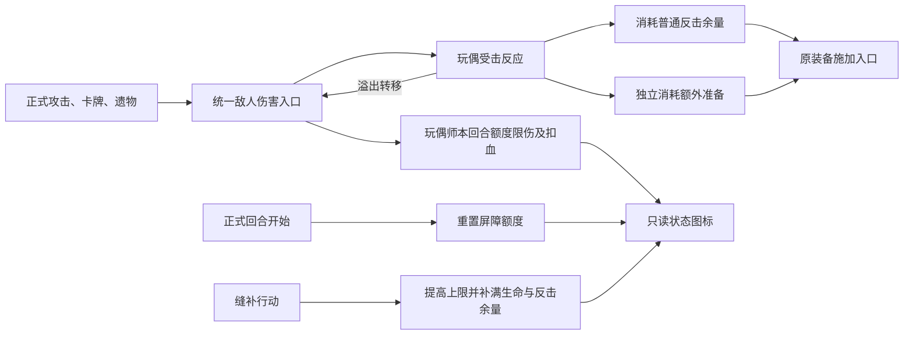

# 验证记录（现行卷 · 2026-09-14 及以后）

## 2026-09-21 图鉴原图检视

- 域：`Encyclopedia._card_family/_inspect_card`、`ArtInspection`、`Main.modal_region/_input/_notification`、中英文按钮。复用当前卡面原始纹理、现有模态及触屏输入，不另行解析画风或正反面。
- 首轮 `20260921T052056596-38184`：localization 167断言通过，UI测试误用了MainLoop上的安卓通知常量；改为Node。`20260921T052140692-28592` 暴露图鉴退出回调捕获已释放节点，改WeakRef；同时将背景快捷键测试从会激活焦点按钮的Space改为攻击键Z。原失败未删除，均不作整轮通过结论。
- `20260921T052232688-4508` UI231断言通过后，按用户最新要求去掉关闭键，补暗部触摸返回；独立审查指出1:1需包含窗口变换、同帧重开需同步释放节点名，已改用完整屏幕变换及同步remove_child，并增加对应断言。
- 阶段验证 `20260921T052448050-20764`：encyclopedia UI235断言通过，包含卡面点击、正反面原纹理、居中全图、1:1及1280×720窗口像素尺寸、测试画风、暗部／Esc／安卓返回及同帧重开。独立复审随后指出真实图鉴退出时同步remove_child可能重入父移除，原模拟退出信号测试未覆盖此路径。
- 最终 `20260921T052725152-18272`：改为隐藏并释放活动节点名后queue_free，以真实关闭图鉴替代模拟退出，再补1:1内部暗部触摸；encyclopedia UI237断言通过，exit=0、status=passed、源码指纹一致。已人工检查 `build/ui-card-art-inspection.png`。Peirce独立只读复审确认此前问题修复，无阻塞项；未做安卓真机或1:1拖动滚动专项验收。
- 源码差异检查通过；既有本地化验证后未再更改语言资源。未完整回归、打包或发布。

## 2026-09-21 施法失败提示文案

- `Main._card_tooltip` 与 `Game._cast_path` 的文案后缀精简，结算不变；旧长句及闲置后缀译文清除，短句英文已同步。
- `20260920T162124914-38800`：`localization` 167断言、`casting` UI 59断言通过；exit=0、status=passed、源码指纹一致。差异检查通过，Lorentz独立只读审查无问题。未打包或发布。

## 2026-09-20 商店刷新

- 域：`Services.start/_restock/candidates/execute/validate`、`Data.refresh_price`、初始累计字段、文案路由、商店刷新按钮与中英文。
- `20260920T050422606-4252`：`localization,services` 808规则断言通过；UI因新按钮误按行动种类查找候选，实际接口要求分组，出现脚本错误及21条连带失败。已改为按 `service_refresh` 分组查询，不删除既有失败覆盖；该轮不算整轮通过。
- `20260920T050510479-4160`：仅续跑失败的 `services` UI，289断言通过（含截图保存），exit=0、status=passed、前后源码指纹一致。规则侧通过后只改UI查询入口，原规则验证仍对应其实现。
- 覆盖50／100／200／400费用、两种付款、余额不足和旧版本提交不改资源与随机、会员卡折扣、平板锁付款限制、刷新补满已售位且不恢复删牌服务、读档后下一次库存一致、换店／Boss续轮／出狱保留价格，新局归零。UI实际点击刷新、自身不足切魔瓶、更新商品和费用、英文切换只读；已人工检查 `build/ui-shop-refresh.png` 的立绘右上按钮位置。
- 差异检查通过；未做完整回归、安卓真机、打包或发布。
- Boyle独立只读审查交易、价格、随机、存档与界面候选接口，通过且无待修问题；未另改代码或扩大测试。

## 2026-09-20 牢房探索魔瓶单次存入

- 域：`ManaFlask.limit/remaining/candidates/execute/view`、存入／取出独立次数展示、既有回合重置与存档恢复接口。
- `20260920T045425107-42156`：`consumables` 315规则断言、同名UI分类60断言通过；exit=0、status=passed，前后源码指纹一致。覆盖第二次存入原子拒绝、少于10点仍消耗次数、存档恢复不能刷新、真实回合刷新、巡视不限、反抗战斗各3次、胜利后整备不限与返回牢房重新限1次。
- UI以实际按钮完成牢房存入，验证单圆点消耗、禁用原因、取出仍可用，以及结束回合恢复。保留原战斗三次与非战斗不限次数用例；差异检查通过。此次不是完整监狱回归，也未进行打包、发布或安卓真机验证。
- Noether独立只读审查上述接口与用例，无阻断项；未修改代码或扩大到其他在途任务。

## 2026-09-20 反抗狱警失败后的警戒度核对

- 只读核对：`Guard.capture` 仅在战斗相位执行，收押时警戒度＋1并封顶5；`Prison.enter` 不再增加警戒度。已有 `prison_cases` 包含反抗失败后警戒度由1到2、再次入牢重建牌堆的断言。本次不修改规则。
- 专项 `20260920T044152453-7896` 未通过：1/1238断言失败、10引擎错误，包含在途 `_build_escape_preview` 覆写签名不匹配、依赖脚本编译错误和 `CUP PRISON legacy pair` 断言失败。保留其他任务修改，不将局部断言或静态核对宣称为通过的监狱回归。

## 2026-09-20 欲望魔方Boss奖励与小魔女淫魔法适配

- 域：Boss／开局随机遗物资格、显式拾取来源、主题遗物／稀有卡筛选、永久发牌与共用入手牌通道、小魔女七张独立卡及精神集中、中文／英文、奖励到整备。
- `20260920T042224286-37456`：`witch_character` 652、`card_expansion` 1648、`architecture` 506、`tower` 319断言通过；`relics` 两条快照断言失败。定位为新测试夹具把浮点快感赋值为整型0，复用已恢复实例时触发数值类型校验；改为0.0，保留领取／存档断言。该轮不作整轮通过结论。
- `20260920T042654100-41384`：`relics` 1914断言通过；新增英文句子的格式参数误用 `%s` 导致兼容目录加载失败和41个连带失败，已按既有规范改为 `{p0}`。独立审查同时发现奖励到整备会弃掉赠牌，已用既有 `retain_until` 保留到首个整备回合，永久副本保持普通状态。
- 最终 `20260920T042805477-13296`：`localization,relics,core` 共2511规则断言、`home` UI 140断言通过，exit=0、status=passed、前后源码指纹一致。UI双角色均以真实点击领取Boss魔方，再离开奖励进入整备，核对心痒难耐同一UID仍可使用。源码差异检查通过。
- 新用例覆盖固定兑换无赠品、随机Boss交换有赠品、角色适配后限定卡池、专用遗物耗尽滚木兜底、满手转弃牌、原基础牌保留、陈旧／重复领取不变更状态与随机、实际精神集中层数与爱欲魔纹30点阈值、原版蓄力定义不变。Goodall独立只读审查最终修复无阻断项；审查侧旧UI的source_changed结果不计入通过证据。
- 本次8条相关英文定向同步手工目录与兼容目录，既有译文保留；全目录离线生成的无关缓存缺口未处理。未做完整回归、安卓真机、打包或发布。

## 2026-09-20 连续踢：X支付、多段伤害与攻击后躺下

- 域：`BasicAttacks.forms/energy_cost/posture`、`Game._attack_offer/_execute_attack`、腿部动作切换与拖放、战神形态、体术减费、中文／英文。
- `20260920T040910113-2188`：`localization` 165、`basic_attacks` 223断言通过。`card_expansion` 首轮3个失败，来自既有减费测试将所有腿部招式预设为站姿固定费；更新该用例走正式坐下操作，分别断言固定费减费和X耗尽支付，未删除失败覆盖。
- `20260920T041013513-41584`：正式 `-RerunFailed`，`card_expansion` 1618断言、UI `basic_attacks` 259断言通过，exit=0、status=passed、前后源码指纹一致。UI经真实右键循环至连续踢，再拖至敌人，核对能量归零、四次伤害及躺姿，以及零能量红字拒绝。
- `20260920T041044599-39960`：`architecture` 506断言通过，exit=0、status=passed、前后源码指纹一致。
- 新规则用例覆盖X=0／1／2／3／5、逐击日志顺序、力量与蓄力、腿部严密度0—4、提前击杀不转移目标、固定姿势捕缚、姿势豁免、旧版本拒绝及只读预览。独立子代理Raman只读审查未发现明确问题。
- 英文完整目录生成因94条无关源文缺少离线缓存／依赖未完成；本次五句人工译文已定向同步兼容目录，既有译文保留，localization门禁通过。未做全项目回归、安卓真机验收、打包或发布。

> 路径说明：本卷正文保留撰写当时的文件路径（旧 `docs/<名>.md` 现按类归入 `docs/spec|design|guide|record|history/`）；需要定位时按文件名搜索。

- 性质：记录类，只追加；本卷即现行口径。归档卷：`verification-2026-09-13.md`（2026-09-11～09-13，190 条）、
  `verification-2026-09-12-and-earlier.md`（2026-09-07～09-10，203 条）。
- 本卷内容：84 条条目 + 卷首 3 个现行口径节。条目 = 原文 2026-09-17～14 标题条目 79 条
  + 原文缺标题的 09-17 条目 2 条（标题按正文重建，正文逐字保留）+ 作者侧 `origin/main`（v0.17.1 提交）新增 3 条。
- 现行口径节：`检查入口`／`覆盖范围`／`当前边界` 是无日期小节，属检查入口、覆盖范围与边界的现行说明，
  不随归档卷迁出；`覆盖范围` 正文含 2026-09-06 的存档批次结果，同样留在本卷。
- 条目格式：`## <日期> <标题>（角色）`。标题与正文逐字保留（仅把标题内的日期统一到标题前）；
  角色沿用原文署名，原文未署角色者不补。「域」行原文已有者保留，缺者按正文中的代码路径、
  契约文档名与主题词机械提取（无路径者为主题词归类），不新增正文事实。
- 口径与指针（不改写原文）：B3 条目存在「本批未完成 → 仍未完成 → B3 完成」更正链，三条原文均保留；
  `2026-09-17 状态迁移管线收束` 内的「截断／补跑」口径已由正文 superseded 标记指向检查路由契约；
  「提交面去重」方向经人裁定不实施，契约在 `docs/history/submit-dedup-2026-09-17.md`；
  作者侧 `修复18条基线失败` 与原文登记的既有红项并存，两侧原文均保留。
- 链接对应：作者侧条目正文中的 `pr2-integration-review.md` 即 `docs/history/pr2-integration-review-2026-09-17.md`；
  正文中的 `verification.md` 自指即本文件。
- 规范类结论（规则、接口与检查口径的可执行定义）以 `docs/spec/*` 为准，本卷只记录与链接，不复制规范正文。

## 检查入口

**现行口径**（非历史条目）。

- 规则：`Godot --headless --path . --script res://tests/test_game.gd`
- 界面与完整流程：`Godot --path . --script res://tests/ui_smoke.gd`
- Windows：`tools/check.ps1`，加 `-UI` 包含窗口内操作与截图。
- 窗口专项：`tools/check.ps1 -UIOnly -UISuite rewards`；可选equipment_complete、pressure、guard、prison、tower_progression、events、rewards，并可逗号组合。从同一窗口入口运行既有模块、每项先重置、按注册顺序去重；默认all保留原完整流程，未知套件拒绝。不复制测试，不把部分专项统计成完整窗口结果。
- 相关规则：`tools/check.ps1 -Suite equipment_complete`，按统一注册表补齐core/equipment/links/composites依赖、去重运行。可逗号指定多个套件，默认all；每套件记录耗时。规则通过后的纯显示修改用同一入口的`-UIOnly`，保持错误日志与完成标记检查。

## 覆盖范围

**现行口径**（非历史条目）。

2026-09-06存档批次最终结果：`tools/check.ps1 -Suite persistence -UI -UISuite persistence`通过2285项规则断言、33项存档窗口专项，无引擎错误。14个规则套件按依赖去重运行，其中persistence293，其余继承rewards及传递依赖1991项，另有选择断言1项。此前本批完整窗口`-UIOnly`通过552项断言；最后补充运行期间不兼容文件保护后，重跑完整关联规则及存档窗口专项，不把专项计作新的完整窗口结果。

存档案例覆盖全部33项实际练习与64位大种子；保存→恢复→正式下一步和不中断运行逐项对照，资源、随机、牌堆与日志均不变化，只有操作版本刷新。覆盖战斗、奖励、整备、地图、行进、休息、整理道具、事件选择/钥匙/结果、多段挣扎与双重开锁中途、已保留一张牌、待发放遗物、过载、入狱结果、牢房、巡视到达/结果/完成、反抗战斗、五级结束与练习完成。练习实际开门逃回塔底后存档身份仍为practice，写入不覆盖tower。

失败案例检查缺字段、未知阶段/卡牌、牌堆不一致、损坏随机/意图/地图引用、重复编号风险、非有限数、错误格式、损坏JSON和校验和；失败恢复保留当前状态。真实文件案例检查首次保存、连续替换、上次备份、主文件损坏回退、后续修复、不同档位隔离、文件夹不可写时保留原文件；不兼容主文件不自动回退，也不能在游戏运行期间被普通自动保存覆盖，只有明确新局可以替换。

初次完整对照发现文本浮点往返与Godot StringName转普通字符串导致差异。当前整数使用十进制类型标记、浮点保存原始64位、StringName保留名称类型；全部真实装备/事件往返及后续动作对照已通过，没有用近似比较掩盖状态差异。恢复不运行状态清理、回合开始或随机生成，无法继续的损坏多段选择被拒绝。

窗口专项实际启动新场景读取自动保存，验证成功操作写入而翻面/查看/旧版本拒绝不写；塔路/练习按钮、缺档禁用原因、练习分档、多段拖牌恢复不重复扣费、事件隐藏结果保留与结算后不能重选、备份回退提示、未知版本暂停自动保存、明确重开后恢复写入。截图`ui-56-save-menu.png`、`ui-57-resumed-card.png`、`ui-58-save-recovery.png`、`ui-59-save-incompatible.png`已查看，界面内容在视口内。测试在独立build临时目录执行，基础窗口挂载前禁用文件保存，未访问玩家存档。

架构：Game继续持有唯一游戏状态，snapshot只作结构保护、复用现有注册表及规则校验；save_store统一无损编码、格式和文件替换。UI仅在已有成功提交入口调用保存，读档清理界面焦点并派发完整恢复。状态新增save_slot用于固定开局归属，不根据逃狱后的practice标志猜测档位。未来已有字段含义变化需显式迁移/版本升级；本批是首个格式，无历史版本迁移承诺。

2026-09-06首批奖励补全：规则入口`tools/check.ps1 -Suite rewards -UI`通过1992项断言，包含全部13个相关套件且各执行一次：rewards162、events204、core301、equipment108、links37、composites83、equipment_complete229、prison153、guard120、pressure105、enemies160、tower184、tower_progression145，另有选择断言1项。同轮完整窗口通过520项断言，无引擎错误。随后仅修订第二段开锁说明，完整窗口复查因最小化暂停并打断鼠标拖放，该轮明确作废；恢复干净窗口后最终执行`tools/check.ps1 -UIOnly -UISuite equipment_complete,pressure,rewards`，34项装备、28项压力、27项奖励共89项窗口专项全部通过，无引擎错误，模块耗时合计约11秒。规则行为未因这次显示与检查入口修订改变。

本批完成找准松处、扯开缺口、接连挣动、逐层抽离、双重解锁，以及断缚护腕、游丝指环、回身缎带、余烬晶石。规则覆盖32种子随机奖励无重复/可复现/独立域、8张牌全部可抽取、只读预览；五种自由效果的费用与魔法身体条件、先保留后抽牌与两张保留不重复延期；滑脱标记实际加伤/免疫消耗/回合及提前离房清理；直接解除返能量；两段每次重新计算强制目标与新外层、并列选择、只支付一次、旧版本拒绝、选择期间不能插入其他行动、无目标不转自由效果；整张牌后一次压力增长与立即过载。

遗物检查直接归零与连带移除区分、每玩家回合刷新、实际二档到一档抽牌与纯降档/直接移除排除；真实飞踢落地后躺到坐的零费边界与机会消耗；实际魔力费用减免后的50%返还、每战首次限制、自由面不占机会、非战斗不触发。补充双重解锁先牢门后装备/先装备后牢门、储备术式只消耗一次、可停止第二把且不退费、真实收押保留全部遗物并清临时状态。非法多段状态在提交前原子拒绝。

窗口沿既有入口新增`tests/reward_ui_cases.gd`，共用原生拖牌、实际候选按钮、目标框滚动与截图助手。验证2费显示、拖向第一件后真实选择并列第二件、自由面直接拖到玩家保留两张、两把实际装备锁只耗一次魔力、单手受限时自由魔法仍禁用、新牌奖励进入卡组、完整遗物列表可滚动到最后一件。截图`ui-52-chain-targets.png`至`ui-55-relics-scrolled.png`已查看；最初测试误传装备ID而非候选ID，门禁正确报失败，修正后重跑通过。末次截图发现第二段开锁说明重复提示下一把，已修正为本次结束并补窗口断言，最终奖励专项通过。

整合：`data/card_rules.gd`集中机械定义及普通／罕见／稀有／完整奖励池；`core/card_effects.gd`共用旧牌和新牌的目标、费用、保留及逐段处理；`core/relic_effects.gd`统一直接触发、次数与行动后发放。只读投影/界面不增加状态写入口，卡牌和遗物均继续沿`dispatch`提交。事件奖励池已按真实稀有度拆分，文档及扩展接口同步。暂定数值为滑脱准备＋3、重挣扎9、两段各4、晶石返还50%；不表示最终平衡完成。

2026-09-06首批事件与扩展接口历史结果：`tools/check.ps1 -Suite events -UI`通过1826项规则断言、494项窗口断言，无引擎错误。相关依赖覆盖当前全部12个规则套件，每套件只执行一次：events200、core301、equipment108、links37、composites83、equipment_complete229、prison153、guard120、pressure105、enemies160、tower184、tower_progression145，另有选择断言1项。

本批新增`tests/event_cases.gd`和`tests/event_ui_cases.gd`，沿既有入口检查。规则覆盖：12种子冻结完整方案、独立事件随机域、预览不写状态/编号/随机、不向UI泄露有效钥匙；三种裁缝交易真实普通/复合安装与组件锁、加固2/10→8/10、无目标中级回退、选牌与跳过不退代价；拒绝费不足/为零仍能结束；三枚钥匙分别用实际种子覆盖全部成功/失败、锁优先新目标、眼罩/皮带真实加固、不可重复领奖、满眼部容量拒绝完整赌局。检查未知效果、无效状态和目标不合法不留下部分装备或奖励。

奖励覆盖：慌乱无主动候选、虚无先于保留、卡组不删除、下一战和完整巡视恢复；开锁针零能量真实开锁、不改耐久、消耗次数、不能安装、手腕限制及姿态接触；开牢门仍检查逃离速度，逃出保留工具次数和遗物。折叠工具匣增加实际容量，整备沙漏延长实际战后整备；同遗物拒绝重复，池耗尽不提供无法发放的遗物方案。事件不触发回魔或战后奖励，不消耗跨战增益，离房仍检查容量。

窗口覆盖：正式地图两事件图标、进入后查看地图不重抽、真实点击交易/三选一/跳过/离房，钥匙阶段只有三个选项且无道具操作；领取遗物显示已生效说明，实际中奖开锁针在休息房打开指定锁并扣次数。已查看`ui-46-tailor-choices.png`至`ui-51-lockpick-tool.png`：选项代价、锁的变化、事件奖励与遗物说明完整。窗口长路线也逐房经过事件，通过正式拒绝和离房完成；新事件占用原战斗分支位置，因此路线最低数量按战斗＋已完成事件合计检查，战斗奖励仍逐场一一对应。

整合：警卫与事件共用`equipment_offers`及真实实例工厂；复合生成组合回到结构数据，敌人将行为/外观/装备池拆成模板字段；事件配置使用配方或显式原子效果，新增内容不得再复制阶段流程。遗物与卡牌特性通过注册表参与真实规则；扩展位置和约束在`docs/content-extension.md`。该历史批次仅用过渡牌池，五张奖励牌和四件遗物在后续批次补齐；没有新增升级、专属首领行为或完成最终数值平衡。

2026-09-06塔路精英与塔顶批次历史结果：导入通过，全部11个规则套件共1622项断言通过；修正窗口测试对并拢飞踢伤害及躺姿代价的预期后，`tools/check.ps1 -UIOnly`通过479项窗口断言，无引擎错误。规则分项：core297、equipment108、links37、composites83、equipment_complete229、prison153、guard120、pressure105、enemies160、tower184、tower_progression145，另有套件选择断言1项。

新增`tests/tower_progression_cases.gd`与`tests/tower_progression_ui_cases.gd`，共用原检查入口。覆盖12种子下第8/12层可选精英及实际绕行连接、第16层双警卫与唯一出口连接；实际旅途保留装备和资源，两名70生命警卫分别受击，只击倒一名不能领奖；奖励、整备和容量整理完成前出口不开放，伪造抵达出口的移动完整回滚。精英与塔顶均沿正式收押、探索、坐姿踢开通风口、逃离和重建塔路流程检查，安全等级保留，新塔顶使用新敌人实例。

窗口验证实际地图查看不跳房、拖踢击到指定警卫、携带腿部装备时并拢飞踢造成10伤害并打断且变躺姿、双警卫失败仅入狱一次、正式塔路重开入口、领取奖励和整备后前往出口。`ui-41-elite-summit-map.png`至`ui-45-summit-cleared.png`已实际查看：地图图例、双敌意图、失败分支与通关文字完整。初次窗口测试把携带腿部拘束的踢击误按普通6伤害断言，修正为真实10伤害及姿态代价；修正过程中的测试字段笔误由错误日志门禁拦截，最终窗口重跑通过。

本批统一`room_entry_reason`供地图与正式前进读取；`-Suite tower_progression`自动合并监狱、警卫、塔路及传递依赖，各套件只执行一次。长路线规则与窗口复用`tests/route_driver.gd`，仅在流程测试中降低警卫生命，后续攻击、奖励和整备仍使用正式操作。定点窗口夹具从真实相邻休息房开始；原长路线检查仍逐房前进。这些通过结果不表示70生命双警卫与当前牌池的最终难度已经平衡。

监狱批次历史最终结果：`tools/check.ps1 -Suite prison -UI`通过1463项规则断言和423项窗口断言，无引擎错误。相关依赖覆盖当前全部10个规则套件：core283、equipment108、links37、composites83、equipment_complete229、prison153、guard120、pressure105、enemies160、tower184，另有选择断言1项。最终左右分栏牢房与返塔地图截图已再次查看。

2026-09-06监狱批次：新增`tests/prison_cases.gd`与`tests/prison_ui_cases.gd`，沿原套件/窗口主入口执行。`-Suite prison`合并guard/tower及所有实际依赖，每套件一次；初次完整`-Import -UI`通过1444项规则、423项窗口断言。随后优化牢房左右分栏，并补充高安全等级、手势条件和反抗整备超容量检查，最终结果见下方。

规则覆盖：真实收押进入牢房、普通抽弃补能、独立有限发现随机、只读投影不泄露未发现顺序；探索费用按真实区域等级、零费发现不可重复刷取；倒计时精确到巡视，降低耐久不等于缺装，组件编号丢失可被发现；清单齐全保留随身工具、没收已安装工具；违规收紧及按安全等级追加真实装备、没收所有工具、不恢复通风口。检查完成才恢复消耗牌至弃堆、不能重复确认。三个巡视节点都可反抗且不提前恢复消耗区；胜利发专用钥匙、一次正常奖励/恢复、整备容量整理后回牢房；失败保留装备并只增加一次安全等级。开锁使用真实卡牌、手势条件、压力魔力费用和储备，旧版本/姿态变化不能绕过出口速度。坐姿并腿踢击打开通风口，每玩家回合一次，扣能量并消费对应蓄力；出口检查携带容量。逃离保留资源/装备/卡组/增益/安全等级，遗留墙面工具，重建路线而非复刷旧房，下场才正常补能。最后一回合过载只到达一次巡视、下一玩家回合只扣一次惩罚，回合中过载关闭探索和出口。非法发现记录导致回合、牌堆、资源和日志完整回滚。

窗口覆盖：真实练习菜单，测试夹具仅把警卫的已公开意图推进至收押，随后实际结束回合与进入牢房；点击探索获得两件有限工具和通风口，安装工具沿原道具入口，逐回合进入巡视，检查后真实没收墙面工具，继续启动下一巡视钟。坐姿三次踢击后经独立出口返回新塔底，地图实际显示可达的新入口。原生拖牌确认自由面不能开门、拘束面消耗实际“术式解锁”和魔力后打开牢门，并沿速度合格路线逃出。基础三姿态与原身体装备拖放继续保留。

截图`ui-37-prison-cell.png`、`ui-38-prison-inspection.png`、`ui-39-prison-vent.png`、`ui-40-prison-return.png`已查看。牢房最初纵向长列表已改为探索/通风口与牢门左右分栏；返塔地图使用独立塔底节点，不与首层重叠，也不再显示当前房间不可达的矛盾提示。五级只完成终局流程，不把未生成的专用固定套装计作通过；当时特殊道具路线和塔路精英节点尚未接入；本批已接入塔路精英。

2026-09-06警卫批次历史检查：`tools/check.ps1 -Import -UI`通过，导入无错误，规则1310项断言、窗口381项断言通过。规则分项：core283、equipment108、links37、composites83、equipment_complete229、guard120、pressure105、enemies160、tower184，另有套件选择断言1项。相关入口`-Suite guard`已通过1126项断言，自动合并依赖，每套件只执行一次；最后完整回归同时确认原塔路与普通敌人流程。

警卫规则覆盖：12个种子的意图/普通与复合工厂合法性、同种子复现、工厂探测不改状态或随机；公开的额外操作不递归、先加固再上锁、原目标失效落空；蓄力与先手双操作、普通回合不重复执行、打断延后；第10回合完成后11准备/12执行，双区域满级触发锁定、解除不取消、不改写当前意图；准备和执行分别打断、击倒取消、躺姿仍按既定先后手执行收押；双警卫首个收押立即终止整场且只增加一次安全等级，击倒两者才发一次奖励。入狱验证原装备耐久/锁/组件/链接及魔力/压力/卡组保留、随身与安装工具没收、增益/惩罚清理、实际新增普通件和链接、检查基准一致、无战后恢复奖励、重复回调与旧行动拒绝。非法附加操作引起整个正式提交回滚，资源和日志一并恢复。案例集中在`tests/guard_cases.gd`，不复制通用规则测试。

警卫窗口覆盖：真实菜单启动单/双警卫，拖踢击到指定实例只影响该敌人；逐回合经过打断、连动、收押进入真实结果，查看保留/新增装备不写状态；该批结果仅到入狱；本次已改为通过正式入口继续牢房。`ui-34-guard-intent.png`、`ui-35-capture-result.png`、`ui-36-double-guard.png`已实际查看，意图与收押提示完整，双敌目标分离。警卫仍为临时轮廓，非最终人物素材。

压力批次历史最终界面复核：`tools/check.ps1 -UIOnly`通过339项断言，无引擎错误；当时保留上一轮1000项相关规则日志。法术牌当前费用和过载空手牌提示已随截图复核。

2026-09-06压力批次：首次`-Import -UI`完整回归通过1183项规则断言、338项窗口断言。随后补充法术牌实时费用与无来源时的预览快速返回，以`-Suite pressure -UI`通过1000项相关规则断言和338项窗口断言；相关套件为core283、equipment108、links37、composites83、equipment_complete223、pressure105、enemies160，另有选择断言1项。tower184已在本批完整回归通过，后续修改未触及塔路。过载空手牌文案另用UIOnly复核，最终结果见下方。

新增压力覆盖：0/40/80分档与单调魔力曲线、加费后再扣储备、实时法术牌费用、免费魔法不加费且休息房仍禁自由效果；稳定心神费用/版本/回滚；来源时机和装备移除停止；行动后增长、立即过载、余数、多次累计、魔力归零下限、禁用全部剩余动作；后续回合惩罚只消费一次并与能量增益抵扣；先后手下的两名敌人顺序、打断一并延后、不取消第二名敌人、不重复前一敌人阶段；战斗结束/奖励/整备/练习退出只继承压力；移动来源保留、房间来源停止；非法来源使整个提交回滚。核心案例为`tests/pressure_cases.gd`，沿原依赖注册表合并运行。

压力窗口：真实滚动菜单启动两种练习，压力按钮显示实际来源/时机/魔力倍率，稳定心神扣费；两次原生拖牌触发过载、弹出结果、只保留继续入口；继续后准确更新休息计数和能量；敌人意图显示威压65，两个实际行动累计过载2次；完成战斗、选奖励进入整备保留压力而无惩罚。截图`ui-31-pressure-sources.png`、`ui-32-overload.png`、`ui-33-enemy-pressure.png`已查看。看到空手牌旧提示与过载冲突后，已修改为跳过剩余行动并增加窗口断言。

- 初始10牌、抽弃牌守恒、保留牌到期、奖励加牌、三回合整备和跨战继承。
- 紧度边界、同比降档、锁减半、单件无堆叠惩罚、分层与同层目标选择。
- 普通滑脱免疫时仍付费、眼部无挣扎不能触发自由分支、魔法身体条件及资源折扣。
- 姿态相邻切换、借墙结束玩家阶段、先后手只在回合开始判定。
- 冻结意图、打断不重抽、连续打断限制、击倒与附着离场各自结束战斗。
- 版本过期、伪造或不可用行动拒绝且不改状态；预览不推进随机；固定种子复现。
- 实际窗口按钮完成选牌、目标选择、出牌、遭遇、奖励、整备、下一场与重开。

2026-09-06装备补全历史记录：Godot 4.7.2。该批通过`tools/check.ps1 -Import -UI`：导入无错误，规则1073项断言、界面311项断言通过。窗口检查覆盖1600×900与默认1440×810。规则分项为core283、equipment108、links37、composites83、equipment_complete217、enemies160、tower184，另有套件选择断言1项。全规则约6.6秒，各套件只执行一次；未缩减既有规则覆盖。

本批修正了底栏溢出、同部位目标名称混淆、蓄力在体术衰减前计入基础伤害，以及浮游锁在蓄力时确定最终目标。确认目标提前解除后，锁的最终附着落空，不改选新目标。

新增覆盖：沿不同分支均可完成长塔路并抵达出口；禁止跳房与重复领奖；移动耗时按姿态和实际固定部位计算；移动期间牌堆、资源、玩家回合增益与随机游标不变。

界面测试使用真实鼠标事件验证右键翻面和Godot原生拖放：自由面生效、错误牌面拒绝、拖离目标取消、两件装备分别展开、拖入第二框只移除第二件，以及三档免疫滑脱仍扣除卡牌和费用。

新增角色拖放：固定攻击以实际落点敌人为目标，法术费用只扣一次；攻击不能作用玩家，已离场敌人不接收，挣脱牌不能作用敌人。姿态拖到玩家使用正常费用和回合规则。拘束面拖到玩家后先选部位，再选具体装备；选择前无消耗，右键翻面撤销原选择。自由面点击或拖到玩家直接生效；魔法身体条件不满足、能量不足均不扣资源。截图补充 `build/ui-09-actor-actions.png`、`build/ui-10-player-picker.png`。

休息房覆盖：真实塔路进入与离开、5回合耗尽、提前离开、每房服务仅一次、无自动回魔与消耗牌恢复、禁止自由效果但允许拘束分支的附加收益；挂钩3次、同比降档、三档紧度绕过、结构及外层限制和姿态范围。

工具覆盖：手指与脚趾安装、使用无能量费用、只切外露兼容材质、锁不减伤、次数共享与耗尽移除、携带容量减少、超载整理、随身次数跨房保留与安装工具离房遗失。窗口操作覆盖领取、打开道具面板、安装到墙脚、改变姿态和两次实际切割。截图：`build/ui-11-rest-room.png`、`build/ui-12-hook-targets.png`、`build/ui-13-field-tool.png`。

新版截图：`build/ui-01-battle.png`、`ui-02-free-drag.png`、`ui-03-two-targets.png`、`ui-04-reward.png`、`ui-05-map.png`、`ui-06-travel.png`、`ui-07-cleared.png`、`ui-08-default-window.png`。较早无ui前缀的截图仅为历史验证产物。

## 当前边界

**现行口径**（非历史条目）。

架构整合验证：显示投影不推进随机或修改状态，嵌套显示数据不引用可写的运行状态；篡改显示中的伤害或费用不能覆盖提交时的正式判定。战斗、整备、休息三种真实流程下，下回合能量只消费一次，抽弃牌守恒，魔力不额外恢复，战斗计数与非战斗倒计时分别推进。

界面索引验证：实际敌人与不存在目标分离、空行动组保持为空；打开面板不推进规则，外部状态推进后旧候选与旧拖放均拒绝且不消耗资源，失败提交也刷新显示和索引。原有125项界面断言包含完整战斗、路线、休息房和工具操作。

检查入口新增退出码、错误日志和完成标记三重检查。实测临时注入运行时错误后，Godot仍打印`PASS: 261 assertions`，入口正确判失败；已恢复原测试文件并重新跑通过。故障注入仅用于验证检查入口，未留在游戏或测试源码中。最新日志为`build/check-rules.log`与`build/check-ui.log`。

模板批次覆盖：四类材质的生成与实际解除、初/中级和紧度独立、材质版本随意图冻结、独立随机序列、错误部位/锁定/材质版本/耐久的原子拒绝、同部位混合容量与外层追加、加固与滑脱共用既有规则、胶带不继承旧粘性封锁、锁选择和执行时的双重复核、石片与锯条对塑料的实际兼容差异。专项案例在`tests/equipment_cases.gd`，由原规则入口统一运行。

装备练习通过真实界面入口启动：鼠标点击重开面板、编号合法性、四材质显示、明确的徒手/切割禁用原因、锯条两次切断扎带、原生拖牌滑脱胶带、挂钩解除绳索、练习结束及回到塔路。练习沿用正式候选和提交，5回合到期不产生战斗奖励或塔路进度。截图：`build/ui-14-equipment-practice.png`、`build/ui-15-material-tools.png`、`build/ui-16-practice-menu.png`。

敌人批次覆盖：绳索四阶段与第二回合两类分支；眼罩两回合蓄力、规格冻结、初/中级、各阶段打断、提前击倒、公开前后眼部容量改变的施加落空；同种多敌的独立生命、行动和来源，跨房ID不复用，全部离场仅奖励一次。眼部受阻立即显示且不擅自隐藏敌人意图。弱池开局抽取与只读预览可复现。专项案例在`tests/enemy_cases.gd`，由规则入口统一运行。

地图覆盖：已走连线严格对应真实移动记录；未选分支、正在移动与未来路线分别投影；房间图标查看不改变状态、不产生跳房候选，滚动位置随查看保留。窗口中实际点击未来节点，进入绳索＋眼罩战斗，并拖放踢击到第二只绳索，确认只有落点目标受伤与延后。战斗内查看地图不会叠出结束回合按钮。截图：`build/ui-17-rope-blindfold.png`、`build/ui-18-double-rope.png`、`build/ui-19-spire-map.png`。

长塔路覆盖：30个种子的节点唯一、向上连接、全节点可达、无非出口死路、生成段分支不交叉；同种子复现与不同种子变化；第7/11/15层休息点；预览不修改图或随机游标；两条完整长路线每战奖励一次。案例在`tests/tower_cases.gd`。窗口通过真实按钮完成长塔路，切换整塔总览、定位当前房间并维持不可跳房规则。整塔截图为`build/ui-20-full-tower.png`。

人物美术覆盖：从正式姿态动作依次切换站/坐/躺，显示正确图集区域并保持比例与地面对齐；绘制与动画不改变状态或随机游标；窗口像素检查确认绿底消失且粉色人物仍可见，原拖牌目标继续正常工作。当前使用用户本轮指定的三姿态附件，躺姿区域已扩展以完整容纳头发。截图：`build/ui-21-hero-stand.png`、`build/ui-21-hero-sit.png`、`build/ui-21-hero-lie.png`。绿底透明由专用画材在运行时完成，保留源图。

普通链接覆盖：两端引用同一共享耐久，显示快照无可写引用；同对逆序重复、失效目标、跨区域连接与普通施加入口拒绝；独立紧度伤害、蓄力只消耗一次、旧拖放原子拒绝、无滑脱与上锁；方向声明只阻止指定装备的滑脱。徒手接触检查任一外露且可达连接处，不把连接装备的锁或材质误当链接自身限制；工具固定伤害、次数与零能量费用；移除链接保留装备，移除必要装备清理链接，新装备不重接；战后、整备和房间移动保留连接。非法链接导致回合事务完整回滚。专项案例在`tests/link_cases.gd`。

链接窗口覆盖：真实点击独立练习入口、两部位显示连接标记、原生拖牌选择共享链接目标且仅结算一次、坐下后切割并同步更新两处详情。截图：`build/ui-22-link-targets.png`、`build/ui-23-link-released.png`。链接练习继续使用正式5回合规则与两件切割工具。

单手套覆盖：短/长与直/交叉四种组合的原子创建、覆盖与能力差分、组件共享目标和只读投影、容量与内外层、关闭手指后的施法/握持/安装条件、组件独立锁、肩带紧度上限、结构滑脱/挂钩前置、首次肩带解除不触发同次脱下、跨三档伤害不倒推资格、切割/滑脱不冒用挣扎捷径、外层阻挡、套体破坏保留独立内外层、敌人组件上锁、跨战与跨房保持、错误覆盖原子回滚。新增83项断言集中于`tests/composite_cases.gd`，通用材质、链接与回合案例不复制。

单手套窗口覆盖：真实菜单启动短型/长型，拖牌至手腕或小臂后选肩带和套体；两次滑脱去除一侧直肩带，再用一次挣扎按预览解除整件并更新资源/容量。长型验证交叉肩带共享耐久、挂钩前置、关闭手指后的切割拒绝、脚趾安装与躺姿固定工具切割。截图：`build/ui-24-glove-components.png`、`build/ui-25-glove-release-preview.png`、`build/ui-26-long-glove-tool.png`。目标摘要与完整详情分开，禁用原因不重复堆放。

检查整合实测：composites选项自动执行core/equipment/links/composites，各套件仅一次；完整规则约5秒（按输出分项耗时），未削减既有断言。未知套件misspelled实际返回非零且不生成成功标记，日志为`build/check-suite-rejection.log`，其中错误属于这次预期拒绝。窗口共用真实练习启动和滚动至指定拖放目标助手；UIOnly只重跑窗口流程，保留此前规则日志。

装备补全覆盖：29个练习的真实生成数量与配置一致，预览不写状态；普通模板全部合法等级；四种单腿套破坏套体后的外带ID/耐久/锁/链接保留、能力恢复与容量预留、长短叠层和超容量原子拒绝；拘束衣双前置、无滑脱袖部连接、已安装工具处理与整件清理；左右独立包裹的手势/握持/卡牌自由分支和上肢容量单次扣减；眼口胶带、马具逐眼罩紧度比较、相等允许、母件/附属件分别解除、马具独立锁减伤；十二种躯干固定的手持/徒手范围；高级复合基础耐久且无未定义魔法效果。损坏组件结构后的失败回合完整回滚。新增217项断言集中在`tests/equipment_complete_cases.gd`。

装备窗口补全：共用助手滚动到菜单下方并真实点击；工具三次切断单腿套套体后，链接仍引用遗留外带，随后原生拖牌到该外带准确扣耐久；自由的另一只手切开单侧包裹；拘束衣禁用原因可见，并用脚趾安装工具、切换坐/躺、切割真实袖部连接；马具分别阻止较松眼罩并允许等紧度眼罩使用挂钩；高级材料真实显示。新增窗口案例集中于`tests/equipment_ui_cases.gd`，从原窗口入口运行，共用助手。截图`ui-27-leg-bands-retained.png`、`ui-28-jacket-structure.png`、`ui-29-head-comparison.png`、`ui-30-advanced-catalog.png`已查看确认。悬浮眼罩另新增16种子规格文案检查与两模板覆盖，保留冻结/打断/落空原有测试。

四类普通材质、眼口、包裹、单手套、四种单腿套、拘束衣、躯干固定和普通/组件链接均有真实装备规则与练习入口。29项装备练习、2项压力练习、2项警卫练习合计33项。警卫练习已施加合法中级普通/复合装备，并完成实际入狱保留、没收与追加结算。普通塔路敌人生成绳索、皮带及布带/胶带眼罩；第8、12层的可选警卫与第16层塔顶双警卫可生成合法中级普通/复合装备。地图包含15层房间、第16层双警卫与第17层出口，约30节点。监狱探索、巡视、反抗、消耗恢复、三条基本逃路与返回塔底现已实现。第5/9层已加入首批两个事件，慌乱、开锁针、工具匣与沙漏已实际结算。五级专用固定结局装备、特殊逃离道具、其余道具与多章节尚未实现；自动存档与继续游戏已在后续批次实现；颈部用途、肩部跨区域链接、额外通用加固、驷马/折叠固定和专项模板不在本批已定义范围。数值集中暂定，主角仍只有基础三姿态，无逐件穿戴差分；警卫临时轮廓不代表最终美术。

窗口截图生成在 `build/`，不是运行资源。

## 2026-09-17 v0.17.1 修复版发布成品

来源：作者侧 `origin/main`（v0.17.1 提交，2026-09-17），正文逐字保留。

域：检查与测试、打包与发布。

- 用户要求更新GitHub为0.17修复版，同时提供PC、Android及密码保护的双层压缩版。版本统一为0.17.1，Windows文件版本0.17.1.0，Android versionCode由9升至10；保留原v0.17标签与发布，不并入PR #3的macOS打包。Android打包脚本改为读取同版本说明并附基础教学，避免沿用根目录旧说明；成品探针继续对0.17.x执行小魔女检查。
- `20260917T030419647-26868`：导入、architecture 471、touch 23通过，退出码0、源码指纹稳定。此前修复批次与PR整合各分类结果仍按下文分别记录；本次未重跑全项目或全部种子。根指引检查及5项检查器测试通过。
- Windows输出`outputs/spire-v0.17.1-windows-x64-fix-20260917`，导出前后运行资源指纹一致。`package-check-20260917T030529454`通过PCK内容、贴图、新局、练习、隔离保存恢复、小魔女平衡及发布EXE独立无头启动检查；未将无头启动宣称为目视渲染验收。
- Android输出`outputs/spire-v0.17.1-android-fix-20260917`，导出指纹一致，包名org.magic.spire、版本0.17.1／安装版本10、minSdk24、ARM64＋ARMv7。V2／V3验签、16KB对齐、provider唯一性及12份内容逐文件校验通过；证书SHA256与v0.17相同。`android-probe-20260917T030545246`包内资源探针通过。adb未发现设备，未做真机安装／触控／性能验收。
- 最终成品在`outputs/release-v0.17.1-20260917`，附验证说明、许可、基础教学和SHA256SUMS.txt。普通Windows／Android ZIP实际解压后与成品目录逐文件SHA256一致；双层7z包含两平台完整目录，内外两层都加密文件名，正确密码解压成功、错误密码拒绝读取，两次解压后的全部文件与源目录一致。证据在`outputs/verify-v0.17.1-20260917/verification.json`。
- GitHub按v0.17.1新标签及同名修复版Release交付，上传后以服务端附件SHA256与本地文件比对，再公开发布。缓存、测试存档、签名秘密、临时发布脚本及构建日志不纳入源码提交。

## 2026-09-17 修复18条基线失败

来源：作者侧 `origin/main`（v0.17.1 提交，2026-09-17），正文逐字保留。

域：界面、检查与测试。

- RuleChangePackage：玩法数值、候选、事务、随机和存档结构不变。本批修正17条过时测试前提，并把主页显示设置保存错误提示从右下角移到左侧免责声明上方，解决字体最小高度使控件底边超出900逻辑画布7像素的问题；保留现有错误文案及更新入口，无新增翻译或运行时状态副本。
- card_power的5条失败来自通用奖励池误包含小魔女专属牌；保留稀有度与排除条件检查，补五张专属牌在双方角色奖励池中的正反例。tower_progression的6条生命断言补上夹具保留的警戒2所产生的10点加成，保留周目倍率、分裂不重复缩放及固定治疗5点；另4条出狱顶层流程失败改为先正式选择10／11层入口，并增加未选择时拒绝跳顶层、失败状态不变的检查。
- home_persistence的新局预期改为真实开局奖励阶段departure，同时核对落盘阶段；宝箱恢复检查真实奖励面板，商店保留服务面板检查，二者均实际点击离开／继续并核对房间完成。保留精确恢复、资源和库存断言；新增非空保存错误在缩放后仍位于画布内、不压住免责声明且不改变游戏状态的检查。
- 主工作区`20260917T025735300-30980`：`tools/check.ps1 -Suite card_power,tower_progression -UI -UISuite home_persistence,home -KeepGoing -TimeoutSeconds 600`，规则card_power 1788／tower_progression 225共2013项通过，UI home_persistence 51项通过；home原左侧三控件断言因新增提示区失败，同批退出码1，源码指纹稳定。原失败日志保留。
- 更新home布局断言，明确检查标题、角色说明、保存提示和免责声明四个控件及状态不变；仅补跑受此修改影响的home分类。`20260917T030014632-4392`：`tools/check.ps1 -UIOnly -UISuite home -TimeoutSeconds 600`，113项通过，退出码0、源码指纹稳定。
- 本批最终按分类去重为规则2013项、UI164项通过，18条基线失败均已处理；不是一次全项目或全部种子回归。未生成截图、提交、推送、打包或发布。

## 2026-09-17 PR #2 架构与固定点存档选择性整合

来源：作者侧 `origin/main`（v0.17.1 提交，2026-09-17），正文逐字保留。

域：契约 `pr2-integration-review.md`。

基线e635bf5，PR头a56de58；先在隔离工作树验证，保留根／模块指引与现有目录。引入查询索引、文案按需入口、统一事件节点、状态迁移和checkpoint保存。修复非手牌实例显示被覆盖、四个测试文件漏迁移详情接口、重开时旧候选访问新游戏；存档文案及英文生成来源同步。RuleChangePackage、逐分类结果与可复现日志见[整合审查](pr2-integration-review.md)。

首批17个规则分类7996项、11个UI分类1280项分别通过；当时card_power 5条、tower_progression 10条、home_persistence 3条失败均在真正v0.17基线复现。这18条随后已处理，详见本文顶部修复记录；原失败日志保留。不是一次全项目门禁；未运行全部种子、Android／macOS真机或上游私有oracle，未截图、提交、推送、打包或发布。

## 2026-09-17 打包：Windows x64 v0.17（build pr2-20260917，协调者）

域：`tools/package.ps1`／`tools/check-package.ps1` 的产物与复验。**只打包，未发版、未推送、未做 Android。**

**环境（本机首次搭起，两条前置已登记 `.zcode/skills/repo-ops/SKILL.md`）**：引擎 Godot **4.7.2.stable.official.ed1daf0bf**（本机原先只有 4.7.0，与既有发布口径不符，故按 `docs/packaging.md` 装 4.7.2）；导出模板取自官方 4.7.2-stable TPZ，**SHA256 `f298490b8d44d934be425a5a65a51bf15f422428b229a06a6e11d9ffea248011` 逐字等于文档记录值**，只安装 Windows x86_64 的 release／debug（±console）、`version.txt`（`4.7.2.stable`）与 `icudt_godot.dat`；打包脚本须用 **PowerShell 7**（5.1 无 `[IO.Path]::GetRelativePath`），且 `GODOT_BIN` 必须指向 `*_console.exe`（否则 GUI exe 不被等待、`$LASTEXITCODE` 为空，导出成功也会被判失败）。

**产物（`outputs/`，已被 `.gitignore` 忽略，不入库）**：目录 `spire-v0.17-windows-x64-pr2-20260917/`（24 项，含 `紧缚尖塔.exe`／`.pck`／12 份内容包／授权／`版本更新内容.txt`／`验证说明.txt`／`manifest.json`）；ZIP `spire-v0.17-windows-x64-pr2-20260917.zip`；校验和 `…-checksums.json`。

| 判据 | 结果 |
| --- | --- |
| `package.ps1 -BuildId pr2-20260917` | 退出码 0；导出前后运行源码指纹一致（`build/package-pr2-20260917/source-manifest.json`）；日志无 ERROR 行 |
| `check-package.ps1 -Directory <成品>` | **PASS**（清单逐项 SHA256 一致、发布 EXE 启动、成品 PCK 资源探针）；两次：`build/package-check-20260917T115621322`，加入包内验证说明并同步登记清单后 `…T115708521` 再次 PASS |
| ZIP 解压复核 | 24/24 清单项哈希与字节一致；清单外文件仅 `manifest.json` 自身（脚本按设计不把自身写入 files） |
| 哈希 | ZIP `8212e594af0d4e511fff70b550469c5075f8799f9d0870716fc83fadaf7d479d`（143545728 B）；EXE `28e19c54…`；PCK `5bf7f18b…`；manifest `62aa0857…` |

**未完成／不得当作通过（已写入包内 `验证说明.txt`）**：里程碑全量 `-Suite all -UI -UISuite all` **未运行**（本仓该命令历史上从未跑完）；本包依据的是开发路由的受影响套件轮（218.8s、`unrun=[]`、红集未超出既有六项）与两个冻结 oracle 的逐字通过，**两者都不能替代里程碑门禁**；Android 未打包（本机缺签名配置 `G:/CodexData/keys/spire-android/signing.json`）。包内另写明"每点击完整性检查改 debug feature"的过渡实现导致 release 不跑五道提交前检查与两道候选闸（早拦缺失由提交后聚合校验兜底并回滚）。

## 2026-09-17 per-click 完整性检查改 debug feature（实现者；协调者转写）

域：`spire-godot/core/game.gd`（提交入口／候选）、`core/room_events.gd`（事件探针）、`tests/architecture_cases.gd`＋`tests/check_index.json`。
契约 `docs/per-click-checks.md`。提交 `3f96965`（4 文件 +177/−18）＋`84eb12f`（2 文件 +8/−3），本地提交，未推送／未打包。

**实现**：`debug_checks_enabled()` 为单一判据（`OS.is_debug_build()` 为假恒 false；真时可由 `set_debug_checks_enabled(bool)` 覆盖，字段 `_debug_checks_override`；release 里 setter 直接 return）。门控点位：`game.dispatch` 五道早拦（`Consumables.validate_buffs`／`Binding.state_issue`／`SpecialEquipment.validate`／`Cards.validate`／`RelicEffects.validate`，顺序与版本判定位置不变）、`game._build_candidates` 两道候选闸、`room_events.probe_result` 只门控 `g.validate()` 一半（effects／可行性与 `held_pending` 不动）。**保持不门控**：版本相等、`write_game` 写档前聚合校验、`restore_snapshot` 读档聚合校验、`Snapshot.check`、`SpecialEquipment.validate` 的规则用途（`room_events.gd:783/903/1250`）、`equipment_replacement` 自检。
诊断落 `debug_check_failures`（`{check,reason,location}`）＋`push_warning`；**不进 state／存档／View／玩家日志／`{ok,error}`**，由新 check 逐条断言。

**判据（最终提交内容上复跑）**：①冻结 oracle 各两遍全绿且逐字等于基线（`EVENTDIGEST 1f11bea5…`、`TRANSITIONDIGEST 14eb8cf9…`）；②`-Suite architecture,core,runner,persistence,rewards,guard,battle_saturation -Impact -KeepGoing`：退出码 1、218.8s、`FAIL 15/20157`、**红集＝{card_power 5, installed_tools 1, tower_progression 10} ⊆ 既有六项**、`unrun=[]`、`runner` 索引零漂移 PASS；③新具名 check `tests/architecture_cases.gd:per_click_checks_are_debug_only`（消息前缀 `PERCLICK`）；④敏感性证明（临时把覆盖默认值改 false）：`events` 红 1 条（`tests/event_cases.gd:179` 确有既有用例依赖被门控的探针 validate 半）、`event_flow`／`core` PASS（＝五道检查与两道候选闸在既有语料里从不失败）、`architecture` 红 17 条（证明新 check 非空转），随后按 sha256 还原（`core/game.gd=71484d1e…`）。

**release 行为差异（登记要点）**：release 下五道 dispatch 检查与两道候选闸**不跑**——早拦消失；候选闸跳过**等于带坏状态继续建候选**；`dispatch` 内"执行后、提交前"的聚合 `validate()` 不在冻结清单、未动，仍是 release 的安全网（坏提交被"行动未提交：…"拒绝并回滚）。写档／读档／规则用途不受影响。

**未验证**：真 release 二进制行为（需打包，超出本片边界）、UI 套件与全量 `-Suite all -UI -UISuite all`、Android 真机。**观察交回**：执行后的聚合 `validate()` 是否纳入后续片待裁。

**追记（协调者，同日）**：人已裁定本 debug feature 属**过渡形态**，将在点击路径根治的提交中一并替换（`docs/refactor-direction.md`），届时本条的 release 门控结论随之失效，须重跑受影响的域。

## 2026-09-17 长流程试玩策略零进展护栏（原文缺标题，按正文重建）

域：`spire-godot/tests/normal_play_cases.gd`（长流程试玩策略）——**:184 断言未改、三条种子未删、1800 步上限未动**；
**产品代码零改动**（`git diff c356c64` 不含 `spire-godot/core|data|ui|content|assets`）。索引随 `tests/**` 改动 `check-index.ps1 -Write` 重冻结同批提交。

**复现与原始数据（分类依据，非断言失败推断）**
- 复现：`& tools/check.ps1 -Suite normal_play -TimeoutSeconds 900 -KeepGoing` → 退出码 1、`SUITE RESULT: normal_play FAIL`、
  `FAIL: 1/2779 assertions`、`SUITE RUNTIME: normal_play 1`（`n`＝该套件窗口内的引擎错误数，出处 `tests/test_game.gd`）、**660716 ms**（耗时字段出自另一行 `SUITE normal_play: 2779 assertions, 660716 ms`，同 `tests/test_game.gd`）；红项只有 :184；`seed=20260906 style=elite` → `result=action_limit`、**1800 步**（550216 ms），
  step≈226 起每 25 步采样恒为 `自由 · 手腕`。日志 `build/checks/20260917T060154346-39608/`。
- 打转步抓取（`build/diag-normal-20260917/`，复刻同一循环逐步 dump 候选／dispatch 结果／前后状态差）：
  - `seed 42/cautious step 331`：`valid=3`＝{`自由 · 脚趾`（`magic_slip` 自由面，0 能量 0 魔力，`slot=toes` 空位）、`结束回合`、`取出`}；提交 `ok=true`、**`CHANGED=["version"]`**（手牌、四堆计数、魔力、快感、牢房字段全不动），事件 `「魔力松缚」施法失败（成功率0.92%）。卡牌留在手中。`
  - `seed 20260906/elite step 226`：`valid=52`；提交 `解除 · 普通假阳具口球`（`magic_slip` 束缚面，10 魔力、失败返还 5、成功率 **0.03%**）→ `CHANGED=["version","mana"]`（每次净耗 5 魔力），事件 `「魔力松缚」施法失败（成功率0.03%）。返还5魔力。卡牌留在手中。`
  - 结论性事实：**每次提交都被受理（`ok=true`、`version+1`），但装备耐久、牢房进度（turn/vent/door/key/position）、阶段与牌堆都不动**；
    动作是零／低成本的施法抽奖，而 `结束回合`（唯一能恢复能量、推进牢房回合的动作）被策略分数永久排在后面（`end`=−50 ＜ 自由面 0 ＜ 束缚面伤害分）。RNG 每步推进，因此不是状态完全冻结，而是**策略永不改选**。

**分类：(b) 测试策略缺陷**（非 (a) 产品缺陷、非 (c) 环境噪声）。依据：该候选由 `_candidate` 按真实施法成功率（0.03%／0.92% > 0）判为 valid，失败留手与按 `failure_outcome` 返还魔力是既有规则（`core/game.gd:2609 _cast_magic`）且有玩家可见文案；同一投影里本就有 `结束回合`／`item_discard` 等可推进候选，产品侧不存在"反复成功却不改状态"的动作，也没有无法脱出的状态机死路（修复后同种子 317 步到达检查点）。

**机制定性（明确）**："低成功率施法＝抽奖，失败只退默认 50% 魔力"是**刻意的游戏机制，不是 bug**——`core/card_effects.gd:39 failure_refund_rates`（默认 `CAST_FAILURE_REFUND`＝50%）、`:73 failure_refund_detail`（"失败默认返还本次耗魔的50%，自身与临时魔力各退回原池"），增益可改写为全额返还（如"失败返还100% · 能量＋1"），单卡 `refund` 可覆盖；因此"烧掉一半魔力而什么都不推进"是合法结果，成功率低到 0.03% 时近乎空转仍属机制内。本次**产品代码零改动**，只修测试策略；`tests/normal_play_cases.gd` 头部注释已按此改写（旧措辞"pays and refunds mana"易被读成全额退还，与实测"10 魔力净耗 5"不符）。

**修复（`tests/normal_play_cases.gd`，+94 行）**：新增"零进展重试护栏"——提交后由驱动侧记录**可见投影指纹** `progress_key`（阶段／房间／回合／姿态／墙／手臂腿／快感／手牌 uid／四堆计数／状态／装备耐久与锁／敌人 hp／牢房 turn-left-vent-door-key-checks-found-sites），**已付与已返还的魔力不计入进展**；同一 `attempt_key`（载荷可见身份，不含 preview 数字）在指纹未变时只允许**重试一次**，其后 `choose` 先跳过它改选其它合法动作，指纹一移动即解除。
护栏只覆盖"原地尝试类"（`card`／`manual`／`hook`／`item_*`／`flask`／`calm`／`status_toggle`）；移动与回合动作不进入（盲走合法性允许重复同一方向，`结束回合` 正是要到达的兜底）。护栏是**偏好不是锁**：若它是唯一合法候选则照常选择（`choose` 两遍），不会产生 `no_candidate`。
新增 6 条具名 check：失败候选在结果未知时可打、指纹忽略已付/返还魔力、允许一次重试、零进展后改选、指纹移动后复位、绝不抽空合法动作、盲走不进入护栏。

**判据（本机墙钟）**
1. `& tools/check.ps1 -Suite normal_play -TimeoutSeconds 900 -KeepGoing`：**退出码 0**〔**274.2s**，其中 `CHECK rules` 271.46s〕、`SUITE RESULT: normal_play PASS`、**959 assertions**；
   三条种子全部 `result=prison_route`：42/cautious **334 步**（38.7s，护栏命中 6 步）、20260906/elite **317 步**（130.8s，护栏 16 步；原为 1800 步 action_limit）、7/trade **285 步**（99.6s，护栏 2 步）。274s ＜ 打转时 660s。
2. `& tools/check.ps1 -Suite prison,guard,persistence,architecture,runner -Impact -KeepGoing -TimeoutSeconds 900`：退出码 1〔**209.6s**〕、38 套件全有 `SUITE RESULT`、`unrun=[]`、`before==after`；
   `FAIL: 15/17673 assertions; 16 engine errors`，**红集＝{`card_power` 5, `installed_tools` 1, `tower_progression` 10(+1)} ⊆ 既有登记六项集**，无新增红项；`runner`（含索引零漂移自检）PASS。
3. 冻结 oracle：event `EVENT RESULT: PASS (94 scenarios, 0 failures)`、`EVENTDIGEST 1f11bea560288ae922fc31ce7f46fb77d5cab22916798e3c1c81a00a131053da` 逐字等于冻结基线、退出码 0、`SCRIPT ERROR|ERROR:|Invalid access` **0 行**〔5.7s〕；
   transition `TRANSITION RESULT: PASS (31 scenarios, 0 failures)`、`TRANSITIONDIGEST 14eb8cf9c3c8b5d4347b2b9d118b8c504596e04d296d091884995bc359b522b6`（＝收束后记录值）、退出码 0、错误行 0〔4.4s〕。

**未验证／未做**：全量 `-Suite all -UI -UISuite all`（里程碑重跑由协调者决定；本片只修长流程策略）；Android 真机；打包／发版／推送。
残余风险：`attempt_key`／`progress_key` 是测试侧启发式，若将来出现"合法重复且指纹不动"的动作类别需按新证据重分类。

## 2026-09-17 检查路由与隔离·实现侧记录（原文缺标题，按正文重建）

域：`spire-godot` 检查入口（`tools/check.ps1` ＋ `tests/`）——**套件失败隔离**与**派生检查索引＋路由**。
契约 `docs/check-routing.md`（§11 七条裁定随施工生效）。**产品代码零改动**：`git diff 3afdc55 -- spire-godot/core spire-godot/ui spire-godot/data spire-godot/content spire-godot/assets` 为空；
不推送、不打包、不发版；未跑全量 `-Suite all -UI -UISuite all`（契约未要求，见"未验证"）。

**两段提交（基线 `3afdc55`，分支 `event-pipeline-unification`）**

| 段 | 提交 | 内容 |
| --- | --- | --- |
| ① 隔离 | `eaa003a` | `tests/test_game.gd`／`tests/ui_smoke.gd`：去掉整轮 `break`／`return`，脚本错误与断言失败只记该套件 `FAIL`（脚本错误另打 `SUITE RUNTIME: <name> <n>`，`n≥1` 才打印）；套件加载失败打 `SUITE LOAD FAILED` 并继续；`-KeepGoing` 变兼容无操作；新增负例夹具 `tests/runtime_error_ui_probe.gd`（在 `await` 之后于协程内报错，证明控制权返回宿主）；`-VerifyRunner` 探针改为隔离反例；旧口径加 superseded 指针（event-pipeline-unification／transition-pipeline／verification／changelog／repo-ops）。 |
| ② 索引 | `aa199f4` | `tests/check_index.gd`（derive／frozen／compare／suites_for，单一派生实现）＋`tests/check_index_edges.gd`（手写层，每条带理由）＋冻结物 `tests/check_index.json`＋生成器 `tools/build_check_index.gd`／`tools/check-index.ps1`（`-Write` 是唯一写者）＋计划宿主 `tests/route_plan.gd`；`tests/runner_cases.gd` 落 §3.4 i–viii 自检与 §6-G3 路由样例；`tools/check.ps1` 增 `-Changed`／`-Since`／`-ChangedList`（与 `-Suite`／`-UISuite`／`-UI`／`-UIOnly`／`-Impact` 互斥）、仓库外路径起引擎前拒绝、内容门独立阶段、`summary.route`；repo-ops 更新命令面与里程碑条款。 |

**三段墙钟（本机实测）**

1. **隔离收益**：同一命令
   `-Suite event_flow,events,content,architecture,localization,persistence -Impact -KeepGoing -TimeoutSeconds 900`
   ——**改动前**〔278.6s 截断＋261s 补跑＝539.6s，两个进程，`unrun`＝18 类〕→ **改动后**〔**729s 一次进程**，37/37 套件都有 `SUITE RESULT`，`unrun=[]`〕。
   覆盖未减少：**逐套件断言数与改动前逐条相等**（37/37，合计 16903 条），红集不变＝{`card_power` 5, `installed_tools` 1, `tower_progression` 10}，`SUITE RUNTIME` 分别记 5／1／10。
   口径说明：本机这一次进程比"两段之和"慢约 190s，全部落在 `prison`（92→283s）与 `persistence`（24→169s）两套件；单跑 `-Suite prison,persistence` 回到 91s／23s〔125s 墙钟〕，即长驻进程的开销，**不是行为变化**（断言数不变）。契约 §5.6 预期"≈400s 一次进程"在本机未复现；隔离的可复现收益是"单进程＋`unrun=[]`＋无需人工补跑编排"，不是时间。
2. **路由收益**：内容包清单 `-ChangedList`（内容门＋7 个消费者）**43s**（规则 31.5s、3023 断言、`CONTENT PASS: 12 file(s)`、退出码 0）；`ui/event_screen.gd` **44s**（`ROUTE RULE SCOPE: (none)`、UI `events` PASS 180 断言、退出码 0，两相分离仍成立）；计划宿主一次 **约 7s**（契约 §5.6 预期 8–10s）。
3. **索引维护成本**：`tools/check-index.ps1` 零漂移校验 **2.4s**（退出码 0）；`runner` 套件内含 i–viii 自检与 G3 样例，**1.3s／+52 断言**（≤10s 目标），`-Suite runner -VerifyRunner` 全探针 **154s**。

**索引规模（实测）**：`suite_files` 覆盖 **97 个注册套件**（规则 51＋界面 46；其中 **94 个有派生边**＝`suites_with_edges` 的另一口径；`rule:core`／`ui:baseline` 由宿主 `_core_cases()`／`_baseline_tests()` 承载、无用例文件，登记在 `SUITE_EXEMPT`）；**436 条（套件→源文件）边**；176 个用例文件全部有唯一 owner；`core|data|ui` 120 个 `.gd` 中 **117 个有边或域解析**、**4 个盲区**（`core/tool_rules.gd`／`core/item_presentation.gd`／`core/release_view.gd`／`data/phases.gd`，逐条 `BLIND_BY_DESIGN` 理由并注明由哪条闭包兜住）；`DOMAINS` 58 条、`WIDEN` 1 条（`core/game.gd + impact:persistence`）、`EXCLUDE` 12 条、`SUITE_EXEMPT` 3 条、`ORACLE_NOTES` 2 条、`INDEX_DEFECTS` **空**（无未闭合缺陷）。冻结物 `digest db5617dd…`、`generated_from 2214ff1a…`（冻结物以 `tests/check_index.json` 为准，2026-09-17 重冻为 digest `e2f17665…`／`generated_from 8c32ce78…`／437 边；上述 436 条与本段数字为撰写时值，原值保留为历史）；**连续两次 `-Write` 产物逐字节相同**（`cmp` 通过，键序稳定 §11-6，`git status` 无差异）。**体积 71 KB／3250 行**（契约估计 ≈11 KB）：主表 29.7 KB、`case_files` 17.6 KB、`domains` 10.8 KB、`domain_words` 4.2 KB、`registries` 1.8 KB——为可逐行 diff 用了 2 空格缩进与排序键。**任何 `core|data|ui`／`tests/**` 文本改动不改索引即红**（见敏感性证明 4）。

**盲区闭包清单（里程碑全量必须覆盖的路径）**：`spire-godot/core/**`→`all-dev`（含 `tool_rules.gd` 等 4 个 `BLIND_BY_DESIGN`）、`spire-godot/data/**`→`all-dev`、`spire-godot/ui/**`→`all-dev-ui`、`spire-godot/tests/**` 无法归属者→`all-dev`＋`all-dev-ui`、`spire-godot/content/**`→7 个消费者＋内容门、`spire-godot/assets/**`→`localization`（`assets/art/**` 另加 `hero_art`／`equipment_art`）、`spire-godot/tools/**`→`runner`、模块根文件→`all-dev`＋`all-dev-ui`、其他新目录→`ROUTE UNMAPPED` fail-closed。每次计划逐条打印 `ROUTE DEFAULT`／`ROUTE DOMAIN`／`ROUTE UNMAPPED`／`ROUTE WIDEN CANDIDATE`／`ROUTE MILESTONE`（扣除清单）。**`all-dev`／`all-dev-ui` 扣除 `normal_play`／`baseline`**，扣除清单每次打印，里程碑唯一入口仍是 `-Suite all -UI -UISuite all`（已写进契约命令面与 repo-ops）。

**判据（命令／退出码／断言／红集）**

- `& tools/check.ps1 -Suite runner -VerifyRunner -TimeoutSeconds 900`：**退出码 0**〔154s〕；`negative-isolation-assertion`／`-assertion-keepgoing`／`-runtime`／`-load`／`-ui` 与 `route-ui-only`／`route-content`／`route-save`／`route-snapshot-domain`／`route-blind-closure`／`route-unmapped-fail-closed`／`route-declared-none`／`route-scope-matches` **全部 PASS**；`negative-stop`／`negative-continue`（旧行为探针）已按 §4.3 改为隔离反例。
- `& tools/check-index.ps1`：**退出码 0**〔2.4s〕，`CHECK INDEX PASS: frozen index equals the derivation (digest db5617dd…)`。
- `-Suite runner`：**PASS 1446 断言**〔1.3s〕（含 i–viii 与 G3 全部样例）。
- 注入复现（真实注入，非桩）：`--probe-suite-failure`／`--probe-suite-runtime-error`（`tests/runtime_error_probe.gd`）／`--probe-suite-load-failure` 三种都得到 `SUITE RESULT: runner FAIL`＋后续 `tower PASS`、`unrun=[]`、`rules.retry=[runner]`、退出码 1；UI 侧 `--probe-module-runtime-error` 得到 `SUITE RESULT: localization FAIL`＋`SUITE RUNTIME: localization 1`＋`home PASS`（`await` 内报错后控制权返回宿主，§10-2 的回退条件不成立，UI 隔离按 §4.2 正常交付）。
- `-Changed -ListOnly`（本片工作区 9 个文件）〔7s〕：`.zcode/…` 正确判为 `ROUTE NONE`、新增 `tests/*` 判为 `tests/**` 闭包、`tools/*` 判为 `runner`、`runner_cases.gd` 判为 owner `runner`。
- **`-VerifyRunner` 的既有缺口（本片修）**：选择探针的原实现把子进程 stderr 经 `2>&1` 灌进父进程，`ErrorActionPreference=Stop` 下变成终止错误——`-Suite runner -VerifyRunner` 在 `3afdc55`（stash 后重跑）**同样失败**，属既有 harness 缺陷；改为 try/catch 捕获后退出码与消息都成为探针证据。

**敏感性证明（原始输出，全部还原、`git status` 干净）**

1. 冻结物改一字节（`"schema": 1`→`2`）：`CHECK INDEX FAIL: frozen index schema is not 1`、退出码 1。
2. 冻结物改内容一字节（`"blind": 4`→`5`）：`CHECK INDEX FAIL: frozen index is not the derivation, first difference at root.stats.blind (4 vs 5.0)`；默认门禁 `-Suite runner` 同步红：`RUNNER index_matches_regeneration: … first difference: root.stats.blind (4 vs 5.0)`＋`FAIL: 1/1446 assertions`。
3. 删一条索引边（`rule:action_copy → spire-godot/core/action_copy.gd`）：`first difference at root.suite_files.rule:action_copy.spire-godot/core/action_copy.gd (missing on right)`，`runner` 同红。
4. 源码漂移不 `-Write`（给 `tests/content_cases.gd` 追加一行注释）：`RUNNER index_matches_regeneration: … first difference: root.generated_from`＋`index_regeneration_is_the_only_writer`，`FAIL: 2/1446 assertions`。
5. 隔离：见上"注入复现"。

**新登记：一条既有红项（非本片引入，未修）**：界面模块 `interface`（`tests/interface_ui_cases.gd:156`）失败——
`CARD ART every registered card has an illustration: [witch_strain, … witch_authority]`（28 张角色二卡无立绘），`UI SUITE interface: 355 assertions`。
**分类证据**：`git diff 3afdc55` 对 `spire-godot/ui`、`spire-godot/assets`、`spire-godot/content` 与该用例文件**均为空**（本片只改 `tests/` 宿主／`tools/`；用例内部断言未动），断言内容与种子／夹具未变 → **既有内容缺口**，此前未登记是因为门禁从未单独跑过 `interface` 模块。另记：`spire-godot/ui/event_screen.gd`→UI `events`、内容包清单两条路由实跑均绿，说明该红不是路由引入。

**未验证／未做**：全量 `-Suite all -UI -UISuite all`（契约要求它只作里程碑唯一入口，本片按其规定未跑）；Android 真机；打包／发版／推送；`INDEX_DEFECTS` 学习环尚无条目可演（列表为空是"未发生漏检"的记录，不是覆盖证明）。四态计数：**passed**＝隔离 37 套件＋内容路由 7 套件＋界面 events／home／localization＋runner／tower＋8 个 route 探针＋5 个隔离探针；**failed**＝`card_power` 5、`installed_tools` 1、`tower_progression` 10（均既有登记）、`interface` 1（本次新登记）；**unverified**＝全量与 Android 真机；**skipped**＝`-Exhaustive` 与 `normal_play`／`baseline`（按设计不进路由）。

## 2026-09-16 状态迁移管线收束：实现四批落地与四项判据（实现者）

域：`spire-godot` 状态迁移管线——`state.phase=`／`state.room=` 的唯一写入者 `_apply_transition`、
唯一战斗结束判定 `_battle_end_reason()`、唯一执行 `_finish_battle(end_kind)`、进程内迁移日志
`_transition_log`。契约 `docs/transition-pipeline.md` §2–§6；基线见本文件同日的冻结记录
（`TRANSITIONDIGEST 00089c29a675e1268473645ab6b7a363e70295abf575cc6cc2929db995ca3e11`）。
不推送、不打包、不发版；本片不新增 `core/*.gd`，不改存档格式、玩家文案、数值与 UI。

**四批提交（均在 `event-pipeline-unification`，基线 `ce4f978` 之后）**

| 批 | 提交 | 内容 |
| --- | --- | --- |
| 基线 | `9ee7a2f` | 冻结迁移 oracle 与基线（脚本与基线在 gitignored `build/`，摘要入本文件） |
| ① 战斗结束判定 | `d519402` | `_battle_end_reason()`（""／victory／captured／saturated）＋`_finish_battle(end_kind)`；`_finish_if_saturated()` 变薄封装；4 处 `_all_gone()` 判定改走同一判定；2 个测试调用点按声明 kind 适配 |
| ② 阶段赋值 | `a1744de` | 26 个 `state.phase=` 写入点全部改走 `_apply_transition`；新增 `TRANSITIONS` 声明表与 `_transition_log`（进程内） |
| ③ 房间赋值 | `9d5a6af` | 最后 10 个 `state.room=` 写入点改走主路径；`_room_transition_kind`（层高＝`floor_enter`，否则 `room_enter`） |
| ④ 闭环 check 与收口 | 本批 | `transition_write_sites_are_pinned`（architecture）＋§5 八条 Gherkin 具名 check；`_apply_transition` 阶段显式化与日志一次一记 |

**收束后规模（实测扫描，`文件|函数|组`）**：①`state.room=`／②`state.phase=` 各 1 点（都在
`_apply_transition` 内）；③战斗结束 19 行／8 个函数（`_battle_end_reason`／`_finish_battle`／
`_finish_if_saturated`／`_start_round`／`_enemy_phase`／`dispatch`／`_execute`／`_end_turn`，
即契约 §1 的"8 个语义入口"，13 个引用点保留为同一批函数；④`_restart_tower(` 4 行（定义＋
`demo_exit.continue_run`／`prison.return_to_tower`／`prison.completed_turn`）。

**判据（墙钟为本机实测）**

1. **迁移 oracle**〔7s〕`--baseline=` 退出码 0、`TRANSITION RESULT: PASS (31 scenarios, 0 failures)`、
   输出 `SCRIPT ERROR|ERROR:|Invalid access` **命中 0 行**；31 个场景的
   `before`／`after`／`commit_logs`／`log_texts`／`digest` **逐字段等于冻结基线**，迁移日志增量等于
   抓取时冻结的 `transition_log_declared`（比对时两侧按"相邻同名＝同一次迁移"合并，见下"口径"）。
2. **规则门**〔2m08s〕`& tools/check.ps1 -Suite core,rewards,battle_saturation,guard,prison,tower,tower_progression,events,event_flow,persistence,architecture -Impact -KeepGoing -TimeoutSeconds 900`
   → `-Impact` 展开 44 分类；`FAIL: 5/7861 assertions; 6 engine errors`，
   **红集＝{`card_power` 5 条, `installed_tools` 1 条} ⊆ 已知四项**；`installed_tools` 的
   `SCRIPT ERROR` 触发 runner 的 `runtime_error` 分支，其后 **24 个分类 `unrun`**
   （清单：environment_height／exploration／shoulder／slip_motion／torso_binding／casting／wall／
   special_equipment／services／intent／action_copy／status／persistence／rewards／events／core／links／
   prison／guard／pressure／enemies／trader／tower／tower_progression），**合并为一次调用补跑**〔3m29s〕：
   23 PASS，`tower_progression` FAIL＝**10 条（已登记）**；补跑后 `unrun` 为空（未记作通过）。
   `summary.json`：`before==after`、无 `source_changed`。
   > **本条已取代（superseded，2026-09-17；新口径见 `docs/check-routing.md` §4.3）**："截断／`unrun`／合并为一次调用补跑"口径作废——脚本错误只记该套件 `FAIL(runtime)`＋`SUITE RUNTIME: <name> <n>`，同轮跑完其余套件、`unrun=[]`；数字原样保留为历史。
3. **界面门**〔1m22s〕`& tools/check.ps1 -UIOnly -UISuite persistence,home,events -TimeoutSeconds 900`
   → 退出码 0、三分类 PASS、`UI PASS: 369 assertions`。
4. **闭环 check 双向比对**〔架构套件 25s〕：扫描 `core/**/*.gd`（递归）、`#` 之后截断、`==` 排除，
   四组模式；扫描集 ⊆ 声明表（表外为空）且表内 14 项逐项命中（含③的 8 函数集合断言）。
   **敏感性证明（原始输出）**：在 `_finish_if_saturated` 顶部临时插入一处表外 `state.phase="battle"`
   → `SUITE RESULT: architecture FAIL`、`FAIL: 1/462 assertions`、
   `ERROR: ARCH transition scan finds no write site outside the pinned table: ["[\"res://core/game.gd:803:_finish_if_saturated\"]"]`
   （即 `文件:行:函数`）〔26s〕；随后还原（`git diff` 无残留）→ `architecture PASS`、`PASS: 466 assertions`〔25s〕。

**§5 八条 Gherkin 具名 check（全部走真实公开命令：先取 `candidates()` 再 `dispatch`）**

| 场景 | 落点 | 断言要点 |
| --- | --- | --- |
| 01 `battle_end_single_path_for_all_entry_points` | `tests/battle_reward_cases.gd` | 9 个入口（普通最后一击／`end` 后全灭／空间耗尽／事件战／监狱出口战／`dispatch` 后全灭／敌人离场后全灭／投降收押／警卫宣告收押）各自：迁移日志恰一条 `battle_end_*`、目标阶段不变、`_finish_battle` 计数 1（收押 0，走 `_apply_transition`） |
| 02 `prepare_end_three_branches_one_kind` | 同上 | `pack`／`map`／`cleared` 三支日志均为 `prepare_end`、目标阶段分别正确 |
| 03 `floor_enter_is_one_family` | `tests/tower_cases.gd` | 跨层抵达恰一条 `floor_enter` 且 room 变化在该条内；同层（牢房 -1→塔底 -1，真实出狱回合）零 `floor_enter` 且有 `tower_restart` |
| 04 `capture_routes_through_the_main_path` | `tests/guard_cases.gd` | 投降与警卫宣告两条收押：日志恰一条 `battle_end_captured`、`captured`／`prison` 不变、能量归零／无力化／牢房初始化与入狱快照（在迁移之后建立）一致、`validate()` 通过 |
| 05 `non_transitions_do_not_write` | `tests/service_cases.gd` | 打牌／未全灭的结束回合／商店交易／事件选择／牢房移动：日志为空、阶段与房间不变 |
| 06 `transition_log_never_reaches_state_or_view` | `tests/persistence_cases.gd` | 迁移日志在进程内非空；`state` 无 transition 键、快照／`pack` 存档／`get_view` 均不含 `battle_end_` 或 `_transition_log`；恢复存档不写日志 |
| 07 `transition_write_sites_are_pinned` | `tests/architecture_cases.gd` | §4 双向比对（含敏感性证明，见上） |
| 08 `demo_end_and_tower_restart_use_declared_kinds` | `tests/tower_cases.gd` | demo 结束＝`demo_end` 且阶段／房间不动；返塔继续日志全为 `tower_restart`、`map`／`tower_bottom` 不变 |

**迁移日志口径（新增，冻结基线时声明、收束后按此判定）**：一次迁移记一条。①同一 kind 的
`phase`／`room` 由调用点分两次写入（**赋值位置一律不变**），第二条只写未写过的字段时不再记；
②重复写同一字段仍是新的一次迁移（例如牢房每回合 `prison_cell_enter`）；③`_apply_transition` 只在
调用点显式给出 `phase` 时写阶段，且必须落在 `TRANSITIONS` 声明的集合内；只带 `room` 的续写调用不写阶段。
oracle 比对按"相邻同名合并"处理两侧，故行数差异不算漂移，kind 或顺序差异才算。

**与契约文面的偏差（实现中发现，已在报告列出）**：①契约 §5 场景 01 的"恰有一条"以本口径满足
（收押的 phase／room 两次写入合并为一条）；②契约 §3 表把 `guard.gd:113/117` 写作"经主路径执行"，
实现为两次 `_apply_transition`（不经 `_finish_battle`：后者拥有胜利／饱和的奖励体，收押副作用仍全部留在
`Guard.capture`、顺序不变）；③`floor_enter` 为契约 §5 场景 03 用到的 kind，§3 表只列了 `room_enter`，
本片补声明 `floor_enter`（层高判定）并保留 `room_enter`（抵达阶段的阶段写入）；④`demo_end` 为新增
marker kind（不写 phase／room，只记日志）；⑤`_enemy_phase` 尾部的 `_battle_end_reason()=="victory"`
判定在真实流程中不可达（1126／1166 的两处饱和调用先接管；只有"未完成的连续卡牌"这一非法状态才落到它），
oracle 用该非法状态单列一个场景（`battle_end_enemy_phase_all_gone`，唯一 `skip_validate` 行）冻结其行为。

**oracle 基线声明的两处更正（harness 缺陷，非行为漂移）**：抓取时无法自证的两行声明与代码事实不符——
`tower_restart_same_floor`／`demo_continue_restart` 声明 2 条 `tower_restart`（实际合并为 1 条）、
`prepare_end_cleared` 与 `practice_init_rest` 的重复同名写入；因两侧按同一合并口径比对，
**基线 JSON 与脚本的冻结内容未改**、行为字段零差异（31/31 逐字段相同）。

**未验证／未做**：`-Suite all`／`-UISuite all` 全量回归（契约未要求）；android 真机；
`docs/save-fixed-points.md`（暂停中，未 `stash pop`、未消费迁移日志，挂点已留）；打包／发版／推送。

## 2026-09-16 状态迁移管线收束：迁移 oracle 基线冻结（实现者，改道前）

域：`spire-godot` 状态迁移管线（`state.phase=`／`state.room=` 写入点、战斗结束判定、迁移日志）。契约 `docs/transition-pipeline.md` §3／§6(b)／协调者记录（本片硬前提：**改 `core/` 之前先冻结迁移基线**）。基线提交 `ce4f978`，抓取时 `git status --short` 为空。

- 脚本（gitignored）：`spire-godot/build/transition-oracle-20260916/transition_oracle.gd`，
  sha256 `b49b0164a6b962fc8eae4a843c36510e1fa12c846d9f0e565856fdc6ed092278`；式样照 `build/event-oracle-20260916/event_oracle.gd`，含 JSON 数字类型归一（比对侧）。
- 基线：`spire-godot/build/transition-oracle-20260916/baseline.json`，
  sha256 `ba979d18c31952d6d69ef06ce2ed102f7503c518fa8c6125ea6482c92bb5b4c8`，
  `TRANSITIONDIGEST 00089c29a675e1268473645ab6b7a363e70295abf575cc6cc2929db995ca3e11`，**31 个场景**。
- 抓取命令（`spire-godot/` 下）：`<godot> --headless --path . --script res://build/transition-oracle-20260916/transition_oracle.gd -- --write=build/transition-oracle-20260916/baseline.json`
  → 退出码 0，日志 `SCRIPT ERROR|ERROR:|Invalid access` **命中 0 行**，`TRANSITION PROBLEM` 0 条；同参数连抓两遍产物**逐字节相同**（`baseline-rerun.json`）。
- 场景覆盖（逐类）：`setup_init`／`departure_start|end`；八类战斗结束入口（普通最后一击／`end` 后全灭／空间耗尽／事件战／监狱出口战／投降收押／警卫宣告收押／`_enemy_phase` 尾部全灭）；整备结束三类（`pack`／`map`／`cleared`）；进层（`floor_enter`）与换塔同层（`tower_restart`，牢房 -1→塔底 -1）；房间迁移与练习初始化四种（rest／shop／battle／prison）；牢房回合、巡视、逃脱；事件进入／空房离开／事件道具奖励；demo 结束与返塔。
- 每场景逐字段冻结：迁移前后的 `phase`／`room`／`floor`／`version`／`state.rng`／本次提交日志 sha256（`commit_logs`）＋可读日志行（`log_texts`）／`room_event` 摘要，并给出行摘要 sha256（`digest`）。
- **迁移日志的比对口径**（写进脚本头注，供后续复核）：`transition_log` 是本次新增的进程内日志，收束前不存在；基线在抓取时冻结 `transition_log_declared`（31 行的期望 kind 清单），比对时要求收束后的日志增量**逐字等于该冻结声明**，其余字段双向逐字段比对。
- 基线自检（收束前用 `--baseline=` 自比）：仅 31 行 `transition_log` 差异（期望），**其余行为字段零差异**，`TRANSITION RESULT: FAIL (31 scenarios, 31 failures)` —— 证明该 oracle 的行为字段在收束前是逐字段自洽的（`selfcheck.log`）。
- 未验证／未做：`core/` 尚未改动（本记录只冻结基线）；`_apply_transition`／`_battle_end_reason` 与迁移日志尚未存在。

## 2026-09-15 文案路由与按需投影（B0、R0–R6、B1–B3）验收与配对收益

域：spire-godot 玩家可见文案的投影路径（`get_view().card_texts` 收窄到显示集合 S、`card_instances` 只留手牌 uid、`deck_list` 移出 View、card 组候选 detail 改按需、`core/copy_router.gd` 收口 74 类文案）。契约 `docs/ondemand-copy.md`。

提交链：`cc5e8f0`(B0)／`7f1c748`(R0)／`40071d4`(R1)／`3f895b0`(R2)／`ee02495`·`2c2115c`·`964347a`(R3a/b/c)／`6247a56`(R4)／`ed2b5b2`(R5)／`0ce790e`(R6)／`6eca6e0`(B1+B2)／`a3cdcbe`·`638d6bc`(B3)／`67650f9`(场景 1/5 具名 check)。

- 三条 oracle（实现者运行，协调者核对日志）：`MASK DECLARATION` 与实际移除键集合**相等**（B1 `card_texts` 90/90/90/92/92/92 键、`card_instances` 0；B2 `deck_list`；B3 card 组 detail 60/60/130），`sha256(mask(new))==sha256(mask(基线))`、`masked_hash=true`、无差异；全牌型三入口（`live_card_text`／`live_card_text_set`／∈S 的 `view.card_texts`）逐字段相等，实例部分为包含关系（只允许 `face_costs`／`casting`）；真实夹具 `ui.projection_misses` 为空，缺键场景留有具名记录。收口阶段（R0–R6）为**空声明集**全等，即未改变 View 内容。
- 门禁（§8 原命令）：规则 `20260915T200001805-38332` 红集=`card_power`；界面 `20260915T200035182-33956` 红集=`shoulder`；`-KeepGoing` 版 `20260915T194250607-55264`＝5/9608（失败集恰好 5 条已登记 `witch_*`）、`20260915T194512850-9968` UI 1045 断言红集恰好 `shoulder`2+`torso_binding`1+`interface`4。**红集只等于已登记既有阻塞项，未多一条。**
- 夹具序列与具名 check：场景 0／1／4／5／7 已落地（场景 4 由 B2 oracle 的全量条目比对 + 牌堆浏览/商店去卡套件 + 三入口相等三层覆盖，未单列）。
- **配对收益**（`docs/equipment-performance.md:45` 协议：同机同批、交替、2 次热身 + 15 次有效配对；headless；对象为一次 `get_view()` 与一次 `candidates()`；旧侧 `0ce790e`（收口后、按需前）、新侧 `67650f9`）：

| 夹具 | 视图 旧→新 中位 (ms) | 配对比值中位 | 候选 旧→新 中位 (ms) | 候选条数 |
| --- | --- | --- | --- | --- |
| battle:0 | 79.39→23.22 | 0.311 | 24.14→11.46 | 86 = 86 |
| battle:12 | 108.72→44.87 | 0.416 | 44.70→27.22 | 98 = 98 |
| battle:26 | 206.28→81.24 | 0.398 | 120.54→54.83 | 182 = 182 |
| departure:0 | 50.04→6.56 | 0.127 | 0.56→0.50 | 6 = 6 |
| departure:12 | 58.89→9.37 | 0.164 | 0.73→0.69 | 6 = 6 |
| departure:26 | 72.14→13.61 | 0.186 | 0.96→0.81 | 6 = 6 |

- 夹具未漂：旧侧六档的 `view`／`candidates` 哈希与 `docs/equipment-query-seam.md` §8.2 冻结基线逐项一致（如 battle:26 `f7401077…`／`361c3777…`）；新侧按设计不同，其中 departure 的 candidates 哈希**未变**（该相位没有卡牌候选）。
- 口径：这是**同机同批配对数字**，不与历史批次拼接、不外推为帧率或全设备结论；本批只测 headless；收益来自按需化，收口阶段是逐字节等价的纯结构迁移。
- 未验证：**一次完整的独立验收未跑完**（验收者两次中断，已复跑的片段为规则门、`-KeepGoing` 界面门与人路径套件，日志见仓库根 `tmp/_spire-wt/gate-*.log` 与 `build/checks/20260915T22*`–`T23*`）；未跑 `-Suite all`、未做 Android 真机；`escape_preview` 未动；UI 响应路径与节键未动；未打包、未推送。收尾过程中另行发现并登记了 `rewards` 的既有红项（见下"既有红项登记"）。

## 2026-09-15 既有红项登记（非本次两片引入，未修复）

域：spire-godot 测试门禁在本次两片（装备只读查询接缝、文案路由与按需）**开工前的提交上即已存在**的失败项。两项均不属任何一片的改动范围，**未修复、未分类**；登记供后续接手方与全量回归判断使用。不得把其中任一项当作已通过，也不得为凑绿而从门禁命令里删除对应套件。

- `card_power` 规则侧：`tests/card_power_cases.gd:85` 的 `CARD reward membership follows rarity and explicit gift exclusion` 等 5 条 `witch_*` 奖励归属断言失败。复现：在未改源码的 HEAD（`1795e86`）上 `git stash` 后运行该套件 → `build/checks/20260915T163500673-34468`，退出码 1、5 失败 / 1781 断言。归因方向：`core/witch_expansion.gd` 的 `REWARDS` 与 `rules.SPECS.rarity` 的关系；未定类，未修改。
- `shoulder` / `torso_binding` 界面侧：三条失败（`SHOULDER UI compact cards show side and method`、`SHOULDER UI host card explains remaining-side penalty`、`BIND UI attachment and independent durability are visible`）。复现与根因见下方装备片验收条目；摘要：在切片父提交 `16c89e9` 的临时工作树上结果相同（`20260915T160616347-54344`、`20260915T160711923-52452`），根因 `ui/release_details.gd:35-38`（v0.17 `e635bf5`）只为 `lock_only`／`is_special` 渲染 `card_status`。
- `tower_progression`（规则 + 界面）：10 条规则断言 + 1 条界面断言失败（`tests/demo_exit_cases.gd:44/51/55`、`tests/tower_progression_cases.gd`；含 `DEMO boss health uses normal base, not compounded previous health`、`DEMO custom encounter health also scales`、`DEMO summon base scales while fixed healing remains five`、`PROGRESSION actual adjacent departure summit`、`PROGRESSION rebuilt summit creates a new boss instance without clearing safety history`）。**四点定位，失败集逐条相同、均在 10/215、退出码 1**：`964347a`（HEAD，`20260915T171801224-46088`）／`1795e86`（B0 之前，`20260915T171350281-47260`）／`e635bf5`（v0.17 发布点，`20260915T172946961-28640`）／HEAD 且仅把 `core/demo_exit.gd` 还原到 R1 之前（`20260915T171821467-40568`）→ **先于 v0.17 即存在**；证据留档 `build/ondemand-copy-20260915/preexisting-tower-progression-*.log`。
- `interface`（界面）：多套件连跑时报 4 条错（单独跑只 1 条，属模块间状态污染）。`964347a`（`20260915T171841906-51540`）与 `1795e86`（`20260915T172502057-47120`）失败集相同 → 既有。
- `rewards`（界面）：1 条断言失败——`tests/reward_ui_cases.gd:138` 的 `REWARD UI final unlock segment does not promise a third lock`（313 断言、exit 1）。**三点定位，失败集逐条相同**：`67650f9`（HEAD，`20260915T233305923-26972`）／`base-0ce790e`（R1–R6 后、B1–B3 前，`20260915T233523727-20952`）／`1795e86`（**文案片首个代码提交之前，`core/copy_router.gd` 尚不存在**，`20260915T234925378-16980`）→ **非本次两片引入**；`e635bf5`(v0.17) 亦红（`20260915T234617519-20320`，但在 217 行因另一处脚本报错先中断，仅作旁证）。根因：链式行的 detail 由 `ui/release_details.gd:53-54` 放进**默认折叠**（"效果详情 ＋"），故不在 `visible_text` 中；`core/release_view.gd` 与 `tests/reward_ui_cases.gd` 在 `e635bf5→HEAD` 逐字节未变，属 **v0.17 UI 渲染 vs 测试期望**同族（与上面 `shoulder`／`torso_binding` 同源）。该套件自 v0.17 起未绿、且从未列入任何门禁命令。
  - 若日后要修，两条路都需先裁定：(a) 测试改为先展开"效果详情 ＋"再断言（等于改断言，须明确授权）；(b) 让链式行恢复内联 detail（改 v0.17 的 UI 设计，超出本片范围）。**本次两片都不得动。**

## 2026-09-15 装备只读查询接缝（B1–B9）验收

域：spire-godot core 装备只读查询（`_equipment_read` 作用域、契约 §1 查询接口、§3.1 外层入口作用域）。对象提交 `def4039`；链 `eb6eeed`(B1)／`094c1d3`(B2)／`240658c`(B3)／`8de2957`(B4)／`79946ab`(B5)／`5af275d`(B7)／`09ccdd7`(B8)／`def4039`(B9)，B6 并入 B9 无独立提交。验收者为独立复跑（非继承），未改产品代码与测试逻辑；测试存档隔离（`ui.persistence_enabled=false`），不默认截图。

- 范围预检（不算通过）：`& tools/check.ps1 -Suite architecture,equipment,equipment_complete,links,composites,shoulder,torso_binding,casting,prison,events,slip_motion -ListOnly` → 退出码 0、`PLAN ONLY`、列出全部 11 个套件。日志 `build/checks/20260915T154755781-47440`。
- 规则门（验收者复跑）：同一 11 套件 `-TimeoutSeconds 900` → 退出码 0；11/11 `SUITE RESULT: PASS`、`PASS: 3509 assertions`；`build/checks/20260915T154809866-41232/summary.json` 的 `status=passed`、`before==after=089A94CB8229B7444E752F15A5FC2219079BF97ED3D9CB5F4985BD8DCF5F351D`，与实现者早前同一棵树的 `20260915T154200809-8364` 指纹一致（指纹稳定）。§11 具名检查随所通过的分类执行，未按条单独打印。
- 界面门（验收者运行）：`& tools/check.ps1 -UI -Suite architecture -UISuite equipment_complete,body_layout,shoulder,torso_binding -TimeoutSeconds 900` → 退出码 1、`summary=status=failed`（`build/checks/20260915T155153696-56180`）。architecture 规则 193 项通过；UI 在 `shoulder` 套件 19 项断言后失败 2 项：`SHOULDER UI compact cards show side and method`、`SHOULDER UI host card explains remaining-side penalty`；该次调用中 `torso_binding,body_layout,equipment_complete` 未执行。
- 归因（保持未定类，留协调者裁决）：上述失败在切片父提交 `16c89e9` 的临时工作树上复跑结果相同——`shoulder` `20260915T160616347-54344` 19 项断言、同样 2 错；`torso_binding` `20260915T160711923-52452` 11 项断言、1 错（`BIND UI attachment and independent durability are visible`）。根因是 `ui/release_details.gd:35-38`（git blame 落在 v0.17 提交 `e635bf5`）只为 `lock_only`／`is_special` 渲染 `card_status`，而既有检查期待普通件的 `card_status` 文案（"无法挣扎"／"肩带N条…×0.5"／"躯干固缚"／"独立连接耐久"）出现在 EquipmentDetails；与 B1–B9 的实现代码无关。归类处于"程序本身（既有 UI 文案渲染）"与"测试脚本（既有期望未随 v0.17 更新）"之间，无法确定单一归属；未自行修改，也未放宽断言。临时工作树已删除。
- 其余界面分类（验收者复跑，干净工作区）：`-UIOnly -UISuite body_layout,equipment_complete` → `20260915T161052970-53984` 245 项通过、退出码 0、`status=passed`、指纹稳定（此前一次 `20260915T160743098-42972` 因验收者临时脚本改变指纹被标 `source_changed`，仅记录 245 项断言结果，不称冻结通过）；`-UIOnly -UISuite route,events,prison` → `20260915T161152069-53156` 531 项通过（route 地图、prison 牢房、events 事件）、退出码 0、`status=passed`、指纹稳定。
- 人的路径证明：优先复用既有分类，缺口由验收者补充脚本补齐（运行时临时置于 `tests/`，跑完已删除；脚本与日志归档在忽略目录 `build/validator/validator_equipment_seam_paths.gd`、`build/validator/supplement-head.log`，`VALIDATOR PASS: 44 assertions`、退出码 0；工作区随后恢复干净）：
  1. 战斗中真实点开普通件详情：位置行与 View section 文本、耐久／紧度行与 View entry、View entry 与权威实例逐项一致 → 新补（`body_layout`／`equipment_complete` 复用了开合、位置标签与文案断言）。
  2. 肩带件：详情卡片数 = `Shoulders.attached`（2/2）、每件名称、视图 `card_status` 的"连接至宿主"= 权威 `_equipment_name(host)` → 新补；`shoulder_ui_cases` 的可见"无法挣扎"文案属上一条红项，不计通过。
  3. 复合组件与链接绳：链接绳卡片使用 View 名称、每张卡片耐久 = 权威件耐久、三次真实切割根套体后"遗留外带"出现且被移除件无残留卡片 → 新补（"遗留外带"复用 `equipment_complete` 既有断言）。
  4. 真实打出会损坏装备的牌（`strain` 经真实拖放提交）：详情显示新的耐久／紧度行且不再包含旧行 → 新补（既有 `release_preview` 只覆盖提交前数值预览）。
  5. 进入地图／事件／监室各一次：三项既有套件全通过（上条）；补充脚本另断言三处入口后 `_equipment_read.is_empty()`、`validate()==""`，并以 QuickSL 完成一次读档校验 → 新补。
- 未验证项与边界：未运行全项目 `all` 回归；未做 Android 真机验收；未独立复核 §8 的 oracle 基线与分批记录（不在 §12 命令内，属实现者证据）；界面门整体仍为 `failed`，`shoulder`／`torso_binding` 两项既有红未修复，本片不能宣称验收全绿或全项目通过。本次只读验收：未改产品代码与契约、未截图、未打包或发布。

## 2026-09-15 v0.17 发布

域：检查与测试、打包与发布。

- 用户要求Windows / Android打包、推送GitHub并发布v0.17；随后明确要求停止继续测试并直接发布。原已完成角色2、监狱、快捷解除、图鉴与立绘等工作随当前项目一并交付。
- Android通用PopupMenu接入独立触摸桥接；通过嵌入窗口入口处理原生选项，修复设置点选不生效、长列表覆盖打开按钮时误选；滑动不点选，取消不提交，系统返回键优先关闭选项框。游戏规则未因这次修复改变。
- 触摸专项20260914T154140815-7672通过23项断言，退出码0，源码指纹稳定；根指引检查及其5项单元测试通过。
- 全量尝试20260914T154351828-34328未完成。card_power中5项旧公共卡池断言未兼容新增小魔女专属卡；normal_play策略在零费失败留手法术上反复重试，诊断确认结束回合仍为有效候选。停止检查进程后汇总为failed，全量UI未执行。本次不宣称完整回归通过；未发布后续尚未验证的测试策略修改。
- Windows目录outputs/spire-v0.17-windows-x64-release-20260915：导出前后运行资源指纹一致；package-check-20260914T154921029通过PCK探针、角色2平衡探针与发布EXE独立启动。最终ZIP重新解压后23个清单文件校验一致。
- Android目录outputs/spire-v0.17-android-release-20260915：版本0.17、versionCode9、minSdk24、ARM64+ARMv7；V2/V3发布签名、provider唯一性、16KB对齐及内容包校验通过。android-probe-20260914T155014250包内资源探针通过。没有连接的Android设备，未做真机验收。
- 交付文件位于outputs/release-v0.17-20260915，均为正常无密码包，附SHA256SUMS.txt。源码/测试/资源/文档纳入对应提交；缓存、日志、玩家存档及签名秘密排除。

## 2026-09-15 点击／拖牌／快捷栏目标查询收拢

域：`ui/target_queries.gd`；契约 `release-interface.md`。

- 共用ui/target_queries.gd的10个只读查询；main、drag_targets、quick_release_bar保留原交互入口并转交共享筛选。模块不持有Game、控件或跨刷新缓存，返回原候选供既有ID＋版本提交；各入口原有去重、牌面、自动目标及首／末不可用原因顺序保持。RuleChangePackage见docs/release-interface.md。
- build/target-queries-20260915/compare.json记录空装备、多装备、复合与链接、拘束衣、长型单手套、监狱及特殊装备七场景；每场景1390项，共9730项新旧查询结果与顺序一致，完整状态和View未变。旧实现仅为忽略目录内诊断参照，不进入运行代码；本批不宣称帧率提升。
- targeting原分类新增17项契约断言，覆盖共享物理目标与两面、候选引用、返回容器隔离、首／末拒绝原因、捕缚额外目标、手牌去重、牢门、火球、指定ID顺序及失效版本；继续执行原真实点击和拖放用例。
- `tools/check.ps1 -UIOnly -UISuite targeting,basic_attacks,body_layout,keyboard,guard,equipment_complete,casting,card_power,exploration -TimeoutSeconds 600`：`20260914T145522480-63836`的card_power 307、basic_attacks 236、exploration 43、keyboard 87、casting 55、body_layout 147、targeting 100、equipment_complete 98、guard 87，共1160项断言全部通过，用时338.36秒。检查期间工作区变化，汇总为source_changed、退出码1；按修改时间发现同期英文目录、目录生成脚本和本地化测试更新，只记录断言结果，不宣称冻结源码门禁通过。
- 本批相关文件git diff --check无空白错误。纯UI查询重构未重复运行规则全量；未生成截图、处理存档、打包或发布。

## 2026-09-15 工具模块数据／规则分层

域：`core/tool_rules.gd`、`data/field_tools.gd`；契约 `game-design.md`。

- 20个读取对局状态的工具查询方法原样迁到core/tool_rules.gd，继承data/field_tools.gd的同一只读注册表；数据层保留3个纯方法，197→61行，移除core/contact依赖。g.Tools入口与规则算法保持；game、game_view、consumables改读规则模块，图鉴／掉落继续只读数据。23个方法正文逐项一致，无重复转发或第二份数值表。实施边界同步game-design.md与AGENTS.md。
- build/tool-boundary-20260915记录普通／复合链接／监狱／特殊装备×站坐卧×有无触手朋友的24组完整View和候选对照，以及33次正式安装／取回的返回值与完整状态对照，全部一致，查询保持状态。副本仅在忽略目录，运行源码只有一套实现；此批不以耗时或帧率提升为目标。
- 工具、高度和消耗品按Impact合并item_discard、consumables、encyclopedia、installed_tools、environment_height、casting。`20260914T144300639-62632`中item_discard288／consumables229通过，图鉴测试仍通过Book.Tools调用实时description而解析失败；改为neutral.Tools，保留图鉴与实时说明一致性断言。`20260914T144358099-59992`补跑encyclopedia506／installed_tools44／environment_height25／casting581，共1156项通过。
- 新增架构检查先修正了脚本反射写法（初次ListOnly即报告解析失败，未作通过证据），随后`20260914T144358082-58872`暴露测试错误地试图修改只读常量表；未改运行时放宽只读，而将断言改为继承表身份、常量只读与标签一致。`20260914T144518873-60540`：architecture158／exploration198／prison1255，共1611项通过，退出码0、指纹稳定。规则去重合计3284项通过。
- `20260914T144358099-59992`窗口encyclopedia170／installed_tools56／exploration43／items46通过；consumables原断言仍要求普通动作栏总有InstalledTool按钮，实际入口已迁到快捷栏。改为真实关闭抽屉、切换快捷栏、点击该工具，核对全身固定说明、精准物品和无行动消耗。`20260914T144702242-63500`补跑consumables52项通过，窗口去重合计367项。最后批次运行期间有同期源码变化，状态source_changed；仅报告逐批断言通过，不称整版冻结回归。原失败日志均保留，UI SCREENSHOTS:none。
- 存档专项继续延期；没有全项目回归、打包、发布或大版本完成宣告。此前记录中的data/field_tools职责混杂已在本批解决，其他大文件和图鉴／教程分层风险仍按后续独立批次处理。

## 2026-09-15 架构与接口边界检查

域：`data/field_tools.gd`、`data/encyclopedia.gd`、`data/tutorial.gd`；契约 `ui-scene-refresh.md`。

- 静态扫描core 45／data 26／ui 46，共117个运行脚本的显式load／preload依赖与UI对game的调用；检查主提交入口、候选索引、只读投影、只读查询生命周期、自缚临时状态及新增快捷栏／释放预览的职责。诊断范围与当时源码散列保存在忽略的build/architecture-20260915/audit.json。没有显式加载循环、core／data反向加载ui／tests或UI直接game.state／私有game方法调用；动态助手调用不由此静态扫描证明安全。
- 发现并修复两个间接越层读取：主立绘和身体栏通过Character.active(game)读取实时角色，可能与render(snapshot)的独立快照不一致。改为EquipmentPortrait共享显示策略，只消费已有character_id与固定立绘偏好；无新状态、规则、文案或存档字段。display补5项真实不同角色对局与快照交叉显示、两处一致、偏好覆盖及状态不变检查。契约见ui-scene-refresh.md。
- 保留职责不同的接口：physical_pieces／equipment_targets／action_targets查询范围不同；ActionIndex.find取首个匹配，first_usable取首个可用并在全不可用时返回末个，快捷栏first则保留首个不可用原因，不能按名称相近直接合并。正式UI行动仍统一进入game.dispatch，候选ID、版本与资格在支付前复核，事务复制状态后执行并在失败时恢复；未添加另一套执行入口。
- 未消除的维护风险：检查时game.gd约2848行、main.gd约2693行，分别集中大量规则协调与页面／目标选择职责。data/field_tools.gd兼具注册表及触及计算，data/encyclopedia.gd与data/tutorial.gd包含说明投影并引用core，共5条data→core显式依赖；目前无加载循环，但data并非全是纯数据。后续宜按物品操作、目标选择、展示投影等完整职责逐批迁出，保留现有权威规则及分类门禁。本次未为了缩短文件而整体搬移或统一掉不同语义。
- 首轮`20260914T142208740-61812`：architecture151项、display127／home113／equipment_art169／hero_art50共459项窗口断言通过。期间另一批单手套立绘修改了game_view、equipment_portrait、装备立绘测试及素材，报告source_changed，不能视为冻结工作区通过；本次共享显示策略仍完整保留。交叉文件重新导入并补跑architecture、display、equipment_art、hero_art，主页已通过且未涉及后续变化。
- `20260914T142425356-51572`：资源导入、architecture151项、display127／equipment_art176／hero_art50共353项窗口断言通过，退出码0且指纹稳定。随后继续审查新字段的完整传递，发现arena精简hero_view漏掉composite_portrait_layers，既有装备立绘测试只检查身体栏，未捕获战场立绘不一致。将精简显示数据生成收回EquipmentPortrait.snapshot并补短／长单手套在两处立绘一致及输入复制隔离6项检查。`20260914T142716643-60772`因新增测试误将局部变量用于类型判断而解析失败，其他类未执行；改为脚本常量后仅补跑失败／未执行的窗口分类，原失败报告保留。
- 修正后`20260914T142750772-9268`：display133／equipment_art176／hero_art51共360项通过，源码变化仅为同期hero_art测试补充；两项运行代码修复均保留。最后只复核该变化分类，`20260914T142918982-56744`的hero_art51项通过、退出码0、指纹稳定。按各分类最终已执行结果去重，本轮architecture151项，窗口display133＋home113＋equipment_art176＋hero_art51＝473项逐批通过；不把多轮混合结果称作整版冻结全量验收。无默认截图。
- 本轮检查不等同全项目逐条玩法验收；存档专项继续延期，没有打包、发布或大版本完成宣告。

## 2026-09-15 快捷栏重复选择优化

域：契约 `equipment-performance.md`。

- 只读UI优化包与分段测量见equipment-performance.md。同一格更新只解析一次部位和装备；原候选、排序、精准选择和具体原因保持，不跨同版本的UI操作保留缓存。新增10项检查覆盖换目标、翻面往返、过期版本、缺失部位／目标、主动选择空部位、候选身份及View／状态／控件不变。
- `20260914T141124582-58372`：`tools/check.ps1 -UIOnly -UISuite basic_attacks,keyboard,body_layout,targeting,equipment_complete -TimeoutSeconds 600`，分别236／87／147／83／98，共651项窗口断言全部通过，退出码0、指纹前后一致、summary.status=passed。包含正式出牌、火球、降紧／开锁、原生拖放、键盘和详情开关。测试中窗口最小化导致绘制等待，恢复同一窗口后完成；因此总369.57秒不是运行性能数据。UI SCREENSHOTS:none。
- 五场景9600组新旧显示及候选逐项一致，默认四格全卡牌扫描空闲16→8、带选牌24→4；已记住选择的路径另测，空闲扫描没有下降且密集样例计时回退，具体数据及限制完整保留。诊断副本只在忽略的build目录。
- 本批纯显示选择优化，按模块约定只跑以上受影响窗口分类，没有全项目规则回归、存档跟进、打包或发布。

## 2026-09-14 小魔女扩展与脱缚练习

域：契约 `character-two.md`。

- 规则包见character-two.md最新扩展段。初始11张、每部位无限预备／每回合一次成功释放、五张新奖励牌、两面混合牌类型、回合增益和强制锁回合均沿正式候选提交。脱缚练习两面共享实体进度，按1×3／1×6／2×6／3×6逐段结算，10／20／30／40次后进化；累计1张而非累计段数，跨战斗保留，卡组与牌堆进度不一致拒绝恢复。
- 初次合批20260914T133646540-24076中card_splash144、architecture151、persistence597、pressure1076通过；其间源码变化，标记source_changed，不作为冻结全量结果。card_expansion的休息限制优先级修复后，20260914T134345605-3048中card_expansion1088、encyclopedia506通过。图鉴旧数量断言已改为按角色过滤。
- 连续开锁旧用例写死入狱魔力100，实际夹具入狱后为80；改为核对真实入狱值扣除本次支付，保留连续开锁、一次付费和临时魔力优先断言。20260914T134638179-22204中rewards666、localization73通过；窗口encyclopedia170、localization51通过。home的旧断言未展开新“装备说明”折叠层，补正式点击后20260914T134844634-62396 home113通过，指纹一致。
- 最后增加同一初始牌依次打出两面、同阶段卡组／牌堆累计差异的回滚检查；20260914T134754114-43468 witch_character455断言通过，指纹一致。窗口覆盖角色2实际选角、预备／释放、释放后自动切回，图鉴角色选择不改对局、五个进化阶段同页、初始稀有度、两面红色警告和分面技能／魔法分类。
- 本批只报告上述受影响分类与补跑结果，没有全项目回归、截图、打包、发布或大版本完成宣告。

## 2026-09-14 墙缝高度与安装工具状态栏

域：装备与解除、检查与测试。

- 位置名称从固定高度表生成，详情、候选、地块与日志共用；不改变安装 ID、触及表、费用或存档。
- 只将正式候选中可触发的安装工具投影到角色状态栏及“环境”分类；沿用道具图标，角标显示次数，点击打开对应详情。随身切割工具和可用药剂不加入；无次数、离墙、不可触及及非行动阶段不显示有效工具状态。预览及点击详情均不改状态或随机。
- `20260914T124451422-55624` 资源导入通过；修正新增英文模板参数后，`20260914T124647878-50060` 的 localization 分类73断言通过。
- `20260914T124714118-55180`：installed_tools/environment_height/exploration/status 规则566断言通过，installed_tools/exploration 窗口99断言通过。期间其他源码仍有修改，门禁标记 source_changed；这些为已执行断言结果，不宣称冻结工作区全量通过。
- 状态窗口旧测试将费用徽标也拼进标题，错误要求整个控件文本以“深呼吸”开头；改为检查实际标题控件后，`20260914T124949797-19420` 的 status 窗口58断言通过。未截图、打包或发布。

## 2026-09-14 拘束具图鉴关键数值与限制补全

域：契约 `equipment-design.md`。

- 按用户要求保持简短，只扩充既有条目。普通装备补品质、紧度分档、锁效果；四种口球列出品质与紧度倍率和三档合计，眼罩说明意图遮挡与马具影响。复合装备显示各组件耐久／方法及关键解除前置；链接补向下1.25加成；特殊装备补取出条件与费用、刺激倍率、环境要求、电量耗尽仍保留、平板锁的已有特殊效果。口球按当前规则填写，没有新增假阳具款禁施法效果。RuleChangePackage见docs/equipment-design.md。
- 20260914T124657697-59256：localization73／architecture151／encyclopedia493／content380，共1097项规则断言全部通过；encyclopedia窗口79项通过，实际搜索并选中普通假阳具口球，核对0.25品质倍率及0.375／0.25／0.125三档合计，浏览不修改状态。UI SCREENSHOTS:none。
- 运行期间有同期源码变化，报告为source_changed，不作为整版冻结验收；本批只补文案与只读图鉴，未更改规则、存档、随机或发行版本，不打包。

## 2026-09-14 全卡牌双面资料与跨部位装备投影合批

域：契约 `equipment-performance.md`。

- 完整83种牌型仍供图鉴、奖励和牌堆浏览；双面正文与metadata分别一次生成，普通牌型card_info重复工作4→2。按两面各自费用、原显示精度、动态数量和实例成长生成，不冻结规则注册表。装备基础资料在既有只读上下文按权威实例复用，各部位拿独立副本并设置slot。影响包、旧接口语义与结果见docs/equipment-performance.md；玩法、事件、随机、数值、支付和玩家文案保持。
- 20260914T112226775-48592：architecture151、encyclopedia399共550项通过；源码同期变化，状态source_changed。新增装备检查覆盖跨槽内容、返回值污染、复制目标、临时状态和同版本耐久修改；保留完整只读View、候选与引用检查。
- 20260914T112702588-52316：witch_character224／card_power1671／card_expansion1083／card_growth20／architecture151／encyclopedia399／content380／casting565／special_equipment332／equipment_complete448，共5273项规则全部通过。卡面新增检查覆盖三个快感值、全部注册牌型、独立两面费用、内联数值舍入、规则表即时修改和成长／般若汤实例。
- 同批窗口card_power307／encyclopedia76／casting55通过；card_growth11项只有1项旧UI前提失败：它要求候选全文默认可见，但现有ReleasePreview已改为摘要＋“效果详情”展开。更新为先核对正式headline／change，再真实点击展开核对candidate.detail，保留真实出牌、成长与牌堆浏览。后续三类未执行，未标绿。报告source_changed，失败证据保留。
- 20260914T113235836-13300只补card_growth13／special_equipment52／body_layout147／equipment_complete98，共310项窗口通过，前后源码指纹一致，状态passed。无截图。其余已通过分类沿前述报告，不将跨批结果称为全项目冻结验收；本批三个运行文件与规则门禁前备份一致。
- 五场景新旧完整投影及全部83类metadata逐项相同，状态与随机游标未改变。完整刷新首测有明显负载波动，另以相同正式候选单独计量显示生成；15个有效交替配对的新／旧比值中位为空装备0.823、29件0.886、拘束衣0.755、复合链接0.743、特殊装备0.745。这里只报告显示阶段，不冒充整帧提速。初次基线词表未加载动态注册变体的诊断无效，纠正诊断初始化后复测，无引擎／脚本错误。数据和限制见性能文档。
- README和既有性能／引用文档同步。无旧档迁移、帧率设置修改、打包或版本里程碑宣告；诊断与基线仅放忽略的build/projection-batch-20260914。

## 2026-09-14 继续优化解除预览与候选费用

域：契约 `equipment-performance.md`、`equipment-reference-audit.md`、`content-generation.md`。

- 单次只读刷新按完整参数复用解除／施法预览，输入键和返回嵌套容器隔离，临时状态绕开原缓存，退出即释放；正式执行重新计算。卡牌逐目标候选按牌面共用费用，不改资格、数值、支付、随机、正文或存档。RuleChangePackage和测量见docs/equipment-performance.md，调用及引用说明见docs/equipment-reference-audit.md。
- 20260914T110022875-18612：architecture145项通过，包含24项新增检查；由于同期源码变化，状态source_changed。新检查涵盖全部四个布尔参数的16种组合、三种方法、极近浮点基础值、嵌套辅助档案、输入／结果修改隔离、复制目标、临时状态恢复及复合／肩带／躯干连接／特殊装备连续正式出牌。
- 20260914T110309543-53012按casting、equipment、hand_assist、slip_motion、card_splash、architecture的Impact展开36类；已执行30类共9653项，前29类全部通过，core657项仅TC-ENEMY-0003失败，后6类和窗口未运行。失败仍要求离场施加中级2档，而docs/content-generation.md和正式声明已固定中级3档；更新该单项旧预期，保留真实准备、行动和最终离场检查。报告有同期源码变化，保留原失败记录。
- 20260914T110819356-47620只补core及前批未执行的equipment、links、composites、equipment_complete、prison、trader，2870项全部通过；窗口使用实际登记的card_power307／card_splash12／casting55／equipment_complete98，共472项通过，无截图。此前命令中的card_expansion没有对应窗口分类且窗口尚未启动，补测按正式注册入口选择，未新增或伪造分类。36类规则的断言至此逐批通过，但两批报告均source_changed，不合称当前整版冻结验收；本轮game.gd、card_effects.gd、architecture_cases.gd与测试前备份一致，不覆盖同期改动。
- 最终独立交替性能对照无引擎／脚本错误，0／12／29件完整显示、各次查询只读及实际提交最终状态均相同。29件候选生成中位167.816→146.757ms，完整View266.329→237.540ms，样本出牌172.458→125.554ms；本轮与前批绝对时间不可跨负载拼接，空装备样例收益不稳定。解除实际计算264→149、施法217→10、魔力费用231→175。一次被同期测试文件改写打断的诊断保留为paired-interrupted.log，其数据未用于结论。
- 同步README、AGENTS和既有两份性能／引用文档；不迁移旧档、不修改帧率偏好、不打包或宣告v0.17完成。诊断副本与计数器只在忽略的build/equipment-preview-20260914目录。

## 2026-09-14 出狱新地图普通战斗统一强怪池

域：契约 `prison-release.md`。

- 到期出狱与击败出口守卫重建地图时，将全部普通房间的已有pool字段设为strong，实际入场继续沿原随机与连续不重复选择。精英／Boss、通关后塔底重新开始的前期弱怪保持。先选商店、退出起点选择或保存恢复不清除配置；地图仍用普通战斗图标，房间说明、出狱日志和教程新增强怪池说明，中英文同步。规则与影响边界见docs/prison-release.md。
- 20260914T101221506-56428：localization71／architecture69／content380／prison1203项通过；tower因测试种子42生成的第10—11层没有商店，索引空数组导致1个引擎错误，保留失败报告。测试改用实际有合法商店的固定种子47，补非空断言；读档比较沿既有same排除恢复时更新的版本号，提交后重新取得真实房间引用，不使用旧事务前对象。
- 20260914T101717427-56212：tower292项、prison窗口209项全部通过。覆盖两种出狱标记、第一场及连续多场强怪、不重复抽取、先选商店、保存恢复与敌人名单一致、强怪房间被篡改成弱怪时原子拒绝、正常新开反例及地图说明／图标。各分类用例通过，但运行期间另有源码变化，报告状态source_changed，不将其作为整版冻结验收；不为同期变化重复跑全量。窗口无新增截图。
- 无新增存档字段、快照修订或历史存档迁移；不打包、不发布，不宣告大版本完成。

## 2026-09-14 出狱练习按正式监狱重做

域：契约 `prison-release.md`。

- 用户反馈旧练习空身、登记清单为空，预装工具被没收后便直接合格。到期与延期练习改用正式Guard.capture生成收押装备、链接和完整登记清单，先显示收押结果，玩家确认进入牢房后从第1回合、已服刑0／20、巡视剩余16回合开始。移除19／20回合和预装工具夹具，不预设检查结果；出口守卫练习保留正式收押装备及正常敌人血量。菜单、说明、提示和英文同步，正式监狱规则及快照结构保持；RuleChangePackage见docs/prison-release.md。
- 首轮20260914T075836722-41224：localization71、architecture69、content380通过；prison1194项仅1项失败，原因是测试错误要求出口战斗开场之后仍恰好8件，遗漏正式开场追加的2件。诊断确认收押为8件普通装备、2件特殊装备和1条链接，出口战斗为10件；修正为收押时精确核对配额、战斗后保留正式追加。首轮存在源码变化，不作冻结验收，失败记录保留。
- 最终20260914T080116670-50964：prison1196项、prison窗口208项全部通过，源码指纹稳定，状态passed。覆盖真实收押确认、非空清单、完整20回合、第16回合巡视、已登记装备缺失导致补装和延期、8个追加回合及存读档一致、10—11层起点按钮和正常守卫生命。窗口未生成截图；UI边界案例只在确认真实入狱后加速一次到期检查，完整计时另有规则及真实窗口点击覆盖。
- 不打包、不发布，不将本次练习修复视为v0.17大版本完成；旧练习进度不迁移，需从练习菜单重新开始。

## 2026-09-14 大量拘束具性能与对象接口追踪

域：`core/game.gd`、`assets/localization/legacy-en_US.json`；契约 `equipment-reference-audit.md`、`equipment-performance.md`。

- 已按用户补充要求沿普通件、复合根／部件、肩带、链接绳、躯干连接和特殊装备逐类追踪创建、存放、查询、候选、事务、删除与UI。9个正式练习场景目标ID唯一、查询返回权威实例、读批次结束释放索引；引用列表及动态调用边在build/equipment-performance-20260914，说明见docs/equipment-reference-audit.md。
- 29件、5张手牌、200候选的一次get_view中，equipment_at1694次但只实际筛选13次，堆叠264次但只实际计算29次；_candidate原每目标重复查3次改为1次，该路径600→200。body_sections也复用查到的对象。索引只覆盖一轮只读调用，临时state绕开，提交和清理不复用；折叠详情首次展开才创建动作树，重复开合不再重复建节点。
- 原生窗口29件样例完整View147.735→87.390ms、候选95.131→46.767ms、手胸详情刷新中位33.444→26.595ms。0／12／29件完整View与优化前逐项相同，快照只读；最终代码的无索引／有索引11次对照，29件View中位162.136→93.422ms，正式出牌7次中位107.031→54.667ms且最终状态一致。具体数据及局限见docs/equipment-performance.md，不将一次样例当成全设备帧率。
- 首轮20260914T102147204-42804：12类规则5955项，card_power1661／card_expansion1083／relics848／application71／architecture107／runner431／casting565／special_equipment332／links165／composites90全部通过；equipment154与equipment_complete448合计11项旧前提失败。错误涉及离场档位、新监狱练习开局及限制项圈固定生命周期，不是索引输出不一致。第一次更新遗漏守卫练习已清空收押报告，20260914T102549544-49100保留失败；修正为检查正式入狱配额、真实链接及守卫战阶段后，20260914T102713460-21548两类602项全部通过，源码稳定。
- 20260914T102847180-2600窗口1180项：card_power307／display122／keyboard67／special_equipment52／body_layout147／targeting83／equipment_complete96通过；localization51中3项缺英文，services255中1项旧“紧度 1档”空格断言失败。补齐现有主页原角色说明及“双腿”英文，生成词表同步；旧标签测试按当前“紧度1档”更新，未删除可见数值检查。
- 最终20260914T103645837-17220状态passed，源码前后指纹一致：localization71／architecture121／equipment154／equipment_complete448，共794项规则；localization51／services255／equipment_complete98，共404项窗口通过。新增实际解除后旧装备详情节点释放、按钮索引无脱树节点、目标唯一与权威引用检查均通过。其他已通过分类沿用上述报告，不将多批结果合称全项目验收。
- 更新AGENTS及性能／引用说明。所有本次窗口检查未指定截图，未发送真实反馈，未新增存档迁移、改变帧率偏好或打包发布；v0.17仍在开发，不宣告版本里程碑完成。性能插桩只放忽略的build目录，游戏运行时代码不带诊断计时器。
- 收尾复核发现core/game.gd、tools/build_english_catalog.py和assets/localization/legacy-en_US.json在上述稳定门禁之后又有同期修改；本批读查询索引、重复查找合并及两项英文映射仍在。794项规则与404项窗口的通过结论仅对应报告记录的源码快照，不自动覆盖这些后续改动；没有覆盖同期工作或重新宣告当前整版全绿。

## 2026-09-14 项目跟进：身体栏复用与测试入口补齐

域：契约 `ui-scene-refresh.md`。

- 跟进当前四区解缚、场景复用、魔女角色及近期监狱／卡牌／遗物变更。扫描115个运行脚本、223条字面脚本依赖，未发现循环、失效路径、core／data反向引用UI、UI直接game.state访问或至少5行的重复完整函数体；这是静态限定检查，不等于所有接口或玩法均无问题。证据在build/progress-optimization-20260914/final-structure.json。
- 身体栏显示事实未变时保留部位按钮、滚动容器和输入映射；区域滚动不再因普通刷新回到顶部。失效覆盖语言、真实计数／占用／解除标记、焦点、展开顺序和高度；回调只持有稳定部位ID并读取当前候选，不保存旧View、装备图或候选。影响边界见docs/ui-scene-refresh.md。
- 首轮20260914T073306145-19316发现witch_character_cases未登记归属；补上唯一witch_character规则分类和17个实际交互区域，并列入当前开发分类。没有复制或删除原测试，最终224项角色规则全部执行通过。20260914T073345856-35224复现按钮重建／滚动复位／等价投影重建；新增焦点断言也纠正为实际选中hover色，原样式没有改变。
- 修复后20260914T073524855-48352：当时的规则716项通过，touch18／keyboard67／body_layout136／targeting83／equipment_complete96项全部通过，共400项交互断言；display121项中只有原音乐连打失败，未记整组通过。该报告源码稳定，保留失败记录。
- 音乐定位报告20260914T073755935-43964与20260914T073905346-49500确认音源相同、播放位置正常前进，但第二次实际出牌剩余0能量，正式候选拒绝。测试夹具显式准备10能量并新增点击前正式资格断言，保留实际消耗、暂停、进度和循环检查；未改播放实现或游戏费用。20260914T074007901-7688的display122项通过，但同期其他源码变化，不能作为冻结验收。
- 最终20260914T074057043-50376状态passed、前后源码指纹一致：witch_character224／architecture69／runner429，共722项规则；display122项全部通过。五类交互沿用前述报告，不把跨批次结果合称全项目回归。所有本次窗口检查UI SCREENSHOTS:none，未发送真实反馈，未新增旧档适配。当前v0.17仍有其他在途功能，未宣告里程碑完成或触发版本提交／推送／打包。

## 2026-09-14 场景拆分与立绘按需刷新

域：契约 `ui-scene-refresh.md`。

- 主布局、顶栏、身体栏、角色立绘、敌人分组、装备立绘拆为 6 个 `.tscn`；运行代码仍消费原 View 和候选。没有合并旧 PR、改变规则、重写文案、修改版本或发布包。规则说明与影响边界见 `docs/ui-scene-refresh.md`。
- `display` 增加真实绘制计数和实例身份检查：连续三次普通界面更新保留布局、主角、敌人和装备立绘，三个立绘绘制计数均为 0；程序绘制敌人静置 12 帧重绘 0 次；没有空闲 `_process`，姿势恢复、固定立绘忽略无关变化、无关／对应素材变更和游戏快照只读均检查。
- 初轮 `20260914T031721707-1144`：display／equipment_art／hero_art 共 326 项通过、源码指纹稳定。补充固定立绘和素材变更反例后 display 为 111 项。
- 扩展检查发现复用身体栏与商店新面板的鼠标层序冲突，已在本批次修正：身体栏恢复原兄弟顺序，不再只依赖 z_index；收起时释放该栏。原有真实鼠标检查保留，未放宽断言。临时定位输出已移除。
- 修复后 `20260914T032632664-30612`：display 111、services 255、consumables 49、rewards 307 项全部通过；interface 353 项中 352 通过，唯一失败是工作区已有 17 张新增魔女卡牌缺少插图。合计 1075 项、1074 通过；不标成整组通过。此前 body_layout 97、targeting 91、installed_tools 43、home 110、route 134、equipment_art 168、hero_art 50 项通过，详见 `20260914T032010796-7892`，该报告包含已修复的界面失败，不作为全绿证据。
- 移除临时诊断打印后的连续切页收尾报告 `20260914T033053718-6868`：display／home／route／services／consumables 全部通过；interface 仍只剩上述魔女卡图缺失，合计 1012 项、1011 通过。没有放宽原交互断言，也未把已知失败标绿；运行前后源码指纹一致。
- 其他在途门禁问题保留：`20260914T031830111-47100` 的 architecture 69 项通过，runner 因 `witch_character_cases.gd` 尚未登记归属失败；`20260914T032010796-7892` 的 localization 因新增主页角色选择文字缺英文失败。没有覆盖这些在途功能或删除失败检查。
- 各次检查使用独立 APPDATA、既有检查入口和限定分类，`UI SCREENSHOTS: none`；没有新增验收截图，也未发送真实反馈。大版本完成后自动提交推送源码的规则已写入两级 AGENTS.md，本次不提前发布在途 v0.17。

## 2026-09-14 角色2平衡修订验收

域：契约 `character-two.md`。

- 规则与界面范围见AGENTS.md「角色2第二批平衡修订」、docs/character-two.md。最终补充开局Boss交换按角色实际初始遗物读取名称、资格并移除正确遗物；不能仍向角色2索取余烬护符。
- 稳定检查20260913T141159390-60236：core/relics/casting -Impact一次展开22个相关完整分类，8983项规则断言通过；home/status窗口168项通过。涵盖原角色回归、专属新局75/75/50与护符、战斗阶段限制、新遗物、2层抵挡、分部位伤害/清空、精神集中保留和乌龟壳、失败退款与减层、分面消耗、增伤预览、原生切换及自动回切。
- 最后开局交换及内容补全后，稳定检查20260913T141724506-31156：localization/encyclopedia/content/services/persistence/core共2575项通过，home窗口110项通过。追加魔术手实际连续降低4档（部位目标移除后顺延全身）、30魔力只付一次、过期回滚、最终消耗一次及真实开局遗物交换；没有用只读定义断言代替实际执行。
- 首轮core失败源于伤害调整后旧胜利夹具仍按旧伤害假设击杀；调整明确夹具蓄力层数后复验。首次扩大检查遇到新SVG尚未导入造成预加载错误，随后通过正式-Import导入再完整重验；失败报告保留，不宣称其为通过。
- 两份通过报告各自源码前后指纹一致；不把不同源码批次合并宣称全项目all。git diff --check通过；无全量all、长程随机试玩、打包或发布。当前源码保留其他任务既有修改；旧0.17交付ZIP不覆盖。

## 2026-09-14 角色2平衡版Windows完整包

域：角色与美术、打包与发布。

用户授权打包当前项目，本地交付、不发布。build/package-witch-balance-20260914导出源码指纹前后一致；成品check-package -ChargeAll -WitchBalance通过，日志build/package-check-20260913T143629354。验证0.17版本、原角色/角色2、75魔力与快感上限、50魔瓶魔力、魔女护符、魔术手新效果、两件专属SVG、12份外部内容包、存档与真实释放清空、独立EXE启动。最初成品探针沿旧夹具注入100魔力超过新75上限，故被正式提交校验拒绝；修正探针按实际mana_max补满后通过，未修改玩法。

ZIP解压后逐一核对23份文件的大小与SHA256，总计24 个文件含manifest，全部一致。交付紧缚尖塔demo-v0.17-角色2平衡更新-Windows64.zip，135294326 字节，SHA256：3d948be397b926f59884d4d34e706f0c40e13e46884d0d07afd26f356c3fdb08。未覆盖旧交付、未含存档，不制作Android。此前功能专项记录保留，本次只做成品检查。

## 2026-09-14 反馈1847ba708526785c2322abae5cdd7561

域：战斗与敌人、架构与接口。

用户确认截图开局启用了无限效果模式。反馈文本是第8层战后整备、截图是第11层第50回合；缺少实际存档，不声称按种子精确重放了两者之间的整局操作。以该种子、两名mixed_bundle、无限模式高保留系数建立明确状态夹具，经正式end复现每轮0能量和持续中断：回合增加，敌人每轮只执行一次；首次草拟夹具在开场后才切卧姿，会合法跨越“旧回合玩家先手、下一回合敌人先手”的两个敌人阶段，已改为开场前设置真实卧姿，不能把前者误报为重复结算。

根因：无限模式的回落值接近阈值，回合开始的持续来源再次触发强制状态；同时原surrender候选排除了overloaded，导致普通行动与投降都隐藏。修复保留战斗中的正式投降、原二次确认、版本复核与完整收押事务，不调整无限效果、资源、敌人行为或end管线。普通警戒进入牢房后仍可能继续受设备影响，不强行清除该模式；截图警戒4时投降沿原规则进入警戒5的终局。整备复现从3回合连续提交至0并回地图，已击败敌人不再施加装备。

验证：20260913T185256036-42504改动前最小回归仅“中断期间保留投降出口”失败，确认覆盖缺陷。扩大交叉检查20260913T185329577-34216的其余12分类通过；pressure两条旧预期分别错误地要求入狱不再受无限效果、练习只允许继续，已按本次规则修正。最终20260913T185531623-49552：prison/pressure完整规则1753项、pressure窗口79项全部通过，源码前后指纹一致。覆盖反复继续、不重复敌方阶段、整备结束、版本过期回滚、重复投降拒绝、普通/警戒4退出路径以及实际投降按钮两次点击。git diff --check通过。未运行全项目all，未改或重新打包已交付0.16/0.17文件。

## 2026-09-14 离场怪附加装备加强

域：装备与解除、战斗与敌人。

RuleChangePackage：离场施加统一中级／紧度3。Balance登记离场grade=2/tier=3，EnemyPlans.application对final声明统一使用；安装能力扫描与实际意图同源。漂浮锁固定平板锁来源同用常量，开启锁池后维持固定类型／无概率／无法佩戴仍离场，正常紧度3规则自动附带中级加固带。漂浮口球由初级2档升至中级3档；四种基础材料怪由中级2档升至中级3档。原非离场施加仍初级2档，其他持续型敌人不变。

影响等级、紧度、所导出的耐久／部位限制与附属组件；资格、模板池、数量、锁规则、来源、替换、回合、准备／打断、失败离场、死亡取消、奖励、随机域、存档结构不新增接口或分支。原安装与日志直接使用新规格；图鉴中英及词表同步。十四交互轴仅等级／紧度及原规则连带效果改变。既有enemies案例覆盖实际附加、非离场反例、打断／死亡、无空位、概率两端、存读和奖励；窗口检查真实口球附着规格。不打包。

## 2026-09-14 魔路精通与 henshin 费用

域：契约 `game-design.md`。

用户最终确认为两个角色共同更新、henshin拘束面＋1（3费）、自由仍4费；魔路精通两面互斥，不同时存在。RuleChangePackage见game-design.md同名章节。卡牌说明、状态条件／次数、失败实付来源退款和回能日志、互斥候选拒绝、中英文资源均同步；不重发旧版安装包。

最小及边界案例沿card_power扩展：纯自身／混合／纯临时支付、正数耗魔条件、实际0费卡前两次及第三次、成功及复放反例、2/2→3/2→3/3→2/3动态限制、降级不刷新配额、下一回合重置、失去／恢复等级、两角色共享注册、同面及另一面重复提交原子拒绝、存档次数及非法状态、整备清理、henshin普通与完美版分面费用。旧henshin批量解除和捕缚案例按3费修正输入与付费期望，非费用机制保持。

初轮card_power有1条批量解除旧2费断言失败，源码期间还受到其他批次修改，不记通过；后续修正。英文兼容表初次追加用了printf形式目标参数，被加载器正确拒绝；改用{p0}后localization通过。20260914T051707385-38532中localization 68与card_power 1596通过，其card_expansion有3条捕缚夹具仍给2能量而失败。修正夹具后20260914T051755588-46308：card_expansion 1082、architecture 69、content 380、casting 564、persistence 585全部通过，源码指纹稳定。core仅TC-ENEMY-0003的敌人离场紧度旧2档断言失败：工作区另有离场附加改成中级3档的修改，不由本次卡牌调整引起，本次没有覆盖该改动或将core记为通过。

验证：首轮build/checks/20260914T051444647-46880/summary.json的唯一规则失败为混合遭遇口球旧初级断言，已同步为中级3档，并补齐练习入口旧文案。复跑build/checks/20260914T051739888-16116/summary.json：enemies/architecture/content/localization规则2278项、enemies窗口213项全部通过；同期其他任务修改源码，整轮状态为source_changed，不声明冻结版本整体Verified。新规格、平板锁加固带、原离场边界与实际界面操作均无断言失败。本批未截图、打包、发布或推送大版本。

## 2026-09-14 传送符入狱保留

域：监狱与收押、检查与测试。

RuleChangePackage：传送符声明 keep_on_capture，统一收押流程过滤没收名单并按实际移除数量记录；主动投降、敌人收押及五级监室均保留原实例、次数与顺序。无需新存档字段或迁移，不重复发放。其他道具仍没收，巡视检查、使用消耗、主动丢弃、使用资格、容量、回合、随机和装备规则不变。十四交互轴仅涉及道具生命周期与收押，其他不变。

玩家文案同步道具详情、图鉴共用说明、收押词条、教程及警卫练习说明和英文回退。机械日志继续报告真实没收数量，无新增叙事事件。复用 prison／guard／architecture／content／localization 分类，覆盖实际投降与敌人收押、五级边界、旧候选回滚、实例次数保持、快照恢复、普通道具反例与共享说明；不新增窗口、截图、打包或发布。

20260914T051926160-7184：relics 786项及card_power窗口302项断言全部通过，但运行期间其他批次源码改动导致source_changed。补做20260914T052204848-40212，同样786项规则／302项窗口断言通过，仍检测到工作区源码变化，因此两次均不标记稳定源码整体门禁通过，不无限重跑并行修改中的工作区。既有稳定运行中的card_power、localization、card_expansion、architecture、content、casting、persistence结果分别保留；core的无关旧敌人数值断言仍如实记失败。git diff --check无空白错误。本批源码完成，未打包、提交、推送或发布，不作为新的大版本里程碑完成声明。

验证完成：20260914T052724734-42644 的 localization／architecture／content／prison 通过；guard 最后一条回滚断言误把恢复后递增的版本号与原快照比较，改为与恢复后的提交前快照比较。20260914T053035005-44188 仅重跑 guard，40项通过。相关五分类合计1336项通过，两次最终运行均无 source_changed；非全项目回归，不打包。此前失败包括旧“再次收押没收传送符”断言及入狱背包必须为空的校验，均已修正。收押阶段校验与存档恢复现只允许带 keep_on_capture 的道具保留，其他道具夹带仍拒绝且回滚。

## 2026-09-14 体术动作格字号与居中

域：契约 `game-design.md`。

名称与实际伤害以整行测量后同排居中，默认18号、长招式最低16号；费用／标签居中显示，默认14号、长行最低12号。右下快捷键维持11号原样并预留对称安全区；轨道、候选、点击／右键切换／拖动／禁用条件不变。具体RuleChangePackage见game-design.md对应章节。

20260914T053122276-45688：architecture 69＋basic_attacks窗口79项通过，源码稳定。检查现有ui-basic-action-rail.png及ui-basic-attack-forms.png发现火球费用标签尾部省略，改为紧凑分隔并按长度适配字号。20260914T053334413-42704：basic_attacks 84、touch 18、keyboard 67项窗口断言全部通过；期间工作区其他main.gd改动造成source_changed，不能作为整体稳定通过。最终20260914T053516805-25700：basic_attacks 82项通过、源码指纹一致（不启用截图，因此比带截图运行少2项）。截图已人工查看名称／伤害同排、连击长名完整、火球费用／次数／成功率完整、快捷键无遮挡。git diff --check无空白错误。不打包、不发布，不修改正在进行的其他装备UI改动。

## 2026-09-14 墙缝道具遮挡与捕缚移动限制

域：塔路与地图、界面。

RuleChangePackage：UI安装工具面板从魔瓶区域移至体术栏右侧／非战斗手牌上方；体术格仅在存在已安装工具时预留宽度。CaptureBind提供共用移动拒绝原因，wall_move候选与正式提交复核禁止捕缚中的两方向移动，移动按钮灰置并直接解释。状态／图鉴／教程与英文兼容目录和人工词表同步。影响捕缚行动资格及界面布局，无新增状态、事件、随机、存档字段或迁移；能量、距离、姿势原规则、装备／层级／锁／材料／目标、伤害、工具触发／次数、回合与其余十四交互轴不变。拒绝无机械日志；已有捕缚与移动成功日志保持准确，非UI叙事N/A。

最小正例、无捕缚反例、两方向边界、旧候选复核和原子回滚加入wall现有分类，覆盖三种来源及解除恢复。guard窗口验证真实第三回合施加后按钮灰置和具体原因；installed_tools窗口验证面板不覆盖魔瓶／体术、真实鼠标存入与新入口打开。复用完整wall／guard／installed_tools／enemies／content／localization／architecture规则及installed_tools／guard／wall窗口；结果待记录。本批不截图、不打包、不发布。

本批结果：20260914T054719458-47044 的七项规则分类2530项全部通过，installed_tools与guard窗口通过；wall窗口发现禁用提示挤入姿势行及另一批身体详情改动的空脖颈缺失。已修正本次提示布局：紧凑行直接显示具体拒绝原因，普通贴墙状态保持距离提示；非战斗工具栏缩至32高并压缩内边距，验证与真实手牌、魔瓶均不重叠。20260914T060238373-44540 相关六类规则769项通过；wall窗口的移动布局及新非战斗面板断言通过，仅空脖颈详情旧检查仍失败。guard新增位置断言初版没有处理高潮时无姿势栏的情况，已改为检查存在时不重叠。

最终20260914T060515825-18304：installed_tools／guard完整窗口95项全部通过，源码指纹稳定。实测安装后魔瓶存入、工具入口打开和真实捕缚移动灰置；前两轮规则运行期间存在其他任务修改，按source_changed保留单类结果，不声明整个工作区全量通过。颈部详情断言属于另一批在途身体栏改动，未在本批覆盖或放宽；未打包、发布或推送。git diff --check通过。

## 2026-09-14 角色选择名称

域：界面、检查与测试。

RuleChangePackage：选择页角色1改为“魔法少女(futa)”，角色2改为“小魔女·测试版”。通过两个独立本地化ID显示，中英文与中文安全回退同步；内部original／witch标识、顺序、选中角色、新开／继续流程、角色规则和存档均保持。仅UI名称受影响，候选、数值、事务、事件／日志、非UI叙事、随机及十四规则交互轴N/A。既有witch_character窗口检查准确名称、选中后新局及切回原角色；localization／architecture分类复核资源与边界。不截图、不打包。

## 2026-09-14 魔力耳坠阈值30

域：压力与快感、检查与测试。

RuleChangePackage：每累计消耗自身魔力30点获得1能量，替换原20点。统一遗物注册数值、效果说明、英文回退与规则对照；计数显示和校验沿同一阈值读取。触发阶段、跨回合余数、本场结束清零、临时魔力排除、失败施法及退款逻辑不变；不增加状态、候选、随机或存档字段，其他交互轴不变。既有具名触发日志无须改写。复用 relics／card_expansion／casting／architecture／content／localization 完整分类，覆盖20不触发、29边界、30触发、跨回合与多阈值、兑换及余火交互；不打包。

验证：20260914T061242279-41644 的localization／architecture共137项通过。窗口分类最初误填witch_character（实际由home分类加载），未执行有效窗口案例；改用正式home完整分类。20260914T061525492-47556共111项检查，仅平板锁练习的上锁／加固带可见说明断言失败；本次两个名称、角色2开局及切回角色1的实际流程断言均通过。该失败涉及另一批在途装备详情UI，未修改或放宽；运行期间源码变化，整轮不标记通过。不打包。

魔力耳坠验证：20260914T061541360-47872 的 localization／card_expansion／relics／architecture／content／casting 六分类共2952项断言全部通过。运行期间工作区存在并行源码修改，门禁结果为 source_changed，因此不声称最终合并版本冻结通过；未打包或发布。

## 2026-09-14 四区解缚界面预览

域：契约 `release-interface.md`。

RuleChangePackage：docs/release-interface.md。UI 四区/单区展开、同部位外内层、共享物理目标去重、正式端点候选、前后耐久及衰减短提示；特殊装备仍显示电量与当前状态，长说明/公式按需展开。原动作资格和事务不变，不打包或发布。

20260914T060525904-40228：body_layout、targeting、equipment_complete、keyboard、touch 共359项窗口断言通过，源码指纹一致。含真实鼠标拖放、自由区域拒绝、跨区域目标替换、单目标预览与实际扣费/伤害一致、无回合检查和旧版本拒绝。之后增加特殊装备状态显示，并修正共享连接绳候选必须匹配当前部位。20260914T061425186-6328：special_equipment、body_layout、targeting 共228项全部通过，但并行工作区改动使该次状态为source_changed，不能作为最终稳定版本的发布门禁。

20260914T060525909-13704：localization 68项、architecture 69项通过；equipment的新增只读预览、零伤害、限制项圈开锁/取下事务案例通过。该完整分类154项中仍有4条 POOL grade independent of application tier（rope/belt/tape/cable_tie）断言失败，关联正在调整的敌人生成等级/紧度，本次未改其规则或旧期望值。display在20260914T055250277-45188中的场景复用检查通过，但 DUCK MUSIC repeated actual soup play preserves progress 未通过；未宣称整个display分类通过，未修改音乐逻辑。

预览图为显式选择的 build/ui-release-region-panel.png 和 build/ui-release-numeric-panel.png，仅截取区域入口与解缚详情，已人工检查外内层顺序、数值/倍率及按钮排版。未运行全项目发布检测。

最终窗口复核 20260914T061735866-22176：special_equipment、body_layout、targeting 共230项通过（含两张局部截图）；仍发生外部源码变动，状态source_changed。停止重复整批窗口测试，不将并行变化中的工作区标记为稳定发布版本。本次交付为可评审UI预览。

英文补充最终复核 20260914T062045304-684：localization 69项通过，源码指纹一致，包含四区动态件数及特殊装备主体标签。

## 2026-09-14 监狱期限与起点选择

域：契约 `prison-release.md`。

- RuleChangePackage见`docs/prison-release.md`。已实现分级刑期、单次检查最多延长8回合、到期施加与自动出狱、出口稀有三选一／遗物／60魔瓶奖励、8—10层非休息起点、倍率后的安全等级生命加成，以及两项正式流程练习。快照52，不迁移旧档，不打包或发布。
- 首轮`20260914T061623932-45708`：architecture通过，prison旧的连续巡视夹具因新刑期提前结束而失败；已将该夹具的后两次巡视倒计时设为1，继续验证真实检查／登记而不与独立刑期案例互相覆盖。
- `20260914T061906250-44988`：architecture69、content380、persistence593、rewards672、prison869、enemies1761，共4344项规则通过。运行期间补了召唤物跨收押的生命加成记录和英文文案，不视为最终完整指纹证明。
- 主页原先依赖练习顺序的音乐入口已恢复原顺序；新增出狱练习列于现有条目之后。`20260914T062451809-47736`：home111项仍有一条原有平板锁详情检查失败，与本批监狱规则和新增入口无关，未修改其断言或把该组标为通过。
- 复查`20260914T062524537-46312`：localization69、persistence593、prison870、enemies1761，共3293项规则通过；route134、prison155项窗口检查通过，运行前后源码指纹稳定。随后按用户补充排除宝箱房，相关规则、窗口文字与反例同步，并另跑最终专项。

- 用户补充“宝箱房也不能选”后，正式入口仅允许8／9／10层的battle／event／shop；rest／treasure同时拒绝，文案及英文同步。`20260914T063040663-3304`：localization69、content380、prison913，共1362项规则及prison155项窗口通过，源码指纹稳定。新增范围矩阵及真实非法depart拒绝／状态不变反例，没有用页面隐藏代替规则拒绝。
- 最后只补巡视确认前的处罚提示与英文，规则数值保持；另跑localization／content与prison窗口，结果随后记录。

- 最终提示复查`20260914T063524115-5108`：localization69、content380和prison窗口156项全部通过，源码指纹稳定；检查前处罚提示通过实际窗口断言。相关实现已完成，已知主页失败保持记录，不打包。

## 2026-09-14 自缚正式接入

域：装备与解除、卡牌与奖励。

稳定ID：self_binding；名称：自缚；正式生成：罕见X费技能，加入UNCOMMON／REWARDS，沿原商店、休息罕见选择、普通奖励与图鉴入口，两名角色共用。无保留／消耗／唯一标签，打出后正常弃置；沿已有self_binding.svg。

自由面：腿部随机佩戴2件普通拘束具，每件品质＋紧度＝2X；具体池为绳索／细绳／皮带／细皮带／胶带／扎带，腿部五类身体槽与精准位置、层级、容量均使用现有安装资格。无上锁、替换、链接或特殊装备生成。先确认存在可完整安装的两件组合；随机第一件必须给第二件留出合法位置，不能部分执行后回魔。主动佩戴属于卡牌代价，明确以Application内部voluntary参数跳过闪避与魔女蓄力抵挡，不消耗这两类状态；原敌人／事件施加默认仍可被抵挡，参数没有接为独立玩家命令。

拘束面：按原可加固的真实普通件／复合组件／独立肩带随机逐档收紧，总计2X档；紧度已3不算可收紧空间，不触发上锁额度，也不靠补附件凑档。实际收紧沿_reinforce_equipment与原刷新规则，原有锁不变，正常到3档的附属效果保留。当前完整容量小于2X时禁用整张牌；不改变装备、不扣能量、不回魔。两面完整执行后恢复15X自身魔力，受原上限限制，临时魔力／魔瓶不作为这项回魔目标。

X为打出前全部剩余能量，候选保存X并由原事务支付。自由面X=0或X>3没有合法品质／紧度组合而禁用；拘束面X=0可以打出但不收紧、不回魔，X>3只要容量足够即可。复放沿用原X并重新检查剩余容量，不能完整执行则跳过该次复放，不追加回魔。休息房禁止自由效果等原阶段规则保持。

RuleChangePackage：影响卡牌定义／双面区别、共用X费用、随机装备选择、收紧、回魔、奖励池与玩家说明；不增加GameState／快照字段、随机域或UI直写入口。预演临时隔离并恢复状态和反馈，不消耗随机、不写外部日志；实际装备／收紧／实回魔以结构化事件进入原行动摘要与日志。手牌、图鉴保留完整2X／15X公式和不足禁用说明，具体预览同时展示当前X与收益；英文目录及词表同步。十四交互轴仅费用、品质／紧度、现有安装资格／容量、装备触发、资源回报与原复放相关，姿势、伤害、施法、回合、捕缚、特殊装备与其他规则不变。

验证用例归既有card_power，覆盖X=0/1/2/3/4、每件独立求和、只剩1位置拒绝／恰好2位置成功、无替换、收紧不足原子拒绝、预览只读、旧版本拒绝、回魔封顶、免费复放继承X／不足跳过、实际存读不重复、两角色与抵挡边界、休息自由禁用。窗口沿card_power，核对X费、原图、罕见与完整文案、实际点击佩戴及不足时零变化；rewards验证正式随机池可达，application验证原施加行为。不新增套件，不截图、不打包。

自缚验证结果：20260914T065430605-47564 的card_power／application／architecture／content共2179项通过，源码指纹稳定。补齐角色2／休息边界及英文后，20260914T065903980-45828 的localization／card_power／application／architecture／content／rewards共2917项全部通过，正式奖励抽样包含自缚。窗口初次两条失败来自测试在首次渲染前设置牌面被原抽牌定向覆盖，改为首次显示后通过真实右键翻面；未改游戏默认牌面。20260914T070308720-44332 的完整card_power窗口307项全部通过，包含X费、原图、完整公式、实际两件佩戴与空间不足无变化。后两轮因同时进行的其他工作区修改标记source_changed，不声称冻结源码全量门禁通过，也不无限重跑其他任务的在途改动。git diff --check通过；不截图、打包或发布。

## 2026-09-14 秘密武器

域：装备与解除、压力与快感。

稀有奖励遗物，加入普通奖励、宝箱、商店与套娃稀有来源。脚趾可代替手部施法，选手部／脚趾合法路线中的较高成功率；独立口部路线、无部位和明确身体豁免仍按原规则。脚趾只要有真实覆盖拘束便不可用于施法，最终成功率为0%，必成与最低成功率不能绕过。脚趾代替的是施法，不放开握持、工具、药剂或体术的手部条件；火球手势和控火手部施法条件可由脚趾满足。

持有时，空脚趾施加优先级从普通档提升至嘴部／手指同档，仅次于空手腕；已有脚趾装备仍落回原追加档。来源模板、精准部位、容量、层级、合法性、闪避与替换机制不变，不更改卡牌超级顺延的解除排序。

用户授权自行调数值：牵扯按真实覆盖脚趾的每个物理件品质＋当前紧度合计2／3／4／5／6，分别增加1／2／3／4／6基础快感，多件累加。每次花能量的行动触发一次，2能量不额外倍增；熟练而已的额外牵扯同样触发。复用原快感来源倍率（含大理石、平板锁等）、上限保护与高潮结算，无新增敏感度倍率。普通／复合覆盖共用equipment_at，拾取时已有拘束立即生效，降档立即重算，解除后停止。现有特殊装备没有通用品质紧度表，本表只属于秘密武器，不回写特殊装备规则。

RuleChangePackage：状态为遗物持有及实时派生牵扯；无新存档字段、随机域或迁移。候选／事务涉及施法部位准入、最高概率选择、统一施加优先级、统一消耗能量牵扯；数值注册于遗物表，结构化法术事件保留hand类别并新增实际source_part。其他交互轴包括锁／层序／姿势／工具／移动／资源／魔力池／回合均沿原规则；未涉及的规则不改。玩家可见文字覆盖稀有遗物效果及分档、专属SVG图标、图鉴共用展示、手部／脚趾概率对比、拒绝原因、真实施法来源日志、行动风险与状态详情，英文回退同步。无新增文学叙事，现有通用施法叙事沿用。

测试并入relics下secret_weapon_cases，覆盖casting／installation_priority／pressure／persistence交互，不复制到多套件；复用casting窗口验证图标、概率、禁用及实时状态，无截图。相关完整规则分类relics／casting／installation_priority／application／pressure／architecture／content／localization；不打包或发布。

## 2026-09-14 魔血平衡调整

域：契约 `verification.md`。

RuleChangePackage：魔血力量加成3→2、稀有→罕见，共用定义同步奖励池、商店定价、图鉴与中英文说明。每玩家回合开始快感＋5保持；既有实例按稳定遗物ID读取新值，无需存档迁移，不改变已冻结商品价格。正式体术／挣扎属性读取共用修正，不新增状态、事务、事件、随机域或叙事。十四交互轴除力量数值外保持。更新rewards规则／窗口现有真实伤害与奖励池断言，覆盖回合效果、预览只读、失败不变和存读档；content／localization复核共用说明，不打包。验证结果见docs/verification.md后续记录。

秘密武器验证：20260914T071730474-48696 的 localization 70项通过；修正测试中近身短打要求双腿自由的夹具，改用2能量接连挣动，并修复无捕缚时原能量上下文为0导致漏触发的问题。20260914T071956026-8264 的 relics／application／architecture／installation_priority／content／casting／pressure 共2990项通过，casting窗口55项通过。合计相关规则3060项、窗口55项，无新增截图。最后运行因并行源码修改标记 source_changed，仅记录断言通过，不声称最终合并版本冻结通过；不打包、提交或发布。

## 2026-09-14 自适应分区与紧凑解缚详情

域：契约 `release-interface.md`。

RuleChangePackage见docs/release-interface.md。身体框与分区列收窄，小部位字体放大，按实际高度保留多区，溢出按开启顺序收起；单区过长内部滚动。详情缩小图标及空白，手胸／臀腿显示正式小数严密度，确认按钮固定页脚。高亮保留按钮边距，避免拖牌时几何变化。无规则、存档、数值或事件变更。

20260914T071957134-48380：architecture／localization共139项通过；body_layout／targeting／equipment_complete／keyboard／touch共403项通过，含精确高度及少1像素、单区滚动、多个展开、刷新只读、小数严密度、固定确认按钮、真实拖牌与出牌结算。此前窗口失败暴露高亮覆盖紧凑边距及确认按钮被滚动裁切，修复后原断言通过。当前有其他任务同时修改源码，检查器标记source_changed，不能作为冻结工作区或发布门禁通过证明；不追加全量测试。已查看build/ui-release-region-panel.png、ui-release-adaptive-panel.png及ui-release-numeric-panel.png，确认标题数值横排、层级列表及固定页脚无裁切。不打包或发布。

## 2026-09-14 奖励页顶部遮罩接缝

域：`tests/reward_ui_cases.gd`。

RuleChangePackage：顶栏高62，旧奖励遮罩从78开始，漏出16像素背景。普通奖励／套娃／开场奖励共用reward_backdrop，读取实际GameHeader底边并换算奖励容器局部坐标，遮罩覆盖到底部900，保持各奖励内容位置与原透明度。顶栏继续可访问；没有新文本，changedUiAndLogs=N/A（仅消除背景接缝，原标签、日志不变）。状态、规则、候选、资源、回合、随机和存档及其他交互轴均不变。rewards／home窗口沿已有真实领奖流程核对三种布局的遮罩全宽、上下边缘及顶栏排除，复用architecture；不新增截图、不打包、不发布。

2026-09-14 魔血：已改为罕见、力量＋2，回合开始快感＋5保持；新生成商店按罕见65魔力定价。localization／content／rewards规则1116项通过；rewards窗口309项中仅双重解锁提示断言失败（tests/reward_ui_cases.gd:138），魔血图标、真实回合与＋2伤害预览检查通过。同期其他源码仍在变化，报告为source_changed，不记整批或冻结全量通过。报告spire-godot/build/checks/20260914T072117822-45376/summary.json；未打包。

2026-09-14 马眼棒立绘差分依附平板锁：`SpecialEquipment.portrait_layers`要求任意平板锁与导尿管／独立马眼棒条件同时成立，单独马眼棒不再错误叠加基于锁体制作的差分。既有普通平板锁无差分、导尿管平板锁有差分用例保持，并新增普通平板锁＋独立马眼棒及单独马眼棒反例。`20260914T072907893-49312`的architecture规则69项、equipment_art／hero_art窗口219项全部通过，源码前后指纹一致；未重做素材、截图、打包或发布。

遮罩验证：20260914T072428777-48320 architecture 69项通过；home执行113项，本次开场奖励遮罩两项通过，另有既有PLATE LOCK HOME状态／加固带文字检查失败。20260914T072536852-40220 rewards执行313项，本次普通与套娃遮罩四项通过，另有REWARD UI final unlock segment does not promise a third lock文案检查失败，且运行期间并行修改导致source_changed。未改动这两项无关文案／行为，不宣称完整UI门禁通过；无截图、打包或发布。

## 2026-09-14 出狱临时检查与显示楼层校正

域：契约 `prison-release.md`。

- 以地图实际显示的10—11层为准（内部9／10），候选与中文／英文说明同步，继续排除休息与宝箱。出狱到期在同一正式结束回合中自动执行一次正常规则的临时检查；违规处罚且最多追加8回合，下次到期重新检查。通过才执行出狱装备判定并打开起点选择。
- 临时检查不插入回合、不改变正常巡视倒计时；同回合正常巡视仍按期到来。持钥匙或反抗时正常巡视暂停，但到期检查仍执行。复用已有检查次数与延期字段，不提升快照52、不迁移、不打包。
- `20260914T072424293-48388`：localization70、architecture69、content380、persistence593、prison935，共2047项规则通过；route134、prison160，共294项窗口通过。案例含重复延期、多类违规只加一次、周期同回合边界、钥匙暂停、过期命令原子拒绝、保存恢复、显示楼层边界与正式延期后继续操作。
- 报告为`source_changed`：测试期间另有departure_ui_cases、release_view、英文目录、equipment_art_ui_cases与special_equipment修改；未把用例通过写成固定源码整批门禁通过。本任务代码未因这些修改回滚或覆盖，相关实现记录见`docs/prison-release.md`。

## 2026-09-14 更新出狱练习入口

域：契约 `prison-release.md`。

- 练习菜单现在分别提供检查通过、违规延期、击败出口守卫。前两项均从19／20回合开始；延期项由真实道具工厂预装一件低墙缝小石片，包含正式墙面位置，玩家结束回合后真实没收并延长8回合。再实际完成8回合，正常临时检查通过并打开10—11层起点选择。守卫练习说明同步稀有三选一、遗物、60魔瓶及起点范围；菜单和开场提示均有英文。
- RuleChangePackage见`docs/prison-release.md`；只改练习配置、对应初始化与文案，不新增正式规则、存档字段或旁路命令。窗口检查直接从新练习按钮进入，已删除测试里手工制造缺装的替代夹具。
- 首轮`20260914T074055848-35216`：localization70、architecture69、content380通过；prison发现预装工具缺少具体墙缝位置，已补上`Space.attachment_position`。
- 修复复查`20260914T074248079-46568`：prison959项规则、prison170项真实窗口用例全部通过，包括有效初始化、没收、期限／正常周期、保存恢复、8个实际回合和新地图选择。运行期间其他源码有同期变化，报告为`source_changed`，不宣称固定源码的整批门禁通过。没有打包或发布。

## 2026-09-14 战斗施加后自动展开身体区域

域：战斗与敌人、装备与解除。

RuleChangePackage：正式行动成功后，以提交前后只读body_regions.targets的物理ID对比确认新增或替换的拘束具，自动展开受影响区域并更新展开顺序；普通、复合、链接及特殊装备均复用其正式区域投影。仅战斗内动作生效（包含该动作结算进入奖励／整备），不在开局、读档、SL、非战斗行动、普通重绘或失败提交时自动展开。同件纯加固／降档不触发；手动收起保持到后续真实施加。只展开左侧区域，不选择装备、不弹出详情、不派发额外动作；空间不足继续按实际高度收起旧区域，最新区域可内部滚动。

不新增游戏状态、存档、随机或事件，不改变施加资格、数量、部位、层级、费用、回合及十四规则交互轴。玩家文案N/A：使用已有区域名称、计数、展开／收起标志；无新日志或叙事。body_layout窗口补真实结束回合施加、旧版本拒绝、同数量替换、手动收起与刷新、加固反例、非战斗隔离及只读断言；复用architecture与display窗口覆盖场景刷新边界，不打包。

## 2026-09-14 基础动作部位与左侧能量徽标

域：装备与解除、压力与快感。

RuleChangePackage：基础动作栏统一采用32像素左侧能量徽标（复用energy-medallion.svg，数字读取candidate.cost），右侧主行显示名称与伤害，次行显示部位、耗魔、次数和成功率。删除主副两行的重复能量消费字样，0费与不可用状态均保持徽标；右下快捷键不变。深呼吸同样采用徽标，并保留次回合回能效果说明，它不是当前费用。使用部位由只读GameView投影：肘击双臂，近身短打双臂／双腿，踢击双腿，魔法采用正式casting.source_part，覆盖秘密武器脚趾替代、魔女部位及无部位施法。深呼吸读既有正式嘴部判定与效果。

没有修改费用、伤害、施法、部位资格或动作规则。点击、拖拽、右键换式、快捷键、禁用原因和详细悬停继续用原候选；日志N/A（原结算事件未变），结构化状态、回合、随机、存档与其余交互轴不变。中英部位／效果文案同步，窗口检查费用徽标的0／1切换、部位说明、文字与徽标不重叠、热点保留及实际付款。运行basic_attacks／architecture／localization规则和basic_attacks／casting窗口，不新增截图、不打包。

2026-09-14 战斗施加自动展开：正式提交成功后按区域投影中新增物理ID展开左侧对应区域，兼容同数量替换；手动收起不被普通刷新重开、不弹详情。body_layout完整窗口145项通过且源码稳定，报告spire-godot/build/checks/20260914T075354234-48868/summary.json。首轮architecture69项通过；display窗口另有语言切换后身体标签旧断言失败，本批不改翻译路径，未记跨分类全绿；首轮新增测试误用行动分组已修正并完整复测body_layout。未打包。

2026-09-14 基础动作栏验证：build/checks/20260914T075316120-20556 中 localization 71、basic_attacks 181、architecture 69，共321项规则断言通过；basic_attacks 87、casting 55，共142项窗口断言通过。覆盖左侧0/1费用徽标、部位只读投影、文字对齐及真实点击/拖拽/招式切换。运行期间其他任务修改源码，报告为 source_changed，不宣称固定源码整批门禁通过。同步修复阻止语言包加载的已有守卫增援英文占位符格式；不打包、不发布。

## 2026-09-14 监狱探索警卫战援军

域：契约 `prison-reinforcements.md`。

按用户最终要求做成战场负面效果，开战起每4个完整回合召来1名警卫，全场上限1＋警戒度，胜利立刻取消；出逃战不生效。RuleChangePackage与规则边界见docs/prison-reinforcements.md。复用正式敌人创建、结束回合、状态投影、存档复核；新警卫出生回合不行动，先手／后手及原警卫阵亡均不改变场地时钟。

20260914T075204241-16528：prison 1135、guard 40、status 299、intent 89、architecture 69、content 380项通过；新增用例包含4回合边界、警戒度1／2／4上限、打断不中止、原警卫阵亡、胜利取消、奖励整备、出逃排除、存读档重放、过期提交及坏存档原子拒绝。该轮localization因英文参数格式被拒绝，随后词条改为兼容包的{pN}格式；20260914T075522198-20088 localization 71项通过，guard窗口69项通过，验证常驻倒计时、新警卫真实目标和共享计数。首次测试误期望返回牢房后保留已退场敌人列表，按原正式清场行为改为列表为空，并保留无召唤事件断言。工作区存在其他任务并行修改，source_changed不作为冻结源码／发布门禁通过证明。未跑全量、未截图、未打包或发布。

## 2026-09-14 基础动作费用居中与禁用原因

域：界面、装备与解除。

RuleChangePackage：费用数字关闭自动换行并固定居中，避免最小高度撑出徽标。不可用动作保留部位行，在底部单独显示11号红色简短原因；说明关闭自动换行并限制在按钮内，悬停继续显示完整正式原因。常见双臂／双腿限制、站姿、次数和无力化仅缩短显示文案，中英文同步；不改变候选资格、费用、状态、随机、回合、存档、输入或日志。窗口补齐实际布局后的徽标数字矩形、禁用原因颜色／位置／裁切和腿部限制反例；复用basic_attacks、casting窗口及architecture、localization规则。

2026-09-14 动作栏对齐复验：关闭费用数字自动换行后，实际布局中心与32像素徽标中心一致；不可用动作使用24像素标题行、17像素部位行与17像素红字原因行，按钮增至60、整栏72像素，仍与手牌区分离。首轮140项localization／architecture规则通过；窗口发现中文字形最小行高17超出原14像素分配，已修复并补齐正义飞踢简短原因。最终build/checks/20260914T100955306-55060中basic_attacks105、casting55，共160项窗口断言通过，源码稳定。未打包或发布。

## 2026-09-14 警卫开场满位加固

域：监狱与收押、装备与解除。

RuleChangePackage：首回合三处apply原有replace权限保留，补tighten_missing；不足次数通过共用加固候选，仅限该操作required_slots真实覆盖部位，1次只加固1件／1档。满3档可上锁时复用加固上锁与满耐久，空位先施加、合法替换先替换、不原样替换。被闪避的次数不转加固；无加固目标则落空，不跨部位补装。共用targets增加可选部位过滤，默认空列表保持六缚等原全身后备行为。已保存首回合旧意图执行时补同样后备，不增加存档字段。首回合后循环、准备、捕缚、随机域、资源费用及其余十四交互轴不变。图鉴／练习中英说明同步，实际日志沿既有施加、替换、加固／上锁与落空日志；不新增叙事。guard增加满位低品质替换、高品质加固、3档锁恢复、跨部位反例、只读／过期拒绝、存读档与阶段推进；关联application、replacement、enemies、intent、persistence、content、localization。不打包。

警卫首回合修复验证：20260914T104131444-3824中localization／replacement／application／architecture／content／intent／enemies全部通过（2590项）；guard初轮70项仅“满3档加固上锁”测试失败，原因是测试持有被正式安装流程更新前的字典引用，已按稳定ID读取最终装备并补旧意图存读档用例。20260914T105830535-51180最终guard规则75项、完整guard窗口69项全部通过；同期其他源码变化，报告source_changed，保留专项通过记录，不标记冻结全量通过。git diff --check通过。未打包。

## 2026-09-14 其他人形敌人装备流程排查

域：战斗与敌人、装备与解除。

范围：按humanoid注册逐项核对玩偶师、玩偶、六缚、多面手、奴隶贩子，并回归已修复的警卫。installation_intents与实际application_spec均保留替换权限；普通空位优先、满位比较及结构封闭仍沿Application/Replacement。六缚开场与收尾逐区域、双重束缚缺额及复合失败已有各自加固分支；多面手有独立上锁／双件加固。奴隶贩子按准备就绪确定实际紧度并执行指定偏好；玩偶受击的普通及预备附加仍沿正式人形施加。未发现第二处与警卫首回合同类的漏接；没有将警卫新增后备扩展到其他未声明此效果的动作，也未修改运行规则。

测试补入已有enemies分类：枚举全部当前人形来源、确认只读权限和真实满位替换、保持原品质与无关装备、替换日志、六缚初／中级区域施加失败后加固、多面手双件3档上锁和满耐久、无目标不反向补装。无新状态、候选、数值、事务、随机域、存档、UI或玩家文案；RuleChangePackage.changedUiAndLogs=N/A（仅审计及测试，运行表现不变）。专项结果随后记录；不打包。

人形流程审计验证结果：20260914T111017278-57252完整enemies1793项通过且源码稳定；20260914T111220973-8144完整battle_saturation34项通过（首次临时脚本加载错误已在重试消失）。20260914T110818892-48760中replacement／application／intent／guard／trader均通过；新增审计夹具初轮误用了六缚练习ID、并把奴隶贩子初级施加预期写成中级，已修正夹具并完整复测enemies，未因此改动游戏规则。已核对所有当前人形的替换权限、正式满位替换、规定的加固后备和全场无操作后的逮捕条件，未发现新的规则漏接。未运行全项目或重新打包。

## 2026-09-14 监狱巡视榨精与正常出狱对白

域：`assets/art/enemy-guards-v1/README.md`。

每次例行巡视接受检查结果时，以及每次刑期到期的额外巡视中，均通过正式检查事务追加一次狱警手部榨精。复用通用高潮身体、装备及遗物反应，高潮总数增加1，自身魔力立即损失`min(20，当前魔力)`；不打开战斗高潮覆盖层，不生成高潮后乏力或滑精两回合延迟。低于20魔力、平板锁、平板锁且低魔力分别选用稳定文案cue，重复接受已完成检查不能重复结算。正常出狱在重建塔路后仍显示一次无名字的棕发资深狱警对白框；例行巡视固定显示紫发狱警。两张用户指定图片已按透明抠图流程替换原警卫资源，来源、裁框和哈希见`assets/art/enemy-guards-v1/README.md`。

最终门禁`build/checks/20260914T112747431-54388`源码前后指纹一致：localization、architecture、content、action_copy、prison、guard、pressure共2989项规则断言全部通过；prison真实窗口212项全部通过。窗口流程实际确认巡视到来、接受检查、扣除20魔力、平板锁低储量正文、两张狱警立绘、无名字对白框和正常出狱后对白。未运行全项目、未生成截图、未打包或发布。

## 2026-09-14 收押与巡视短文案

域：监狱与收押、文案与本地化。

收押页移除保底规则、状态保留与战后奖励说明，改为押送和登记演出加三项实际数量；巡视页移除检查次数、清单原理、事务过程与重复规则提示，公开和完成结果改为短句。进入牢房后新增无名字棕发狱警对白。底层检查事件仍保存缺失、请求、实际安装、更新后清单、牌区恢复、电池与延期事实；规则断言因此改读结构化字段，而不要求玩家界面重新显示实现报告。

`build/checks/20260914T114658541-5540`中localization、architecture、content、action_copy、prison、guard共2002项规则断言全部通过，guard窗口70项通过；prison窗口的两项旧长句断言暴露后已改为短文案＋结构化事实检查。最终复验`build/checks/20260914T115315468-54688`的prison窗口216项全部通过，源码前后指纹一致。两轮均未生成截图；未运行全项目、打包或发布。

## 2026-09-14 一次性收押事件页与收押榨精

域：`ui/quick_release_bar.gd`；契约 `prison-release.md`。

RuleChangePackage见`docs/prison-release.md`。正式收押先执行既有战斗结束、装备追加与链接安装，再进行一次脚本高潮，立即损失最多20自身魔力，最后执行进入监狱的遗物钩子；主动投降也停在同一个`captured`收押页，确认“进入牢房”后才开始牢房回合或五级终局。捕获记录新增可选`intake_scene`，保存实际普通／复合拘束具、连接绳与性玩具的共用佩戴正文以及榨精差分；旧快照没有该字段时仅使用安全回退，不提高快照修订。原`prison.guard.cell_entry`持久NPC日志已删除，普通牢房回合不再反复弹出收押对白。

规则检查`build/checks/20260914T124444794-54936`中relics、architecture、content、action_copy、prison、guard、pressure共3775项通过；localization在同期目录重生期间失败，随后重新生成英文目录并由`build/checks/20260914T124800800-59224`以73项单独通过。更早的定向`build/checks/20260914T122057604-57588`验证guard 77项及平板锁低魔力差分。监狱窗口`build/checks/20260914T124914202-47392`共217项通过，覆盖事件式收押页、具体装备正文、真实扣魔、主动投降入口和进入牢房后旧对白不复现；运行期间有其他界面源码更新，报告标记`source_changed`，因此仅记录专项通过，不宣称冻结源码全量门禁。pressure窗口先通过本次强制高潮投降分支，后在同期快捷栏改动造成的两条深呼吸显示旧断言处失败，未计为整组通过。

本批没有生成截图、没有打包或发布。为恢复窗口检查，顺带修正同期新增`ui/quick_release_bar.gd`中一个缺失的闭合括号及对应缩进；该修复不改变候选、费用、资源或规则。

## 2026-09-14 体术连击名称截断

域：界面、装备与解除。

RuleChangePackage：名称／伤害默认字号18降至16，按两段实际字体宽度共同缩小，间距8减至6；移除伤害区62%比例限额，以完整文字的测量宽度居中分配。沿已有能量徽章、部位／次数副行及不可用原因，未缩写招式名称或改动作规则、数值、候选、日志、存档与随机。basic_attacks窗口新增肘击连击／近身短打连击，在有／无墙缝工具压缩栏位下测量完整文字、边界、间距及只读状态。20260914T114156443-48444完整basic_attacks窗口123项通过，git diff --check通过。未打包。

## 2026-09-14 体术及身体栏位置互换

域：检查与测试、界面。

RuleChangePackage：体术显示列表交换heavy与kick，顺序为肘击、踢击、近身短打、火球术、深呼吸；身体栏仅在渲染时排序为头颈、手胸、性器、臀腿。原候选列表／规则区域顺序、快捷键绑定、右键招式切换、目标ID、费用、伤害、展开优先级及溢出收起规则不变。没有新增文案、状态、事务、日志、随机或存档；玩家标签沿用现有名称。现有basic_attacks补位置先后断言，body_layout调整预期顺序及最底部可见滚动区高度边界检查，不改底层分区。未打包。

位置互换验证：20260914T114527346-52760的basic_attacks完整124项通过且源码稳定；20260914T114620561-48244的body_layout完整147项通过，但同期其他源码变化，报告source_changed，不标记整批冻结通过。两处位置、展开／收起、实际点击及宽高边界检查均通过；未打包。

## 2026-09-14 动作栏切页与快捷挣脱

域：检查与测试、装备与解除。

已接入：右侧零回合切页；四区默认装备／耐久／紧度／锁状态；右键切小部位；先点部位再点挣扎／滑脱牌，以及真实拖牌直接提交；第五格已安装道具；探索、整备及休息保留动作页的深呼吸。费用、目标资格及版本继续由原候选决定，无新游戏状态或存档字段，中英文提示同步，未打包。

- `20260914T120922083-46916`：architecture 151、localization 71项通过，共222；工作区同时有编辑，脚本标记source_changed，仅记录断言结果，不记作冻结源码门禁。该次窗口新增测试误将只读pressure对象当数字比较，修正为测试状态的数值后重新执行相关分类。
- `20260914T121317688-53964`：basic_attacks 158、installed_tools 51、body_layout 147、targeting 83项通过。包括先部位后牌真实点击、真实滑脱拖放、独立区域不变、只扣一次费用、缺能量／旧版本／错误牌面拒绝、切页保留立绘与手牌、右键零消耗、非战斗深呼吸、安装道具及魔瓶不遮挡、英文提示。此批唯一失败为exploration旧远端牢门案例没有确定的开门资格，依赖随机起手含开锁牌，不是横栏功能失败。
- 为该远端测试明确注入持有狱警钥匙的前提，原“需要先到牢门前”及不夹杂其他地点断言保留；玩法代码未改。`20260914T121459900-55468`重新执行exploration完整分类43项通过，退出码0、源码指纹稳定。

五个受影响窗口分类最终合计482项通过（分上述两次结果），没有宣称原组合失败批次整体通过，也没有进行全项目回归。相关规则断言与窗口结果的源码稳定性分别如上记录。截图未默认生成。

## 2026-09-14 左侧捕缚拖牌、快捷装备循环、探索火球术

域：`core/game.gd`。

已完成：左侧捕缚整行与战场捕缚共用接收函数；四区上一件／下一件和←／→循环本区物理目标，默认优先最外层可挣扎的最低紧度项；切换联动左侧小部位和展开的装备详情；手动目标保持，失效候选不改打其他装备；X为踢击、V为近身短打；探索显示火球术与深呼吸，自解能力沿原施法候选拖到拘束具或快捷格。

- `20260914T123350477-57924`：keyboard 67、guard 87项通过。捕缚新例以合法牌堆夹具验证拖到标签与条身，两处高亮、实际进度／能量、错误牌及旧版本拒绝、移除捕缚后接收区消失。该批源码变化，`source_changed`，只记录断言结果；同批basic_attacks的火球拖放测试先拖牌再展开部位导致输入取消，调整为先展开后真实拖牌，不改正式接收逻辑。
- `20260914T123737669-58032`：architecture 151、localization 71，共222项规则断言通过；basic_attacks 174、body_layout 147、targeting 83项通过。含默认低紧度目标、实体选择、跨小部位循环、空部位开始循环、左右键、二三级详情联动和不遮挡横栏、X/V真实选择、探索炫火自解实际拖放及正式费用。该批源码指纹稳定，但exploration一条旧安装位置文案断言仍期待“墙缝一”，与当前正式“离地0.2米的墙缝”不一致，因此不记录组合批次整体通过。
- exploration断言改为验证当前正式mount_label及原3次使用数。重新检查时发现同时改动的投降分支有一行Guard.capture缩进脱离elif，修复为仅在surrender分支执行；`core/game.gd --check-only`解析通过。`20260914T124233679-8536`：exploration完整43项通过，退出码0、源码指纹稳定。

相关窗口六分类最终601项通过，规则222项通过；结果来自上述批次，源码稳定性分别记录，不宣称全项目或同一次冻结检查全部通过。早期捕缚新测试直接替换手牌而未同步卡组，被正式验证正确拒绝；改为共用加牌工厂且保留原牌区后通过，未绕过一致性检查。

本地化门禁发现英文兼容表新加入的5条具名占位符未转为p0格式，导致整个兼容表拒绝加载；仅修正参数标记并同步生成脚本映射，原中文及英文正文语义不变。localization重新71项通过。没有生成截图、打包或发布。

## 2026-09-14 图鉴卡牌与实时对局显示隔离

域：装备与解除、卡牌与奖励。

图鉴通过现有卡面入口显式关闭实时卡牌类型／实体投影合并；原牌、衍生牌、双面、魔力角标及悬浮说明统一采用静态注册表。手牌及其他展示默认沿用实时投影，角色专属定义及图鉴筛选不变。只读显示变化，无规则、存档或新文案。

- `20260914T130814854-57824`：card_power完整307项通过；该批`source_changed`，仅记录断言结果。新增图鉴局内夹具最初沿用主页的正式开局，未进入战斗导致取不到手牌控件，改为既有game_fixture；之后改用正式打开抽屉入口，避免直接置位同时留下其他启动抽屉，保留原关闭面板断言。
- `20260914T131234528-7932`：encyclopedia完整158项通过，退出码0、源码稳定。覆盖真实装备使汇流收益及般若汤费用变化的前提、手牌动态效果保留、图鉴基础费用／效果／角标、两面及全部相关衍生牌、不显示即时施法概率、浏览不改快照及实际关闭。

未运行全项目回归，未截图、打包或发布。

## 2026-09-14 拘束具图鉴简洁排版

域：装备与解除、检查与测试。

按最新要求移除通用耐久百分比紧度分档说明；保留装备具体施法倍率及滑脱限制。基础信息、组件明细和特殊效果以空行分段，删除重复组件汇总，整数耐久不显示小数尾零；拘束具正文18号字、行距6。仅改只读图鉴及相应测试，不改规则、候选、数值、日志、随机、存档或其他分类布局。

`20260914T125159535-59980`：localization 73、architecture 151、encyclopedia 495，共719项规则断言通过；encyclopedia窗口82项通过，包含胶带包裹分段、字号行距、完整耐久和口球倍率保留。工作区期间有源码变化，报告`source_changed`，仅记录断言通过，不宣称冻结源码门禁通过。`git diff --check`无空白错误。未打包、发布或生成截图。

## 2026-09-14 快捷栏两侧箭头与同栏位键位

域：界面、装备与解除。

四区上一件／下一件改为左右端28×60的整高点击区，三角图形直接绘制，中央文字与键位提示不覆盖箭头。对应栏位的strike／kick／heavy／fireball绑定在快捷页只选择头颈／手胸／性器／臀腿，默认Z／X／V／F；原←／→循环、右键小部位、详情联动及拖牌仍沿原入口。

`tools/check.ps1 -UIOnly -UISuite basic_attacks,keyboard -TimeoutSeconds 300 -KeepGoing`：`20260914T125218834-46768`，basic_attacks 202、keyboard 81，共283项通过，退出码0，源码指纹稳定。检查两侧整高几何、文本与键位不相交、空区禁用、真实点击及拖牌、四个原键位只读选择、自定义Q替代Z、旧键失效、抽屉阻挡和切回原动作选择。`git diff --check`无空白错误。纯UI改动，未运行全项目回归，未截图、打包或发布。

## 2026-09-14 快捷框无数字耐久条

域：装备与解除、界面。

RuleChangePackage：装备名称右侧增加48×8的剩余耐久条，只消费现有ratio，隐藏数字和百分比，空部位隐藏；名称留出空间，原悬浮完整名称与耐久／紧度文字沿用。条形忽略鼠标输入，不改点击、详情开关、拖放及原候选。仅显示变化，状态、数值、费用、事务、日志／对白、随机、存档、迁移和十四规则轴不变；无新增中英文文案。

`tools/check.ps1 -UIOnly -UISuite basic_attacks -TimeoutSeconds 300 -KeepGoing`：`20260914T130918718-46368`，完整basic_attacks 226项断言通过。新增当前比例、切换与实际卡牌伤害后更新、空区隐藏、数字隐藏、名称与箭头边界、点击条形开关详情且不扣费；原真实拖牌回归通过。检查期间其他源码变化，汇总source_changed、退出码1，未声明冻结门禁通过。`git diff --check`无空白错误；未截图、打包或发布。

## 2026-09-14 快捷框点击开关三级详情

域：装备与解除、界面。

RuleChangePackage：点击快捷框或对应栏位快捷键展开当前目标的原装备三级详情，再次选择同框关闭，保留部位及目标供直接点牌；选择另一框切换详情，箭头和右键切换仍始终展开。空部位只显示原部位页面，快捷模式详情统一保持在横栏上方。只改UI开关和几何，不新增状态字段或文案；原中英文名称、说明及原因沿用，日志／叙事N/A，候选、费用、事务、回合、随机、存档、迁移与十四规则轴不变。

`tools/check.ps1 -UIOnly -UISuite basic_attacks,keyboard -TimeoutSeconds 300 -KeepGoing`：最终`20260914T130353156-59888`，basic_attacks 217、keyboard 87，共304项通过，退出码0、源码稳定。覆盖同部位多件装备的精确三级展开、同框关闭／重开、关闭后实际点牌效果、跨框切换、快捷键开关及空部位窗口不遮横栏。此前`20260914T130213557-52928`的299项检查是在用户追加关闭要求前启动，不作为最终版本门禁。`git diff --check`无空白错误；未截图、打包或发布。

## 2026-09-14 快捷栏补齐降紧与开锁

域：界面、检查与测试。

RuleChangePackage：修复快捷卡牌模式过滤遗漏lower／unlock，魔力撑除及开锁牌均复用原选中物理目标、卡面、候选ID和版本，经原事务执行。UI匹配及中英文不适用提示／探索说明受影响；状态、数值、施法成功率、费用、回合、事件、日志、叙事、存档、迁移、随机与十四规则轴不变。无有效目标仍显示原候选原因，禁止改用其他可用装备。

`tools/check.ps1 -Suite localization -UI -UISuite basic_attacks,casting -TimeoutSeconds 300 -KeepGoing`：`20260914T125921838-56060`，localization 73、basic_attacks 212、casting 55项断言通过。新例覆盖多件装备中先选目标再真实点击魔力撑除、精确降紧及费用、无锁目标拒绝且不改打另一件、缺魔拖放拒绝、旧版本及自由面拒绝、真实拖放开锁一次。共267项窗口断言通过，但检查期间其他源码有变化，汇总为source_changed、退出码1；此记录不代表冻结源码门禁或全项目回归通过。`git diff --check`无空白错误。未截图、打包或发布。

## 2026-09-14 狱警巡视事件页与紫发狱警透明图修复

域：`core/witch_expansion.gd`。

RuleChangePackage：正式`inspection`候选、结算、处罚、榨精、反抗和巡视周期保持不变；仅把arrival／result／done三个阶段集中投影为事件式页面，并移除普通巡视事件中的持久`npc_copy`，避免浮动对白覆盖牢房或跨阶段重放。延长8回合仍作为结构化结果显示，狱警对白不再念规则数值。紫发狱警继续使用用户原图，本地边缘分离提高白色阈值并补充尾巴封闭区背景种子，保留白手套、丝袜、手臂和腿部，不生成、不重绘。英文目录、UI回归及规则对照同步；不改变状态、随机、数值、事务和存档格式，不截图、不打包。

验证：`20260914T131733355-43252`的localization／architecture／action_copy／prison共1551项规则断言通过；prison窗口执行217项，仅旧测试把带已安装工具的结果误当成完全合规而失败，实际页面已正确显示藏工具差分，断言随后按结构化场景修正。复跑被同期删除、仍由角色2入口引用的`core/witch_expansion.gd`阻断，未擅自恢复另一批文件；本批Godot导入在该同期删除前为0错误。未截图。

## 2026-09-15 单手套拘束具立绘差分

域：角色与美术、装备与解除。

RuleChangePackage：使用用户提供的两张对齐原图，通过本地脚本提取银白套体、黑色肩带与扣件的像素差异，并生成普通和平板锁组合的透明替换底图及大腿根切片。`GameView`从真实复合拘束具投影`composite_portrait_layers`，只有主体仍有效的`glove`根启用该显示；短型、长型与肩带样式共享差分。左侧装备肖像和战斗受限站姿同步，解除套体后恢复原图。规则、数值、候选、费用、事务、回合、日志、叙事、随机和存档不变，无新增玩家文案；没有调用图像生成工具。

验证：`build/checks/20260914T142422863-63312`完成Godot导入，architecture 151项、equipment_art 176项通过；战场快照发现只读字段未随英雄快照复制后，统一经`EquipmentPortrait.snapshot`传递并复测。最终`build/checks/20260914T142821261-39696`中equipment_art与hero_art共231项窗口断言通过，覆盖短／长单手套、普通／平板锁组合、左侧与战场同步及状态只读；截图`build/ui-equipment-single-glove.png`、`build/ui-hero-single-glove.png`和`build/ui-hero-restrained-special-equipment.png`已人工查看。未运行全项目回归，未打包或发布。

## 2026-09-15 小魔女三姿势与身体栏立绘

域：角色与美术、塔路与地图。

- 本地抠图：站、坐、躺三张用户原图均保留RGBA透明通道与原始比例；坐姿仅补清帽内及脚／斗篷间白底，未使用会吃进大腿的白色连通区；躺姿补清双腿间白底。左侧身体栏使用站姿窄裁版。
- 左栏构图：专用裁框由源图`(140,0,1060,2304)`平移为`(460,0,1380,2304)`，显示宽高比不变；按人物身体中心而非帽檐与斗篷的整体透明重心定位，使人物在178×454画框内向左移动并居中。
- 显示边界：战场只读取View中的角色与姿势；小魔女佩戴拘束具后仍使用对应默认姿势，不借用角色1差分。角色1原有自由、拘束及固定立绘路径保持。
- 规则影响：N/A。图片与映射不改候选、费用、事务、事件、日志、随机、存档或任何装备判定；玩家可见文字沿现有角色和姿势名称，无新增机械文案。
- 自动检查：`tools/check.ps1 -RerunFailed build/checks/20260914T145515294-42952 -TimeoutSeconds 300`稳定通过；`architecture` 158项，`display,home,equipment_art,hero_art` 485项。首轮导入和截图轮的同组断言也全部通过，但因工作区同时有其他既有修改而被指纹门禁标为`source_changed`，最终稳定轮退出码为0。实机截图`build/ui-witch-portrait-stand.png`、`sit.png`、`lie.png`已检查三姿势切图、透明背景、原始比例、落地线和左栏窄裁显示。
- 左移复核：最终裁图重新导入后，`tools/check.ps1 -Import -UIOnly -UISuite hero_art -Screenshots ui-witch-portrait-stand.png -TimeoutSeconds 300`通过64项；截图确认人物身体位于左栏画框中部。

## 2026-09-16 事件选项状态条件的存档校验（`has_relic` 读档失败修复）

域：`core/snapshot.gd`、`content/README.md`、`tests/persistence_cases.gd`、`tests/content_cases.gd`。

缺陷（仅存在于未发布的本地提交）：`4441120` 为漂浮皮带群加入 `has_relic` 状态条件后，冻结选项把它带进存档，而 `core/snapshot.gd:391` 仍只接受 `kind=="no_chastity_lock"` 且键集必须为 2。持有「软化扣环」进入该事件时写出的存档在读取时被判「事件选项的状态条件损坏。」，`Store.unpack` 与 `restore_snapshot` 均拒绝，该存档槽无法继续。写入侧 `SaveStore.write_game` 只跑 `game.validate()`，而事件 `validate` 不检查 availability，所以保存会成功、失败只出现在读档——不对称是本缺陷难被发现的原因。`e635bf5`（v0.17）不含 `has_relic`，缺陷不在任何已发布版本中。

RuleChangePackage：`core/snapshot.gd` 的状态条件校验改为按 `kind` 复核键集——`no_chastity_lock` 恰好 `{kind,reason}`；`has_relic` 恰好 `{kind,type,reason}` 且 `type` 必须是已登记遗物；未知 `kind` 或多余键一律拒绝。`content/README.md` 同步记录两种条件的键集与"新增条件种类必须同时扩展存档校验"。规则、候选、费用、事务、随机、存档格式与旧档兼容性不变。

验证：`tools/check.ps1 -Suite persistence,events,event_flow,content,architecture -TimeoutSeconds 600 -KeepGoing`：`build/checks/20260916T023640988-18172`，architecture／event_flow／content／persistence／events 全部 PASS，共 2118 项断言。新增 `tests/persistence_cases.gd:event_conditions`（持有遗物时的事件往返 + 五类畸形条件的原子拒绝）与 `tests/content_cases.gd` 的 `has_relic` 正例及三类反例（缺 `type`／未登记遗物／多余键）。反向对照：临时撤销 `snapshot.gd` 修复后 `-Suite persistence` 复现真实错误（`build/checks/20260916T023516144-10164`，persistence FAIL，1/604，"无法继续这份存档：事件选项的状态条件损坏。"），证明该断言确实覆盖本缺陷。未运行全项目回归、未截图、未打包。

## 2026-09-16 E0 事件等价判据：比较器类型缺陷修复与判据身份登记

域：契约 `verification.md`。

缺陷（**判据侧，不是产品行为**）：`build/event-oracle-20260916/event_oracle.gd` 的比较路径用 `JSON.stringify` 比对进程内整数与从基线文件读回的浮点（Godot 4.7 的 `JSON.parse_string` 把所有 JSON 数字解析为 float），所以基线一旦冻结，94 个场景恒判红（差异形如 `count: 4.0 -> 4`）。实现者在改动任何产品代码前停下上报，并给出独立证据：以 `--write=` 重放写出的文件与冻结基线逐字节相同、摘要仍为 `1f11bea5…`——据此把"判据坏了"与"行为漂移"分开，协调者裁决后才动手（授权范围仅比较路径，冻结基线与捕获路径一字不动）。

修复：仅新增 `_normalized()`，把基线侧整数值 float 归一为 int 后再比较；场景集合、捕获路径、摘要算法、基线文件均未改动。

验证（域：E0 oracle 判据，`build/` 产物）：
- 干净跑：退出码 0，`EVENT RESULT: PASS (94 scenarios, 0 failures)`，`EVENTDIGEST 1f11bea560288ae922fc31ce7f46fb77d5cab22916798e3c1c81a00a131053da`（＝契约 §0.1 记录的基线摘要）；日志 `build/e0-diagnostic-20260916/compare-fixed.log`。
- 反向对照（证明判据不是永远绿灯）：进程内注入两处真实漂移（`start:abandoned_storeroom` 的 `count` +1、`choose:binding_cleric:purify` 的 `view` sha256 首位改 0），退出码 1、`FAIL (94 scenarios, 2 failures)`，逐条打印场景与字段差异，摘要同时变红（`1c640cde8a6e83a64404d8c153cd92711a2d44c0a228c581650bcc01703f7306`）；日志 `build/e0-diagnostic-20260916/compare-drift.log`，漂移副本 `event_oracle_drift.gd`。
- 捕获侧未变：`build/e0-diagnostic-20260916/rows_after_fix.json` 与冻结基线逐字节相同（各 50744 字节，`cmp` 通过）。
- 判据身份（`build/` 已 gitignore，脚本不进仓库，故登记哈希作为复核依据）：脚本修复前 `651890ac192f0d3e836b3b7fd6616ce4263e8ae788d8993658c0932082b6725a` → 修复后 `cf48529a19af7773f4d8ac6be343a759fa6038151942fdf66dd249c89e20557f`；基线 `bdf08765f8dea0c1f6ac489245abd689907fd6974f794b7cea1e98d7a090e9c8`（未变）；漂移副本 `d12652336d4246ecaee94c08093bfb9faff42d57944ff2314f9dcbf19c47245b`。四个哈希与 `cmp` 结果已由协调者独立复核。
- 产品代码零改动（本项全部落在 gitignore 的 `build/` 内）；事件管线 B1 的判据自此可用字面退出码。

判据适用说明：B1–B4 的分类门禁以**增量**判定——红集必须恰好等于 `docs/verification.md` 已登记的既有阻塞项（当前为 `card_power` 的 5 条 `witch_*`），多出任何一条即停手上报；`card_power` 的修复不在本片范围，另行排期。

## 2026-09-16 B1b 作者文档同步（事件节点形态）

域：`content/README.md`、`tests/architecture_cases.gd`、`tests/content_cases.gd`、`tools/check-content.ps1` 等；契约 `content-templates.md`、`content-generation.md`、`content-extension.md` 等。

RuleChangePackage（文档与测试，零产品代码）：`spire-godot/content/README.md` §3 事件整节重写为单一节点形态（`start_node`／`nodes`／`schema_version: 2`、七个节点声明键与取值、合并后的选项白名单含"适用形态"列、起始节点免费出口只约束多节点、`availability` 两形态都生效、完整示例只指向两个模板）；`docs/content-templates.md`、`docs/content-generation.md`、`docs/content-extension.md` 同步到节点形态，模板为真源、文档跟随；已死的选项级 `pressure` 示例删除，B1 之前就不被校验接受的 `wager`／`reward:"keys"` 改为显式标注为早期设计记录（不整段删除）。新增具名 check：`tests/architecture_cases.gd` 的 `event_dependency_edges_pinned`、`event_definition_accessors_only`，`tests/content_cases.gd` 的 `event_author_manual_lists_current_fields`（读 README §3，字段 token 必须落在校验器词汇内，并逐条把文档里的声明取值拿去编译）。内容包与模板未改动；oracle／基线、契约、`core/`、`ui/` 未改动。

验证（提交 `a57dec3`，父 `c0b6a1d`；域：文档同步 + 事件分类）：
- E0 等价：退出码 0、`PASS (94 scenarios, 0 failures)`、`EVENTDIGEST 1f11bea560288ae922fc31ce7f46fb77d5cab22916798e3c1c81a00a131053da`（与冻结基线逐字相同）。
- 内容包：`tools/check-content.ps1` 退出码 0、`CONTENT PASS: 12 file(s)`；模板探针 `tools/check-content.ps1 -Path build/b1b-docs-20260916/template-probe` 退出码 0、`CONTENT PASS: 2 file(s)`。
- 规则门：`tools/check.ps1 -Suite event_flow,events,content,architecture -TimeoutSeconds 600 -KeepGoing` 四类全 PASS；`-Impact` 展开集的唯一红项分类＝`card_power`（5 条 `witch_*`，登记于本文件第 29 行），未多一条；断言总数由 B1 的 10339 增至 10523（文档 check +184）。
- 旧形态残留：对四份文档检索 `start_stage`／`"stages"`／顶层 `choices` 零命中（`rg` 退出码 1）。协调者已独立复核上述 E0、四类套件（2147 断言）、内容包与模板探针三项。
- 具名 check 非空洞性：`event_author_manual_lists_current_fields` 在修正 `allow_refuse` 取值拼写前真实红过一次（`EVENT MANUAL node declaration documents every accepted value: allow_refuse ["true","false"]`）。

遗留（另行排期，不属本批）：①`docs/event-structure.md` §1 结构地图仍描述 B1 前的 `stages/start_stage` 形态（该文件是规划者契约，须由其加注或修订）；②本地化词表漂移——`assets/localization/legacy-en_US.json` 仍登记 B1 已删除的校验文案，新校验文案缺译（按已定义安全回退显示源文，无玩法影响）；③`docs/content-generation.md` §7.4 的早期设计记录是否彻底移除属文档裁定。未跑：`-Suite all`、打包与发布门禁（本批零产品代码改动）；未推送、未打包。

## 2026-09-16 B2 事件管线：声明表、单求值入口与叠加条件（含 B2b 收口与本地化）

域：`tools/check-content.ps1`。

RuleChangePackage（规则内重构，行为逐字节不变）：事件选项的资格判定从四条并行通道（`condition_met`／`availability_issue`／`hide_when_unavailable` 探测／遗物池闸门）收敛为**一份 `CONDITIONS` 声明表**，由它派生四处——运行时求值（`condition_probe`）、内容校验（`condition_issue`）、存档键集（`condition_saved_fields`）、trace 命名；新增**唯一求值入口** `evaluate_option`，返回逐条 `gates`（`gate`／`kind`／`mode`／`index`／`detail`／`reason`）与四种 `decision`，多命中按声明序以 `"\n"` 连接；`enter_node` 成为唯一节点管线，B1 遗留的"节点数分支"消失，七个节点声明（`frozen_form`／`relic_gate`／`random_freeze`／`outcome_draw`／`unavailable`／`empty_node`／`allow_refuse`）全部生效；新增规范拼写 `conditions`（1—8 条、每条 `mode∈{optional,hidden}`）与选项级 `unavailable`，与旧拼写互斥校验；`probe`／`candidates`／`execute`／`view`／`validate` 不再读 `flow` 镜像；删除选项级 `pressure`／`pressure_source` 死分支；`snapshot` 事件段**增量**补键集（保留原有 `flow` 分支全部检查，不以放宽换统一）。同批刷新英文字典。

**关键判据口径**：`frozen_form=="in_place"` **且选项无 `selector`** 时用 in_place 冻结布局，其余一律 staged（依据：选择器选项历来走共享 staged 构建器，改判据会让 `temper`／`dissolve` 的冻结 id 与 `selected` 键变化 → E0 必红）；`validate_failed` 与 `node_empty` 的具名 gate 缓到 B3（要单独命名须先拆 `probe()` 内部）。

验证（提交 `60869fc`（核心）→ `5a60cda`（B2b）→ `b6d45b5`（收口）；域：事件分类 + 存档 + 本地化）：
- **E0 等价**：退出码 0、`PASS (94 scenarios, 0 failures)`、`EVENTDIGEST 1f11bea560288ae922fc31ce7f46fb77d5cab22916798e3c1c81a00a131053da` —— 三次提交后各自复核均**逐字相同**（协调者亲自重跑，非采信报告）。
- **规则门**：`tools/check.ps1 -Suite event_flow,events,content,architecture,localization -Impact -TimeoutSeconds 600 -KeepGoing` 退出码 1，`5/10664`，`failed=['card_power']`、`unrun=[]`、`passed=23`、指纹前后一致 —— 红集**恰好**等于本文件第 29 行登记的 5 条 `witch_*`；`event_flow／events／content／architecture／localization／persistence` 六类全 PASS（协调者重跑 3044 断言）。
- **界面**：`tools/check.ps1 -UIOnly -UISuite events,localization -TimeoutSeconds 900` 退出码 0、`UI PASS: 231 assertions`。**口径**：该命令默认 300 秒会因负载在 `events` 窗口套件中途被中止（`20260916T083346894-13484`，无 UI RESULT），记录与复跑一律用 `-TimeoutSeconds 900`。
- **内容包**：`tools/check-content.ps1` 退出码 0、`CONTENT PASS: 12 file(s)`。
- **本地化**：`legacy-en_US.json` 删 25 条本片已不存在的旧源文（阶段专用文案）、增 29 条新校验文案英文条目，条目 4943→4947；`removed still present: []`、`required missing: []`；`python tools/localization_inventory.py`：`needs_review 5690`、`connected_static_call 33`，`en_US 52/52`、`ja_JP 0/52`（ja 缺译非本片引入、未动）。具名 check `locale_legacy_catalog_matches_current_sources` 断言旧源文不存在且所需源文译文非空（安全回退不算通过）。
- **具名 check**：§10 场景 05／08／09／13／15–18 落地（`event_condition_kinds_share_one_declaration`、`event_single_node_declarations`、`event_node_empty_policy_kept`、`event_probe_and_projection_readonly`、`event_stacked_conditions`）；依赖规范三条 check 落地（`event_condition_kinds_share_one_declaration`、`event_single_evaluation_entry`、`event_pipeline_writes_only_declared_keys` 内容半；链半属 B4）。场景 05 经裁定为"一条 check 覆盖三处消费者即可"（判据是三处一致，不强制分文件）。

**一次"红项归因"记录（值得留档）**：B2b 首轮报告"`conditions` + `mode:"hidden"` 可能不丢弃选项"，实现者用最小复现（两组夹具 × 戴锁／不戴锁）分类为**断言写法错**而非产品缺口——原断言把 `options.is_empty()` 与 `candidates().is_empty()` 用 `and` 连接，而 `candidates()` 含非事件候选；且第二条夹具的期望默认 `no_chastity_lock` 在未戴锁时本不该命中。据此按契约字面判据重写断言，**未改产品代码**。这与 E0 比较器那次同类：先分类"判据坏了／行为漂移了"，再动手。

遗留（另行排期，不属本批）：B2c＝把 `conditions`／`unavailable`／叠加语义补进四份作者文档；B3＝trace 具名全覆盖（含 `validate_failed`／`node_empty`）与 debug 开关；B4＝事件链与环守卫；`card_power` 5 条与 `normal_play` 1 条为既有登记项。未跑：`-Suite all`、打包与发布门禁。**整片（B3／B4）未完成前不得打包发版**；未推送、未打包。

## 2026-09-16 B2c 作者文档补 conditions 与叠加语义

域：`content/README.md`、`tests/content_cases.gd`；契约 `content-templates.md`、`content-generation.md`、`content-extension.md`。

RuleChangePackage（文档与文档 check，零产品代码）：`spire-godot/content/README.md` §3 选项表新增 `conditions`／`unavailable` 两行（各写明与 `availability`／`hide_when_unavailable` 互斥），状态条件段重写为"两类拼写＋规范拼写规格（1—8 条、kind 只能取声明表种类）＋两种模式语义（`optional` 显示但禁用／`hidden` 不生成）＋完整模式优先级＋叠加求值与 `reason` 拼接规则（**声明顺序决定换行顺序**）"；`docs/content-templates.md`、`docs/content-generation.md`、`docs/content-extension.md` 同步；删除 B1b 遗留的"B2 起生效"标注。`README.md:219` 的"跨事件跳转／事件链 **B4 起生效**"据实保留（B4 未落地，文档不得提前宣称可用）。`tests/content_cases.gd` 的 `event_author_manual_lists_current_fields` 扩展词表（`conditions`／`unavailable`／`mode`／`optional`／`hidden`／`disable`／`hide`／`kind`／`reason`／`type`／`no_chastity_lock`／`has_relic`）并加反向断言（不得出现"B2 起生效／待 B2／尚不可用"，必须出现两类拼写、两类模式与"声明顺序"）；只加断言、未放宽任何既有断言。

验证（提交 `1f450d7`；域：作者文档 + 事件分类）：
- E0 等价：退出码 0、`PASS (94 scenarios, 0 failures)`、`EVENTDIGEST 1f11bea5…`（逐字相同）。
- 规则门：`content`／`architecture` 全 PASS；`-Impact` 变体（`20260916T084820647-6816`）退出码 1、`5/9455`、`failed=['card_power']`、`unrun=[]` —— 红集恰好等于本文件第 29 行既有登记项。
- 界面：`-UIOnly -UISuite events,localization -TimeoutSeconds 900` PASS 231。内容包：`CONTENT PASS: 12 file(s)`。
- 残留扫描：`B2 起生效`／`待 B2`／`B2 前`／`尚不可用` 零命中（唯一合法命中是 `README.md:219` 的 B4 标注）。协调者已独立复核 E0、两类套件（1019 断言）、UI 与内容门。
- 未跑：`-Suite all`、打包与发布门禁。**整片（B3／B4）未完成前不得打包发版**；未推送、未打包。

## 2026-09-16 B3 事件 trace 与具名 gate（核心 + B3b 收口，**本批未完成**）

域：`core/room_events.gd`、`core/game.gd`、`tests/installed_tools_cases.gd`。

RuleChangePackage（规则内重构，行为逐字节不变）：`core/room_events.gd` 新增 `probe_result`（唯一实现，`probe()` 保留原签名＝返回 `.reason`）把探测拆成可分别命名的阶段——`effects` 失败→`probe_failed`、`next_node`→取节点入口 gate、`validate` 失败→**`validate_failed`**、暂存未归还→**`held_pending`**；新增 `enter_node_result`（唯一实现）——空节点→**`node_empty`**、节点不存在→**`stage_missing`**，**既有 issue 文案一字未改**；`feasibility_gate` 改从 `probe_result` 取 gate。新增 **debug-only trace**：开关与数组挂在游戏对象的调试字段（`set_meta`／`get_meta`，**不进 `state`／不进存档／不进 View**，`core/game.gd` 未改），`trace_entry` 记录 `event／node／source_choice／option_id／decision／gate／kind／mode／index／reason／purpose`。修复实现者自查出的缺陷：`start` 原先用属性式 `g.get("event_trace_enabled")` 清空、而访问器用元数据，**两套存储**导致开关打开时不清空、trace 跨事件累积陈旧行（且 `g.event_trace=[]` 真执行会报脚本错误）；改为新增 `clear_trace(g)`，读／写／清三处统一到同一存储与接口。

验证（提交 `e78fc72`、`367477c`；域：事件分类 + 持久化）：
- **E0 两遍（协调者亲自复核，含引擎错误日志判定）**：关闭＝退出码 0、`PASS (94 scenarios, 0 failures)`、摘要 `1f11bea560288ae922fc31ce7f46fb77d5cab22916798e3c1c81a00a131053da`；开启（冻结 oracle 的副本 + 一行开关，冻结物未改）＝同样退出码 0、同一摘要；两遍日志中 `SCRIPT ERROR|ERROR:|Invalid access` **命中 0 行**（日志 `build/b3-verify/off.log`／`on.log`）。**口径补强**：oracle 显式 `quit(0)`，退出码不反映脚本错误，因此"退出码 0 + 摘要相同"必须与错误日志核对一起用。
- **release 不产出证据链**：①全仓 `rg` 显示只有测试与构建副本调用 `set_meta("event_trace_enabled"…)`，生产路径（`core/`／`data/`／`ui/`）无设置点、默认 false；②关闭与开启两遍摘要逐字相同；③`get_view`／`export_snapshot` 的 JSON 不含 `event_trace`／`event_trace_enabled`（由场景 10 的 check 断言）。
- 规则门：`event_flow,events,content,architecture,persistence` 全 PASS（协调者重跑 2919 断言）；`-Impact` 展开集 `failed=[card_power, installed_tools]`、无本片新红（`unrun` 为预算内未跑完，非失败）。界面：`-UIOnly -UISuite events,localization -TimeoutSeconds 900` 状态 `passed`（`summary.json` 复核）。内容包：`CONTENT PASS: 12 file(s)`。
- 落地具名 check：场景 04 `event_hidden_relic_option_traced`（event_flow_cases）、场景 10 `event_trace_never_reaches_state_or_save`（persistence_cases）。
- **未落地（本批未完成的原因）**：场景 03（gate 名全覆盖，须含 `validate_failed`／`node_empty`／`held_pending`／`stage_missing`）与场景 19（叠加逐条 trace＋关开关后为空＋上一事件行不残留）两者的断言在 D3 修复后**仍红**，实现者按纪律**移除红断言并未弱化、未提交**，怀疑与 `arrival`／`candidate` 两次评估间 trace 行的归属有关但未证实。**待定位并分类**（产品缺陷 vs 夹具期望）。

**新登记的既有红项**：`installed_tools` —— `tests/installed_tools_cases.gd:43` `SCRIPT ERROR: Invalid access to property or key 'detail'`，`FAIL: 0/9`；`t.find_action(g,"card",…)` 返回兜底 `{valid:false,payload:{}}`，即该 `strain` 卡候选未生成。**分类证据**：实现者在 `4d22a00`（B1 之前，临时签出 `core/`＋`content/`＋`tests/` 后还原、`git status` 干净）跑同一套件，**同样报错、同样 0/9** → 非本片回归；协调者在 HEAD 重跑复现同一错误。根因方向＝该夹具前置条件与当前卡牌/工具接口漂移，**未定类、未修**。门禁红集口径自此为 ⊆ {`card_power` 5 条, `installed_tools` 1 条}。

未跑：`-Suite all`、打包与发布门禁。**整片（B3 收口、B4）未完成前不得打包发版**；未推送、未打包。

## 2026-09-16 B3 续批：trace 行语义落地与两处实现缺陷修复（**B3 仍未完成**）

域：事件、检查与测试。

RuleChangePackage（规则内重构，行为逐字节不变）：
- **D1a**：`evaluate_option` 现在分别传 `source_choice`＝作者选项 id、`option_id`＝冻结实例 id（无冻结实例时回落作者 id），`trace_entry` 从字段取 `source_choice`——此前两者被写成同一个值，违反契约 §4.5（A25 第 3 条）。仅影响 trace 行。
- **`selector_empty` 具名化**：`enter_node` 在选择器展开为空时原先直接 `continue`，该选项**既不记 gate 也不产 trace 行**（违反 §4.2 的具名 gate 要求，也是场景 03 缺行的原因）。改为仍调用一次求值入口，使该选项得到 `selector_empty` gate 与一行 trace；**行为不变**（选项本就不进入冻结选项，E0 摘要即是其证明）。
- 场景 19 具名 check 落地（`event_flow_cases.gd:event_stacked_condition_trace_and_release`）：按 `purpose` 过滤、逐条比对 `source_choice`／`option_id`／`index`／`mode`／`gate`／`reason`、**跨 purpose 全等**（仅 `purpose` 可变）、`start` 后无残留、关闭时 0 行、存档与 View 不含 trace。

**一次误报的自我更正（留档）**：上一轮"套件上下文缺少 `purpose=="candidate" and index==0` 的行"**经原始数据否定**——实现者在取数前**多调用了一次 `candidates()`**（行数 4→6），且按总行数写死断言，违反 A25 第 2 条"禁止按 trace 总行数断言"。原始行数据显示两次求值的状态条件行**只差 `purpose`**、完全合规。这是本轮第三次"红项先定类"救回的时间（前两次：E0 比较器、`hidden` 模式立证）。

验证（提交 `4e9a1a2`；域：事件分类 + 持久化）：
- **E0 两遍（协调者亲自复核，含引擎错误日志）**：关闭与开启各退出码 0、`PASS (94 scenarios, 0 failures)`、摘要 `1f11bea560288ae922fc31ce7f46fb77d5cab22916798e3c1c81a00a131053da` 逐字相同；两遍日志 `SCRIPT ERROR|ERROR:|Invalid access` **命中 0 行**（`build/b3-verify2/off.log`／`on.log`）。
- 规则门：`event_flow,events,content,architecture,persistence` 全 PASS（协调者重跑 2926 断言）；`-Impact` 红集 = {`card_power`, `installed_tools`}（均为既有登记项）。界面：`-UIOnly -UISuite events,localization -TimeoutSeconds 900` PASS 231。内容包：`CONTENT PASS: 12 file(s)`。
- **未完成**：场景 03（gate 名全覆盖，须含 `validate_failed`／`node_empty`／`held_pending`／`stage_missing` 与选择器两类 id 分开断言）仍为占位、未落地；B4 未做。**整片未完成前不得打包发版**；未推送、未打包。

## 2026-09-16 B3 完成：trace 与具名 gate 全覆盖（场景 03 落地）

域：`tests/event_cases.gd`、`core/room_events.gd`；契约 `event-pipeline-unification.md`。

RuleChangePackage（规则内重构，行为逐字节不变）：`tests/event_cases.gd` 新增 `event_gate_names_are_total`（+162/−18），按 `docs/event-pipeline-unification.md` §4.5（A25）与 §10 场景 03 的口径落地——①12 份内容逐事件：每个作者选项至少一条 arrival 行、未展开项恰一行、每行 `decision` ∈ {generated,dropped,hidden,disabled}、dropped/hidden 行必须命中 §4.2 的具名 gate 清单（12 名）；②状态条件行在 arrival↔candidate 双向**缺行/多行即失败**，逐字段（event／source_choice／option_id／decision／gate／kind／mode／index／reason）相等，单节点另断 `node` 相等，不进冻结集合的行必须确为 dropped/hidden；③**选择器两类 id 分开**：`source_choice` 恒不含 `__`，含 `__` 的行必须 `<source_choice>__…` 且逐实例恰一行、实例集合 == `room_event.options[*].id` == 候选 `payload.choice`；④**`selector_empty`**（`enchanters_empty_studio` 的 `temper`，seed 42）恰一行 `gate=="selector_empty"`＋`dropped`，且不进冻结选项与候选；⑤开/关两遍的 frozen options／candidates／rng／view 逐字相等、关闭时 0 行；⑥**禁止按 trace 总行数断言**，重复只按单次求值判定。五个具名 gate 全部用真实夹具（无桩）：`stage_missing`（已进事件上 `enter_node_result(g,"missing")`）、`node_empty`（关死多节点夹具 `finale` 的唯一选项后 `enter_node_result`）、`probe_failed`（真实魔力不足探针）、`validate_failed`（已进事件上把 `room_event.values` 弄坏后 `probe_result`）、`held_pending`（真装 `shaft_ring_low` → `hold_special` → `probe_result(...,true)`）。

**卡点定类（第四次"先分类"）**：前一轮的 `probe_result` 报 `Invalid access to property or key 'refs'`**不是** `validate_failed` 通路的问题——`probe_result` 首行即 `apply_effects(..., g.state.room_event.refs, …)`，而 `refs` 只有 `start` 之后才存在；同一条读取在 B3 之前（`f95e96f~1:core/room_events.gd:801`）逐字相同，产品全部调用点都在事件内。**结论＝夹具约束**（探针必须在已进入的事件上跑），非产品缺陷、非契约缺口；未改产品代码、未改契约、未放宽断言。

验证（提交 `79bd622`，父 `5c5ffda`；域：事件分类）：
- **E0 两遍（协调者亲自复核，含引擎错误日志）**：关闭与开启各退出码 0、`PASS (94 scenarios, 0 failures)`、摘要 `1f11bea560288ae922fc31ce7f46fb77d5cab22916798e3c1c81a00a131053da` 逐字相同；两遍日志 `SCRIPT ERROR|ERROR:|Invalid access` **命中 0 行**（`build/b3-verify3/off.log`／`on.log`）。
- 规则门：`event_flow,events,content,architecture,persistence` 全 PASS（协调者重跑 3362 断言）。界面：`-UIOnly -UISuite events,localization -TimeoutSeconds 900` PASS 231。内容包：`CONTENT PASS: 12 file(s)`。
- **红集口径扩展**：`-Impact` 展开集的红集为 {`card_power`（5 条）, `installed_tools`（1 条）, `tower_progression`（10 条规则 + 1 条界面）}，三者均为本文件已登记的既有项（`tower_progression` 见本文件第 31 行；在新会话把它 `git stash` 掉后同样 10 条红，故非本片回归）。**门禁红集口径自此为 ⊆ 上述三项**。
- **操作口径**：`-Impact` 展开集里 `installed_tools` 的 `SCRIPT ERROR` 会触发 runner 的 runtime_error 分支而使其余分类 `unrun`——"红集恰好"的判定必须以**补充枚举**（跑完 `unrun` 分类）为准，报告里必须列出 `unrun` 清单，不得把未跑当通过。

**两处 trace 形状待裁（不影响玩法、不影响上述判据；已交规划者裁定后并入 B4 或 B3c）**：①`stage_missing` 无 trace 行（`enter_node_result` 只在 `node_empty` 分支写行，`room_events.gd:376` vs `:361`），而 A25 §4 把 `stage_missing` 列为节点入口失败行——补行还是改契约措辞待裁；②candidate 阶段探测后继节点时 `enter_node_result` 以 `purpose="arrival"`、`node=当前 stage` 写入且每个冻结实例各写一份（`succubus_three_games` 10 份相同行），A25 的过滤元组无法与真实 arrival 行区分——需给该情形独立的 `purpose` 取值或修订过滤口径。

B4（跨事件 `next` 与 `chain`）未做；`README.md:219` 的"B4 起生效"标注据实保留。**整片完成前不得打包发版**；未推送、未打包。

## 2026-09-16 B4 完成：事件链（跨事件 next、chain 键、环守卫）——本片最后一批代码

域：事件、塔路与地图。

RuleChangePackage（行为在现有内容上逐字节不变，链能力为新）：`next` 接受对象形态 `{"event","node"}`，静态校验要求事件已登记、节点存在于该定义、拒绝自引用，同定义内仍只向后；新增 `next_target`（唯一解析入口）／`enter_target`／`chain_cleanup`／`_enter_chain`，跳转时重写 `room_event.id`／`stage`、`values`／`held` 延续、`cleanup_effects` 按 key 并集、`event_seen` 加入目标、`flow` 按新定义重算；`chain` **只在真跳转时**写入且与 `event_seen.append` 同一事务；候选阶段环守卫给 `disabled`＋gate `chain_loop`；A30 `stage_missing` 补节点入口失败行；A31 后继节点探测用独立 `purpose="next_probe"` 且节点级行按 `(event,purpose,node,gate)` 去重；`snapshot` 增量接受 `chain`（数组、元素已登记、不重复、非空），既有字符串分支与检查逐条保留。`_next_ends_event` 让"带奖励必须结束事件"与"起始节点可离开"不再对对象形态做 Dictionary↔String 比较。

验证（提交 `8633bd9`，父 `73e2f21`，6 files／+309−16；域：events + persistence）：
- **E0 两遍（协调者亲自复核，含引擎错误日志）**：关闭与开启各退出码 0、`PASS (94 scenarios, 0 failures)`、摘要 `1f11bea560288ae922fc31ce7f46fb77d5cab22916798e3c1c81a00a131053da` 逐字相同；两遍日志 `SCRIPT ERROR|ERROR:|Invalid access` **命中 0 行**（`build/b4-verify/off.log`／`on.log`）。12 份内容与冻结 oracle 夹具均不含跨事件 `next`，对象形态只在新夹具里用。
- 规则门：`event_flow,events,content,architecture,persistence` 全 PASS（协调者重跑 3420 断言）。界面：`-UIOnly -UISuite events,localization -TimeoutSeconds 900` PASS 231。内容包：`CONTENT PASS: 12 file(s)`。
- **A29 补充枚举**：`-Impact` 展开集因 `installed_tools` 的 runtime error 使 18 分类 `unrun`；补跑后 17 PASS、仅 `tower_progression` 红（10 条）→ **补齐后红集恰好＝A28 三元集**，`unrun=[]`、指纹前后一致。
- 具名 check：`event_chain_jumps_to_another_event_node`（id／stage 切换、`chain==["chain_source_fixture"]`、`values`／`held` 延续、`flow` 镜像、`event_seen` 恰一次、cleanup 并集去重、离开时两个 cleanup 各执行一次且两件暂存装备原样装回）、`event_chain_loop_refused`（候选 invalid＋决策 `disabled`＋`gates==[chain_loop/kind chain]`、求值与提交均不改 state／rng／存档）、`event_chain_trace_rows`（A30／A31：`stage_missing` 行 `node`＝目标、`option_id` 空、重复进入仍 1 行；`node_empty` 由两个冻结选项探测仍恰 1 行 `next_probe`）、`event_chain_references_fail_closed`（自引用／未登记／节点不存在／缺 node／多余键／非字符串 node 逐例整包拒绝且注册表不变）、`event_pipeline_writes_only_declared_keys`（抵达实例无 `chain`；真跳转新增键恰为 `chain`；往返保持；`[]`／字符串／未登记／重复／非字符串元素原子拒绝；12 份内容仍无 `chain`）。

**B4 报出的三处缺口（待裁／待收尾，均不影响上述判据）**：①跳转**不重抽遗物**——`room_event.relic` 保持来源事件抽到的值，若目标事件含遗物奖励选项，`execute` 会发放**来源事件的遗物**（§3.3 未规定，未改随机消耗、未立证）；②`hold_special` 的 key 唯一性只在单定义内静态校验，**跨定义重复 key 无静态拒绝**（运行期"同一保管位置不能重复使用"会挡住，未立证）；③新增玩家可见 reason `CHAIN_LOOP_REASON` **缺英／日条目**，按安全回退显示中文。

**本片代码批次（B1／B1b／B2／B2b／B2c／B3／B3b／B4）至此全部落地**；仍待：上述三处缺口裁定与收尾、跨事件 `next` 与链语义补进四份作者文档（含删除 `README.md:219` 的"B4 起生效"标注）、validator 验收。**整片完成前不得打包发版**；未推送、未打包。

## 2026-09-16 B5 完成：链遗物重抽、跨定义暂存 key、本地化与作者文档收尾（本片最后一批）

域：`tests/hand_assist_cases.gd`。

RuleChangePackage：①**A32 跳转重抽遗物**——抽出唯一 `offer_relic(g,spec)`，`start` 与 `_enter_chain` 共用；跳转时按**目标定义**重算 `room_event.relic`（目标含遗物奖励且池非空→抽一次；目标不含或池空→**置空**），不再保留来源事件的遗物。②**A33 跨定义暂存 key**——`_event_references` 末尾沿跳转图逐路径校验 `hold_special` key（`_chain_hold_key_issue`／`_hold_keys`／`_jump_targets`），跨定义重复或 cleanup 引用非本定义 key 即**整包拒绝**；运行期守卫文案未改。③**A34 本地化**——`legacy-en_US.json` 增 `legacy.hbe6fbb665a810824ce3c074b`（`CHAIN_LOOP_REASON`），条目 4947→**4948**，`needs_review` 5701→5702，`en_US 52/52`、`ja_JP 0/52`，旧源文零残留、译文非空。④**文档收尾**——四份作者文档补跨事件 `next` 对象形态与链语义（`chain`／并集／环／不能再回头），**删除 `README.md:219` 的"B4 起生效，当前不接受"**并改为现行说明；`event_author_manual_lists_current_fields` 纳入链关键词并加反向断言（只加未放宽）。

验证（提交 `556a231`，父 `8808be5`；域：events／persistence／本地化／文档）：
- **E0 两遍（协调者亲自复核，含引擎错误日志）**：关闭与开启各退出码 0、`PASS (94 scenarios, 0 failures)`、摘要 `1f11bea560288ae922fc31ce7f46fb77d5cab22916798e3c1c81a00a131053da` 逐字相同；两遍日志 `SCRIPT ERROR|ERROR:|Invalid access` **命中 0 行**（`build/b5-verify2/off.log`／`on.log`）。12 份内容仍不含链。
- 规则门（协调者重跑）：`event_flow,events,content,architecture,localization,persistence` 全 PASS（3586 断言）。界面：`-UIOnly -UISuite events,localization -TimeoutSeconds 900` PASS 231。内容包：`CONTENT PASS: 12 file(s)`。
- 具名 check：A32 三类（`event_chain_relic_drawn_from_target`／`..._cleared_without_target_offer`／`..._cleared_when_pool_empty`，各含随机域对拍）＋A33 `event_chain_hold_keys_fail_closed`（重复 key 与 cleanup 引用外部 key 双反例整包拒绝、注册表不变）＋A34 `locale_legacy_catalog_matches_current_sources`（`REQUIRED_SOURCES` 纳入新常量）＋文档反向断言。
- **判据敏感性**：临时停用 `_enter_chain` 的重算后 A32 五条断言变红（四条 class1＋一条 class2）——证明该 check 真的承载判据，不是空转。

**新登记的既有红项**：`hand_assist` —— `tests/hand_assist_cases.gd:38` `SCRIPT ERROR: Invalid access to property or key 'detail'`，`FAIL: 0/125`（与 `installed_tools` 同类：`find_action` 返回兜底 `{valid:false,payload:{}}`）。**分类证据**：把本批改动 `git stash` 后在 `8808be5` 上重跑同一套件**同样红** → 非本片回归；协调者在 HEAD 复现同一错误。**门禁红集口径自此扩为四项** ⊆ {`card_power` 5 条, `installed_tools` 1 条, `tower_progression` 10 条规则＋1 条界面, `hand_assist` 1 条}。根因方向＝夹具前置条件与当前动作接口漂移，未定类未修、另行排期。

**两条操作提示（留给后续与重建目录时用）**：①`python tools/build_english_catalog.py` 在本机**无法运行**（`build/translation-lite` 与 `english-translation-cache-v4.json` 不存在），新条目按契约 §17"离线模型不可用则人工补齐"直接写入目录；**日后重建英文目录时需把该条目补进生成器的 `MANUAL`／缓存，否则会被重建覆盖**。②新增作者层校验文案（本批 A33 的"事件链上重复使用了暂存 key："与 B4 同类新增）未补译，仅体现为盘点 `needs_review` +1，安全回退显示中文（作者层、非玩家主线）。③跨定义环（A→B→A）**静态不拒绝**（仅拒自引用，契约如此）：静态遍历以"路径上重复定义即停"保证终止，运行期由 `chain_loop` 守卫拒绝并由场景 12 立证。

**本片代码与文档批次（B1–B5 全部）至此收口**，下一步＝整片 validator 验收（契约 §11，20 条具名场景＋全部判据）。**B5 已收口，验收可开始；验收通过前不得打包发版。**未推送、未打包。

## 2026-09-16 事件管线统一（B1–B5）整片验收

域：`spire-godot` 事件管线统一切片——定义形态归一（`nodes`／`start_node`）、单求值入口（`evaluate_option`／`enter_node`）、资格从四条并行通道收敛为一份 `CONDITIONS` 声明派生四处、选项生命周期具名 gate、debug-only trace、跨事件 `next` 与 `chain`。契约 `docs/event-pipeline-unification.md` §11／§12／§10／§0.1／§4.5／§3.3／§3.4／§9；依赖规范 `docs/event-pipeline-dependency-spec.md` §4.2。

验收者：独立会话（未参与本片实现），未改产品代码／既有测试／内容包／契约与依赖规范／冻结 oracle 与基线；只新增忽略目录内的验证脚本与记录。对象提交 `3e64cff`（父 `84f8ea3`），验收期间工作区 `git status --porcelain` 前后均为空。

- 验收脚本（`spire-godot/build/validator-20260916/`，gitignored，可复跑）：
  `run-validation.ps1`（编排全部判据并产出 `run-20260916-02/report.json`／`report.txt`）；
  `scenario_probe.gd`（§10 01–20 具名 check 的逐条直调，附依赖规范 §4.2 五条与本地化口径①②，逐条打印断言数与引擎错误数）；
  `scenario14_roundtrip.gd`（场景 14 的 validator 侧覆盖，见下）；`human_path_ui.gd`（真实窗口与真实 viewport 输入驱动 §11 第 6 条缺口）。
  复跑：`powershell -NoProfile -ExecutionPolicy Bypass -File build/validator-20260916/run-validation.ps1 -RunId <id>`。
- **E0 两遍（关闭／开启 trace）**：均退出码 0、`EVENT RESULT: PASS (94 scenarios, 0 failures)`、`EVENTDIGEST 1f11bea560288ae922fc31ce7f46fb77d5cab22916798e3c1c81a00a131053da` **逐字相同且等于冻结基线**；两遍日志 `SCRIPT ERROR|ERROR:|Invalid access` **命中 0 行**（`e0-off.log`／`e0-on.log`）。
- 内容门：`& tools/check-content.ps1` 退出码 0、`CONTENT PASS: 12 file(s); validated without changing game or saves`（日志 `check-content-engine.log`）。
- **规则门** `& tools/check.ps1 -Suite event_flow,events,content,architecture,localization,persistence -Impact -KeepGoing -TimeoutSeconds 900`：退出码 1（既有红项），`-Impact` 展开 37 个分类，`summary.json` 各轮 `before==after`、无 `source_changed`。**红集＝{`card_power` 5 条, `installed_tools` 1 条, `tower_progression` 10 条}**，逐条计数与登记一致，**未超出 A35 四项集**。`installed_tools` 的 `SCRIPT ERROR` 触发 runner 的 `runtime_error` 分支，**使其后 18 个分类 `unrun`**（清单：environment_height／exploration／shoulder／slip_motion／torso_binding／casting／special_equipment／services／action_copy／persistence／rewards／events／links／prison／pressure／enemies／trader／tower_progression）；按 A29 **逐分类单进程补跑**，17 个 PASS、`tower_progression` FAIL（10 条），**补跑后 `unrun` 为空**，`unrun` 未记作通过。
- **界面门** `& tools/check.ps1 -UIOnly -UISuite events,localization -TimeoutSeconds 900`（A17 时限）：退出码 0、`SUITE RESULT: localization PASS`／`events PASS`、`UI PASS: 231 assertions`、`summary=passed`。
- **§10 20 条具名场景：20/20 `passed`**（`scenario-probe.log`，同一进程逐条直调，断言数见括号）：01 event_definition_single_form(185)／02 event_option_policies_match_current_behaviour(134)／03 event_gate_names_are_total(436)／04 event_hidden_relic_option_traced(3)／05 event_condition_kinds_share_one_declaration(9)／06 event_stage_available_condition_validates(8)／07 event_definition_form_rejects_legacy_shape(14)／08 event_single_node_declarations(8)／09 event_node_empty_policy_kept(8)／10 event_trace_never_reaches_state_or_save(6)／11 event_chain_jumps_to_another_event_node(19)／12 event_chain_loop_refused(8)／13 event_probe_and_projection_readonly(3)／14 event_frozen_options_roundtrip(84，**validator 侧覆盖**，见下)／15–18 由合并 check `event_stacked_conditions`(14) 承载／19 event_stacked_condition_trace_and_release(7)／20 event_stacked_conditions_keep_current_content(98)。0 引擎错误。
- **场景 14 无落地的具名 check**（磁盘复核：`rg -n event_frozen_options_roundtrip spire-godot/tests/` 无命中；契约 §10 的 01–20 归属清单也未列 14）。validator 按 §11"把验收程序变成可执行脚本"在忽略目录补 `scenario14_roundtrip.gd`：12 份内容的冻结选项与 `room_event` 经真实 `SaveStore.pack/unpack` 与正式入口往返**逐字节相等**（8 单节点＋4 多节点），`next` 只在 staged 布局出现，六类畸形 `next`（缺键／非串或对象／未知节点／未登记事件／自引用／目标节点不存在）**整包原子拒绝**且文案＝"无法继续这份存档：多阶段事件冻结选项损坏。"（84 断言 PASS）。**该缺口属契约落地缺口，非产品缺陷**；正式具名 check 是否补落由规划者裁定。
- 另两条与字面合同的偏差（均不影响行为判据）：①场景 19 的**存档侧同断言**按 §10 应落 `tests/persistence_cases.gd`，实际落在 `tests/event_flow_cases.gd:800`（同一断言内含"存档与 View 不含 trace"半；B3 执行记录已按此登记，属落点与文面不一致）；②§11 第 6 条"付费离开"在所有内容包中已无对应选项（`rg 支付费用 content/packs/` 零命中），该人路径项按现行内容不存在，已改以正式离开路径与人路径 H2／H6 立证。
- **依赖规范 §4.2 五条 check：5/5 `passed`**（直调断言数）：event_dependency_edges_pinned(9)／event_definition_accessors_only(140)／event_condition_kinds_share_one_declaration(9)／event_single_evaluation_entry(26)／event_pipeline_writes_only_declared_keys(85)。
- **本地化口径①②③**：①＋②由 `locale_legacy_catalog_matches_current_sources` 直调 PASS(62 断言：`REMOVED_SOURCES` 25 条旧源文零残留、`REQUIRED_SOURCES` 35 条译文非空)；③盘点 `python tools/localization_inventory.py`＝`needs_review 5702`、`connected_static_call 33`、`en_US 52/52（缺 0）`、`ja_JP 0/52`，目录条目 **4948**（与 B5 记录 4947→4948 一致）。`python tools/build_english_catalog.py` **未运行**：本机缺 `build/translation-lite` 与 `english-translation-cache-v4.json`（A36① 已登记），目录按"离线不可用→人工补齐"维护。
- **§11 第 6 条人路径（真实窗口、真实 viewport 输入）**：既有 `-UISuite events` 覆盖首次进入候选、硬闯战斗→整备、选牌／道具奖励、多阶段逐阶段点击、离开；**其未覆盖的两项由 validator 驱动脚本补**（`human-path.log`，退出码 0、18 断言 PASS）：H2 持有 `softened_buckle` 后【硬闯】缺席且【离开】出现并可由真实点击走完（E6 政策维持现状）；H6 存档并在**正式入口** `HomeContinue` 继续后，阶段／冻结选项／报告与存档点逐字段一致、重按【祈福】报告文本逐字相同。§11 第 7 条叠加条件证明由场景 15–19 承载。
- **四态计数（本片 20 场景）**：`passed 20`／`failed 0`／`unverified 0`／`skipped 0`。步骤层：E0 `passed`、内容门 `passed`、规则门 `passed`（红集在册、`unrun` 清零）、界面门 `passed`、依赖五条 `passed`、本地化口径①②③ `passed`、人路径 `passed`。
- 补充核对（非判据，仅确认既有红项仍如登记）：`-Suite hand_assist` 退出码 1、`0/125`、`SCRIPT ERROR ...'detail'`（A35 一致）；`-UIOnly -UISuite tower_progression` 退出码 1、54 断言、1 条 `SUMMIT UI run loss offers correct restart instead of equipment practice`（登记一致）。
- 未验证／未跑：`-Suite all` 与 `-UISuite all` 全量回归（契约未要求）；Android 真机；`build_english_catalog.py`（环境不可用，见上）；§10 场景 14 的**正式具名 check**（validator 脚本已覆盖行为，落地归属待裁定）。人路径的"关闭 debug 开关：`g.event_trace` 为空"在规则侧场景 19／10 有断言，未另做界面侧重复操作（同一切面，无新增信息）。
- 结论：**本片通过验收**（20/20 场景、五条依赖 check、口径①②③、E0 两遍逐字相同且 0 错误行、红集 ⊆ A35 四项集且补跑后 `unrun` 为空）。未打包、未发版、未推送。归因纪律：本轮无新红项，未修改产品代码、未改动任何既有断言。

## 2026-09-16 B6 完成：场景 14 的具名 check 落进仓库（验收可复现性收口）

域：`tests/persistence_cases.gd`、`core/snapshot.gd`。

RuleChangePackage（仅测试，零产品代码）：`spire-godot/tests/persistence_cases.gd` 新增 `event_frozen_options_roundtrip`（定义 153 行、由 `run()` 在 255 行调用，本次 +75 行），把原先只由**忽略目录里验证者私有脚本**覆盖的场景 14 落成仓库内正式 check（域＝存档）——①12 份内容（8 单节点＋4 多节点）的冻结选项与 `room_event` 经真实 `SaveStore.pack/unpack` 与**正式入口** `restore_snapshot` 往返后 **`JSON.stringify` 逐字节相等**、`validate()==""`、单节点/多阶段计数 8/4；②`next` 只在 staged 布局（`frozen_form != "in_place"` 或作者选项带 `selector`）出现，并覆盖单节点 in_place 事件里由共享 staged 构建器冻结的选择器实例（`alchemist_tasting_stall`／`enchanters_empty_studio`）；③**六类畸形 `next`**（缺键／非字符串或非对象／未知节点／未登记事件／自引用／目标节点不存在）**整包原子拒绝**且文案＝`无法继续这份存档：多阶段事件冻结选项损坏。`，断言只改快照副本（A27）。

验证（提交 `3011cff`，父 `b9e5639`；域：persistence）：
- **E0 两遍（协调者亲自复核，含引擎错误日志）**：关闭与开启各退出码 0、`PASS (94 scenarios, 0 failures)`、摘要 `1f11bea560288ae922fc31ce7f46fb77d5cab22916798e3c1c81a00a131053da` 逐字相同、两遍日志 `SCRIPT ERROR|ERROR:|Invalid access` **命中 0 行**（`build/b6-verify/off.log`／`on.log`）。冻结 oracle 与基线未改。
- 规则门（协调者重跑）：`persistence,event_flow,events,content,architecture` 全 PASS（3544 断言）。实现者侧另跑 `-Impact -KeepGoing` 六类：红集＝{`card_power` 5, `installed_tools` 1, `tower_progression` 10} 在 A35 四项集内；`installed_tools` 的 SCRIPT ERROR 使 18 分类 `unrun`，**逐分类补跑后 `unrun=0`**（17 PASS＋`tower_progression` FAIL 10）。界面门 `-UIOnly -UISuite events,localization -TimeoutSeconds 900` PASS 231；内容门 12 file(s)。
- **敏感性证明**（随后还原、`git status` 干净）：①改错期望文案 → **恰 6 条红**，六类畸形 `next` 逐条打印；②往返比对注入漂移（`options[0].label` 加后缀）→ **12 条红**并打印 `SAVE DIFF state.options[0].label …`。证明该 check 不是空转；先试的"把比对改成恒真"因按构造不可能变红而弃用（属正确的判据设计判断）。

**越界缺口（本批未修、未断言，交规划者裁定，A40）**：单节点 **in_place** 事件的冻结选项 `next` **完全不被存档校验覆盖**——`core/snapshot.gd:427` 的 `next` 校验挂在 `if event.get("flow",false)` 分支内，普通事件从不进入该分支。最小复现：把 in_place 事件的选择器实例（如 `alchemist_tasting_stall` 的 `dissolve__equipment_2`）的 `next` 改成未知节点／未登记事件／`42`，`restore_snapshot` **全部接受**（`build/b6-probe-20260916/probe_inplace_next.gd`）。**来源判读：既有缺口，非本片引入**——该分支结构先于 B1，且 B2 已论证"把校验从 flow 分支改为按选项键判定"会**放宽** flow 侧的既有拒绝（缺 `next` 的损坏多阶段选项今天被拒），故当时按契约保留分支不动。影响有限：运行期 `next_target` 解析对未知目标会经 `stage_missing` 等具名 gate 失败（本片 B3 的产物），不是崩溃路径。**裁定：不在本片内修**，登记为既有缺口另行排期；契约 §6.3 需按现状改写（staged 布局选项的逐键校验已落地，in_place 实例的 `next` 未校验）。

**本片至此代码、文档、验证三线收口**：B1–B6 全部完成，整片通过验收（`3e64cff`，登记 `1881568`），场景 14 的仓库内可复现入口补齐（`3011cff`）。**未打包、未发版、未推送**；打包与发布须用户明确指令。

## 2026-09-17 状态迁移管线收束（单写入者 + 单战斗结束判定）

域：`core/game.gd`、`tests/architecture_cases.gd`；契约 `check-routing.md`。

RuleChangePackage（规则内重构，行为逐字节不变）：把散落的同类状态迁移收束到**单写入者**——`state.phase=` 26 点 → **1 点**、`state.room=` 10 点 → **1 点**（均在 `core/game.gd` 的 `_apply_transition` 内，由 `TRANSITIONS` 声明表驱动）；结束战斗从 13 个引用点／**8 个语义入口** → **1 处判定** `_battle_end_reason()` ＋**1 处执行** `_finish_battle(end_kind)`（调用位点保留，避免改变随机消耗与日志顺序）；**收押（`Guard.capture`）改道进同一路径**；`_restart_tower` 保留 3 个调用点。副作用（生成敌人、滚奖励、收押清理、牢房初始化）**留在原函数、原顺序**；**赋值在控制流中的位置不变**（明确拒绝"事务末统一执行"，因为事务中段会读 `state.phase`）；新增迁移日志 `_transition_log` 仅进程内（不进 `state`／存档／View）。新增闭环 check `tests/architecture_cases.gd:104 transition_write_sites_are_pinned`（四组模式扫描、注释与 `==` 不计入、**双向比对**：扫描集 ⊆ 表 ∧ 表内点都被扫到，表外或未命中打印 `文件:行:函数`），表内 **14 项**。

验证（提交 `9ee7a2f`（基线冻结）→ `d519402`（战斗结束）→ `a1744de`（阶段）→ `9d5a6af`（房间）→ `35f3411`（闭环与八条 check）；域：core + rewards/battle_saturation/guard/prison/tower/persistence/architecture）：
- **迁移 oracle（主证据）**：31 个场景覆盖八类战斗结束入口、`prepare_end` 三类、`floor_enter` 与同层换塔、练习初始化四种、牢房回合／巡视／逃脱／高安全、事件进入／空房／道具奖励、demo 结束与返塔；每场景冻结迁移前后 `phase/room/floor/version/rng/本次提交日志 sha256＋可读日志行/room_event 摘要`。**协调者独立重跑两次**：均退出码 0、`TRANSITION RESULT: PASS (31 scenarios, 0 failures)`、`TRANSITIONDIGEST 14eb8cf9c3c8b5d4347b2b9d118b8c504596e04d296d091884995bc359b522b6`（两次同值）、`SCRIPT ERROR|ERROR:|Invalid access` **0 行**。
- **受影响套件（协调者重跑）**：`battle_saturation,rewards,guard,prison,tower,persistence,architecture` 全 PASS、3678 断言、墙钟 148s。实现者侧完整门禁：规则门 2m08s（11 类 → `-Impact` 展开 44 类）红集 **{`card_power` 5, `installed_tools` 1} ⊆ 已知四类**，`installed_tools` 的脚本错误令 24 分类 `unrun`，**合并一次调用**补跑 3m29s → 23 PASS ＋ `tower_progression` FAIL 10 条（已登记），`unrun` 清零；界面门 1m22s `persistence,home,events` PASS 369 断言；闭环 check 25s。
  > **本条已取代（superseded，2026-09-17；新口径见 `docs/check-routing.md` §4.3）**："截断／`unrun`／合并一次调用补跑"口径作废——脚本错误只记该套件 `FAIL(runtime)`＋`SUITE RUNTIME: <name> <n>`，同轮跑完其余套件、`unrun=[]`、无需补跑；数字原样保留为历史。
- **闭环 check 敏感性证明**：临时在 `_finish_if_saturated` 插一处表外 `state.phase="battle"` → `FAIL: 1/462`，并打印 `["res://core/game.gd:803:_finish_if_saturated"]`；还原后 `architecture PASS: 466 assertions`、`git diff` 无残留。
- **未跑（按契约保持未验证）**：`-Suite all`／`-UISuite all` 全量、Android 真机、迁移日志的消费方（存档切片仍暂停）；未推送、未打包。

**判据身份（迁移 oracle，2026-09-16 冻结）**：冻结脚本 sha256 `b49b0164a6b962fc8eae4a843c36510e1fa12c846d9f0e565856fdc6ed092278`（摘要 `00089c29a675e1268473645ab6b7a363e70295abf575cc6cc2929db995ca3e11`）；当前脚本 sha256 `59d41c682b3b302c1d291eb64aea770994c89508ee3fcb637afc7902024c045c`（摘要 `14eb8cf9…`，两次运行同值）；**基线文件 sha256 `ba979d18c31952d6d69ef06ce2ed102f7503c518fa8c6125ea6482c92bb5b4c8` 自冻结起未改**。脚本冻结后**只在比对侧改两处**（新增 `_merged` 折叠相邻同名、`_compare_row` 仅对 `transition_log` 一列双侧折叠；其余列仍逐字段硬比对并保留 `NEWFIELD／MISSINGFIELD` 双向检查），**抓取路径未动**。证据：用当前脚本 `--write=` 到 `build/transition-oracle-20260916/identity-tmp.json`（sha256 `8cf606aa94fb9d946fc7317ad07e55bc9395684deb1f1767595bfa01964cc1bc`）与冻结基线对照——行名与逐行键集完全相同，**唯一差异列是 `transition_log`（31/31，冻结时该列按设计为空、现在为真实 kind）**；把两侧投影到参与比对的六列（`before/after/commit_logs/log_texts/digest/transition_log_declared`）规范化后**两侧同为 sha256 `5333ab642896dd5932faca53211aa7f77510b59065fc0c3a0a1d6374bd78d2fb`**，即扩展未放宽任何比对项；冻结脚本自身 `--baseline=` 自比（`selfcheck.log`）显示 31 条差异**全在 `transition_log`**、行为字段 0 条。**口径**：摘要是脚本版本指纹、**比对才是门禁**；重跑时摘要不一致不等于行为漂移，须按上表核对身份。

**与契约文面的四处不符（已转规划者入契约，均不需改产品代码）**：①收押经 `_apply_transition` **两次**写入（phase／room），不经 `_finish_battle`（后者拥有胜利／饱和奖励体；副作用仍在 `Guard.capture`、顺序不变）；②新增 `floor_enter` 与 `demo_end` 两个 kind（§3 表原只列 `room_enter`，§5 场景 03 用到 `floor_enter`）；③`_enemy_phase` 尾部判定在真实流程**不可达**（仅非法卡链状态可达），oracle 单列 `skip_validate` 场景冻结它，删除会改动闭环表行数与函数集合，故保留；④oracle 两处冻结声明与代码事实不符（`tower_restart`×2、重复同名写入），按"两侧同口径合并"比对，**基线 JSON 与行为字段零改动**。**折叠边界（协调者裁定）**：`transition_log` 列放过"同一 kind 相邻重复的额外一条"——该列是进程内诊断、不进 `state`／存档／View，且"恰一条 `battle_end_*`／均为 `prepare_end`"由闭环 check 与场景 01／02／04 承接，故接受；若将来该日志成为存档切片的数据源，此边界须重审。

## 2026-09-17 固定点存档：只在三处写盘

域：`core/game.gd`、`ui/main.gd`、`tests/persistence_cases.gd`、`tests/persistence_ui_cases.gd` 等；契约 `equipment-performance.md`。

RuleChangePackage（行为对玩家不变，档案写入时机改变）：`core/game.gd` 的 `TRANSITIONS` 声明表新增 `checkpoint` 列——`floor_enter`→`floor`、三个 `battle_end_*`（含 `battle_end_captured`）→`battle_end`、`prepare_end`→`prepare_end`；新增 `CHECKPOINT_PRIORITY` 与 `_checkpoint_kind(log_start)`：`dispatch` 在 `var original=state` 前记 `log_start`，成功字典**末尾追加加性键 `checkpoint`**（`""`／`floor`／`battle_end`／`prepare_end`，由本次提交实际产生的迁移日志条目推导、同类去重、多类按 `battle_end ＞ prepare_end ＞ floor` 取一），失败字典保持原 `{ok,error}` 形状。`ui/main.gd` 的 `_submit` **仅在 `checkpoint` 非空时**调 `_save_progress()`；**删除恢复后立刻写盘**（`_quick_sl` 路径）；**保留**三条非进度写盘（地图线稿变更 `:1636`、新局替换不兼容档 `:1965`、手动"保存场景起点" `:2682`）。新增具名 check：`tests/persistence_cases.gd` 六个（正例 3／反例集合 1／`.bak` 与回退 1／失败与格式契约 1）＋`tests/persistence_ui_cases.gd` 真实 UI 写盘门控＋`tests/architecture_cases.gd` 的闭环 `save_checkpoint_kinds_are_pinned`（checkpoint 集合与声明表被标记的 kind 完全一致，多／少／改值／优先级名集不一致均红）。

验证（提交 `87a357e`，父 `9dd74fd`；域：persistence + architecture + UI home/persistence）：
- **迁移 oracle（第一道防线，协调者亲自复核）**：退出码 0、`TRANSITION RESULT: PASS (31 scenarios, 0 failures)`、`TRANSITIONDIGEST 14eb8cf9c3c8b5d4347b2b9d118b8c504596e04d296d091884995bc359b522b6`（与当前脚本指纹一致）、脚本 `59d41c68…`／基线 `ba979d18…` 未动、引擎错误 0 行。墙钟 5s。
- **规则门（协调者重跑窄集）**：`persistence,architecture` 全 PASS、1426 断言、28.9s。实现者完整门禁：`-Impact -KeepGoing` 72s 红集 = {`card_power` 5, `installed_tools` 1} ⊆ 已知项，`unrun` 16 类**合并一次调用**补跑 142s → 15 PASS ＋ `tower_progression` 10 条（已知），`unrun=0`、**无新红**。
- **界面门（协调者重跑）**：`-UIOnly -UISuite persistence,home -TimeoutSeconds 900` 退出码 0、`home PASS`／`persistence PASS`、**217 断言**、66s。实现者另跑 `-UISuite route` PASS 134（证明地图线稿真手势写盘保留）。
- **性能配对**（`docs/equipment-performance.md:45` 协议；`build/save-fixed-points-20260916/paired-results.json`，`problems: []`）：0/12/26 × battle/departure 六组合**场景内提交 `save` 段中位全为 0.0ms、`new_writes=0`**（旧侧中位 28.0–38.0ms）、两侧最终状态 `identical: true`；固定点单次写盘中位 **18.1ms（0 件）／36.8ms（26 件）**。
- **敏感性证明**：①给非固定点 `rest_start` 标 checkpoint → `architecture` 与 `persistence` 同时红（11/1427，打印 `rest_start->floor` 与固定点集合尺寸）；②摘掉 `prepare_end` 标记 → 12/1422 红。两次均还原、`git status` 干净，日志 `build/save-fixed-points-20260916/sensitivity-{1,2}-*.log`。
- **口径裁定（协调者）**：休息房的**最后一个休息回合**经 `_finish_preparation` 落到 `prepare_end` → **写盘**（这正是"完成休整后存档"）；休息房内的行动、奖励选择与非末回合**不写**。该语义在 kind 粒度上不可再细分，故反例集合的措辞以"非末回合／奖励不写"为准。
- **实现的取舍记录**：`tests/persistence_cases.gd` 增至 735 行（超出项目 500 行惯例；本仓无 Size 计数规则，且本片边界禁止新增文件，故落在既有文件内）。

**新登记的既有红项**：`home_persistence`（UI 套件，`tests/home_persistence_ui_cases.gd`）——3 条断言失败：`HOME new game creates and saves actual tower entry`／`HOME controls remain in logical 16:9 frame after resize`／`HOME restored service room remains interactive`，`UI FAIL: 45`。**分类证据**：把 `core/`＋`ui/`＋`tests/` 整体回退到**已推送的 `a673352`**（早于迁移收束与存档两片）后跑同一套件，**同样三条断言失败** → **非本片引入**；此前未登记是因为门禁一直用 `persistence,home` 两个独立套件，从未跑过 `home_persistence` 这个组合套件。**方法注**：只回退产品文件会因 HEAD 的测试引用新符号而编译失败，定类必须整体回退 `core/`＋`ui/`＋`tests/`。门禁红集口径自此为 ⊆ {`card_power` 5, `installed_tools` 1, `tower_progression` 10＋1, `hand_assist` 1, `home_persistence` 3}。

未跑：`-Suite all`／`-UISuite all` 全量、Android 真机、打包发布。

## 2026-09-17 检查路由与隔离（派生索引 + 单套件失败不中断）

域：`tests/test_game.gd`、`tests/ui_smoke.gd`、`tests/runtime_error_ui_probe.gd`、`tests/check_index.gd` 等。

RuleChangePackage（**只改工具与测试，产品代码零改动**；`git diff a56de58 -- core ui data content assets` 为空）：
- **隔离**（`eaa003a`）：`tests/test_game.gd` 去掉整轮 `break` 与加载失败 `quit(1)`——脚本错误只记该套件 `FAIL` ＋ `SUITE RUNTIME: <name> <n>`（n≥1 才打印），其后套件照跑；`tests/ui_smoke.gd` 同款（setup 期错误打 `SUITE RESULT FAIL` ＋ `SUITE RUNTIME` 后进入下一模块）；`--keep-going` 成为兼容无操作；新增 `tests/runtime_error_ui_probe.gd` 负例夹具。`tools/check.ps1 -VerifyRunner` 探针扩为 5 条隔离反例，**并修掉一个既有 harness 缺陷**（选择探针把子进程 stderr 经 `2>&1` 灌进父进程，`ErrorActionPreference=Stop` 下变终止错误；该缺陷在 `3afdc55` 上同样复现）。5 处旧口径加 superseded 指针（**只加指针、未改历史文本**）。
- **索引**（`aa199f4`）：`tests/check_index.gd` 单一派生实现（信号：`preload`／门面符号／`ui.<成员>`／断言域前缀；`static func` 故意不入索引以免无精度放大），生成器 `tools/build_check_index.gd` ＋ `tools/check-index.ps1 -Write`（**判据只读**），冻结物 `tests/check_index.json`，手写层 `tests/check_index_edges.gd`（`DOMAINS` 58／`WIDEN` 1／`EXCLUDE` 12／`BLIND_BY_DESIGN` 4／`INDEX_DEFECTS` 空，逐条带理由），计划宿主 `tests/route_plan.gd`，`tools/check.ps1` 增 `-Changed`／`-Since`／`-ChangedList`（与 `-Suite`／`-UISuite`／`-UI`／`-UIOnly`／`-Impact` 互斥）。**索引规模**：覆盖 97 个注册套件（规则 51＋界面 46；`suites_with_edges` 94 是"有派生边"的另一口径）、**436 条"套件→源文件"边**、176 个用例文件全部有唯一 owner、`core|data|ui` 120 个源文件中 117 有边或域解析、4 个盲区；冻结摘要 `db5617dd2d272df99cbcca2b6f7a28d36dd823f8cc69f4fe5c258ee169894dda`（冻结物以 `tests/check_index.json` 为准，2026-09-17 重冻为 digest `e2f17665…`／437 边；436 条与原摘要保留为历史）。

验证（提交 `eaa003a`、`aa199f4`、`cfc5d9d`、`6100179`；域：检查工具与测试基础设施）：
- **协调者独立复核**：`tools/check-index.ps1` → `CHECK INDEX PASS: frozen index equals the derivation`（摘要 `db5617dd…`）、退出码 0、**2s**；`-Suite runner` **PASS 1446 断言**、11s；造一个真实改动（`ui/event_screen.gd` ＋1 行注释）→ 计划逐行打印 `ROUTE MODE`／`ROUTE FILES (sha256＋index digest)`／`ROUTE ROW … -> rules=(none) ui=events [signals=domain]`／`ROUTE MILESTONE: declared baseline,normal_play; deducted (none)`／`ROUTE RULE SCOPE`／`ROUTE UI SCOPE`／`ROUTE PLAN`；**干净工作区下 `-Changed` 显式报错**（"The change set is empty; committed changes need -Changed -Since <ref>"），不静默。
- **隔离判据（实现者实测）**：同一宽集命令改动前 **278.6s 截断 ＋ 补跑 261s ＝ 539.6s／2 进程／`unrun`=18** → 改动后 **729s／1 进程／37/37 有结果／`unrun`=[]**；红集不变；**逐套件断言数与改动前逐条相等，合计 16903 条**（"不靠减少覆盖换速度"成立）。
- **三处敏感性证明**（全部还原、工作区干净）：①冻结物改一字节 → `CHECK INDEX FAIL` ＋ 默认门禁 `runner` 同红；②删一条索引边 → `first difference at root.suite_files.…(missing on right)` ＋ `runner` 同红；③源码漂移不 `-Write` → `root.generated_from` ＋ `index_regeneration_is_the_only_writer`、`FAIL 2/1446`；④隔离四反例（assertion／assertion-keepgoing／runtime／load）经 `-VerifyRunner` 得 `SUITE RESULT: runner FAIL` ＋ 后续套件 PASS ＋ `unrun=[]`。
- **`-Changed` 正反例（实现者实测）**：改动内容包 → 7 个消费者＋内容门、退出码 0（43s）；`ui/event_screen.gd` → `RULE SCOPE (none)` ＋ UI `events` PASS 180（44s）；真实工作区计划 ≈7s。

**诚实的反发现（重要，纠正协调者早先的预期）**：契约 §5.6 预期的"隔离后一次进程 ≈400s"**未复现**——单进程 729s 比改动前两段之和 539.6s **慢约 190s**，全部落在 `prison`（92→283s）与 `persistence`（24→169s）；单独跑这两套件回到 91s／23s（125s）。即**长驻进程内的累积开销**，断言数不变。所以隔离的**可复现收益是"`unrun=[]`、免除人工补跑编排、运行时错误有具名标注"，不是墙钟时间**；"拿回五分钟"这一说法**作废**。待裁：是否改为**分批跑**（每 N 个套件重启一次进程，保留隔离语义）。

**与契约的偏差（均加性、已带理由，交规划者确认）**：①`check_index.gd` **551 行**（§9 目标 ≤300；其余文件达标）——为把抽取规则写进文件头与四个接口同文件；②冻结物 **71 KB／3250 行**（§11-6 引用的估算 ≈11 KB；键序稳定已证：两次 `-Write` 逐字节相同）；③`tests/**` 非用例文件走目录闭包（契约 §2.2 的示例早于协调者裁定⑤，属文面滞后）；④新增 3 个数据键（`CLOSURE`／`ORACLE_NOTES`／`SUITE_EXEMPT`）与路由对象内加性键 `gate_results`。

**新登记的既有红项**：界面模块 `interface`（`tests/interface_ui_cases.gd:156`）——`CARD ART every registered card has an illustration` 列出 **28 张 `witch_*` 卡缺立绘**，`UI FAIL: 355`。**分类证据**：`git diff a56de58` 对 `ui/`／`assets/`／`content/`／该用例文件均为空、断言与夹具未变 → 既有内容缺口（角色二卡缺立绘），此前未登记只因门禁从未单独跑过该模块。协调者在 HEAD 复现。**门禁红集口径自此为 ⊆ {`card_power` 5, `installed_tools` 1, `tower_progression` 10＋1, `hand_assist` 1, `home_persistence` 3, `interface` 1(28 张卡)}**。

未跑：全量 `-Suite all -UI -UISuite all`（契约定为里程碑唯一入口）、Android 真机、打包／发版。

## 2026-09-17 卡顿定位：一次点击的成本分布（P0 分段计时，测量非改动）

域：`tests/game_fixture.gd`、`core/game.gd`、`ui/main.gd`、`core/game_view.gd`；契约 `response-pipeline.md`。

方法：真实窗口 1600×900、zh；夹具 battle＝`tests/game_fixture.gd`(42)／departure＝`core/game.gd`(42)；0/12/26 件 × 三类点击（成功提交／选择类／被拒或无效）；`ui/main.gd render()` 与 `dispatch`／`get_view` 调用点**临时插桩**（标签用 `docs/response-pipeline.md` §8 节名），跑完 `git checkout --` 还原（**协调者复核：工作区干净、`build/` 外无插桩残留**）。产物与原始数据：`spire-godot/build/stutter-trace-20260917/`（`round-a.json`／`round-b.json`／`analysis.md`／`noise.md`）。

**结论（占比，% of 该次点击同步总耗时）**：
- **最大单项是候选生成，且被付了两遍**（2026-09-17 更正：两次 `candidates()` 面对不同状态，不是重复计算；见本条目下文更正段。）：battle:26 成功提交（A 轮，总计 **260.3ms**）＝ `dispatch` 39.4% ＋ `get_view` 29.1% ＋ `render` 20.4% ＋ feedback 10.3%；其中 `dispatch` 内 `candidates()+pick` 占 40–52%、`get_view` 内 `g.candidates()` 占 49–66%。结构佐证：`core/game.gd` 的 `dispatch` 内 `for c in candidates()`（提交前复核）与 `core/game_view.gd` 的投影（`get_view` 内 `g.candidates()`）各算一次。
- **整树重建 `render` 不是提交类点击的最大项**（battle 43–53ms，与件数几乎无关：0→26 件 51.4→53.0ms；占提交 20–37%），但**是"点牌选中"点击的 94–95%**（该次点击仅 45.4ms）与**被拒点击的 36–62%**。render 内部最大三节：`body_bar.configure` 约 11ms（仅在相位／身体内容变化时付；同相位刷新命中 `_presentation_key` 仅 0.3ms）、`hand` 9.6–12ms、`actions+rail` 6.5–8.6ms；departure 页面的 render 由 `header+relics` 占约 70%。
- **`save` 24 个单元格全部 0 次 `write_game`**（固定点存档已把磁盘移出点击路径；计数器经 `restart()` 固定点验证＝每次 1 次）。
- **被拒点击的 `dispatch` 只占 0.1–0.2%**（131–182µs，版本判定在候选生成之前返回）；其成本在 `get_view`（36–62%）与 `render`（36–62%）。
- **`get_view` 的 `card_texts` 只占 1.6–7.9%**——"每次无条件生成约 83 型"已是过期事实（`core/game_view.gd:4 _card_display_set` 按需，实测每次 2–4 型、departure 为 0）。

**两条与契约文面不符（协调者已核代码事实，待规划者改文本）**：①`docs/response-pipeline.md` 关于 `card_texts` 无条件全量的成本事实（§2.2／§6.1）已被按需化取代；②同文件"选择类点击每条分支都整树 `render(view)`"不成立——翻面与选敌现在 0 次重建（局部刷新），只有点牌选中会 1 次重建。

**可靠性边界（必须遵守）**：①占比可靠（两轮首位一致 23/24；占比比值无一处超 0.5–2.0）；②**绝对微秒不可跨进程使用**——两轮整体差约 ×0.6（98 处），与 2026-09-17 早先的跨会话方差发现一致；③battle:0 的 cardsel 样本混入了提交（不可用）；`body_bar.configure` 的"仅换相位时贵"为机制推断；④未覆盖 map／shop／event／reward／prison／practice 相位、触屏路径、英文 locale；⑤首次 B 轮在 `build_scene battle/12` 出现约 700s 引擎停滞（环境级，已重跑，本轮数据作废）。

**两条修复方向（均指向既有契约，非新设计）**：①**候选不要算两遍**——dispatch 复核重算候选，而 UI 手上已有同版本候选（`ActionIndex`），正是 `docs/response-pipeline.md` 里"候选 ID＋版本提交、索引只查找不重算"的本意，约可省一次 30% 量级的开销（2026-09-17 被否：该方向经人裁定"方向错误"、不实施，见本条目下文更正段）；②**`present(dirty)`**——整树重建只在"点牌选中"这类高频低改动点击上成为主项（45ms 中约 43ms），正是该契约的适用范围。

**更正（2026-09-17，协调者）**：上一条里"同一份候选算了两次"的说法**不准确**。核对代码：`ui/main.gd` 的 `_submit` 顺序是 `dispatch(c.id, version)` → 成功后 `get_view()`，两次 `candidates()` 面对的是**两个不同状态**——`dispatch` 内那次是**提交前**（用于复核提交的候选并取出其 payload），`get_view` 内那次是**提交后**（用于渲染新的行动栏）。二者内容不同、各自都有用途，**不是重复计算**。可省的只有第一条的"全表重建"（核心其实只需要那一个候选）：`_submit` 手上本就有候选对象 `c`，却只传了 `c.id`。详见协调者对该问题的答复。

**更正（2026-09-17，协调者）**：本条列出的"两条修复方向"中，**第①条（提交路径去重／候选不再全表重建）经人裁定"方向错误"**，契约已归档 `docs/history/submit-dedup-2026-09-17.md`（**不实施**），理由与四个替代方向写在该文件头。第②条（`present(dirty)` 局部刷新）**未裁决**，仍在待选。

**再归并（2026-09-17，协调者）：按"候选／校验／深拷贝／执行"重切同批原始数据**（只重算 `round-a.json`／`round-b.json` 的占位，未重跑仪器、无插桩）。
成功提交（battle，B 轮，件数 0／12／26，整次同步 98.1／110.7／187.7ms；上文 260.3ms 属 A 轮，跨轮不可比）：

| 段 | 0 件 | 12 件 | 26 件 | 26 件占整次点击 |
| --- | --- | --- | --- | --- |
| `dispatch` 内 候选+取回 | 8.4ms | 19.9ms | 41.6ms | 22.2% |
| `dispatch` 内 `_execute`+清理 | 6.2ms | 10.6ms | 27.5ms | **14.7%（第二大）** |
| `dispatch` 内 五项校验+版本 | 4.0ms | 3.5ms | 3.1ms | **1.7%（最小项）** |
| `dispatch` 内 `state.duplicate(true)` | 0.3ms | 0.4ms | 0.5ms | 0.3% |
| `get_view` 内 候选 | 9.1ms | 16.3ms | 36.2ms | 19.3% |
| `get_view` 内 preview／card_texts | 0.6／0.7ms | 1.6／0.6ms | 3.6／0.7ms | 1.9／0.4% |

- **五项校验不随候选数、只随装备件数走**（battle 3.1–4.0ms 平；departure 3.5→4.0ms），在 battle 26 件时只占整次点击 1.7%；**0 件档反而是它的相对高位**（4.1%）。
- **第二大头是 `_execute`+清理**（26 件 27.5ms，0→26 件放大 4.4×），从未分段，"执行一个动作到底花在哪"目前是空白。
- 0 件档的主导项是 UI：`render` 36%、`feedback` 20%，core 侧只有 41ms／98ms。
- **例外页：departure**（候选恒 6 条、`_execute` 0.2ms）——校验 3.5–5.6ms 成为 `dispatch` 首位（占 `dispatch` 39–42%、占整次点击 15–17%），debug 门控的相对收益主要落在这种"低候选、每次点击都付"的页面。
- 归并口径警告：`body_drawer` 是 `body_bar.configure` 的**外层包装**（`build/stutter-trace-20260917/instrument.py:166-176`，同一段时间被记两次），渲染节占比按 `body_bar.configure` 记 ~22–23%，**不得相加读成 44%**；`page`／`resources` 等节的完整排序见同目录 `analysis.md`。
- 本段只用同一次点击内的比值与同一轮内的件数曲线；绝对微秒仍受"不可跨进程"限制。未覆盖：map／shop／event／reward／prison／practice 相位、触屏路径、英文 locale。

## 2026-09-17 瞬时反馈批次：快感滤镜／蓄力·深呼吸边框／冲击震动（实现者）

域：`core/resource_feedback.gd`、`ui/main.gd`、新模块 `ui/impact_feedback.gd`、`tests/impact_feedback_ui_cases.gd`、`tests/pressure_cases.gd`、`tests/ui_smoke.gd`；契约 `docs/spec/response-pipeline.md`（提交面），无新增玩家文案。

RuleChangePackage（加性、零规则改动：不动候选、数值、存档、随机；不新增规则接口）：`core/resource_feedback.gd` 的 `FIELDS` 增第 6 个字段 `pressure`，`dispatch` 既有返回键 `resource_feedback` 因此携带提交内快感增量，UI 只读该返回值、不解析 `state.logs`。`ui/main.gd` 的 `_submit` 成功分支新增 `_impact_feedback(events,payload,updated)`；交给既有 `ui/resource_feedback.gd` 的事件经既有 `instant_fields` 参数抑制 `pressure`，避免与滤镜重复表现。三种效果共用同一个全屏层与同一张 `FEEDBACK_*` 参数表（`ui/impact_feedback.gd` 顶部）：**滤镜**在 `delta=Σ(after-before)>0` 时出一次（同提交多处上涨合并成一次），峰值 `clamp(0.06+0.24*ratio_now,0.06,0.30)` 再取 `max(峰值,0.5*ratio_rise)` 下限，淡出 `clamp(0.12+0.6*ratio_rise,0.12,0.40)` 秒、`alpha(t)=peak*(1-(t/fade)^2)`，形状按 `1-(d/dmax)^2` 加重的矩形 vignette，颜色复用 `main.gd` 的 `OVERLOAD_COLOR`；**边框**在 `charge` 增量>0／载荷为 `status_toggle` 的 charge 切换（不改数值，只能靠载荷判定）／载荷 `kind=="calm"` 时触发，用时长与强度区分来源（蓄力 0.22s／α0.50，深呼吸 0.60s／α0.30，颜色语义作废；边框取自己 0.18 倍半短边为 dmax，权重函数与滤镜相同）；**震动**在载荷 `kind=="attack"`（含火球术·自解 `attack_release`）单脉冲、`kind=="card"` 且 `mode` 为 strain 双脉冲／slip 与 magic_slip 单脉冲略长，幅度由 `preview.damage`／扁平 `damage` 归一化为 `clamp(1.2+0.45*damage,1.2,6.0)` 像素，只位移 `ImpactShakeHost`、结束复位、布局不动。淡出期间再来一次上涨只刷新强度、不重启计时（截止时刻与首次淡出长度都不变，避免连闪）。硬约束：层与全部子节点 `mouse_filter=IGNORE`；无 `_process`（一次性 Tween，`Fade.finish()` 后 `hide()`＋`set_process(false)`）；层 `z_index=218`，在全部抽屉／面板／浮字之下。

与假设不符的三处（已按实际代码实现）：①普攻载荷是**扁平 `damage`**，只有伤害卡才有 `preview.damage`；②`status_toggle` 载荷写的是 `status:"charge"`（`charge_all` 在 `enabled` 与 copy args 里），不是 `status:"charge_all"`；③`card` 载荷没有 `damage_type` 字段，判定用 `mode`（`strain`／`slip`／`magic_slip`；`magic_hand` 为 mode=magic_slip、damage_type=slip）。

验证（分支 `feedback-effects` 工作区实测，未提交推送；引擎 **4.7.2.stable.official.ed1daf0bf**，`GODOT_BIN` 指向 `*_console.exe`）：
- **冻结 oracle 逐字不变**：`transition_oracle.gd -- --baseline=build/transition-oracle-20260916/baseline.json` → `TRANSITIONDIGEST 14eb8cf9c3c8b5d4347b2b9d118b8c504596e04d296d091884995bc359b522b6`、`TRANSITION RESULT: PASS (31 scenarios, 0 failures)`；`event_oracle.gd -- --baseline=build/event-oracle-20260916/baseline.json` → `EVENTDIGEST 1f11bea560288ae922fc31ce7f46fb77d5cab22916798e3c1c81a00a131053da`、`EVENT RESULT: PASS (94 scenarios, 0 failures)`。脚本与基线 sha256 与本卷登记值一致（transition 脚本 `59d41c68…`、基线 `ba979d18…`；event 脚本 `cf48529a…`、基线 `bdf08765…`，均未改）。
- **规则门**：`tools/check.ps1 -Suite runner,architecture,core,persistence,pressure,rewards,event_flow,casting -TimeoutSeconds 1800`（`build/checks/20260917T232152668-42784`）→ 退出码 0、8 套件全 PASS、`PASS: 5962 assertions`、139.91s。新增具名规则 check 在 `tests/pressure_cases.gd`：receipt 合并与"望远镜"不变式（两处 turn_end 上涨 ≥2 事件、Σ增量＝状态净变化）、净上涨才触发、下降只出边框不出滤镜、纯魔力支付不出滤镜；单独复跑 `-Suite pressure` 退出码 0、1081 断言（`build/checks/20260917T234326243-25172`）。
- **窗口门**：`tools/check.ps1 -UIOnly -UISuite impact_feedback,display,home,interface,route,pressure,rewards,persistence -KeepGoing`（`build/checks/20260917T232448848-48048`）→ 退出码 1、`UI FAIL: 1315 assertions`；`display／home／route／impact_feedback／persistence` PASS，红 = `interface`（既有登记：28 张 `witch_*` 卡缺立绘）＋`pressure`（2 条 CALM UI）＋`rewards`（1 条 REWARD UI）。新增模块 `impact_feedback` PASS **75 断言**（`build/checks/20260917T234336041-26092`，29.15s）：触发正／反例、合并、参数边界、颜色复用、层契约（`modulate.a` 峰值、淡出时钟、两种效果同帧共存且互不取消）、真实指针点击路径（普攻单击／拖拽挣扎卡／深呼吸／charge 切换）、穿透（特效运行中 press 仍落到按钮并提交）、空闲态（结束后 hide、`is_processing()==false`、无存活 Tween）。
- **新增红项定类（既有、非本片）**：把全部改动 `git stash -u` 后在**同一 HEAD 干净树**重跑 `-UIOnly -UISuite pressure,rewards`（`build/checks/20260917T233438622-22364`）→ **同样三条失败、断言数相同（pressure 79／rewards 313＝392）**，故 `pressure` 的 `CALM UI shows attenuated relief with unchanged deferred energy`／`CALM UI action description exposes the deferred reward` 与 `rewards` 的 `REWARD UI final unlock segment does not promise a third lock` 为既有红（此前门禁一直用独立套件，从未单独跑过这两套件）。**门禁红集口径自此扩为 ⊆ {`card_power` 5, `installed_tools` 1, `tower_progression` 10＋1, `hand_assist` 1, `home_persistence` 3, `interface` 1(28 张卡), `pressure` 2, `rewards` 1}**。
- **敏感性证明（三条，全部还原、产品文件与备份逐字节一致）**：①层 `mouse_filter` 改 `STOP` → 3 条 `IMPACT INPUT` 红（`build/checks/20260917T233901768-32216`，含"特效期间真实点击仍生效"）；②`filter.refresh`／`border.refresh` 改成总是 `start(...)`（朴素重启）→ 2 条"保持淡出时钟"红（`build/checks/20260917T234221325-44508`）；③`FIELDS` 去掉 `pressure` → `-Suite pressure` 2/1081 红（`build/checks/20260917T234301865-29524`）。**检查改进记录**：初版"淡出中不重启"只比较同一帧内的 `ends`，对同帧重启不敏感，已改成"淡出长度与截止时刻同时不变"（新涨幅淡出长度不同时才有区分度）。
- **未验证**：`-Suite all`／`-UISuite all` 全量回归、Android 真机、打包与发布；`UI SCREENSHOTS: none`（未做像素级截图比对，三种效果只断言参数、锚点与节点状态）。

**更正与返工（2026-09-17，实现者；独立审查 5 项，全部处置）**：

① **不实记录更正**：上文「`magic_hand` 为 mode=magic_slip／damage_type=slip」是错的。事实：`magic_hand`／`witch_magic_hand` 的 `mode` 为 `"lower"` 且**没有** `damage_type`（`data/card_rules.gd` 的 `MAGIC_HAND`；`core/witch_character.gd` 的 witch override 只改 mana／hits／free_effects），`mode=magic_slip`／`damage_type=slip` 的是 `magic_slip` 卡（`data/card_rules.gd`）。错误来源正是 `tests/impact_feedback_ui_cases.gd` 里那条合成载荷 `{"type":"magic_hand","mode":"magic_slip"}`——真实数据不存在这种组合。**已改**：三种卡载荷的 `mode` 一律由 `card_rules.gd` 的 `Rules.face_mode(type,false)` 现取，并新增一条规格锚点断言（`face_mode("strain"/"slip"/"magic_slip")` 与 `damage_type("magic_hand")==""`），另加一条**真实候选**形状断言（`tests/game_fixture.gd` 装腕部夹具后取真实 `card` 候选，断言 `mode` 存在且 `damage_of` 等于其 `preview.damage`）；`magic_slip` 用例改用真实卡 `{"type":"magic_slip","mode":face_mode("magic_slip")}`。第 3 条口径偏差由此改写为：**`card` 载荷无 `damage_type`，判定只用 `mode`；`strain`／`slip`／`magic_slip` 三个 mode 都对应真实卡（`magic_slip` 卡的 damage_type 是 `slip`），`magic_hand` 是无伤害的 `lower` 卡**。

② **规范同步**：`docs/spec/response-pipeline.md` 四处登记新模块——域的文件域列表、M6 行（边界／小接口／内部）、接口表新增 `impact_feedback.play(events, payload, snapshot) -> void` 一行（输入域、调用点、信任依据：不读 `state`／`state.logs`、无效果时为空操作、全 IGNORE 鼠标、无 `_process`、Tween 结束即 `hide()`＋`set_process(false)`）、输入域新增 `play` 条目（receipt 字段口径指向 `core/resource_feedback.gd` 的 `FIELDS`、载荷读法与"输入不是资格判定来源"）。原「本管线不新增 UI 文件」的绝对措辞改为「默认不新增（先提案）」＋本片经任务授权的唯一例外 `ui/impact_feedback.gd`（纯显示、只读消费）＋同类新增仍须提案。

③ **z_index 措辞更正（记录与代码注释同改，数值未改）**：218 并非"在全部抽屉／面板／浮字之下"——`ui/keyboard_input.gd` 的 `KeyboardTargets`(216) 在它**下面**。准确说法：唯一被它覆盖的是 `KeyboardTargets`（只读提示层，位于屏心、vignette 权重近 0，且点击仍穿透）；它在落点／拖放提示(220)、卡牌动画(225)、抽屉与遮罩(228／230)、战斗反馈(240–250)、术语窗(260)、资源浮字(270)、商店遮罩(280)、菜单(300+) **之下**。保留 218 的理由：滤镜必须压在棋盘与世界层之上才有"全屏"语义，而"低于一切可读面板"仍是硬要求——216 是唯一例外且无害。

④ **参数集中**：逐脉冲衰减 `0.35` 已并入顶部参数表 `FEEDBACK_SHAKE_PULSE_DECAY`（效果参数不再有表外魔法数）。

⑤ **新增 UI 层合并用例（含敏感性证明）**：`tests/impact_feedback_ui_cases.gd` 新增 `merged_receipt`，把**多事件 receipt**（两条快感上涨 + 一条魔力）直接喂进 `play()`，钉住：只装填一次包络（`Fade.starts==1`，新增该计数=包络被装填次数）、峰值与淡出长度取**求和**后的上涨、淡出截止时刻为本次提交起算的整段淡出。敏感性：把 `play()` 改成逐事件调用 `_play_filter` → 该 3 条同时红（`build/checks/20260918T000807288-22124`）。

**如实标注（审查要求，不改代码）**：①两个冻结 oracle 的 digest **不覆盖** `resource_feedback` 这条路径（摘要的是 candidates／view／options／snapshot／rng，不含 `dispatch` 返回的 receipt），故本片的**规则侧实际覆盖**就是上文 `tests/pressure_cases.gd` 的 3 条（含"Σ增量＝净变化"与"一次提交 ≥2 个上涨事件"），oracle 只证明事件／迁移结构未被本片改动。②`not is_processing()` 的断言在当前实现下**不可能变红**（脚本未定义 `_process`、无 `set_process(true)`），属结构性守卫，只作"不会退化成常驻逐帧"的静态标注，**不计作行为判据**。

**返工后实测（工作区，分支 `feedback-effects` 第二次提交前；`-KeepGoing`、`-TimeoutSeconds 1800`）**：规则门 `-Suite runner,architecture,core,persistence,pressure,rewards,event_flow,casting` → 退出码 0、8/8 PASS、`PASS: 5962 assertions`（`build/checks/20260918T000926231-16336`）；窗口门 `-UIOnly -UISuite impact_feedback,display,home,interface,route,pressure,rewards,persistence` → 退出码 1、8 套件全部跑完、`UI FAIL: 1320 assertions`，逐套件 display 141／home 113／route 134／interface 355／pressure 79／impact_feedback **81**（原 75 ＋ 规格锚点 1 ＋ 真实载荷 2 ＋ 合并 3）／rewards 313／persistence 104（`build/checks/20260918T001450395-11052`）；两个 oracle digest 逐字不变、脚本与基线 sha256 未动。未验证项不变（全量回归、Android 真机、打包发布、像素级截图比对）。

**第三次返工（2026-09-18，实现者；两项人工试玩缺陷＋触发／配色映射定稿）**：

域：`ui/impact_feedback.gd`、`ui/main.gd`（`_submit` 反馈节）、`ui/visual_theme.gd`（三个边框色 token）、`core/resource_feedback.gd` 的 `FIELDS`、`tests/impact_feedback_ui_cases.gd`、`tests/pressure_cases.gd`；契约 `docs/spec/response-pipeline.md`（`play` 接口行与输入域）。本条**取代**本案例上文两处已被推翻的措辞：①「只位移 `ImpactShakeHost`、布局不动」——正是这句排布导致震动只平移了近乎透明的边缘叠加层、游戏画面从未移动（缺陷 A 的直接原因）；②「颜色语义作废／两种边框只用时长与强度区分」——改为按触发族一族一色（白／黄／蓝，映射见下）。`docs/record/changelog.md` 的 2026-09-17 瞬时反馈批次条目中「不用颜色」「只位移反馈层、布局不动」两句同样以本条为准。

**缺陷 A（震动不可见，结构性）**：`filter_bands`／`border_bands` 原先是 `ImpactShakeHost` 的子节点，震动只把边缘带平移 1.2–6px。现改为位移承载全部已提交控件的 `main.gd` GameLayout（`shake_target=host.layout`；层自身与两条叠加带不动）：`_play_shake` 在效果开始前记录 `shake_origin`，淡出中来的第二次震动沿用同一原点，脉冲结束 `_shake_finished` 按该原点**精确复位**，`_exit_tree` 中途拆卸同样复位。「不得改变布局」的验收口径改为「效果结束后整帧与效果前逐像素相同」：`real_attack` 与两条像素探针都同时断言运行期间确实位移、结束后 `ui.layout.position` 与记录原点逐位相等。幅度 `1.2/0.45/1.2/6.0` → `FEEDBACK_SHAKE_BASE_PX=4.0`／`PER_DAMAGE=0.25`／`MIN=4.0`／`MAX=9.0`（真实伤害 6–8 的挣扎卡／普攻：3.9–4.8px → 5.5–6.0px）。

**缺陷 B（低快感滤镜不可见）**：实测 pressure 6/130、rise 6 时峰值 0.0744，存档帧边缘无可辨变化。参数改为 `FEEDBACK_FILTER_ALPHA_BASE=0.14`／`PER_RATIO=0.25`／`MIN=0.14`／`MAX=0.38`，滤镜与边框共用 `FEEDBACK_EDGE_EXTENT=0.30`（dmax=0.30×半短边；滤镜原 1.0、边框原 0.18），最低强度峰值 0.1438。（工作区里曾残留一次把四个 alpha 常量改回 0.06 的未提交试验，与已提交断言矛盾，本轮已按已提交值恢复。）

**映射定稿（C）**：触发全部来自已提交 receipt 的顶层状态字段净增量＋载荷：`pressure` 净涨→粉滤镜；`charge`／`next_energy` 净涨→黄边框；`mana`／`temporary_mana`／`witch_focus` 净涨→蓝边框；载荷 `kind=="calm"`→白边框；攻击／挣扎／滑脱→震动。`core/resource_feedback.gd` 的 `FIELDS` 加 `witch_focus`（加性、同一通道；该键只在女巫角色 state 上存在，`capture` 用 `state.has` 跳过缺失键，其他角色不受影响）；`ui/main.gd` 的 `instant_fields` 同时抑制它与 `pressure` 的浮字（含 flask 分支）。每族一行声明表 `FEEDBACK_BORDERS`（色 token＋峰值＋淡出），触发字段声明表 `FEEDBACK_BORDER_FIELDS` 的键序即优先级；`border_kind_of` 先判 calm 载荷、再按表返回首个净涨族，故**一次提交只出一条边框**：白＞黄＞蓝。色 token 落 `ui/visual_theme.gd`：`BORDER_CALM`(f2ede0)／`BORDER_CHARGE`(e8c47b)／`BORDER_MANA`(8fd3ee)，效果层无内联 hex。淡出中来的新触发换族色与标签、保留原包络时钟（不重启）。

**三条像素判据实测**（真实窗口 `root.get_texture().get_image()`；判据：震动内容区 max≥24/255 且差异像素占比≥2%，滤镜／边框边带内 mean≥3/255 且 max≥12/255；`build/checks/20260918T011931131-4724`）：
- 震动：峰值帧 vs 提交前帧的**内容区**（去掉 0.30×半短边边带）max=**243**、share=**0.6645**、mean=14.492，观测峰值位移 5.9px；效果结束后整帧 max=0、share=0（逐像素相同），直接脉冲探针观测位移 5.4px。
- 滤镜：最低强度（pressure 2/130、rise 2，峰值 0.1438）边带内 mean=**14.240**、max=**47**、share=0.9751。
- 边框每色一档：白（calm 载荷＋真实深呼吸的 `next_energy` 净涨，像素路径证明优先级）mean=**40.290**、max=**95**；黄（`charge` 净涨 +1）mean=**49.149**、max=**140**；蓝·魔法预备（`temporary_mana` +4）mean=**43.429**、max=**117**；蓝·精神集中（`witch_focus` +2）mean=**43.429**、max=**117**。

**门禁（同一冻结树；两轮 `summary.json` 的 before／after 都是 `A6CB801C3FB9D9B7CF68B63E4E2AC2560376F6D21EAC9074695BBB7BF7BC2926`，即运行期间 `spire-godot` 源码未变）**：
- 规则门 `-Suite runner,architecture,core,persistence,pressure,rewards,event_flow,casting -TimeoutSeconds 1800` → 退出码 0、8/8 PASS、`PASS: 5965 assertions`、98.5s（`build/checks/20260918T012810867-34568`）；新增 3 条 `tests/pressure_cases.gd` check（女巫 魔法预备 提交的 receipt 携带 `witch_focus`＋`temporary_mana` 增量、该 receipt 判为蓝族、精神集中被消耗的释放不触发任何边框）。
- 窗口门 `-UIOnly -UISuite impact_feedback,display,home,interface,route,pressure,rewards,persistence -KeepGoing -TimeoutSeconds 1800` → 退出码 1、8 套件全部跑完、`UI FAIL: 1349 assertions`；逐套件 display 141／home 113／route 134／interface 355／pressure 79／impact_feedback **110**（原 95：＋触发／优先级／色 token 8、＋蓝族重染 1、＋边框像素探针 6——原单条 calm 探针 2 条断言改为白／黄／蓝预备／蓝集中四条共 8 条）／rewards 313／persistence 104（`build/checks/20260918T011931131-4724`，465.6s，`-TimeoutSeconds 1800` 下 rewards 未被杀）。红项与登记集合完全一致、无新增红：`interface` 的 `CARD ART`（28 张 `witch_*` 缺立绘 1 条）＋`pressure` 2 条 `CALM UI` ＋`rewards` 1 条 `REWARD UI`（`UI ENGINE ERRORS: 4`＝这 4 条）。
- 冻结 oracle：两个 `summary.json` 的 before／after 逐字节相同（上表 digest）；内容 oracle 逐字不变——`TRANSITIONDIGEST 14eb8cf9c3c8b5d4347b2b9d118b8c504596e04d296d091884995bc359b522b6`（31 场景 0 失败）、`EVENTDIGEST 1f11bea560288ae922fc31ce7f46fb77d5cab22916798e3c1c81a00a131053da`（94 场景 0 失败）；脚本与基线 sha256 与上文登记值一致（transition 脚本 `59d41c68…`、基线 `ba979d18…`；event 脚本 `cf48529a…`、基线 `bdf08765…`）。

**可触发场景（人工口径，写入记录）**：挣扎与滑脱只在压力练习房可触发（菜单 `Practice_pressure`，UI 用例走 `t.start_practice("Practice_pressure")`）；密集装备的战斗夹具里打击被拘束手臂拦住、深呼吸被口部拘束具拦住，两者都到不了提交，所以真实点击用例必须落在练习房，战斗夹具只能覆盖普攻与法力支付。

**未验证**：全量回归（`-Suite all`／`-UISuite all`）、Android 真机、打包与发布；蓝边框的 `witch_focus` 只在规则侧 receipt＋直接 `play()` 的真实帧像素探针上验证过，未经女巫存档的真实点击提交；真实拖拽只覆盖挣扎卡（滑脱／magic_slip 的幅度与步长由 `shake_spec` 单元用例＋同一像素通道覆盖）；两次提交重叠窗口内的族色切换观感未人工确认。

**第四次返工·审查五项收口（2026-09-18，实现者）**：

域：`ui/visual_theme.gd`（新增令牌）、`ui/main.gd`（`OVERLOAD_COLOR` 改读令牌）、`ui/impact_feedback.gd`（两处回退色改读令牌）、`tests/impact_feedback_ui_cases.gd`（两条新证据＋像素判据改写）；契约 `docs/spec/response-pipeline.md` 不变，无规则／候选／存档／随机改动，无玩家文案。

- ① **门禁溯源更正**：第三次返工登记的 **`A6CB801C…`** 两轮（`build/checks/20260918T011931131-4724`、`20260918T012810867-34568`）是**提交前工作区**的指纹（交付提交 `5ef9173` 的树指纹为 `30D93BEC…`），不构成交付版本证据。本次已在交付提交 **`07795c6`** 复跑（其后仅有 docs 提交，不改源码指纹）：**原登记为提交前工作区，已在 `07795c6` 复跑，指纹 `C8D361BC9F49C8F70018C5C18EB0E3E873A7A0B111AE1459141383C45FDE056C`**。
- ② **令牌收口**：`ui/impact_feedback.gd` 的 `Color("ed82b9")` 两处（`FEEDBACK_FALLBACK_COLOR` 常量与 `Bands.color` 初值）删除，改读 `ui/visual_theme.gd` 新增令牌 `OVERLOAD` 与 `FEEDBACK_FALLBACK`；`ui/main.gd` 的 `OVERLOAD_COLOR` 同步改读 `Palette.OVERLOAD`，全仓 `ed82b9` 只剩令牌定义一处。「效果层无内联 hex」自本轮起为事实。
- ③ **变更日志指针**：`docs/record/changelog.md` 追加 2026-09-18 行，点名 2026-09-17 条目中「用时长与强度区分来源，不用颜色」与「只位移反馈层、布局不动」两句已被取代，并写明新行为（边框按触发族一族一色；震动位移承载全部已提交控件的 `GameLayout` 且效果后逐像素复位）。
- ④ **新增两条测试证据**（`tests/impact_feedback_ui_cases.gd`）：`layer_contract` 在脉冲中途再触发一次震动，断言沿用首次记录原点并从该原点重新起摆，再逐帧采样断言合并后的位移峰值落在该次幅度 ±0.5px 内（不叠加）；新函数 `teardown` 在脉冲中途 `queue_free()`，断言 `ui.layout.position` 与效果前逐位相等。敏感性（`build/checks/20260918T021254362-30836`，4.7.2）：把 `_play_shake` 续振分支改成重锚原点且不做复位、并移除 `_exit_tree` 复位后，恰好这 3 条红（合并峰值 6.54px＞幅度 6.00px），其余 112 条不动。
- ⑤ **像素判据改写（隔离位移）**：`shake_pixels` 不再对照提交前帧（那会混入本次提交自身的 energy／HP／候选行变化），改为**位移峰值帧 vs 复位后帧**——两帧同处已提交状态，提交自身的变化在两侧相同而相消；`restore_pixels`（settled 状态直接 `play()`，复位帧先断言与效果前帧逐像素相同 max=0／share=0）给出完全隔离的位移判据（内容区 max≥24 且 share≥2%）。**真实含义（登记）**：位移证据＝`peak_offset`＋复位帧与效果前帧逐像素相同；share 只是辅助量级，不单独作为位移证明。

**本轮门禁（同一冻结树；引擎 4.7.2.stable.official.ed1daf0bf，`GODOT_BIN` 指向 `*_console.exe`）**：
- 规则门 `-Suite runner,architecture,core,persistence,pressure,rewards,event_flow,casting -TimeoutSeconds 1800` → 退出码 0、8/8 PASS、`PASS: 5965 assertions`、86.6s（`build/checks/20260918T020049240-17784`）。
- 窗口门 `-UIOnly -UISuite impact_feedback,display,home,interface,route,pressure,rewards,persistence -KeepGoing -TimeoutSeconds 1800` → 退出码 1、8 套件全部跑完、`UI FAIL: 1354 assertions`（第三次返工 1349＋新增 5）：display 141／home 113／route 134／interface 355／pressure 79／impact_feedback **115**／rewards 313／persistence 104（`build/checks/20260918T020228172-37196`）。红项仍为登记集合、无新增红：`interface` 的 `CARD ART`（28 张 `witch_*` 缺立绘 1 条）＋`pressure` 2 条 `CALM UI` ＋`rewards` 1 条 `REWARD UI`（`UI ENGINE ERRORS: 4`＝这 4 条）。
- 本轮像素（4.7.2 实测）：滤镜 floor mean=14.301／max=47；边框白 mean=40.245／max=95、黄 mean=49.087／max=139、蓝·预备 mean=43.403／max=116、蓝·集中 mean=43.396／max=116；震动 `peak_offset=5.8px`、位移帧 vs 复位帧内容区 mean=12.580／max=242／share=0.6160（辅助量级）、复位帧 vs 效果前帧整帧 max=0／share=0、直接脉冲隔离探针 max=243／share=0.6128（复位帧已证同于效果前帧）。
- 冻结 oracle 复跑（脚本与基线 sha256 未动，与上文登记一致：transition 脚本 `59d41c68…`／基线 `ba979d18…`、event 脚本 `cf48529a…`／基线 `bdf08765…`）：`TRANSITIONDIGEST 14eb8cf9c3c8b5d4347b2b9d118b8c504596e04d296d091884995bc359b522b6`（31 场景 0 失败）、`EVENTDIGEST 1f11bea560288ae922fc31ce7f46fb77d5cab22916798e3c1c81a00a131053da`（94 场景 0 失败），逐字节与登记一致；两个 `summary.json` 的 before／after 同为 `C8D361BC…`（运行期间源码未变）。
- 环境注记：本次会话默认 `GODOT_BIN` 指向 `Godot_v4.7-stable_win64.exe`（`4.7.stable.official.5b4e0cb0f`，非登记引擎）；上述门禁、像素与 oracle 结果均在显式改用 `v4.7.2-stable` 的 `*_console.exe` 后取得，4.7-stable 下的中间结果（`20260918T015807820-17784` 等）不使用。

**未验证（本轮追加）**：新增的续振／拆卸证据是层内直接 `play()`＋`queue_free()` 路径，未覆盖重启或退场菜单触发 `_demo_exit_screen` 的拆卸；上述其余未验证项与前文相同。

**第五次返工·蓝族按 delta 触发、加减两变与强度（2026-09-18，实现者）**：

域：`ui/impact_feedback.gd`、`tests/impact_feedback_ui_cases.gd`、`tests/pressure_cases.gd`；契约 `docs/spec/response-pipeline.md`（`play` 接口行、输入域、dispatch 成功键）。`ui/main.gd` 与 `core/` **无净改动**：本轮开工时工作区里有一版把施法失败经 `core/game.gd` 的 `dispatch` 新键 `magic_failed` 透传给 UI 的未提交改动；按本轮明确口径（直接 trace delta、不得新增 `magic_failed` 键、不动 core）整段回退，两文件回到 `1378cd0` 原文，施法失败改由 receipt 净值自动落入蓝族 loss。无规则／候选／存档／随机改动，无玩家文案。

**判定与参数**（`FEEDBACK_*` 表仍是唯一参数源）：
- 触发：`charge`／`next_energy` 仍只认净涨（黄）、`pressure` 仍只认净涨（粉滤镜）；`mana`／`temporary_mana`／`witch_focus` 改为任一净变化（Δ≠0）出蓝，施法失败（付款后只返还一半的净下降）因此无需标志即出蓝；`flask_mana` 不进蓝族。优先级仍白＞黄＞蓝、一次提交仍只出一条边框。
- 变体：gain（Δ>0）＝`attack 0.10s` 上冲后 `fade 0.30s` 淡出、边带 `extent 0.34`（更宽）；loss（Δ<0）＝即刻峰值（`attack 0`）后 `fade 0.55s` 慢退、`extent 0.26`（更窄）；同一 `BORDER_MANA` token，只有包络／边带／峰值系数区分。边带经新增 `Bands.set_extent` 随变体重画，`Fade` 新增 `attack` 上升段（`ends=现在+(attack+fade)`）。
- 强度（替代阈值，无最小增量门槛）：`ratio=Σ(字段净Δ/该字段参考尺度)`（mana 用提交后 View 的 `mana_max`，临时魔力用 20 点保留上限、精神集中用 4 层上限），`peak=变体系数×min(|ratio|,1)`，loss 0.46／gain 0.34。例：−10/100 支付 peak=0.0460、+10 临时魔力 peak=0.17、−20/100 失败 peak=0.0920、`|ratio|=0.0005` 时 peak<0.001（近乎不可见）。

**新增证据（`tests/impact_feedback_ui_cases.gd`，146 断言，原 115；`tests/pressure_cases.gd` 净增 1 条）**：
- 真实失败施法（变身 40 魔力、强制低成功率、卡留手）→`border_kind=mana`、`variant=loss`、`border_ratio` 等于实际状态差的归一化值、`peak=0.46×ratio`、`border.starts==1`（只装填一次包络），边带像素 mean=**9.273**／max=**29**（判据 ≥3／≥12）。
- 真实成功支付（预备咏唱 10 魔力）→蓝 loss、peak=**0.0460**，并断言小于同池失败值 0.0920（成功支付更淡）。
- 真实魔力 gain（魔力涌流自由面 +10 临时魔力）→`variant=gain`、peak=**0.17**、`attack>0`、extent 0.34＞loss 0.26、token 不变。
- 两变体同比例断言 `mana_peak("loss",0.25)=0.115 > mana_peak("gain",0.25)=0.085`；无变化提交（真实 posture 变更）→`will_play=false` 且层根本未被创建。
- 定格像素探针：gain +10 预备 mean=**20.177**／max=**53**（focus +2 同值），loss −10/100 mean=**4.572**／max=**15**（即成功支付在自身强度上的判据）。

**敏感性（必须红）**：把 `border_kind_of` 的蓝族分支改成 rise-only（`elif delta>0.0`）→`-UIOnly -UISuite impact_feedback` 恰好 8 条红，含 `IMPACT BORDER a real failed cast lights the blue loss border from the receipt alone`、`IMPACT BORDER the successful mana-paying action draws the blue loss border instead of staying dark` 与 `BORDER mana loss` 两条像素断言（mean=0／max=0）；146→140 断言（层未创建使后续检查早退）；`build/checks/20260918T033102300-33700`。随后还原，并以 `-Suite runner`（`20260918T033202821-38336`，435 断言 PASS）复核树指纹未变。

**门禁（同一冻结树；`GODOT_BIN` 指向 `v4.7.2-stable` 的 `*_console.exe`，4.7.2.stable.official.ed1daf0bf）**：
- 规则门 `-Suite runner,architecture,core,persistence,pressure,rewards,event_flow,casting -TimeoutSeconds 1800` → 退出码 0、8/8 PASS、`PASS: 5966 assertions`、82.22s（`build/checks/20260918T024932533-9072`）。
- 窗口门 `-UIOnly -UISuite impact_feedback,display,home,interface,route,pressure,rewards,persistence -KeepGoing -TimeoutSeconds 1800` → 退出码 1、8 套件全部跑完、`UI FAIL: 1385 assertions`；逐套件 display 141／home 113／route 134／interface 355／pressure 79／impact_feedback **146**／rewards 313／persistence 104（`build/checks/20260918T025101998-27088`）。红项与登记集合完全一致、无新增红：`interface` 的 `CARD ART`（28 张 `witch_*` 缺立绘 1 条）＋`pressure` 2 条 `CALM UI` ＋`rewards` 1 条 `REWARD UI`（`UI ENGINE ERRORS: 4`）。环境注记：home 套件期间 Godot 窗口处于最小化、渲染降频使该套件耗时 1683.8s（其余 10–290s），窗口恢复后立刻回到常规速度；整套仍完整跑完、指纹未漂移，结果有效。
- 冻结 oracle 复跑：`TRANSITIONDIGEST 14eb8cf9c3c8b5d4347b2b9d118b8c504596e04d296d091884995bc359b522b6`（31 场景 0 失败）、`EVENTDIGEST 1f11bea560288ae922fc31ce7f46fb77d5cab22916798e3c1c81a00a131053da`（94 场景 0 失败），与登记逐字节一致；脚本／基线 sha256 未动（transition `59d41c68…`／`ba979d18…`、event `cf48529a…`／`bdf08765…`）。
- **交付树指纹**：规则门与窗口门的 before／after 同为 **`2D2AAD80AA0AF5A3C30D64905D3E88031588F8E706A02B42C9FB0469D758F5A0`**（运行期间 `spire-godot` 源码未变，交付提交沿用该树）。

**未验证（本轮追加）**：全量回归、Android 真机、打包与发布与前文相同；蓝族 loss 的真实像素证据取「变身失败」一条（失败卡留手、帧对干净），成功支付与 gain 的像素判据来自同比例的定格直接 `play()` 探针（成功施法会消耗卡牌、离手动画与效果窗口重叠，未做真实提交的像素对）；多字段混合符号的观感未人工确认（数值上按归一化求和并入单一边框）。

**独立复核（2026-09-18，独立会话子代理，轻量迭代口径）**：

域：`ui/impact_feedback.gd` 与 `tests/impact_feedback_ui_cases.gd`（提交 `51bfcfb`，交付树指纹 `2D2AAD80…`）；本会话不改产品代码，只读核对差异，敏感性改动用完即还原。

- 差异核对（只读）：`border_kind_of` 的非 rise-only 分支为 `elif delta!=0.0`；`FEEDBACK_BORDER_RISE_ONLY={"charge":true}`；蓝族字段表为 `mana`／`temporary_mana`／`witch_focus`（`flask_mana` 不在）；`border_spec` 的 gain／loss 行与 `mana_peak` 的 `min(|ratio|,1)` 均取自 `FEEDBACK_*` 表；`core/` 与 `ui/main.gd` 相对 `1378cd0` 无净改动。
- 独立窗口门：`tools/check.ps1 -UIOnly -UISuite impact_feedback -TimeoutSeconds 1800`（`GODOT_BIN` 指向 `v4.7.2-stable` 的 `*_console.exe`，4.7.2.stable.official.ed1daf0bf）→ 退出码 **0**、`SUITE RESULT: impact_feedback PASS`、**146 断言**、46.9s（`build/checks/20260918T033423088-27392`；before／after 同为 `2D2AAD80…`）。像素实测：失败施法 loss 边带 mean=9.244／max=38，蓝 gain 探针 mean=20.132／max=54，蓝 loss 探针 mean=4.514／max=16，滤镜 floor mean=14.302／max=47，震动 peak_offset=6.0px、隔离位移 max=243／share=0.6145、复位帧整帧 max=0／share=0。
- 敏感性（独立复现，与实现者报告一致）：把蓝族分支改成 rise-only（`elif delta>0.0`）→ 同一套件 **8 条红**、`SUITE RESULT: impact_feedback FAIL`、退出码 1、146→140 断言；红项含 `IMPACT BORDER a real failed cast lights the blue loss border from the receipt alone`、`IMPACT BORDER the successful mana-paying action draws the blue loss border instead of staying dark`、`BORDER mana loss` 两条像素（mean=0／max=0）；`build/checks/20260918T033536000-37300`，修改树指纹 `5FD8B57A…`（与实现者敏感性运行逐字相同）。随后 `git checkout` 还原：`git status` 干净、`border_kind_of` 回到 `elif delta!=0.0`、交付树指纹不变。
- **本轮未跑：规则门／oracle／性能测量**（按人指示"不必每次都测效率"，留到定稿轮）；像素判据未另跑独立脚本或截图，只随 `impact_feedback` 套件执行。实现者会话同轮另行跑过规则门与冻结 oracle（数字见上一段），不在本复核范围内。

## 2026-09-18｜PR #4／#5 本地整合验证

**来源与范围**：主分支基线 `80abcd71c99225e51916d163f5e9ae6c5372d402`；PR #4 `08b2caf57b312797a965cb020ed193145f8e87c3`；PR #5 `63993badc0a6c1425a5a0ca38432188c2fffc0a3`。#5 包含 #4；按用户「以 PR 为优先」完整接纳其目录、根指引、项目 skills、打包路径及反馈实现，保留独立审查发现的必要补修。没有并入 #2 后续提交或 #3 macOS 打包。

**补修域**：`ui/impact_feedback.gd` 的 `Fade.refresh` 保持同一 Tween 的时间线，仅调整当前强度，连续 gain 不再重播上升段或延长结束时间；`ui/main.gd` 的 `_clear_impact_feedback` 收口返回主页、结束画面与重启时的清理，立即恢复布局原点。`tests/impact_feedback_ui_cases.gd` 增加 9 条断言（146 → 155）。文档区分已实现的 `_submit`／`render` 与规划中的 commit／present／dirty section，明确 UI 复用要求可证明的失效条件，README 更新为现行 0.17.1 与新入口。独立子代理完成文档、调用边界与补修测试审查，没有剩余阻塞意见。

**规则检查**（日志均在整合工作树 `spire-godot/build/checks/`）：

- `20260918T045136391-25052`：`-Import -Suite architecture,pressure -UI -UISuite impact_feedback -KeepGoing`，architecture 471＋pressure 1085＝1556 条规则通过；上游反馈 146 条通过，退出码 0。此轮早于反馈清理／时间线补修，指纹 `69641D4BA790366B715EFB94D6C7B4E2BCBA28D37FF800AF021ACC52A93135A1` 前后一致；后续仅 UI 补修，没有改这些规则实现或规则测试。
- `20260918T045940041-2024`：`-Suite core,persistence,witch_character -KeepGoing`，core 888＋persistence 955＋witch_character 455＝2298 条通过，退出码 0。合计 3854 条规则断言通过，属于两轮分类检查，未宣称全量回归。
- 全新 worktree 第一次导入 `20260918T045058786-49172` 因尚未生成的字体缓存 `.fontdata` 报错；保留失败日志，第二次导入成功，没有以引擎退出码 0 掩盖首次错误。

**界面检查与原版对照**：

- 整合工作树 `20260918T045553428-42872`：`-UIOnly -UISuite impact_feedback,home,home_persistence,enemy_feedback,pressure,rewards,interface -KeepGoing`，全部 7 类运行完成，共 1107 条断言；impact_feedback 155、home 113、home_persistence 51 全部通过，其余四类共 8 条失败，退出码 1。
- 未改动的主分支基线 `20260918T050041299-48564`：独立运行 `enemy_feedback,interface,pressure,rewards`，788 条断言，退出码 1。逐条比较日志，8 条失败的文本与顺序完全相同，没有新增失败。
- 既有失败为 enemy_feedback 4 条（旧 `InstalledTool_item_1` 入口与剩余使用次数交互断言）、interface 1 条（28 张 `witch_*` 卡缺插图）、pressure 2 条（深呼吸描述）、rewards 1 条（最终解锁段描述）。这些失败保留，没有删除有效失败断言换取绿灯；本次不把它们记为已修复。
- 补修后 UI 与规则补查的 before／after 指纹均为 `918750D99A085B68B2F1A5B608A6DBBEC0A5C15F35EC4626B270B3635FC167CE`，运行期间源码没有漂移。反馈套件含真实提交、Tween 确定性推进及逐帧像素检查，未保存默认截图。

**迁移与成品**：当前文档、根入口和 skills 的 29 份 Markdown 链接检查通过；不存在残留的 PR 旧目录受版本管理副本。Windows 验证导出 `pr45-validation-20260918` 与 `check-package.ps1 -WitchBalance` 通过，探针 `package-check-20260918T050054756` 验证导出程序、PCK、资源、内容、新游戏、练习、存档隔离、快照与小魔女平衡。导出的版本说明、Godot 两份许可文件与新位置源文件 SHA-256 一致。Windows 与 Android 打包脚本均使用新许可路径，Android include filter 包含 `packaging/licenses/*.txt`；本轮没有生成或安装 Android 包。

**交付边界**：本地整合，不自动合并 GitHub PR、不推送、不改版本号、不发布 Release。未跑全量规则／全部 UI、全种子／独立冻结 oracle、Android 真机与 macOS；小魔女 focus 的真实点击像素链及多次效果重叠观感仍沿用 PR 记录的未验证边界。

**补修敏感性实测**：临时把 `ui/main.gd` 与 `ui/impact_feedback.gd` 换回 PR #5 原实现，保留新增测试；`20260918T050537005-37408` 的 impact_feedback 155 条中恰好 7 条失败（刷新包络 5 条、返回主页清理 2 条），退出码 1。这是主动回退缺陷的预期失败，不能混入前述 8 条基线失败；运行前后指纹一致。完成后已在 finally 中恢复两份补修源码，Git 确认与暂存的交付实现一致。

**恢复补修后复验**：`20260918T050752116-23240`，impact_feedback 155 条全部通过，退出码 0，前后指纹恢复为 `918750D99A085B68B2F1A5B608A6DBBEC0A5C15F35EC4626B270B3635FC167CE`。真实震动复位像素 mean／max／share 均为 0。

**主工作区同步验证**：完整补丁已应用到主工作区，147 个变更路径（包含删除项）与整合候选逐一核对一致。主工作区 `20260918T050947519-21640` 运行 `-Import -Suite architecture`，引擎导入成功、471 条架构断言通过、退出码 0。主工作区原始字节指纹 before／after 均为 `31358B427CF948CE1870A749B8A4DE37880E5D60408568A050C4303E4C039332`；与 worktree 指纹不同的原因是已有 checkout 的 LF／CRLF 差异。按检查器同一文件集合核对 632 份文件，仅 334 份文本换行不同，归一化后源码与资源完全一致，未改写这些无关文件的换行。更改保留在本地工作区，未创建提交、未推送、未合并远端 PR。

## 2026-09-18｜v0.17.2 发布准备与专项复验

用户明确要求推送为 0.17.2，并按上版提供 Windows、Android 与双层加密合集。当前整合源码未继续修改运行时规则；project.godot 与两平台预设统一为 0.17.2，Windows 文件版本 0.17.2.0，Android 安装版本 10 → 11，包名与原签名入口保持。

发布专项 `20260918T051429212-46436`：`-Suite runner,architecture -UI -UISuite impact_feedback,home,home_persistence,persistence,display,touch -KeepGoing`，规则 906、UI 588 条全部通过，退出码 0；before／after 指纹 `F25C673B7E8AC574DD230407339E93A5FBC38C220A18B6C5267394CE2125D972` 一致。既有 8 条界面失败仍按前文对照证据披露，本轮不重跑不相关失败分类，不声明全项目或全部种子通过。版本、说明路径、Android code 与签名边界已由独立只读子代理审查，无发布阻塞项。

**正式成品与压缩验收**：Windows 构建 `package-release-20260918`、成品探针 `package-check-20260918T051716988` 通过；PE 文件版本／产品版本均为 0.17.2.0。Android 构建 `android-release-20260918`、APK 资源探针 `android-probe-20260918T051750789` 通过，versionName 0.17.2、versionCode 11；与 v0.17.1 的证书 SHA-256 相同（`9da2962a178eec7a6be1bb45c77c37372c0f18c2f2efe313e3f8aad07cdd0608`），V2／V3 签名、16 KB 对齐、provider 唯一性及 12 份内置内容校验通过。两平台 440 份导出源码清单一致；APK CRC、迁移后的两份 Godot 许可原文与开发／存档文件排除检查通过。

产物目录 `outputs/release-v0.17.2-20260918/`：Windows64 ZIP、Android ZIP、独立 APK、PC＋Android 双层加密 7z、README 与 SHA256SUMS。两个普通 ZIP 已实际解压并逐文件 SHA256 核对；内外两层 7z 均使用本次指定密码和加密文件名，错误密码不能列出目录；外层解压后内层文件 SHA256 一致，再解内层后的 38 份文件逐个与原成品匹配。没有把只测试外层当作完整验证。包内说明及发布页均披露前述 8 条旧失败；未执行完整回归或 Android 真机验收。原始日志和解压证据保留在已忽略的 build／outputs，本批不进入源码提交。

## 2026-09-19｜练习生命说明、英文与内容取数边界

基线 `79c499a`（v0.17.2）。用户截图指出玩偶师、杂乱拘束具、绳蛇与多面手练习说明滞后，要求相关内容及测试及时更新。核对发现注册表与敌人设计总表已经一致，错误位于 `data/equipment_catalog.gd::entries` 的独立文案副本。

本批将 7 条含生命数值的练习说明改为从 `Enemies.TYPES` 动态生成，双怪练习继承同一来源；同步玩偶师开场携带玩偶、首次行动激活反击与嘲讽的实际流程。`enemy_health_cases.gd::practice_descriptions` 增 24 条：8 场正式 `LiveGame` 初始化核对说明与实际生命、读取前后快照相等，并临时改变注册表后重新初始化，证明文案不会停留在硬编码常量。临时注册表值每次恢复，不改游戏平衡。

英文经现有 inventory／build_english_catalog 流程更新：7 个生命动态模板改为完整人工译文，补齐扫描发现的 16 条现有缺译。旧源文删除 15 条，新增 23 条，最终 4959 条；其余共有源文的 ID 与译文完全未变。生成器按既有源文顺序输出，避免无关整表重排。`localization_cases.gd::run` 增 16 条，覆盖 8 场当前与调整后生命的完整英文显示。第一次生成因本地缺离线翻译依赖及 16 条未缓存源文而停止；补充人工译文后成功，不安装额外运行时依赖。

规则门 `20260919T050822758-32408`：`-Suite architecture,enemies,localization,content -KeepGoing`，architecture 471、enemies 1817、localization 156、content 574，共 **3018** 条通过，退出码 0；before／after 指纹 `38E00ACB19032C0AB4E888A7CF76AFE2CC649E55D46098B8777D7CA7FFEA5494` 一致。随机池采用日常采样，未称全部种子通过。

内容 CLI 独立进程探针 `build/content-cli-20260919`：正式目录 12 文件校验通过（退出 0），损坏 JSON 与不存在目录均失败（退出 1）；空目录返回 0 文件合法（退出 0），这只证明目录内没有非法定义，不能当成完整内容验收。现有 content 用例同时覆盖批次注册失败不留下部分数据、重复初始化不重复登记。`docs/design/content.md` 明确 Wiki／导出必须额外检查加载报告与所需内容集合，每次用新进程，基础生命与遭遇覆盖值分列；当前没有 Wiki 构建器，本轮不把 CLI 结果登记成 Wiki 导出验收。人工文章应登记适用源码及依赖，依赖改变后标记待复核。

独立只读子代理核对新增依赖无环、正式开局和查询只读性、玩偶流程、临时注册表恢复、翻译语义差异与文档边界，无阻塞问题。本批仅源码／测试／文档维护，不修改已发布 v0.17.2 标签或安装包，不推送、不打包；全量回归及安卓真机未执行。

**窗口复验**：`20260919T050947917-22676`，`-UIOnly -UISuite localization`，51 条断言通过、退出码 0，指纹与上述规则门相同。覆盖真实语言选择、英文主页／设置及商店、事件、战斗显示；未请求或生成默认截图。

**后续同步授权（2026-09-19）**：用户要求更新 GitHub，本批以维护提交同步 main；提交前复算源码指纹，与上述 3018 条规则及 51 条窗口断言通过的版本完全一致，复用已有证据，不重复运行。此次仅同步源码、翻译、测试与文档，v0.17.2 标签、Release 附件及本地安装包保持原发布内容。

## 2026-09-19｜过时 UI 测试与现行文档引用维护

基线 `71d2b28`。用户要求修改检查发现的旧测试／旧文档并更新 GitHub。生产代码、存档规则与资源未改；本批不新增旧档迁移，不打包或更新 Release。

此前 `20260918T050041299-48564` 的 8 条 UI 失败中，7 条来自过时交互前提：`enemy_feedback_ui_cases.player_interactions` 未展开快捷栏就查找已安装工具（4 条）；`pressure_ui_cases.run` 把完整深呼吸说明当成紧凑摘要（2 条）；`reward_ui_cases.run` 未展开效果详情就检查最终解锁说明（1 条）。按现行 `main._basic_action_tile`、快捷栏与 `release_details.preview` 的显示契约修订测试：真实点击展开快捷栏、真实 hover 获取完整说明、真实点击展开效果详情。保留原有不可用目标、快感衰减、延后能量、次数与只支付一次等断言，并补充查看详情不改快照的检查。

测试注释中的 60 处旧文档路径改为现行分类路径与语义标题；清除旧章节号、失效批次描述，合并 `event_stacked_condition_trace_and_release` 的三段重复注释并移除其过期的未落地备注。本轮该场景随 `event_flow` 实际通过。除上述三份 UI 测试外，另外 19 份测试只改注释或一条断言提示文字；静态比对去除注释并归一该提示后，可执行内容与基线一致，未改冻结哈希、布尔断言或删除用例。

`project-map` 删除重复归档目录行；`event-pipeline` 清除历史 PR 的 E4／E5／E6 授权、只允许重命名一处等阶段限制，将单一入口、依赖边界、内容事实与 trace 隔离写为现行契约。历史本地 oracle 脚本不再作为新工作区的必备命令，仍保留结构重构的冻结比对要求与禁止重写基线掩盖差异的约束。历史记录和发布说明不改写。

分类门 `20260919T062123711-6408`：`-Suite architecture,event_flow -UI -UISuite enemy_feedback,pressure,rewards -KeepGoing -TimeoutSeconds 1200`。规则 architecture **471**、event_flow **835**，合计 **1306**；窗口 enemy_feedback **43**、pressure **86**、rewards **315**，合计 **444**，全部通过。`summary.json` 为 `passed`，无失败／未运行分类；before／after 指纹均为 `FE1E3C23D36BD74541CACC9766CD6799FEB81AE0B9DDBD5C1F09251220CBF7C0`。未生成默认截图。

静态检查：测试内全部 `docs/*.md` 引用及新增标题锚点可解析；改动文档 UTF-8 无 BOM／替换字符，本次新增／改写的 Markdown 链接存在，事件契约约 41.6 KB、项目地图约 4.0 KB；`git diff --check` 通过。另有 12 处记录类旧链接沿用撰写时路径，均已存在于基线；按只追加规则保留，不计为本批新增链接通过。辅助脚本与结构图位于忽略目录 `build/test-doc-maintenance-20260919/`。独立只读子代理审查交互、断言保留、引用与事件契约，并复核最后两段文档修改，无阻塞项。

**仍未解决**：`interface_ui_cases` 的 `CARD ART every registered card has an illustration` 在既有日志中报告 **28** 个 `witch_*` 牌型缺图（1 条失败）；本批未改资源或该断言，也未重跑不相关的 interface 分类。不以这轮专项通过宣称全部 UI 或全项目通过。其他规则分类、完整随机回归、Android 真机和打包均未执行。按本次用户授权提交并推送 main，v0.17.2 标签与附件仍对应原发布源码。

**2026-09-19 五级＝普通牢房最小基线**（分支 `feedback-effects`；成果提交见 `changelog.md` 同日条）：

域：`core/prison.gd`（`Prison.enter` 统一入场、删除 `high_security`／终局校验与文案）、`core/game.gd`（`TRANSITIONS` 去掉 `prison_high_security`、`restore_snapshot` 丢弃旧键）、`core/snapshot.gd`（去掉 `capture.terminal_equipment` 类型校验）、`data/tutorial.gd`、`docs/design/prison.md` §5／`equipment-design.md` §12／`content.md`、`docs/spec/equipment-query-seam.md`／`transition-pipeline.md`；测试域 `prison`（TERMINAL 正反例）、`relics`（`axe_amulet`）、`status`、`pressure`、`persistence`、`prison_ui`、`architecture`（索引 parity 文案）。

改动与判据：

- 五级入场与一至四级同一条路径（`RelicEffects.begin_combat` → `Prison.initial`（`left=8`）→ `Space.initial` → 躺姿靠墙 → `_reset_piles` → `begin_turn`），不再调用 `high_security()`、不再写 `prison_end`、不再写 `capture.terminal_equipment`；`prison_end` 相位声明、`status_view`／`main.gd` 只读投影保留，只服务旧档。追加与替换仍由 `PRISON_SECURITY[5]`（高级／三档／普通＋定制复合）与 `PRISON_INTERVALS[4]`／`PRISON_SENTENCE[4]` 表驱动；传送符仍限 1–4 级（`core/tool_rules.gd::escape_reason` 未改），五级只剩开门／通风口／钥匙三条路线（prison.md §4／§5 已写明）。
- 旧档 `capture.terminal_equipment` 处理采用**读档时丢弃**（`Game.restore_snapshot` 在 `validate()` 前 `erase`），快照侧的独立类型校验删除；正例与旧档各验证一次：套件内 `TERMINAL legacy manifest is accepted and dropped on load without touching the cell`（注入旧字段后 `restore_snapshot().ok`、键被丢弃、`phase` 仍为 `prison`，且随后仍能正常 `end`），以及一次性探针 `build/probe/prison_probe.gd`（打印 `legacy restore ok=true has_key=false phase=prison`，登记后已删除）。
- 规则门（冻结树；退出码 0）：`tools/check.ps1 -Suite prison,persistence,equipment,relics,pressure,status,tower_progression,exploration,architecture -TimeoutSeconds 1800` → 9/9 PASS、`PASS: 5513 assertions`、106.56s（`build/checks/20260918T170243518-9668`；`before==after==6D92FE378D8FF733EB182308DA4187DA0C1848910E0D7935F6ABAC1E576B4EFC`，无 `SOURCE CHANGED`）。**红集为空**，无既有登记外的红项；请求中的 `demo_exit`／`prison_space` 在本修订不是注册分类（`tests/test_game.gd::SUITES`），改由 `tower_progression`（内含 `demo_exit_cases.run`）与 `exploration`（牢房空间）承载，另加断言被改的 `relics`／`status`／`pressure`／`architecture`。
- 窗口门（同一冻结树；退出码 0）：`tools/check.ps1 -UIOnly -UISuite prison -TimeoutSeconds 1800` → `UI PASS: 217 assertions`、131.99s（`build/checks/20260918T170437205-44524`；before／after 同指纹）。断言含 `TERMINAL UI five opens the ordinary cell with the shortest patrol and live actions` 与「无 `本次逃脱失败`／`高安全监室` 文案」两条新判据。
- 关键正反例（`tests/prison_cases.gd::remaining_routes`）：security 5 入场后 `phase=="prison"`、`left==8`、`turn==1`、追加 6 件高级三档普通／复合 + 2 件高级三档特殊 + 1 个上锁限制项圈、原有复合结构与口部带保留、`validate()==""`、有巡视计时与逃脱候选；反例为 `not capture.has("terminal_equipment")`、无 `prison_end`、无终局清单；另加 8 个种子跨档复核。

**未验证（本轮未跑）**：oracle（迁移／事件）、像素判据、性能测量——按人指示留到定稿轮；全量回归、`normal_play` 长跑、Android 真机、打包与发布与前文口径相同。`build/transition-oracle-20260916/transition_oracle.gd` 仍引用已删的 `prison_high_security` 场景，本轮未运行也未更新（属未入库产物）。

**2026-09-19 内容包根改为单一常量 + 打包断言**（分支 `feedback-effects`；成果提交见 `changelog.md` 同日条）：

域：`core/content_catalog.gd`（`PACKS_ROOT`／`packs_root()`）、`tools/assert-packs-root.ps1`、`tools/package.ps1`、`tools/package-android.ps1`、`tools/launch.ps1`；测试域 `content`（`packs_root_single_switch`）与 `architecture`（`content_pack_root_has_no_build_feature_branch`）。契约：`docs/spec/packaging.md`（取值、翻转步骤与断言的唯一正文）、`docs/spec/project-map.md`（目录表指针）。无规则／候选／随机／存档改动，无玩家可见文案，不新增第二套内容包加载。

改动与判据：

- 常量与访问器：`const PACKS_ROOT := "res://content/packs"`（注释英文写明：发布值为 `"adjacent"`、打包前翻转打包后改回、见 packaging.md）；`packs_root()` 是唯一读取点——`"adjacent"` → `OS.get_executable_path().get_base_dir().path_join("content/packs")`，其它值原样返回。`ensure(g,root)` 的显式 `root` 参数与 `Catalog.report.directory` 不变。
- 删除：原 `directory()` 的构建类型判断（`OS.has_feature("editor")`／`("android")`）；`tools/launch.ps1` 仍只拼 `--path <游戏目录>`（本分支从未传入该开关，未改）。`core/`・`ui/`・`data/` 内除 `content_catalog.gd` 外无 `content/packs` 字样（扫描断言）。
- 打包断言：新增 `tools/assert-packs-root.ps1::Assert-SpirePacksRoot -GameDirectory <模块> -Expected <值>`，正则取 `^const PACKS_ROOT` 的字符串字面量，不符即 throw，消息含文件绝对路径与要改成的整行（`... change that line to: const PACKS_ROOT := "<值>"`）。两个打包脚本在第 8 行（先于产物目录创建、先于 `--export-release`）调用：`package.ps1` 断 `"adjacent"`，`package-android.ps1` 断 `"res://content/packs"`；两处都不自动翻转。
- Android 断言方向与派单文字不同，依据（技术事实优先）：Android 预设 `include_filter` 含 `content/packs/**/*.json`、`exclude_filter` 不排除 content，`tools/check-android-package.ps1` 也按 `SPIRE_PROBE_CONTENT='res://content/packs'` 探针，APK 旁没有可写内容目录——跟随 Windows 断 `"adjacent"` 会让装机版读不到内容。Windows 预设 `exclude_filter` 含 `content/*`（不进 PCK），故断 `"adjacent"`。文档同口径。
- 测试：`tests/content_cases.gd::packs_root_single_switch` 三条（`PACK ROOT the constant keeps the development value res://content/packs`／`... a value other than adjacent is used as the pack root itself`／`... adjacent resolves to content/packs beside the executable`，末条为源码解析式静态断言，因常量不可在运行中改写）；`tests/architecture_cases.gd::content_pack_root_has_no_build_feature_branch` 保留无 `has_feature("editor")`／`has_feature("android")`，加常量＋访问器、删除物不得回归（`packs_root_switch`／`resolve_packs_root`／`packs_root_cache`）与「只有 `core/content_catalog.gd` 拼内容包路径」（扫 `core/`・`ui/`・`data/`；文件枚举抽成 `script_files(root)`，原 `transition_core_files()` 改为其调用，行为不变）。开关、覆盖、缓存三条镜像用例按派单删除。
- **敏感性（实测，改完即还原）**：把 `PACKS_ROOT` 临时改成 `"adjacent"` → `-Suite content` 5/483 红，前两条即新判据 ①`PACK ROOT the constant keeps the development value res://content/packs` ②`PACK ROOT a value other than adjacent is used as the pack root itself: C:/1/Tools/Godot/v4.7.2-stable/content/packs`（②同时实测证明 `"adjacent"` 解析到当前可执行文件（Godot console exe）同级的 `content/packs`），另 3 条为内容包整体加载失败连带的既有 `EVENT CONDITION` 断言（`build/checks/20260919T050936427-45868`）；同改动跑 `-Suite content,architecture` 时 architecture 阶段红 1 条 `ARCH the pack root is one constant behind the single packs_root entry`＋1 条连带 `ARCH definition accessor resolves a shipped event` 并停止后续分类（`build/checks/20260919T050912171-29136`）。
- **打包断言探针（一次性 pwsh，跑完已删除）**：`build/packs-root-guard-probe.ps1` 与翻转副本 `build/packs-root-guard-probe/core/content_catalog.gd`，四例四中：真实树×`"adjacent"`→FAIL、真实树×`"res://content/packs"`→PASS、翻转副本×`"adjacent"`→PASS、翻转副本×`"res://content/packs"`→FAIL；失败消息形如 `Content packs would not load: PACKS_ROOT is "res://content/packs" in C:\1\magic-spire\spire-godot\core\content_catalog.gd. This export needs "adjacent"; change that line to: const PACKS_ROOT := "adjacent"`。探针脚本与副本已删除（断言未实跑导出）。
- 文档：`docs/spec/packaging.md`「域」收「常量决定＋二值语义＋翻转步骤＋两脚本断言」，Windows／Android 流水线段各留本平台一句；`docs/spec/project-map.md` 目录表只留指针；`spire-godot/content/README.md` 未改（其「导出后用可执行文件旁目录」仍与发布值一致）。

**门禁（冻结树；`GODOT_BIN` 指向 `v4.7.2-stable` 的 `*_console.exe`，`Godot Engine v4.7.2.stable.official.ed1daf0bf`）**：

- 规则门 `tools/check.ps1 -Suite content,application,runner,architecture -TimeoutSeconds 1800` → 退出码 **0**、4/4 PASS、`PASS: 1563 assertions`、21.99s（`build/checks/20260919T050954359-15932`；before==after==`FD814F2C5065EEB9475BE0B0F5F35303E6340D8BD2C29096BBC7C838A2E244D5`，无 `SOURCE CHANGED`）。**红集为空**，无既有登记外的红项。断言数 1560→1563（content 5→4、architecture 4→8）。
- 同一命令在敏感性翻转前跑过一次，同样 4/4 PASS、1563 断言、同一指纹（`build/checks/20260919T050758181-3328`）；翻转还原后指纹回到该值，说明还原是精确的。

**未验证（本轮未跑）**：oracle（迁移／事件）、像素判据、性能测量、真实打包与成品探针（`check-package.ps1`／`release_probe.gd`）与 Android 真机——按人指示留到定稿轮；打包脚本只跑了断言探针，**未执行 `package.ps1`／`package-android.ps1` 全流程**、未向 `outputs/` 写产物（断言位置与顺序为静态核对：第 8 行，先于产物目录与 `--export-release`）；`tools/launch.ps1` 未实跑启动游戏；`content/packs` 未改动，未跑 `tools/check-content.ps1`；未入库的 `tools/play_release.ps1`（协调者所有）仍在传已删除的 `--packs-root` 开关（第 115 行与第 10 行注释），本轮未改，需其同步；未打包、未推送。

**2026-09-19 牢房计时在战斗内暂停＋战斗不重置牢房位置**（分支 `feedback-effects`，成果提交 `8cb7db5`）：

域：`core/prison.gd::completed_turn`（战斗相位守卫）、`core/prison.gd::execute` 的 `"resist"` 分支（删除 `wall_distance` 复位）；测试域 `prison`（`tests/prison_cases.gd::battle_pause_cases`）。契约：`docs/design/prison.md` §2（计时与开战位置的唯一正文）。不改候选、随机域、存档结构与 UI 只读投影；`prison.left` 仍只有 `Prison.end_turn` 一个递减点，`served_turns` 仍只有 `completed_turn` 一个递增点，到期判定仍只有 `release_inspection` 一处。

改动与判据：

- `completed_turn` 在 `state.phase=="battle"` 时直接返回 false：不推进 `served_turns`、不做 `release_inspection`。出口战不受影响（`Prison.escape` 已清空 `state.prison`，首行 `active` 守卫即返回）；`is_exit_battle` 的练习入口同路。
- 计时路径核实（结论，战斗内没有第二条推进牢房计时的路径）：`prison.left` 仅 `Prison.end_turn` 写，而它只在 `game._end_turn` 的 `state.phase=="prison"` 分支被调用；`Prison.begin_turn` 只写 `prison.turn`，其四个调用点（`Prison.enter`／`end_turn`／`execute "resume"`／`after_preparation`）都不在战斗内；`tick_reinforcements` 只写 `reinforcements`；`release_inspection` 仅由 `completed_turn` 调用。
- 位置：删除 `"resist"` 行的 `g.state.wall_distance=g._initial_wall_distance(true)`；`prison.space.position` 原本就未被改写，返回牢房由 `Prison.after_preparation` 从 `Space.wall_distance(prison.space.position)` 重算。牢房内进入战斗的入口只有 `execute "resist"` 一处（`Prison.exit_practice` 先 `escape` 再打 `prison_gate` 出口战，`prison` 已清空；塔路 `_start_battle` 与牢房无关）。
- 文案：`execute "resist"` 的日志「巡视暂停」与 `Prison.won` 的「巡视继续暂停」经核对与新口径一致（战后持钥匙返回牢房，巡视倒计时仍暂停），`data/tutorial.gd`「战斗期间暂停巡视」同样一致，均未改。
- 文档：`docs/design/prison.md` §2 计时条改写为「牢房与返回牢房前的整备共用正式结束回合计数（刑期按完整回合累计，巡视倒计时只在牢房相位递减）；反抗战期间整套牢房计时暂停：巡视倒计时与刑期都不推进，出狱到期检查也不会在战斗内触发，返回牢房后从暂停处继续」；§2 反抗条补「战斗开始时保留当前牢房位置，不重置离墙距离」。
- 新具名 check（英文、点名域，全部在本轮门禁中真实执行）：`PRISON resistance starts a real battle from the cell`、`PRISON battle start keeps the cell wall distance and never repositions the player`、`PRISON battle round 1／2 neither advances the clock nor runs the due release check`（到期日在战前已越过）、`PRISON resistance victory keeps the keyed cell`、`PRISON return to the cell reuses the same position, the same paused clock and recomputes its wall distance`、`PRISON first cell turn after the return runs the due check and its eight-turn delay`、`PRISON keyed patrol stays paused across the delayed due check`、`PRISON battle-pause scenario keeps a valid state`。
- **敏感性（实测，改完即还原）**：把相位守卫改回 `and false` 并恢复 `wall_distance` 复位后跑 `-Suite prison`，正好红 5 条新 check（开战离墙距离、战斗第 1／2 回合计时、返回牢房、回到牢房首回合到期），`build/checks/20260919T044534482-46904`；还原后同套件 PASS。
- 既有钉住行为未动：`release_inspection_cases` 的 `PRISON repeated due violation adds eight while keyed patrol remains paused` 与 `PRISON temporary inspection preserves normal patrol schedule` 在本轮通过。

**门禁（冻结树；本机 `GODOT_BIN` 为 `Godot Engine v4.7.stable.official.5b4e0cb0f`）**：

- 规则门 `tools/check.ps1 -Suite prison,persistence,tower_progression,exploration -TimeoutSeconds 1800` → 退出码 **0**、4/4 PASS、`PASS: 2671 assertions`、142.23s（`build/checks/20260919T052015476-11832`；before==after==`409D2AF2…`，无 `SOURCE CHANGED`）。**红集为空**，未超出既有登记项（本文件既有登记集 `card_power` 5／`installed_tools` 1／`tower_progression` 10＋1／`hand_assist` 1／`home_persistence` 3，本轮所属四套件全 PASS）。
- 窗口门 `tools/check.ps1 -UIOnly -UISuite prison -TimeoutSeconds 1800` → 退出码 **0**、`UI PASS: 217 assertions`、130.76s（`build/checks/20260919T051549108-48752`；与规则门同一指纹 `409D2AF2…`，无 `SOURCE CHANGED`）。
- 工作区说明：本轮有另一任务在同一工作区在途改动（`core/content_catalog.gd`、`tools/*.ps1`），窗口门另有三次同样 `UI PASS: 217` 但被 `source_changed` 标记的轮次（`build/checks/20260919T045244562-24840`／`20260919T050521650-28376`／`20260919T051120012-40596`）与一次在 `209dd5e` 干净基线（`git stash`）上的 PASS 217（`20260919T045003779-46524`，同样被 `source_changed` 标记），均未计作证据。

**未验证（本轮未跑，按人指示留到定稿轮）**：oracle、像素判据、性能测量；未打包、未推送。范围外行为照旧未改：战斗结束后的奖励与整备相位仍按完成回合累计刑期（只有战斗相位暂停），`state.phase=="prison"` 之外的 `end` 行为未加断言。

### 2026-09-19 重跑复核：rebase 到 `origin/main`（71d2b28，含作者 v0.17.2 整合）之后（协调者）

域：本分支四提交——五级＝普通牢房（`3ad81d3`）、战斗内暂停牢房计时并保留位置（`433df58`）、内容包根常量（`29eec43`）、记录（`d3b0592`）。上面那组门禁跑在 rebase 前的旧快照上（指纹 `409D2AF2…`）；rebase 后树里含作者 v0.17.2 的内容，重新取证如下。

- 规则门 `tools/check.ps1 -Suite prison,persistence,tower_progression,exploration,content,application,runner,architecture -TimeoutSeconds 1800` → 退出码 **0**、8/8 PASS、`PASS: 4234 assertions`（`build/checks/20260919T055237178-5988`；before==after==`907FE409…`，无 `SOURCE CHANGED`，`unrun=[]`）。逐套件：application 71／architecture 479／content 578／exploration 198／runner 435／persistence 955／prison 1293／tower_progression 225。
- 窗口门 `tools/check.ps1 -UIOnly -UISuite prison -TimeoutSeconds 1800` → 退出码 **0**、`UI PASS: 217 assertions`（`build/checks/20260919T055540091-16808`；与规则门同一指纹）。
- 覆盖未缩水的旁证：prison＋persistence＋tower_progression＋exploration＝2671 断言、content＋application＋runner＋architecture＝1563 断言，与 rebase 前**逐数相等**。
- **登记集漂移（按实际报告为准）**：本文件既有登记的 `tower_progression` 10＋1 在本轮未复现（225 断言 PASS）——作者 v0.17.2 之后该项已过期。`card_power`／`installed_tools`／`hand_assist`／`home_persistence`／`interface`／`pressure`／`rewards`／`enemy_feedback` 这些宿主套件本轮未跑，不能据此宣称它们通过。
- 未跑：oracle、像素判据、性能测量、打包（按人指示留到定稿轮）。

## 2026-09-19｜PR #6 合并到当前 main：监狱与内容包根

用户要求检查新 PR 并入项目，以 PR 为优先。本轮新增开放 PR 为 [#6](https://github.com/h13942080472-prog/magic-spire/pull/6)，head `683feefe5353ee8d79b7acd18d18c50206241130`，整合前 main `02ea62262a1a89d8abc0e7b7364ba2885f37c934`。采用正常三方合并并保留 PR 的六个提交；验证册追加冲突保留双方记录，架构测试冲突保留 PR 新检查和 main 的现行文档引用。此前三份 UI 测试修复与事件契约维护未回退。

**采用的规则与接口**：五级沿正式收押→入牢→巡视／探索路径，最高规格由 `PRISON_SECURITY[5]` 决定；普通／复合追加名额为6件，不是补到总数6件，也不把原装备全部升满上锁。五级不自动出狱，传送符仍只允许一至四级。`Prison.completed_turn` 仅对 battle 暂停刑期，原巡视暂停条件保留；战后整备仍累计刑期。反抗不重置离墙距离，回牢房由原空间位置恢复。内容根由 `ContentCatalog.PACKS_ROOT` 单常量与 `packs_root()` 决定：开发／Android 为 `res://content/packs`，Windows 导出前显式设为 `adjacent`，导出后改回；两个打包入口调用共用断言，不自动修改源码。

**整合补修**：PR 删除 `directory()` 后，`tools/check_content.gd` 仍调用旧入口。实际执行内容 CLI 先复现解析失败、退出1；改为 `packs_root()` 后正式12份内容校验通过、退出0。没有恢复旧接口别名。教程同步战斗暂停、整备计刑期、五级追加规则及无限刑期；补9条人工模板、移除6条失效人工源文，英文目录4959→4949条（新增8、退役18，另校订1个已有检查规格行模板）。新动态手册模板逐行捕获四条收押规格和五条检查规格，沿既有 Localizer 递归模板入口翻译，不改运行时翻译通道。

**测试修订与失败处理**：保留 PR 的五级正反例、正式交互、存档、计时与位置检查；增加战后整备边界2条，以及完整监狱英文与变更保底数值的8条检查。首轮 `20260919T070140846-6184` 在6633条规则中仅新增的完整英文手册断言失败，其他11分类通过，窗口阶段未执行；最小只读探针确认旧碎片回退不能完整翻译拼接正文。补完整模板与规格行译文后，重跑全部本次选择范围，首轮结果不作为最终通过证据。

**最终分类门** `20260919T070539163-26888`：`-Suite prison,persistence,tower_progression,exploration,content,application,runner,architecture,status,pressure,relics,localization -UI -UISuite prison,localization -KeepGoing -TimeoutSeconds 1800`，退出0。规则 localization164、relics850、application71、architecture479、content578、exploration198、runner435、status299、persistence955、prison1295、pressure1085、tower_progression225，合计 **6634**；窗口 localization51、prison217，合计 **268**。所有选中分类均 PASS，无失败／未运行项。`summary.json.status=passed`，before／after 都是 `DECF6AB380B94BB97C819BAA7E55AAAA5DC90A4BE4975B67D8E9F9C79F3B4AB1`；日常随机采样，不是完整种子矩阵，未请求默认截图。

**补充检查**：`build/pr6-integration-20260919/` 保存结构图和临时探针。路径探针执行原内容目录访问器及仅替换常量的内存脚本变体：开发目录实际读取12份定义、adjacent 指向进程可执行文件旁、其他显式路径原样返回；生产文件未改动。打包断言5个正反例通过（两平台正确值、两种相反值、缺声明），当前 Android 配置通过，三个 PowerShell 脚本解析通过。以上仅验证路径和导出前置条件，未导出或启动新安装包。静态核对本轮核心与打包实现同 PR 逐字相同、旧接口调用无残留、测试文档引用有效、无冲突标记／编码损坏、现行文档链接有效，`git diff --check` 通过。

独立只读子代理审查监狱单入口与回滚、战斗／整备计时、位置恢复、路径与平台配置、教程和英文模板，无阻塞项；按审查意见澄清“追加名额6件”。保留 PR 自带的旧 `prison_end` 只读投影及旧清单键丢弃逻辑，不额外扩展旧档迁移。未跑全项目回归、全部随机种子、像素或性能测量、打包、Android真机。既有 interface 的28张卡牌缺图及有效失败检查未改。本次仅合并同步源码、测试、翻译、工具与文档，不修改 v0.17.2 标签、Release 或本地成品。

## 2026-09-19｜本局种子标识（地图角标）与反馈附带固定点存档

域：`core/game.gd`（`state.initial_seed` 与 `restore_snapshot` 唯一回填）、`core/game_view.gd`（只读投影 `initial_seed`／`tower_generation`）、`core/save_store.gd`（`fixed_point_text` 只读入口）、`ui/main.gd`（路线屏 `SeedChip`／`seed_report_text`／`copy_seed`）、`ui/feedback_report.gd`（`include_save`／`MAX_SAVE_BYTES`／服务端 schema 探测与降级）、`tools/feedback-service/Code.gs`＋`test.cjs`、`assets/localization/{zh_CN,en_US}.json`（`ui.map.seed`／`ui.map.seed_copied`）；测试域＝规则 `persistence`、窗口 `route`／`persistence`／`interface`／`localization`。契约：`docs/spec/seed-identity.md`、`docs/spec/feedback-deployment.md`、`docs/spec/save-fixed-points.md`。

- 规则门 `tools/check.ps1 -Suite persistence,content,application,architecture,runner -KeepGoing -TimeoutSeconds 1800` → 退出码 **0**、5/5 PASS、`PASS: 2546 assertions`（`build/checks/20260919T080806747-812`；before==after==`437ECB01…`，无 `SOURCE CHANGED`，`unrun=[]`）。逐套件 application 71／architecture 479／content 578／runner 435／persistence **983**。
- 旁证（本片改了本地化资源，额外跑）：`tools/check.ps1 -Suite localization -TimeoutSeconds 600` → 退出码 **0**、`PASS: 164 assertions`（`build/checks/20260919T081004845-44508`，同一指纹）。
- 窗口门 `tools/check.ps1 -UIOnly -UISuite route,persistence,interface,localization -KeepGoing -TimeoutSeconds 1800` → 退出码 **1**、`UI FAIL: 710 assertions`（`build/checks/20260919T080855176-40788`；before==after==`437ECB01…`）。逐套件 localization 51 PASS／route **156** PASS／interface **392** FAIL／persistence **111** PASS；红集恰为既有登记项 `interface` 的 `CARD ART every registered card has an illustration`（28 张 `witch_*` 缺立绘，登记见本文件 2026-09-17 条目），本片新增 check 全绿，无新增红，无未跑分类。
- 服务端离线：`node tools/feedback-service/test.cjs` → 退出码 **0**、`Feedback service contract tests passed; no email sent.`（本机 Node v24.18.0；砂箱替身，不联系 Google、不发信）。
- 具名 check（实测全绿）：`SAVE initial_seed is fixed at run start`／`…survives a round trip`／`…legacy save without initial_seed loads and backfills from seed`（含磁盘 `Store.unpack` 路径）／`…uses the shared field check`（`"42"`／`42.0` 与既有整数字段同一文案）／`fixed_point_text reads the bytes write_game wrote`（与主档逐字相同、不建文件不动 mtime、不改 state／随机）；`SAVE UI damaged initial_seed…` 并入既有损坏矩阵 `run_identity` 项（类型错误）；`ROUTE seed chip shows initial seed and tower iteration`（文本＋rect 在 `RouteMessages` 内且不与地图滚动区／`TowerRoute`／`MapOverview`／`MapLocate`／`MapClearDrawing` 相交）／`…follows a rebuilt tower`（真实 `demo_continue` 重建后「第 2 次塔路」）／`…copies the labelled identity`（真实点击 → `DisplayServer.clipboard_get()==ui.seed_report_text()`、四要素齐、1.2 s 后复原；窗口运行下成立，headless 判红）／`…is not part of rules, candidates or randomness`（`export_snapshot` 逐字节相同、无日志与版本变化、主档字节与 mtime 不变）／`…is bound to the route screen`（战斗屏与练习屏无、六个相位各一个）；`FEEDBACK attaches the current save by default`（默认勾选、`name`＝当前 `slot`＋`.json`、信封 `format==2` 且校验和成立、确认页显示名与大小）／`…unchecked save is omitted but submit still works`／`…oversized or missing save never blocks`（可见原因、无 `save` 键、提交照常、游戏状态不变）／`…retry keeps identical save bytes`／`…old service schema submits without the save`（`schema:1` → 无 `save` 且页面显示「当前反馈服务暂不支持附带存档。」）／`…new service schema includes the save`（`schema:2` → 含 `save`）／`…probe failure degrades without blocking`（超时／非 200／坏 JSON 三种）；既有「探测 GET＋POST」请求计数断言按新顺序更新，判据本身未改。
- 范围未缩水的旁证（与前一基线逐数）：persistence 955→983（+28）、route 134→156（+22）、interface 355→392（+37）、窗口 persistence 104→111（+7）；content／application／runner／architecture 与 rebase 后基线逐数相同。
- 敏感性证明（随后还原）：临时把 `restore_snapshot` 的副本回填改成不生效（`if false and …`）→ `-Suite persistence` 退出码 1、`FAIL: 3/983 assertions`，红项恰为该规则点名的 `SAVE legacy save without initial_seed loads and backfills from seed` 三条（`build/checks/20260919T081339911-41792`，该轮指纹 `F84A2E92…`）；`git checkout --` 还原后复跑 `-Suite persistence` → 退出码 0、`PASS: 983 assertions`、指纹回到 `437ECB01…`（`build/checks/20260919T081401299-9136`），与上面门禁同一冻结树。
- **与契约的差异（均为实现细节，接口语义不变）**：①角标 1.2 s 到期复原改用本文件既有的 `speech_deadline` 式逐帧截止（不保留任何回调），契约括注的 `_queue_map_step` 写法取其「旧回调不得改写新一局或已关闭界面」的守卫意图；②角标文本 12 px 自动换行、最小宽 118，以保住 `RouteMessages` 既有 ≤240 宽判据；③`fixed_point_text` 在 `game.validate()` 非空时返回 `ok:false`（与 `write_game` 同源守卫；仍不做大小判定、无文件访问）；④草稿文件新增 `include_save`，旧草稿缺该键时按 `true` 读入；⑤探测应答要求 `service=="spire-feedback"`（字段不符按不支持降级）。
- **未跑**（按人指示与本片边界）：oracle、像素判据、性能测量、打包与发布；未跑全量回归与全部分类；未验证公网部署与真实收件——`Code.gs` 只在本机离线砂箱执行，**未部署**，`project.godot` 的 `feedback/endpoint` 未改，故「线上邮件送达」与 `schema>=2` 的上线顺序均未验收；未做 Android 真机与桌面探针。本片只改源码、测试、服务端脚本与文案资源，未打包、未推送。

## 2026-09-19｜反馈存档附件收尾：旧草稿的捕获与降级原因（分支 `seed-chip-save-upload`）

域：`ui/feedback_report.gd`（新增 `_capture_save_once()` 与 `save_captured`；`save_reason` 改为原因码 `SAVE_NONE`／`SAVE_INVALID`／`SAVE_OVERSIZED`；`save_status_text()` 各档文案改走 `host._text`）、`assets/localization/{zh_CN,en_US}.json`（新增 `ui.feedback.save.{attached,declined,unchecked,none,uncaptured,invalid,oversized}` 七个 key）；测试域＝窗口 `interface`、规则 `localization`；契约 `docs/spec/feedback-deployment.md`「存档附件」（同步捕获时机与降级原因，并登记两条新具名 check）。两条非契约缺陷：A＝载入旧草稿后 `include_save` 仍为勾选但附件为空（`_capture_context()` 原只在 `context` 为空时捕获，旧草稿的 `context` 非空就永不捕获）；B＝`fixed_point_text` 失败时也显示「未附带存档：当前没有可附带的存档。」，与事实不符。

- 窗口门 `tools/check.ps1 -UIOnly -UISuite interface` → 退出码 **1**、`UI FAIL: 404 assertions`（`build/checks/20260919T090404002-7596`；before==after==`04FD801774BA…`，无 `SOURCE CHANGED`）。红项恰为既有登记项 `interface` 的 `CARD ART every registered card has an illustration`（28 张 `witch_*` 缺立绘，登记见本文件 2026-09-17 条目）；本片在既有 `interface` 用例内净增 12 条断言（404＝上一基线 392＋12）全部通过，无新增红，无未跑分类。
- 规则门 `tools/check.ps1 -Suite localization,persistence,content,application,architecture,runner -TimeoutSeconds 1800` → 退出码 **0**、6/6 PASS、`PASS: 2710 assertions`（`build/checks/20260919T085917003-44996`；与窗口门同一指纹 `04FD8017…`）。逐套件 localization 164／application 71／architecture 479／content 578／runner 435／persistence 983。
- 服务端离线 `node tools/feedback-service/test.cjs` → 退出码 **0**、`Feedback service contract tests passed; no email sent.`（脚本未改，作旁证）。
- 具名 check（实测全绿）：`FEEDBACK restored draft before its first use names the real reason`（未捕获时显示「本次草稿没有捕获到存档。」而非「没有可附带的存档。」）、`FEEDBACK restored draft captures at its first use`（三条：`save_captured` 置位且保留原 `context`；附件 base64 解码后信封 `format==2`、`snapshot==game.restart_snapshot()`；确认页显示附件名；另一条在改动 `map_drawings` 后再走一次 `_capture_context()`，payload 逐字不变）、`FEEDBACK restored draft checked later captures on the toggle`（未勾选不捕；勾选补捕一次并带当前存档）、`FEEDBACK every missing save names its own reason`（无来源＝「当前没有可附带的存档。」／只读入口失败＝「当前进度存档校验未通过」／超限＝「超过 2 MB」；后两档不得出现「没有可附带的存档」）。
- 敏感性证明（均在**最终测试文件**上做，随后还原）：①退回「只在 `context` 为空时捕获」并去掉勾选补捕 → `build/checks/20260919T090139630-56208` 恰红 `restored draft captures at its first use` 三条＋`checked later captures on the toggle: the checked box carries the current save`；②把三档降级原因统一成「当前没有可附带的存档。」→ `20260919T090252780-41336` 恰红 `every missing save names its own reason` 的 rejected／oversized 两条＋`restored draft before its first use names the real reason`（`none` 档本就同文，保持绿）；③去掉每身份一次的守卫（每次使用都重捕）→ `20260919T085626188-53772` 红项含 `a later use of the same draft keeps the attachment bytes`，并在 `review()` 处重捕、连带超限／未勾选等既有场景。还原后复跑窗口门 → 退出码 1、404 断言、仅既有 CARD ART 红，指纹回到 `04FD8017…`（`20260919T090404002-7596`）。
- **与协调者裁定的差异（捕获时点；接口语义未变）**：裁定写「载入草稿时捕获」，实现取「载入的草稿首次被使用时捕获」。`feedback_report._ready()` 恢复草稿发生在 `ui/main.gd` 启动时，此刻 `game` 是本进程新建的默认局（`_restore_startup()` 只刷新存档摘要，真正的局要等玩家选「继续」经 `_continue_save()`→`_resume_snapshot()` 才进入）。危害是**内容错误**：独立复核者用 headless 探针实测 `Game.new()`（即 `_ready()` 时刻 `ui/main.gd` 手上的对象）的 `validate()` 返回空串、`SaveStore.fixed_point_text()` 返回 `ok=true`（`tower.json`、约 24 KB、`initial_seed=20260906`），故在 `_ready()` 捕获会把引擎默认、尚未开打的局**当作玩家进度成功附上**；「占用每身份一次的机会」只是这次错误捕获的后果，不是独立风险。改为在 `_capture_context()`（`open()`／`review()`）与勾选复选框时补捕：仍每草稿身份只捕一次、仍在 POST 之前、仍受 `MAX_SAVE_BYTES`（UTF-8 字节）与服务端 `schema>=2` 门控，探测／附件失败只降级不阻塞；同一草稿重试的 POST body 逐字相同（既有断言未放松）。
- **已知张力（`SAVE_INVALID` 文案的覆盖面）**：该档覆盖 `SaveStore.fixed_point_text` 的全部失败，除 `game.validate()` 非空外还含 `slot not in Snapshot.SLOTS` 时的「存档位置不存在。」；后一路径实际不可达（`slot` 取自 `game.state.save_slot`），故在不改 `core/` 与只读入口的前提下两路按同一档显示——「当前进度存档校验未通过」比这一罕见路径的措辞略宽，属已知取舍。
- **计数注意**：分类断言数不是恒定判据——同一分类在不同运行里出现过不同计数（本册 2026-09-14 记录中 `home` 分类曾为 110 与 111 项），故本片以「具名 check＋分类 PASS／FAIL＋本次实际计数」并列报告，不把计数差当作覆盖变化的唯一证据。
- **未跑**：oracle、像素判据、性能测量、打包与发布；未跑 `-Suite all` 全量回归与其余窗口分类（`route`／`persistence`／`localization` 窗口分类本片未跑，不能据此宣称它们通过）；未验证公网部署与真实收件（服务端未改、未部署）；未做 Android 真机。本片只改 UI 附件域源码、本地化资源、测试与文档，未打包、未推送。

## 2026-09-19｜本局回顾面板：只读紧凑地图＋进度行＋卡组（分支 `seed-chip-save-upload`）

域：`ui/run_review.gd`（新建；唯一组装入口 `TITLE_KEY`／`TITLE_FALLBACK`／`title_text`／`can_open`／`drawer`，三块取源）、`ui/route_map.gd`（新增 `var read_only`，只影响 `_ready()` 与 `_input()`）、`ui/main.gd`（`show_run_review` 进 `DRAWERS`、`run_review_copy` 视图指针、`_run_review_copy_text()`、`_refresh_drawers()` 非主页分支、`_drawer_shell()` 整窗遮罩、`_route_screen()`／`_demo_exit_screen()` 两处 `OpenRunReview`、`copy_seed()`／`_refresh_seed_chip()` 共用同一刷新入口）、`assets/localization/{zh_CN,en_US}.json`（`ui.run_review.*` 8 条）；测试域＝窗口分类 `route`（场景 A–J）与规则分类 `localization`（新增 key 的英文完整性）；契约 `docs/spec/run-review.md`、依赖约束 `docs/spec/run-review-dependencies.md`。本片 `core/`、`data/`、`Snapshot.REVISION`、`ui/feedback_report.gd`、未跟踪的 `tools/play_release.ps1` 零改动；未新增候选、View 键、随机域与存档域。

- 规则门 `tools/check.ps1 -Suite localization,architecture -KeepGoing -TimeoutSeconds 900` → 退出码 **0**、2/2 PASS、`PASS: 643 assertions`（`build/checks/20260919T101432352-51844`；`summary.json` `status=passed`、`before==after==1538E89D…`（本工作树当时的 before==after，见下「指纹口径」），无 `SOURCE CHANGED`，`unrun=[]`）。逐分类 localization 164／architecture 479（与上一批逐数相同）。
- 窗口门 `tools/check.ps1 -UIOnly -UISuite route,localization -TimeoutSeconds 900` → 退出码 **0**、`UI PASS: 304 assertions`（`build/checks/20260919T101507524-54388`；`status=passed`、`before==after==1538E89D…`，与规则门同一工作树、同一冻结源码，`unrun=[]`）。逐分类 localization 51 PASS／route **253** PASS；无引擎错误、无红项。引擎为本机既有门禁口径 `Godot Engine v4.7.stable`（`GODOT_BIN`，与前几轮 check 日志同版本）。
- 旁证（本片改了共享的 `ui/main.gd`，复查既有红项未被放大）`tools/check.ps1 -UIOnly -UISuite interface` → 退出码 **1**、`UI FAIL: 404 assertions`（`build/checks/20260919T101606115-49320`，同一工作树指纹）。红项恰为既有登记项 `CARD ART every registered card has an illustration`（28 张 `witch_*` 缺立绘，登记见本文件 2026-09-17 条目），断言总数与 2026-09-19 已登记的 interface 404 逐数相同 → 本片未在 interface 增加断言或红项。
- **指纹口径（复核更正，2026-09-19）**：`summary.json` 的 `before`／`after` 只是**同一次运行内**「源码有没有在运行期间漂移」的守卫（不等则 `SOURCE CHANGED` 且整轮 `source_changed`，不得当作通过），**不是提交或工作树身份**，不能拿两次不同运行的数字互相对账。`tools/check.ps1::Get-SourceFingerprint` 把 `core/data/ui/tests/content/assets/tools` 下**磁盘上实际存在**的 `.gd/.json/.tscn/.tres/.svg/.png/.webp/.ps1/.py` 文件（**含未跟踪文件**，如未入库的 `tools/play_release.ps1`）与模块根 `main.tscn`／`project.godot`，按「相对路径:sha256」排序拼接后再取 SHA256，故同一提交在不同工作副本、不同未跟踪文件集（各自的一次性探针、残留文件）下会算出不同数字。实测：本片三次运行（`20260919T101432352-51844`／`20260919T101507524-54388`／`20260919T101606115-49320`）都报 `1538E89D…`；本轮记录同步时在主工作树的 `ff031c7` 源码上（此后 `a5567f8` 只动 `docs/spec/`，不在指纹范围内）按同一算法复算仍是 `1538E89D…`（该文件集 635 条：core 47／data 27／ui 55／tests 186／content 17／assets 274／tools 27＋模块根 2），即该数字对本工作树的既有文件集可复现，与复核副本的差异来自文件集（未跟踪文件的有无），不是源码在动。独立复核者在其工作副本上两次运行得到 `44054EBEFFB8BBE4…`（`20260919T102005588-48648` 规则门 643＝164＋479；`20260919T102123055-19992` 窗口门 304＝51＋253），为复核侧的可复现值。跨运行可对账的是**逐分类计数与具名 check**，不是指纹。
- 具名 check（实测全绿，窗口 run 20260919T101507524-54388，即最终冻结树那轮）：`ROUTE run review is not part of rules, candidates or randomness`（面板内滚动、切费用筛选、点地图、右键拖拽、点复制按钮后 `ui.view.version`／`ui.view.candidates` 深比较／`export_snapshot()` 逐字节相同、主档与 `.bak` 字节与 mtime 不变、`RunReviewMap.strokes` 仍为空）／`ROUTE run review node click never departs`（`view.phase=="map"`、`rooms_completed`／`journey`／`version`／`state.room`／快照全不变，且 `RunReviewMap.read_only==true` 与 `buttons.is_empty()`）／`ROUTE run review map matches the projected route`（`graph.rooms==ui.view.route`；新塔无 `travelled`／`travelling` 边且 `state.traversed_edges` 为空；真实出发抵达后恰一条金边且与 `state.traversed_edges` 逐项一致）／`ROUTE run review progress counts the walked nodes`（新局 `{floor}=0,{nodes}=0` 且顶栏「第0层」；抵达后与 `max(state.room ∪ completed_rooms 各 floor)+1` 及 `completed_rooms.size()` 相同、顶栏「第1层」）／`ROUTE run review deck lists every physical card`（`RunReviewDeck.cards`／`DeckGrid` 子节点数／`DeckCount` 分母都等于 `view.deck_cards.size()`；搜索只改分子）／`ROUTE run review identity reuses the run report text`（`RunReviewIdentity.text==ui.seed_report_text()`、`RunReviewCopy` 未复制文本＝`ui._text("ui.run_review.copy",…)`；真实 `demo_continue` 重建塔路后仍与新的 report 逐字节相同）／`ROUTE run review entries follow the route data`（练习局与牢房 `find_children("OpenRunReview")` 为空；路线屏恰一个且在 `RouteWorkspace` 内且不与 `TowerMapScroll`／`TowerRoute`／`MapOverview`／`MapLocate`／`MapClearDrawing`／`SeedChip` 相交；通关屏与 `demo_finished` 两态各恰一个在 `DemoExitPanel` 内且面板 rect 尺寸不变、所有可见子控件都在其矩形内）／`ROUTE run review behaves like the shared drawer`（`DismissDrawer` 遮罩 1600×900；遮罩、`CloseDrawer`、Esc 三种方式都关闭且快照不变；面板内单击不关闭也不穿透）／`ROUTE run review copy exists in both languages and records no miss`（zh_CN `localization.diagnostics()` 为空；切 en_US 后 8 条 key 的实际解析文案无中文、面板子树除标识文本外无中文残留、`projection_misses` 为空；切回 zh_CN 复原）／`ROUTE run review copy shares the chip display state`（`RunReviewCopy` 点击后 `DisplayServer.clipboard_get()==ui.seed_report_text()`、`seed_copied_until` 未到期、角标与面板按钮同窗都显示 `ui.map.seed_copied`，1.3 s 后两处一起复原且 `seed_copied_until==0`；复制后先关面板再到期不产生引擎错误、角标照常复原；期间快照／候选／版本／主档与 `.bak` 不变）。
- 敏感性证明（逐条在**最终测试文件**上做，见下逐条 run；每条随后 `cp` 还原并复跑绿）：A 把复制按钮回调解成 `ui.copy_seed();ui._save_progress()` → `20260919T095555086-55116` 恰红 4 条存档不变量（`SAVE run review in-panel interaction leaves the primary/backup file bytes and mtime untouched`＋`SAVE run review copy leaves the primary/backup …`；快照断言仍绿，因写盘不改 `game.state`）；B 去掉 `route_map._ready()` 的 `read_only` 早退（保留 `_input` 早退）→ `20260919T095644123-51116` 恰红 1 条 `…the review map has no room hit target`（`buttons.is_empty()`；「点击不出发」仍绿，因该实例的 `room_selected` 未连接）；C 把回顾地图改成 `rooms=route.filter(status=="completed")` → `20260919T095734922-51696` 恰红 C 的 2 条同源/金边断言；D 把当前房间计入节点数 → `20260919T095840735-18804` 恰红 D 的 2 条（新局读到 1 个节点、抵达后与权威计数分叉）；E 卡组源换成 `view.draw_cards` → `20260919T095934653-10788` 恰红 E 的 2 条；F 标识文本改硬编码 → `20260919T100029985-30672` 恰红 F 的 2 条（逐字节相等与随重建变化）；G 临时在 `_bottom_controls()` 无条件建同名入口（模拟「漏掉空 route 判据的空壳」）→ `20260919T100708396-34440` 红 5 条：练习局无入口、监狱无入口、路线屏恰一个、通关屏「恰一个」与「子控件在面板内」；H 遮罩条件去掉 `show_run_review` → `20260919T100223366-43772` 恰红 H 的 2 条（遮罩 1600×900、遮罩点击关闭）；I 删 en_US `ui.run_review.copy` 条目 → 规则 `-Suite localization`（`20260919T100805693-54056`）恰红 `LOCALE English is complete for registered IDs while Japanese remains an empty scaffold`（1/164），另把标题写死中文 → 窗口 `20260919T100318434-51704` 恰红 1 条 `…the English panel keeps no Chinese outside the identity report: ["本局回顾"]`；J 让 `_refresh_seed_chip()` 只刷新角标 → `20260919T100406441-28524` 恰红 1 条 `…both views show the copy caption in the same window`。还原后末轮两门在 `1538E89D…` 上全绿（上两行 run；该轮只把 `ui/run_review.gd` 头部注释里 `clipboard` 一词改成「writes to disk」，以满足依赖清单的字面自检，行为零变化）。
- **与契约的差异（实现细节，接口语义不变）**：①契约括注 `RunReviewIdentity` 用「Label 可选中」，Godot 4.7 的 `Label` 没有 `selectable`（实测赋值报 `SCRIPT ERROR: Invalid assignment of property or key 'selectable' … on a base object of type 'Label'`），改用 `RichTextLabel`（`selection_enabled=true`、`bbcode_enabled=false`、`fit_content=true`、`scroll_active=false`）承载同一四要素文本，节点名仍为 `RunReviewIdentity`、文本仍逐字节等于 `ui.seed_report_text()`；②`_refresh_seed_chip(force: bool=false)`：函数名与「只在到期那一帧改写」的轮询语义不变，`copy_seed()` 写剪贴板与截止时间后走 `_refresh_seed_chip(true)` 立即改写两处视图；③通关屏 `DemoExitPanel` rect 高度 430→520（契约允许按内容调整），两态判据为「rect 尺寸不变＋每个可见子控件都在面板矩形内」；④面板内「滚动」由 `_scroll` 内容列自身的 `scroll_vertical` 驱动（仓库既有写法，如 `interface_ui_cases.gd`），不用合成滚轮事件——合成滚轮会把 viewport 的 GUI mouse focus 卡在滚动控件上，之后所有按钮点击都被吞掉（实测：A 场景后 `CloseDrawer` 连点两次 `pressed` 都不触发、按住时 `is_pressed()` 仍为 false，而该按钮可见、enabled、`mouse_filter=STOP` 且 `gui_get_hovered_control()` 就是它）；换成属性滚动后同一轮 253 条全绿。这是测试夹具的手法差异，不是产品行为；⑤`RunReviewDeck` 就是共享 `deck_browser` 实例（`setup()` 之后改名），契约点名的 `RunReviewDeck.cards` 即该实例字段，未写第二套卡组列表；⑥进度行 `{floor}` 取 `maxi(0, max(completed/current floor)+1)`，空集合与塔底（`floor=-1`）都按 0 显示；⑦场景 I 的 `no_route`／`deck_empty` 备选文案按 `ui._text(key, 与 zh 逐字相同的 fallback)` 的实际解析结果验证（进度行按真实调用形状传 `{floor}`／`{nodes}`，避免缺参调用记 `call_parameters` 并污染 `localization.diagnostics()`），未在界面上另造空 route／空卡组两态。
- **独立复核证据（新会话，域＝本局回顾面板，边界＝`docs/spec/run-review.md`；复核者不改代码）**：复核声明 1–9 逐条 pass，七条「与契约的差异」全部判为**契约中性**，**未发现产品缺陷**。它自己的变异（复核侧自报；除 V5 外其运行号不在本机 `build/checks/` 内，故只登记结果与红项）：V1 进度行把 `current` 计入 → 恰红 D 两条；V2 标识文本换 key → 恰红 F 两条；V3 复制按钮直连 `DisplayServer.clipboard_set` → 恰红 J 一条；V5 地图 `rooms` 过滤 `completed` → 恰红 C 两条（该轮在主工作树运行：`build/checks/20260919T102954207-42312`，route FAIL、253 条、`AF0405AE…`；复核随后 `git checkout` 还原并以 `hash-object` 与 HEAD 核对一致——**该目录是复核的变异轮，不是本片的运行，不进本片证据链**）。V4（`can_open` 恒真）**0 红**，见下条观察①。两条探针：leak 4 轮开关 `InformationDrawer` 子节点数恒为 `[1,1,1,1]`、活动节点数恒定 228、`ui.run_review_copy` 每轮跟随重建；输入探针确认滚轮能滚、只有「只发 press 不发 release」的合成滚轮才卡住 GUI mouse focus（补发 release 即恢复），Esc 可关。失败语义探针：`view.route=[]` 时 `RunReviewMap` 变为 Label 且文本逐字等于 `ui.run_review.no_route`；`view.deck_cards=[]` 时 `DeckEmpty` 可见且文本等于 `ui.run_review.deck_empty`；夹具还原后两处复原（与 `run_review.gd::_route_block`／`deck_browser.setup(…, empty_message)` 的实现一致）。
- **两条非缺陷观察（不在本片返工；planner 已据此改契约口径）**：①`can_open` 的敏感性缺口——本片建入口的两个站点（`_route_screen()`／`_demo_exit_screen()`）在练习局与牢房相位不会被渲染，故 `can_open` 改成恒真（V4）无红项；场景 G 的「练习局／牢房不摆空壳」守的是「入口只在有路线数据的屏上创建」，不是 `can_open` 本身的返回值；②路线屏 `navigation`（2 列 GridContainer）追加第三个单元后多出一行固定高度，`right` 列里 `SIZE_EXPAND_FILL` 的 `TravelMessageScroll` 相应变矮（复核者观察到的既有按钮相对位移以复核侧几何实测为准，本轮只做记录同步、未复测该几何）。
- **计数注意**：分类断言数不是恒定判据。本片窗口 `route` 253（上一批登记 156，本片新增 97 条）、`localization` 窗口 51 与规则 164、`architecture` 479 与上一批逐数相同；`interface` 旁证 404 与 2026-09-19 登记相同；复核侧两门计数与本片逐数相同（643＝164＋479、304＝51＋253）。计数只作范围佐证，判据仍是具名 check ＋分类 PASS／FAIL ＋本轮实际计数。
- **未跑**（按契约「证据入口」与本片边界）：`-Suite all` 全量回归、oracle、像素判据、性能测量、打包与发布（`tools/package*.ps1`）、`tools/check-content.ps1`（内容包未改）、公网部署与真实收件（反馈域未改）；窗口分类只跑了 `route`／`localization`／`interface`，`persistence`／`service`／`prison`／`tower_progression`／`home_persistence`／`departure` 等**未跑**，不能据此宣称它们通过；Android 真机、触屏与安卓返回键关闭未验证（返回键走既有 `DRAWERS` 清单，本片只加字段，窗口门只覆盖 Esc）；画面观感与窄窗布局未做像素判据。本片只改 `ui/` 三文件、两份本地化与测试，未打包、未推送、未打标签、未改版本号。

## 2026-09-19 · 反馈9659e10：饱和结算后第4→5回合卡住的调查

- 输入：反馈9659e10bf91d1e9625a5815e4df1fdbc，报告版本0.17、Android。玩家称大量拘束具后敌人自动离场、之后移动或战斗无法继续；没有原局存档和行动日志，提交时已新开一局，因此商店位置和种子1632031465不能认定为故障局状态。用户无法补充菜单是否响应，并明确排除本次内存／性能优化范围。
- 源码：main `00e6327`（已含0.17.2及PR #6）。只审查Game._finish_if_saturated／_finish_battle／_end_turn／_advance_travel和EnemyFeedback展示锁；未改运行时代码。未将本机样例当作原局复现，也未判定内存根因。
- 复现结构：测试夹具经共享Application安装和原强化操作形成99个可操作装备／连接目标，进入真实饱和奖励；后续只由候选ID＋版本提交reward→end→depart→travel_step→end，每步读取View并核对状态未被查询修改、有后续候选。特殊怀旧模式关闭。饱和奖励、3次整备结束、5次移动全部成功；下一场第4回合自然饱和进入reward。另以drone_solo通过正式_start_battle初始化持续战斗，4次end从第1回合进入第5回合。最终诊断exit0、无脚本／引擎错误。诊断初稿的日志路径和未生成意图的临时夹具错误已修正，不算产品复现或通过证据。
- 正式门禁：`tools/check.ps1 -Suite battle_saturation -UI -UISuite enemy_feedback -TimeoutSeconds 240`，运行号`20260919T074404772-30912`；battle_saturation 34、enemy_feedback 43，合计77项通过，exit0、summary.status=passed、before=after。窗口覆盖实际行动展示结束后解锁、跳过展示及返回主页清理；这不是Android真机验收或全项目回归。
- 独立只读审查：`review_feedback_9659e10`核对共享回合／移动入口和展示锁生命周期，未发现4→5专属守卫或确定性无法推进路径；认可上述局部证据，强调不能推出原局内存根因。
- 结论：当前样例未复现确定性逻辑死锁，不做猜测性规则修复，不宣称反馈已修复或0.17.2必然解决。后续若取得原局存档／日志或新版复现再定位。此次仅登记调查记录，未打包、推送或发布。

## 2026-09-19 · 控火：稀有度、永久加伤与分面消耗

- 实现：`CardRules.SPECS.fire_control` 改为稀有、自由面永久加伤＋1并声明分面消耗；移除 `Balance.CARD_TRAITS` 的整牌消耗，普通／稀有列表同步。沿既有 `CardRules.exhausts`、`CardEffects.play`／`settle_played_card` 和卡面动态投影，无新增执行分支。拘束面仍为2层魔力预备；小魔女排除规则保持。
- 覆盖：更新永久加伤叠加、倍率顺序、条件／资源／旧版本回滚、跨战与快照、复放、图鉴分面关键词及实际界面点击。新增同一张拘束面牌打出→弃置→洗回抽牌→再打出，再切自由面消耗的正式提交路径。
- 首轮 `20260919T100056260-27236`：新增夹具清空两牌堆但保留永久卡组，导致校验回滚、4条断言失败；奖励与窗口未执行。独立审查指出该夹具缺陷，修正为原卡全部移入消耗堆、保留牌堆一致性；没有放松运行时检查或删掉失败案例。
- 最终续跑 `20260919T100448254-48008`：card_expansion 1096、rewards 716、窗口 card_power 307，共2119条通过，退出0，summary.status=passed，无失败／未运行项；before=after=`B5065AA7E78863258828D9557BA8C686C947F0AF3E430D0834BA73765E184D29`。独立只读审查 `review_fire_control` 复查修正后无新问题；英语动态占位仅静态核对。
- 范围：针对卡牌规则、奖励及卡牌界面的局部验证，日常随机样本；未跑完整回归、英语窗口或Android真机。现行设计表已同步。本次仅本地源码和文档修改，未打包、推送或发布。

## 2026-09-19 · 控火稀有度更正为罕见

- 按用户最终要求，SPECS.fire_control.rarity 改为 uncommon，从 RARE 移入 UNCOMMON；同步现行设计表及规则、图鉴、窗口断言。上一轮的稀有度结论被本条取代，＋1加伤及分面消耗保持。
- 运行 20260919T101411091-33228：card_expansion 1096、rewards 716、card_power 窗口307，共2119项通过；exit0、status=passed，before=after=0AF8DEFF2210DFA5D5F7DB55FDED2C598F7EC186F6F0222A19920423C43FF4BE。本次无失败或未完成分类，日常随机采样，未做全项目回归或Android真机验收。
- 独立只读审查 review_control_uncommon 核对规则／列表／图鉴／测试／现行文档一致，无发现；小魔女仍排除此牌。仅本地源码与文档修改，未打包、推送或发布。

## 2026-09-19 · UI：左侧面板铺满黑边

范围：body_sidebar场景和分区几何、main._bottom_controls的面板及资源条几何；不改规则、候选、数值或存档。结构和数据流见[解缚界面契约](../spec/release-interface.md)的场景结构。保留其余在途修改。

检查：首次误用未注册mana_flask窗口分类，工具明确拒绝，未计通过；改用归属consumables。20260919T102902629-33020中display／body_layout／consumables共346项断言通过，含1项显式截图；检查期间源码变化标记source_changed。按原范围复跑20260919T103107218-35116，345项全部通过（未重新指定截图），仍因并行修改标记source_changed，因此不宣称冻结源码门禁通过。未跑规则全量、未做安卓真机验收。

已查看ui-83-portrait-equipment-sidebar.png：三个面板左右对齐，外框接顶栏与底部，立绘等比；新几何断言覆盖375宽、531高、4像素分隔和底边900；原展开、拖放与魔瓶真实支付测试保留。独立子代理review_left_fill只读审查无阻断发现，覆盖几何、命中、比例、缓存及测试契约；其提示adaptive_regions内512高仍为缩放夹具，本次视觉证据取初始531高截图，不使用该缩放截图交付。git diff --check通过。仅源码修改，未提交、打包或发布。

## 2026-09-19 · 魔瓶战斗内存取各3次，战斗外不限次数

- 规则：沿 ManaFlask 正式候选→Game.dispatch→ManaFlask.execute 通道，仅 phase=battle 分别限制存入与取出各3次。原存入计数沿用；取出计数为 combat 中可选 flask_withdrawals，旧快照缺项按0使用。原回合重置点改调用 ManaFlask.reset_turn，进入下一战重新初始化。战后领奖、整备、休息、商店与监狱等战斗外阶段不扣次数。转移量、实际余额、身体条件与药剂折算沿既有接口。
- 界面与文案：战斗中分别显示存／取三格次数，战斗外隐藏限次指示，操作提示明确不限次数；金额上移以避开双排次数。中英文提示、生成器人工译文及现行资源表同步。
- 覆盖：第3次成功／第4次资源充足仍拒绝、两类独立计数、旧版本提交回滚、下一回合重置、存档保留次数及缺新字段、负数／超限／错类型计数拒绝且回滚、领奖时用满计数立即解除、整备／商店／休息／监狱连续5组存取、实际按钮禁用及计数、完整英文提示。非法计数测试会直接检出移除相应校验后的错误接受，不增加无对应失败案例的校验。
- 首轮 20260919T102722152-14644 的4条新增测试失败：读档会更新版本，测试错比对入档前快照；下一回合敌人拘束上肢，干扰取出动作。修正为比较读档后的快照、用坐姿隔离握持条件，未修改实际身体规则。第二轮 20260919T102903863-31424 的1229条规则与55条UI均通过，但其他在途修改导致 source_changed，不作为最终证据。
- 独立只读审查 review_flask_limits 指出并复查修复：旧COPY R1夹具缺少limited及正确余次；英文取出提示需要完整动态模板。新增完整提示断言，同步夹具后加跑architecture；复查无遗留发现。
- 最终 20260919T103130091-42576：localization164、consumables275、architecture479、persistence955，规则1873；consumables窗口55，总1928项通过。exit0、summary.status=passed，无失败／未运行项，before=after=ABAF81F0A08C2A6B93D0DCE1D274FDC9F79F2E6E7B513F9BEB2F29AE035B8C1D。git diff --check通过。英文资源清单扫描及定向人工维护已完成，未整库自动重译。
- 口径：局部验证、日常随机样本，非完整回归，未做Android真机或像素验收。保留工作区其他任务的敌人、身体侧栏和控火等修改；本条仅记录魔瓶范围。仅本地源码与文档，未打包、推送或发布。

## 2026-09-19 · 玩偶师屏障、反击容量与循环

- RuleChangePackage：只调整玩偶师及玩偶注册表、统一敌人伤害入口、既有玩偶受击／缝补助手和只读状态投影。当前规则真源见[第一幕敌人 §7](../design/enemies-first-floor.md)。护身屏障额度不分攻击次数，覆盖物理、魔法、固定、群攻与玩偶转移；生命基数最终为15。持有上限由初始容量与缝补次数派生，不保存第二份上限。替换、层级、位置、品质和施法等资格仍走原装备／攻击管线。
- 数据流与写入边界：注册表 → 原召唤初始化 → Game._damage_enemy（倍率后扣本回合额度）／Puppets.damage（普通反击消耗与额外准备分离）／Puppets.execute（缝补补满） → 原状态固定点与StatusView。Game._start_round在回合开始效果前重置屏障计数；UI仅显示剩余数字，不维护镜像额度。

- 状态／快照：新增敌人实例barrier_damage及puppet_stock，导出、恢复保留当前余量；旧版本提交不重置。复用既有快照及提交后聚合校验，新增字段型别／范围有对应非法值回滚案例；没有新增提交前早拦。无旧档迁移，缺少新计数的旧玩偶师／玩偶战斗快照拒绝恢复，其他快照结构不改。随机仍用原enemy域，容量用尽不再执行普通施加随机；额外准备的冻结款式与原触发规则保持。
- 文案：更新屏障当前余量、反击容量图标及其说明、缝补意图与结果日志；图标只显示本回合剩余可受伤害，不强调层数。中文与英文人工映射及兼容目录同步。无新增旁白动作。
- 新案例：29／30／31伤害边界、多来源共用额度、真实多段及随后伤害不补额度、零伤害、下一正式回合重置、耗尽快照恢复／旧版本拒绝、反击第3次及第4次边界、库存耗尽时额外两类装束仍触发、缝补增容补满、错误型别及越界快照原子拒绝、真实闪避阻止佩戴仍扣库存、两个玩偶师独立额度。实际窗口点击验证图标30→22→30→0、反击3→1→4和英文说明；周目倍率与固定缝补生命仍覆盖。
- 过程：首轮20260919T102630212-27244规则通过，窗口测试错误地从按钮直接查找嵌套的StatusCount，改为按实际节点树查找；随后用户将生命定为15。20260919T102915804-23784的3条失败来自enemy_health_cases遗留10HP期望，保留同样断言并改为新批准值。20260919T103218744-45104的enemies1864与窗口220项通过，但源码变化，不能作为冻结结论。
- 独立只读审查review_puppeteer：检查统一伤害入口、重置时机、保存与回滚、库存隔离、UI与非目标敌人。提示的旧生命期望和旧设计正文均已修复；补充失败佩戴消耗及独立额度案例，复查无遗留实现问题。总表的循环描述亦按审查建议改为首轮觉醒后T2—T4。
- 最终20260919T103442351-31656：localization164、basic_attacks181、intent89、status299、enemies1864、tower310，共2907项规则断言；enemies窗口220项，共3127项通过。exit0、summary.status=passed、源码指纹前后一致。命令：tools/check.ps1 -Suite enemies,basic_attacks,status,intent,localization,tower -UI -UISuite enemies -TimeoutSeconds 300 -KeepGoing。git diff --check无空白错误。
- 口径：受影响分类与日常随机样本，不是全项目完整回归；没有截图、Android真机、打包、推送或发布。保留同仓卡牌、魔瓶与身体侧栏等其他任务修改。

## 2026-09-19｜卡牌：猪神之皇焚超级顺延与蓄力6

- 最终证据：spire-godot/build/checks/20260919T103732359-12812/summary.json，status=passed、源码指纹稳定。localization164、card_power1788、card_expansion1101、architecture479，共3532项规则断言通过；card_power窗口307项通过。不是全项目或安卓真机验收；只改源码，未打包、提交或发布。
- 覆盖原目标持续五段、区域内优先、全身补选手腕优先及新区域顺延、五段上限、仅一次付款、普通顺延不跨区反例、无目标提前结束、快照随机重现、过期／不足能量拒绝、自由6层及已有2层累加到8、目标详情与关键词同源，以及真实拖放跨区域／翻面／免费目标施放。
- 独立只读审查Hegel：发现目标详情沿用“不跨区域”和文档重复旧值，已修复；新增断言误传candidate ID被门禁捕获，改为候选字典后完整重跑原选择范围。复核无遗留问题，git diff --check通过。
- 本地化完成盘点，本次新“挣扎{base}×{hits}。超级顺延。”模板已人工加入生成器与英文目录；全目录生成因另两条dots源串无缓存且缺离线翻译依赖未完成，未修改这两条无关文案。最终localization分类验证通过。

## 2026-09-19｜装备：平板锁解锁后挣扎无视加固带

- 规则真源见 [装备设计 §11.1](../design/equipment-design.md)。复用 SpecialEquipment.unlocked_release 判定，正式候选、伤害执行与 ReleaseView 预览共用；只排除目标所属加固带，仍沿用手部／环境条件、支付和统一级联清理，无新增资源写入通道。
- 覆盖三个普通型号、锁定拒绝、锁体低紧度且加固带3档、零伤害、旧版本拒绝与状态不变、一次支付、只清理所属加固带、诅咒分支保护；原滑脱用例保留。UI 用真实拖放验证预览与整件取下。
- 20260919T105443822-35316：localization164、architecture479、content578、special_equipment350，共1571项，exit0且源码稳定。补充诅咒边界与拖放案例后，20260919T105652515-33456规则special_equipment351项通过；UI因并行新增素材endless_war_goddess.svg尚未导入而编译失败，未执行断言。
- 完成正式素材导入并仅重跑失败窗口范围：20260919T110010690-5484，special_equipment窗口57项通过，exit0、源码稳定。未重跑全项目回归、未做安卓真机验证。
- 独立只读审查review_plate_strain完成，检查准入、执行／预览一致性、级联清理、支付与保护边界，未发现遗留问题。git diff --check通过。仅源码与文档修改，未打包、推送或发布；保留并行任务修改。

## 2026-09-19｜卡牌：无尽魔法少女战神

- 结构：CardRules声明 → CardEffects.reason/face_mana → Game.dispatch/_cast_magic支付与施法 → 既有能力区。能力区 → CardEffects.basic_attack_freedom → 原有基础动作候选、施法投影与执行 → action rail既有右键切换。踢击变体由BasicAttacks原定义派生，未增加第二套伤害与支付通道。
- 覆盖两角色、两面，50点门槛、临时魔力优先、魔瓶不参与、嘴部硬条件、旧版本回滚、失败返还、专属成功台词、高拘束／高快感／躺姿、普通魔法卡反例、冷却与次数保留、存档恢复及战后失效。真实鼠标输入覆盖出牌、七种踢击循环及下一场重置。
- 初轮修复测试读取原始候选不存在casting字段、恢复整备禁止自由面效果的既有拒绝优先级；小魔女夹具使用角色实际快感上限避免非法状态。专项20260919T110758825-4244通过1171项；UI因并行新增formation.svg未导入未执行。导入后扩大检查遇并行卡池暂缺sympathetic_form定义；定义补齐后又定位到新增英文目录两条%d没有转换成{p0}，已同步修正目录与生成器以恢复目录加载。
- 20260919T111716833-24568：八个规则分类3950项、card_power/basic_attacks窗口573项均通过；期间共享源码变化，status=source_changed，不作为最终冻结工作区通过，已按门禁要求重跑全部原选范围。
- 独立只读审查review_war_goddess完成，修正火球手势伤害／说明一致性、固定捕缚时不误报踢击后躺下；保留原高潮流程以避免与零能量不变量冲突。增量复查未发现遗留问题。

## 2026-09-19｜卡牌：交感形态

- 完成3费稀有能力、两面回合开始触发、普通／复合／链接／肩带及限制项圈筛查、仅特殊装备豁免、mana上限与Pressure.gain倍率／高潮、能力叠加／共存、原始回能后能量追加、临时魔力池、卡面图鉴与专属SVG。语义与参数详见[卡牌设计](../design/cards.md)，调用路径见当日changelog。
- 规则：build/checks/20260919T111629727-11884中card_power1941、architecture479通过；其余失败后复跑build/checks/20260919T112107444-43908，localization164、card_expansion1173通过，pressure1109项中8项失败全部为在途endless_war_goddess的耗魔预期，与本卡新增效果无关。未删除这些失败案例，不称整批通过。
- 窗口：build/checks/20260919T111955822-21700中card_power337项全部通过，包含本卡两面展示、3费、专属图片、实际点击进入能力区、无即时赠予、实际结束回合后的mana／temporary_mana／energy投影。运行期间外部在途源码变化，summary为source_changed；先前整分类复跑曾被另一任务wrist_bracer.svg未导入阻止，经正常Import再完成此次用例。不是冻结工作区整批门禁或安卓真机验收。
- 独立只读审查Archimedes发现旧root计数排除限制项圈，已通过include_lock_only可选参数修复且保留原调用默认；仅项圈阻止与解除恢复、自由双层、普通高潮、大理石0.6倍率、过期／不足能量拒绝、条件重新满足、存档恢复、能力清理后不再触发均有直接证据。复核未发现遗留实现问题。早期失败来自SPECS漏登记、测试接口误用及沿用了旧高潮魔力预期，已修复，未删除失败案例。
- 新增中文与英文人工映射已同步；运行localization_inventory完成盘点，整目录英文再生曾因其他5条源串无缓存且离线依赖缺失而中止，本次条目独立补入目录后localization复验通过。矢量来源记录于ART-NOTES；diff检查通过。只改源码，未提交、打包或发布。

## 2026-09-19｜卡牌：布阵

- 规则真源见[卡牌设计](../design/cards.md)。新增 formation_cases／formation_ui_cases，经 card_power 分类运行；覆盖双面2费、严密度 OR／边界与原子拒绝、打出即用、双面叠加、0费与不判施法的魔法面、失败留牌消耗、基础动作排除、施法部位保护、复放不占次数、回合刷新、存读档与损坏计数拒绝、本场清理，以及真实翻面／点击／费用与状态刷新和英文展示。
- 独立只读审查 review_formation：发现 UI 测试误读魔法候选 casting（实际契约为手牌 face_casting），已修正并复核；未发现剩余规则缺陷。仅修测试读取，不给候选另加字段。
- 首轮 20260919T111053903-632 被并行交感形态注册未完成造成的脚本错误中断；20260919T111616952-39440 的卡牌、图鉴、施法、奖励分类通过，但新增英文动态模板误用 printf 占位符导致本地化拒绝，现已统一为 {p0}。
- 20260919T111754728-48336：4040 项规则及337项窗口断言通过；20260919T112125875-47640：4042 项规则及337项窗口断言通过。两轮均因并行源码／遗物用例更新导致 status=source_changed，不作为最终冻结验证。原选范围全部重跑，最终结果另记下条。
- 重跑20260919T112138818-6764：同范围规则3950项、窗口573项再次全部通过；status仍为source_changed（716C9FC9…→682E79AF…），不宣称当前整体门禁通过。之后工作区另有遗物及资源改动持续写入，交付本任务源码并保留该验证限制；未打包、未发布、未做安卓真机验证。最终本任务差异检查通过。
- 最后一轮 20260919T112448568-48172：localization、card_power、encyclopedia、casting、rewards 全部通过，共4042项规则断言，card_power窗口337项通过。但并行任务在检查期间继续修改 core/card_effects.gd、遗物规则、测试与翻译生成脚本，summary.status仍为source_changed；不能宣称当前工作区已取得冻结通过。本任务源码与文案已实现，最终冻结检查仍受并行写入阻碍。git diff --check通过；没有打包、提交或发布，也没有做全项目／安卓真机验收。
- 随后发现新减耗遗物与全魔力支付的实际交互冲突：face_mana恢复全额支付的提前返回，其他牌继续使用通用减耗。新增两角色两面的智力斗篷反例（80不能减为79），独立审查确认该检查具有敏感性。已针对该新变化再次启动原选验证范围，最终结论以下一条记录为准。
- 最后运行20260919T112843012-712：规则3954项、card_power与basic_attacks窗口573项，共4527项断言全部通过。执行期间另有遗物、监狱及英文目录更新，status=source_changed（B531E63E…→82C3C46E…）；当前整体门禁没有稳定通过，不能用该轮宣称冻结源码全绿。最终复核全额支付守卫仍在，本任务功能、台词、候选与真实输入用例均已落地；未打包、推送或发布。后续合并验收需在并行编辑结束后重跑上述原选范围。

## 2026-09-19｜遗物：护腕、怨灵系带、空灵挂件、智力斗篷

- 最终规则见[遗物表](../design/game-design.md)。新增4件普通遗物与原创SVG、中文／英文说明；护腕最终仅动态加力量，怨灵系带复用灵巧modifier，挂件复用整备回合结束与恢复钩子。斗篷复用collectible件数、普通池补位和Cards.face_mana统一费用；牢门解锁也接入相同入口。“耗尽全部魔力”牌按用户确认保持原规则。
- 20260919T112055705-48424首次检查localization164项通过；新护腕夹具误用了不存在的查询接口而中止。随后夹具经检查发现默认同层会替换且挣扎按紧度顺序并有波及，改用真实不同层与滑脱逐件解除，未改正式覆盖／解除规则。新增补位替代原滚木后，原测试中的“三份滚木”与“空池总是滚木”期望同步为分品质结果，未删失败案例。
- 20260919T112744807-31060的localization164项通过。20260919T113233955-48640：basic_attacks181、content580、casting584、prison1295通过；遗物夹具最后1项失败，修正逐层解除行动后仅重跑失败与未执行范围。
- 最终20260919T113418379-14836：relics1089、status窗口66项通过，exit0、summary.status=passed、源码指纹前后一致。窗口验证四个专用图标与悬停文案。规则覆盖手腕自由／前臂反例、复合覆盖、多件不叠加、正式逐件解除、普通及魔法与被动滑脱、每个整备回合／最后回合／提前结束／魔力上限、所有卡牌两面费用、零费、基本行动反例、正式混合付款、折后9魔力牢门开锁、重复补位、套娃领取、存档恢复与非法件数／过期提交原子拒绝。
- 独立只读审查review_wrist_ribbon发现牢门牌费旁路和套娃文档旧补位句，均已修复并复核通过。git diff --check通过。未新增运行时校验入口，扩展既有collectible契约由正例与不支持的叠加数值反例覆盖。
- 验证范围为上述相关分类与日常随机样本，未跑全项目回归、安卓真机或打包检查。仅源码、图标及文档修改，未提交、推送、打包或发布；保留同仓并行修改。

## 2026-09-19｜无尽魔法少女战神文案精简

- 本次仅修改两面正文、现有详情 note 及两条英文；嘴部条件沿原条件栏显示，不改玩法、字体或布局。
- 20260919T113041749-5992 与按原范围复跑的 20260919T113314392-31748：localization 均164项通过，card_power 窗口均337项通过。两轮均因并行源码写入被标记 source_changed，不作为冻结工作区门禁通过；未新增或删除测试。
- 独立只读审查 Boyle 核对条件栏、note 悬浮入口、双面条件与翻译一致，未发现本次实质问题。未对其他在途内容作审查，不宣称所有卡面无滚动或安卓真机验收。
- 仅源码文案变更，未打包、提交或发布。

## 2026-09-19｜行动日志并入菜单

- 本次入口、展示与只读契约见[界面契约](../spec/release-interface.md#行动日志)。菜单／L 共用 show_log，支持返回菜单、关闭、原行动结果与折叠详细记录；删除旧侧栏状态与引用，教程及两份教学同步。
- 20260919T114105607-48236：localization164、exploration43、keyboard87通过；wall仍引用被移除侧栏的旧布局断言而中断，已改成新默认无日志遮挡契约。续跑20260919T114225401-29780保留wall工具布局与可达部位文案两项失败。20260919T114308611-15104被并行新增great_wand.svg未导入中断，使用普通Import后按原范围全部复跑。
- 20260919T114424968-16364：localization164通过；UI共1032断言，exploration43、keyboard87、services257、targeting107、action_copy35、guard87均通过。直接覆盖菜单交接／返回、L双向开关、详细记录最新正文、遮罩不触发背后攻击、日志费用与行动结果、监狱嘴部操作及整备回合记录、关闭后真实目标点击／拖动与场景实例保持。
- 未通过：wall58项中工具位置与可达部位文案2项；interface358项中角色2部分卡图缺失、卡组窗口外侧点击／后续关闭、教程书按钮布局4项。未删除这些失败，未将综合检查宣称通过。工作区存在其他并行写入，本轮status=source_changed，不作为冻结版本或全项目回归；本任务不扩展修复这些未改动的界面职责。
- 独立只读审查Copernicus指出教程旧固定日志提示与现行契约旧接口引用，已全部修复并复核通过；原详细日志只检查展开可见，现补核最新正文。最终diff检查通过。仅源码及说明，未提交、打包、发布或安卓真机验收。

## 2026-09-19｜商店：会员卡

- 复用shop_only/shop_payment注册与遗物获取池，新增统一discounted_price读取shop_discount_percent；库存始终保留原价，商品候选与投影、删牌报价与日志、解除服务报价与结算均由该入口计算。规则真源见 [游戏设计§9.2](../design/game-design.md)。
- 覆盖自然种子生成会员卡、非商店池排除、原价90及仅自身付款、临时魔力不可混付、旧版本回滚、购得后即刻五折、三类商品仍可魔瓶付款、服务与递增删牌价、0.01不足边界、小数报价、读档不复折及真实鼠标购买。补齐专属SVG与中英文完整报价。
- 首轮20260919T114834050-32312：8项失败，1项为测试保存事务前room引用导致重复选择已售会员卡，7项为旧测试未适配当前普通池空缺由智力斗篷补位；修正夹具读取与现行补位断言，保留来源排除与普通遗物唯一性检查。
- 20260919T115131387-47144：localization164、architecture479、shop_release113、services569、rewards839，共2164项；services窗口262项，exit0/status=passed，前后指纹152525D5989BC565B4FD631014E7EB2D63EFA45BF123F40371ED089DD2B5F420一致。
- 独立只读审查review_membership未发现运行时阻断，指出购买后库存断言需读取提交后的room及英文后缀不足以覆盖完整报价。已修正：补真实库存引用及0.01边界后，20260919T115345252-45300 services570项稳定通过（5D24F6D7902D711773DDD9670A380C3ED9597E0D7D1366FC88602543F915D204）；再补四种完整报价模板及实际报价翻译断言。
- 最后20260919T115746717-2144：localization164、services597，761项中会员卡相关用例全部通过；综合分类尚有1项SCANNER malformed pending records reject without changing state失败，来自并行新增tests/universal_scanner_cases.gd。未删除或绕过该失败，不宣称当前整体门禁全绿。新增另一个商店罕见遗物后，M当劳定向品质测试改为明确排除其他商店候选，来源及品质规则保持不变。
- 仅源码与文档修改，未打包、推送或发布，未做安卓真机验证。保留其他任务修改。
- 英文复查进一步覆盖真实service.release_job_detail（说明＋换行＋报价），补齐四种完整详情模板，并通过普通件、带锁复合件及22.50魔力实际字符串断言。最终20260919T120045393-48848：localization164＋services601＝765项全部通过，status=passed/exit0，前后9D1F240223E1CDFEF2B6CB96B1FD7843292D00C9FD35D81F347A128FC67E8CC9一致；并行扫描全能王用例已在该次检查前修复。之前商店窗口262项及其余规则域的运行结果保留，未额外重复未受本轮英文修改影响的范围。git diff --check通过。

## 2026-09-19｜罕见遗物日晷

- 最终规则见[遗物表](../design/game-design.md)，参考[Slay the Spire 1 Sundial](https://slaythespire.wiki.gg/wiki/Sundial)。用户明确确认复刻空洗牌计数。唯一洗牌钩子在Game._shuffle的draw_cycle通道；_draw完成部分抽取后，若仍需抽牌而两堆已空，执行末尾空洗并立即退出。空洗不推进随机、不播放虚假牌背回洗动画；开场建立牌堆不触发。现有relic_counters持久化0—2余数，原遗物视图显示计数。
- 新增规则用例覆盖第1／2／3次与实际加能量、空抽牌堆单弃牌抽2及超抽8（总计两次）、末尾空洗触发奖励、起始空堆／抽0张／满手牌不计数、抽满手后不空洗、正常抽牌不计数、初始洗牌不计数、跨战斗与快照保留、非法计数原子拒绝、查询不推进随机以及正式抽2牌提交与旧版本拒绝。初版满手夹具误以为初始牌组足够填10张，改为通过原卡牌工厂补齐实际满手，未改正式手牌上限或删除断言。
- 20260919T115856588-44056：localization164、card_expansion1177、relics1155、content580，共3076项规则断言通过。status窗口92项中日晷相关断言通过，仍有并行开发大魔棒的右键兑换／后续计数共3项失败；该轮source_changed，不能宣称冻结源码整组门禁通过。更早一次被同仓新SVG尚未落盘／导入导致编译中断，随后正式导入后解除。
- 日晷首次悬停失败定位到HeroSpeechGroup内部HBox挡住遗物条；角色和NPC对白完成构建后复用_ignore_mouse递归穿透。仅父节点设IGNORE不足以让子控件穿透。并行任务重复添加的相同调用已合为一次。
- 最终针对日晷的补充真实窗口探针：build/sundial-ui-probe.gd继承现有ui_smoke，仅调用原tests/sundial_ui_cases.gd，不复制断言、不修改套件注册、不掩盖整组失败；build/sundial-ui-probe.log记录exit0、4项通过。覆盖原生点击抽2牌、能量与计数刷新、实际悬停说明及英文动态数字。此为日晷局部证据，不等同status整组通过；临时入口在记录后删除。
- 独立只读审查review_sundial：准入、抽牌循环、能量时序、持久化、显示及真实用例无阻断问题；发现空洗多余动画并已修复、对白子树穿透复核合理。git diff --check通过。
- 范围仅上述相关分类与日晷局部窗口探针；未做完整回归、截图、安卓真机、打包或发布，未提交／推送。保留同仓其他任务修改。

## 2026-09-19｜扫描全能王

- 规则与入口见[遗物表](../design/game-design.md#101-遗物表)。商店限定罕见，拾取后通过现有RelicBundle选择永久卡组实体牌，复用奖励资格排除双面唯一能力牌；扩展原_gain_card写入，UID重新分配，永久进度保留，本场成长不复制。界面复用DeckBrowser，不另建卡组列表或规则写入。
- 最终20260919T120155628-15544：localization164、architecture479、services606、persistence955、rewards839，共3043规则断言通过；services窗口272项通过，summary.status=passed，退出码0。不是全项目回归。
- 直接覆盖自然商店货位与其他奖励池排除、65魔力支付、支付不足／过期版本回滚、等待期间阻断其他商店交易、双面唯一排除与其他能力允许、同型不同UID、复制一次性、重复拾取拒绝、永久练习进度与临时伤害成长边界、空／全不合格卡组跳过、原始快照恢复后完成及拒绝重放。真实SaveStore.write_game/read_slot证明正常续玩仍保存商店场景起点，不宣称自动保存购物中途。UI实际购买／翻面／搜索及恢复候选映射／长列表末行点击／全不合格跳过均通过。
- 首轮20260919T115722564-16692中本次损坏快照测试错误地用载入前version作基线，改为恢复后取快照；同期会员卡英文与M当劳池隔离断言失败由其他在途任务修正。随后services599与窗口268通过；20260919T115945277-23784的3036规则及268窗口断言通过但source_changed，未作为最终冻结证据。增加审查要求的边界后取得上列最终通过。
- 独立只读审查Dalton：无复制逻辑缺陷；指出“待选择状态随存档保留”超出固定点保存能力，已收紧设计文档并增加真实Store证据；补齐末行、筛选恢复及无合法牌UI和恢复后实际复制，复核无遗留。最终diff检查通过，图鉴、SVG及英文同步。只改源码，未提交、打包或发布。
## 2026-09-19｜罕见遗物：大魔棒

- 规则真源见[遗物表](../design/game-design.md)。复用成功出牌记录、relic_counters、正式候选与既有动态图标；满点及右键统一结算，不新增独立存档状态。
- 规则覆盖技能逐次计数、0费计数、魔法／能力／复放反例、14至15自动兑换、手动兑换不推进回合、满魔上限、跨回合／战斗清理／存读档保留、非法点数与过期提交原子拒绝。战斗边界检查使用既有 begin_combat/end_combat 接口，不冒充完整通关回归。
- 窗口覆盖实际点击技能、真实鼠标右键兑换、0／1／14计数更新及第15张自动归零、中英文动态值。发现并修复 ActionIndex 按 group 查找的接线错误；对白只读子树改为不截获鼠标，实际遗物中心命中测试验证悬浮可达，同时保留对白位置、期限及全局左键关闭验证。
- 调试期间保留并修正新增测试的空候选判断与UI夹具调用错误、补齐文案路由分类；滚木商店夹具持有并行新增会员卡，付款检查改为正式候选报价，折扣数值由会员卡专项用例覆盖。并行日晷夹具失败及新资源待导入曾阻断综合检查，未删除失败案例。
- 20260919T120103926-46688：规则1798、窗口127项通过，但源码有并行写入，status=source_changed。按原范围完整复跑20260919T120226471-48376：localization／relics／architecture共1798项，action_copy／status窗口共127项，exit0、status=passed、前后源码指纹一致。
- 独立只读审查 review_great_wand 复核结算／候选／存档契约及最终输入接线，指出并修正旧对白测试未命中遗物的问题；最终无待修项。未运行全项目回归或安卓真机检查；仅源码、图标与文档，未打包、提交或发布。

## 2026-09-19｜余烬护符说明精简

- `TYPES.ember.detail` 删除“休息结束不触发。”，保留“战后整备结束时，恢复10魔力。”；同步英文兼容目录、源文哈希及生成器人工词表。沿原遗物说明→显示层→本地化目录调用，`battle_mana=10.0`与触发规则不变。
- `20260919T123021740-34700`：localization 164项通过，exit0；本次三处文件 diff --check 通过。独立只读审查 review_ember_copy 核对源文、译文、哈希及原数值，无待修项。仅文案源码，未运行窗口／全量回归，未打包或发布。

## 2026-09-19｜百变怪（商店遗物）

- 范围：逐来源形态解析、重复数值与触发、独立计数／手动兑换、角色筛选、四类场次生命周期、奖励冻结及存档恢复、商店购买与界面图标。
- 初跑 `20260919T122929344-8044`：relics 1360断言通过；扩展检查发现放大镜奖励快照误读当前实例，已修复。独立审查补查旧形态冻结奖励与角色2开战阶段，均已修复并加入用例。
- 修复后专项：临时探针复用正式测试助手及 `tests/ditto_cases.gd`，121断言／0失败／0引擎错误；与 `first_turn_control_cases.gd` 连续合跑240断言／0失败。临时探针位于忽略的build目录，不进入发行包。
- 最后扩展 `20260919T123611226-19580`：6712断言，witch_character、localization、architecture、casting、services、persistence、rewards分类通过；relics中接管胜利中断1项失败，pressure中无尽魔法少女战神固定费用旧断言8项失败。另有并行源码变动，状态source_changed；不计作冻结工作区通过，不宣称全量回归。接管单独119断言及与百变怪合跑240断言均通过，整组顺序问题未在本任务扩大修复。
- 界面 `20260919T123755721-37696`：services 277断言通过，包含自然商店购买65魔力、等待下场变形、双图标独立计数、原生右键仅兑换百变怪进度；无截图验收或安卓真机结论。
- 独立只读审查 Bohr：修复后三项问题关闭，未发现新的具体遗漏；监狱反抗／返牢房为静态调用链复核，动态结论以上述测试为准。
- 仅源码与资源；未提交、打包或发布。

## 2026-09-19｜左栏完整立绘查看

- 本次范围：BodySidebar 放大按钮／整栏布局／原立绘复用；main 与 TouchInput 共用展示态输入；KeyboardInput.clear 的可选按键清理。测试仍登记在 body_layout，不新增平行规则入口。
- 覆盖真实鼠标开启、栏内保持、点击结束回合位置只收起、原始触屏按下收起、不透明底色和魔瓶层级、刷新复用节点、矩形还原、新局重置、长按结束回合取消及按键恢复、缩放布局触屏，以及全程玩法快照不变。实际截图 ui-portrait-zoom-button.png / ui-portrait-expanded.png 已检查。
- 初次运行修复了新增本地化调用缺少 fallback 的脚本错误。20260919T122648580-30084 的 body_layout 在并行修改期间出现旧出牌／解除／敌方施加用例失败及空数组脚本错误，状态 source_changed，保留失败。复跑 20260919T123055808-49128：body_layout 165 项、exit0、status=passed。
- 截图发现原窗口底色半透明后增加不透明背景并补缩放触屏覆盖。20260919T123354798-50004：touch 23、keyboard 87、body_layout 169，共279项均通过；因并行源码变化，最终 source_changed、exit1，不视为冻结版本通过。按同一范围复跑 20260919T123606558-50880：touch 的蓄力长按切换用例失败，keyboard/body_layout 未继续，且再次 source_changed；未删除或绕过此失败。
- 最终补充验证直接调用同一 portrait_zoom 测试函数，复用 ui_smoke 的隔离主界面和真实输入助手，18项全部通过、exit0；记录 build/portrait-zoom-probe.log。该补充只证明本次交互，不替代整组门禁。临时调用脚本已清理。
- 独立只读子代理 review_portrait_zoom 发现并修复按键释放被吞导致待执行长按残留；同时修正触屏桥接优先消费的接线。最终复核（含不透明底色）无待修项。git diff --check 通过。未跑全项目回归、安卓真机或打包发布。

- 2026-09-19｜百变怪说明小改：玩家可见的“每次类战斗开始时”改为“战斗开始时”，同步英文目录与源文本哈希；JSON解析及限定文件diff检查通过。仅文案，触发规则未修改，未重跑战斗回归或打包。

## 2026-09-19｜乳头移动到性器区域

- `ReleaseView.REGIONS` 将稳定部位 `special_1` 从手胸移动到性器；装备、候选、容量与数值定义不变，身体栏和快捷解除继续读取同一只读区域投影。
- `20260919T124409680-16564`：UI `basic_attacks`、`special_equipment`、`body_layout` 共464项通过；实际乳夹断言覆盖区域成员、物理目标唯一归属及点击乳头展开性器区域。
- 限定文件 `git diff --check` 通过。仅源码、测试和现行界面契约；未打包或发布。

## 2026-09-19｜Boss遗物：抖M印记、豆包／DeepSeek

- 最终 `20260919T124714865-49300`：localization164、relics1405、architecture479、persistence955、prison1295、pressure1117，共5415规则断言；status窗口110项通过。exit0、summary.status=passed，前后源码指纹一致：`AFC4D8E959333DB454D659781371B6C4748671358D6D967E56BF6AFAAB24D68B`。非全项目回归，未进行安卓真机验收。
- 新规则覆盖两角色及战斗／整备／休息／监狱的首回合、后续回合不再接管、类战斗全程禁止切换、非类战斗双向切换、普通end及结束效果、两遗物同时持有的敌人先手打断、给定动作次序、新抽牌继续使用、可选步骤的不执行分支、魔瓶次数不可绕过、胜利立即停止且不领战利品、禁用end时归还操作权且不自动投降、预览不推进随机、原始快照恢复下一步一致、损坏快照拒绝与事务失败后资源及随机进度回滚。
- 窗口使用真实鼠标右键：通过正式奖励／整备命令回到地图后切换豆包与蓝鲸图标，验证战斗首回合过后仍拒绝切换；实际定时提交DeepSeek的end并触发冰心诀，豆包多步行动未卡在手动选靶。规则顺序夹具提高敌人血量，非正常数值通关证明。原始快照证据不扩展为接管中途自动存档；正式存档仍遵循场景起点规则。
- 调试记录：首轮修正新增夹具构造参数与监狱初始化；文案类别列表补齐两条新入口。旧pressure全牌固定耗魔断言未适配无尽魔法少女战神的全部魔力消耗，经并行任务适配后保留全牌覆盖。`20260919T123659213-20560` 与 `20260919T124247249-17060` 为source_changed，未作为最终通过；后者的窗口夹具在奖励遮罩后右键无法命中，改为真正回到地图再测试，未放开模态穿透。新范围均已完整复跑至上列冻结通过。
- 独立只读审查 `review_first_turn_control` 先后复核初始实现、最终阶段禁切规则与分行中英文描述，以及并行遗物接口变更；未发现必须修复项，建议的敌人先手中断组合已补证。最终差异检查通过。只改源码、图标及文档，未提交、打包或发布。

## 2026-09-19｜普通技能：鲤鱼打挺

- 规则真源见[卡牌定义](../design/cards.md)。总力量由既有RelicEffects.attribute读取，双面实际费用统一经Cards.energy_cost；保留沿用CARD_TRAITS，腿部姿态忽略沿用next_attack效果与统一攻击消耗。普通姿态行动和卡牌变站共用Game.change_posture，姿态风险从正式牌面字段派生。
- 新增规则用例覆盖力量0／3／4／5的双面候选、临时与遗物力量、保留、非躺姿拒绝、0能量站起、过期回滚、姿态时机风险与实际一次触发、坐姿／躺姿全部腿部体术形态、多段及全体一次消耗、手部／法术反例、拘束／捕缚／冷却／次数／付款限制、绑脚踢击原有击后躺下、存档与既有next_attack跨回合／跨战保留。UI覆盖真实翻面、点击站起、动态费用、状态出现与真实拖放腿攻后消失，中英文及专用SVG。
- 20260919T123043937-47648首次2089项中1项新测试失败：误以为next_attack战后清除；核对既有end_powers后修正为原跨战保留语义，不改清理规则。20260919T123341232-49756规则2089项通过，UI346项中2项新夹具失败：render初始化draw_serial覆盖预设牌面，改为真实右键翻面；未修改生产默认牌面逻辑。
- 20260919T123827109-30156规则3208项中旧pressure分类8项失败：旧固定耗魔断言未涵盖已有all_mana_minimum卡；补按声明全额耗魔预期，仍逐压力逐面断言，阈值及实付由既有战神专项覆盖。20260919T124028680-49444规则3208项通过，UI仅余火抽牌断言失败且源码变化；没有删除或放宽余火断言。
- 最后两轮20260919T124408366-2252、20260919T124742685-26436均为localization164、card_expansion1267、basic_attacks181、architecture479、pressure1117，共3208项通过；card_power窗口346项全部通过。两轮均被其他任务并行写入标记source_changed／exit1，不能作为冻结工作区门禁通过；本任务未宣称全项目回归通过。
- 独立只读审查review_kip_up复核费用、候选、姿态写入、攻击消耗、复放及存档接口；按建议澄清击后躺下并补用例，复核无待修问题。最终git diff --check通过。未做安卓真机验证，未提交、推送、打包或发布，保留全部其他在途修改。

## 2026-09-19｜漂浮口球与漂浮锁同场唯一

- 初跑 `20260919T125029451-49084`：`enemies -Exhaustive` 4307断言通过。独立只读审查 Sartre 未发现算法或现有生产组合路径缺陷，建议补齐严格候选非空但预算不足的放宽分支；用口球＋玩具箱受限池补证后，复审确认覆盖缺口闭合。
- 最终 `20260919T125230660-47616`：同范围4309断言通过，exit0、status=passed；敌人循环16／16种子、出场池24／24种子。覆盖正常弱怪与强组合真实入场、全部类型可达、其他类型重复、唯一类型不足时无部分名单／随机推进、口球与锁混合、既有保存恢复路径及候选放宽边界。
- 变更域：`Enemies.TYPES` 两项出场标记、`FirstFloor.can_fill/roll` 的统一唯一类型判定及预算补齐；已冻结的旧房间保持名单。相关文件diff检查通过，未运行全项目回归或打包发布。

## 2026-09-19｜豆包描述精简

仅修改豆包说明及对应英文目录／生成器。定向读取常量并解析JSON、Python AST，确认豆包三行内容不含行动顺序、随机省略说明或DeepSeek效果，英文对应文本与哈希ID一致，DeepSeek自己的说明保留。图鉴与悬浮提示均沿现有同一文本来源；git diff --check通过。独立只读审查 review_doubao_copy_trim 无问题。纯文案改动，未新增测试或重跑游戏回归，未打包发布。

## 2026-09-19｜布阵叠加说明精简

- 布阵两面卡面及状态详情删除每层增张／减费的重复解释，共用说明保留两面可同时生效。对应五条英文、源文哈希及人工词表同步；叠加与效果规则不变。
- 静态核对及独立只读审查 `review_formation_copy` 通过，四个文案文件 `git diff --check` 通过。
- `localization` 两次运行（`20260919T125848881-11228`、`20260919T125945273-50872`）均因 `core/game.gd`／`core/card_effects.gd` 解析依赖错误阻断，42／164断言通过，不能记作门禁通过；首次另有源码并发变化标记。本批未修改这两个核心文件，未运行全量回归，未打包发布。

## 2026-09-19｜魔路精通门槛与共鸣数值

- 范围：`card_power,casting,localization` 规则及 `card_power` 窗口。最初 `20260919T130322789-49496` 的2724项中7项新夹具失败；修正颈圈不计普通件数及复合安装紧度后，`20260919T130427223-16920` 余4项失败。按真实提交会替换状态这一契约，改为通过ID重新取得当前装备后调整紧度，未放宽规则断言。
- `20260919T130502798-7032`：规则2724项全部通过（能力1974、施法586、本地化164）。窗口354项完成，仅其他在途 `binding_search_ui_cases` 的英文名称／动态文案断言失败，本次 `reuse` 与 `resonance` 窗口断言通过。运行期间源码变化，整轮 `source_changed/exit1`，不记作冻结门禁通过。
- 按相同范围复跑 `20260919T130747262-18132`：规则2724项再次全部通过，窗口354项仍仅上述范围外英文断言失败。本轮窗口被最小化、等待实际绘制，恢复后正常完成；并行源码仍有变化，最终 `source_changed/exit1`。不将两轮采样宣称为冻结工作区或完整回归通过。
- 覆盖实际激活的两区域门槛、真实失败施法的支付与0费次数、9／10件、紧度1／2边界、特殊排除、复合计1、动态降级不刷新次数及保存恢复；共鸣两份能力每回合获得4闪避，连续回合累积到8。独立只读审查 Leibniz 确认本次接口无阻塞问题。
- 未运行全项目回归或安卓真机验证，未打包发布。

## 2026-09-19｜共鸣自由面费用澄清

- 用户澄清后，自由面为2费、每份每回合1层闪避，前次共鸣数值结论由本条取代。`20260919T131916600-20016`：`card_power` 1978项、`localization` 164项，共2142断言通过；exit0、status=passed、源码前后指纹一致。
- 复用 `card_power_ui_cases.resonance` 的临时原生窗口探针8项通过、exit0，覆盖自由面2费角标、说明1层闪避、两次真实扣费及下回合合计2层闪避。不是完整窗口分类或全项目回归。首次探针因其他在途豆包PNG尚未导入，0项断言并解析失败；标准资源导入完成后通过。
- 新规则断言覆盖1能量拒绝无部分支付、2能量足额支付、旧版本回滚、两份共鸣连续回合2→4。独立只读审查 Mendel 无阻塞问题；定向diff检查通过。仅源码、测试与文档，未打包发布。

## 2026-09-19｜紧缚检索

- 规则覆盖双面费用/类型/无部位施法、X=0至6的下取整边界、身体栏分组合并、单侧手部、跨部位复合装备、肩带双侧/单侧/全解除、特殊装备排除、随机结果可复现、主动佩戴不消耗闪避、满位置拒绝、预览不推进随机、过期/不足魔力原子拒绝、施法失败不佩戴不抽牌、拘束面按原规则复放且只支付一次。原自缚继续调用同一选项/安装接口。
- 调试失败已保留：首次导入发现 resolve 中局部 effects 重名，已改名；初版中文语义资源缺 context、测试 _install_special 漏槽位参数均已修正。自由面复放测试不符合既有规则，按契约改为拘束面复放；肩带计数发现 equipment_at 不含零容量肩带，改用既有 targets_at("shoulder") 并补边界。新肩带夹具改用合法等级最大耐久。
- 20260919T130825281-48972：localization 164、card_expansion 1315、casting 586，合计2065项；exit0、status=passed，源码前后指纹一致。20260919T130322256-48860 的 card_power 规则组另有7项 MASTERY/魔路精通失败；此前在途修改中还出现旧共鸣用例失败，没有删除或替换这些用例，不能据局部通过宣称整个能力规则组通过。
- 20260919T130448440-49240 的 card_power 窗口组首次仅新英文动态文案用例失败；已按实际 card_info→localization.display 的原兼容路径补齐源文哈希与 MANUAL 生成器映射，移除未接线的临时语义条目。20260919T130937820-50604：card_power UI 355项全部通过，exit0、status=passed、源码指纹一致；包括本牌真实翻面/点击提交、装备后实时卡面更新和英文数值。ui-binding-search.png 已人工查看，卡图/稀有度/能量/魔力/动态抽数显示正常。
- 独立只读审查 review_binding_search 已复核上述计数及复放修正，未发现其他待修问题，并核对2065项规则门禁摘要。git diff --check 通过。未运行全项目回归、安卓真机验证或打包发布。

## 2026-09-19｜罕见遗物：破铜烂铁机器人

- 规则真源见[遗物表](../design/game-design.md)。覆盖机械无人机／拘束箱的单段、多段、混合群攻、主角与小魔女预览和真实提交；魔法／固定伤害与非机械目标反例、百变怪复制及同效果并存、读取不修改状态、过期提交回滚、获取池、存档恢复与坚硬状态文案。
- 初轮新夹具失败：持有遗物后测试重复奖励、追加敌人未生成公开行动、小魔女预备不足4层。已按现行契约修正夹具，保留有效断言。20260919T133232070-49768 六类规则4707项通过，但UI被同期卡牌接口缺参阻断，且source_changed；该接口已由其他任务修复，本任务未修改。
- 20260919T133502099-29624：witch_character459、localization164、relics1464、basic_attacks181、architecture479、enemies1962，共4709项规则通过，前后源码指纹一致。UI因其他新卡图尚未导入而0断言失败；规则通过不等同整轮通过。敌人随机验证采用日常4种子，非全矩阵。
- 标准资源导入后，20260919T133645655-29572 的status窗口127项全部通过，包含本遗物图标、悬停、动态坚硬状态、真实拖放攻击及英文。运行期间其他源码变化，整轮source_changed，不能称为冻结工作区门禁通过。
- 独立只读审查review_scrap_robot复核统一倍率入口、所有调用点、存档及复制接口；夹具修正后复审无待修问题。未运行全项目回归或安卓真机验证，未提交、推送、打包或发布。
- 原窗口范围再次运行20260919T133847185-44128：status127项再次全部通过，但仍因并行源码写入记为source_changed／exit1。两次窗口采样通过，不宣称最新整体工作区冻结验收通过；交付时git diff --check通过。

## 2026-09-19｜高潮损失一半蓄力

- `20260919T134616688-20256`：localization164、card_power1988、architecture479、special_equipment351、pressure1182，共4164断言通过，exit0、status=passed、源码前后指纹一致。
- 新增用例覆盖0／1／2／3／5／8层、普通／全量模式、阈值前后、同批多次与同回合再次触发、整备／休息／牢房／事件、脚本触发、滑精延迟魔力变体、存档恢复不重复扣除、只读查询与过期提交；真实高潮练习出牌确认先获得1层，再从8层减至4层。未替换既有有效失败断言。
- 本次仅规则和文字变更；未运行窗口专项、全项目回归或安卓真机验证，未提交、推送、打包或发布。
- 最终文案复核发现减半说明误挂临时魔力，已移至蓄力状态；英文三条重写为准确文本，并补状态归属反例。返工后的 `20260919T134927870-51128`：localization164、card_power1988、architecture479、pressure1183通过，special_equipment356项中仅 `catalog_and_projection` 的 `TYPES.size()==39 && DESIGNS.size()==TYPES.size()` 目录断言失败。合计4170项中1项失败，exit1、源码指纹一致；本任务未改装备目录或该数量断言，不将整轮称为通过。
- 独立只读审查review_overload_charge确认机制入口、逐次取整、全量模式和修正后的文案归属无剩余问题。最终git diff --check通过。先前4164项结果保留为返工前记录，最终口径以上一条为准。
## 2026-09-19：魔力附着（规则／支付／状态开关）

- 实现范围：`mana_attachment` 双面魔法能力；激活与施法失败、体术群攻／减半／固定追加付款及不足回退、成功技能追加付款、复放隔离、临时魔力优先、独立开关与同面唯一、读档及能力清理。界面走现有翻面、出牌、状态右键正式提交；附卡图与英文。
- 分类运行 `build/checks/20260919T134952694-9648/`：`localization` 164、`card_expansion` 1387、`casting` 587（合计2138）和 `card_power` UI 366断言全部通过，失败与未运行分类为空。期间其它任务继续修改共享源码，`summary.status=source_changed`、退出1；此结果不记作冻结版本通过，未宣称完整回归。
- 最终定向复核复用上述分类里的原测试函数：`mana_attachment_cases.run` 71断言／0失败／0引擎错误，`mana_attachment_ui_cases.run` 11断言通过（真实鼠标翻面、双面打出、右键关闭／重开、技能耗魔蓄力、缺魔回退、英文）。日志 `build/attachment-final-rules.log`、`build/attachment-final-ui.log`；执行前后11个点名文件（规则、支付、状态、存档、主界面、卡面与测试）SHA256一致，清单 `build/attachment-final-source.json`，`stable=true`。该短程证据限本卡点名域，不替代整轮冻结验收。
- 新增开关校验仅在 debug 的 `Cards.validate` 单处执行。布尔类型／牌区／增益来源三个反例都被原实现拒绝，恢复损坏快照整包回滚；仅删除该检查块的临时副本对三例均返回成功，敏感性探针5断言通过，见 `build/attachment-sensitivity.log`。重复的 Snapshot 新增检查已撤除。
- 独立只读审查 `review_mana_attachment` 完成；指出的校验敏感性与 debug 路径缺口已修复并复审通过。截图 `build/ui-mana-attachment.png` 已检查；临时探针脚本已清理。`git diff --check` 通过。只改源码与文档，未打包、未发布；不作为安卓真机验收。

## 2026-09-19｜豆包接管表现、DeepSeek零能量首回合与图鉴

- 范围：像素遗物图标、75%不透明度气泡、两套对白、模拟鼠标与输入锁、豆包练习；DeepSeek四阶段首回合能量归零而不跳回合；豆包图鉴内独立列出DeepSeek图标与描述。
- 原工作区 `20260919T134211229-50132`：localization / relics / architecture / encyclopedia / persistence 共3598断言，UI encyclopedia / touch / keyboard / status 共411断言均执行通过；`source_changed`，不作为冻结版本绿灯。
- 隔离源码快照：`G:/CodexData/verification/doubao-20260919-1347`，复制当时工作文件并补入用户最后的半透明背景修改，不覆盖共享工作区。其构成记录在快照根 `verification-source.json`。
- 隔离规则检查 `20260919T134958552-49920`：总3598断言，1项失败 `NOODLES inspection resume does not reopen the session`（既有 `spicy_rice_noodles` 遗物监狱巡视恢复用例，不持有豆包）；其余分类通过。未删除该失败断言，未声称整仓回归通过。沿既有测试助手单独执行 `first_turn_control_cases.gd`：`DOUBAO RULES PASS: 125 assertions`，exit 0。
- 隔离 UI 检查 `20260919T135240984-48548`：encyclopedia172 / touch23 / keyboard87 / status129，共411断言，exit 0、status=passed；before=after=`8360303EB44B380C4EEF8A2CD4D9622961802567992904E8A7FBD35B162607C7`。覆盖真实练习入口、输入锁与解锁、鼠标移动、气泡锚点、DeepSeek手动操作与结束、中途换局取消、同条目双图标描述。
- 检查截图 `ui-doubao-intro.png` / `ui-doubao-cursor.png`：已实际查看像素头像、气泡尺寸、75%不透明度与控件上的点击圈。图片及原始检查日志保留在上述隔离快照 build；源码中不提交测试日志。
- 独立只读审查 `/root/review_doubao_presentation` 完成；发现并修复旧mode1/stage<6记录造成表现与候选不一致的边界，恢复时原子拒绝该非法进度。最新图鉴、输入和透明度补审无新增问题。
- 当前共享工作区仍有其他任务的变更；快照后的原工作区差异未作为完整回归重新验证。未做安卓真机检查，未打包、提交或发布。

## 2026-09-19｜魅魔警卫恢复原版战斗立绘

- 范围：从项目v0.15历史对象逐字节恢复两张原版制服魅魔透明PNG，新增战斗专用`SUCCUBUS_GUARD_PORTRAITS`映射；`guard_purple`／`guard_brown`稳定ID、敌人生成、随机域和存档不变。监狱巡视、收押及出狱继续读取现有`GUARD_PORTRAITS`狱警资源。
- `build/checks/20260919T134139555-18056`完成Godot素材导入；`guard`、`prison`窗口307项（含3张截图保存断言）全部通过。截图`ui-34-guard-intent.png`与`ui-guard-brown-portrait.png`已确认紫／棕原版魅魔，`ui-38-prison-inspection.png`确认监狱仍显示现有紫发狱警。
- 补充双人、增援与收押页纹理对象断言后，`20260919T135307082-50548`的`guard`、`prison`窗口304项全部通过；前一轮`20260919T134806214-33972`同样304项通过。三轮均因共享工作区其他任务持续写入而被检查器标记`source_changed`、退出1；两次额外30／45秒源码指纹观察也未稳定，因此这些结果只证明相关断言通过，不宣称冻结版本门禁通过或完整回归。
- 独立验证快照`G:/CodexData/verification/guard-art-20260919-1400`复制当时完整Godot模块且不覆盖共享工作区。首次新目录导入`20260919T140000978-50164`因字体`.fontdata`缓存尚未生成而失败，保留该失败；按摘要续跑`20260919T140053555-48780`后，`guard`、`prison`窗口304项全部通过，`status=passed`、源码前后指纹均为`D789AA0BD2BFAAC5A1EAD79DE48B88EC4307261B86313D6DDEF4C171ED4CFA32`。该证据对应快照中的本次最终实现，不代替共享工作区其它在途功能的整仓回归。
- 独立只读审查`review_guard_art_restore`确认：单人、双人和监狱反抗增援统一走原版魅魔映射；监狱NPC保持现有紫／棕狱警；历史PNG哈希、原始下载哈希、RGBA尺寸、稳定ID、随机与存档路径一致。审查提出的三处非阻塞测试缺口已补齐。定向`git diff --check`通过。未打包、提交或发布。
## 2026-09-20：耐心耐心～跨敌方行动保护窗口

- 反馈定位：小魔女「耐心耐心～」声明 `duration=turn`，被 `Game._end_turn` 在敌人行动前清除，与现行「直到下回合开始」文案不符。改为 `next_turn_start`，由同一 `Cards.expire_turn_buffs` 入口按开始／结束边界路由；状态投影显示「下回合开始」。无存档字段迁移。
- 新增 `witch_expansion_cases._patience_turn_window`：正式打牌→结束回合→敌人安装拘束→下回合；有／无保护对照、真实安装与预备是否抵挡、下一轮恢复抵挡、读档重放结果、后手下一轮清除时点、本场强制清理。既有释放、高潮保留、自由面能量等测试继续执行。最初用例确认了提前清除；随后将双敌人夹具收敛为正常单敌人 `rope_solo`，避免第二次安装影响单次扣层期望。
- 最终冻结分类验证：`build/checks/20260919T140518347-5988/`，`witch_character` 486、`card_power` 1998、`status` 300，共2784断言通过；退出0、`status=passed`、前后源码指纹一致。`git diff --check` 通过。
- 额外 `localization` 校验在 `build/checks/20260919T140354976-50932/` 失败：英文目录中已有另一任务的临时力量模板 `legacy.h8c3a978e823253c87e969a41` 报 `legacy_parameters`，引起目录加载及后续翻译断言共41项失败；未删除失败案例或改写该文案。本次「下回合开始」英文条目与生成器映射均已添加，但未将整份英文目录宣称为通过。
- 独立只读审查 `review_witch_patience` 无可行动缺陷：核对失效入口、先后手、回合开始装备、旧存档 ID 与本场清理。只改源码／文案／文档，未打包发布；未作 Android 真机或旧版存档文件实测。

## 2026-09-20｜普通技能：拘束就是力量！

- 新专项覆盖佩戴0至9件的双面取整、普通池登记、无施法与1费、实体消耗、动态卡面／图鉴公式、零收益、预览只读、过期与不足能量回滚、两面拘束复放、休息自由效果禁用反例、复合整件与特殊装备计数、获得后装备变化、存档与跨回合资源生命周期。窗口检查接入card_power分类，以真实翻面与点击验证。
- 首轮20260919T140205082-50600共3317项中43项失败：新增英文桥接错误沿用了命名占位符，导致英文目录整体拒绝；统一改为既有p0/p1协议。另一个旧测试把所有self_faces第二面都当自由面，按Rules.free_effect语义更新断言，继续遍历全部牌，并由新卡正例验证休息可用。该轮还有source_changed，未计作通过。
- 独立只读审查review_binding_power无待修问题，建议补专心致志共享双面路径。补跑20260919T140553407-29268的card_growth20项通过，exit0、status=passed、源码指纹一致；未重复执行已完成分类。
- 20260919T140426759-49700：localization165、card_expansion1482、architecture479、pressure1191，共3317规则断言通过；card_power窗口370项全部通过，包括新卡双面真实翻转／点击、支付、进入消耗区及英文动态值。整轮仍因其他源码并行变化记source_changed／exit1，未宣称冻结工作区通过，按原范围再次复跑。

## 2026-09-20｜非战斗动作栏对齐

- 范围：`Main._build_action_rail` 火球术禁用占位，复用原动作栏位置与高度；空原生按钮内独立排版标题、至多两行说明，保留完整提示和禁用行为。
- `20260919T140623943-49312`：basic_attacks 窗口244项断言全部执行通过，但共享源码变化，status=source_changed，不作为冻结通过。
- 重跑 `20260919T140807426-10360`：basic_attacks 窗口244项断言通过，exit 0，status=passed，源码前后指纹一致。覆盖整备／休息／监狱栏位上下边、英文缺能力说明、已解锁但无目标，以及原火球拖拽与深呼吸交互。
- 实际查看 `build/ui-exploration-action-rail.png`：1600×900画面中火球术、深呼吸、切换按钮上下边对齐，说明没有撑出动作栏。未作安卓真机验证。
- 独立只读审查 `/root/review_action_rail_alignment` 未发现缺陷；定向 diff --check 通过。仅源码修改，未打包、提交或发布。
- 最终原范围复跑20260919T140739669-30636：3317项规则＋370项card_power窗口断言全部通过，exit0、status=passed、源码前后指纹一致。专心致志20项补测结果见上；最终git diff --check通过。未运行全项目回归或安卓真机验证，未提交、推送、打包或发布。
## 2026-09-20：预备咏唱自由面延后生效

- 复用 `next_turn_start/on_expire_buff` 接续与统一增益清理入口，不新增计时状态。规则测试覆盖自由面当回合无加成、真实结束回合后启用、所有合法施法路线100%但不绕过部位条件、目标回合末失效、存档恢复、当前／预约共存、重复预约拒绝及本场清理。费用、失败返还、保留与消耗的既有检查保留。
- `build/checks/20260919T141146963-46864/`：`witch_character` 486、`localization` 165、`casting` 601，共1252断言通过；UI `casting` 59断言通过，包含原生翻面、点击出牌、结束回合、预约状态转为生效状态及概率显示。退出0，`status=passed`，前后源码指纹一致。
- 独立只读审查 `review_chant_next_turn` 未发现阻断问题，核对时点、接续顺序、共存、存档与清理。`git diff --check` 通过。未打包发布；不作为安卓真机验收。

## 2026-09-20｜中级马眼全包榨精杯与固定带

- 规则覆盖新增装备规格与监狱杯具开关、四种全包杯三档自动附带同品质固定带、二档不附带、杯体互斥、固定带独立耐久与零容量、普通／魔法滑脱拦截、挣扎直伤杯体、主体替换与解除级联、完整切断后的合法状态、正式卡牌＋已安装工具提交、工具次数、存档恢复、低紧度伪造带与孤立组件拒绝、版本52迁移及字段删除旁路。
- `20260919T141501095-29764`：`persistence` 960项通过，exit0、源码指纹一致。`20260919T141737784-32368`：执行标准资源导入后，`encyclopedia,special_equipment` 窗口232项通过，exit0；覆盖杯体与固定带同栏显示、说明及不误用平板锁立绘／上锁控件。
- `20260919T141821035-30056`：`localization,encyclopedia,content,special_equipment,persistence` 共2691项规则全部通过；运行期间其他在途源码继续变化，检查器最终标记 `source_changed/exit1`，不能称为冻结工作区整轮通过。此前同范围规则 `20260919T141612606-20860` 的2689项也全部通过，但窗口被同期新增且尚未导入的 `supple_flesh.svg` 阻断；导入后的窗口结果以上一条为准。
- 独立只读审查 Confucius 首轮发现真实切割入口、带体切断后校验、低紧度伪造与双杯共存四项缺口；修正后复审又发现缺字段可回落旧校验，改为版本52显式迁移与版本53严格字段。最终复审未发现剩余问题。
- 定向 `git diff --check` 无空白错误；未运行全项目回归、安卓真机、打包或发布。

## 2026-09-20｜豆包整备排除与随机核对

- 结构：`FirstTurnControl._eligible`统一首回合启动与持续接管资格；仅mode0排除prepare。保留原合法候选、独立种子随机与正式dispatch入口；mode1能量清零和四阶段禁止切换均不变。遗物与练习提示及英文同步。
- 导出当前`DoubaoDialogue.LINES`两套台词，共40条，按行动及结果顺序写入本地`outputs/豆包台词-两套差分-2026-09-20.txt`；逐条核对原句与数量，UTF-8 BOM，不提交本地交付文件。
- 共享工作区两轮`20260919T141346035-32076`、`20260919T141553868-27220`：规则1645与status UI130断言均执行通过；前轮包含练习提示补修、后轮受其它任务更新影响，均为source_changed，不视为冻结通过。
- 隔离副本`G:/CodexData/verification/doubao-no-prepare-20260920`：首次`20260919T141830119-51356`因复制期间其它任务新增`supple_flesh_cases.gd`引用而缺失依赖，脚本编译失败；补齐新增测试文件后重跑，未删除失败用例。
- 冻结运行`20260919T141946247-30984`：relics/localization规则1647、status UI130断言通过，exit 0，status=passed，before=after。覆盖真实战斗→领奖→整备手动结束、双角色整备、旧快照接管失效、其余阶段保留、DeepSeek不变；16个固定种子采样验证姿态做／不做与不同合法基础动作，预览不改状态，不称完整随机覆盖。
- 独立只读审查`/root/review_doubao_prepare_exclusion`未发现阻断问题；定向diff --check通过。未作安卓真机验收，未打包、提交或发布。

## 2026-09-20｜罕见技能：活动媚肉

- 专项覆盖零能量双面合法提交、无魔力／施法／消耗、重复叠加与两面共存、实际体术与滑脱伤害、攻击不消耗回合增益层数、状态总属性／层数／到期显示、只读与过期回滚、存档及缺层数原子拒绝、回合结束保留常驻属性、拘束面复放、休息自由面禁用、提前结束整备清理。沿用既有card_buffs/card_buff_uses，无存档字段变更。
- 首轮20260919T141919595-30708：localization165、card_power2008、basic_attacks181、architecture479通过；card_expansion1508项仅新滑脱夹具失败，原因是使用了3档不可滑脱目标。夹具改为高级2档16/20耐久并保留实际伤害断言，未改变规则来绕过限制。首轮exit1、源码指纹一致，未记作整轮通过。
- 续跑20260919T142034571-30816：card_expansion1508项及card_power窗口376项全部通过，覆盖新卡实际翻面／点击、状态出现与回合结束消失、中英文。运行中其他源码变化导致source_changed／exit1，不记作冻结版本通过，随后按最初全部五类规则＋窗口范围重跑。独立只读审查review_supple_flesh确认叠层、属性消费、生命周期和存档边界无待修问题。

## 2026-09-20｜现行内容与旧校验维护

- 范围：只修改 `relic_revision_cases.spicy_rice_noodles`、`special_equipment_cases.catalog_and_projection`、`test_game._core_cases`、`reward_ui_cases.rolling_log` 及本批记录。开工时已有216份在途文件，保留其他任务修改。巡视正式接受时按现行高潮规则验证蓄力2→1，恢复时另验蓄力／场次序号不变、开场反馈不重发；装备目录改为42个具体必需ID与两表键集配对，新增完整配对条目不误报；移除core对小魔女专项的重复调用，486项仍由独立分类与impact路由执行。
- 奖励窗口同步现行普通池智力斗篷／其他品质滚木补位。按冻结掉落ID校验奖励名称及对应徽标增量；真实逐槽购买核验售罄、单图标计数与显示报价扣款，替换旧“全部滚木／总价135”的假设。具体品质补位和最终持有数量继续由既有rolling_log规则用例覆盖。
- 共享工作区基线 `20260919T140751007-30848`：3707项中仅巡视旧蓄力预期失败；`20260919T140837701-49828`：core/card_expansion/card_power共4398项通过，均为当时源码稳定结果。修改后 `20260919T141330594-47172` 的8分类5171项执行通过，但source_changed。补跑 `20260919T141523264-50472` 规则5174项执行通过，窗口425项中4项奖励旧预期失败，整轮仍source_changed；这些移动工作区结果不作为最终冻结通过。
- 稳定验证快照：`G:/CodexData/verification/test-maintenance-20260920-start`。构成是HEAD `00e6327bb49d5226c27b11f282e2507779ac577d`＋开工时捕获的全部在途文件＋本批测试增量，未覆盖共享工作区，后续其他任务修改未纳入。逐文件哈希与构成记录见快照根 `verification-source.json`。正式入口递归可达214个测试脚本，开工内容的所有case均可达、无缺失引用；后续新增的supple_flesh引用曾出现文件尚未齐全的接入中状态，不据本批结果宣称这些后来内容验收完成。
- 快照规则 `20260919T141852873-50032`：witch_character486、localization165、relics1471、architecture479、runner493、special_equipment446、core432、pressure1191，共5163项，exit0、status=passed，before=after=`467D97B85A60C4EB5F077A3509B1EB11F651237F2AB3080FFE97B2124DA531A5`。后续仅修改奖励窗口测试，未改变此规则验证对应的实现与规则用例。
- 快照窗口 `20260919T142155417-50752`：pressure86、rewards342，共428项，exit0、status=passed，before=after=`84CDBEACD2CF7FE541EA3B0568FE897A52E38E87BEBD84ED49846887EDC1E1EF`。覆盖真实领取／购买、快感交互和重复奖励徽标；未生成截图。误启动的旧窗口轮 `20260919T142043279-29616` 在发现尚未应用UI修正后主动终止，不计通过。
- 装备目录敏感性探针：执行原catalog_and_projection，四种独立进程内场景中，原目录与额外完整配对条目通过；等量但错误设计ID只命中配对断言，双表同时删除必需装备只命中必需ID断言。日志与开工差异副本在共享工作区忽略目录 `spire-godot/build/validation-maintenance-20260920/`。
- 独立只读审查 `review_validation_maintenance` 对四个增量均未发现可行动缺陷；最终diff空白检查通过。以上为点名分类和快照的证据，不是当前持续变化工作区的全项目回归；未作安卓真机验证，未提交、推送、打包或发布。
- 原范围复跑20260919T142348851-49396：五类规则4341项全部通过。窗口进程50652被最小化，实际IsIconic返回true；仅恢复该自有窗口后仍超过300秒预算，窗口未完成，整轮同时source_changed／exit1，不能作为整体冻结验收。没有停止其他游戏或测试窗口。
- 最后复用supple_flesh_ui_cases的独立窗口探针（build/supple_flesh_ui_probe.gd，日志build/supple-flesh-ui-probe.log）：7项断言通过，exit0，实际翻面、0费点击、双面状态、结束回合清除及英文均通过；这是新卡专项，不是完整card_power分类通过。最终git diff --check通过。未运行全项目回归或安卓真机验证，未提交、推送、打包或发布。

## 2026-09-20｜DeepSeek像素形象与豆包接管主角气泡

- 用户图片经内置imagegen生成并原样复制为`assets/ui/relics/deepseek.png`，1254×1254 RGBA，透明背景。SHA256=`0A643B5A01179DF76CDE9A1B28FB434D513466B6F01F8C8887D497ABDD97C46C`。`RelicIcon.ART.deepseek`共用映射改为PNG，nearest过滤；素材导入正常。完整生成提示词交付于本地`outputs/deepseek-icon-prompt.txt`。
- 图标专项`20260919T142657395-8784`：Import完成；encyclopedia/status UI303断言通过，exit0、status=passed。实际查看`build/ui-deepseek-pixel-encyclopedia.png`，豆包条目内DeepSeek显示铁盆帽蓝发像素形象，说明保持原效果。
- 主角气泡沿`_submit → _skip_hero_speech → _speech_bubble`表现通道收口：接管期间及最后自动命令标记独立suppressed_hero_speech_id，新局复位，保留日志与豆包气泡；NPC覆盖通用speech_id也不复活旧主角台词。独立审查发现并修复该NPC边界。
- 首轮气泡`20260919T143009690-49520`的action_copy/status UI167断言通过，但新增NPC边界修复后该域重新取证：`20260919T143247442-33656` UI169断言通过，exit0、status=passed，源码前后指纹一致。覆盖真实接管行动产生台词但不弹主角气泡、结束刷新不补弹、NPC投影后返回不补弹、普通手动气泡、DeepSeek手动操作与输入解锁。
- 独立只读审查由未参与实现的`/root/review_doubao_prepare_exclusion`完成；新建审查代理受线程数量上限阻止，使用现有独立审查者的新回合检查本批变更。最终无未解决审查问题；定向diff --check通过。未作安卓真机验收，未打包、提交或发布。

## 2026-09-20｜鲤鱼打挺与捕缚优先级

- 在共用体术姿势查询中优先读取捕缚的强制姿势；预览、招式选择及正式候选沿同一入口。规则见[卡牌设计](../design/cards.md)，中英文详情同步。
- `kip_up_cases.capture_priority` 覆盖先打牌／先捕缚两种顺序、强制坐姿拒绝站姿动作且整份快照不变、合法坐姿攻击、存档恢复、解除捕缚后恢复待用增益、警卫禁止跳级起身，以及无人机固定站姿和禁止击后躺下。旧测试移除手工伪造与捕缚冲突姿势的夹具。
- `20260919T143555498-40876`：localization、card_expansion、basic_attacks、guard 共1967断言通过；exit0，summary.status=passed，before=after。`git diff --check` 通过。未跑整体回归、窗口自动化或安卓真机测试，未打包、提交或发布。
- 独立只读审查 `/root/review_kip_capture` 完成：候选重算与支付、实际执行、捕缚姿态约束、快照恢复及新测试真实性均未发现阻断问题；未重复执行测试。

## 2026-09-20｜架构接口检查与校验入口补强

- 检查域：UI→正式提交、状态迁移单写入者、事件求值与内容入口、装备索引／投影隔离，以及新增首回合接管、双面能力开关。开工229份在途文件保留；本批没有改玩法、数值、生产规则或另立接口。扫描49份UI、48份core与27份data脚本：未发现UI直接访问game.state或反向preload/load依赖；UI的game.dispatch仅有Main._submit一处。此为源码模式扫描，结合既有架构分类取证，不宣称动态调用完全形式化证明。
- 新首回合接管继续由core选择已有合法候选，经隔离View供展示器消费；展示器最终调用原_submit，支付／版本／回滚仍在dispatch。佩戴件数、装备根ID集合、占用身体区域计数对应不同规则事实，本批未因名称接近将其合并。响应管线契约同步_submit第三参数、自动接管展示职责与跨等待取消条件，未实施待定commit/present重构。
- 修正旧校验盲区：runner_cases.ownership原来只从注册分类追踪.run(t)，漏掉规则／UI根入口中的.run(self)。现在同时扫描两个根入口和两种调用者；只追踪玩法_cases.gd，保留共享运行器故障探针。防止上批已消除的core重复执行小魔女专项再次绕过检查；没有删去有效玩法用例。
- 复用architecture_cases.projection_contract，增加豆包自动接管、DeepSeek手动零能量首回合、双面能力同时启用与单面关闭。沿原真实出牌／状态切换命令取证：索引与实时查询等价、状态／随机只读、候选ID稳定、View不共享状态及注册表可写容器、查询作用域释放。未复制新的规则内核或专项全量调用。
- 修改前分类 `20260919T143612235-49940`：card_expansion、relics、architecture、content、runner、events、core，共5886项通过，exit0、status=passed，before=after=`DF8CCF385B85B8F6C93CBD4829841A780EC6EEB03AE35CC2DCFB04D0B14CAB0A`。修改后受影响分类 `20260919T143934115-49076`：architecture506、runner499，共1005项通过，exit0、status=passed，before=after=`FD91160AD0C964F8400CAC126E9BFBEE0919286CFF01FF94E7341AFA8F98AEE2`；未重复跑未改动的其余分类，不合计为互不重叠的6891条用例。
- 归属检查敏感性：在忽略目录中的最小独立Godot工程执行改前／改后两个实际ownership实现。基准和共享故障探针均通过；分别注入规则根入口、UI根入口对已注册case的.run(self)重复调用，旧实现漏报，新实现各准确报告1项重复归属。证据 `spire-godot/build/architecture-maintenance-20260920/ownership-sensitivity.log`；依赖扫描与开工副本同目录。
- 独立只读审查 `review_architecture_maintenance` 对三个增量未发现可行动缺陷；最终diff空白检查、现行文档链接与UTF-8检查通过。两轮均对应本地共享工作区的稳定源码，非前批隔离快照；本批未运行窗口分类、完整随机矩阵、完整项目回归或安卓真机检查，未提交、推送、打包或发布。

## 2026-09-20｜嘴部堆叠与胶带层序

- 原安装准备统一限定嘴部总量2、仅胶带追加；混材胶带强制在非胶带外层。替换的容量需求调用同一接口，保留原最外层、品质比较及同批保护。
- `equipment_cases.mouth_stacking` 覆盖口球＋胶带／双胶带、反向追加和第三件拒绝、明确层参数不能把胶带放入内层、真实Application安装、界面只读层序、卡牌移除胶带后徒手解除口球、正常读档及非法堆叠原子拒绝。
- 首轮 `20260919T145932925-51360`：application 1项旧嘴部容量预期失败；原测试的批次保护要求保留，改为先补空位、再替换旧胶带，共2次，不能第3次替换本批新件。之后 `20260919T150012201-48988` 六类1572断言通过；独立审查指出存档聚合缺少组合与层序约束，修复后原结论在该域重新取证。
- 最终 `20260919T150340275-16088`：equipment、replacement、application、equipment_complete、casting、localization 共1575断言通过，exit0，summary.status=passed，before=after。敌方循环使用分类默认4/16种子采样，不称完整随机回归。
- 新组合／层序聚合检查依项目要求仅debug开启。敏感性探针复制Game并只移除新增检查：两口球、胶带同层、胶带内层三种坏档原实现均拒绝且原状态不变，移除检查后的副本均接受；`build/mouth-sensitivity.log` 三项true，临时脚本已清理。发行工厂继续强制安装规则。
- 独立只读审查 `/root/review_mouth_stack` 初审发现的存档问题已修正并复核通过。未跑整体回归、窗口自动化或安卓真机；未提交、打包或发布。

## 2026-09-20｜商店旧CG跨塔串用

- 用户反馈仅有聊天截图，未确认具体CG和前置行程；已复现与现象一致的商店付款演出缺陷。根因Services.view倒序扫描全部历史日志，只按room匹配shop_trade；生成新塔会复用楼层／列房间ID。
- 修复前确定性路径：生产Game种子37，旧floor_10_4实际购卡后魔力100→85；_restart_tower后正式depart选择新floor_10_4。进店后mana_before=85、mana_after=85、taken=false，但performance仍为旧shop:floor_10_4:2:self。探针首次错用move候选导致数组越界，改为正式depart后得到上述结果，未将首次失败计作复现成功。
- 结构：既有Services.start进店日志附shop_entry；Services.view遇本次入口或非shop阶段停止回溯。前者覆盖同phase重入，后者兼容旧无marker记录。未新增状态／存档字段，保留日志与正常支付路径。
- `build/checks/20260919T150333709-50464`：services规则613、services UI283断言通过，exit0、status=passed，源码前后指纹一致。覆盖真实新塔同ID起点选择、新店未付款和未售出、旧快照无marker、新交易照常显示CG、重入隔离与界面切换付款来源不触发演出。
- 已查看`build/ui-shop-entry-no-stale-cg.png`：第11层商店商品未售出，自身魔力85，无旧付款遮罩。独立只读审查`/root/review_doubao_prepare_exclusion`无阻断问题；定向diff --check通过。尚未取得玩家原始存档，不能确认截图所述局面的全部前置条件。未打包、提交、发布或安卓真机验收。

## 2026-09-20｜杯类唯一名额、旧档与监狱循环

- `special_equipment_cases.cup_exclusion` 穷举全部杯类／品质的双向追加拒绝，拒绝不改完整快照；验证跨家族高品质替换、低品质拒绝、带体级联移除与非杯类兼容。
- `prison_cases.cup_stack_migration` 使用旧规则合法的两杯数据验证：大理石后高级马眼全包杯＋强制杯开场合计110.52，原阈值100；三组旧档按品质优先与同品最早清理主体／固定带／登记，原输入及资源不变，当前版多杯档拒绝。迁移后的五级监狱经过真实回合与至少两次巡视，仍有可行动回合、不会补回重复杯或判为违规。
- 初始探针曾遇另一任务SUMMIT_ENCOUNTER更名中的编译错误，输出不作通过证据；后续正式门禁完成复现数值和修复行为验证。64个从无杯开始的入狱种子未找到该组合，不据此否定已佩戴杯具被保留后形成叠加的路径。
- `20260919T152329190-51364`：旧SPECIAL测试仍假定全包杯可与龟头杯共存而失败；改用兼容冠沟环保持覆盖／容量／保存断言。`20260919T152411937-52128`：监狱旧断言暴露连接绳占用普通配额，以及新随机杯带体被误当作独立生成池根；前者修正入狱spec.allow_links，后者断言仍检查精确根数量与合法带体，并未删除有效失败案例。
- 独立只读审查 `/root/review_cup_exclusion` 发现真实revision52无带满紧度杯迁移失败，修正为保持无带；新增三组52历史形状验证，复核通过。事件暂存迁移本轮只有静态审查证据。
- `20260919T152805268-7184`：六类规则3179断言全部通过，工作区其他修改导致source_changed／exit1，未记为冻结通过，按原范围重跑。未进行整游回归、窗口或安卓真机验证。
- 最终冻结运行 `20260919T152955631-50892`：localization、replacement、application、special_equipment、persistence、prison 共3179断言通过；exit0、summary.status=passed、before=after。`git diff --check` 通过。仅源码、测试与文档修改，未提交、打包或发布。

## 2026-09-20｜铁男接入第一幕塔顶首领池

- 新增 `iron_man_cases` 29项，覆盖150／50／50生命、小魔女三单位×1.3、开场捕缚与姿态、普通平板锁替换、诅咒平板锁和小魔女四玩具分支、每3能量结算、无人机胶带／捕缚／遥控耗电／上锁、1电量时三次刺激顺序、仅加固普通拘束具、解除捕缚后的发呆与按敌方行动边界计时的机械减伤失效、四组强化累计、合法快照往返、强化次数与行动阶段冲突存档原子拒绝、Boss死亡联动及64种种子内两个塔顶首领均可抽到。
- `20260919T153215476-38960`：localization、replacement、encyclopedia、content、special_equipment、intent、persistence、iron_man、tower_progression共3185项通过，exit0、summary.status=passed、before=after。之后装备强制替换改为副本预演并原子提交，受影响域重新取证。
- `20260919T154241109-2680`：replacement、architecture、special_equipment、persistence、iron_man共2086项通过，exit0、summary.status=passed、before=after。覆盖替换失败不写入、依附清理、现行装备结构与铁男专项。
- 第一轮独立只读审查指出四项边界：加固可能选择复合组件、连续打断可延长破甲、1电量装备可能失去本次普通刺激、存档意图未与阶段核对。四项均按正式入口修正并加入上述反例；`20260919T155517678-48520`：localization、replacement、architecture、special_equipment、intent、persistence、pressure、iron_man、tower_progression共3776项通过，exit0、summary.status=passed、before=after。
- 第二轮独立只读审查指出强化次数未与阶段绑定、拘束盒图鉴遗漏铁男战生命差异；修正后又由第三轮独立审查补出普通拘束盒64生命的断言空档。三处均已补齐。`20260919T160806514-12776`：iron_man、encyclopedia共587项通过；`20260919T160815574-47904`：localization、replacement、architecture、encyclopedia、special_equipment、intent、persistence、pressure、iron_man、tower_progression共4391项通过。两轮均exit0、summary.status=passed、before=after。
- 窗口 `20260919T153651845-13856`：tower_progression 59项通过，真实进入铁男塔顶房并核对三单位生命与房间名称；`20260919T154428960-46248`：encyclopedia、enemies 392项通过。两轮均exit0、summary.status=passed、before=after。
- UI复跑 `20260919T160902332-46248` 首次被同期新增且尚未导入的 `pressure_heart.svg` 挡在主界面预载阶段；导入完成后，`20260919T161043379-38040` 的图鉴UI又在并行新增卡牌“心痒难耐”的测试版插图映射处失败，均未触及铁男断言。单独重跑 `20260919T161137396-45064` 时tower_progression 59项全部通过并再次真实进入铁男房、核对150／50／50；运行期间仍有并行文件写入，结果标记为source_changed，冻结通过仍以前述 `20260919T153651845-13856` 为准。本批不代替并行任务修补该卡牌图标。
- 较早的组合窗口轮 `20260919T153245811-51052` 在移动工作区中出现intent弹窗既有失败和塔顶旧按钮文案失败，不记作通过；塔顶断言同步当前“重新开始”按钮后已由上述59项重跑覆盖。规则 `20260919T153734114-41140` 的enemies分类1967项仍有2项六缚嘴部加固断言失败，铁男人形审计通过；这两项属于现行嘴部双层改动范围，本批未改六缚规则或删除失败案例。
- 定向 `git diff --check` 通过。使用默认每日种子采样，没有运行完整16／24种子矩阵、整项目回归、安卓真机或打包发布。

## 2026-09-20 欲望魔方 Pro Max 与角色限定（Codex）

- 域：`Departure`、`RelicEffects`、`Pressure.cast_chance`、`Character.allowed_card/relic_allowed`、`CardRewards.eligible`、开局界面与遗物图鉴。
- 最终规则以 [game-design.md](../design/game-design.md) §4.3／§9.4／§10.1 为准：仅魔法少女，第五项兑换；小魔女仍四项；淫魔法仅接通条件门禁，尚无正式标签卡。
- 检查：`spire-godot/build/checks/20260919T154427768-41160`，`witch_character,localization,relics,casting,tower` 3247断言、`encyclopedia,home` UI290断言通过，退出0，`status=passed`，前后指纹 `0693AB39BC4B98F7DB0E09BD504E92238F2C05831F80AB442E74C7914F3A5E91` 一致。
- 覆盖：原初始遗物的原子替换与50快感、重复领取／缺失初始遗物拒绝、旧四选及新五选存档；归一化曲线节点与对称单调、部位倍率、0%禁止施放及峰值正式施法；整备结束10快感一次结算、阈值过载后可离开、休息／监狱不触发；真实卡牌临时标签夹具覆盖开放／关闭及魔女排除。原生UI点击第五按钮完成兑换，魔女不存在该按钮；`ui-departure.png` 已人工查看，位于第四项下方且无重叠。
- 过程：首轮发现固定初始遗物误入随机遗物seen记录导致存档拒绝，已移除；0%施法测试按既有不可用规则修正，保留拒绝不扣费的断言。修复后首轮源码变动标记为source_changed，不算冻结通过；隔离副本补齐export_presets夹具后通过，但用户随后收窄角色范围，先前结果被本条最终检查替代。
- 独立只读复审：`review_doubao_prepare_exclusion` 在角色限定变更后重新审查，未发现阻断问题。未跑全项目回归、未作安卓真机验收；本次仅源码与素材更新，未打包、提交、推送或发布。

## 2026-09-20｜快感汲取器

- 范围：罕见遗物注册与奖励池、高潮共用钩子、批量次数、魔瓶资源隔离、剧情回执、读档与拒绝提交、图标及悬浮说明的真实 UI 输入。
- `check.ps1 -Import -Suite relics,pressure,localization -UI -UISuite status` 首轮 `20260919T160640184-47044` 因另一在途任务尚未创建 `edging_seal_cases.gd` 而解析失败；`20260919T160836762-15196` 因该任务两项 SEAL 用例失败；`20260919T160926037-38248` pressure 1255断言通过，但 UI 被另一项新 SVG 尚未导入挡住。这些均保留为失败记录，不作为本项验收通过。
- 依赖完成并重新导入后，`20260919T161010698-50448` 与同范围复跑 `20260919T161301856-3944` 均为 localization/relics/pressure 3167断言全部通过，UI status 144断言通过，无引擎错误。两轮最终均为 `source_changed`（退出1）：共享工作区持续有并行修改，故只报告实际断言结果，不声明冻结工作区或整库回归通过。
- 独立只读审查 `review_pleasure_extractor` 未发现本项实现缺陷；已确认缺失测试依赖恢复，注册、单一写入通道、剧情末条回执、图标与本地化契约一致。
- `git -c core.safecrlf=false diff --check` 通过。未运行全量回归、安卓真机验收；未打包或发布。

## 2026-09-20 · 寸止钢印（遗物／快感数值结算）

- 结构：沿 `RelicEffects.cap_pressure` 先限幅绿色小鸟，再通过现有 `trigger` 通道执行钢印减半与加蓄力；次数复用 `relic_used`＋`combat.serial`。`Pressure.overloads_at` 统一数值结算与钢印触发的浮点容差；剧情直接高潮不经过数值保护。界面只读遗物计数投影，未新增存档字段。
- 新用例：罕见池、阈值最近反例及三路径容差边界、减半后仍超限、无惩罚与原有蓄力保留、绿色小鸟两种持有顺序与保护到期、battle→prepare 续场、battle/rest/prison 新场、读档不刷新、无效提交与只读查询、Ditto 独立次数、真实回合提交及图标和悬浮说明更新、中英文显示。
- 首次命令误用未注册分类 `relic_revision`，未执行规则；更正为 `relics`。初版测试的奖励池夹具已持有目标遗物，且回合预期遗漏完全自由时的降快感；修正夹具与预期，未删除断言。独立审查 `review_edging_seal` 发现严格阈值与既有浮点容差不一致；已统一至 `overloads_at` 并新增9条边界断言，复审无遗留问题。
- 运行 `20260919T161000058-49416`（3673规则＋144 UI）和 `20260919T161321411-26044`（3682规则＋144 UI）断言均通过，但并行任务改动导致 `source_changed`，不计冻结验收。
- 最终原选范围重跑：`tools/check.ps1 -Suite relics,pressure,localization,architecture -UI -UISuite status -TimeoutSeconds 300 -KeepGoing`；证据 `spire-godot/build/checks/20260919T161601989-10788/summary.json`，退出0、源码指纹一致、`status=passed`。规则3682断言（localization 165、relics 1756、architecture 506、pressure 1255），状态界面144断言全部通过。
- `git -c core.safecrlf=false diff --check` 通过。仅验证上述范围，未宣称完整回归；仅修改源码／内容与文档，未打包、发布或提交。

## 2026-09-20｜铁男独立SVG立绘

- 范围：原创透明SVG、铁男外观标识及 `Arena.ILLUSTRATIONS` 共用映射。图鉴沿 `Encyclopedia.show_entry` 使用同一Arena；不改战斗规则或美术偏好存储。
- Godot原生SVG栅格化验证：720×780，透明通道为混合alpha，有效内容边界 `(66,61,605,689)`，未越出画布。人工查看 `build/art-preview/iron-man-scales.png` 的原尺寸与两档缩小图，检查机械臂、钳爪及胸舱轮廓。
- `tools/check.ps1 -Import -UIOnly -UISuite tower_progression -Screenshots ui-iron-man-battle.png -TimeoutSeconds 300`：证据 `build/checks/20260919T161923607-38956/summary.json`；退出0、`status=passed`、before=after，61项通过。真实塔顶界面加载独立透明SVG，三名敌人保持150／50／50生命；人工检查 `build/ui-iron-man-battle.png`，立绘等比完整、无白底、无遮挡血条或意图。
- 定向 `git diff --check` 通过。仅验证美术接入与塔顶界面，未跑全量规则回归或安卓真机；未打包、发布或提交。
- 独立只读审查 Erdos：核对本批增量与必要调用链、SVG内部引用及原图／缩略预览，未发现阻断问题；确认战斗与图鉴共用映射、默认与测试偏好、停机变暗及鼠标穿透契约，未见规则误触。

## 2026-09-20｜清醒项链

- 最终执行：`check.ps1 -Suite relics,pressure,localization -UI -UISuite status`，日志 `spire-godot/build/checks/20260919T162641974-51516/`；规则3204断言、status UI 150断言全部通过，退出0，summary=`passed`，源码前后指纹一致。先前 `20260919T162507434-30224` 规则3203断言通过但工作区变动，仅保留为过程证据。
- 新规则覆盖真实姿态行动触发、立即不抽/下回合兑现、多次累计、上限饱和、开场效果提前触发后的延迟、滑精/剧情/强制高潮、存档与过期提交、跨场景与百变怪、日晷洗牌。UI 使用真实点击核对专用图标、待抽角标、悬浮说明及下一回合牌数。
- 计数检查敏感性：对现有负例相同的 `-1`/`0.5` 状态，原 `RelicEffects.validate` 拒绝，复制脚本仅移除新增类型/非负守卫后接受。证据 `spire-godot/build/lucidity-counter-sensitivity.log`；临时复制脚本与探针已清理，正式源码未做临时变异。
- 独立只读审查 `review_lucidity_necklace` 核对接口、时机、存档、展示和最终证据，未发现本项缺陷；`git -c core.safecrlf=false diff --check` 通过。
- 仅验证上述分类与桌面 UI，不是完整回归或安卓真机验收；未打包、发布或提交。

## 2026-09-20｜新增装备替换接口与六缚旧校验

- 检查域：新增铁男强制装备替换与普通Replacement接口的一致性、状态写回／外层引用／反馈回滚、嘴部两件容量与六缚区域施加；开工274份在途文件完整保留。固定源码扫描49份core、27份data、49份UI脚本，未发现反向UI依赖或UI直接game.state访问，game.dispatch仍只在Main._submit一处；结合architecture迁移／事件／投影检查取证，不宣称动态调用完全形式化证明。
- 实际缺陷：force_special清理平板锁时会级联删除固定带，旧removed却只记录主体，与普通替换的物理差集契约不一致。新增forced_special_boundaries先在原实现复现：`20260919T162118035-49444`，replacement106项中仅回执完整性1项失败。修复为按实际前后目标差集区分removed与lost_links，并将execute／force_special重复状态写回合并到唯一_commit_changes；原权限、品质比较、工厂、清理及版本归属不变。
- 新回归覆盖真实主体／固定带回执、返回对象不共享状态、未变更的state／敌人／手牌／随机容器身份、无隐式费用／回合／版本递增、诅咒装备拒绝、真实工厂写入并推进随机后的迟失败完整回滚与反馈收集器恢复。独立审查建议补的真实股绳→手腕链接也已覆盖：强制安装小穴跳蛋后removed只记股绳、lost_links只记链接、另一端保留且状态有效；这是通用接口覆盖，不宣称铁男当前杯具路径发生过断链。
- 两条六缚旧失败按现行嘴部规则更新：单件高级口部装备仍允许追加低／中级外层胶带，原内层不变；另建高级口部装备＋高级外层胶带的真实满位夹具，继续断言拒绝弱替换并仅加固外层。保留不能新增时的加固反例，没有放宽生产规则。初始 `20260919T161907537-26068` 六分类3690项仅这2项旧失败；更新后 `20260919T162227841-47384` 八分类4275项全执行通过，但source_changed／exit1，不计冻结通过。
- 注释与断链用例补齐后的共享工作区 `20260919T162513274-50060`：replacement109项通过、exit0、status=passed、before=after。独立验证快照 `G:/CodexData/verification/architecture-followup-20260920` 由HEAD 00e6327＋开工全部在途文件＋本批四文件最终增量组成，构成及SHA256见根verification-source.json；未覆盖共享工作区，后续其他任务修改未纳入。
- 快照 `20260919T162604309-35420`：replacement、application、architecture、content、runner、special_equipment、enemies、iron_man共4278条规则断言全部通过，前后源码指纹=`03B4A51B2EA4F6FD58E6FBFEDDD9E94281EADF46F6B4F9ACE7E575E710CECF56`。同轮UI首次在arena预载iron_man.svg时缺导入缓存，0条窗口断言，整轮failed／exit1，不将其称整轮通过。沿原check.ps1以Import＋RerunFailed补导入并仅续跑未完成窗口；`20260919T162745941-51260`：special_equipment60、enemies220，共280条窗口断言全部通过，exit0、status=passed，before=after=`03B4A51B2EA4F6FD58E6FBFEDDD9E94281EADF46F6B4F9ACE7E575E710CECF56`。未重复已过规则；窗口涵盖真实特殊装备详情／拖放及敌人交互，未生成截图。
- 独立只读审查review_replacement_architecture初审与追加断链用例补审均无阻断问题；残留半句注释已修正。交付前维护函数与验证快照一致，diff空白、现行契约UTF-8与链接检查通过。本批只改一个生产模块、两个既有测试文件和契约／记录；未做任意旧档兼容工作，未运行全项目／完整随机矩阵或安卓真机，未提交、推送、打包或发布。

## 2026-09-20｜淫魔法条件卡池首批

- 范围：七张牌的条件卡池、快感费用与完整失败返还、技能／能力与魔法分类、延迟快感、实际增量累计能力、下一次行动豁免、强制高潮逐张选牌消耗及保留快感。规则见 [卡牌设计](../design/cards.md)。
- 新增真实提交用例覆盖三个候选牌区、排除自身及已消耗／能力区、少于三张拒绝、永久牌保留、中途存档、自然阈值与指定高潮先后、心理暗示多段及监狱开锁、错误类型／错误ID／重复ID存档拒绝。真实UI输入检查爱心与魔力费用同时显示及三次点击完成选择。
- 独立只读审查 `review_doubao_prepare_exclusion` 发现监狱牢门出牌漏消费心理暗示，以及新增连续行动增益字段缺少验证；已修复并补正反例，复审通过。
- 初次卡牌检查3项失败：新测试将基础卡不在奖励数组误当作通用资格不可用；另外两个失败发现快感不足提示抢先覆盖休息房禁用原因。分别修正测试语义与判定顺序，未移除断言。英文目录首次新增格式串未转为 `{p0}` 参数，导致资源加载失败；按现有兼容目录契约修正。
- 冻结中间结果 `spire-godot/build/checks/20260919T161452948-48144`：规则 card_expansion／casting／pressure 共3465，UI card_power 共385，退出0；结果早于最终监狱边界和美术／译文补丁。
- 最终共享工作区运行 `spire-godot/build/checks/20260919T162357884-40240` 的10个规则分类10580及两个UI分类557断言均通过，但 `source_changed`，不计冻结验收。为避免并行编辑干扰，将当前源码完整复制到 `G:/CodexData/verification/lewd-magic-20260920-1630`，排除构建缓存后独立导入，重跑全部原选分类。
- 隔离目录首次导入因尚未生成的字体缓存引用报错，未计通过；Godot已生成依赖后再次执行正式导入，无手工修改缓存。
- 最终冻结证据：`G:/CodexData/verification/lewd-magic-20260920-1630/build/checks/20260919T163147327-46992/summary.json`，退出0、`status=passed`，前后指纹均为 `44A661ECDDABA68E4F37E6E04F715AC9CB43F1D54FF1F819C74EDA23ABDA84F3`。规则 localization／card_power／card_expansion／relics／basic_attacks／content／casting／persistence／prison／pressure 共10607断言，UI card_power／encyclopedia 共557断言全部通过。
- 交付前逐一比较19个本批实现、资源与新测试文件，主工作区与冻结目录哈希全部一致。人工检查爱心与蓝色费用共存、法阵插图及选牌界面；定向 `git diff --check` 通过。未进行全量回归或安卓真机验证，未打包、发布或提交。

## 2026-09-20｜存档文件大小不设上限

- 按用户明确要求，删除 SaveStore 的8 MiB常量及读写两处容量拒绝，主档、临时文件回读与备份共用同一读取入口；保留版本、格式、校验和、状态验证、备份及替换规则。
- 在既有 persistence 分类补充实际超过8 MiB的合法日志存档：正式写入、完整读取、更新后保留大备份、主档损坏回退、备份校验和损坏拒绝。测试使用独立 build 目录，不接触玩家存档。
- `tools/check.ps1 -Suite persistence -TimeoutSeconds 300`：证据 `spire-godot/build/checks/20260919T164153528-42080/summary.json`，退出0、status=passed、前后源码指纹一致，967断言通过。
- 独立只读审查 review_doubao_prepare_exclusion 通过，未发现遗漏的存档字节上限；定向 diff --check 通过。本次仅改源码、测试和文档，未打包或发布。

## 2026-09-20｜豆包对应台词语音

- 来源：用户提供 `豆包语音.zip`。包内清单40句与现行 `DoubaoDialogue.LINES` 的20cue×A/B逐条精确相等；项目40个WAV按原字节复制，SHA-256全部匹配，时长3.48—7.84秒。原路径、稳定cue、时长与哈希记录在 `spire-godot/assets/audio/doubao/SOURCE.md`；没有执行包内文本中的操作指令。
- 实现域：`Dialogue.entry → FirstTurnPresenter._say` 一次选择字幕与语音，单播放器与原自动提交等待衔接；声音设置沿原显示偏好保存。没有新增核心状态或音频随机。结果对白与交还操作去重、普通刷新不重播、新局／主页停止、关闭后只保留字幕均有定向反例。
- 共享工作区 `20260919T164830346-49972`：localization／architecture 共671断言、display／status 共357断言全部通过；运行中有并行改动，最终 `source_changed`，不算冻结通过。设置截图 `spire-godot/build/ui-doubao-voice-settings.png` 已人工检查。
- 将源码与资源复制到 `G:/CodexData/verification/doubao-voice-20260920-025259` 后独立验证。首次导入 `20260919T165311298-48088` 因尚未生成的项目字体缓存引用而报错；Godot已正常生成依赖，随后重跑正式导入，未手工修补缓存。
- 独立只读审查 Volta：另行核对40条映射、原字节、哈希、时长及字幕，并检查等待、取消、结果去重、声音设置和译文，未发现阻断问题；未逐条人工听辨。界面自动测试静音运行，结论是音频资源、真实播放器状态、顺序与生命周期，不是扬声器或安卓真机音质验收。
- 最终冻结证据：`G:/CodexData/verification/doubao-voice-20260920-025259/spire-godot/build/checks/20260919T165405697-52204/summary.json`；正式导入与原选范围重跑退出0，`status=passed`，前后指纹均为 `3E9F6A889C7402E6F52EA39E1F7392F02F976D018B1B4C0B859EA36C68541DE6`。规则671项、display／status界面372项全部通过。
- 交付前将本批8个代码／本地化文件、40条录音、40份导入描述及来源记录共89个文件与冻结副本逐一比对，哈希完全一致，报告保留于 `spire-godot/build/doubao-voice-source-comparison.json`。定向 `git diff --check` 通过；仅源码与资源更新，未打包、提交或发布。

### 2026-09-20｜豆包默认音量32%

- 默认音量从0.8调整为0.32，静态核对属性默认、initialize重置、配置缺键回退三处一致，既有UI默认／异常配置／恢复断言与现行文档同步。合法已保存音量仍从配置读取。
- `spire-godot/build/checks/20260919T170057490-40760/summary.json`：localization 165断言通过，退出0、status=passed、源码指纹一致。本次数值调整未重复完整自动接管UI；未打包发布。
- 独立只读审查 Averroes：三处默认、异常回退、UI断言及文档一致，自定义35%用例与卡牌音乐默认保留；未发现问题。定向 `git diff --check` 通过。

## 2026-09-20 · 小魔女动作界面／拘束诱导

- 实现范围：窃取权柄结束按钮的锁链／锁头纹样及禁用，脱缚练习实例进度悬浮简介，移除小魔女探索与牢房的火球占位并拦截对应核心候选，基础动作标题及费用行，新罕见0费双拘束技能「拘束诱导」。玩法真源见 [角色2设计](../design/character-two.md)。
- 通道：锁定显示来自 `GameView.end_turn_locked`；进度在 `Cards.metadata` 生成并通过手牌实例投影覆盖静态 note；诱导位于 `Character.evade`，共享 `restraint_part`，生成与安装复用 `Application.choose/execute_concrete`，补装按主动代价语义绕过二次闪避。无新增存档字段。
- 初轮 `20260919T164755367-52340`：594条断言未失败，但新牢房测试跳过收押记录直接调用 `Prison.enter` 导致3个引擎错误；已改用现有 `prison_test` 角色夹具。
- `20260919T165019289-42456`：规则1445通过，UI home失败3条且 `source_changed`。确认静态 note 覆盖了动态进度，改为实例 metadata 覆盖；测试中的首次 draw_serial 刷新重置手工牌面、信息弹窗挡住悬浮，改用现有原生翻面与关信息窗助手。新功能独立 UI 探针9条通过，未用其代替分类门禁。
- 独立只读审查 `review_witch_revision`：确认效果持续与层级、已有闪避优先、补装不递归／不替换、界面状态投影。补测复合装束整件闪避与仅补1件、其他位置全满仍闪避且不推进随机、快照还原后随机及完整结果一致，15条全部通过；已纳入正式 `witch_revision_cases::_boundaries`，复审无遗留问题。
- 最终命令：`tools/check.ps1 -Suite witch_character,application,replacement,architecture,localization -UI -UISuite home,exploration,basic_attacks -TimeoutSeconds 300 -KeepGoing`。证据 `spire-godot/build/checks/20260919T165901188-34668/summary.json`，退出0，`status=passed`，源码指纹一致。规则1460条（witch_character 609、localization 165、replacement 109、application 71、architecture 506），UI 411条（basic_attacks 243、exploration 43、home 125）全部通过。
- `git -c core.safecrlf=false diff --check` 通过。敌方循环沿现有日常采样4／16种子，非穷尽完整回归；未打包、发布或提交。

## 2026-09-20｜命运同担稀有度

- 将 shared_fate 的定义与奖励池归属改为稀有，同步既有 shared_fate_cases 正反卡池及定义断言、设计表格。
- tools/check.ps1 -Suite card_expansion,content -TimeoutSeconds 300：2191断言通过，退出0；spire-godot/build/checks/20260919T170218385-39672/summary.json 为 passed，前后指纹一致（FA3F9FC4314026521FB2FA31F61AF409228C81725016555785A077481C001F3C）。
- 独立只读审查 review_doubao_prepare_exclusion 通过，确认图鉴使用共同分类接口且无独立稀有度覆盖。定向 diff --check 通过；未运行UI测试，未打包或发布。

## 2026-09-20｜四件淫魔法专用遗物

- 范围：洗脑耳环、催眠发卡、淫纹连体丝、淫纹丝手套，共用随机池门槛、快感增减、施法成功、蓄力消耗及高潮入口；只这四件需要欲望魔方 Pro Max，百变怪仍可变形。发卡不响应高潮回落。
- 新增 `lewd_relic_cases`／`lewd_relic_ui_cases`，覆盖门槛与品质池、百变怪、重复触发、零损失及上限、被动减快感、蓄力逐层消耗、成功／失败施法、身体限制、高潮正向奖励与免罚、旧版本动作拒绝、待发存档与拒绝回滚；界面覆盖图标、描述、中英文和真实动作。
- 返工：初轮新增用例2条失败为测试持有 dispatch 前对象引用及 restore 后版本比较错误，已修正夹具。独立只读审查 `review_lewd_relics` 发现均分后封印重复计损失、敌方回合与转场待发反应延后；已分别修复并补正例，含真实 travel_step、开场抽牌前后、战斗结束时旧手牌倍率。最终复审未发现遗留实质问题。
- 新增校验敏感性：在忽略的 build 副本分别移除 repeat 事件组合约束、待发快感整次数约束，已有非法 scope／非法 amount 负例由原版拒绝变为副本接受，两项 PASS；证据 `spire-godot/build/lewd-sensitivity.log`。临时脚本已清理，正式源码未被变异。
- 中间轮 `20260919T165152724-47128`（规则7045／UI230）及 `20260919T165641363-8636`（规则7047／UI230）断言通过但 source_changed，不作为冻结验收。
- 最终命令：`tools/check.ps1 -Suite relics,pressure,casting,card_expansion,localization,persistence,content -UI -UISuite status`。`spire-godot/build/checks/20260919T170336822-14672/summary.json` 为 passed，退出0且前后指纹一致；规则7051、UI230断言全部通过。范围为所列分类的日常采样，非全游戏回归或安卓真机验收。
- 本任务文件定向 `git -c core.safecrlf=false diff --check` 通过。根级检查另发现其他在途修改 `版本更新内容.txt` 的3处行尾空格，本任务未改动该文件。未打包、发布或提交。

## 2026-09-20｜奖励查询架构与门控采样校验维护

- 范围：`RelicRewards.available/offer/battle_drop`、`boss_relic_cases.reward_pool`、`reward_cases.reward_sampling`；当前查询契约补入 [内容创作指南](../design/content.md)。保留任务开始时393份在途修改；本轮只改奖励查询、两份既有测试及相关文档，不修改存档兼容规则。
- 架构：Boss 单件抽取与战后三选一共用 `available(g,"boss")`；移除两处独立筛选，普通／商店门槛、Boss 领取条件、随机调用顺序及冻结写入位置保持。按 response-pipeline 的依赖契约扫描49份 core、27份 data、49份 UI：未发现 core/data 引入 UI、UI 直接读 game.state 或 main 之外引入 core；UI dispatch 仍仅位于 main。数据目录中既有说明／图鉴对规则模块的引用另列为事实索引，不误判为该契约的禁边。
- 复现：`20260919T171055914-7032` 在旧查询实现下新增用例3/1871失败，指向 Boss 查询错用普通池及角色资格；修复后保留双角色、持有排除、低魔力、独立返回数组、只读及随机不变、批次排除、单件剩余池和空池补位覆盖。既有正式领取／重复领取拒绝用例保留。
- 旧校验原因：六分类运行发现 `reward_cases.run` 仍要求未解锁新局抽出整个奖励池。实际漏抽的6张牌与 `reward_pool=lewd_magic` 声明完全一致；不是生产抽取缺陷。现有采样改为未解锁／解锁两种前提，解锁组继续要求全部注册牌逐卡可达，未解锁组验证禁入；种子复现和三张唯一性保留，随机隔离扩至所有非 reward 域。完成覆盖后恢复提前退出，减少无效采样，不删除失败目标。
- `tools/check.ps1 -Suite architecture,runner,relics,rewards,services,witch_character -KeepGoing`：`20260919T171208814-50216`，指纹前后一致 `1CC28A1A087AC9E24FABE6495EBA13387639BEF86FA4B076B2D1CBC320B20A5F`。witch_character609、relics1871、architecture506、runner523、services613全部通过（合计4122）；rewards因上述旧前提1/1997失败，整轮6119且状态 failed，不能称整轮通过。此前误传未注册分类 departure 的运行 `20260919T171157567-39952` 在范围解析阶段拒绝、未执行断言，已改用实际分类。
- 仅修改奖励测试后，按 `-RerunFailed spire-godot/build/checks/20260919T171208814-50216` 重跑失败分类：`20260919T171511482-50664` rewards1290全部通过，退出0、status=passed，前后指纹一致 `EF6E92CFA2AB2F29017A5A142649C7411B5CB904174C15C93A89B32629426046`。生产实现未再变动；本次有效通过证据为五分类4122＋奖励1290，共5412条，分属上述两次运行，不称单次全绿或全项目回归。
- 独立只读审查 `review_reward_pool_maintenance` 完成实现审查及新增测试续审，未发现遗留问题。任务增量、计划、依赖扫描与基线在忽略的 `spire-godot/build/architecture-rewards-20260920/`；相关文件定向 diff --check 通过。
- 未运行 UI、完整随机矩阵、安卓真机；未提交、推送、打包或发布。

## 2026-09-20｜小魔女力量卡牌与遗物池

- 实现仅扩展 WitchCharacter.incompatible/relic_allowed，复用两面与关联buff递归及既有角色资格通道；测试在 witch_character_cases 覆盖五张牌、三件遗物、原角色保留及灵巧／魔力兼容反例。既有商店、开局变牌、战斗奖励及存档交互用例一并运行。
- 第一轮卡池单项检查通过后，按新增遗物池要求修改并重跑最终范围：tools/check.ps1 -Suite witch_character,card_expansion,encyclopedia,relics -TimeoutSeconds 300。
- 最终证据 spire-godot/build/checks/20260919T172027523-39200/summary.json：退出0，status=passed，4678断言通过；前后指纹一致（7B72C38BD8F9F670967DBE462C073EA99DDB9A16CDD327E55A3CA398E49EB290）。
- 独立只读审查 review_doubao_prepare_exclusion 通过，未发现当前力量机制的遗漏；定向 diff --check 通过。未运行窗口或安卓真机验证，未打包发布。

## 2026-09-20｜v0.18 发布验收

- 用户要求：推送0.18并按既有方式交付PC／安卓；双层加密包仅含PC且不上传GitHub。期间用户明确“不用试玩”，此后不再运行试玩或UI交互回归；最初命令中的 normal_play 已在该要求之前完成，未重复。本条记录实际门禁及成品证据，目标发布标签为 `v0.18`。
- 版本：项目与两平台预设0.18，Windows文件版本0.18.0.0，Android versionCode12；两平台版本说明及现行打包契约同步，历史标签和包保持。
- 初轮 `20260919T172400525-19076`：以完整分类／随机矩阵启动，规则在guard遇脚本错误后停止，未进入UI。8/20760断言失败、另2条脚本错误；前后指纹均 `173D96069F595E712E46803800AA62C3B3725C50CB6D1B9C73D44C198277D9CB`。失败来自旧开局数量、旧反抗随机墙距、铁男注册白名单和嘴部两口球无效夹具，不把失败轮写成通过。
- 修正仅涉及校验：开局数量按冻结选项＋跳过；反抗检查位置／墙距／随机游标不变；敌人白名单加入已有铁男与捕缚无人机；共用满位夹具外层嘴部使用胶带。游戏设计概述的墙距旧说法改为引用监狱专题。成品探针去掉仅0.17才检查角色2的限制，保持现行版本必检。
- 续跑命令：`tools/check.ps1 -Suite consumables,wall,events,guard,replacement,pressure,enemies,iron_man,trader,tower,tower_progression -Exhaustive -KeepGoing`。`20260919T173036348-48492` 的11分类9859断言全部通过、退出0，前后指纹均 `D3C3EC7BFE6F3B10E92C7A64C478715C8FF6D9E75CAE9EB281D086DED0772F3A`。按各分类最后有效结果汇总52分类29063条通过，原有受影响共享夹具域已重跑，不宣称单轮全量通过；汇总在 `spire-godot/build/release-v0.18/rules-evidence.json`。
- Windows：`outputs/spire-v0.18-windows-x64-release-20260920`；导出及源清单 `build/package-release-20260920`；成品 PCK、12个相邻内容包、新局／角色2／练习与隔离存档探针通过，发布EXE无界面启动通过。证据 `build/package-check-20260919T173240567`，不是人工试玩。
- Android：`outputs/spire-v0.18-android-release-20260920`；`build/android-release-20260920` 的清单 versionName0.18/code12、16KB对齐和v2/v3签名验证通过；签名证书SHA256与0.17.2一致。`build/android-probe-20260919T173316235/probe.log` 为 RELEASE PROBE PASS、12份内置内容包通过。未进行真机安装、触控、语音听感或性能验收。
- 两平台导出524份源码/资源的清单比较：唯一差异为内容包根的既定平台值，开发源码已恢复为res://；Android导出全部输入哈希与工作区一致。证据 `build/release-v0.18/export-equivalence.json`。
- 交付在 `outputs/release-v0.18-20260920`：普通PC ZIP、Android ZIP、APK、README、SHA256清单；另有仅PC的双层7z，两个压缩头均加密，错误密码拒绝，实际两次解压后逐文件哈希一致，内层仅Windows64且无APK。普通ZIP也重新解压逐文件核对；证据 `outputs/verify-v0.18-20260920/verification.json`。上传器只允许五项公开文件白名单，排除7z。
- 独立只读审查 `review_release_018` 覆盖版本配置、资源入包、Git候选密钥/缓存扫描、旧测试修正与打包/上传脚本。构建日志、签名秘密、存档及成品均不入Git；只提交现行源码、授权素材、校验和文档。

### 2026-09-20｜v0.18 成品返工与最终交付口径

- 独立成品审查发现首轮Android APK误带5份 `content/templates` JSON，违反不分发模板的契约；首轮成品及上条对应ZIP/7z不发布。Android预设补排除该目录，导出器已有禁止路径检查同步纳入，不改玩法源码；旧包5条命中构成检查敏感性证据 `build/release-v0.18/android-template-exclusion-before.json`。
- 最终双平台重新导出为 `release-20260920-r2`：Windows目录 `outputs/spire-v0.18-windows-x64-release-20260920-r2`，PCK/EXE检查 `build/package-check-20260919T173710161`；Android目录 `outputs/spire-v0.18-android-release-20260920-r2`，资源探针 `build/android-probe-20260919T173745375`。两者均通过，Android实际文件列表确认不含测试/工具/构建目录/内容模板/存档或签名秘密。
- 最终524份导出输入清单与工作区逐文件一致，仅保留平台内容包根差异；证据 `build/release-v0.18/export-equivalence-final.json`。本次返工仅影响打包域，按该域重新导出和验收，不重跑试玩/UI。
- 最终交付目录为 `outputs/release-v0.18-20260920-final`，ZIP及PC-only双层7z实际解压验证在 `outputs/verify-v0.18-20260920-final/verification.json`。GitHub上传器只读取final目录，仍只允许普通PC/安卓包及公开说明/校验清单，不包含双层7z。

- 最终独立只读复审确认r2模板排除、12正式内容包、原签名、两平台探针、六个交付文件哈希与两层解压后的25份PC文件均通过，无发布阻塞。

## 2026-09-20｜反馈草稿版本刷新

- 游戏配置已为0.18，旧反馈草稿的非空 context 导致显示0.17。`FeedbackReport._capture_context` 现在共用工程版本读取，跨版本时只更新版本并经 changed 清除旧提交编号和确认状态，保留文字、截图、原场次与日志；同版本重开不改编号。
- `tools/check.ps1 -UIOnly -UISuite interface`：`20260920T013204026-37652` 源码指纹一致，360条断言中2条失败，均在 card_illustrations：28种小魔女卡缺插图、6张淫魔法卡的非空／独立插图检查失败。反馈用例未报失败，整组不能宣称通过。
- 定向复用 `InterfaceCases.feedback` 的独立UI探针，并补同版本重开保留编号断言，38条通过，退出0；证据 `spire-godot/build/feedback-version-probe.log`。只运行模拟传输，未发送真实反馈、未读写玩家草稿。探针已清理；未实际覆盖磁盘草稿读取或安卓真机。
- 独立只读审查 `review_feedback_version` 未发现实质问题，确认提交内容改变时清除旧编号符合服务端去重约束。本次文件 diff --check 通过，未打包、发布或提交。

## 2026-09-20 铁男捕缚收押与正式练习（Codex）

- 域：`CaptureBind.capture_ready`、`IronMan.intent_facts/validate`、`Catalog.entries`；规则 `iron_man/guard/prison/enemies/persistence/architecture/localization`，窗口 `home`。
- 修复前敏感性证据：`20260920T013622126-12864`，新增正式提交测试在两名角色下均报「行动未提交：铁男意图与当前行动阶段不一致」，2/45失败。捕缚清空后仍验证活跃意图造成收押回滚。
- 定向修复验证：`20260920T013858337-14644`，`iron_man` 67断言通过。覆盖99与100边界、下一敌方行动正式收押、共用条只有拘束盒来源、打断延期与解除取消、收押前后快照、确认进入牢房、两名角色正式练习与正常生命倍率。
- 相关门禁：`20260920T014316109-7324`，`tools/check.ps1 -Suite iron_man,guard,prison,enemies,persistence,architecture,localization -UI -UISuite home -TimeoutSeconds 300 -KeepGoing`，退出0，5162规则断言＋131窗口断言通过；`status=passed`，前后指纹均为 `7FF11C18BE2C38C698531B9966EE2C01F194CB9EF962A12E2A7580FED6D6F078`。主页真实点击铁男练习，并结束回合验证真实捕缚建立。
- 随后仅调整英文模板格式、消除翻译目录无关排序并增加英文练习说明断言。受影响域补验 `20260920T014708684-21824`：`-Suite iron_man,localization`，233断言通过（铁男68、本地化165）；退出0、`status=passed`，前后指纹均为 `1A3918009CFCCA2649A31345BE276D0179EC3EDF9FA3200A087DF575FCB1BB62`。
- 独立只读审查：`review_iron_capture` 未发现可行动缺陷；确认非战斗阶段仍校验记录结构、强化计数及随行身份，仅停止用已清理的战斗状态重算历史意图。
- 边界：敌人循环与敌人池为日常抽样4/16、4/24，不是完整随机回归；未做安卓真机验收，未打包、发布或提交。并发反馈窗口修改保留，不计入本任务交付范围。

## 2026-09-20｜近高潮耗能行动与拘束之拥回滚

- 复现：诅咒平板锁＋拘束之拥自由面，滑脱解除低耐久拘束时，耗能牵扯先触发高潮清空能量，后续解除反应又恢复1能量，使提交报「高潮期间不能保留可用行动能量」并整笔回滚。距上限1、9、11点均复现；差20点及拘束面作为最近反例。
- 修复统一经 `Game._gain_energy` 获得当前能量：高潮中实际获得0，解除、抽牌、能力与遗物计数仍执行，下一回合能量不变；保留提交校验及回滚规则，日志记录实际回能。
- 红灯证据：`spire-godot/build/checks/20260920T020023997-35272/summary.json`，pressure新增用例6/1315失败，错误与反馈一致。最终运行 `tools/check.ps1 -Suite pressure,card_expansion,relics,witch_character -TimeoutSeconds 300`：`20260920T020612969-18028/summary.json`，退出0、status=passed，5441断言通过；前后指纹一致 `3D938807124E0979010BF70569E9ABC0477C3269BBDB27DA567F355065D41C39`。
- 覆盖正式出牌提交、过期版本不写入、临界差额、两面能力、正常回能、重复清理，以及高潮自动脱落→抽牌→日晷洗牌回能的真实联动。独立只读审查 `review_doubao_prepare_exclusion` 通过，未发现阻断问题。
- 本次仅修改源码、回归用例与文档；使用分类日常采样，未运行完整随机矩阵、窗口或安卓真机，未打包、提交或发布。其他并发修改保留，不计入本次交付。

## 2026-09-20｜铁男站位与血量

- 显示顺序调整为捕缚无人机／魔导拘束盒／铁男，基础生命40／40／120。通过原显示排序重排，不改战斗数组与行动顺序；小魔女生命52／52／156，续局倍率保持原通道。
- `20260920T015858629-16944`：规则 enemies／iron_man 2042条，UI home 133条，passed且指纹一致。独立审查 review_iron_positions 找到百科3条旧数值，已从注册表及遭遇覆盖派生，复核无遗留。补充 `20260920T020605147-1880` encyclopedia／localization 729条通过，指纹一致。非全量种子回归，未打包发布。

## 2026-09-20｜新增机制的架构边界与校验影响范围

- 本轮保留并发修改，只补充 `tests/suite_selection.gd::CROSS_AREAS`、`runner_cases` 与 repo-ops 使用说明：能力牌、扩展卡牌、遗物、特殊装备的影响模式补跑 pressure；core、guard 的影响模式补跑 iron_man。复用原分类和单次展开入口，默认范围、去重和非递归语义保持。
- 按响应管线契约扫描49份 core、27份 data、49份 UI，未发现禁止的依赖方向或 UI 直接读取 game.state，UI dispatch 仅在 main。当前能量增加的字面写入只在 `Game._gain_energy`；人工核对卡牌动态效果分支也先路由该入口。初始化、支付及清零各有既定职责，不因名称相近合并。静态扫描不等于全项目行为验收；证据与修改前结构图在忽略目录 `spire-godot/build/post018-architecture/`。
- 敏感性：先增加6项独立业务关联断言，保留旧映射运行 runner，`20260920T021734886-35640` 恰好6/529失败；随后只更新映射。断言不从待测声明表派生期望，既有范围、去重、非递归检查保留。
- `tools/check.ps1 -Suite runner,architecture,pressure,iron_man -KeepGoing -TimeoutSeconds 600`：`20260920T021826125-3184` 前后指纹一致 `9BAAF253FF8F8E3107250F7CCC8C7C15C2D1DA7D196EAF08EAD96B798F1696BA`。architecture506、runner529、pressure1327全部通过（合计2362）；iron_man的111条中2条失败，另有一次空数组访问，整轮2/2473失败、3 engine errors，不能记为全通过。
- 该轮铁男失败为新增杯具阶段检查及满位替换事务断言；铁男源码与用例正在另一任务中更新，本轮未覆盖其在途修改。其后的 `20260920T022020992-23348` 为另一任务运行：杯具失败已消除，iron_man仍有1/144断言失败（满位替换事务），后续以该域最新取证为准，不复用旧版铁男通过结论。
- 独立只读审查 `review_post018_validation` 覆盖本轮三文件，无阻断问题；确认六项映射均有真实接口依赖、测试非镜像、默认范围不扩大。本轮未试玩、运行UI、完整随机矩阵或安卓真机，未提交、推送、打包或发布。

## 2026-09-20｜铁男杯具与替代装备进阶

- 实现：当前强化层数派生杯具与不可佩戴杯具时的替代装备规格；开场／重新捕缚／补电共用 `IronMan.apply_capture_equipment`。杯具复用原子 `Replacement.force_special`，替代装备复用 `Application` 的合法新增／替换。普通与复合施加直接消费共同 `installation_intents`，未施加次数转为原普通拘束具加固。解除捕缚减1层、最低0，撤回派生效果而不改写已穿戴装备。
- 最终要求：耗能阈值4；不可佩戴杯具的0—5层规格数量3／3／4／4／5／6，紧度在1层升3、品质在3层升高级；4层起每层数量＋1。批次仍保护本批已装装备，空位不足不伪造第6件。
- 测试覆盖正式补电与第五步强化、杯具唯一性和第5层以后封顶、旧版本动作拒绝回滚、1—5层解除与存档恢复、零层和重复解除、诅咒装备保护、小魔女替代、真实普通替换与普通／复合加固回退。新增能量余数3存取、显示3/4、非法4拒绝回滚及恢复后第四点触发。
- 初轮 `20260920T021737131-10652` 的失败来自测试错误读取杯具家族及未填满眼罩位置；后两轮替换断言仍有可新增肩带或同品质不允许替换，已用真实三档满位且更高品质施加修正，并验证 can_apply 无空位。`20260920T022612884-16388` 规则1055／UI133通过，但被后续用户调整取代。`20260920T023118033-10676` 两条失败为测试要求满位仍安装第6件；实际已保护本批5件，补测无合法剩余候选后修正容量边界。
- 独立只读审查 `review_iron_cup_progression` 发现快照仍硬编码耗能余数小于2，已与结算、运行时校验一起改读 `CaptureBind.energy_threshold`；复审确认闭合，无遗留实质问题。
- 最终 `tools/check.ps1 -Suite iron_man,replacement,application,persistence,guard,encyclopedia,localization -UI -UISuite home`：`20260920T023651197-19608/summary.json` 为 passed，退出0、指纹一致。规则2164、UI133断言通过；为所列域日常采样，非全游戏穷尽回归或安卓真机测试。本次 diff --check通过；临时定位脚本已清理，未打包发布。

## 2026-09-20 杯类基础值下调（Codex）

- 域：`SpecialEquipment.TYPES` 七种杯类注册数据、共用 `gain` 与动态说明；更新既有倍率和注册规格测试期望。
- 最终门禁 `20260920T023905353-40316`：`tools/check.ps1 -Suite special_equipment,iron_man -TimeoutSeconds 300 -KeepGoing`，退出0，691断言通过（special_equipment 501、iron_man 190），`status=passed`，前后指纹一致：`705D8ACD8EA39B3CB92099273A95559D3B97847660B182D1524292044595879A`。
- 初轮 `20260920T023404669-5640`：special_equipment 501通过，iron_man 181中两条替代装备数量断言失败。随后观察到并发任务更新了铁男测试，原两分类在最终门禁完整重跑通过；本任务未修改铁男代码或断言。
- 隔离对照仅在忽略目录脚本进程内恢复旧杯数值：当前两分类共691断言中，只有本次两处新数值期望失败，铁男通过；不改正式注册表文件或玩家存档。
- 独立只读审查 `review_cup_values`：七种类型覆盖齐全、字段与数值对应正确；原牵扯0保持0，固定带不受影响。未发现可行动缺陷。
- 仅数值与文档修改，未做新窗口验收、未打包发布；并发修改保留。

## 2026-09-20 强制杯牵扯基础值8（Codex）

- 域：`SpecialEquipment.TYPES.forced_milking_cup_high`、共用结算与说明；仅energy_gain改8，turn_gain16与duration0保持。
- 首轮 `20260920T024811100-15872` 的501断言通过但source_changed，不作为冻结验收；原范围完整重跑 `20260920T024915625-39548`，`-Suite special_equipment`，退出0、501断言通过、status=passed，前后指纹一致：`237699D3AC6A97FDC2B5D01A0393E61BF81D7353F6257FCCBD92802A7490E44F`。
- 独立只读审查 `review_forced_cup_eight` 未发现问题。文档数值表同步；未打包或发布。

## 2026-09-20｜铁男随行单位独立捕缚与遭遇覆盖

- 域：`Enemies.encounter_member`、敌人工厂、`EnemyPlans`、`CaptureBind`、`IronMan`、快照恢复与图鉴。实例覆盖统一由遭遇成员声明读取；铁男和凑数型无人机分别沿捕缚来源累计耗能。具体数值以 `../design/enemies-first-floor.md` 为真源。
- 新增验证覆盖：两名随行单位命名与初始捕缚；拘束盒施加/加固的声明与实际装备结果、普通遭遇反例；无人机开场打断、无自身来源时不触发、解除后准备重施、离场停止；独立3/5能量边界、余数存取与非法阈值拒绝回滚。
- 快照版本55：旧52—54版本补齐新增无人机行动状态，旧52/53原装备迁移继续保留；不伪造捕缚、不推进随机，保留打断。缺失字段兼容仅限旧版，已有损坏字段及当前版本缺失字段仍拒绝并原子回滚。
- `tools/check.ps1 -Suite iron_man,guard,persistence,encyclopedia,localization -UI -UISuite home`：`20260920T025554226-10992/summary.json` 为 passed，退出0，before/after均为 `7C62361BFD9FCBCEDFD301D69A140610FA3F5307C5F389A928B1A8C94E0E2A36`。规则2015断言、home UI133断言通过；日常采样，非全游戏穷尽回归或安卓真机验收。
- 独立只读审查 `review_iron_supports` 对上述接口及测试证据未发现待修问题；未额外重复跑门禁。最终 `git diff --check` 通过，临时文案处理脚本已清理。保留无关在途修改，未打包、发布或提交。

## 2026-09-20 出狱检查与特殊装备电量排查（Codex）

- 只读定位 `Prison.execute(inspect/accept)` 与 `release_inspection`：登记清单仅存ID，巡视按现存ID判断缺件；回充记录不计入违规，延刑条件仅缺件或没收工具。电量上限校验与登记清单判定无关。
- 忽略目录隔离探针 `build/prison_battery_audit.gd` 使用正式收押、进入牢房、结束回合出狱路径；安全等级1／2／3分别覆盖空电、剩余1、满电，共9场景36断言、0失败，全部到期出狱且temporary inspection无缺件、无延刑。每场具有2或3件有限电量装备。
- 未复现合法剩余电量差异阻止出狱；未修改运行时代码，未声称覆盖具体玩家存档或非法电量值。

## 2026-09-20｜拘束盒首回合与铁男战捕缚追加

- 诊断：开场三来源实际依次为30、35、40，旧显示50来自紧接着玩家回合开始的拘束盒＋10，并非初始合并计算错误。
- 用户最终规则：所有拘束盒施加捕缚首回合跳过回合开始的装备及进度追加，重新施加同样处理；下一回合恢复。铁男战本体追加15→10，随行拘束盒的回合开始及库存耗尽追加10→5；普通拘束盒、警卫及无人机触发数值保持原规则。实际数值见 `../design/enemies-first-floor.md`。
- 结构：遭遇成员capture_gain经CaptureBind.gain_amount统一供执行/预告/说明；捕缚来源skip_turn_start在施加时按行动顺序建立，由原turn_start唯一消费。敌人先手时本回合upkeep已经过去，不额外跳过下一回合。旧档缺少可选标记沿原周期继续，损坏标记拒绝恢复。
- 测试：正式回合开场40、下一轮55，普通拘束盒40→50；两种盒子的准备/重施、敌人先手开场及重施、库存耗尽、跳过标记存取与损坏原子拒绝。隔离内存脚本移除唯一类型检查后，损坏标记能通过其余快照/运行校验，证明新检查确能捕获缺陷；未修改正式源码做探针，临时脚本已清理。
- 首轮仅数值调整 `20260920T030423347-4016` 1054断言通过，后被首回合需求取代。`20260920T030743727-2976` 有1条无人机锁断言失败：旧前置依赖首回合自动生成皮革；现用未上锁手腕夹具补足合法目标并保留断言。独立审查另发现敌人先手会多跳过一回合，已修复并添加真实先手流程验证。
- 最终 `tools/check.ps1 -Suite iron_man,enemies,guard,persistence,encyclopedia,localization -UI -UISuite home,enemies`：`20260920T031038783-21964/summary.json` passed，退出0、源码前后指纹一致；规则4021、UI354断言通过。为所列域日常采样与桌面窗口检查，非全游戏回归或安卓真机验收。
- `review_iron_supports` 独立只读复审确认上述两项问题已修复，无新增问题。diff --check通过；未打包、发布或提交。

## 2026-09-20｜捕缚姿态查询去重与新增规则复核

- 跟进上轮铁男满位替换失败：后续任务已补齐正确满位夹具，并更新独立捕缚阈值、遭遇覆盖及首回合跳过规则。本轮保留全部在途改动，复核当前实现，不恢复旧数值、不扩展存档迁移。
- 架构调整仅涉及 `CaptureBind.fixed_posture/apply_bind/observe`：删除第二份来源姿态交集计算，统一消费 `allowed_postures`。落地前缓存当次查询；施加捕缚在校正后重新查询供日志，保留多姿态可选与单姿态固定的原有区别，不跨提交缓存。实现入口说明同步到 [第一幕敌人](../design/enemies-first-floor.md)。
- 在既有 `iron_man_cases` 补8条接口断言：无来源、非法姿态校正、多种合法姿态保持、返回数组隔离、查询不改状态及随机、允许／拒绝、铁男与拘束盒交集、来源离场和完全解除。重构前 `20260920T031646442-40696` 铁男255断言通过、指纹一致；重构后复用相同用例，未删除失败目标或新增运行时校验。
- 最终 `tools/check.ps1 -Suite architecture,runner,iron_man,guard,enemies -KeepGoing -TimeoutSeconds 600`：`20260920T031734768-40652/summary.json` 为 passed，退出0，5分类3364断言通过；before/after 均为 `C8915DDD0EADAC75C07C87C826B8BC7B8288D5007CEE9FBA1532F44CB8819FD5`。本轮铁男255全部通过，上轮遗留失败已消除。敌人循环4/16、敌人池4/24为既定日常采样，不称全项目或穷尽回归。
- 再次静态核对49份 core、27份 data、49份 UI：未发现所查 core/data→UI、非main UI→core 预载依赖或 UI直接读取game.state；UI派发仍仅在main。静态扫描的边界与完整修改前基线、结构图在忽略目录 `spire-godot/build/capture-architecture-followup/`。
- 独立只读审查 `review_capture_postures` 未发现可行动缺陷；逐路径核对日志含义保持，日志文案未新增专门断言。本轮相关文档UTF-8、链接及 diff --check 通过。未试玩、运行UI、安卓真机、提交、推送、打包或发布。

## 2026-09-20｜铁男战初始合计50

- 用户明确开场合计50：铁男30、凑数型无人机20、凑数型拘束盒20。仅调整无人机基础捕缚与该遭遇拘束盒覆盖值，普通拘束盒40、首回合跳过与后续追加数值保留。
- `tools/check.ps1 -Suite iron_man,encyclopedia -UI -UISuite home`：`20260920T032158377-30728/summary.json` passed、退出0、指纹一致；规则819、home UI134断言通过。覆盖正式开场日志30→40→50、初次跳过、下一轮65、普通盒隔离与窗口50/100。
- 独立只读复审 `review_iron_supports` 通过，diff --check通过；未扩大为整体回归，未打包发布。

## 2026-09-20 降紧固定削减捕缚与蓄力确认（Codex）

- 域：`Cards.can_target_bind/bind_payload/reason/hit/chain_candidates`、`CaptureBind.LOWER_DAMAGE/damage_bind`、捕缚动态说明与正式拖拽；不改变普通装备降紧算法。
- `20260920T032304113-8920`：guard 127断言通过。新增正例、反例及边界覆盖单层固定8、多层逐段8、进度8／10／40时归零停止、空身倍伤与henshin不影响固定伤害、3层全蓄力保留、过期版本原子拒绝、能量魔力只支付一次；普通挣扎／滑脱分别验证1层蓄力与全蓄力的加伤、消费。
- 相关规则 `20260920T032442106-11072`：witch_character、card_expansion、casting、guard通过；localization一条失败，原因是既有测试仍传入已移除的旧捕缚全文。该轮共3145断言、一条失败；UI未启动。前后指纹一致：`C42B072AA790CAB9BA2464D38FAD1971D043FB3D43540187E5B47F3D2F169CE5`，不将整轮记为通过。
- 更新文案夹具，并保留原Capture术语与下一敌方回合收押断言，增加固定8和不消耗蓄力英文断言。补验 `20260920T032636078-18180`：`-Suite localization -UI -UISuite guard`，退出0、165规则＋92窗口断言通过，`status=passed`、前后指纹一致：`C9A9A20AEBD65600E91BF3C6723E96F82AE08A6F987112270B01714134D4758A`。窗口实际拖动ease卡到左侧捕缚条，核对高亮、悬停只读、伤害和费用、无效牌及过期载荷拒绝。
- 独立只读审查 `review_bind_lower` 未发现规则阻断问题，点出的旧文案夹具失败已修正并重验。规则在第一轮组合检查后未再改变，仅调整英文测试夹具与注释。
- 本次仅源码与说明更新，未打包发布；未称完整回归或安卓真机验收。

## 2026-09-20｜玩偶师血量、普通反击与周目屏障

- 用户确认仅人偶普通受击反击降低至初级紧度2；玩偶师基础血量76。额外复合备装仍中级2档，特殊备装仍中级3档。普通反击执行与双方安装资格查询统一读取 `Puppets.ordinary`。
- 护身屏障基础每回合上限30乘原多周目生命倍率，三阶段30／45／60；`Enemies.barrier_limit` 供伤害、剩余额度、状态文案和校验统一读取。快照验证使用候选快照的倍率，保留原有共享额度、回合重置及越界拒绝。
- 更新既有实际攻击施加/额外备装、生命倍率和UI76断言，新增三周目的上限减1、转移伤害共享、耗尽后阻止、正常回合恢复、合法存取与越界回滚验证。
- 首轮 `20260920T033229483-34392` 只有1个独立主人剩余血量期望未从89调整为69，已按76基础修正。追加周目屏障后 `20260920T033527848-30728` 失败因测试误用练习后续周目，被原规则拒绝；改用正常塔路及正式 `_start_battle`，未放宽存档校验。
- 最终 `tools/check.ps1 -Suite enemies,persistence,encyclopedia,localization -UI -UISuite enemies`：`20260920T033727086-27864/summary.json` passed、退出0，前后指纹 `EB68F17C5C1A4BE7459365C7E7EF5E88FF7E9124F9F97894DF0CE61372AFF0DA` 一致。规则3722、敌人UI220断言通过，日常采样，非整体穷尽回归或安卓真机验收。
- 独立只读审查 `review_iron_supports` 未发现实现问题，指出并复核上述多周目夹具修正；最终diff --check通过。仅源码与文档变更，未打包、发布或提交。

## 2026-09-20 一点点抽出0费（Codex）

- 门禁 `20260920T034012007-37860`：`-Suite core,card_expansion`，2043断言通过、退出0、status=passed，前后指纹一致：`10ECE9132F3D1628CD84486BA2FA3085A061E3816AB3F06AC1D69D57502E3F52`。
- 隔离探针 `build/inch_zero_probe.gd`：7断言通过；两面均在0剩余能量下产生合法0费候选，卡面投影显示0，正式提交不扣能量；拘束面正常滑脱，自由面完成保留选择。
- 独立只读审查 `review_inch_zero` 通过：费用只有注册表一个来源，未发现inch专属覆盖；效果未改。未打包发布。

## 2026-09-20 一点点抽出拘束0／自由1（Codex）

- `20260920T034631897-41204`，`-Suite core,card_expansion`，2043断言通过，退出0、status=passed，前后指纹一致：`1BF2BEEA6DB37D9D3594AB906BCBF53C50AFC0F475AC677CD6F664353275BD7C`。
- 隔离探针 `build/inch_face_cost_probe.gd`，11断言通过：运行时文案与百科两面费用0／1；拘束面0剩余能量成功，自由面0剩余能量原子拒绝、1能量成功扣1，原滑脱与抽牌保留流程正常。
- 独立只读审查 `review_inch_faces` 通过；最终费用取代同日双面0费验证结论。未打包发布。

## 2026-09-20｜扫描全能王排除基础牌

- 用户明确新增限制，非修复原复制功能。`RelicBundle.copy_cards` 按注册定义的基础稀有度过滤，列表、正式候选及复制执行共用该入口；包括小魔女基础牌与脱缚练习各阶段。双面唯一能力牌及既有资格过滤保留。商店遗物、图鉴、复制面板与中英文文案同步。
- 更新旧测试以非基础「一点点抽出」保留重复实体、复制、版本回滚、快照恢复与真实UI搜索／翻面／滚动／点击覆盖；基础训练复制用例按新要求改为拒绝且永久进度不变，并补小魔女非基础专属牌仍可复制。
- 红灯：`spire-godot/build/checks/20260920T035005405-20020/summary.json` services 4/616断言失败，均为基础过滤及新文案预期。最终 `tools/check.ps1 -Suite services,localization -UI -UISuite services -TimeoutSeconds 300`：`20260920T035202345-35316/summary.json` 退出0、status=passed；规则781、窗口282断言通过，前后指纹均 `9C58A31BDE4541DE2D12BC765DCB82D51CF9A2316BE916E0B960A937139B3C2A`。
- 独立只读审查 `review_doubao_prepare_exclusion` 通过。翻译盘点完成；全量英文生成因91条未缓存源文缺少离线依赖未完成，改为仅维护本任务两条人工译文及稳定哈希ID，保留其他任务目录变动，本地化分类通过。
- 定向差异检查通过；未进行完整随机矩阵或安卓真机验收，未打包、发布或提交。

## 2026-09-20｜玩偶屏障容量扣减与AOE分组

- 单次攻击、能力群伤或遗物群伤分配局部伤害组，全部命中及玩偶转移传递同组；Puppets.barrier_trigger 每个主人只扣一次。严格超过剩余额度才扣，零伤害／恰好打满不扣；容量最低0且不积欠，余量裁剪、跨回合保留、缝补加1补满。状态、图鉴及英文组合模板同步。
- 新用例覆盖真实两段攻击、连续攻击、双主人AOE、小魔女多段群攻、拆信刀连续两轮触发、国王之赐回合末群伤、存档兼容／异常值原子拒绝及缝补。校验敏感性探针：负扣减值在生产恢复中原子拒绝，仅在内存脚本去掉该守卫后验证通过；未修改生产文件，探针退出0。
- 040932354-11164 的小魔女测试因夹具魔力100超出实际上限失败，修正为mana_max；041135470-41428 规则5137通过，UI英文组合说明失败，补全模板。独立复审发现能力／遗物AOE未分组，已修复并加上述真实触发测试。
- 042143942-25532 被其他在途DESIRE遗物测试失败及源码变动中止；042507123-32552 规则9250全部通过，UI英文断言失败且源码变动，不能作为冻结版本通过。随后独立翻译探针通过，044204422-42524 敌人UI221断言全部通过，但全局编译捕获测试覆盖签名与新增正式参数不一致，整轮仍失败。
- 仅给 architecture_cases 的 _build_escape_preview 覆盖补齐 ignore_tightness_reduction 参数及super转发，保留spy计数；独立审查确认。043748174-41940 是修正前同一签名阻断；044839814-6848 修正后被其他在途DIPLOMA测试3条失败及源码变动中止，未改这些有效断言。
- review_iron_supports 独立只读审查确认所有敌方伤害调用已覆盖分组、旧档兼容及夹具修复，无剩余实现问题。定向diff --check通过；无打包、发布或提交。
- 最终本任务定向检查 20260920T045637432-31016：enemies规则2064、敌人UI221断言通过，退出0，status=passed，前后指纹一致：A2461921774C3EA2FA071E9DFBB5E7740C204FE89A6384F1C52F9A95B54D4C44。日常采样，非整体回归；扩大范围的其他遗物测试失败见上，不据此宣称全仓通过。

## 2026-09-20 猪神之皇焚无视紧度减伤与四牌品质（Codex）

- 主入口 `escape_preview` 新参数及缓存键同源；卡牌目标、后续段与溅射沿原接口传递。新增用例覆盖普通挣扎反例、低紧度增伤、上锁／叠层保留、五段主伤与五段溅射预览／实结算一致。四牌定义、奖池与小魔女派生一致。
- 初次命令误传未注册的 lewd_magic 分类而拒绝执行（该用例已包含在 card_expansion）；改用正式分类。`20260920T045112208-41760` 旧溅射基数断言失败；同时工作区独立更新面值溅射规则，保留该变更。`20260920T045913430-38532` 新溅射断言读提交前对象，修为提交后按ID查当前装备；本轮和 `20260920T050335265-5912` 为 source_changed，不作为冻结通过证据。
- 最终规则 `20260920T050625851-41544`：localization、card_expansion、card_splash、core、equipment 均通过；architecture 有1项商店 service.refresh 新路由未同步旧枚举断言，超出本次修改范围，未删除失败用例。共3099断言，1失败，退出1，前后指纹同为 `76A5CB11F37C3DCEE01B4DBAFFAC000087E7656F657398C5BE7A8C8E76CA6905`，status=failed，不宣称全部通过。
- 隔离UI探针 `build/blaze_ui_probe.gd` 复用现有 follow_through 真实输入助手，12断言通过、退出0：新增效果文案、双面完整排版、真实拖放、五段顺延和自由面蓄力。探针禁用玩家存档，使用正常费用／低耐久多目标测试夹具。
- 独立只读审查 `review_blaze_rarities` 及面值溅射接口复核通过；未修改其他任务的玩法范围。仅源码／文档，未打包发布。
- 综合UI初轮 `20260920T050531757-7412` 为 source_changed；原范围重跑 `20260920T051005091-34668`：card_power 共383断言，仅另一张牌的 `WAR GODDESS UI seven-form cycle is read only` 失败，退出1、status=failed，前后指纹一致；本次 follow_through 文案／交互断言通过。独立探针不替代整套UI结果。最终 diff --check 通过。

## 2026-09-20｜卡面实时力量、灵巧与蓄力

- 实时卡面、逐段数值接口和波及读取统一 `Cards.face_damage_values`；基础成长、属性与蓄力共用 `Game.escape_values`。卡面按面分别取力量／灵巧，多段按普通／全量蓄力投影；不改变资源消费入口、不重复叠加主目标属性。波及使用主效果前冻结的卡面值50%，不继承辅助或墙面真实伤害，不再额外消耗蓄力。图鉴保持静态。
- 覆盖 `Game.charge_bonus/escape_values`、`Cards.face_texts/metadata/target_payload/bind_payload`、`CardSplash`、`ActionReplay` 共用候选、`Balance.card_info`、小魔女训练模板；影响映射新增 relics/card_power/card_growth/witch_character → card_splash，并由runner断言保证。
- 初轮 `20260920T045635048-18784` 五分类6/4398失败：三条毕业证用例比较字典时尚未包含新增只读face_value、一条新主目标断言读取提交前旧对象；修正测试后按原目标验证全部字段和正式提交后状态。另两条DESIRE奖励失败属于其他在途改动，未改动它们。
- 扩展检查 `tools/check.ps1 -Suite card_splash,card_growth,witch_character,card_expansion,relics,equipment,basic_attacks,casting,guard,persistence,encyclopedia,architecture,runner -UI -UISuite card_splash -KeepGoing -TimeoutSeconds 300`：`spire-godot/build/checks/20260920T050608694-3968/summary.json`，13规则分类8133断言中3失败，退出1；前后指纹均 `76A5CB11F37C3DCEE01B4DBAFFAC000087E7656F657398C5BE7A8C8E76CA6905`。11分类通过，relics中2条DESIRE Boss奖励断言失败；architecture中路由预期未列service.refresh，1条失败。窗口阶段因此未运行；不能称整轮全绿。
- 独立只读审查 `review_doubao_prepare_exclusion` 未发现本次生产改动阻断问题，并核对上述3条失败不在伤害／卡面调用路径：两条检查Boss领取后的卡组／主题遗物，另一条为未修改的路由注册表与旧预期不符。这是源码与日志归因，没有撤销增量重跑的隔离证明；其他任务文件保持。
- 补充实际多段正式提交，检查主效果和波及的逐段值与显示数组逐项相等；普通与全量模式均检查一次支付、蓄力消费和过期版本回滚。窗口检查读取真实卡牌控件文字并原生拖放。最终 `-Suite card_splash,localization -UI -UISuite card_splash`：`20260920T051244516-15240/summary.json`，退出0、status=passed，330规则＋14窗口断言通过，前后指纹均 `D858E443332D7D8599860CA2891A2EDF067A3B06CC3E94F002A5E972D09A82A6`。此前单独窗口 `20260920T051028569-43492` 14通过，最终轮已取代其本域证据。
- 未做完整随机矩阵或安卓真机验收；仅源码、测试和文档，未打包、提交或发布。

## 2026-09-20 商店品质基础售价提高（Codex）

- 只调整 `RoomServices.CARD_PRICES/RELIC_PRICES` 三档价格；候选、显示、支付、会员卡折扣和冻结库存沿现有通道。现有 rarity_prices 正式购入覆盖三档卡牌／遗物及两种付款来源，会员卡／M当劳／扫描全能王覆盖不足、足额、过期版本、不可混付、半价及重复消费边界。
- 初轮 `20260920T051918251-26328` 扫描全能王夹具仍按65准备魔瓶，触发5断言及后继脚本错误；同步69不足／70足额后，`20260920T051959754-41100` 规则 services 643断言通过。该轮UI3断言仍用旧35余额，按100－70改为30；该轮前后源码指纹一致，规则结果有效，整轮因UI失败记 failed。
- 最终只复跑受影响UI：`20260920T052130551-35112`，`-UIOnly -UISuite services`，288断言通过、退出0、status=passed、前后指纹一致：EC433D08B58739F8B158C089ADC61D84DABA4346AEC40EB1E3E521DAFBAB5E2B。
- 独立只读审查 `review_shop_base_prices` 通过；最终 diff --check 通过。本次仅源码与文档，未打包、发布或提交；非完整回归或安卓真机验收。

## 2026-09-20 整备魔瓶存三次／取不限（Codex）

- `ManaFlask.limit` 仅增加 prepare＋deposit 分支，复用候选、计数提交、每回合重置和界面限额投影。更新原整备无限存取用例，覆盖正常战后及反抗守卫后的整备：三存成功、第四存原子拒绝、快照保留次数、五次取出成功、不推进回合、不返还存入次数、真实结束回合恢复三次；UI通过实际点击验证计数点、按钮和余额。
- `tools/check.ps1 -Suite consumables -UI -UISuite consumables -TimeoutSeconds 300 -KeepGoing`：`20260920T052923731-40416/summary.json` status=passed、退出0，规则328＋UI65断言通过，前后指纹均 `AB5F9BF55F67F2A564CE6B0CE2DE2C725E47893E500AA97615D9CD022D2BAF54`。
- 独立只读审查 `review_prepare_flask` 通过；最终 diff --check 通过。仅源码与文档，未打包、发布或提交，未作全量回归或安卓真机验收。

## 2026-09-20｜商店文案路由与Boss主题奖励校验维护

- 跟进新增商店刷新与卡牌品质调整，核对 `RoomServices.paid_candidate → CopyRouter → refresh_detail` 和 `RelicEffects.gain → reward_offer/RelicRewards.offer`。既有正式提交、支付与奖励生成入口满足本次契约，不新增生产接口或改动玩法；保留任务开始时86份在途修改。
- 初轮 `tools/check.ps1 -Suite architecture,relics -KeepGoing -TimeoutSeconds 600`，`20260920T053701157-5876` 稳定指纹、3/2420失败：路由类别白名单缺少service.refresh，以及双角色Boss赠卡仍指定已降为罕见的desire_rune。均为实际复现，非根据历史日志猜测。
- 更新原类别白名单与文案站点校验：刷新真实候选经注册路由与哨兵回退值对照，并验证读取不改库存、支付、随机等状态。Boss赠卡校验按新增UID确认永久心痒难耐及同一张手牌，另一张必须是角色兼容的rare＋lewd_magic；不将某次随机型号固化为规则。随机开局Boss交换复用该断言，补齐原有基础牌身份保留；双角色、遗物数量、旧版本拒绝、重复领取、满手弃牌与恢复覆盖保留。
- 最终 `tools/check.ps1 -Suite architecture,relics,services -KeepGoing -TimeoutSeconds 600`：`20260920T053848132-25028/summary.json` 为 passed、退出0，3071断言通过；before/after 均为 `56044E1A90EF91FB5866DA9DDDC45B20E118555920AA919AFC0F5030591195FE`。本轮范围内无遗留失败，不称全项目回归。
- 敏感性：隔离引擎进程内移除service.refresh路由，既有站点对照准确报错；Boss赠卡夹具的合法奖励通过，将赠卡改为错误品质desire_rune或非主题稀有shared_fate均使对应断言失败。正式源码未变异，探针已清理，日志保存在忽略的 `spire-godot/build/reward-routing-maintenance/sensitivity.log`。
- 静态依赖扫描49份core、27份data、49份UI，未发现所查禁止预载或UI直接读game.state，UI派发仅在main；不把静态扫描当全项目行为验收。修改前基线、结构图及扫描证据同在上述忽略目录。
- [按需文案契约](../spec/ondemand-copy.md) 补充新路由接入证据要求、修正SUITE RESULT格式，删除固定历史失败名单的豁免；失败必须按当前运行报告，不能沿用旧红灯作为许可。
- 独立只读审查 `review_reward_routing_checks` 对两份测试增量无可行动问题，确认没有降低契约或删除有效失败覆盖。文档UTF-8、新增链接与 diff --check 通过；未试玩、运行UI、安卓真机、提交、推送、打包或发布。

## 2026-09-20｜v0.18.1 发布验收

- 用户明确要求推送0.18.1，沿原交付方式提供Windows／Android，双层加密包仅PC、不上传GitHub。继续遵守“不用试玩”：本次不运行normal_play或UI交互回归，未做安卓真机验收。
- 版本：project与两平台预设0.18.1；Windows文件／产品版本0.18.1.0；Android code13，原发布签名证书SHA256保持 `9da2962a178eec7a6be1bb45c77c37372c0f18c2f2efe313e3f8aad07cdd0608`。版本专属说明、根更新日志及现行打包契约同步。
- 规则初轮：全部51个非试玩分类，以 `-Exhaustive -KeepGoing` 执行，`20260920T054831561-40660` 2/29034失败，49分类通过；两条均为旧断言。before/after均 `B0D8D6353F805A8D7AB6F5EFC2A31D3D27629F5C7345FB342C21755A149E2901`，整轮记failed，不称通过。
- 校验修订：链接端点波及期望改读正式冻结的卡面值，保留真实提交、蓄力消费、选中端点与另一端隔离；监狱双杯夹具移除被杯具降值取代的固定110.52历史前提，保留所有迁移、组件清除、伪造拒绝、30步巡视／回充及可行动断言。当前杯具数值与卡面数值另有独立分类覆盖。没有修改玩法或新增旧档适配。
- 按 `-RerunFailed` 续跑links／prison：`20260920T055537651-40752` 1554断言全通过、退出0；before/after均 `603AF9AD9FE94D38753858AE3715D9A7FE1035EAD0962DDAE73F79D0E68188E2`。按各分类最新有效结果汇总51分类29033条全部通过，保留完整随机样本；这是两次运行合并证据，不是单轮全绿。汇总在 `spire-godot/build/release-v0.18.1/rules-evidence.json`。
- Windows输出 `outputs/spire-v0.18.1-windows-x64-release-20260920-0181`，发布EXE无界面启动与PCK资源检查均通过，证据 `build/package-check-20260920T055720550`。Android输出 `outputs/spire-v0.18.1-android-release-20260920-0181`，清单／签名／16KB对齐及12份内置内容包检查通过，APK资源探针 `build/android-probe-20260920T055759513` 通过；无内容模板、测试、工具或签名秘密入包。
- 两平台524份导出输入逐文件比较，仅内容包根为既定平台差异，Android输入全部匹配当前工作区，Windows根差异也按字节重算核对；源码已恢复res根。证据 `build/release-v0.18.1/export-equivalence.json`。
- 最终交付 `outputs/release-v0.18.1-20260920-final`：Windows ZIP、Android ZIP／APK、公开说明及SHA256清单；另有仅PC的双层7z，两层密码与加密文件名均验证，错误密码被拒绝，两次实际解压后25份PC文件哈希一致且无APK。普通ZIP亦实际解压逐文件比对。证据 `outputs/verify-v0.18.1-20260920-final/verification.json`；上传器白名单只允许5项公开附件，排除7z。
- 独立只读审查 `review_release_0181` 初审配置、说明、源码／秘密边界及两处旧校验修订均通过，成品复审另见后续条目。包内明确记录此前card_power UI七形态旧断言未复验；不宣称窗口、安卓真机或性能验收通过。

- 最终独立成品复审通过：复算六项交付文件及两ZIP解压树、Windows清单、双层解压25份PC文件哈希；确认APK开发目录排除、12正式内容包、版本／原签名、包内说明和五项公开上传白名单均一致，无发布阻塞。

## 2026-09-20｜合并上游 v0.18.1（`b7aa046`）到分支 `seed-chip-save-upload`

域：本分支合 `origin/main`（v0.18／v0.18.1，两提交、428 文件、+15549/−1149），两侧都保留——上游的玩法与架构维护、验证刷新、美术与音频；本分支的种子角标（`state.initial_seed`／`SeedChip`／`SaveStore.fixed_point_text`）、反馈附带当前进度存档（`include_save`／原因码／`schema>=2` 门控）、本局回顾面板（`ui/run_review.gd`／`route_map.read_only`／`ui/main.gd` 两处 `OpenRunReview`）。冲突 10 文件：`docs/record/{changelog,verification}.md`、`docs/spec/{feedback-deployment,save-fixed-points}.md`、`assets/localization/{zh_CN,en_US}.json`、`core/game.gd`、`core/game_view.gd`、`ui/feedback_report.gd`、`ui/main.gd`；逐项处置与理由见本次合并提交信息。检查前先按新增素材做了导入（`--headless --editor --quit`，退出 0）。

- 规则门 `tools/check.ps1 -Suite persistence,content,application,architecture,runner,localization -KeepGoing -TimeoutSeconds 1800` → 退出码 **0**、6/6 PASS、`PASS: 2858 assertions`（`build/checks/20260920T164452551-14432`；`summary.json.status=passed`、`before==after==43694C5D…`、`unrun=[]`、无 `SOURCE CHANGED`）。逐分类 localization 165／application 71／architecture 507／content 580／runner 536／persistence 999。
- 窗口门 `tools/check.ps1 -UIOnly -UISuite route,localization,interface -TimeoutSeconds 1200` → 退出码 **1**、`UI FAIL: 713 assertions`（`build/checks/20260920T164605377-20092`；`status=failed`、`before==after==43694C5D…`（与规则门同一冻结源码）、`unrun=[]`、无 `SOURCE CHANGED`）。逐分类 localization 51 PASS／route **253** PASS／interface **409** FAIL。
- 红项（全部来自上游新增内容；本分支断言与本次冲突处置未新增红）：`interface` 的既有登记项 `CARD ART every registered card has an illustration`（缺立绘 28→**35** 张 `witch_*`，新增 7 张＝`witch_itching_heart`／`witch_self_satisfaction`／`witch_psychological_suggestion`／`witch_rally_spirit`／`witch_desire_rune`／`witch_forced_edging`／`witch_forced_climax`，经 `git grep HEAD` 核对只在上游侧存在）；以及同域新红 `CARD ART illustrations are nonempty and distinct except the magic-hand gift variant`（6 张上游新卡 `self_satisfaction`／`psychological_suggestion`／`rally_spirit`／`desire_rune`／`forced_climax`／`forced_edging` 共用 `assets/ui/cards/desire_magic.svg` 且未声明 `art_source`）。两条均源自上游 `ui/card_face.gd` 的新条目；上游 v0.18.1 发布说明称未安排 UI 回归。**本片未清这两条**：清除需要绘制／声明这 7 张卡的立绘（内容决定）或放宽该断言（禁区），留待裁定。
- 断言更新（语义仍成立、上游新规则使其失效）：`tests/interface_ui_cases.gd::feedback_save` 的 `FEEDBACK restored draft captures at its first use` 原断言「恢复的 `draft.context` 逐键不变」与上游新增的「重新打开跨版本草稿刷新 `context.version` 并清除旧提交编号、保留原场次」冲突；改为断言「捕获一次、原场次（`phase`／`scene`／`floor`／`round`／`seed`／`platform`）不变，只有 `version` 跟随本次构建」。同场景的附件字节不变、捕获时点与「不冒充没有存档」断言未改。
- 首轮窗口门（`build/checks/20260920T163745133-8768`）报 `SOURCE CHANGED`：运行期间 `core/content_catalog.gd` 的行尾被外部重写（归一化后与 HEAD 逐字相同、`PACKS_ROOT` 仍为开发值 `res://content/packs`，`git status` 干净），该轮不计通过；改断言后按原范围重跑，两门落在同一指纹 `43694C5D…` 且 `before==after`。
- **待裁定（本片未改）**：`docs/design/game-design.md` 的恢复条目（`只接受当前 Snapshot.REVISION`／`其余不做迁移`，本分支在上游同句基础上加了 `initial_seed` 单点回填）与 `core/game.gd::restore_snapshot` 保留的上游三档旧修订迁移链（`Snapshot.REINFORCEMENT_STATE_REVISION`／`CUP_STACK_REVISION`／`IRON_DRONE_REVISION` → `Snapshot.migrate_cup_stacks`／`migrate_iron_drone`，上游记录见本文件 2026-09-20「杯类唯一名额、旧档与监狱循环」）表述不一致；上游自己的 v0.18.1 树同样是该句旧措辞，故这是上游既有文档债、不是本次冲突处置引入。改这句等于改现行契约口径，交回规划者／协调者裁定。
- 未跑（按本片边界）：`-Suite all` 全量回归、oracle、像素判据、性能测量、打包与发布（`tools/package*.ps1`）、Android 真机与触屏；窗口分类只跑 `route`／`localization`／`interface`，其余窗口分类未跑，不能据此宣称它们通过。本次只提交合并，未推送、未打标签、未改版本号、未打包。

## 2026-09-20 铁男开场打断（Codex）

- 复现根因：`CaptureBind.required_intent` 对铁男始终返回空，`observe` 在打断后把原开场 bind_apply 重新生成并清掉 delayed。复用 `IronMan.intent_facts` 返回仍需要的开场捕缚，保留同一意图，不改变五步循环计划时机。
- 红灯证据 `20260920T102109772-37424`：iron_man 375断言中8失败，均对应两角色stage1打断未保留／读档丢失／未停顿及后续阶段不符；其余五步循环用例通过。
- 修复后 `tools/check.ps1 -Suite iron_man,guard -TimeoutSeconds 300 -KeepGoing`：`20260920T102148920-45344`，502断言通过、退出0、status=passed；前后指纹一致 `65478BEFCCC84F82156F8315CA9E62ABE8336F29562A0FD454C5163BE776704A`。覆盖原角色灌注手部攻击、小魔女腿部释放的真实派发，stage1—6打断、只读、快照、延后一回合且不推进，再恢复行动；既有捕缚100收押延期和发呆破甲用例仍通过。
- 独立只读审查 `review_iron_opening_interrupt` 通过，包含stage1发呆优先级静态边界检查。最终 diff --check 通过。未改UI，未做完整回归、打包发布或提交。

## 2026-09-20 铁男打断 v0.18.1 Windows 替换补丁（Codex）

- 用户明确请求替换文件补丁。基线为 `outputs/spire-v0.18.1-windows-x64-release-20260920-0181`。通过正式package脚本导出 `spire-v0.18.1-windows-x64-iron-interrupt-20260920`；PACKS_ROOT仅导出期间临时设adjacent，finally逐字节恢复。首轮替换表达式因空格格式不符拒绝，未开始导出；按实际声明重试成功。
- 两次正式source-manifest逐项比较，运行时仅core/capture_bind.gd差异；发布EXE SHA256一致。正式发布资源、隔离存档探针及EXE启动检查通过，日志 `build/package-check-20260920T102720608`。
- 成品专用探针 `build/iron_patch_probe.gd` 直接加载导出PCK，双角色实际打断、快照、跳过开场及下回合恢复共11断言通过。首次main-pack相对路径误用，资源加载失败后终止；改绝对路径后退出0。
- 补丁ZIP仅含紧缚尖塔.pck、manifest.json、补丁说明.txt、SHA256SUMS.txt。说明指定Windows v0.18.1，退出游戏备份并覆盖两个文件，保留原EXE/content与存档，不追溯补发旧版已丢失打断；披露未重跑完整回归/UI及原版验证边界。
- 最终 `outputs/紧缚尖塔-v0.18.1-铁男打断修复补丁.zip`，115409727字节，SHA256 `56569e6883b1672da3d526f62072a892865ee3fd409476c85d9e00d617033f02`。实际解压覆盖原包的独立副本，四文件逐项SHA相同；覆盖后check-package通过，日志 `build/package-check-20260920T102936314`。原发布包未改写，未上传或发布Release。
- 独立只读交付审查 review_iron_patch_package 通过：ZIP四文件、内部及外部SHA、覆盖后清单24项、EXE/PCK日志和适用版本说明均核对；最终 diff --check 通过。

## 2026-09-20 火动力学正式卡图（Codex）

- 用户提供图片清除元数据后接入 `DisplaySettings.FORMAL_ART.cards.fire_dynamics`。PNG仅保留IHDR／IDAT／IEND，1920×1920；原图与成品IDAT逐字节一致。原下载文件未修改。
- `tools/check.ps1 -Import -UIOnly -UISuite encyclopedia`：证据 `spire-godot/build/checks/20260920T131610445-35044`，导入成功、图鉴172断言通过、退出0、status=passed；before／after同为 `49B54064CA7BF98361B54296D2B83BDF3422EE35616AB8F9116410053E53FD77`。
- 独立只读审查 `review_fire_art` 通过：核对PNG各块CRC、像素块一致性、导入配置与正式／测试版共享选择通道。既有图鉴检查覆盖共享通道，未专门做火动力学截图视觉验收。按用户要求未跑全量；未打包、发布或提交。

## 2026-09-20 henshin正式卡图（Codex）

- 上传PNG原已仅含IHDR／IDAT／IEND；本地过滤后与原图逐字节相同，1920×1920，全部CRC通过。普通henshin与完美henshin共用正式图，保留测试版选项。
- Godot 4.7.2无界面导入退出0；一次性资源探针核对两变体默认正式、1920纹理路径及切换测试版后的回退，退出0。证据 `spire-godot/build/henshin-art-import.log`、`spire-godot/build/henshin-art-probe.log`。
- 独立只读审查 `review_henshin_art` 通过，diff --check通过。按用户要求只做素材定向检查，未跑全量、未做截图视觉验收，未打包发布或提交。

## 2026-09-20 身轻如燕正式卡图（Codex）

- 用户提供 `00130-3456336496.png`，本地移除tEXt元数据；成品1920×1920，仅IHDR／IDAT／IEND，全部CRC与原图IDAT一致性检查通过。SHA256 `e64fa6866d55ca6e4bc99ba7805194bd00c6077bfba0cb78bf6d32a67bc49f64`。普通版与般若汤赠送版共用正式图。
- Godot 4.7.2无界面导入及两变体资源探针退出0；核对正式默认、纹理路径与尺寸、测试版回退。证据 `spire-godot/build/swallow-art-import.log`、`spire-godot/build/swallow-art-probe.log`，无脚本错误。
- 独立只读审查 `review_swallow_art` 通过；本次素材／映射差异检查通过。未跑全量，未做画面视觉验收、打包发布或提交；不覆盖其他任务在途UI修改的验证结论。

## 2026-09-20 魔力回路正式卡图（Codex）

- 用户上传PNG本地去除tEXt；成品1920×1920、仅IHDR／IDAT／IEND，全部CRC及原图IDAT一致性通过。SHA256 `13d8df0a1df395293f4cd8462ceac1f82dfc0c24c5dfcd835d205f45d0b780c1`。沿既有正式卡图映射接入mana_circuit。
- Godot 4.7.2无界面导入与资源探针均退出0，核对默认正式纹理路径／尺寸以及测试版回退；证据 `spire-godot/build/mana-circuit-art-import.log`、`spire-godot/build/mana-circuit-art-probe.log`。
- 独立只读审查 `review_mana_art` 通过；本次差异diff --check通过。仅素材定向检查，无全量回归、视觉验收、打包、发布或提交；不覆盖其他在途UI任务。

## 2026-09-20 卡牌窄版、图鉴放大与关键词底栏（Codex）

- `CardFace.dimensions → main._card` 统一约5:8比例，普通页面保留牌高；手牌间距、商店居中、容器最小尺寸、牌库枢轴及转移动画使用实际卡面尺寸。图鉴为300×480，按大字号原生重绘，未缩放卡面截图。保留其它任务在途素材与正式画风映射。
- 关键词追加需求沿既有face_keywords分离独立关键词句，固定在底部整词排版，正文及条件滚动区避让；效果句中出现关键词不被截走，翻面和动态保留同步更新。图鉴静态值检查改为核对正文与底栏合并后的完整句子，未改费用、效果或资源规则。
- 开发中首轮 `20260920T132700433-33572` 超时且source_changed，不算通过。收窄阶段冻结轮 `20260920T133241485-40620` 跑完2235断言但失败；除既有断言外，targeting用例遗留layout.scale=0.85及position造成后续固定坐标点击与遗物悬停失败，不能作为相关交互通过证据。
- 最终运行时冻结指纹 `DC5F810F912EAD69B3F06C0DB7AFF501D1E4CA443E0F01486F931A7BFA57A1C3`，三轮before/after一致：`20260920T134358131-29532` 的encyclopedia172、display141、route134、services288、targeting107通过；`20260920T134651818-39460` 的touch23、keyboard87通过；隔离targeting状态后 `20260920T135005404-39460` 的events180、rewards358通过，interface364仅剩2条旧美术断言，点击、滚动、拖放及正文/关键词边界断言通过。
- card_power383断言剩战神七形态旧断言与魔术手原“降紧3。超级顺延”连续文本断言。后者按本次关键词分区要求更新为精确正文＋底栏检查，费用、品质与真实支付/施放不变；只改测试文件后，`build/card_keyword_contract.gd` 定向复验14断言通过、退出0（`build/card-keyword-contract.log`）。不把整轮card_power或interface宣称为通过；最终仍有战神1条与美术映射2条既有失败。
- 基线证据：`build/card-art-baseline.log` 核对HEAD与当前ILLUSTRATIONS完全相同，复现角色2 art_type别名没有直接键及共用魔法图违反旧唯一性断言；`build/card-baseline-ui.log` 用HEAD界面实现复现同2条美术失败，独立interface/events点击正常。未修改这些旧失败或删除案例。
- 定向视觉/布局探针 `build/card-portrait-preview.log`：全部注册卡牌双面、252/290/480三种牌高无标题裁切；正文滚动、关键词贴底/整词、效果句反例及紧缚爱好完整显示检查通过（后者正文107高、可用108）。探针总体仍因上述2条旧美术断言退出1，未宣称整探针绿灯。实际图鉴截图 `build/card-portrait-encyclopedia.png` 已目检：原图1920×1920完整适配大卡面，“唯一”单独显示在底部。
- 独立只读审查 `review_narrow_cards` 完成初审、关键词补审及魔术手测试更新复审，未发现新增缺陷；最终diff --check通过。仅修改源码/测试/文档，未做完整规则回归、安卓真机验证、打包、发布或提交；先前铁男替换补丁未被覆盖。

## 2026-09-20 火焰精通正式卡图（Codex）

- 用户图 `00133-803601954.png` 本地去除tEXt元数据；成品1920×1920、仅IHDR／IDAT／IEND，全部CRC及原图IDAT一致性通过。SHA256 `c8276165283ac80c820625764d74d9a078572ee732e04edcb472ee081756c5b7`。复用FORMAL_ART.cards.fire_mastery接入。
- Godot 4.7.2无界面导入和资源探针退出0，核对默认正式纹理路径／尺寸及测试版回退；证据 `spire-godot/build/fire-mastery-art-import.log`、`spire-godot/build/fire-mastery-art-probe.log`。
- 独立只读审查 `review_fire_mastery_art` 通过，素材／映射diff --check通过。仅定向素材检查，未跑全量、未做视觉验收、打包发布或提交；其他在途UI不在验证范围。

## 2026-09-21｜文档门禁：规则类文档入源码指纹＋引用检查（`docs/` 不再零守卫）

域：`spire-godot/tools/check.ps1::Get-SourceFingerprint`（新增规则类文档条目）、新增 `spire-godot/tools/check-docs.ps1`（引用门禁）与 `spire-godot/tools/doc-scan-scope.ps1`（范围与排除理由的唯一声明）、`.zcode/skills/repo-ops/SKILL.md`（命令面）、`.zcode/skills/spire-docs/SKILL.md`（「已知零守卫」节改写为「文档守卫」）、根 `AGENTS.md`（技能索引改用同词）。产品代码（`core`／`data`／`ui`／`content`／`assets`／`tests`）、`docs/spec/**` 正文、版本号零改动（`git status --short` 只有上述 4 改 2 新）。

- 范围（唯一声明 `spire-godot/tools/doc-scan-scope.ps1`）：规则类＝`docs/spec/**`、`docs/design/**`、`docs/guide/**`、根 `AGENTS.md`、`.zcode/skills/**/*.md`，本片实测 **32 份**文档。排除并写明理由：`docs/record/**`（只追加记录、每次验证写入都 churn，含 `docs/record/proposals/**`）、`docs/history/**`（只读归档）。
- 判据一（指纹纳入，`tools/check.ps1 -Suite architecture -ListOnly` 取 `summary.json` 的 `before`）：基线 `20260921T053104358-14452` → `82B98233…`；把 `docs/spec/project-map.md` 正文两处 `docs/spec/packaging.md` 改为 `docs/spec/packaging-missing.md`（`spire-godot/` 下零改动）后 `20260921T053220308-21168` → `69152F58…`（**变了**）；`git checkout` 还原后 `20260921T053228700-29232` → `82B98233…`（回到基线）；`docs/record/verification.md` 追加一行后 `20260921T053211461-29040` → `82B98233…`（**不变**）。规则类纳入与记录类排除都可观测。
- 判据二（引用门禁，四条敏感性证明，均「改坏即红、还原即绿」，退出码 0／1；最终树上重跑，脚本 `spire-godot/build/sensitivity-final.ps1`，一次性已清理）：①点名路径——`docs/spec/project-map.md` 的 `docs/spec/packaging.md` 改为 `docs/spec/packaging-missing.md` → `DOC FAIL … (named path does not exist)`×2、exit 1；还原 → `DOCS PASS: 32 rule-class document(s), 1093 reference(s) checked, allowlist 8 entrie(s)`、exit 0。②符号锚点——`docs/design/prison.md` 的 `data/tower.gd::prison_route` 改为 `data/tower.gd::prison_route_moved` → `DOC FAIL … (symbol is not declared in the anchored file)`、exit 1；还原 → PASS。③本地 md 链接（改链接）——`docs/design/character-two.md` 的 `[淫魔法卡池](cards.md)` 改为 `[淫魔法卡池](cards-missing.md)` → `DOC FAIL … (relative link target does not exist)`、exit 1；还原 → PASS。④本地 md 链接（删目标文件）——删 `docs/design/prison.md`（`docs/design/game-design.md` 的 `[监狱设计](prison.md)` 目标）→ `DOC FAIL: AGENTS.md: docs/design/prison.md (named path does not exist)` ＋ `DOC FAIL: docs\design\game-design.md: prison.md (relative link target does not exist)`、exit 1；还原 → PASS。阳性对照：`docs/record/verification.md` 追加一行 → 门禁 `DOCS PASS`、exit 0 且指纹保持基线不变，证明记录类是被显式排除、不是整片漏扫。
- 允许清单（**8 条**，逐条带理由与消掉条件，检查每次打印条目数；本片实测 8 条全部被引用、无未用条目）：`core/candidate_deps.gd`／`ui/candidate_delta.gd`／`tools/candidate-deps.ps1`（`docs/spec/candidate-delta.md` 头注自报未落地）＋`tools/check-index.ps1`／`tests/check_index.json`／`tests/check_index*.gd`（未落地的「检查路由」片）＋`spire-godot/tools/play_release.ps1`（`docs/spec/run-review.md`／`run-review-dependencies.md` 引用的未入库协调者脚本，已移出树，现入口为 `play-release.cmd` 与 `release/`）＋`docs/ondemand-copy.md`（**真实失效引用**：实际文件为 `docs/spec/ondemand-copy.md`；本片不得改 `docs/spec` 正文，交回规划者修正）。前 7 条随对应片落地消掉。
- 既有门禁复跑（最终树，窗口门为真实窗口、非沙箱）：规则门 `tools/check.ps1 -Suite architecture,localization -KeepGoing` → 退出码 **0**、2/2 PASS、`PASS: 672 assertions`（`build/checks/20260921T053534604-22544`；`status=passed`、`before==after==DEA47A3E…`、`unrun=[]`、无 `SOURCE CHANGED`；architecture 507／localization 165）。窗口门 `tools/check.ps1 -UIOnly -UISuite route,localization` → 退出码 **0**、`UI PASS: 304 assertions`（`build/checks/20260921T053603146-21192`；`status=passed`、`before==after==DEA47A3E…`、`unrun=[]`；route 253／localization 51）。**本片新增红 0**。既有登记红项（`CARD ART` 缺立绘所属的 `equipment_art`／`hero_art` 与 `wall` 分类）不在本次分类范围内，未跑，也未声称通过。
- 已知边界（本门禁不覆盖、仍靠人审）：删掉依赖表行而其余行仍成立（要抓需以实现文件面为第二真源）；`build/`／`outputs/` 路径按设计跳过（不入库的运行期证据与产物，`docs/spec/project-map.md` 明写）；md 标题锚点（`#片段`）只校验目标文件；非 GDScript／PowerShell 的符号锚点只校验文件存在。
- 未跑：`-Suite all` 全量回归、`-Impact`／`-Exhaustive`、oracle、像素判据、性能测量、打包与发布（`tools/package*.ps1`）、Android 真机；窗口分类只跑 `route`／`localization`，其余窗口分类未跑。`check-docs.ps1` 是独立命令，**未接入 `check.ps1` 的自动阶段**（即「改规则类文档后自动跑引用门」尚未接线，命令面见 `.zcode/skills/repo-ops/SKILL.md`）。本片只提交源码与文档，未推送、未打标签、未改版本号、未打包。
- 指纹宿主差异（本片发现；改前改后同样存在，非本片引入）：同一工作树在 `pwsh` 7 与 Windows PowerShell 5.1 下算出的指纹不同——旧算法实测 `55A4FF3D…`（pwsh）vs `4C690F77…`（5.1），新算法 `DEA47A3E…`（pwsh）vs `6F95384B…`（5.1）；来源是 `Sort-Object` 的排序规则（ICU 与 NLS）不同。故指纹只作**同一次运行内**的守卫，跨宿主／跨工作副本的数字不可对账（与 `.zcode/skills/spire-docs/SKILL.md` 的既有口径一致）。本片全部指纹证据均为 `pwsh` 7 下取值；两宿主下 `check-docs.ps1` 结果一致（`DOCS PASS: 32 … 1093 reference(s) … allowlist 8 entrie(s)`）。

## 2026-09-21｜文档门禁接入主门禁＋指纹改序数排序（宿主无关）

域：`spire-godot/tools/check.ps1`（新增文档阶段 `Get-DocumentPhaseSummary`、`DOCS RESULT:` 结果行与 `summary.json` 的 `docs` 字段；`Get-SourceFingerprint` 改序数排序）、`spire-godot/tools/check-docs.ps1`（允许清单删两条已消条件的条目，8→6）、`.zcode/skills/repo-ops/SKILL.md`（命令面一句）。提交 `1453748`（阶段接入＋序数排序）＋本次记录所在提交（清单收缩与记录）。产品代码（`core`／`data`／`ui`／`content`／`assets`／`tests`）、`docs/spec/**` 正文、版本号零改动。

- 接入形态（对齐内容包校验的独立阶段）：文档阶段在 `import`／规则门之前运行（不依赖引擎），日志 `build/checks/<运行号>/check-docs.log`，结果行 `DOCS RESULT: PASS|FAIL`，失败即 `throw` 整轮失败。扫描范围仍只有一份声明（`tools/doc-scan-scope.ps1::Get-RuleDocFiles`），阶段内不重建文件列表；允许清单条目数每轮打印，本条为 **6 条**——同日旧条目里的「未接入自动阶段」与「允许清单 8 条」由此条取代（记录只追加，不改写旧条目）。失败轮 `docs.documents`／`docs.references` 为 `null`（门禁只在成功行给出这两个计数），不写成 0。`-ListOnly` 下文档阶段照跑（门禁自身只读）。
- 敏感性证明（跑**完整**主门禁，不是只跑 `check-docs.ps1`）：把 `docs/spec/project-map.md` 表内 `spire-godot/project.godot` 改成 `spire-godot/project-absent.godot` → `& tools/check.ps1 -Suite architecture,localization` **退出码 1**（`build/checks/20260921T054926430-13080`）：`DOC FAIL: docs\spec\project-map.md: spire-godot/project-absent.godot (named path does not exist)`、`DOCS FAIL: 1 unresolved reference(s) in rule-class documents; allowlist 6 entrie(s)`、`DOCS RESULT: FAIL`、`Rule-class document gate failed (exit=1). See …\check-docs.log`；`summary.json` 为 `status=failed`、`docs.status=failed`、`docs.problems=1`、`docs.allowlist=6`、`rules.unrun=["architecture","localization"]`（文档红先于规则门失败，那两个规则分类未跑）。`git checkout` 还原后复跑同命令 **退出码 0**（`build/checks/20260921T054933989-19800`）：`DOCS RESULT: PASS`、`SUITE RESULT: localization PASS`、`SUITE RESULT: architecture PASS`、`PASS: 672 assertions`、`status=passed`、`before==after==C2E48624…`、`rules.retry=[]`、无 `SOURCE CHANGED`。
- 接入后完整门禁的新增字段原文（同上绿轮）：`DOCS PASS: 32 rule-class document(s), 1110 reference(s) checked, allowlist 6 entrie(s)`；`"docs": {"status":"passed","complete":true,"documents":32,"references":1110,"problems":0,"allowlist":6,"log":"…\\check-docs.log"}`。
- 指纹宿主差异修复（判据：两宿主取值相等，且同一次运行内 `before==after` 仍成立）：拼接顺序由 `Sort-Object`（宿主文化排序，ICU／NLS）改为 `[Array]::Sort($entries.ToArray(), [StringComparer]::Ordinal)`；条目内容与集合不变。改前实测（同一会话、planner 正在并行改文档）：`pwsh` 7 读 `DEA47A3E…`（该次工作树干净）、5.1 读 `038516C8…`——两次相隔约 11 秒且期间文档被外部改写，故另用一次性探针在同一**冻结**文件集上直接对比两种排序：753 条同一输入下 `Sort-Object` → `pwsh` `0DD9DF27…` vs 5.1 `2302ED3A…`（**不同**），序数排序 → 两宿主同为 `A20CA1FB…`（**相同**，且与改后首两轮真门禁 `-ListOnly` 的 `before` 逐字一致：`20260921T054519279-17816`／`20260921T054532961-30684`）。探针 `spire-godot/build/docgate-host/fingerprint-order-probe.ps1`（范围取自 `doc-scan-scope.ps1`，一次性、不入库、已清理）。
- 改后两宿主实跑（`& tools/check.ps1 -Suite architecture -ListOnly`，只读）：`pwsh` 7 `build/checks/20260921T054840962-30932`、Windows PowerShell 5.1 `build/checks/20260921T054846477-4256`——两轮 `before` 同为 `C2E48624…`、各自 `before==after`、`status=plan`、`DOCS RESULT: PASS`；两次运行之间 7 份门禁输入（`docs/spec/run-review.md`、`docs/design/game-design.md`、`docs/spec/run-review-dependencies.md`、`docs/spec/project-map.md`、`tools/check.ps1`、`.zcode/skills/repo-ops/SKILL.md`、`tools/check-docs.ps1`）的 blob 哈希逐条相同，确认两宿主读到同一文件集。同一源树的整轮全门禁（绿轮 `20260921T054933989-19800`）也是 `C2E48624…`。
- 允许清单收缩（协调者插单）：planner `ff4aae2` 把 `docs/ondemand-copy.md` 与 `play_release.ps1` 两处契约引用改成现行入口后，两条条目已无人引用（删除前每轮打印两条 `DOC NOTE: declared-missing entry is no longer referenced`）。本轮删除该两条：两宿主复跑 `& tools/check-docs.ps1` 均为 `DOCS PASS: 32 rule-class document(s), 1110 reference(s) checked, allowlist 6 entrie(s)`、退出码 0、**零 `DOC FAIL`**、两条 `DOC NOTE` 随之消失（证明已无人引用）；余 6 条保留（未落地的两片仍在引用）。清单只缩小，未新增。
- 未跑：窗口门（本片未触及 `ui/`，不弹真实窗口；文档阶段在窗口轮同样会先跑，未在真实窗口下实测）、`-Suite all` 全量回归、`-Impact`／`-Exhaustive`、`-VerifyRunner` 探针、oracle、像素判据、性能测量、打包与发布（`tools/package*.ps1`）、Android 真机；既有登记红项（`CARD ART` 缺立绘、`wall` 的 `prison resistance starts a fresh combat position`）不在本次分类范围内，未跑也未声称通过；**本片新增红 0**。本次只提交源码与记录，未推送、未打标签、未改版本号、未打包。
- **同日返工（协调者裁定 #3：文档红不阻断其余阶段；提交 `cc09e31`）**：上文敏感性证明里「文档红先于规则门失败、那两个规则分类未跑（`rules.unrun=[…]`）」是返工前的行为，由本条取代。现在的行为：文档阶段仍先跑、仍打印 `DOCS RESULT: FAIL` 与逐条 `DOC FAIL`、`summary.docs.status=failed`，但**不立即 `throw`**——继续跑 import／规则／窗口阶段并收齐结果，最后统一以非零退出（整轮 `status=failed`，`summary.error` 取该文档消息除非另有失败阶段），使「文档红」与「规则红」落在同一份证据里；`-ListOnly`／`-UIOnly` 轮照旧跑文档阶段（约 1.2 秒、不依赖引擎）。同源附带调整：文档单红（无失败分类）时不再打印 `-RerunFailed` 提示——该命令会以「没有失败或未完成分类」拒绝这样的轮次。
- 返工证据（同一轮内文档红与规则结果共存）：把 `docs/spec/project-map.md` 的 `spire-godot/project.godot` 改坏 → `& tools/check.ps1 -Suite architecture,localization` **退出码 1**（`build/checks/20260921T055451163-8088`），同一轮原文依次为 `DOC FAIL: docs\spec\project-map.md: spire-godot/project-absent.godot (named path does not exist)`、`DOCS FAIL: 1 unresolved reference(s) in rule-class documents; allowlist 6 entrie(s)`、`DOCS RESULT: FAIL`、`Rule-class document gate failed (exit=1). See …\check-docs.log`、`SUITE RESULT: localization PASS`、`SUITE RESULT: architecture PASS`、`PASS: 672 assertions`；`summary.json`：`status=failed`、`error="Rule-class document gate failed (exit=1). See …"`、`docs.status=failed`／`problems=1`／`allowlist=6`／`documents=null`、`rules.passed=["localization","architecture"]`、`rules.unrun=[]`、`rules.retry=[]`、`before==after==960A7944…`（该轮输入含被改坏的 `project-map.md`，与还原后的绿轮指纹不同属预期）。`git checkout` 还原后复跑同命令 **退出码 0**（`build/checks/20260921T055525667-20968`）：`DOCS PASS: 32 rule-class document(s), 1110 reference(s) checked, allowlist 6 entrie(s)`、`DOCS RESULT: PASS`、`SUITE RESULT: localization PASS`、`SUITE RESULT: architecture PASS`、`PASS: 672 assertions`、`status=passed`、`error=""`、`rules.retry=[]`、`before==after==EF0C8795…`（返工改了 `check.ps1`，指纹随之更新；两宿主相等与序数排序的结论不受影响）。

## 2026-09-21 卡牌关键词重叠与顶部对齐（Codex）

- 用户截图反馈已复现：首次打开魔术手图鉴，超级顺延实际宽68，但下一词仍按旧宽44定位到x52，重叠16；费用Label实际38×71，而原费用圆直径仅38。原测试只验证词条各自边界，未核对词条彼此相交，遗漏首次字号改变后的排版。
- 修复沿CardFace及main._card/_refresh_card_face共享通道：关键词改为HFlowContainer，使用最终字号创建；minimum_size_changed延迟刷新正文，字号值相同时不重复设置，避免重排循环。费用禁换行并居中，标题栏几何与文字共用text_scale；关键词距底14像素。
- 定向探针 `build/card_alignment_probe.gd`：修前重叠断言红，修后关键词宽68/34、第二项x76，间距8；费用57×57、标题高57，魔力角标高54且y1.5，三者中心y28.5一致。修后 `build/card-alignment-probe.log` 为UI PASS，实际截图 `build/card-alignment.png` 已目检。
- 门禁 `20260920T140031369-40752`：encyclopedia174断言通过；interface364断言仅两条既有CARD ART直接索引/共用插画断言失败，整体status=failed，未宣称全绿。新增首次进入魔术手图鉴间距与中心断言、全量双面三种尺寸关键词相交/标题边界/费用单行断言均通过；原翻面、滚动与拖放覆盖仍执行。before/after指纹一致 `A874FED2978A4CE46C617EC8012DA8B54250B43A980EBC36CBFFEB4A60FB36F7`。
- 独立只读审查 `review_card_alignment` 通过本轮范围，复核延迟布局收敛、图像及失败边界。最终diff --check通过。保留其他任务在途修改；未重跑全部规则、未打包或发布。

## 2026-09-21 卡牌白色正文微调（Codex）

- 结构沿共享通道：CardFace.fit_text → CardEffect字号 → 手牌／图鉴等卡面。本轮仅将基础字号13改12，480高图鉴字号20变18。
- Godot 4.7.2定向探针 `build/card_body_font_probe.gd` 打开henshin图鉴，原卡与衍生卡字号和正文避让底栏4断言通过（`build/card-body-font.log`，退出0）；实际截图 `build/card-body-font.png` 已目检。未扩大至完整规则回归，未打包或发布。
- 独立只读审查 review_card_body_font 通过本轮字号与证据范围；diff --check通过。

## 2026-09-21 汲取力量正式卡图（Codex）

- 用户上传PNG移除tEXt，成品1920×1920、仅IHDR／IDAT／IEND，全部CRC及原图IDAT一致性通过。SHA256 `4381382b5594cbb8c4f0581f9d8c64778d2dad2ea8a2139c4e82671b1952999c`。通过既有FORMAL_ART.cards.siphon_strength接入。
- Godot 4.7.2无界面导入与默认正式纹理／1920尺寸／测试版回退探针退出0；证据 `spire-godot/build/siphon-strength-art-import.log`、`spire-godot/build/siphon-strength-art-probe.log`。
- 独立只读审查 `review_siphon_art` 通过，素材／映射diff --check通过。只做素材定向检查，未跑全量、未做视觉验收、打包发布或提交；其他在途UI不在范围。

## 2026-09-21 卡牌施法条件右下角（Codex）

- 共享显示通道：main._refresh_card_face → CardRequirements／CardKeywords → CardFace.fit_text布局；无规则写入。蓝字基础字号11不变，按实际文本宽度右下对齐，关键词并排或上移，正文滚动区避让，详情仍收录条件。
- 冻结门禁 `20260920T141656448-2800`（interface、encyclopedia）共538断言；encyclopedia174通过，interface364仅两条既有CARD ART直接索引／共用插画断言失败，整体failed。全注册卡双面、252/290/480高度的条件完整性、右下锚点、底栏互不重叠与正文边界检查通过；原翻面与滚动交互检查通过。before/after一致：`FAA51D56B8D626959A828D93DB7EE67D7D026D57E34D85C46B3F6E8D0CE8755E`。
- `build/card_requirements_probe.gd` 实际打开魔术手图鉴，定向2断言通过，截图 `build/card-requirements.png` 已目检；保留其余任务在途改动。未跑全部规则回归、未打包或发布。
- 独立只读审查 review_card_requirements 通过本轮几何、翻面完整性及鼠标通道范围；diff --check通过。

## 2026-09-21 卡牌关键词金色（Codex）

- 单一入口 main._refresh_card_face 创建关键词时改用GOLD；CardRequirements仍使用CYAN，不改布局或规则。
- Godot定向探针 `build/card_footer_colors_probe.gd` 遍历全部注册卡牌双面检查关键词与施法／条件颜色，`build/card-footer-colors.log` 退出0，UI PASS；实际魔术手图鉴截图 `build/card-footer-colors.png` 已目检。此次仅验证配色，未重跑完整门禁，未打包发布。
- 探针实际核对111个关键词、121条条件；独立只读审查 review_card_footer_colors 通过，diff --check通过。

## 2026-09-21 灌注双面正式卡图（Codex）

- 手／腿用户PNG分别去除tEXt，仅保留IHDR／IDAT／IEND；均1920×1920，全部CRC及原图IDAT一致性通过。手图SHA256 `5b550168f2279b42cd3a82322f120b39024111a0f3eb6759bb2ea4f3635d3527`；腿图 `46ea8dda3874df8a3a6fba6cfcb266bbfb0de695e5abb061d828bdea19eb3c0a`。
- `tools/check.ps1 -Import -UIOnly -UISuite encyclopedia`退出0，185断言通过。证据 `spire-godot/build/checks/20260920T142801630-41400`，status=passed，before／after一致 `78926F9FA4D483834EF462EADCA3DF47C8CD81D97BFFA82E4A9937A7227F6497`。新增用例覆盖普通／赠送灌注初始腿图、翻为手图、测试SVG回退、测试模式翻面、恢复正式腿图与快照不变。
- 独立只读审查 `review_infusion_faces` 通过：核对效果面映射、初始化与翻面更新通道、单图卡牌及敌人接口兼容；相关diff --check通过。按要求未跑全量；未做视觉或安卓验收，未打包、发布或提交。其他在途布局变更不在本次审查范围。

## 2026-09-21 无尽魔法少女战神正式卡图（Codex）

- 用户图片去除tEXt元数据，成品仅IHDR／IDAT／IEND，1920×1920，全部CRC与原图IDAT一致性通过。SHA256 `ba243b25ee8ff0d78131c84bf6a821d8f40652c2b8c3e70b2ba70643185caf6d`。
- Godot 4.7.2导入与正式纹理加载／尺寸／测试版回退资源探针退出0；证据 `spire-godot/build/endless-war-goddess-art-import.log`、`spire-godot/build/endless-war-goddess-art-probe.log`。
- 独立只读审查 `review_goddess_art` 通过，素材映射diff --check通过。仅素材定向检查，未跑全量、未做视觉验收、打包发布或提交；其他在途改动不在范围。

## 2026-09-21 熟练而已正式卡图（Codex）

- 用户图去除tEXt元数据，成品仅IHDR／IDAT／IEND，1920×1920，全部CRC与原图IDAT一致性通过。SHA256 `57de8d3b3489f9a4c145e3dc16626fe3bcb00bfc82c345b5cd12330d5b0db612`。
- Godot 4.7.2导入与默认正式纹理／尺寸／测试回退资源探针退出0；证据 `spire-godot/build/practiced-art-import.log`、`spire-godot/build/practiced-art-probe.log`。
- 独立只读审查 `review_practiced_art` 通过，素材映射diff --check通过。仅素材定向检查，未跑全量、未做视觉验收、打包发布或提交；其他在途改动不在范围。

## 2026-09-21 般若汤系列与猪神之皇焚正式卡图（Codex）

- 般若汤PNG去tEXt、猪图JPEG去APP0；PNG CRC及IDAT一致、JPEG压缩扫描不变。Godot解码源图／成品逐像素比较通过，两图尺寸分别1920×1920与1080×1092。SHA256分别 `839463650f03d5f6ba67a74a87de1bd7ef3a28e3a77b33f671c6218041bcbbe4`、`2722930a619f30f68b8f3f899c0d7cd5692a44b341e3a64d8f23fe067cf3c71a`。
- Godot 4.7.2导入及定向探针退出0：五张饮用卡共用图、猪神独立图，六ID双面纹理路径／尺寸／默认正式版及测试回退通过。证据 `spire-godot/build/hannya-boar-art-import.log`、`spire-godot/build/hannya-boar-art-probe.log`。临时探针为比对原始像素使用load_from_file读取res产生两条导出警告；运行时映射使用load纹理，未改导出通道。
- 独立只读审查 `review_hannya_boar_art` 通过；素材映射diff --check通过。未跑全量、未做视觉或真机验收、未打包发布或提交。

## 2026-09-21 紧缚爱好正式卡图（Codex）

- 用户PNG去除tEXt元数据，成品仅IHDR／IDAT／IEND，1920×1920，全部CRC及原图IDAT一致性通过。SHA256 `fbac894575e5f29ad8b12b27cacc6bade216299d77d627d0138a7377bccbd152`。
- Godot 4.7.2导入与默认正式纹理路径／尺寸／测试回退资源探针退出0；证据 `spire-godot/build/binding-enthusiast-art-import.log`、`spire-godot/build/binding-enthusiast-art-probe.log`。
- 独立只读审查 `review_binding_art` 通过，素材映射diff --check通过。仅素材定向检查，未跑全量、未做视觉验收、打包发布或提交；既有布局和其他在途修改不在范围。

## 2026-09-21 紧缚爱好模式换图与图鉴选择（Codex）

- 新图去tEXt元数据、1920×1920，CRC与原始IDAT一致；SHA256 `3565bd753e11f787e80c827ac21de9b506bdf0edbad5eb285de7caca78e382dc`。默认正式版随fixed_hero_portrait切换，图鉴可固定选原图／替换图／测试图，显式选择优先。
- `tools/check.ps1 -Import -UIOnly -UISuite encyclopedia`退出0、195断言通过，证据 `spire-godot/build/checks/20260920T153541053-46468`；status=passed，before／after一致 `886354F8042B1865A5C11008220A8F2B38B5BFF76C677C2E525347060461EAFD`。新增用例覆盖已有卡面模式即时刷新、双面、手动原图与替换图优先、真实隔离设置保存／重载、恢复跟随模式、测试图回退和游戏快照不变。
- 独立只读审查 `review_binding_mode` 通过，新增PNG块及CRC独立复验通过，中英文选项齐全，相关diff --check通过。仅图鉴定向检查；未跑全量、未做安卓真机或安装包验收，未打包、发布或提交。其它在途布局修改不在本次审查范围。

## 2026-09-21 汇流自由面恢复量与消耗（Codex）

- 结构：SPECS.confluence.self_faces.free → worn_resource(amount=2) → Rules.worn_gain → 实际自身魔力／卡面实时预览；同一面的exhaust → Rules.exhausts → 既有消耗堆及关键词通道。未新增出牌或资源写入入口，其他件数收益默认amount=1。
- 规则测试覆盖0—4件两面、零收益照常消耗、拘束面正常弃置、复合及特殊计件、实时角标、魔力上限和临时池、过期版本回滚与非法amount定义。首轮card_expansion1670断言通过；同步英文源文与相关5条兼容译文后，最终门禁 `20260920T154010680-23348`：localization166＋card_expansion1670，共1836断言通过、退出0。仅定向生成本轮译文，未重建其他在途中文的翻译。
- 实际UI探针 `build/confluence_ui_probe.gd` 调用既有confluence交互用例，7断言通过（`build/confluence-ui.log`）：翻面、0件说明及消耗词条、3件实时角标+6、拘束力量和点击自由面恢复6并进入消耗堆。未做完整游戏回归、打包或发布，保留其他在途改动。
- 最终冻结指纹before/after一致：090D660193C2280FCE1668E8247A67B9218A27F7FFF0B31A30D69E8569D3CFF1。独立只读审查 review_confluence_buff 通过本轮规则、文案与证据范围；diff --check通过。

## 2026-09-21 命运同担正式卡图（Codex）

- 上传PNG去除tEXt元数据，成品仅IHDR／IDAT／IEND，1920×1920，全部CRC及原IDAT一致性通过。SHA256 `48f33dee02426e13c78dc432edb21a932396827a6b7e6b577fcd0cb8797cdb8c`。
- Godot 4.7.2导入及默认正式纹理路径／尺寸／测试回退探针退出0，证据 `spire-godot/build/shared-fate-art-import.log`、`spire-godot/build/shared-fate-art-probe.log`。
- 独立只读审查 `review_shared_fate_art` 通过，素材映射diff --check通过。仅素材定向检查，未跑全量、未做视觉验收、打包发布或提交；其他并行规则及UI改动不在范围。

## 2026-09-21 体术基础乘区与力量蓄力加区（Codex）

- 数据流：招式基础值及般若汤基础加成 → BasicAttacks.physical_damage（BODY_DAMAGE后加总力量／蓄力）→ _attack_offer其他倍率和候选 → _execute_attack冻结多段 → _damage_enemy敌方减伤／屏障。四个体术计算点复用一个公式入口；无第二个资源写入出口。腿部施法成功率从共享旧表拆为WitchCharacter.LEG_CAST_MULTIPLIERS，保持1／0.8／0.6／0.4／0。
- 首轮影响门禁 `20260920T161224177-43888`：witch_character652、card_expansion1670、basic_attacks352、status301、enemies2064，共5039断言通过。敌人种子为每日抽样，不称完整种子回归。
- 独立审查提出的般若汤基础加成边界已补：上肢0—4级、单段／连击、普通／全量蓄力、实际首次饮用般若汤、临时及能力力量，另覆盖加成后乘法buff／机械减伤、群攻、不可用动作与过期版本回滚、角色2施法隔离。初次补测孤立buff缺少等级状态导致12失败，改真实饮用后测试漏算般若汤力量1导致32失败；修正测试夹具及预期后，最终 `20260920T161726162-6116` basic_attacks372断言通过。未删失败用例或绕过状态校验。
- 英文只同步相关3条教程／状态文案，生成器保存人工译文。`20260920T161601048-35584` localization167断言通过，该轮basic失败如上，不能称整轮通过。教程同时修复横扫旧文案4为实际5。
- 实际UI探针 `build/physical_additive_ui_probe.gd` 调用bound_kick交互：基础4、力量2＋蓄力3后预览9、点击真实扣9并消耗一次蓄力，5断言通过（`build/physical-additive-ui.log`）。未跑完整UI、全部游戏回归或安卓真机，未打包、发布或提交。

## 2026-09-21 体术严密度倍率最终更正（Codex）

- 用户撤回力量／蓄力独立加区要求，明确只调整对应部位严密度的伤害倍率。前节独立加区实现及检查结论已被取代，不作为最终行为证据。
- 最终结构仍为共享入口 BasicAttacks.physical_damage，但公式改为（基础伤害＋基础加成＋总力量＋蓄力）×对应部位严密度倍率；双臂用于肘击／近身短打，双腿用于踢击／横扫，0—4级为100%／100%／80%／60%／40%。之后的其他增伤、敌方减伤、单次蓄力消费、禁用条件不变；角色2施法倍率继续隔离。
- 更正后首轮 `20260920T162045303-34228` 虽5226断言均过，但其他在途塔路源码在运行中变化，summary为source_changed，不计冻结通过。下一轮 `20260920T162232262-39528` 被测试夹具的_generate_tower旧签名阻断；仅将夹具签名及super调用透传新增retained_summit参数，未修改塔路实现或其规则。
- 第二次主工作区 `20260920T162324846-7504` 仍因并行塔路改动为source_changed，5226断言通过仅作诊断。转用忽略目录 `build/body-scaling-verified` 的完整源码与素材副本取冻结证据；首次Godot导入启动时字体缓存尚未创建而记录错误，导入结束后缓存已生成，后续规则/UI加载正常。
- 隔离副本 `20260920T162723138-44404`：witch_character652、card_expansion1670、basic_attacks372、status301、enemies2064全部通过；本地化因副本漏复制export_presets.cfg产生3条环境失败。补齐实际导出配置后 `20260920T162852540-43920` localization167通过。两轮before/after均为同一冻结源码指纹 `CCCA599B19D28768945B082DEAC7614CE73391983AC0D29510F15A3D6B986048`；因此六域合计5226断言验证完成，不把先前失败／移动工作区轮次称为全绿。
- 最新UI在隔离副本执行：`build/physical-additive-ui.log` 的5断言通过，验证并腿蹬击从基础4到加力量蓄力后的8，实际扣8并消耗1层；这是脚本点击定向验证，不是完整UI。逐文件比较本次11个相关文件与主工作区一致，game.gd四个攻击／伤害函数也一致。未运行全部规则或安卓真机，未打包发布。

## 2026-09-21 塔顶首领预告与同周目保留

- 范围：地图侧栏及节点真实首领名称、服刑出狱、越狱守卫胜利、重复重建地图、越狱中存读档、旧越狱档缺首领记录回填、非法首领键原子拒绝、二三周目重新抽取。复用 tower_progression／prison／route 现有分类。
- 首轮 `20260920T162427310-46764`：prison 通过；tower_progression 5项失败，4项是重复越狱夹具残留待选择起点，1项是旧断言写死返塔为六缚。修正夹具和按原冻结首领核对新实例后，中间轮1637规则＋136 UI通过。
- 独立只读审查发现旧越狱档无 summit 键边界；修复后复查通过。
- 最终 `tools/check.ps1 -Suite tower_progression,prison -UI -UISuite route -TimeoutSeconds 300`：1645规则断言＋136 UI断言通过；运行目录 `spire-godot/build/checks/20260920T162815576-40460`，status=passed；前后指纹一致：`1C3DFC774E2948176243A477FC1B4EF250DCC8949F86E0242BE94D8FAA7EADC1`。
- 非完整回归；未打包及发布，未进行安卓真机验证。
- 交付前复查：其他任务又修改balance.gd卡牌文案及英文生成器，整文件已不再相同；本轮BODY_DAMAGE常量、physical_damage入口及game.gd四个相关函数仍一致，运行时英文资源亦一致。最终结论仅覆盖本轮规则与定向UI，不声称整个实时工作区冻结。独立只读复审review_physical_additive通过该范围，diff --check通过。

## 2026-09-21｜狱警战后整备重新补装定位

- 只读定位，未更改玩法。Game._end_turn 在分派prepare/prison之前调用 Prison.completed_turn；后者仅排除battle，故整备仍累计刑期并可执行 release_inspection。普通巡视倒计时只由牢房 end_turn 推进，持钥匙时暂停；刑期临时检查不受钥匙暂停影响。
- 隔离探针使用正式收押、入牢、巡视反抗、击败狱警、跳过奖励、整备结束回合命令；仅测试夹具缩短敌人生命、清除装备以模拟缺件，并把刑期设在19/20边界。实测prepare/key=true/served=19/patrol=0/装备0 → prepare/key=true/served=20/patrol=0/装备11，inspection.temporary=true、刑期延长8；validate为空，进程退出0。证明可由出狱前检查在整备内补装，非普通巡视倒计时推进；没有用户存档，未断言其具体游玩实例必为此原因。
- 探针清理；未打包发布。

## 2026-09-21｜唯一与战神提示改写

- “唯一”关键词删除刷新实现的含糊尾句，保留重复使用／复放不叠加及不同牌面可共存。战神卡牌补充与状态详情明确火球术适用范围、右键切换踢击，以及费用、冷却和每回合次数限制；不改规则。
- 三条英文人工词表与兼容目录同步，源文、译文及哈希经独立只读审查 `review_keyword_plain_copy` 核对通过，五个涉及文件的差异空白检查通过。
- `localization` 检查 `20260920T163319017-47360`：167断言通过、退出0、summary=passed，前后源码指纹一致。未运行窗口验收或全量回归，未打包发布。

## 2026-09-21｜监狱战后整备暂停刑期

- 按用户确认修复：Prison.completed_turn 只在活动牢房相位累计刑期与执行到期检查；战斗、奖励、整备全部暂停。整备自然结束及提前结束不补算，回到牢房的下一完整回合恢复，已有服刑数不重置。
- 更新 battle_pause_cases：真实入狱→巡视反抗→胜利→奖励→整备，保留缺件基准且位于到期前一回合，走完全部整备预算仍不检查、不补装、不延刑；存取后首个牢房完整回合恢复临时检查与处罚。保留战斗暂停、提前返回与原周期验证。
- 独立只读审查 review_prison_prepare_clock 通过，检查调用顺序、最后整备回合、两种返回方式、存档边界与测试真实性。未改其他任务的首领保留逻辑。
- 定向门禁 20260920T163554849-28728：prison,persistence 共2370断言通过，退出0、status=passed，前后指纹一致：548F5166018143E972E062EC75CF1D487769777A87718C13909DB2F0B4B6EA28。diff --check通过；仅源码／文档修改，未进行UI、整体回归或安卓真机验收，未打包发布。

## 2026-09-21 美术：用力与顾涌正式卡图

- `00145-3340865038.png` → `strain`，`00151-4152057996.png` → `slip`；移除tEXt元数据，成品仅IHDR／IDAT／IEND，1920×1920；逐块CRC及原始IDAT逐字节一致，源文件未改。
- 成品SHA256：strain `125ae81b4961dd41e11e598ccabe907e4fde03b9eee185caa0dceeb8ea1d5946`；slip `f70074bff3dd9dbe353eb5e3f76711cafd26dfb74f716be8394e398a30e71d6e`。
- Godot 4.7.2 无头导入与资源探针退出0：`spire-godot/build/strain-slip-art-import.log`、`strain-slip-art-probe.log`；覆盖默认正式图、双面路径与尺寸、测试图回退。
- 图鉴缺图用例改为明确选取未配置正式图条目；仅运行 `-UIOnly -UISuite encyclopedia`，195断言通过，`build/checks/20260920T164512164-37904/summary.json` status=passed，before/after均为 `AC34F9C327DFEA9F487E5D6A6E558FBF5F0E6B529B42E65F81B683E5E5F415B6`。
- 独立只读审查 `review_strain_slip_art` 通过；指定文件diff检查通过。未跑全量、未做真机或视觉验收，未打包、提交或发布。

## 2026-09-21｜出狱后旧狱警对白重现

- 原因：ActionCopy从历史日志提取最后一条NPC台词，UI仅按phase匹配；旧存档中整备期间产生的检查失败台词，可能在离开牢房后的整备阶段再次出现。GameView在只读投影中过滤非活动牢房的prison对白，保留release_pass且tower_start_pending的正常刑满告别例外。保留日志，不改存档／随机／回合，不重新执行检查。
- 真实监狱路线用例覆盖开门逃离、击败全部出口警卫、返塔，旧检查日志保留而对白投影为空。UI通过真实攻击胜利→奖励→整备及存档恢复验证相同phase不会复活旧台词；既有刑满告别正例保留。
- 首轮20260920T164616001-42580规则1483断言通过，UI失败因新增测试没有切换踢击形态，点击了未展示的form1候选；已用真实右键切换修复，未修改生产攻击规则。独立审查review_stale_prison_dialogue确认生产投影及测试修复，无剩余发现。
- 20260920T164907136-26900界面257断言全部通过；20260920T165027706-47684规则1483断言全部通过；均因其他在途源码修改标记source_changed，不作为冻结工作区通过证据。

## 2026-09-21 美术：顾涌卡图替换

- 按用户最新要求以 `00152-3394080224.png` 替换 `card-slip-formal-v1.png`，既有slip映射不变。去除tEXt，仅IHDR／IDAT／IEND；1920×1920，CRC与新源IDAT一致，源图未改。SHA256 `f2d6b7bd90b796088ea9e0657528c66114305aba9638e6e7e460bc066c86d8a2`。
- Godot 4.7.2重新导入与既有素材探针退出0，日志 `spire-godot/build/slip-replacement-art-import.log`、`slip-replacement-art-probe.log`；默认正式图、双面路径尺寸、测试版回退通过。
- 独立只读审查 `review_slip_replacement` 通过；文档diff检查通过。仅素材替换验证，未跑全量或重跑UI门禁，未打包、提交或发布。
- 最终冻结检查：规则20260920T165212553-21996（action_copy,prison）1483断言、status=passed；窗口20260920T165212552-39244（action_copy,prison）257断言、status=passed，均退出0。两轮前后指纹一致：F8290E4BFECEAB7DEBC2DE8F3EB38E07C2A44BECFC84E58FAF83A8C1012DB2B9／F8290E4BFECEAB7DEBC2DE8F3EB38E07C2A44BECFC84E58FAF83A8C1012DB2B9。定向diff --check通过，非整体回归或安卓真机验证，未打包发布。

## 2026-09-21 美术：交感形态正式卡图

- `00153-1864203336.png` → `card-sympathetic-form-formal-v1.png`，沿既有FORMAL_ART注册sympathetic_form。去除tEXt，仅IHDR／IDAT／IEND；1920×1920，逐块CRC及源IDAT一致，源图不变。SHA256 `5d90a88a81298f7648548ad4dce2975c5cb31dd84a2b2a934baf7eb705c5c354`。
- Godot 4.7.2无头导入及资源探针退出0，日志 `spire-godot/build/sympathetic-form-art-import.log`、`sympathetic-form-art-probe.log`；默认正式图、双面共图、路径尺寸及测试版回退通过。
- 独立只读审查 `review_sympathetic_form_art` 通过，指定文件diff检查通过。未跑全量、未做真机或视觉验收，未打包、提交或发布。

## 2026-09-21｜出狱检查文案

- 刑期结束流程统一称为“出狱检查”；开始、通过、未通过三条结果改为直接说明当前结果，未通过保留刑期延长8回合。补充资深狱警对应的开始、通过与未通过对白，失败对白不再猜测是缺装还是工具被没收。
- 教程与练习说明同步，并依据正式流程明确只有牢房回合累计刑期，战斗及战后整备暂停；出狱装备统一表述为“施加”。九条英文人工词表、兼容目录与源文哈希同步，独立只读审查 `review_release_inspection_copy` 通过。
- 初轮 `20260920T165207566-27524`：`localization,prison` 1578断言通过。复审修正文案后，旧英文短语断言导致两次定向失败；调整译文措辞后，最终续跑 `20260920T170232338-11680`：同范围1578断言通过、退出0、summary=passed，前后源码指纹一致。未运行窗口或全量回归，未打包发布。

## 2026-09-21｜0.18.1 后架构与校验跟进

- 只读检查新增物理伤害共享入口、角色2施法倍率隔离、监狱相位计时、旧对白投影过滤、同周目首领保留和捕缚意图；上述范围未发现需要新增或合并运行时接口的问题，不将定向检查称为全项目无缺陷。保留其他任务的在途规则／界面／素材改动。
- 校验结构：修改域 → suite_selection.CROSS_AREAS唯一声明 → basic_attack_cases既有行为。补齐card_power、card_expansion、relics、witch_character、persistence五条影响边，依据分别为装备火球、般若／姿态buff、缎带触发、角色腿部施法隔离、首发费用当前格式存取。runner预期独立列出修改域；先加预期未修声明时，20260920T170452178-41608稳定指纹下精确5/541失败，证明原选测遗漏。
- 战神界面旧range(7)改为正式ActionIndex候选 → 逐形态真实右键 → 完整循环归位及规则状态不变；保留非空检查、出牌支付／火球／过期额外形态回退。八种具体招式仍由endless_war_goddess_cases::original_attacks独立锁定。Godot 4.7.2 --headless --check-only --script res://tests/endless_war_goddess_ui_cases.gd退出0，仅解析，未执行UI用例。
- 初轮20260920T170057672-47392的六域3156断言虽通过，但运行中工作区变化，summary=source_changed，仅作诊断。修复后重跑原六域并加入card_power和iron_man，最终运行20260920T170518530-7684：card_power 2158、basic_attacks 372、architecture 507、runner 541、action_copy 72、prison 1411、iron_man 375、tower_progression 258，共5694断言通过，退出0、status=passed，before/after同为F1C206378F3C6B2800B5559D7E88924AB27286A2675ED305663EF86A8BCB730E。使用每日样本，不是完整随机种子矩阵。
- 独立只读审查review_followup_0181_checks通过本轮三个测试文件相对修改前备份的增量，核对影响关系、敏感性、候选引用生命周期及旧断言保留。diff --check通过。未试玩、未执行UI交互／安卓真机、未跑全量、未打包提交或推送。

## 2026-09-21｜出狱检查失败对白返工

- 狱警失败对白删除“8回合”等规则数字，改为“检查没通过哦。回去乖乖待着，等我下次来吧❤”；刑期延长8回合仍只由事件结果说明。对应英文、兼容目录哈希与生成器排序同步。
- `localization` 检查 `20260920T170805997-40284`：167断言通过、退出0、summary=passed。指定文件差异空白检查通过；未运行窗口、监狱规则或全量回归，未打包发布。

## 2026-09-21｜玩偶师生命回调与容量下限

- 按用户要求将玩偶师基础生命从76恢复为此前的96；多周目生命倍率及30点屏障倍率不变。普通反击容量上限削减最低为1，剩余反击次数仍可耗尽至0，多段／群攻／玩偶转移每次攻击只削减一次。
- 运行时与下限判断共用 Enemies.PUPPET_MIN_CAPACITY；旧档曾降至0的容量显示为1，不补发余量。缝补前裁去旧下限遗留扣减，使下一次缝补按当前上限＋1到2并补满，无存档格式迁移。图鉴、状态、中文设计与英文模板同步。
- 更新真实生命／受伤／多周目断言；容量循环验证2→1→1→1，不积欠；真实回合缝补验证回到2，新增旧档0上限／0余量恢复并走到缝补的边界。既有余量耗尽与多段AOE用例保留。
- 首轮20260920T171659519-46896的localization、encyclopedia、persistence通过，但新增测试补丁使malformed loss断言少一格缩进，enemies编译失败；已修正并重跑。review_puppet_floor_one独立只读审查确认规则、兼容及AOE契约，无其他发现，并复核缩进阻断已修复。

## 2026-09-21 美术：欲能转换正式卡图

- `00155-2092312727.png` → `card-pleasure-conversion-formal-v1.png`，沿既有FORMAL_ART注册pleasure_conversion。去除tEXt，仅IHDR／IDAT／IEND；1920×1920，逐块CRC及源IDAT一致，源图不变。SHA256 `8b477fdd93aa74c128914c0a9c52f2aedced73cd08cd33251af00380bc514004`。
- Godot 4.7.2无头导入及资源探针退出0，日志 `spire-godot/build/pleasure-conversion-art-import.log`、`pleasure-conversion-art-probe.log`；默认正式图、双面共图、路径尺寸及测试版回退通过。
- 独立只读审查 `review_conversion_art` 通过，指定文件diff检查通过。未跑全量、未做真机或视觉验收，未打包、提交或发布。
- 修正后171841880-17528规则3780、敌人UI221断言全部通过，但其他在途源码变化令整轮source_changed，不计冻结通过。最终重跑：20260920T172233573-27540规则enemies,persistence,encyclopedia,localization共3780断言，status=passed；20260920T172233573-36816敌人UI221断言，status=passed，均退出0。两轮前后指纹一致：CD35B09547C29413C272F7CB00240D74E60C71DBC01A6C4802DA984291D79D76／CD35B09547C29413C272F7CB00240D74E60C71DBC01A6C4802DA984291D79D76。定向diff --check通过；非整体或安卓真机验证，未打包发布。

## 2026-09-21｜般若汤系列立绘版本联动

- DisplaySettings.ART_STYLE_GROUPS统一登记其一至其四、好汤、般若汤赠送的身轻如燕／灌注／完美henshin；art_choice_id作为偏好归一入口，载入／读取／设置均使用hannya_1键。一次保存后向全部8张牌发送原有art_changed通知，卡面仍选自己的纹理及正反面。普通身轻如燕、灌注、henshin不联动。
- 旧配置中其一优先于衍生牌，无其一时继承第一个有效衍生设置；保存时只保留统一键，不改游戏存档或玩法。图鉴UI真实选择器＋8张现存CardFace验证立即切换、衍生入口、原版牌隔离、旧配置冲突、仅衍生键及保存重载。
- 独立只读审查review_hannya_art_group通过；定向diff --check通过。
- 门禁20260920T174107208-46352：UI encyclopedia 216断言通过，退出0、status=passed，前后指纹一致：CCE7F13E9AB9845017D199DFB67703585C7D92068265ACF754F4E1DE237E310A。本次仅显示偏好联动，未重跑整体玩法回归，未打包发布。

## 2026-09-21 UI：紧缚爱好卡图区统一

- 删除CardFace的ART_HEIGHT_OVERRIDES，所有卡牌沿_layout_art统一使用2/3；更新既有全卡双面多尺寸断言，紧缚爱好全文直接可见断言按新要求改为统一比例及滚动末端可达。数据流：卡面尺寸 → _layout_art → 统一卡图区／fit_text正文滚动区，无规则写入。
- `tools/check.ps1 -UIOnly -UISuite interface,card_power`：card_power PASS，interface FAIL；共750断言。仅失败两项：动态witch_*未在ILLUSTRATIONS直接注册、desire_magic.svg共享插画未被旧唯一性断言接受。运行时分别已有art_type路由与共享SVG，均非本次布局改动范围；本次不改这些断言，不宣称整组通过。卡图区统一比例、双面多尺寸正文边界、滚轮与紧缚爱好文本末端可达断言未失败。
- 证据：`spire-godot/build/checks/20260920T174125835-26608/summary.json`，status=failed；before/after均为 `2AB1CCF0D523D6AE0735110358F1C66009107884C301ED45B467AD46906CF140`。
- 独立只读审查review_binding_card_size通过实现及测试范围；指定文件diff检查通过。未跑全量、未打包或发布。

## 2026-09-21｜猛火下山成功触发

- 通道：`Game._cast_magic` 仅成功时调用既有 `Cards.spell_used`，不新增抽牌入口。
- 覆盖：一／二层失败时全部牌堆不变且无抽牌或洗牌反馈；成功重试按层抽牌；现有群攻、装备目标、满手牌、致命攻击与存读档覆盖保留。复放测试要求包含失败，抽牌数量等于成功施法次数，保留独立判定与一次支付断言。
- 首轮 `20260921T023842449-1240` 发现 `echo_cast_cases::boundaries` 仍断言失败复放也抽牌；已按新规则修正，未删除该失败边界。
- 最终 `20260921T024212269-28128`：`check.ps1 -Suite card_power,casting,localization`，2947条断言通过，exit 0、status=passed；前后指纹均为 `5A594D703F839F7B0D36CD2F7739B62BEFC73D7E4C613C7584B862E29FEAF9A4`。`git diff --check` 通过。
- 独立只读审查 `review_wildfire_success` 复审通过；未运行完整回归或UI检查，未打包发布。

## 2026-09-21 美术：股绳局部差分与裁尖

- 仅采用最终确认的两张clipboard源图（9359ef44…无／0a5a87f5…有），1536×2304。像素差异41896，范围(675,858,954,1120)。复用既有本地抠图与差分辅助函数，导出两张299×282透明贴片，原点(665,848)，来源及成品哈希见equipment-crotch-rope-layer.json。
- 裁尖前双向alpha替换与源抠图可见像素／alpha完全一致；最终按用户要求将右下尖细突出部分alpha削去并羽化，保留颜色。PNG仅IHDR／IDAT／IEND，CRC有效、无文本元数据。已查看局部预览确认突起移除。
- Godot 4.7.2重新导入退出0，日志spire-godot/build/crotch-rope-art-import.log。独立只读review_crotch_rope_assets校验来源及产物哈希、尺寸、坐标、alpha裁剪与导入引用通过。
- 只准备素材；运行时装备映射未修改，未验证游戏合成，未跑全量、未打包。按用户最新指示暂缓平板锁适配。

## 2026-09-21 非Boss长战斗离场与逮捕预备

- 边界覆盖：第14／15回合、19／20件、总紧度39／40；现有所有非人形模板含机械与分裂怪；Boss房间及Boss遭遇整场豁免；混合敌群；同战仅一次奖励；捕缚来源离场清理；人形原捕缚机制豁免；反复预备、首次转换继承打断、正式结束回合至收押；存读档、只读预览与拒绝命令。
- 初始测试夹具曾把连接绳计作佩戴件数，且跨正式提交引用旧敌人字典，导致失败；修正为实际佩戴件数与按ID重新查询后通过。独立只读审查发现首次转换意图会清除原打断，已修复并补回归，复审通过。
- 最终 `tools/check.ps1 -Suite battle_saturation,guard,intent,rewards,enemies -TimeoutSeconds 300`：4224断言通过；目录 `spire-godot/build/checks/20260921T030314931-10340`，status=passed；前后指纹一致：`8528065347426ED8DE9D5D7B58F2F5D87998C07288DBDFCF59B2902D6B7FC846`。`git diff --check`通过。
- 非完整回归；未运行窗口分类、打包或安卓真机验证。

## 2026-09-21 塔顶首领生命调整

- `20260921T032658414-8`：iron_man／enemies／tower_progression共2704条规则断言通过；塔顶UI一项失败来自旧的150／50／50生命断言，该夹具实际是新局且无警戒加成，应为140／40／40，生产随从生命没有改动。
- 修正旧UI断言后，仅重跑受影响UI：`20260921T033038640-25792`，tower_progression 60断言通过，status=passed；前后指纹一致：`0665595735B71EF841DD2761B397CE83F39F6E62455F14B18D2F33204DABF0DC`。规则通过后只改UI测试与说明，没有再改生产代码。
- 独立只读审查指出game-design.md残留旧六缚例值，已改链接首领文档真源；已核对正常／小魔女／续局生命与动态英文练习说明。`git diff --check`通过。非完整回归，未打包及安卓真机验证。

## 2026-09-21 美术：平板锁版股绳局部差分

- 用户补充00170-135882225.png无版本与QQ图片20260911234734.png有版本，局部像素差异28723，范围(680,861,956,1113)。本地复用既有cutout/component_mask/overlay_from_mask/replace_rgba辅助，产出两张296×274透明贴片，origin(670,851)，来源与产物SHA256见equipment-crotch-rope-flat-lock-layer.json。
- 两个方向alpha替换与对应抠图可见像素和alpha完全一致，保留源图锁体和带子。查看局部预览确认无普通版尖细突起，因此不应用普通版裁尖线。PNG无文本元数据，源不变。
- Godot 4.7.2无头导入退出0，日志spire-godot/build/crotch-rope-flat-lock-art-import.log。独立只读review_lock_rope_assets校验CRC、图像块、尺寸、源及产物哈希、坐标、逐像素一致性和导入引用通过；文档diff检查通过。
- 仅交付本图对对应的平板锁＋带子差分素材，未改运行时、未验证其它组合或游戏合成；未跑全量、未打包。

## 2026-09-21｜单腿套装备差分与图层优先级

- `tools/build_equipment_single_leg_layers.py`在本地从四张1536×2304对齐源图提取三个腿部连通差异：短上段范围`(604,1171)-(875,1620)`、短下段范围`(601,1630)-(819,2125)`、长款范围`(601,1171)-(875,2125)`。面积分别为94010、72925、176935像素；共同的手臂差异位于`y=449`，未进入任何输出。五栏运行时重组预览覆盖无套体、单短上段、单短下段、上下短段叠合与长款，已人工查看，无白边或横向接缝。
- `GameView.build`只从活动复合根投影`single_leg_upper/lower/long`；`EquipmentPortrait`最后创建并对齐三张差分，使它们位于七个普通腿切片和特殊差分之上。`leg_layers`练习中的长款节点又位于两种短款之后。套体被破坏时活动投影消失，既有剩余外带显示通道保持不变。
- `20260921T041450188-31724`：Godot导入成功，`architecture`507断言通过；`equipment_art`共执行236断言，本次新增的四种单体映射、单短下段、上下短段合成、长款覆盖顺序、只读状态断言均未失败。分类最终仅失败两条同文件内另一项在途股绳解除用例（`PORTRAIT actual manual action releases rope`、`PORTRAIT real release clears rope in both standing views`），因此不宣称该分类整体通过；`hero_art`因停止策略未运行。
- `20260921T041641979-36900`：单独重跑`hero_art`，63断言通过、退出0、status=passed，前后源码指纹均为`F12F484EE7FCCB82D86D74A6390B377074CAB273F3FA0C8E8F77CDB6652B5301`。Python构建脚本编译与指定文件`git diff --check`通过。未跑全量、未打包或发布。
- 独立只读审查`review_doubao_prepare_exclusion`核对生成器、资产哈希、映射、短下段独立显示、上下组合及绘制顺序，未发现生产缺陷；指出实际剪开套体后缺少直接的差分清空断言。已在既有真实切割操作后补充`active_composite_layers`清空与`Overlay_single_leg_upper`隐藏检查。
- 最终冻结检查：`20260921T042241145-12568`的`equipment_art,hero_art`共298断言通过；`20260921T042349934-12548`的`architecture`507断言通过。两轮均退出0、status=passed，前后源码指纹同为`D8C0A209EC4BC0BB781A0A9E065F4751AE66B83B89842AA1EFE8D082074E6735`。未跑全量、未打包或发布。

## 2026-09-21 美术：股绳站姿接入与单手套排除

- 最终范围：普通／平板锁受限站姿由真实股绳family与正耐久切换；所有包含单手套的组合（含平板锁）保留原底图与原加强带。
- 最终 `tools/check.ps1 -Import -UIOnly -UISuite equipment_art,hero_art`：`20260921T042016171-27444`，两分类PASS，共297断言，退出0；前后源码指纹均`3AD12CD0810EF7563A2F87B3957B4E8344EDB424044EE7F030CB3F99BD866E46`。覆盖三档正耐久／零耐久投影、两种站姿两端同步切换、正式strain拖牌解除刷新及所有含单手套组合的排除条件；未跑全量。
- 初轮`20260921T041106932-27860`为source_changed，且新增用例误用股绳不支持的manual导致两条失败；不计通过。改用真实支持的strain候选与拖牌流程后重跑最终范围，保留解除刷新断言。
- 新三张运行PNG只含IHDR／IDAT／IEND，尺寸两张740×2214及加强带246×294，清单底图SHA-256匹配。差异覆盖包括目标透明区域，清除普通轮廓细线及平板锁边沿残绳；原图不变。单手套试产物按用户最终要求撤除。
- 独立只读子代理`review_rope_integration`最终复审通过：真实装备投影、原单手套资源优先与附属图层排除、测试及指纹均核对；不评价他人在途单腿套改动。仅源码／素材更新，未打包发布。

## 2026-09-21｜拘束就是力量的跨回合力量

- 拘束1沿佩戴计数与self结算，将收益转为既有增益层数；`next_turn_start` 增益在下回合逐层转为 `turn` 增益，不新增存档字段。覆盖0收益、奇偶件数、支付/过期提交回滚、复放、存读档、敌方阶段保留、下回合结束清除、连续回合分别到期、汇流混用与整备清理。
- 注册表力量收益的buff约束由删除buff引用的负例覆盖；去掉该约束会使该断言失败。状态实际数值与期限、卡面两拘束面显示均有检查。
- 独立只读审查 `review_binding_power_duration` 发现跨回合转换仍误报效果结束；已修正并加入日志反例，复审无剩余问题。
- `20260921T045809792-26556`：规则4311条通过但source_changed；UI被其他在途立绘加载函数缩进错误阻挡。只修复 `_load_single_leg_layers` 的result写入缩进，保留素材逻辑。`20260921T050142174-40508`：其他在途 `witch_character.gd` 加载失败；随后该脚本独立check-only通过。
- `20260921T050305997-38932`：规则4355、UI card_power386条均通过，但source_changed，未作为冻结源码通过。最终重新取证见下项。

## 2026-09-21｜单腿套透明分割与旧轮廓清理补验

- 针对短上段左侧旧腿像素、长款下的短款透明区穿透和直接隐藏横切片造成的缺口，生成器现在同时替换完整底图与受影响横切片的RGBA；普通／皮革、平板锁、单手套上下文使用各自原点。长款活动时保留真实装备投影，但隐藏短上段、短下段的连续覆盖节点。
- 本地像素探针验证短上段、短下段、长款底图在膨胀替换掩膜内相对目标抠图均为`alpha_missing=0`、`alpha_extra=0`。独立只读复审进一步核对110张底图／切片替换资产与清单哈希，并重建120种底图、材质和单手套组合，旧轮廓穿透及目标不透明缺口均为0；未发现分段坐标错位。
- `20260921T050340955-21708`：Godot导入成功，`architecture`507断言通过；`equipment_art`中本次底图替换、逐切片选择、长款隐藏短款、组合和真实解除清理断言均未失败。分类共执行290断言，最终仍有两条另一项在途材质解除用例失败（`MATERIAL actual strain candidate targets outer belt`、`MATERIAL release refreshes both views despite unchanged body occupancy`），因此不宣称该分类整体通过；`hero_art`因停止策略未运行。
- `20260921T050915498-7532`：单独运行`hero_art`，63断言通过，退出0、status=passed。最终源码下再次运行`equipment_art`为`20260921T051352716-32272`，仍仅上述两条材质解除用例失败，本次单腿套断言未失败，前后指纹均为`EF4D48F7510AA4B068B7D932B57A8DA4FF04F2F1BDCB2B68FCBE883ED60F838F`。Python生成器编译及指定文件`git diff --check`通过；未跑完整回归、未打包或发布。

## 2026-09-21｜普通腿部红绳／皮革混材接缝

- 根因是皮革源图与红绳源图的整段皮肤色调存在细微差异；旧生成器把完整横切片换成皮革源图，导致小腿、脚踝、脚掌相邻部位材质不同时出现矩形色块或深色横线。现改为从源差异中只保留9个大面积深色皮革组件及窄抗锯齿边缘，合成到统一自由皮肤底图；平板锁继续从其专用自由底图出发并排除锁体像素。
- 生成器要求皮革掩膜不得触及`1180/1325/1480/1625/1800/1965/2135`横切片边界。新增UI资产断言核对大腿中部至脚掌各切片的红绳／皮革可见边缘与自由切片一致；透明像素RGB因Godot的`fix_alpha_border`允许不同，alpha及可见像素必须一致。
- `20260921T053020194-26836`：Godot导入成功，`architecture`507断言通过；首轮UI仅失败脚掌皮革边缘断言，定位为测试错误比较了完全透明像素的填充RGB，运行画面不受影响。修正为比较alpha和可见RGB后，`20260921T053317334-5376`的`equipment_art,hero_art`共365断言通过，退出0、status=passed，前后指纹均为`0122EEC8BBABAEDE7609759858B3238A83D719688F26B5B358A13F74DCD648DC`。
- 独立只读复审重算9个组件与全部边界，核对材质及单腿套重建哈希，并查看脚踝六种混材和全皮革预览；未发现横向色块、黑线、残绳或皮带裁断。Python生成器编译与指定文件`git diff --check`通过；未跑完整回归、未打包或发布。

## 2026-09-21｜小魔女卡牌与法阵

- `20260921T050447316-28500`：witch_character／card_splash／basic_attacks／enemies 3358条通过，before=after；覆盖共享结算受影响域。后续独立审查发现X费技能分支未减费及耐心旧状态提示，均修复，补真实自缚出牌测试。
- `20260921T050849442-40264`：persistence 971、rewards 1290通过；witch_character新X费测试因未提供收紧目标失败，改用正式可佩戴的自由面验证；两条新增英文动态参数格式错误导致localization／card_expansion失败，已修复为目录的命名参数格式。未删除失败案例。
- `20260921T051032881-4184`：按RerunFailed续跑受影响及未完成域，witch_character 756、localization 167、card_expansion 1683共2606条通过；真实窗口encyclopedia 216、home 140共356条通过。before=after=`EF4D48F7510AA4B068B7D932B57A8DA4FF04F2F1BDCB2B68FCBE883ED60F838F`，status=passed。
- 边界包含：两面每7次升级的前后值、每段独立结算、27次打出升级但不提前清捕缚、28／34／35次清捕缚与费用、计数持久化；魔力松缚预览不加精神集中且成功后不消费；耐心释放清空、高潮保留、敌方窗口失效；法阵上身3／4级、四部位0魔力预备、释放照常、技能／魔法混合牌当前面、0费与X费、过期提交回滚、重复次数、跨回合、存读档与场次清理。原角色咏唱与汲取保持原值。
- 英文盘点已执行。全量生成因本机缺少离线翻译依赖且存在101条未缓存源文而停止；仅合并现有人工译文目录，保留已有译文，新增文案人工补全；最终localization门禁通过。
- 独立只读审查 `review_witch_circle_levels` 及修复后复审通过；未运行全项目回归、安卓真机、导出包。旧门槛进度档未迁移，此限制与实现保持一致。
- `20260921T050651547-27316` 再次全项通过但source_changed；因此复制当前项目与导入缓存到忽略目录中的临时固定副本验证，未改副本源码。
- 固定副本最终 `20260921T051139831-27988`：`check.ps1 -Suite card_expansion,card_power,status,localization -UI -UISuite card_power`，规则4355与UI386条通过，exit 0、status=passed；前后指纹均为 `EF4D48F7510AA4B068B7D932B57A8DA4FF04F2F1BDCB2B68FCBE883ED60F838F`。本任务8个实现／文案／测试文件与工作区逐字节比对一致：True。日志保留于 `spire-godot/build/checks/binding-power-frozen-20260921T051139831-27988`。
- 未运行完整回归，未打包发布。共享工作区其它改动不据此宣称验收。
- 独立审查最终核对固定副本门禁及工作区一致性通过。清理临时项目副本时，自动审批返回 blocked by policy，删除未执行；副本仍保留在忽略目录 spire-godot/build/binding-power-verification/，未入库。

## 2026-09-21｜脱缚练习超级顺延（最终修订）

- 用户随后明确取消清除捕缚：Lv.4（28次）改为3×6、超级顺延、1费；Lv.5（35次）同效果0费。此项替代本日“小魔女卡牌与法阵”中关于清捕缚的结论。Lv.0的1×3为每段1点共3段，两面分别挣扎／滑脱。
- `20260921T051413440-27312`：真实跨区和捕缚保留验证通过；新增关键词断言揭示双拘束第2面漏展示顺延，另修正测试在提交后需重取实体。保留所有反例；共享关键词投影改用真正自由效果判定。
- `20260921T051533302-2936`：最终witch_character 786、card_expansion 1683共2469条通过，窗口encyclopedia 216、home 140共356条通过。before=after=`0BA703ACD58EE12F997DEC7E83128864535DC171A2CCEE680360E6DD8DAACEEE`，status=passed。
- 边界覆盖21／27／28／34／35次，两面均从大腿实际释放，Lv.4起跨区接续至手腕；27次升级当次仍用普通顺延；所有阶段均不额外清除捕缚。进化后读取真实牌堆实体展示两面顺延关键词。
- `review_witch_circle_levels` 对最终效果与共享关键词投影分别独立只读复审通过。仅源码／文案／测试更新，未打包发布；旧练习进度档未新增迁移。

## 2026-09-21｜装备材质差分与缓存刷新

- 域：`GameView.portrait_materials`、`EquipmentPortrait.visual_facts/configure/_align_layers`、材质manifest与本地切片生成器。结构沿既有实体装备外层查询→只读投影→共用组合器，不改变装备或随机。
- 初轮 `20260921T044352731-27952` 失败且源码变化，不能作为通过证据：旧用例隐含默认皮带却断言红绳；真实解除用例未满足动作规则。旧覆盖改为显式红绳夹具；外层切换用例改用真实用力拖牌及满足最高紧度规则的皮带。第二轮 `20260921T050545104-27324` 剩2项解除断言失败，随后修正该夹具的最大耐久，不放宽正式候选。
- 最终 `20260921T051500746-25464`：素材导入及 `equipment_art,hero_art` UI通过353断言，exit=0、status=passed；前后源码指纹均为 `352A1303B6C676A65C99171DFBCD902525355E349DA3E3D3BBEB768A12A97817`。覆盖外层皮带优先、皮革／红绳数量、平局、皆无、上身合计、不同腿锚点混合材质、单手套排除，以及占位不变时真实解除外层皮带后的双立绘刷新。
- 32张材质输出无嵌入元数据；红绳／自由重建可见RGBA完全一致，深色背景重建目检未见旧绳边。独立只读审查发现并复核修复单腿套旧窄框错位与单手套专用腿根源误用；70张单腿套切片尺寸、113个组合输出及32个材质输出哈希一致，原1089个手臂残留像素区域与专用源一致，最终无待修项。
- 未跑完整回归、安卓真机或规则全量分类；未打包、提交或发布。其余在途修改保留。

## 2026-09-21｜长战斗图鉴与卡图接口校验跟进

- 跟进新增小魔女规则、长战斗结算与卡图映射。修正Encyclopedia.entries仍宣称循环敌人“不会自行离场”的过时说明。数据流：Enemy注册表＋Balance门槛 → 各敌人说明汇总 → 本地化显示边界；统一追加非首领战15回合、20件或总紧度40的条件，区别非人形离场与无捕缚机制人形反复准备逮捕，明确首领整场含随从豁免。门槛读取现有常量，未改运行时玩法／写入入口。
- 图鉴新增逐敌人文案边界检查。修前20260921T053604812-36720有69/646断言失败；保留这些用例，修正文案后通过。interface_ui_cases::card_illustrations按既有art_type、art_source、赠牌和明确七张欲望牌共享组检查；缺图、非空、意外重复、布局与只读断言均保留。
- 从旧／新测试谓词截取的无头资源探针不实例化卡面节点：旧谓词报39张映射卡缺图和6张共享图重复；新谓词121张注册卡通过且快照不变。对复制的纹理表删除slip、把strain错误映射到slip的两个负例均退出1，证明未放宽真实缺失及意外重复检测。日志在spire-godot/build/followup-current-20260921/。Godot --check-only解析interface_ui_cases退出0；未执行UI交互或布局验收。
- 本地化盘点完成；全量英文生成因本机缺少离线翻译依赖、104条未缓存源文而停止，未称全量生成成功。本轮仅在人工词表和兼容目录合并3条审定模板，保留其余现有译文；新增实际图鉴文本翻译断言验证参数和两种结局。
- 首轮20260921T053755270-12532：witch_character 786断言通过，随后新本地化测试误用PackedStringArray.filter发生脚本错误，中止后续域。仅将测试split结果包为Array；RerunFailed运行20260921T053815877-31972：localization171、card_power2204、battle_saturation641、architecture507、encyclopedia646、runner541，共4710断言通过，退出0、status=passed，before=after=C5FEAB535361C0FDD80CA027BB45B707BB2F1B965080CFE268643502B6F1D6C8。小魔女规则自首轮通过后未改实现；两轮合计7个域5496条通过断言，非一次全项目回归，也非完整随机种子矩阵。
- 独立只读审查review_current_followup_copy通过本轮6文件相对备份增量，核对实际规则、艺术映射、反例与翻译；diff --check通过。未试玩、未运行UI交互／安卓真机、未打包提交或推送。其他在途改动保留。

## 2026-09-21｜v0.18.2 发布校验

- 本批包含0.18.1后已完成的玩法、卡图、装备差分、监狱和校验维护；project.godot、Windows/Android预设、随包说明统一0.18.2，Windows文件版本0.18.2.0，Android安装版本14且沿用原发布签名。开始时记录430个已有修改／未跟踪文件，保留其内容；根版本更新内容仅去除尾随空格。
- 结构：冻结规则源码 → Windows相邻content/packs导出 → 恢复开发res://值 → Android导出 → 两平台成品探针 → ZIP及PC双层7z → GitHub五项公共附件。双层7z内外均按用户指定密码加密文件名，仅本地交付，不上传。
- 20260921T055704245-18128：素材导入通过，51个规则分类（排除normal_play）、完整种子矩阵（enemy_cycle16/16、enemy_pool24/24、tower_graph201/201），30315断言中2条失败：desire_cube::pool仍期待原prepared_chant而非witch_prepared_chant；TC-CHARGE-0001仍按旧二级60%得到6.6。
- 保留反例并只修旧测试：角色映射后的临时卡同样挂主题池标记，经正式reward_offer检查无遗物拒绝、有遗物获得映射ID及排除原ID，结束恢复原卡／映射卡注册表；伤害预期确认双臂二级并改为(8+3)×0.8=8.8，保留真实动作消耗蓄力。20260921T060244658-28856续跑relics/core共2361断言通过。两轮各自before=after；按分类最新结果计51类30315断言均通过。未为过测修改生产行为。
- Windows导出outputs/spire-v0.18.2-windows-x64-release-20260921-0182，成品检查build/package-check-20260921T060435261通过；Android导出outputs/spire-v0.18.2-android-release-20260921-0182，APK资源检查build/android-probe-20260921T060514979通过。两者均是主机无头成品启动／资源／新局与练习初始化探针，不是试玩或手机验收。
- 700项运行时输入逐项核对，Android等于规则验证源码，Windows仅core/content_catalog.gd的PACKS_ROOT按约定变为adjacent；已验证该替换后的文件hash，工作区原始字节恢复。证据build/release-v0.18.2/export-equivalence.json。Android证书SHA256为9da2962a178eec7a6be1bb45c77c37372c0f18c2f2efe313e3f8aad07cdd0608，与上一版相同；版本14、16KB对齐、provider唯一性、启动入口、12份内置内容包hash检查通过。
- 两平台成品另加载新增171张图片与2份材质／单腿套清单，均无缺失。补充Windows资源探针首次使用相对PCK路径未加载包而失败，改为绝对路径后通过，未修改成品。日志windows-assets-final.log、android-assets.log在build/release-v0.18.2；导出助手初次因PACKS_ROOT使用:=而提前守卫失败，修助手匹配后才开始导出，未改打包脚本或玩法。
- 最终目录outputs/release-v0.18.2-20260921-final。PCZIP、AndroidZIP均实际解压逐文件SHA256通过；PC双层7z两层分别校验、实际解开并逐文件核对25个文件，确认仅Windows64目录、无APK，错误密码不能列出文件名。证据outputs/verify-v0.18.2-20260921-final/verification.json。包内验证说明、manifest、SHA256已同步。
- 独立审查review_release_0182已通过版本、更新说明、已有改动保留及两项测试修复；最终成品复核另见本条后续结果。未运行normal_play、完整UI交互、人工游玩或安卓真机。相关英文定向检查通过，离线全量英文生成仍因依赖与未缓存源文缺失未完成；未声称全量界面回归。

- 最终成品独立只读复核review_release_0182通过：重算全部6交付文件hash，两平台ZIP逐文件比对（Windows25／Android13）、Windows manifest覆盖、双层7z密码／文件名加密与实际PC-only25文件、APK重新验签和16KB对齐、700项输入、资源探针与五项公共上传允许列表均通过，无发布阻断项。437个暂存文件不含构建、存档或签名秘密；源码与产物具备发布条件。

## 2026-09-21｜合并上游 v0.18.2（`1930470`）到分支 `seed-chip-save-upload`

域：本分支合 `origin/main`（`1930470`，Release v0.18.2；上游侧 437 文件、+10872/−464），两侧都保留——上游 v0.18.2 的玩法、监狱、美术与校验改动（含 171 张新增图片素材），以及本分支的种子角标（`state.initial_seed`／`SeedChip`／`SaveStore.fixed_point_text`）、反馈附带当前进度存档（`include_save`／原因码／`schema>=2` 门控）与本局回顾面板（`ui/run_review.gd`／`route_map.read_only`／`ui/main.gd` 两处 `OpenRunReview`／`show_run_review`）。冲突 4 文件逐项处置：

- `spire-godot/ui/main.gd`（`_route_screen`）：上游的塔顶首领预告循环（`TowerBossPreview` 先加到 `RouteMessages`）与本分支的标题行（`title_row` 载「移动消息」＋`SeedChip`）同时保留，chip 仍是该界面唯一的查看／复制入口，`copy_seed()`→`_refresh_seed_chip(true)` 与 `_run_review_copy_text()`／`run_review_copy` 刷新接线未动；合并后全文件无重名函数（`grep "^func "` 去重为空）。
- `docs/design/game-design.md` §10.4：上游把首领数值移入新文档（`[第一幕敌人](enemies-first-floor.md)`），本分支在同行追加了本局标识子句（`state.tower_generation`／`state.initial_seed`），取「上游措辞＋本分支子句」。**数值口径以「文档跟随实现」判定**：合并后的实现是 `data/enemies.gd` 的 `six_bind.hp=200`／`iron_man.hp=140`（上游 v0.18.2 的调整，本分支相对 merge base 未改该文件），`docs/design/enemies-first-floor.md` §续局缩放同记 200／300／400 与 140／210／280；merge base 与本分支继承的「六缚220／330／440」与实现不符，故不保留。上游在同一段落给出的新措辞与实现一致，未替任何一方做规则选择。
- `docs/record/{changelog,verification}.md`：两侧条目都留、按日期排序（09-20 条目在前、09-21 在后）、不改写任一方旧句。机械证据：与两侧父提交比较均为纯新增（`git diff --numstat HEAD`／`MERGE_HEAD` 无删除行，仅各合并掉 1 个空行）。
- `docs/design/game-design.md` §13（存档与恢复）：上一轮本分支已按实现改写为「当前 `Snapshot.REVISION` 直接接受；更早三档（`core/snapshot.gd::REINFORCEMENT_STATE_REVISION`／`CUP_STACK_REVISION`／`IRON_DRONE_REVISION`）由 `core/game.gd::restore_snapshot` 按迁移链升级并写回；其余拒绝」，本轮原样保留；上一条合并记录里的「待裁定」项至此与实现一致（本轮文档门禁点名这些符号均存在）。上游对本文件的其它改动（长战斗门槛、体术伤害公式等）全部保留。

- 导入：合并树按新增素材做导入（`--headless --editor --quit --path`，退出 0，171 步 reimport）。导入后 `.import` 与上游暂存内容逐字节一致（同一文件索引与工作区均 977 字节、零 CR），未把本地导入结果写进合并提交。
- 规则门 `tools/check.ps1 -Suite persistence,content,application,architecture,runner,localization -KeepGoing -TimeoutSeconds 1800` → 退出码 **0**、6/6 PASS、`PASS: 2869 assertions`（`build/checks/20260921T063345070-31840`）。`summary.json`：`status=passed`、`before==after==B2BC0F3914CE9F9404F7D686FAFABDD24301579BC1B0821D7DF4A58DC7DEC6A1`、`rules.failed=[]`、`rules.unrun=[]`、`rules.retry=[]`、`error=""`。逐分类 localization／application／architecture／content／runner／persistence 全 PASS，无 `SOURCE CHANGED`。
- 窗口门（真实窗口，非沙箱）`tools/check.ps1 -UIOnly -UISuite route,localization,interface -TimeoutSeconds 1200` → 退出码 **0**、`UI PASS: 719 assertions`（`build/checks/20260921T063459019-29680`）。`summary.json`：`status=passed`、`before==after==B2BC0F39…`（与规则门同一冻结源码）、`ui.failed=[]`、`ui.unrun=[]`、`error=""`。逐分类 localization **51** PASS／route **255** PASS／interface **413** PASS。
- 文档门禁（`tools/check.ps1` 的独立阶段，本轮随上面两条同轮跑）：`DOCS PASS: 32 rule-class document(s), 1112 reference(s) checked, allowlist 6 entrie(s)`、`DOCS RESULT: PASS`；`summary.docs`：`status=passed`／`documents=32`／`references=1112`／`problems=0`／`allowlist=6`。无 `DOC FAIL`，也无「条目已无人引用」的 `DOC NOTE`。**允许清单条目数仍为 6，本轮零新增**：上游 v0.18.2 未引入新的悬空引用，未触发「带理由新增」的条件；余下 6 条仍指向两片未落地实现（`docs/spec/candidate-delta.md` 自报未落地、未落地的检查路由片），无条目可缩。
- 美术红最新状态（上一条记录登记的两条，已实测消失，新增红 **0**）：①「缺立绘 35 张 `witch_*`」是当时断言按卡牌 id 直查 `ILLUSTRATIONS` 的判定产物，不是新增素材缺口——上游 v0.18.2 把 `tests/interface_ui_cases.gd::card_illustrations` 改成按 `spec.art_type`／`art_source` 解析（`var art=spec.get("art_type",id)`），小魔女副本沿 `core/witch_character.gd::register` 声明的 `spec.art_type=original` 解析到原角色牌插画，本轮该断言通过。②6 张新卡（`self_satisfaction`／`psychological_suggestion`／`rally_spirit`／`desire_rune`／`forced_edging`／`forced_climax`）与 `itching_heart` 现在被断言内的 `desire_art` 组显式声明为共用 `assets/ui/cards/desire_magic.svg`，共用事实未变：本轮 `assets/ui/cards/` 新增文件 0 个、`ui/display_settings.gd` 也**没有**这 6 张卡的正式卡图条目，故这条是「按上游声明分组消红」而非补齐立绘；上游 v0.18.2 新增的 171 张图片走 `assets/art/`＋`ui/display_settings.gd` 的正式卡图通道，不在该断言的 `ILLUSTRATIONS` 面内。上游同日的「卡图校验接入既有魔女牌映射与明确共用插画」条目即记录这两处口径调整。
- 未跑（按本片边界）：`-Suite all` 全量回归、`-Impact`／`-Exhaustive`、`-VerifyRunner`、oracle、像素判据、性能测量、打包与发布（`tools/package*.ps1`）、Android 真机与触屏；窗口分类只跑 `route`／`localization`／`interface`，其余窗口分类（`home`／`equipment_art`／`hero_art`／`wall` 等）未跑，不能据此宣称它们通过；既有登记红项（`wall` 的 `prison resistance starts a fresh combat position`）不在本次分类范围内，未跑、未清除、未声称通过。本次只提交合并，未推送、未打标签、未改版本号、未打包。

## 2026-09-21｜卡面词条悬停分框（`docs/spec/card-terms.md`）

- 域：战斗外卡面悬停呈现（`ui/main.gd::_card_tooltip` 单一决策点、`ui/main.gd::_show_term` 单一呈现入口、`term_popup`／`_hide_term`／`_position_term`／`_ignore_mouse` 唯一属主链，触发面见同契约表）。只改接线与呈现：`_card_tooltip` 不再把词条拼进 `detail`，改按取源顺序传 `entry.terms`；`_show_term` 在 `terms` 非空时逐条生成方框（名称 CYAN 19px＋定义 TEXT 15px，框用既有 `ui/visual_theme.gd::surface`），`terms` 缺省或为空时逐字保持原单面板。未改判定、数值、`Cards`／`Balance` 语义、`Snapshot.REVISION`、View 键、本地化文件与 `docs/spec/` 正文。
- 现状实测（真实窗口，非沙箱；产物 `spire-godot/build/terms-current/`，不入库）：改动前图鉴与卡组一览悬停确实弹出 `TermExplanation`，但为**单面板**，词条以 `名称：定义` 并进 `detail` 行：`OBSERVE encyclopedia-mana_search-bound: labels=2 ["魔路检索 · 拘束","检索：从抽牌堆抽取指定类型的牌。"]`；卡组一览 `deck-magic_slip-bound: labels=2`，detail 为施法行＋两条 `名称：定义` 的五段合并文本。定性：**本片是「呈现不合 StS 式」而不是接线缺失**——触发面已挂在同一 `_card_tooltip` 上，缺的是一条词条一个方框。截图 `encyclopedia-mana_search-bound.png`、`encyclopedia-mana_search-free.png`、`deck-magic_slip-bound.png`。改动后同路径复查：`children=["魔路检索 · 拘束","BOX[\"检索\",\"从抽牌堆抽取指定类型的牌。\"]"]`、`overlaps=false`；无 `terms` 的 `_show_term(anchor,{"label":"","detail":"短提示"})` 仍为单标签面板（71×39）。
- 判据 7 条落地位置：1／2／6／7 → `tests/encyclopedia_ui_cases.gd::card_terms`（悬停框集合与顺序、翻面取另一面集合、框与锚面矩形不相交且点击仍落到卡面自身界面、无 `terms` 调用保持单面板）；3／4 → `tests/interface_ui_cases.gd::card_terms`（卡组浏览实例卡保留物理实例合并出的升级进度、框集合等于当前面词条、悬停前后 `export_snapshot()` 相等且 `ui.view.version` 不变）；5 → `tests/touch_ui_cases.gd`（长按同一卡面得到与悬停相同的框）。期望值由 `tests/interface_ui_cases.gd::TERM_PINS` 字面钉住（形如 `tests/card_text_cases.gd` 既有措辞钉）：与同一 `face_keywords` 源比较对「改文案／删词条」不敏感，故按契约「字面比较」用钉值。
- 唯一改写的既有断言：`tests/card_power_ui_cases.gd::mana_search` 的 `SEARCH UI hover…`，由「含 `检索：从抽牌堆抽取指定类型的牌。` 连续子串」改为「该面唯一框，名称与定义分别断言（钉值），仍限 `visible_text(tip).length()<65`」；未删除、未放宽成「弹窗非空」。`POT UI`／`DUAL UI`／`MAGIC SLIP`／`ROUTE UI` 等悬停断言未改。
- 门禁 1（规则分类）：`tools/check.ps1 -Suite architecture,localization,persistence -KeepGoing -TimeoutSeconds 1200` → exit 0，`SUITE RESULT: localization／architecture／persistence PASS`、`PASS: 1677 assertions`。`summary.json`（`build/checks/20260921T114254533-15400`）：`status=passed`、`error=""`、`before==after==3B531E31F01B1C6830A423F5222F35291FA47F6E9F289AA772A260CE2B6CA895`、`rules.failed=[]`、`rules.unrun=[]`、`rules.retry=[]`。
- 门禁 2（窗口分类，真实窗口）：`tools/check.ps1 -UIOnly -UISuite interface,encyclopedia,card_power,events,rewards,touch,status,casting,route,localization -KeepGoing -TimeoutSeconds 1500` → exit 0，10／10 分类 PASS、`UI PASS: 2213 assertions`（`20260921T114352199-45100`，600.92s）。`summary.json`：`status=passed`、`before==after==3B531E31…`（与门禁 1 同一冻结源码）、`ui.failed=[]`、`ui.unrun=[]`；逐分类 localization／card_power／encyclopedia／touch／casting／route／status／interface／events／rewards 全 PASS。契约点名的 `card_power` 与协调者点名的 `route,localization,interface` 均在列。
- 文档门禁（随上面两轮同跑）：两轮均 `DOCS PASS: 34 rule-class document(s), 1275 reference(s) checked, allowlist 6 entrie(s)`、`DOCS RESULT: PASS`；`summary.docs`：`status=passed`／`documents=34`／`references=1275`／`problems=0`／`allowlist=6`。允许清单 6 条，本片**零新增、零缩减**（未被取代的悬空引用照旧）。
- 判据敏感性逐条实测（改坏即红、还原即绿）：
  1. 改 `data/card_text.gd::TERMS.search.detail` 一字 → `encyclopedia` 红：`TERMS UI encyclopedia hover renders one box per bound term in metadata order` 与翻面框断言（`20260921T112954412-28156`，248 断言）。还原后门禁 2 的 encyclopedia PASS（`20260921T114352199-45100`）。
  2. 把 `ui/main.gd::_card_tooltip` 的 `side` 取值固定成 `"bound"` → `encyclopedia` 红 `TERMS UI flipping the face replaces the boxes with the other side terms`（`20260921T113029189-37108`）。还原后同上绿。
  3. 删掉 `ui/main.gd::_display_card` 的 `source` 合并 → `interface` 新增红仅 `TERMS UI deck instance hover keeps the growth text merged from the physical card`（`20260921T113104018-17712`）。还原后 interface PASS（`20260921T114352199-45100`）。
  4. 在 `_card_tooltip` 里写 `game.state.tick+=1` → `interface` 红 `TERMS UI deck hover changes no state and no view version`（`20260921T113915122-39308`）。按契约另一次注入 `ui.actions.find("flow",{"kind":"end"})`＋`game.dispatch(…)`（`20260921T113303165-38100`）：该轮 `DECK browsing, filtering, sorting and Escape preserve full game state` 等既有状态断言变红，但本用例悬停处的注入被陈旧候选版本拒绝（探针实测该处 `game.dispatch(...).ok=false`、`state` 未变），本断言未红——如实登记，不声称该次注入已证到本断言。
  5. 让 `ui/touch_input.gd::show_details` 不再对卡面 `mouse_entered.emit()` → `touch` 红 `TOUCH hold shows the same term boxes as hover: []`（`20260921T114014614-30832`）。还原后 touch PASS（`20260921T114352199-45100`）。
  6. `_position_term` 右侧偏移改 `-12` → `encyclopedia` 红 `TERMS UI term boxes clear the anchor card and stay inside the viewport`（`20260921T114049798-42444`）。在该「压住锚面」条件下再删 `_ignore_mouse(term_popup)` → 本用例点击断言仍绿（`20260921T114126851-41404`）；机制：弹窗正式路径与锚面不重叠，且指针离开锚点即 `mouse_exited → _hide_term` 先销毁弹窗，卡面所在 `drawer_layer` 在 `layout` 内位于 `term_popup` 之后，输入拾取仍在弹窗之上。故契约判据 6 的「删 `_ignore_mouse` → 点击断言红」这一条**未能实测证明**，如实登记；`_ignore_mouse` 未删、按契约保留。
  7. 把无 `terms` 的单面板强改成必须分框 → `intent` 红 `INTENT UI short tooltip fits text without fixed-width blank space`（`20260921T114204980-25392`，该轮 7 条红＝既有 6 条＋本条）。还原后 `intent` 回到既有 6 条（`20260921T115802774-21160`），与改动前基线（`20260921T112413425-42452`，stash 掉本片改动后的 HEAD 树）逐行相同。
- 既有红项（不属本片、未清、未声称通过）：`intent` 分类 6 条——`LAST ORDER UI completed action is not described as idle`、`LAST ORDER UI eye obstruction retains its separate explanation`、`INTENT UI mouse hover shows only the concise sentence`、`INTENT UI first explanation fits viewport`、`INTENT UI right-side explanation automatically opens to left`、`INTENT UI blind hover only explains observation restriction`；改动前与还原后两次实测条数与文本完全相同。本片新增红为 0（门禁 1／2 全绿；判据敏感性引入的红均在还原后消失）。`card_power`／`interface` 的既有红在本轮门禁 2 中未出现（实测 PASS），未据此改写任何既有断言。
- 未跑：`-Suite all` 全量回归、`-Impact`／`-Exhaustive`／`-VerifyRunner`、oracle、像素判据、性能测量、打包与发布（`tools/package*.ps1`）、Android 真机与触屏；窗口分类只跑上列 10 类，其余分类（`home`／`equipment_art`／`hero_art`／`wall`／`enemy_feedback` 等）未跑，不能据此宣称它们通过。商店买卡／去卡、事件卡选项、奖励选牌、保留选牌未增设悬停断言（四者与图鉴／卡组共用 `ui/main.gd::_card`＋`_card_tooltip` 单一入口，按契约由验收程序 3 在真实窗口逐点覆盖），本轮只在 `events`／`rewards` 分类的既有用例上确认未回归。根 `AGENTS.md` 文档入口表本次未加 `docs/spec/card-terms.md` 行（该文件存在未提交的在途改动，混提会污染他人工作），契约文件本身仍由本片提交。本次只提交源码、测试与记录，未推送、未打标签、未改版本号、未打包。

## 2026-09-23｜日文本地化补齐：三片新增界面文案的 ja 译文（分支 `seed-chip-save-upload`）

- 域：`spire-godot/assets/localization/ja_JP.json` 的 17 条语义 ID 日文译文补齐——`ui.map.seed`／`ui.map.seed_copied`；`ui.feedback.save.attached`／`declined`／`unchecked`／`none`／`uncaptured`／`invalid`／`oversized`；`ui.run_review.title`／`identity`／`route`／`deck`／`progress`／`no_route`／`deck_empty`／`copy`。上游 `8398b1c`（2026-09-22）落地的 ja 体系缺这三片新增 key（补齐前 `ja_JP.json.messages` 64 条 vs `zh_CN.json`／`en_US.json` 81 条）。只改该文件；`zh_CN.json`／`en_US.json`、源码、测试与 `docs/spec/` 零改动。
- 资源校验（一次性 python，脚本不入库）：`ja_JP.json.messages`＝**81**；`zh_CN 有 ja 无`＝`[]`、`ja 有 zh 无`＝`[]`；`source` 与 `zh_CN.text` 逐字一致 0 例外；占位符集合逐条相等（`{initial}`／`{iteration}`／`{name}`／`{size}`／`{floor}`／`{nodes}`，名字与数量都不变）；条目形状均为 `{source,text}`；命中既有中文残留标记词表 0 条。`git diff --numstat` 该文件 **+68/−0**（17 条×4 行，纯新增；键序按 zh_CN，插在 `ui.settings.music_volume` 与 `ui.settings.doubao_voice_enabled` 之间）。
- 术语口径：沿 `ja_JP.json` 既有 64 条与 `tools/build_japanese_catalog.py` 的人工词表（卡组＝`デッキ`、塔路＝`塔路`、存档＝`セーブデータ`、反馈服务＝`フィードバックサービス`、层＝`層`、迭代＝`第{iteration}回目`），并参考 `legacy-ja_JP.json` 同术语的既有译法（`「…」をコピーしました。`、`下書きを保存しました。` 的完整句口径、`・` 分隔）；未另立术语，未引入中文残留，只译界面文案，不动规则事实与占位符。
- 门禁 1（规则；`GODOT_BIN` 指向 `Godot_v4.7.2-stable_win64_console.exe`）：`tools/check.ps1 -Suite localization -KeepGoing` → 退出码 **0**、`SUITE RESULT: localization PASS`、`PASS: 289 assertions`（运行号 `20260922T141707204-44916`）。`summary.json`：`status=passed`、`before==after==FE003DC35B1850E919AC0F99A2EE6AFD2D49EBB8FF4F2A0C46640854D86DC7B5`、`docs.status=passed`（34 份规则类文档、1282 条引用、0 问题、允许清单 6）、`rules.passed=["localization"]`、`rules.failed=[]`、`rules.unrun=[]`、`error=""`。
- 门禁 2（窗口分类，**真实窗口、非沙箱**）：`tools/check.ps1 -UIOnly -UISuite localization -TimeoutSeconds 900` → 退出码 **0**、`SUITE RESULT: localization PASS`、`UI PASS: 52 assertions`（`UI SUITE localization: 52 assertions, 6039 ms`；引擎日志 `Godot Engine v4.7.2.stable.official.ed1daf0bf`＋`OpenGL API 3.3.0 NVIDIA`，无 `--headless`），运行号 `20260922T141728159-24040`。`summary.json`：`status=passed`、`before==after==FE003DC3…`（与门禁 1 同一冻结源码）、`ui.passed=["localization"]`、`ui.failed=[]`、`ui.unrun=[]`、`docs.status=passed`。本片**新增红 0**；两条门禁均无 `SOURCE CHANGED`。
- 敏感性证明（`source` 与 zh_CN 不一致必须红）：把 `ui.map.seed_copied` 的 `source` 改一字（`已复制`→`已複製`）→ `tools/check.ps1 -Suite localization` 运行 `20260922T141809188-47348` 退出码 **1**、`FAIL: 4/289 assertions; 4 engine errors`、`SUITE RESULT: localization FAIL`，诊断 `{"code":"stale_translation","key":"ui.map.seed_copied"}`；红项 4 条＝`LOCALE shipped resources load locally and default to Chinese`（诊断非空）、`LOCALE English and Japanese are complete for registered IDs`（缺译 1）、`LOCALE registered Japanese copy resolves through its semantic ID`、`LOCALE Japanese flask actions keep deposit and withdrawal verbs`（整包原子拒绝后 ja 全量回退中文的连带红）。还原（sha256 与改动前同为 `7C7E6B9993423951FE1F558F78E32997F0CBEF8F60666C2A638E995D12FDBAE1`）后运行 `20260922T141838995-10168` 退出码 **0**、`PASS: 289 assertions`，指纹回到 `FE003DC3…`——门禁 1／2 与还原后是逐字节同一版本。红来自既有 `ui/localization.gd` 的源文版本校验，未改任何断言。
- 既有红项与本片红：上述两轮门禁全绿，本片新增红 0；未跑分类里的既有登记红（`intent` 6 条、`wall` 的 `prison resistance starts a fresh combat position` 等）不在本次分类内，未跑、未清、未声称通过。
- 未跑：`-Suite all` 全量回归、`-Impact`／`-Exhaustive`／`-VerifyRunner`、oracle、像素判据、性能测量、打包与发布（`tools/package*.ps1`）、Android 真机与触屏；窗口分类只跑 `localization`，其余窗口分类未跑。日文界面的观感（按钮宽度、换行与断行）未逐屏人工试玩检查；剪贴板判据只在门禁 2 的真实窗口内成立，未做安卓侧核对。
- 在途改动：工作区另有他人在途修改 `spire-godot/data/card_text.gd`（`检索`→`检索术`），非本片所改、本次不提交但保留；本片提交只含 `ja_JP.json` 与两份记录，未推送、未打标签、未改版本号、未打包。

## 2026-09-23｜词条悬停分框收口：框宽计边距、事件／奖励悬停断言、长内容几何（分支 `seed-chip-save-upload`）

- 域：战斗外卡面悬停的**呈现接线**——`ui/main.gd::_show_term` 的框宽测量（缺陷 A），以及悬停断言面：`tests/event_ui_cases.gd`（事件卡选项）、`tests/reward_ui_cases.gd`（奖励选牌）、`tests/interface_ui_cases.gd::card_terms`（卡组一览活卡面的长内容几何）。词条取源、判定、`data/`、`core/`、本地化与 `docs/spec/` 正文零改动；契约（`docs/spec/card-terms.md` 判据 6 与依赖表）由 planner 属主，本片不写。
- 缺陷 A 根因：`ui/main.gd::_show_term` 只用标签文本宽设 `column.custom_minimum_size.x`，而每个词条框是 `PanelContainer`（`ui/visual_theme.gd::surface`，左右 content_margin 各 12px），框内标签可用宽比列宽少 24px，文本宽落在该 24px 带内的框末必然换行（实测短 22px）。
- 缺陷 A 修法（只动呈现接线）：把原内联测量抽成单一测量路径 `ui/main.gd::_text_line_width(subtree)`（列与框共用，同一语义一条路径），每个词条框按**自身**标签文本宽设 `box.custom_minimum_size.x=clampf(ceilf(_text_line_width(box))+2,40,326)+chrome`，`chrome=frame.get_margin(SIDE_LEFT)+frame.get_margin(SIDE_RIGHT)` 从该框自己的 stylebox 读边距（不写死 24，token 改边距即跟随）；列的 `clampf(ceilf(...)+2,40,326)` 原式保留，故 `terms` 缺省／为空时单面板逐字不变（`intent` 补充轮仍恰为既有 6 条红，未出现「单面板被强改分框」的第 7 条）。未改 `_position_term` 常量、`_ignore_mouse`、`_card_tooltip` 的取源与 `_card` 的信号连接。
- 缺陷 A 真实窗口尺寸对照（1600×900，真实窗口非沙箱；探针 `spire-godot/build/term_probe.gd` 与截图在 `spire-godot/build/`，均为一次性产物、不入库；`presplit` 树＝`git show 7a9546f^:spire-godot/ui/main.gd`）：

| 面 | 分框前 `7a9546f^` | 修前（HEAD `621952c`，框宽未计边距） | 修后（本片） |
| --- | --- | --- | --- |
| 图鉴 `mana_search` 拘束面 | 266×78（单面板，词条并进 detail） | 221×151（框 197 宽→框内容 173＜文本 195，定义换 2 行） | **245×125**（框 221→内容 197≥195，定义 1 行） |
| 图鉴 `mana_search` 自由面 | 350×130 | 350×231 | 374×231 |
| 卡组一览 `endless_war_goddess` 拘束面（活卡面，含成长文案） | 350×494 | 350×710 | 374×710 |
| 图鉴 `hannya_1`（全库 233 面最高） | 未测（presplit 轮只跑前两面） | 350×632 | 374×632 |

- 全库扫描（探针 `--sweep`，对 `data/card_rules.gd::SPECS` 的 121 张卡两面各悬停一次共 242 次，其中 233 次弹出弹窗、9 次为无词条且无其它行的面（走 `_hide_term`）；真实窗口）：修前与修后均 `viewport_overflow=0`；最高的仍是 `hannya_1` 632 高（宽 350→374）。活卡面最高实测为卡组一览的 `endless_war_goddess` **374×710**（占 900 高视口 79%，锚点 y=572 时 clamp 后弹窗底 886），即本片长内容用例选它的理由：词条 4 条、最长定义 825px，是 y clamp 的最坏用例。**当前没有任何面压出屏底**（最高 710＜可容纳 826），故风险 B 未落地为真实缺陷，新断言是回归守卫而非复现已知红。
- 新增断言（3 个文件共 9 条：5 条行为＋4 条夹具守卫）：
  - `tests/event_ui_cases.gd`（`Practice_binding_cleric` 净化→`remove` 移除选牌真实入口，既有流程内追加）：`EVENT UI card option tile maps to a real deck card`、`EVENT UI card option fixture carries face terms`（夹具守卫）、`EVENT UI card option hover boxes equal the hovered face terms`、`EVENT UI card option term boxes clear the anchor card`。
  - `tests/reward_ui_cases.gd::battle_loot`（种子 78 精英奖励→卡牌三选一真实入口）：`LOOT UI reward choice fixture carries face terms`（夹具守卫）、`LOOT UI reward choice hover boxes equal the hovered face terms`、`LOOT UI reward choice term boxes clear the anchor card`。二者消掉依赖表「已授权但未加」的两条，同时消掉「依赖表与实现文件面不一致（多写）」。
  - `tests/interface_ui_cases.gd::card_terms`（既有卡组一览夹具追加一张活卡）：`TERMS UI tallest face fixture sits in the deck`（夹具守卫）、`TERMS UI tallest face keeps every term box inside the viewport and clear of the anchor`（一条覆盖视口内含与不相交）。
  - 事件／奖励两条的期望值取契约点名的公开入口 `data/balance.gd::card_metadata(type).face_keywords[side]`，`type` 由物理身份解析（事件：`physical_uid`→`ui.view.deck_cards`；奖励：`state.reward_options[0]`→`RewardChoice_<type>`）；字面措辞钉仍只在判据 1 的 `tests/interface_ui_cases.gd::TERM_PINS`。悬停前均先移开指针、按锚面真实矩形中心悬停。
- 新／改断言敏感性逐条实测（变异都在 `ui/main.gd` 上做，还原后与 `spire-godot/build/main.gd.orig` 逐字节相同，`cmp` 通过；还原状态＝门禁 1／2 的指纹 `FC5D650B…`）：
  1. 错面变异（`ui/main.gd::_card_tooltip` 的 `side` 固定为 `"free"`）→ `tools/check.ps1 -UIOnly -UISuite interface,encyclopedia,events,rewards -KeepGoing` 运行 `20260922T154738796-36084` exit **1**、四类全 FAIL：新增的 `EVENT UI card option hover boxes equal the hovered face terms` 红（渲染出自由面 `蓄力`，期望拘束面 `挣扎`）、`LOOT UI reward choice hover boxes equal the hovered face terms` 红（渲染 2 框＝自由面，期望 4 框），另有既有的图鉴／卡组框集合断言红。
  2. 压住锚面变异（`ui/main.gd::_position_term` 右侧偏移 `anchor.end.x+12`→`anchor.end.x-12`）→ 运行 `20260922T155152668-41600` exit **1**：`TERMS UI tallest face keeps every term box inside the viewport and clear of the anchor`、`EVENT UI card option term boxes clear the anchor card`、`LOOT UI reward choice term boxes clear the anchor card` 三条红（几何面有真判据）。
  3. 高度 clamp 变异（`ui/main.gd::_position_term` 的 y 上界 `maxf(74,886-term_popup.size.y)`→`900`，即丢掉高度项）→ `tools/check.ps1 -UIOnly -UISuite interface -KeepGoing` 运行 `20260922T155541376-31448` exit **1**，该分类**唯一**红＝`TERMS UI tallest face keeps every term box inside the viewport and clear of the anchor`（锚点 y=572、弹窗 710 高→底 1282＞900）。此条是本片对「弹窗高度只有 clamp 兜底」的直接守卫。
  4. 夹具守卫 4 条不另做变异：它们只在夹具卡不在位时红（例如卡组没有该类型、事件选牌为空），属取数守卫，不声称行为敏感性。
- 点击断言（`tests/encyclopedia_ui_cases.gd` 的 `TERMS UI real click on the hovered card still opens its own surface`）敏感性结论——**证到，但需要比复核建议更强的变异**：
  - 复核建议的变异（把弹窗定位改成覆盖点击点＋让弹窗不忽略输入）本片复现为：`ui/main.gd::_position_term` 改成把弹窗居中压在锚面矩形上、并删掉 `_ignore_mouse(term_popup)`。以探针 `--terms-case`（真实窗口，直接调用**未改动的** `tests/encyclopedia_ui_cases.gd::card_terms` 全函数，日志 `spire-godot/build/mutation-m3-terms-case.log`）实测：11 项检查中 1 红＝`TERMS UI term boxes clear the anchor card and stay inside the viewport`（几何），点击断言**仍绿**。机制：`Pointer.press` 先发一次 `InputEventMouseMotion`，此时弹窗已在指针下→卡面收到 `mouse_exited`→`_hide_term()` 先销毁弹窗，随后按下仍落到卡面。复核者的观察在本片复现。
  - 在上一条基础上再删 `ui/main.gd::_card` 的 `button.mouse_exited.connect(_hide_term)`（弹窗压住点击点＋不忽略输入＋指针离开不关闭）→ 同一探针运行（日志 `spire-godot/build/mutation-m4-terms-case.log`）中 `TERMS UI real click on the hovered card still opens its own surface` **红**（该轮 8 项检查 3 红：几何、点击、`TERMS UI escape closes only the card surface`）。
  - 结论：该断言有已知敏感性变异（上条），它钉的是「指针离开即关闭＋弹窗不拦截」这组机制；单独删 `_ignore_mouse` 或单独压住锚面都不会让它红，`_ignore_mouse` 仍无机械判据、按契约防御保留。在完整 `encyclopedia` 分类里该断言无法单独观测到红：同分类更早的 `ART INSPECT native card click uses current face source texture without thumbnail resampling` 断言同一可观测项（点击被拦截）且先红并触发 `SCRIPT ERROR` 中止分类（运行 `20260922T155704476-13596` exit 1、229 断言），故本条用探针单跑取证。
- 验收程序 1–5 逐步登记（真实窗口 1600×900；探针与截图见上）：
  1. **部分**：图鉴全库 233 个面逐面悬停（`--sweep`）＋`mana_search`／`hannya_1` 两面翻面后再悬停；截图 4 张（`before-encyclopedia-mana_search-bound.png`、`before-encyclopedia-mana_search-free.png`、`after-encyclopedia-hannya_1-bound.png`、`after-encyclopedia-hannya_1-free.png`，均在 `spire-godot/build/`）。未逐面截图（只截代表面），未做人工逐张目视核对。
  2. **部分**：卡组一览（整备屏 `OpenDeck`）活实例 `endless_war_goddess` 悬停并截图 `after-tall-face.png`（探针 `--tall`，与 `tests/interface_ui_cases.gd::card_terms` 同一夹具；同面另有 `before-deck-endless_war_goddess-bound.png`／`after-deck-endless_war_goddess-bound.png` 修前修后对照）；**回顾面板卡组未跑**（未取本局回顾面板入口）。
  3. **部分**：事件卡选项（`binding_cleric` 净化→移除选牌）与奖励选牌（种子 78 精英奖励→三选一）各悬停一次并截图 `after-event-card-hover.png`、`after-reward-card-hover.png`，两条断言已进门禁 2 的 `events`／`rewards`；**商店买卡／去卡、保留选牌未跑**（无点名用例、需真实窗口逐点操作，本片未做）。
  4. **未跑**：真实窗口长按逐点确认（`touch` 分类的既有长按等价断言在本片门禁 2 PASS，覆盖判据 5；未做触摸／长按的真实窗口逐点确认）。
  5. **部分**：既有点击断言在门禁 2 PASS；本片另用探针实测了「点击被拦截」的变异（见上）；**商店购买／翻开等逐点点击确认未逐点跑**。
- 轮次补登（复核漏枚举的两个运行号，目录可查 `spire-godot/build/checks/<运行号>`；任务书写的是 `20260922T…`，实际目录为 `20260921T…`，后缀与时刻相同，按实际目录登记）：
  - `20260921T112548298-13648`：`-UIOnly -UISuite card_power,encyclopedia,touch,interface`；`status=passed`、`ui.passed=[card_power,encyclopedia,touch,interface]`、`ui.failed=[]`、`ui.unrun=[]`（复核的绿色基线轮）。
  - `20260921T113202302-41408`：`-UIOnly -UISuite interface`；`status=failed`、`ui.failed=["interface"]`（415 断言），红项自首条起：`MENU native click opens secondary actions`、`INTERFACE actual navigation button available: OpenLog`、`HEADER preparation and visible action log use the same fourth turn`、`DECK browsing, filtering, sorting and Escape preserve full game state`、`escape card cannot target enemy`、`hero free card resolves directly without target selection`，并有两次 `SCRIPT ERROR`。该轮首条断言（真实点击打开菜单）即红，与「点击未落到控件」的征状一致；复核报告未给该轮归属，本片只如实登记其内容，不推断其变异。
- 门禁 1（规则；`GODOT_BIN`＝`Godot_v4.7.2-stable_win64_console.exe`）：`tools/check.ps1 -Suite architecture,localization,persistence -KeepGoing -TimeoutSeconds 1200` → 退出码 **0**；`SUITE RESULT: localization／architecture／persistence PASS`；`PASS: 1795 assertions`（`CHECK rules: 61.04s`）。运行号 `20260922T160155184-10180`。`summary.json`：`status=passed`、`error=""`、`before==after==FC5D650B397EAF2C6A0D1CDEE500C830B5C3D42057D4E1E353965E878F10862D`、`rules.failed=[]`、`rules.unrun=[]`、`rules.retry=[]`、`rules.complete=true`、`ui.selected=[]`。
- 门禁 2（窗口分类，**真实窗口、非沙箱**）：`tools/check.ps1 -UIOnly -UISuite interface,encyclopedia,card_power,events,rewards,touch,casting,route,localization -KeepGoing -TimeoutSeconds 1500` → 退出码 **0**；9／9 分类 PASS；`UI PASS: 1994 assertions`（`CHECK ui: 471.47s`）。运行号 `20260922T160640439-37168`。逐分类：localization 52、card_power 387、encyclopedia 248、touch 26、casting 59、route 255、interface 422、events 184、rewards 361。`summary.json`：`status=passed`、`before==after==FC5D650B…`（与门禁 1 同一冻结源码）、`ui.failed=[]`、`ui.unrun=[]`、`ui.retry=[]`、`ui.complete=true`。引擎日志首行 `Godot Engine v4.7.2.stable.official.ed1daf0bf`＋`OpenGL API 3.3.0 NVIDIA`，无 `--headless`。
- 提交后复核（记录本轮追加时）：`tools/check.ps1 -Suite runner -ListOnly`（`PLAN ONLY`，不计通过）运行 `20260922T162531204-37680`，`summary.json` 的 `before==after==FC5D650B397EAF2C…` 与门禁 1／2 相同——即提交的源码／测试字节与两门所跑的冻结源码同一（`docs/record/**` 不在源码指纹集合内，追加记录不改指纹）。
- 新增断言计数：interface 420→**422**、events 180→**184**、rewards 358→**361**（对比上一轮同范围 `20260922T153846992-34760`；该轮跑在 LF 行尾的测试文件上，已被本轮 CRLF 规范化后的同一内容取代，其指纹 `19D288F6…` 不再作为本片证据）。
- 文档门禁（随两轮同跑）：`DOCS PASS: 34 rule-class document(s), 1301 reference(s) checked, allowlist 6 entrie(s)`、`DOCS RESULT: PASS`；`summary.docs`：`status=passed`／`documents=34`／`references=1301`／`problems=0`／`allowlist=6`（零新增、零缩减；本片未动规则类文档）。
- 补充轮（不在任务点名分类内，用于判据 7 的单面板路径）：`tools/check.ps1 -UIOnly -UISuite intent,status -KeepGoing -TimeoutSeconds 1200` → 退出码 **1**（intent 既有红，非本片红），运行号 `20260922T160317032-2764`；`intent` 48 断言 FAIL、`status` 230 断言 PASS；`intent` 红项恰为既有 6 条（逐字相同），未出现「单面板被强改分框」时的第 7 条 `INTENT UI short tooltip fits text without fixed-width blank space` → 无 `terms` 的调用路径与改动前一致。`summary.json`：`before==after==FC5D650B…`。
- 环境失败登记（不是代码红）：本片第一次窗口门 `20260922T151244526-31324` 因 Godot 窗口被最小化（`IsIconic=true`）致帧循环被系统节流，card_power 未跑完即触发 `-TimeoutSeconds 1500`：`status=failed`、`error="Godot check exceeded 1500s"`、`ui.passed=["localization"]`、`ui.failed=["card_power"]`、`ui.unrun=[其余 7 类]`、`before==after`（源码未变）。随后用一次性脚本 `spire-godot/build/keep-awake.ps1`（每 2 秒对最小化的 Godot 窗口 `ShowWindow(SW_SHOWNOACTIVATE)`，日志 `spire-godot/build/keep-awake.log` 记到一次恢复）保住渲染窗口，之后各轮耗时与历史同范围一致（card_power 155s／rewards 146s）。
- 既有红项（分开列，未清、未声称通过）：`intent` 分类 6 条——`LAST ORDER UI completed action is not described as idle`、`LAST ORDER UI eye obstruction retains its separate explanation`、`INTENT UI mouse hover shows only the concise sentence`、`INTENT UI first explanation fits viewport`、`INTENT UI right-side explanation automatically opens to left`、`INTENT UI blind hover only explains observation restriction`（与既有登记逐字相同，见上文补充轮）；`wall` 的 `prison resistance starts a fresh combat position` 等不在本片分类内，未跑。**本片新增红 0**（两轮门禁全绿；三个敏感性变异引入的红均在还原后消失，还原文件与变异前逐字节相同）。
- 未跑：`-Suite all` 全量回归、`-Impact`／`-Exhaustive`／`-VerifyRunner`、oracle、像素判据、性能测量、打包与发布（`tools/package*.ps1`）、Android 真机与触屏；窗口分类只跑上列 9 类＋补充的 `intent`／`status`，其余分类（`home`／`equipment_art`／`hero_art`／`wall`／`enemy_feedback`／`baseline` 等）未跑。验收程序 4 全未跑，2／3／5 的未跑项见上。
- 已知不可观测项（如实登记，不声称由断言保证）：①「框内文本不换行」没有断言——契约判据 6 只判几何，框宽与字号／配色同属机制声明，本片对缺陷 A 的修复只有真实窗口实测与截图作证，把框宽改回旧算法（`box.custom_minimum_size.x` 不设）**不会**让任何断言变红；②`_ignore_mouse(term_popup)` 仍无机械判据（见上点击断言结论）。
- 产物：探针与截图是 `spire-godot/build/` 下一次性产物、不入库（`term_probe.gd`、`term-probe-*.log`、`before-*`／`after-*`／`presplit-*.png`、`mutation-m1.log`／`mutation-m2a.log`／`mutation-m2b.log`／`mutation-m3.log`、`mutation-m3-terms-case.log`、`mutation-m4-terms-case.log`、`keep-awake.ps1`／`keep-awake.log`）；运行号目录 `spire-godot/build/checks/<运行号>`。本次只提交源码、测试与记录，未推送、未打标签、未改版本号、未打包。

## 2026-09-23｜候选层移除 R1：判定收口（分支 `seed-chip-save-upload`，commit `20e3ff1`）

- 域：core 判定收口——`core/game.gd::eligibility`／`eligibility_takeover` 成为全仓唯一写 `valid`／`reason` 的位置；`core/first_turn_control.gd::select` 接管阻断并入判定（DUP2 销项）；`tests/architecture_cases.gd` 新增 G4／G6。契约 `docs/spec/candidate-removal.md` §4 R1 行／§5；依赖表 `candidate-removal-dependencies.md`。
- 实现者证据：迁移面复算 183 文件与依赖表逐文件一致（漂移＝无）；未改源码基线 26 单元 × 58 路径＝1508 路径（`build/r1-20260923/baseline.json`，脚本 `r1_baseline.gd` capture／compare 双模式）；实现后 `BASELINE EQUIVALENCE: PASS cells=26 paths=1508`、首个差异路径＝无；敏感性两轮实测——G4 把接管改回自写→红 `20260923T060536-61847-sens-g4`（3 断言）、还原→绿 `20260923T060633-61856-sens-g4-restore`；G6 判定文案改一字→红 `20260923T060748-61911-sens-g6`（首个差异 `shop:0.reject_invalid`）、还原→绿 `20260923T060841-61925-sens-g6-restore`。
- 门禁：`tools/check.ps1 -Suite architecture,relics,runner -Impact -TimeoutSeconds 900`（`GODOT_BIN`＝4.7.2 console）→ 运行号 `20260923T061728262-31144`，exit 0、`status=passed`、`before==after==3C521084…`、10 分类 PASS、`PASS: 9384 assertions`；文档门禁 `DOCS PASS`（35 文档／2071 引用／允许清单 6 零新增）。判读偏差：`first_turn_control` 不是注册分类（接管用例注册在 `relics`），故以 `relics` 覆盖；另有一轮 `20260923T061055514-34112` 因运行中改行尾被判 `source_changed`，未算通过、已重跑。
- 独立复核（新会话、只读主树、自做变异）：P1–P4 全过、**无产品缺陷**；行键集合（merge 序＋`extra_traction` erase）与抽出前逐项一致；在父提交 `d7edeaa` 上独立复算基线与实现者基线 0 差异；自做 3 个变异（接管改回自写→G4 红 3 断言；保留 `extra_traction` 键→G6 红 `battle:0.view`；eager detail 尾加空格→G6 红 `battle:0.view`）全部还原、临时 worktree 已移除、主树零残留。
- 复核登记的检查面缺口（契约中性、未改产品；协调者处置如下）：①G4 的 stray 断言只扫 `valid`，core/ 内「只写 reason」的第二判定不会变红（现存 `core/game_view.gd` 的 `reason` 只读复制可容忍）——**随 R2 前置补正**（加宽写点扫描面并复跑 architecture，属 R1 检查面补正）；②G6 对行键**顺序**不敏感（`JSON.stringify` 排序），order 仅由源文本核对支撑——如实登记为已知覆盖边界；③card 组按需 detail 内容不在 58 路径内（R1 未改该分支，无风险）——如实登记；④契约同步债——**已随本条完成**（`candidate-removal.md` 的 D-2／DUP2 改写为销项后事实）。
- 协调者接口核对：提交面 3 文件 ⊆ 允许面；`eligibility`／`eligibility_takeover` 已落地、`core/first_turn_control.gd` 零写点、`extra_traction` 行内 erase 复核通过；提交前后 `git status` 干净。
- 未跑（未验证）：Gherkin 8（接管真人 UI 路径，属 R2 判据）；UI 分类、`-VerifyRunner`、G1／G2／G3／G5／G7／G9（属 R2–R5）；全量回归、打包与发布。
- 产物：`build/r1-20260923/`（基线、脚本、敏感性／门禁日志）、实现者与复核者心跳、复核工作日志均为已忽略目录一次性产物，**随本条登记清理**；运行号身份以 `build/checks/<运行号>` 为准。

## 2026-09-23｜候选层移除 R2：指令收口＋后端身份复核（分支 `seed-chip-save-upload`，commit `a18860a`＋第 0 步 `3bbf1e1`）

- 域：前端指令收口（`ui/command_router.gd`／`ui/command_routes.gd`）＋`core/game.gd::dispatch` 改收类型化指令；39 kind 与 `COMMAND_KEYS`／`ROUTES` 落地；A1–A60 收敛（直连 0）。
- 实现者证据：边表复算 `ui/` 内 `_submit(` 2 命中（`ui/command_router.gd:45` 唯一调用＋`ui/main.gd:2060` 定义）、`.dispatch(` 1 命中（`ui/main.gd:2075`）；`command_router.emit` 13 文件 59 命中；迁移面 183 文件清单复算一致。判据：G1／G2 落 `tests/architecture_cases.gd`（arch 527 断言）、G3 分落 `tests/persistence_cases.gd` 与 `tests/display_ui_cases.gd`（display 160 断言）、G8 落 `display_ui_cases.gd`；`tests/ui_smoke.gd::_index_boundary_tests` 四条未删未放松（仅调用形态迁移）。
- 门禁：规则门 `20260923T092539286-22292`（PASS 21513 断言、`before==after`、docs PASS allowlist 6）；runner `20260923T094055495-53784` PASS；UI 门 `20260923T094128373-39396`——display／touch／body_layout／targeting PASS，**interface FAIL 3 条**（`INTERFACE outside click dismisses without activating covered attack`／`INTERFACE actual navigation button available: CloseDrawer`／`BOOK tutorial is a highlighted permanent header button`，后两条为级联）。
- **interface 序列 flake 的独立判定（既有红，非本批引入）**：复核者自跑——未改源码 `b28356f` 同 5 套件序列同样 3 条（`20260923T094938797-19792`）；R2 树同 3 条（`20260923T095306564-15752`）；`interface` 单跑 PASS（`20260923T095626849-12572`）；前驱定位＝`targeting` 在 `interface` 前即可触发（`20260923T100030861-42912`、`20260923T095807293-54016`）；失败断言所在 `tests/interface_ui_cases.gd` 与触发套件 `tests/target_sidebar_ui_cases.gd` 均 R2 未改（`git diff b28356f..a18860a --stat` 仅 body_layout／display／ui_smoke 测试文件）。实现者自述的 worktree 运行号 `20260923T093753113-54472` 目录已随临时 worktree 删除（只剩身份），由上述自跑替代。**协调者建议登记为「既有序列红」**（仅 `targeting` 先于 `interface` 的同轮序列；单跑绿），与既有 `intent` 6 条并列，是否另立修复片待人类裁定。
- 复核结论（P1–P5 通过、无产品缺陷；低项）：①`ui/main.gd::card_row_by_shape`（`:2474`）无调用者＝新增死代码——随 R3 前置清理；②G2 夹具 `COMMAND_KINDS` 域列对 end／calm／surrender 与 `ROUTES` 不一致且未被断言使用（小疵）；③`command_row` 过渡成本：`_submit` 经它取显示 payload（P2 允许的显示调用边、非第二判定），每次提交候选全量物化 2→3 次、`command_row` 为全表线性扫描——R3–R5 显示改线时替换；④`expected_version` 默认来源由 `view.version` 变 `state.version`（`core/game.gd::command`）——不变式下相等、未观察到行为差异，登记为字面偏移。
- 复核 P6（§10 授权面）发现的**同步缺口 3 处＋1 项已随本条补正**：`release-interface.md:185`（候选 ID 句）、`response-pipeline.md` 的 `_submit` 旧签名 3 处与「原样提交候选 ID」句、`event-pipeline.md` 两行（界面／提交复核）；并在接缝 A 登记 R2 新增的四个公开接口（`command_params`／`command`／`command_issue`／`command_row`）；`candidate-removal.md` 的 A 组引言与 DUP1／DUP6 标记销项。未成真条目（ActionIndex／TargetQueries 行、ondemand-copy、equipment-query-seam 等）未动。
- 协调者核对：提交面（`3bbf1e1`＋`a18860a`）与允许面一致；两提交后 `git status` 干净；临时 worktree 已移除（`git worktree list` 仅主树）；新文件与边表复算与实现者回报一致。
- 未跑（未验证）：G5／G6／G7／G9（R3–R5 面）、V1–V11 真人验收、`-Suite all -UI -UISuite all` 全量回归、打包与发布。
- 产物：`build/checks/` 内本次各运行号目录（含复核者自跑 6 轮）留证；实现者与复核者心跳随本条登记清理。

## 2026-09-23｜候选层移除 R3：显示改线＋R2 补正（分支 `seed-chip-save-upload`，commits `fdc4180`＋`797a4e1`＋`450487c`＋`0dca890`）

- 域：手牌／行动／姿态／墙面／底栏显示改线（T5／T9）＋卡片手牌改道补正（A40／A43–A45）。
- R3 证据：改线面＝`ui/main.gd::_hand_choice`／`_build_action_rail`／`_posture_controls`／`_posture_layout`／`_wall_controls`／`_bottom_controls`（显示事实 `view.display_facts`；`core/game.gd::shape_key`）；删边面＝上述函数体的 `actions.select|find` 行读（复核自扫命中 0）。判据：G5 `tests/display_ui_cases.gd::display_facts_match_determination` 绿 `20260923T114141956-52484`（12 单元×228 显示点、185 断言）；G6 绿 `20260923T114640744-55256`（530，`R3_VIEW_MASK=["display_facts"]`＋103 键基）。敏感性三红轮：`…114332198-42860`（G5 文案）／`…114437565-35040`（行读回退）／`…114540496-53260`（G6 mask）。
- R3 门禁：规则门 `20260923T114832434-32564` PASS（38 分类、22020 断言、`before==after`、docs PASS allowlist 6）；UI 门 `20260923T115717988-28856` display／touch／keyboard／body_layout／targeting PASS＋interface 3 条既有序列红；interface 单跑绿 `20260923T120101483-55660`（422）；runner `20260923T120209909-25556` PASS（541）。
- 补正证据：`ui/command_routes.gd::_hand_or_box` 唯一条件副本＋4 调用点（`_resolved_card`／自由面／快捷解除 A45／唯一装备，后三者经 `_seam_card`）；`ui/` 无 `valid`／`reason` 写点（G4 绿）。红→绿：`20260923T132406391-21484`（A45 回退→新断言 `BREATH UI quick-release card click opens native hand selection without payment` 红，diag `kept=false energy=1`）→`20260923T132751500-56504`（390）。G4 形态红轮 `20260923T130749159-56840`（前一版写法被判「ui 写 valid」，2 条）。门禁：`…132713987-18660`（architecture 530）／`…132751500-56504`（card_power+display 575）／`…133136058-54060`（runner 541），同一指纹 `6DC9AF029D00`；`…133412306-51692`（PLAN ONLY）同指纹。
- **指纹链更正（复核 P4）**：协调者随后提交的 `0dca890` 改了指纹面内的 `docs/spec/candidate-removal.md` → 上述「提交字节＝门禁源码」对当前 HEAD 不再成立。复核者按 HEAD 字节补跑：docs PASS＋runner PASS（`20260923T141341240-56688`）；引擎源码零差异（仅文档一行）。R3 门内容可复算：`fdc4180` 内容＋`ui/command_routes.gd` CRLF 时精确得 `4F7070AF2BFDB520`。**引擎版本登记**：R3 各门与 `450487c` 用 4.7.2（`ed1daf0bf`），补正各门用 4.7（`5b4e0cb0f`）——与项目打包口径（4.7.2）不完全一致，如实登记。
- **前轮 run 的事实更正**：`20260923T121228401-14192` 存在且 `status=passed`（card_power+display，fp `EB98F7A72427`）；其指纹不对应 `797a4e1`／`fdc4180` 任一提交，只能登记为**中断前任工作树**的结果，不作提交字节证据（协调者此前误记为“无 summary”，据实更正）。
- 独立复核（R3＋补正，新会话、只读、自做变异）：P1 通过（A45 属原行为——对照 pre-R2 `3bbf1e1:ui/main.gd::_submit` 首段必过该改道；无条件第二副本）；P2 通过（一份判定两条边 `_fact_core`→`_fact_verdict`→`eligibility`；D13 域零残留行读；`detail_of`／`card_entry` 三版函数体 sha 同值；域外未动）；P3 通过（自做 M1／M2 红→还原同指纹绿：`20260923T135957105-57740` 基线绿／`…140249345-47980` M1 红／`…140543305-57908` M2 红／`…140836534-54124` 还原绿，运行目录已留证 `build/checks/`）；P5 通过（`basic_attacks::KICK UI level-three sitting preview reads shared damage` 在 pre-R2 树同红 `20260923T135758084-18796`，260 断言）；P6 通过（5.1 假红复现 `20260923T141341240-56688`：runner PASS 后首个负例探针因执行策略中止，需 `-ExecutionPolicy Bypass`）。
- 既有红登记（与 `intent` 6 条并列，是否另立修复片待人类裁定）：①`interface` 序列红（`targeting` 先于 `interface` 同轮必红 3 条；单跑绿）；②**新增** `basic_attacks::KICK UI level-three sitting preview reads shared damage`（未改树同红，单条／260 断言）。
- 低项（已裁定/登记，不返工）：`_hand_or_box` 的 `expected_version` 原样传、归一收口在 `core/game.gd::command` 一处（pre-R2 在改道处另有一次；无可达差异例，按「同一语义一条路径」保留现单点）；`_self_action` 一条 `actions.by_id` 回落（注释声明 R5 过渡）；`core/game_view.gd::_takeover_step` 读行 `automated`（R5 行载体删除后消失）。
- 未跑（未验证）：§7.5 UI 全量组合在补正后未整轮重跑（interface 序列红已登记）；G5 冻基线未在未改源码树重算；V1–V11 真人验收；全量回归；打包发布。
- 产物：`build/checks/` 内本次各运行号目录（含复核者自跑 5 轮）留证；`build/r3-*`（探针／基线／变异备份／敏感性日志）与三份心跳、复核日志**随本条登记清理**（变异备份 `r3-mut-backup-*.gd` 确认未进主树）。

## 2026-09-24｜候选层移除 R4：显示改线（装备／快捷解除／拖放／道具）＋双模型审查（分支 `seed-chip-save-upload`，commit `41c1b6d`）

- 域：装备／快捷解除／拖放／道具域显示改线（T5／T9）：`ui/main.gd::_equipment_actions`／`_attack_drop_candidate`／`_item_details`／`_door_candidate`／`_free_player_candidate`／`_hook_drawer`／`_guard_bind_card_candidate`／`_chain_screen`；`ui/target_queries.gd` 行筛面改指令装配（首参由行索引改 `view`）；`ui/quick_release_bar.gd`／`ui/drag_targets.gd`／`ui/keyboard_input.gd` 取用同步；DUP4 收敛（`ui/target_queries.gd::first_usable(offers, fallback)` 唯一通道；`ui/action_index.gd::first_usable` 以 `"last"` 委托并注释声明 R5 随行载体消失）。
- 实现者证据（cursor-agent／grok-4.7-xhigh；16 文件 +628/−178）：UI 六套件门 `20260923T162644324-56872`（card_power／display／touch／keyboard／body_layout／targeting 全 PASS）；runner `20260923T163218114-35848`；还原绿轮 `20260923T164035134-28352`；三者同指纹 `E2E8F241C3FE439FB61C…`（协调者以 `-ListOnly` 复算一致）。
- **规则门覆盖缺口与其闭合（协调者核验发现）**：实现者引用的规则门 `20260923T153559213-53772` 跑在旧指纹 `5CA93EAF8860…`（其后仍有代码修复），不覆盖最终字节；审查 P0 在各自 worktree 补跑 `-Suite architecture,persistence,casting -Impact` 闭合——bunny `20260923T165257850-6948`（passed、38 分类、`before==after==E2E8F241C3FE…`，与主树字节指纹一致）；muse `20260923T165345859-35032`（passed、22020 断言；指纹 `7F99B3F8…` 为 worktree 行尾变体，muse 主动披露口径差）。
- **双匿名模型并行审查对照**（同一派单 `build/r4-review-brief.md` 逐字相同、同对象、并行；天花板不同＝bunny max／muse xhigh，已声明为混杂因素）：
  - 两者 P0–P5 全过、**零假阳性**；协调者抽查主树可验断言（`fact_id` 式 `JSON.stringify(payload).sha256_text().substr(0,24)`、依赖表 8＋2 行、四个具名用例 `r4_display_points_do_not_read_rows`／`r4_display_facts_match_determination`／`r4_pointer_paths`／`query_contract`、`ui/action_index.gd::first_usable` 委托、`basic_attack_ui_cases.gd:84` 的 KICK 属 UI 套件）逐条相符。
  - bunny（~15 分钟）：三屏未动取证＝`git diff --unified=0 | rg` 零命中；P3 变异 `_equipment_actions` 改回 `actions.select` → 红 `20260923T165834971-25268`（display FAIL、点名该函数）；还原（附 `ui/main.gd` SHA-256）→ 绿 `20260923T165952166-26544`（234 断言、同指纹）；如实登记自身 worktree 冷启动预热失败（不作源码结果）。
  - muse（~34 分钟）：额外 UI 六套件（`interface` 首轮 3 红经 `-RerunFailed` 复绿 `20260923T171134867-14784`）＋runner `20260923T171312159-25700`；P3 变异 `_chain_screen` → 红 `20260923T171437693-39812`（具名断言点名）→ 绿 `20260923T171757141-27740`；P1 深至接合机制（`fact_id`／`command_domain_ready` 守卫收敛／事实来源同源）；披露 518 个 `.import` 副产物（声明无源码差异）；一处轻微口径不精（把 `basic_attacks` 规则套件 PASS 表述为“未见 KICK 红”；KICK 为 UI 用例）。
  - 结论与取用建议：`build/r4-review-comparison.md`（两者均达可用审查者水准；bunny＝快档复核性价比高，muse＝深查／交叉印证）。
- **既有红更新**：①`interface` 序列红经 `-RerunFailed` 可复绿（登记口径更新）；②`basic_attacks::KICK UI level-three sitting preview reads shared damage`（`tests/basic_attack_ui_cases.gd:84`，UI 套件）未变。
- 未跑（未验证）：R5 终态与 G7；V1–V11 真人验收；`-Suite all` 全量回归；打包发布。
- 产物：两份审查报告 `build/review-r4-*-report.md`、对比 `build/r4-review-comparison.md`、派单 `build/r4-review-brief.md` **保留待人类过目**；实现者与审查心跳随本条登记清理（审查运行目录随各自临时 worktree 删除，运行号身份留存）。

## 2026-09-24｜候选层移除 R5 补正（分支 `seed-chip-save-upload`，commit `a1144d6`）

- 域：显示事实键（`Queries.fact_key`）、踢击预览字面、装备详情 `card_status`、遗物条命中、墙面安装快捷页与高度短标；契约 `docs/spec/candidate-removal.md` §7.5。相对 `7f4065e`（R5 删除行载体本体）。`ui/main.gd::_reset_interface` 相对该父提交无 scale 改动。
- 对照（证明四条红不是未提交 leftover 引入）：干净 HEAD 隔离 `20260924T082258017-50428`，`shoulder`／`torso_binding`／`wall`／`intent` 全 FAIL。脏树诊断隔离 `20260924T075431782-26284` 同红项。
- 规则门：`& tools/check.ps1 -Suite architecture,persistence -Impact -TimeoutSeconds 1200` → `20260924T090804005-38740`，`status=passed`，`PASS: 21060 assertions`，`before==after==930F16A19873309180257FC1EB9403108CA33631F22C2BC2E8BE9C3DC7CD5886`。
- 窗口隔离：`& tools/check.ps1 -UIOnly -UISuite shoulder,torso_binding,wall,intent -KeepGoing -TimeoutSeconds 600` → `20260924T091308877-38740` PASS。
- 窗口全量：`& tools/check.ps1 -UIOnly -UISuite all -KeepGoing -TimeoutSeconds 3600` → `20260924T091416176-44124`，`status=passed`，`UI PASS: 6901 assertions`，`failed=[]`，`unrun=[]`，同指纹。含 `siphon`／`installed_tools`／`basic_attacks`／`targeting`／`interface`／`impact_feedback`／`normal_play`。
- 文档门：同次 UI-all 摘要 docs `status=passed`，35 文档／2393 引用／allowlist 6；独立 `check-docs.ps1` 随 ListOnly／规则门复跑。
- runner：`& tools/check.ps1 -Suite runner -VerifyRunner` → `20260924T094649313-28740`，`status=passed`，`verify_runner=true`，同指纹（pwsh 7；PS 5.1 曾把探针 throw 打成假红，不计入通过）。
- 提交前 ListOnly：`20260924T094958646-3976`，`status=plan`，指纹仍 `930F16A1…CD5886`（`SOURCE CHANGED` 未出现）。
- 敏感性：`tests/basic_attack_ui_cases.gd::third_kick` 字面改 `"2.4 伤害"` → `20260924T094728959-41708` `basic_attacks` FAIL；还原 `"3.6 伤害"` → `20260924T094839774-19728` PASS，指纹回到 `930F16A1…CD5886`。
- 未跑（未验证）：独立审查结论（派单 `build/r5-review-brief.md`，本条写入时未回）；V1–V11 真人验收；`-Suite all` 规则全量（本片 DoD 是 architecture,persistence Impact，不是规则 all）；Android 真机；打包／发版／推送。不把 `-ListOnly` 当通过。

## 2026-09-24｜R5 补正独立审查（对象 `a1144d6`）

- 域：同上一节 R5 补正。只读审查（新会话），报告 `build/r5-review-report.md`。未改源码、未重跑 3600s UI-all；对照既有运行号与 `git diff 7f4065e a1144d6`。
- 结论：`No findings.` 指定修法未越权（无第二套 InstalledTools、未弱化断言、未把 scale 写回 `_reset_interface`、未改 `LEG_CAST`／历史卷）。声称门禁运行号、断言数、指纹 `930F16A1…CD5886`、`failed=[]`／`unrun=[]` 与日志相符。
- 残留（不作缺陷）：V1–V11；`-Suite all`；依赖表 `ui/main.gd` 行「允许改动」仍写 layout 复位进 `_reset_interface`，与「必须保持：不把 scale 写回」及源码（复位在 targeting 测试末行）字面不一致——代码遵守必须保持。
- 未跑：推送、打包、发版、真人验收。

## 2026-09-24｜R5 补正清洁（commit `4818a10`）

- 域：`docs/spec/candidate-removal-dependencies.md`。清洁者提交：允许列不再声称 `_reset_interface` 复位 layout，与源码及「必须保持」一致。未改 `ui/`／`tests/` 产品字节。
- `check-docs.ps1` PASS（35 文档／2394 引用／allowlist 6）。未跑 Godot。上一节残留的依赖表字面不一致已由本提交闭合。
- 未跑：OpenCode muse／bunny 双审结论（worktree 仍在跑）；V1–V11；推送／打包。同会话 grok `No findings` 不作正式独立审查。

## 2026-09-24｜R5 补正 OpenCode 双审（对象 `a1144d6`）

- 域：同 R5 补正。muse xhigh worktree 与 space-bunny max worktree，同一派单、只读、未重跑 3600s UI-all。
- muse：`No findings.`（`build/r5-review-muse-report.md`）。bunny：P0 无 finding；P1 F1＝依赖表允许列声称 `_reset_interface` 复位 layout，而 `a1144d6` 的 `_reset_interface` 无 scale／position 写入（`build/r5-review-bunny-report.md`）。
- F1 已由 `4818a10` 闭合。对照 `build/r5-review-comparison.md`。同会话 grok 审查不作正式结论。
- 未跑：V1–V11；`-Suite all`；打包／推送。

## 2026-09-24｜R5 候选层活痕迹双扫（HEAD `3129037`）

- 域：终态五符号、`view.candidates`、按 id 取行、UI `dispatch` 唯一性。muse／bunny 分离 worktree，无 Godot。
- 源码：两边 **No live traces.**（`build/muse-candidate-trace-report.md`、`build/bunny-candidate-trace-report.md`）。
- 文档：现行 spec／design 仍有 `ActionIndex`／`candidates()`／`candidate_id` 字面。并集见 `build/r5-trace-comparison.md`。未改文档。
- 未跑：V1–V11；文档统一改写（待人批准）；推送。

## 2026-09-26｜targets_at 查表 vs UncachedGame 配对测量（HEAD `78ab96d`）

- 域：`core/game.gd::targets_at`。测量记录见 [equipment-performance.md · targets_at 查表 vs UncachedGame · 2026-09-26](equipment-performance.md)。
- 命令（`spire-godot/`，`GODOT_BIN=C:\1\Tools\Godot\v4.7.2-stable\Godot_v4.7.2-stable_win64_console.exe`）：`--headless --path . --script res://build/equipment-index-targets-20260926/bench.gd`。夹具实际 0／12／29 件，均合法；2 热身＋15 有效配对；`export_snapshot`／`get_view`／`command_facts`／各槽 `targets_at` id 序列两侧相等；引擎错误 0（无 SCRIPT ERROR）。JSON：`spire-godot/build/equipment-index-targets-20260926/paired.json`。毫秒只写入性能卷，不是完成判据。
- 未跑：UI／窗口；`equipment_complete`；`-Suite all`；安卓真机；push。未改 `core/`／`tests/` 产品字节，未改 `docs/spec/`。
