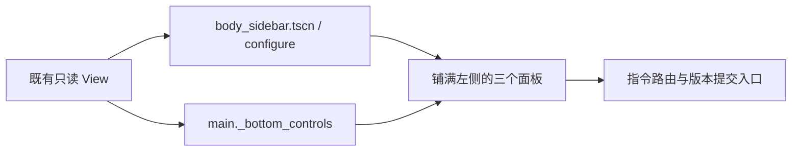
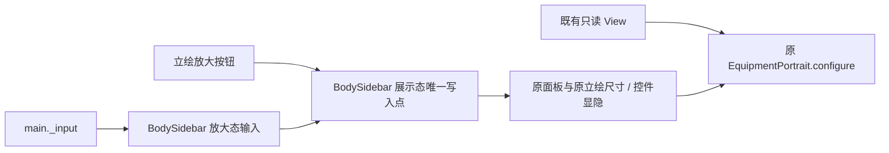
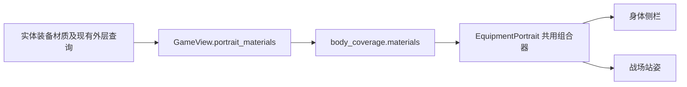

# 解缚界面契约（目标查询 · 装备详情 · 场景与立绘刷新）

本文件合并原「四区解缚界面预览」与「UI 场景拆分与立绘按需刷新」两份记录，作为解缚界面的唯一契约：
界面入口、共享查询、详情投影、快捷栏与刷新边界。
本文件不写执行结果；通过／失败／未执行只登记在验证记录（`docs/record/verification.md`）。

路径约定：不带 `spire-godot/` 前缀的源码、场景与测试路径（`ui/`、`core/`、`tests/`、`build/`）
均相对 `spire-godot/`；`docs/` 相对仓库根。

## 域

- 四区解缚界面：身体入口（头颈／手胸／臀腿／性器）、装备详情、快捷挣脱栏、拖牌与目标高亮、
  快捷目标循环、捕缚条接收拖牌、探索火球术，以及支撑它们的共享目标查询。
- 界面场景拆分与刷新边界：节点所有权、生命周期、立绘与身体栏的按需刷新与复用。
- 不含：规则判定、候选资格与候选 ID、费用、数值公式、事务、事件、固定点、回合、随机域、
  存档与迁移、十四规则交互轴；也不含候选提交管线（见 `docs/spec/response-pipeline.md`）。

## 接口

### 卡面尺寸与图鉴预览

- `CardFace.dimensions` 按约 5:8 的宽高比计算卡面，`main._card` 统一落地；普通页面保留原牌高并在原布局槽中居中。容器最小尺寸、手牌间距、悬停枢轴与转移动画使用实际卡面尺寸。
- 图鉴卡牌预览为 300×480，卡名、费用及正文按大卡面字号重新渲染，不缩放低分辨率卡面截图；费用圆框、数字、卡名、魔力角标及插画顶部共用标题栏尺寸基准，费用数字禁自动换行并居中。派生卡仍自动换行并可滚动查看。
- 图鉴点击任一卡面（含派生卡）打开原图检视，直接复用该面 `CardIllustration.texture`，沿用当前画风与正反面差分；不截取卡面、不裁剪源图。默认完整居中适配屏幕，可切换1:1原始像素并滚动查看。点击图片周围暗色空白处、Esc及安卓返回仅关闭检视，不另设关闭键；保留图鉴选择和滚动位置，复用模态输入阻挡，不向底层传递操作或改写游戏状态。
- 所有卡牌的卡图区统一占卡高的2/3；立绘保持原图比例、完整显示，不裁剪或拉伸。窄卡面保留全部效果、费用和限制；长文统一沿用正文滚动及悬停详情。
- 卡面已有词条中的独立关键词句（如唯一、消耗、保留、虚无、固有、顺延）由 `CardFace.separate_keywords` 从未本地化的显示文案中分离，统一使用金色，固定排在牌底左侧；`HFlowContainer` 按实际字宽整词排列。蓝色施法部位与使用条件位于右下角，右对齐、右留12像素、底留14像素，字号仍按基础11缩放；两栏放不下时关键词位于蓝字上方。最小尺寸改变时刷新正文避让，正文在底栏上方滚动，关键词本身不拆字换行。只做排版，不由文字判断规则；含关键词的效果句保持完整，翻面重建对应词条与条件。

### 行动日志

- 场景不显示独立日志按钮或固定侧栏；从游戏菜单的“行动日志”进入，L 快捷键打开同一窗口。
- `show_log → _log_drawer` 只读展示 `view.action_log` 的角色、回合与行动结果；原 `view.logs` 最近记录收在“详细记录”折叠区。
- 复用单一抽屉及遮罩，支持返回菜单、关闭与 Esc；遮罩点击只关闭窗口，不触发背后的行动。查看日志不改状态、随机、手牌或场景实例。

### 共享目标查询（`ui/target_queries.gd`）

- 承接：身体／区域定位、身体装备归并、按牌筛选身体目标、单件自动选择、拖放数据解析与装备目标筛选，
  以及快捷解除的牌面／版本／精准目标选择。解除模式列表**只在共享模块定义**。
- `main`、`drag_targets`、`quick_release_bar` 保留原 UI 入口、提示与提交；已有回调调用的薄入口转给共用查询，
  不保留另一份筛选算法。
- 方法语义分别保持：
  - 身体显示按物理目标＋牌面归并，优先可用候选但**保持原目标位置**；
  - 通用拖牌按原手牌目标和精准槽去重，保留首项及自身目标；
  - 快捷／身体详情没有可用项时保留**首个不可用原因**；`ActionIndex.first_usable` 仍保留末项；
  - 唯一装备自动选择遇捕缚等额外目标时继续要求玩家选择；显式选择的装备不可用或不存在时不改投别件；
  - 牢门开锁只随原拘束面载荷加入，火球沿原候选，旧版本继续拒绝。

### 只读投影与显示数据

- 卡牌确认及装备操作预览由只读 `ReleaseView` 从正式候选投影：耐久前后值、实际减少量、紧度变化、
  开锁或解除结果；锁倍率、紧度倍率、目标倍率、堆叠及部位衰减以红字短提示展示。
  包含已投影的固定工具伤害与魔法附成功条件；限制项圈只显示开锁／取下，不把内部生命周期值显示成耐久。
  默认不展开公式，原完整效果仍可折叠查看，机械日志保留。
- 立绘与身体栏共用 `EquipmentPortrait.uses_fixed_portrait`：只读取既有 `view.character_id` 与固定立绘偏好；
  保留角色 2 固定立绘、角色 1 可切换偏好及原按需刷新语义，不新增角色规则或投影字段。
- 精简视图的唯一构造点是 `EquipmentPortrait.snapshot`，与外观字段的消费方一起维护；
  arena 只领取这份独立显示数据，不保留完整 View 或候选；`composite_portrait_layers` 由同一构造派生。

### 场景结构

- 左侧界面铺满背景的 x=0—375、y=64—900 区域。身体框到 y=595，状态框 y=599—695，
  魔瓶与能量框 y=699—900；各框左右对齐，仅保留 4 像素纵向分隔，不移动战场边界。
  身体立绘保持比例，部位列宽 128；装备详情继续从身体框右边缘定位。

几何只由原场景及底栏编排写入；本调整不新增状态、候选、判定或规则写入点。

- `ui/shell/game_layout.tscn` 保留背景及当前使用的立绘；`header.tscn` 与 `body_sidebar.tscn`
  承载顶栏、身体栏静态布局；`ui/elements/` 中的 arena、enemy_group、equipment_portrait 场景管理角色展示。
- 主界面继续负责正式提交（指令路由）和页面编排。

### 界面状态（纯 UI，不进 GameState／存档）

- 立绘右下角的放大按钮切换身体栏的展示态：展开至整个左栏，隐藏标题与部位列，复用原立绘节点按比例完整显示。普通刷新保留放大态，重新开始恢复原布局。
- 放大时输入先经过身体栏：鼠标由主界面转发，触屏桥接在合成鼠标前转发原始触屏，共用同一判定。左栏内点击保持展示，左栏外点击或触屏按下收起并消费该次输入，避免穿透成行动；Esc 也可收起。进入时清理已有快捷键与长按结束回合的待执行状态。收起还原面板和立绘原矩形，不改变分区展开顺序或游戏快照。

- 展开顺序、选中部位与选中物理 ID、详情焦点、快捷栏当前页与格内目标、`card_faces` 等显示态。
- 身体栏缓存只保存**显示字段与本栏节点索引**；回调只保留稳定部位 ID。
- 模态抽屉仍位于交互层最上方；显示时恢复原兄弟节点顺序，不能只依赖 `z_index`
  （否则 Godot 的鼠标命中可能先落到商店整页面板上）。

## 界面行为契约（逐区）

### 身体入口、区域与详情卡

- 身体入口归为头颈、手胸、臀腿、性器；乳头归入性器区域。展示实际层级，执行前突出前后数值，有明显衰减时标红。
- 身体侧栏保留原立绘场景，按可用高度展开多个区域的精准部位入口，超出时收起最早开启的区域；
  区域点击展示该区域的装备，精准部位仍可单独检查和拖牌。
- 同一区域同一物理目标只展示一次，覆盖位置合并；不同部位分别分组，**不构造跨部位的解除先后顺序**；
  区域件数按可见装备根去重，只作显示，不修改卡牌和遗物的计数规则；空闲部位合并为一行。
- 同一精准部位按真实 `layer` 从外到内显示，覆盖者名称来自正式外层查询，连接和附属部件单独标识。
  该顺序只是物理展示：挣扎仍可能要求先处理紧度最高的内层，滑脱仍按其原有外层条件判定；
  原候选的可用性、具体阻止原因和风险保持权威。
- 详情卡：深色背景、细金边、装备小图和一列布局；确认按钮固定在详情页底部，效果正文独立滚动，
  长说明不挤走打出按钮；详情页在基准宽度上收窄 20，入口为右侧小按钮；拖牌／焦点高亮沿用原按钮内边距，
  避免高亮时改变小部位高度并错指下一分区。

### 自适应展开与严密度显示

- 身体框宽 375、高 531，区域列宽 128、小部位字号 14；多个区域按开启顺序保留，按实际字体最小高度、行间距和
  当前框内高度计算总占用，新增区域放不下时依次收起最早打开的区域，恰好放下则保留；
  单个区域也过长时在其内部滚动。
- 普通刷新、选择部位和关闭详情不强制收起其他区域；新开局重置展开状态。
- 手胸、臀腿标题下直接显示正式 `restraint_degree` 及 0—4 进度，保留 0.5 等真实小数，
  不以向上取整的行动等级替代；头颈与性器没有现成的总严密度，不虚构数值，仍展示各件紧度。

### 动作栏／快捷挣脱栏

- 横栏最右侧按钮零回合切换两页。动作页保留原体术与深呼吸；快捷页从左到右为头颈、手胸、性器、臀腿、道具使用。
- 四个区域默认显示有可用挣脱候选的小部位，若没有则显示已佩戴或第一个部位；右键循环小部位。
  每格显示当前装备名、真实耐久／上限、紧度及锁状态，不可用时另显示正式原因。
- 操作顺序：先单击区域选定当前小部位和装备，再单击解除牌直接提交；支持挣扎、滑脱、魔法滑脱、降紧和开锁，
  魔力撑除与术式解锁也复用原候选；也可把牌直接拖到格子。同部位多件装备以格内当前选中的物理目标为准；
  双拘束面继续读取原候选模式；切回动作页后普通点牌恢复原入口；新开局清除本栏选择。
- 战斗、整备、休息及监狱探索保留横栏；非战斗动作页仍能使用正式深呼吸候选，休息规则提示移到上方。
  已安装道具入口统一进入快捷页第五格，仍打开原道具详情和候选，不占魔瓶按钮。
- 切页局部更新横栏，保留立绘和手牌节点；拖牌高亮同时更新快捷格，取消后恢复。

### 捕缚条接收拖牌

- 左侧资源区的捕缚整行（标签、进度条、数值）接收挣扎／滑脱等具有正式捕缚目标的牌，与战场捕缚条
  复用同一接收函数、当前候选和版本校验；两个入口同时高亮并显示原伤害预览。
- 错误牌面／不支持的牌／旧版本保持拒绝；移除捕缚后同时移除接收区；原选牌后点击捕缚也可用。

### 快捷目标循环、详情联动与探索火球术

- 装备名右侧显示 48×8 的剩余耐久条，只读当前装备的正式 `ratio`，不显示数字或百分比；空部位隐藏；
  名称为进度条预留空间，完整名称仍在悬浮说明中；条形不接收鼠标事件，点击和拖牌交给整个快捷框；
  原耐久／紧度文字保留，切换装备和真实行动后同步刷新。
- 四个快捷区域框左右两端提供上一件／下一件三角箭头，点击区占满框高，装备信息显示在中间；
  先选中区域后，键盘 ←／→ 也可循环该大区的全部物理拘束具；右键继续切小部位。
- 默认读取已有外层遮挡事实和当前可用挣扎候选，优先选择最外层且可挣扎的最低紧度目标，同档按耐久比例排列；
  没有这类目标时保留实际装备供查看，不伪造可用性。手动选中的物理 ID 优先保持，后续点击／拖牌只查这件装备的
  原候选，不因它不可用而暗中改到其他装备；装备消失后重新选择当前默认项。
- 点击快捷区域框同步展开左侧大区、选中具体小部位，并在原装备窗口打开当前拘束具的三级详情；
  再点同一框关闭详情并保留已选目标，仍可直接点牌使用；点击另一框直接切换详情；对应栏位快捷键复用相同开关行为；
  左右箭头或右键切换始终展开新目标的详情。无装备的部位只展示原部位页面，不虚构三级装备。
  详情窗口在快捷模式下（含空部位）缩至横栏上方，滚动定位目标；查看不派发行动。
- 探索火球术：未获得自解能力或没有装备目标时保留灰色火球术，分别说明原因；
  原施法成功率、消耗、次数、外层和免伤资格不变，候选补齐紧凑伤害／次数文案。

### 场景拆分与按需刷新

- 场景拆分方向：`ui/shell/game_layout.tscn` 保留背景及当前使用的立绘；`header.tscn` 与 `body_sidebar.tscn`
  承载顶栏、身体栏静态布局；`ui/elements/` 中的 arena、enemy_group、equipment_portrait 管理角色展示；
  主界面继续负责正式候选提交和页面编排。
- 每次界面更新清理临时控件，不销毁仍使用的立绘。身体外观按实际显示字段比较；姿势、装备外观和固定立绘偏好
  改变时更新；固定立绘忽略不会改变图片的姿势／装备变化。
- 身体栏在同一界面连续刷新时复用，收起或离开不需要它的页面时释放；再次展开按当前 View 构建，
  并按上节规则比较显示字段、保持滚动容器与高度预算。
- 精简视图（`EquipmentPortrait.snapshot`）是立绘与战场站姿的唯一显示数据来源；
  新增短／长单手套夹具检查两处底图、配套腿根切片及嵌套输入隔离。
- 装备材质立绘由 `GameView.portrait_materials` 汇总存活实体装备，随 `body_coverage.materials` 投影到两处共用组合器；外层关系复用装备查询，不在界面重算。部位存在最外层皮革装备时优先皮带图，否则皮革数量严格多于红绳时选皮带，红绳较多、相等或两者皆无时选红绳。上身把手臂、手部、颈部与肩部合计，每件实体只计一次；腿部七个物理锚点独立判定，无覆盖的锚点仍使用自由切片。
- 材质属于外观缓存键；同一部位仍被覆盖但外层装备解除时，两处立绘必须刷新。普通及平板锁组合使用完整连续腿切片，单腿套复用同一边界；含单手套的组合继续使用原单手套底图、切片与坐标，不接入皮带／股绳切换。

## 输入域

- 共享查询的输入只有**当前 View 的数据、ActionIndex 和本次载荷**；不接收 `Game` 或控件，不写状态。
- 界面输入为真实 viewport 输入（鼠标、键盘、触屏）；提交一律走**指令路由（`ui/command_router.gd::emit` 唯一入口）＋ 版本复核**的正式入口（R2 起）。
- 快捷栏按键只选择区域，选中后再用牌；格内显示真实绑定，自定义键位即时跟随。固定 ←／→ 只在
  快捷区域被选中、且无模态／输入框／独立键盘目标选择／拖拽时接管，原键位设置和菜单导航继续使用。
- 键位现状：踢击默认 X、近身短打默认 V（两键对调，已有配置若恰为旧默认组合同步对调，其他自定义绑定保留）；
  快捷页四区复用同位置动作的当前绑定（头颈肘击 Z、手胸踢击 X、性器近身短打 V、臀腿火球术 F）；
  道具继续使用原 I 快捷键。
- 探索动作页固定保留火球术与深呼吸：火球术具有炫火自解效果时从原装备施法候选选取入口，
  单击进入已有目标选择、拖动可进入原部位目标列表或快捷格，**不直接向默认装备开火**。

## 失败语义

- 不可用一律显示**正式原因**：不转用其他装备或区域，不伪造可用性，不自行改牌面，
  不绕过上锁、层级、触及、施法或费用；无有效目标时只显示原因。
- 显式选择的装备不可用或不存在时不改投别件；唯一装备自动选择遇捕缚等额外目标时要求玩家选择。
- 点击部位本身不行动、不扣费、不弹确认；切页、展开、折叠与查看不推进游戏、不派发行动。
- 复用（立绘、身体栏、显示态）必须附**可证失效规则**；不保留旧装备图或旧候选，
  拖牌查询读当前 View／ActionIndex 并复核版本。
- 身体外观按实际显示字段比较；身体栏比较实际显示的区域／部位名称、件数、占用、连接标记、解除标记、
  别名、检查焦点、展开顺序、语言与高度，这些不变时保留按钮和滚动容器并重新接回当前输入索引；
  变化后沿原布局计算重建，保持高度预算与先开先收规则。
- 自动展开只在**战斗内动作成功后**，以提交前后只读 `body_regions.targets` 的物理 ID 对比确认
  新增或替换的拘束具：不在开局、读档、SL、非战斗行动、普通重绘或失败提交时触发；同件纯加固／降档不触发；
  手动收起保持到后续真实施加。只展开左侧区域，不选择装备、不弹出详情、不派发额外动作。
- 敌人按稳定 ID 保留分组，仅外观字段或对应素材设置改变时更新，离场删除；程序绘制敌人不再有空闲逐帧重绘
  或浮动动画，纹理立绘同样不逐帧位移，背景飘尘保留原独立动画。
- 界面不读不写 `game.state`；`GameView` 只新增只读事实（如火球术自解能力布尔值），不增加游戏或存档字段。

## 证据入口

- 规则／界面分类（按受影响面选择，不做全项目发布测试）：
  `targeting`、`basic_attacks`、`body_layout`、`keyboard`、`guard`、`equipment_complete`、`casting`、
  `card_power`、`exploration`、`display`、`hero_art`、`equipment_art`、`home`、`touch`、`localization`、
  `architecture`（只读隔离）。
- 输入必须真实：复用既有 `move_mouse`／`mouse_button`／`flip`／`start_drag`／`release_target` 等助手；
  几何检查覆盖精确高度与少 1 像素边界、FIFO 收起、短框内部滚动、真实小数严密度。
- 已完成的对照证据：`build/target-queries-20260915` 保存旧 UI 参照与七场景 9730 项查询对照
  （完整候选、顺序、状态与 View 一致）；截图仅在显式指定文件名时输出到 `build/`。
- 测试登记：`witch_character_cases` 使用唯一规则分类 `witch_character`（原案例不复制，交叉影响登记到
  `suite_selection`，runner 校验归属与选择）；`display` 的音乐连打案例夹具显式提供本段连续出牌所需能量，
  并在点击前检查正式候选有效。
- 结果与未执行项登记在验证记录（`docs/record/verification.md`）；未执行项不记作通过。
