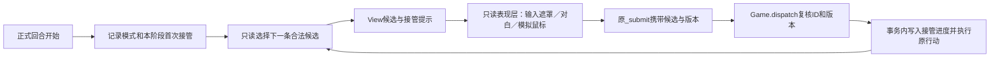
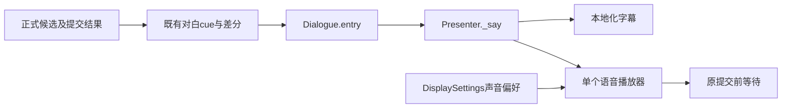

# 响应管线（输入 → 提交 → 落地）

契约文件：冻结一次玩家输入从进来到界面落地这条链上的两个接缝——**接缝 A（UI↔core，既有接口）**
与**接缝 B（UI 内部的提交与落地）**。内部实现以代码为准，接口语义以本文件为准。
函数名与稳定 ID 是锚点；本文件不写行号，也不写执行结果：通过／失败／未执行与红集一律登记
`docs/record/verification.md`。

实现状态：现行 UI 入口是 `_submit` 与 `render`，尚无 `commit`、`present`、`present_rejection` 或通用脏节表。
下文标为「待实现」的接缝 B、节键表、输入域与具名检查是保留的设计目标，不是可调用 API 或已通过的证据；
其落地状态也见 `docs/record/proposals/refactor-direction.md` 的 P3。本次整合只增加提交后的瞬时反馈，不实施该刷新重构。

路径约定：不带 `spire-godot/` 前缀的源码、测试与工具路径（`core/`、`ui/`、`data/`、`tests/`、
`tools/`、`build/`）均相对 `spire-godot/`；`docs/` 相对仓库根。

## 域

- 一次玩家输入的全部去向：选择类点击（只改本地选中态）、提交类点击（进唯一提交入口）、
  被拒／无效分支（只呈现原因）、以及提交成功后的投影与界面落地。
- 文件域：`ui/main.gd`（唯一允许 `preload` core 的 UI 文件；唯一提交入口与全部节重建函数）、
  `ui/keyboard_input.gd`、`ui/touch_input.gd`、`ui/first_turn_presenter.gd`、`ui/target_queries.gd`、
  `ui/shell/game_layout.gd`、`ui/shell/body_sidebar.gd`、`ui/shell/header.gd`、
  反馈模块 `card_motion.gd`／`resource_feedback.gd`／`combat_feedback.gd`／`enemy_feedback.gd`／
  `impact_feedback.gd`；
  core 侧被消费的只有 `core/game.gd` 的 `dispatch`／`get_view`／`number`／`restore_snapshot`／
  `restart_snapshot`／`Prison.*` 与 `core/game_view.gd` 的 `View.build`。
- 非目标：不改 core 规则、数值、存档语义、快照格式与随机域；不改 arena 立绘重画与分帧动画；
  不改文案与本地化文本；不改输入语义与键位；不改"播报期吃点击"；不新增第三方依赖与常驻钩子；
  不新建流程文件或看板；不宣称帧率提升或全量回归。
- 授权边界：本管线默认不新增 UI 文件（若 `commit`／`present` 需要独立文件，先向协调者提案）。
  唯一例外是本片经任务授权落地的 `ui/impact_feedback.gd`：纯显示、只读消费 `dispatch` 返回值与提交后
  View，不写规则、不新增规则接口；同类新增此后仍须先提案；
  `ui/reward_screen.gd`／`ui/event_screen.gd`／`ui/shop_screen.gd`／`ui/shell/header.gd`
  继续用整树 `render(view)` 兜底，本契约不改这些文件。
- 依赖方向（不得新增反向边）：

| 模块 | 边界（谁） | 小接口 | 内部（藏） |
| --- | --- | --- | --- |
| M1 输入适配 | `ui/keyboard_input.gd`、`ui/touch_input.gd` | `handle(event) -> bool`；触摸只合成既有鼠标事件 | 键位表、选择状态机、长按阈值、弹窗桥 |
| M1a 自动接管展示 | `ui/first_turn_presenter.gd` | `sync`／`advance`／`outcome`；经指令路由 `emit` 进同一提交入口（takeover 标记不变） | 台词、模拟鼠标、动画等待与过期任务取消；只读 View，不选规则动作、不支付 |
| M2 提交 | `ui/main.gd` 的 `_submit`（指令路由的执行段） | `_submit(cmd: Dictionary, takeover=false) -> void`（`expected_version` 随指令携带） | 分流、守卫、反馈编排 |
| M3 展示调度 | `ui/main.gd` 的 `render` 与 `_refresh_drawers` | `render(snapshot={})`；`_refresh_drawers()` | 页面重建、抽屉局部刷新；身体栏和立绘沿自身显示键复用 |
| M4 只读查询 | `ui/target_queries.gd` | `facts`／`select`／`find`／`first_usable`／`fact_by_key`（static、只读一个 View 的显示事实表） | 组取用、首／末拒绝原因选择（行索引文件已在批 R5 删除） |
| M5 静态场景与实例 | `ui/shell/game_layout.gd`、`ui/shell/body_sidebar.gd` | `begin_frame`／`hero_portrait`／`enemy_group`／`body_sidebar`／`end_frame`；`configure`／`_presentation_key`／`expand_applied` | 场景节点、按外观比对、展开预算、滚动 |
| M6 提交后反馈 | `card_motion.gd`、`resource_feedback.gd`、`combat_feedback.gd`、`enemy_feedback.gd`、`impact_feedback.gd` | `positions`／`enqueue`／`play`／`consume`／`finish` | 补间、队列、播报分页与高亮；瞬时层单帧合并与淡出包络 |

`M1/M1a → M2/M3`（经 host）→ `M4/M5` →（`main.gd` 的 `preload`）`core.Game`／`core.SaveStore`；
`M6 ← M3` 传入的 `view`／`payload`／锚点节点。仅 `ui/main.gd` 允许 `preload` core。

依赖方向禁令：

- `core`／`data` 不得 `preload` ui；UI（含 shell）**不得读 `game.state`**、不得调用 `dispatch` 之外的
  规则写入口（快照入口 `restore_snapshot`／`restart_snapshot` 只允许在 `_resume_snapshot`、`restart`、
  `_quick_sl` 三处使用）。
- M4 不得持有 Game、控件或跨刷新缓存；M5 不得读 View 之外的规则；M6 不得 `dispatch`／`get_view`／改判定。
- 任何节键不得保存旧 View、候选、装备图或节点引用，不得用 `version` 当键；UI 不得自行推断资格或作废范围。

## 接口

### 接缝 A：既有接口（语义冻结，不改）

| 接口 | 输入／返回 | 谁能调 | 信任依据 |
| --- | --- | --- | --- |
| `game.dispatch(cmd, expected_version) -> Dictionary` | `cmd`＝类型化指令 `{kind, params, expected_version}`（kind 与键面见 `docs/spec/candidate-removal.md` §3.3；`params` 只用稳定 ID）；`expected_version` 为 UI 当前 `view.version`（`_submit` 允许调用方传 `-1`，此时 UI 补 `view.version`）。复核＝指令形状＋参数合法性＋唯一判定（形状或键面不合法、形状无对应行动 → 与失效同一条拒绝）。成功 `{ok:true, version, resource_feedback, card_feedback, music_feedback, checkpoint}`：前三个是本次提交的展示事件，`checkpoint` 为固定点键；失败 `{ok:false, error:String}`（不带以上任何键） | 只有 M2 `_submit`（测试可直调，UI 其它文件禁止） | 只有 `ok=true` 才写状态：`state=state.duplicate(true)` 后执行事务，失败回滚，不留部分付款／部分装备；core 侧拒绝语义与 `tests/test_game.gd` 的 TC-CORE-0002／0003 锁定 |
| `game.command_params(kind, source) -> Dictionary`／`game.command(source, expected_version=-1) -> Dictionary`（R2 新增） | 指令装配的唯一投影（意图来源 → 该 kind 的声明键面＋默认值）／唯一装箱（`{kind, params, expected_version}`；版本默认取当前 `state.version`） | UI 指令层（`ui/command_router.gd`／`ui/command_routes.gd`）与测试；不得在别处二次装配 | 同一形状 → 同一 `params` 只有一条路径；键面＝`COMMAND_KEYS` 的 39 kind 声明 |
| `game.command_issue(cmd) -> String`／`game.command_fact(cmd) -> Dictionary`（R2 新增，R5 改名） | 形状与参数合法性复核（失败返回「该行动已经失效，请重新选择。」）／形状 → 当前状态下该显示点的投影事实（唯一判定经事实出口给出） | `command_issue` 由 `dispatch` 内调用；`command_fact` 供提交复核、显示读取路径与测试 | 形状与 `params` 相等的事实恰有一条；不写 `valid`／`reason`（结论只由唯一判定给出）、不产事件、不推进随机、不跨调用保留 |
| `game.get_view() -> Dictionary` | 无输入；纯只读投影（`View.build` 内调 `Game.command_facts()` 取显示事实、每条显示事实的 `ReleaseView.preview`、显示集合 `card_texts`、room_event／shop／relics／prison 四个 view） | 唯一允许的调用点集合：`_resume_snapshot`（显示初始投影）、`render`（空快照）、`_submit`（成功或被拒均取）、`restart`。新增调用点即契约违例 | `view.version` 等于投影来源的已提交 `state.version`；UI 只能减少 `get_view` 的调用次数，不能降低单次成本；投影结果不得当规则判定来源 |
| `restore_snapshot(saved)`／`restart_snapshot()` | 返回 `{ok,error}`／快照字典；UI 只判断 `ok`，不解析结构、不迁移字段 | 快照入口只允许 `_resume_snapshot`、`restart`、`_quick_sl` 三处 | 见 `docs/spec/save-fixed-points.md` 与 `docs/spec/transition-pipeline.md` 的冻结时机约定 |
| `game.number(n) -> String`、`game.Prison.*` 常量 | 显示格式化与立绘选择 | M3／M5 节函数 | 只读显示调用，不参与判定 |
| 行动行索引类（`ActionIndex`，R5 已删除） | 曾按 `by_id`／`by_group` 取行；行载体与索引在批 R5 一并删除 | — | 提交复核现走指令形状＋唯一判定（`game.command_fact`）；不保证提交成功，陈旧版本由 `expected_version` 拒绝 |
| `TargetQueries` | static、无状态；输入只有 View 数据（含显示事实表）与本次载荷 | 各节函数 | 返回显示事实（不复制、不改写）；`RELEASE_MODES` 是唯一模式定义处；`first_usable` 全不可用返回**首项**，末项回退由 `fallback="last"` 显式声明，两者不得按名字相近合并 |

**三个按需只读入口不属于 `get_view` 白名单**：`game.live_card_text`、`game.live_card_text_set`、
`game.candidate_detail`（语义见 `docs/spec/ondemand-copy.md`）。它们不改白名单，也不得经 `get_view`
参数化实现。

**shell／输入／反馈消费方契约**（后一个 agent 据此调用，不必读内部）：

| 接口 | 输入／返回 | 谁能调 | 信任依据 |
| --- | --- | --- | --- |
| `game_layout.begin_frame(home: bool)` | 只清临时子节点，保留 `MoonlitGallery`／`hero`／`body`／`enemies`，重置 `used` | 只有 M3 的节／页函数 | 调用后保留实例仍有效；`end_frame` 释放本次未标 used 的 body／敌人 |
| `hero_portrait(view, fixed, rect) -> Control` | 传入 View（不是 `state`）；创建或就地更新 hero 实例并定位 | 战斗／阶段页节函数 | 返回活实例；只更新外观；`EquipmentPortrait.uses_fixed_portrait` 只读 `character_id` 与固定立绘偏好 |
| `enemy_group(enemy, settings) -> Control` | `enemy` 为 View 的敌人条目；按稳定 `id` 复用分组 | 战斗页节函数 | 同一 `id` 的实例身份保持；离场敌人由 `end_frame` 删除，调用方不手动释放 |
| `body_sidebar(ui)`／`body_sidebar.configure(ui)` | 实例化／重排身体栏；读 `ui.view`、`ui.selected_slot`、`ui.expanded_body_regions`、`ui.show_body`、locale、高度 | M3 身体栏节 | 返回后 `ui.body_buttons` 对当前 View 有效（含非激活区域别名→header 映射）；键命中时按钮与滚动保留 |
| `body_sidebar._presentation_key(ui) -> Array` | 纯显示字段键（高度、locale、选中部位、展开顺序、各区域 members 显示字段） | 加固门禁与节键比对 | 只渲染事实：绝不保存旧 View／候选／装备图；新增显示字段必须同批进键 |
| `body_sidebar.expand_applied(ui, before, after)` | 两个 View；比较 `body_regions.targets` 的物理 ID 新增 | 只在提交 ok 分支且 phase 命中时 | 同件加固／降档不展开；非战斗与失败不展开；不选装备不派发 |
| `keyboard_input.handle(event) -> bool` | 返回是否已处理；内部可能调 `host._submit`／`host._activate_card` | `main._input` 与 PopupMenu 桥 | host 成员名与语义在本管线内冻结（`view`／`actions`／`card_buttons`／`card_faces`／`attack_forms`／`_submit`／`_activate_card`／`render`／`_show_term`／`_hide_term`／`_panel`／`_label`／`_button`／`_open_drawer`／`_close_drawers`／`DRAWERS`／`modal_region`／`quick_release_*`）；android 直接返回 false；不新增 `dispatch` |
| `keyboard_input.refresh_hints()` | 幂等重建按钮角标 | `render` 末尾（`call_deferred`） | 只读 view 与 settings；无游戏副作用 |
| `touch_input` | 把触摸合成鼠标事件推入 viewport（含 PopupMenu 独立视口桥） | 引擎输入；`_ready` 由 main 挂载 | 不直接调提交／规则；长按阈值与取消路径不提交；UI 侧不得假设存在触摸专用入口 |
| `card_motion.positions(ui) -> Dictionary` | 抓取当前手牌按钮位置／角度／牌面 | `_submit` 在 `dispatch` 前 | 只读；不改状态；不推进随机 |
| `card_motion.enqueue(events, before)` | core 的 `card_feedback` 事件＋提交前快照 | `_submit` ok 分支，且 `render` 之后 | 幽灵卡不持有牌、不挡输入；`pending_draws` 隐藏新抽牌按钮的规则必须被 `render` 的手牌节尊重 |
| `resource_feedback.enqueue(events, point, instant_fields)` | core 的 `resource_feedback` 事件＋锚点 | `_submit` ok 分支 | 只消费已提交差值；`show_home` 时自毁 |
| `combat_feedback.play(ui, before, payload)` | 提交前 View＋已提交 payload | `_submit` ok 分支 | 只用可见前后差分（HP／日志／装备耐久）；不预测、不改伤害／意图／资源／时机 |
| `impact_feedback.play(events, payload, snapshot) -> void` | `events` 为 `dispatch` 返回的 `resource_feedback` 事件（可为空数组）；`payload` 为本次已提交候选的载荷；`snapshot` 为提交后 View（只读 `snapshot.pressure.value`／`.maximum` 与 `snapshot.mana_max`）。同一次提交一次调用：层内部按字段求和合并，不逐事件重播。效果族由已提交事实唯一决定：`pressure` 净涨出滤镜、`charge`／`next_energy` 净涨出黄边框、`mana`／`temporary_mana`／`witch_focus` 任一净变化（Δ≠0）出蓝边框、载荷 `kind=="calm"` 出白边框（同提交多族命中按白＞黄＞蓝取一，仍只出一条边框）、攻击／挣扎／滑脱载荷出震动。蓝边框分加减两变体：Δ>0 走 gain（短促上冲后淡出、边带更宽），Δ<0 走 loss（即刻峰值、退得更慢、边带更窄），两变体同一色 token 且峰值按该字段自身参考尺度的归一化 Δ 的绝对值 缩放（mana 用提交后 View 的 `mana_max`，临时魔力／精神集中用各自保留上限），不设最小增量门槛；施法失败因净损失自动落在 loss 变体，无需额外标志 | `_submit` ok 分支（经 `ui/main.gd` 的节内助手按 `will_play` 预判后才创建节点） | 只消费已提交数据：不读 `state`／`state.logs`，不预测、不改数值／候选／存档／随机；无效果可播时 `play` 是空操作；层内所有节点 `MOUSE_FILTER_IGNORE`，无 `_process`，一次性 Tween 结束后 `hide()` 并 `set_process(false)`；震动位移的是承载内容的 `main.gd` GameLayout，结束时按记录原点精确复位 |
| `enemy_feedback.finish()` | 清 `ui.enemy_feedback` 并释放 | `_return_home`、`_reset_interface`、播报结束 | 节点存在即"播报期"：提交入口守卫与 `blocked()` 都据此吃输入（产品决策）；全屏 `MOUSE_FILTER_STOP` 不得被 `render` 提前回收 |

### 现行自动接管与提交守卫

- 首回合规则由 `core/first_turn_control.gd` 从已有正式候选中选出下一步，经 `GameView` 输出
  `view.first_turn_control`（`name`／`locked`／`candidate`／`key`）；具体玩法见 `docs/design/game-design.md`。
  展示层不能重选动作、重算资格或推进规则随机；`control_next` 由 core 在事务内消费，UI 经指令路由原样提交该条指令（含 `expected_version`）。
- `_submit(cmd, takeover=false)` 是唯一提交入口（R2 起为指令路由的执行段；`expected_version` 随指令携带）。
  普通输入在接管锁定时返回；`takeover=true` 仅供 `FirstTurnPresenter` 的已选步骤进入该入口，
  仍受首页／敌方播报守卫、指令形状＋参数合法性＋唯一判定与版本复核约束。
  此参数不是跳过规则验证的权限。成功和失败均刷新投影；自动提交结果另交 `outcome` 播放反馈。
- 接管展示跨等待保留候选及版本，以游戏对象身份、`generation`、版本、首页状态与接管锁定状态共同失效；
  改局、返回首页或版本变化后，旧步骤不得提交。节点使用前重新检查有效性；该显示生命周期不适用 core 装备查询的调用内作用域限制。
- 证据复用 `first_turn_control_cases`／`first_turn_control_ui_cases` 的真实接管、手动输入阻断与换局取消；
  `architecture_cases.projection_contract` 覆盖自动接管、手动零能量首回合与双面能力开关的状态／注册表引用隔离。
  `runner_cases.ownership` 同时扫描分类模块与规则／UI 根入口的 `.run(t)` 和 `.run(self)`，避免内联入口重复执行已注册专项；共享运行器故障探针不作为玩法用例归属。

### 待实现：接缝 B 的 `commit`／`present`／`present_rejection`

以下是尚未实施的接口设计。`ui/main.gd` 当前只有 `_submit`（整树 `render(view)`），不能调用以下函数；
未来实施时才把提交与落地拆成三个接口，届时 `_submit` 可实现为 `commit` 的薄别名。

```gdscript
func commit(c: Dictionary, expected_version: int = -1) -> Dictionary
# 返回 {"ok":bool, "error":String, "view":Dictionary, "dirty":Array[String], "blocked":bool}

func present(dirty: Array[String] = ["*"], snapshot: Dictionary = {}) -> void

func present_rejection(reason: String, source: String, dirty: Array[String]) -> void
```

- `commit`：M2 内唯一 `dispatch` 点。`view` 是"提交后 UI 应当展示的 View"（版本不等时是本次
  `get_view()` 的结果，相等时是调用前的 `ui.view`），**不是"每次都必须重新投影"**；
  `view` 被替换时 `ui.actions` 必须与它同一批原子替换。`dirty` 由节键比对产生，只在本次调用内计算，
  元素来自下表节枚举。`blocked=true`：`show_home` 或 `enemy_feedback` 有效，未 dispatch、
  未 get_view、`dirty=[]`、`view` 为当前 view。
- `present`：只重建 `dirty` 列出的节；`["*"]`、缺项、未知节名 → 全量兜底重建。
  `snapshot` 非空则原子替换 View＋`ActionIndex`；为空则用当前 `ui.view`；
  **禁止 `present` 在非空 snapshot 下再调 `get_view`**；`render(snapshot)` 兼容入口保留
  "空 snapshot 才 `get_view`"的语义。每次 `present` 的固定动作顺序：
  `DragTargets.clear(self,false)` → `_hide_term` → View 同步 → 节键比对 → 重建脏节 →
  `layout.end_frame()` → `keyboard_input.refresh_hints`（`call_deferred`）→ `_localize_controls`。
- `present_rejection`：7 处拒绝分支（下表 6 处选择类＋提交被拒）的**唯一**呈现入口，不得各自实现。
  载荷至少三项：`reason`（当次从候选／View 读出的原文，不得另造文案）、`source`
  （`mouse`／`keyboard`／`touch`）、`dirty`（该次的脏集上界）。入口内**不得** `dispatch`／
  `get_view`／`_save_progress`、不得做超出该脏集的重建、不得每帧调用；不新增 Godot `signal`，
  不建空节点或空函数占位。本管线不实现任何反馈消费者；将来若要加反馈只准挂在此处。

`present` 的兜底条件（任一成立即整树重建，必须显式判据，不得靠"没键就重画"隐式实现）：
`phase` 变化 · `show_home` 进入／离开 · `show_route` 切换 · locale 变化 ·
显示设置变化（`fixed_hero_portrait`、`art_changed`、字号类）· `layout` 未实例化 · View 为空 ·
传入 snapshot 的 `version` 小于当前 `view.version` · 节键缺失或未知 ·
`reward_panel.active` 或 `demo_end` 或 `pressure.overloaded` 或 `view.card_chain` 非空或
首次战斗教程触发。

### 待实现：节键表（节名同时是 `dirty` 元素）

键只用"当次 View 投影 ＋ 本地 UI 态"的纯数据副本（Array／Dictionary／基础类型）；
**`version` 不进键**；键必须覆盖该节渲染实际读取的 View 字段（新增 `view.<field>` 读取必须同批进键）。

| 节 | 重建入口 | 键内容 |
| --- | --- | --- |
| `header` | `_header` → `header.configure` | `run_header`(location/turn/order/last)、`security`、`wall`、`wall_position.distance`、`pressure.overloaded`、`carried_items`、`capacity`、`deck_count`、`prison.active`、`phase`、`practice`、`show_route`、`save_failed`、locale |
| `relics` | `_relic_row` | `relics`(id/name/detail/counter/current/rarity)、locale |
| `hand` | `_hand` | `hand`(uid/type/draw_serial/draw_free/single_face/availability/face_*)、对应 `card_texts` 项、`card_instances`、`card_faces[uid]`、`selected_card`、`_selecting_hand()`、`card_motion.pending_draws` |
| `actions` | `_fixed_actions`／`_build_action_rail` | `phase`、`selected_enemy`、`attack_forms`、`quick_release_open`、候选子集(attack/pressure/flow/surrender)的 id/valid/reason/cost/label/body_part/casting/brief/risk |
| `posture` | `_posture_controls`／`_wall_controls` | `posture`、候选子集(posture/wall_move) 的 id/valid/reason/cost/distance/adjacent/wall、`guard_bind.is_empty` |
| `resources` | `_bottom_controls` | `energy`、`mana`、`temporary_mana`、`mana_max`、`pressure`、`guard_bind`、`powers.size`、`draw_count`、`discard_count`、`phase`、`surrender_version` |
| `show_log`（共享抽屉） | `_log_drawer` | `action_log`、`logs`；入口及只读约定见[界面契约](release-interface.md#行动日志) |
| `body_bar` | `body_sidebar.configure` | 既有 `_presentation_key`：`size.y`、locale、选中部位、展开顺序、每区域 members 显示字段；命中时保留按钮与滚动 |
| `body_details` | `_body_details`／`_equipment_tile`／`_action_row`／`_card_target` | `selected_slot`、`selected_card`、`selected_candidate`、`show_body`、`pending_retain`、`quick_release_open`、`guard_bind.is_empty`、`card_faces`、相关候选子集 id/valid/reason/cost/preview |
| `pickers` | `_player_picker`／`_hand_target_picker` | `player_pick`、`player_pick_data`、`hand` 相关项、候选子集(card/hand_uid) |
| `speech` | `_speech_bubble`／`_npc_speech_bubble` | `speech`／`npc_speech`(id/text/phase/cue)、locale、本地 `speech_id/deadline` |
| `notice` | `_show_term(actor_targets.hero, …)` | `notice`、`actor_targets.has("hero")`；依赖 hero 接收区存在 |
| `drawers` | `_refresh_drawers` ＋ 各构建器 | `DRAWERS` 标志、`deck_zone`、`status_filter`、`selected_item`、`show_shop_service` 等本地态＋各自投影、locale |
| `page` | `_route_screen`／`_rewards`／`_service_screen`／`_event_screen`／`_prison_controls`／`_capture_screen`／`_inspection_screen`／`_practice_screen`／`_demo_exit_screen`／`_battle_scene` | `phase` 及其实际读取字段；结构变化一律走兜底清单 |
| `scene_instances` | `layout.hero_portrait`／`enemy_group`／`body_sidebar` | 外观字段由 arena／`equipment_portrait`／`body_sidebar` 自身比对 |

节键计算的成本同样要进测量（见"证据入口"），不得默认"算键几乎免费"。

### 缓存与失效键

允许（只读显示口径）：core 只读调用内的装备显示行复用与 `face_texts` 合批；
`body_sidebar._slots_key`／`_button_index`（显示字段键＋稳定部位 ID → 按钮索引）；
`card_faces`／`card_draw_serials`（本地翻面／抽牌显示态）、`map_drawings`（界面备注，随本局保存）；
节键本身（当次 View 投影＋本地 UI 态的纯数据副本）。

禁止：用 `version` 当键或当缓存版本号（`version` 不单调，`restore_snapshot` 后可回退，进键会误命中）；
用译文、颜色、名称、图片识别玩法对象；把投影结果当规则判定来源（UI 不得自行推断资格或作废范围）。

准入线：**复用必须附可证失效规则；无证明即禁止。** 跨操作持有投影（`ui.view`／`ui.actions`）与
自己的显示态允许。

## 输入域

现行入口为 `_submit(cmd, takeover=false)`（经指令路由）与 `render(snapshot={})`。本节中 `commit`／`present`／
`present_rejection` 及下方脏集表均为待实现设计；不能据它们推断当前界面已经采用局部拒绝刷新。

- `dispatch`：`cmd` 是**类型化指令**（`kind`＋`params`，只用稳定 ID，不含候选提交身份 id）；
  形状与键面由 core 的声明表复核，形状无对应行动只会被 core 拒绝，不得由 UI 预判；
  `expected_version` 为 UI 当前 `view.version`，调用方传 `-1` 时由 UI 补。
- `get_view`：无输入；调用点必须落在唯一集合内（`_resume_snapshot`／`render` 空快照／`_submit`／`restart`）。
- `commit`：`c` 为当前 View 的候选字典（不要求同一引用）；`expected_version < 0` 时取 `view.version`。
- `impact_feedback.play`：`events` 只接受 `dispatch` 返回值的 `resource_feedback` 数组（字段名与增量口径见
  `core/resource_feedback.gd` 的 `FIELDS`：`pressure` 与 `witch_focus` 为加性字段）；`payload` 只接受本次已提交候选的载荷
  （普攻读扁平 `damage`，伤害卡读 `preview.damage` 与 `mode`）；`snapshot` 只接受提交后 View。三条输入都不是
  资格判定来源：载荷／事件与当前 View 不一致时按"照实表现已提交结果"处理，不做规则推演、不重算、不拒绝。
  蓝族只消费**合并后的净增量**：被受理但施法失败（`ok=true`）的 receipt 是"先扣后返还"，逐事件重播会把返还事件当成上涨；真正被拒的提交（`ok=false`）不播放反馈。
  变体只由该净增量的符号决定（Δ>0 gain／Δ<0 loss），强度只由按字段参考尺度归一化的 Δ 的绝对值 决定，没有阈值分支。
- `present`：`dirty` 元素必须来自节键表节名或 `["*"]`；未知／缺项按全量兜底处理。
- `present_rejection`：`dirty` 必须等于下表列出的脏集上界，不得扩大：

| 入口 | 触发 | 脏集上界 |
| --- | --- | --- |
| `_select_route_room` | 点击路线上当前不可进入的房间 | 仅 `notice` |
| `_activate_guard_bind_target` | 对 guard_bind 目标使用当前选中牌、候选存在但 invalid | 仅 `notice` |
| `_use_free_card` | 自由放置无可用部位／候选 invalid | 仅 `notice` |
| `_activate_card` | 自身目标牌候选存在但 invalid | 仅 `notice` |
| `_activate_card` | 单面牌（`single_face`）不可用 | 仅 `notice` |
| `_activate_card` | 快速解除栏与当前拘束具不匹配 | `notice` ＋ `selected_card=uid`、`selected_candidate=""`、`show_body=false` → 另加 `hand`／`body_details` |
| `_submit`（提交被拒） | `dispatch` 返回 `ok=false` | `notice`；仅当核心回传需要重同步时另加键差脏集 |

- 选择类点击（`_activate_card`、`_use_self_card`、`_card_target`、`_select_enemy`、
  `_player_picker`、`_hand_target_picker`、`body_sidebar._toggle`、`keyboard_input` 的
  `select_card`／`cancel`、`quick_release_bar.select`）：只改本地选中态，不 `dispatch`／
  `get_view`／`save`。
- 提交类点击（状态控件、行动格、姿态控制、底栏、墙面控制、装备格、行动行、卡牌目标、监狱控件、
  紧凑行动、路线屏、拖放接收器、键盘）最终都进同一提交入口，不得各自实现提交或保存。

## 失败语义

现行 `_submit`：主页或敌人播报中直接返回；其余提交在 `dispatch` 后无论成功或被拒都会重新 `get_view`，
设置 `notice` 并调用 `render(updated)` 同步 View。只有成功提交才进入反馈分支，
只有成功结果的 `checkpoint` 非空才自动写盘。选择类拒绝继续沿各自既有提示入口，不存在统一 `present_rejection`。
下方「同版本零重算」「只刷新 notice」「统一拒绝入口」是待实现目标，不能作为当前源码已经满足的契约。

- `dispatch` 拒绝语义（core 侧，UI 不得改写文案；顺序以源码为准，见 `docs/spec/candidate-removal.md`
  §1.6 D-1）：五预检分列版本比对两侧——`Consumables.validate_buffs`、`Binding.state_issue` 在版本比对
  **之前**，`SpecialEquipment.validate`、`Cards.validate`、`RelicEffects.validate` 在**之后**，各自返回
  自己的 `error`；版本不符 → `"状态已更新，请重新选择行动。"`；指令形状或键面不合法，或形状在当前状态
  没有对应行动 → `"该行动已经失效，请重新选择。"`；形状合法但判定不通过（`valid=false`）→ 判定的
  `reason` 原文。UI 义务：不自行判定资格、不改牌面、不按名称／颜色／译文识别对象、不重试、不改派候选。
- 待实现的被拒分界（目标："不要重算"）：
  - **同版本被拒 → 零重算**：不 `get_view`、不替换 `ui.actions`、不落盘、不反馈，只刷新 `notice` 节。
  - **版本落后被拒 → 必须重同步**：`get_view` ＋ `view`／`actions` 同一批原子替换，
    再按节键比对刷新脏集（可能近乎整页）。理由：不同步会让界面停在一个不可能的状态（它显示的状态
    已被取代），且之后每次点击都会以同样理由继续被拒（候选全部携带旧版本）。
  - 判据可靠的原因：`version` 只在成功提交时自增一次，另一处自增是 `restore_snapshot`；
    `view.version == state.version` 等于"展示的 View 就是当前已提交状态"。
- 锁定断言（不得删、不得放松）：`tests/ui_smoke.gd` 的 `_index_boundary_tests` 四条——
  失败提交后状态不变且 `notice` 非空；`view.version==state.version` 且 `view.energy==state.energy`
  （显示快照被刷新）；旧版本拖放被拒；`ui.actions` 已按新状态重建。
- 待实现的统一拒绝呈现：打回即打回，不新增动画、最多留一个触发器；被拒路径零动画（反馈调用整体在成功
  分支内），唯一视觉信号是 `notice`。**触屏必须与桌面一致可见**：拒绝提示走 `present_rejection`
  这条不受 `_show_term` 触屏守卫限制的通道（例如入口自己呈现或给一次性的允许标记）；
  `_show_term` 既有的大量悬浮／焦点／长按详情提示的抑制规则不得改动。
- 禁止：版本不等时跳过重同步或跳过 `actions` 替换；任一情形吞掉 `notice`；自动重试；删掉上述断言；
  以"应该更快"或单次采样宣称提速。
- 成功路径不得因未来刷新重构改变：自动保存仍只在 `ok` 且 `checkpoint` 非空时；`expand_applied` 的 phase 条件不变；
  提交路径的 `_reset_interface` 仍只在 `demo_continue` 调用；反馈仍在展示更新后、只在 `ok` 分支。

## 证据入口

命令（在 `spire-godot/` 下执行；结果与域写 `docs/record/verification.md`，本文件不宣称通过）：

```powershell
& tools/check.ps1 -Suite architecture -Impact -TimeoutSeconds 600
& tools/check.ps1 -Suite architecture -UI -UISuite display,body_layout,targeting,keyboard,touch,interface -TimeoutSeconds 900
```

- 范围预检（不算通过）：两条命令加 `-ListOnly` → 输出 `PLAN ONLY:` 并列出上述分类。
- 判据口径：退出码 0；`summary.json` 的 `status=passed` 且 `before==after` 指纹
  （`source_changed` 不算通过）；不同提交的结果不得拼接。
- 待实现刷新重构的具名 check 设计（以下函数名是拟议落点，不能当作已有测试；现行反馈检查见 `tests/impact_feedback_ui_cases.gd`。
  判据＝测试侧布尔断言；计数只用测试侧包装，生产源码不带计数器；场景编号被其他契约引用，
  不得重排）：

| 场景 | 具名 check | 判据要点 | 落点（分类） |
| --- | --- | --- | --- |
| 1 | `selection_click_is_readonly` | 选择类点击的 `dispatch` 计数 0、`get_view` 计数不变、存档写入计数 0、`export_snapshot()` 与 `view.version` 不变、`ui.actions` 未被替换 | `tests/target_sidebar_ui_cases.gd`（`targeting`） |
| 2 | `failed_submit_resyncs_and_presents_notice` | 陈旧提交后状态不变、`notice` 非空、`view` 追平、`ui.actions` 已替换、未写档、未触发反馈；反例（同版本失效候选）只刷新 `notice` 节且未调 `get_view` | `tests/display_ui_cases.gd`（`display`） |
| 3 | `section_key_hit_skips_rebuild` | 键命中节实例 id／位置／滚动不变、重建计数 0；改一个键内字段后该节被替换且内容与 View 一致 | `tests/display_ui_cases.gd` |
| 4 | `phase_change_full_rebuild_fallback` | 跨 `phase` 走全量兜底（页面容器实例替换、旧候选按钮不残留、hero／敌人实例不重复）；同一 `phase` 内普通刷新不走全量 | `tests/interface_ui_cases.gd`（`interface`） |
| 5 | `hand_node_identity_preserved` | 选择类点击与键命中的 `present` 后，同一 uid 的手牌按钮实例 id 与位置不变、卡面与 availability 与 View 一致、身体栏滚动保留 | `tests/body_layout_ui_cases.gd`（`body_layout`） |
| 6 | `key_table_covers_read_fields` | 源文本断言：每个节点重建体读到的 `view.<field>` 是键字段的子集，缺失即失败并打印节名与字段名 | `tests/architecture_cases.gd`（`architecture`） |
| 7 | `fallback_triggers_full_present` | 兜底清单逐项（每项 1 触发＋1 反例）：触发走全量且无陈旧节节点，反例不走全量 | `tests/interface_ui_cases.gd` |
| 8 | `rejection_branches_present_dirty_only` | 7 处拒绝分支逐一点击：只重建该分支脏集节、未调 `get_view`、`view`／`actions` 未替换、无存档写入、`notice` 文本等于当次读出的原因；7 处全部经由同一入口 | `tests/display_ui_cases.gd` |
| 9 | `touch_rejection_notice_visible` | 触屏点按被拒目标：提示可见且文本等于该分支原因、未调 `get_view`、状态与存档零变化、`actions` 未替换；长按详情等既有抑制规则不变 | `tests/touch_ui_cases.gd`（`touch`） |

- 测量口径（"先测，不改 core，不成门禁"；用于收益判断，不用于通过判据）：
  - 分段计时点：`commit` 内 guard／五个 validate／`dispatch` 内 `command_fact()`／
    `state.duplicate(true)`／`_execute`＋清理／dispatch 总计；`get_view` 内 `_begin_equipment_read`／
    `command_facts()`／每条显示事实的 `ReleaseView.preview`／`card_texts` 循环／`hand` 循环／`bodies`／
    route／reward／prison／总计；`save`（`write_game`）的 validate／读旧档／`restart_snapshot()` 深拷贝／
    JSON／大小检查／临时文件／回读校验／备份 rename／总计；`present` 各节重建与**每节键计算**。
  - 样本轴：装备 0／12／26 件（相同种子与正式安装工厂，记录实际物理件数）× 两条路径
    （选择类点击、提交类点击）。
  - 方法：沿用 `docs/record/equipment-performance.md` 的配对协议——同一夹具交替执行、2 次热身＋15 次有效配对、
    报逐对比值中位与两侧独立中位（不得互相代替）、同机同窗口；headless 与原生窗口数字不得拼接，
    跨批次数字不得拼接。
  - 产物与清理：计时脚本与 JSON 只放已忽略的 `build/<topic>-<date>/`，不入库、不进运行时；
    摘要（机器／件数／函数名／中位数／样本数）登记 `docs/record/verification.md` 后删除原始目录；
    生产源码不留计数器、开关或计时钩子。
- 候选生成成本的口径：`View.build` 在 `get_view()` 内调 `Game.command_facts()`，因此"完整 View 耗时"
  已含候选生成；按行均值折算的单行数字不是一次调用成本，不得用于收益预期或完成判据。
- 跨文件：`card_texts` 的按需化由 `docs/spec/ondemand-copy.md` 承接（投影可见集合 S）；本文件只约束
  "UI 不得用缓存／懒加载／跳过投影绕过 `get_view`"。

## 未排期方向（已讨论、未授权；落地前须走契约与人批）

**结算窗口与输入队列**：版本号是唯一的意图守卫——提交身份已改为指令形状（`kind`＋`params`）加
参数合法性复核，同形状的指令在同状态下解析到同一条行动；同一状态的
新版本里哈希相同，因此卡顿时连点两次【结束回合】，第二次迟到但仍合法，会把下一个回合也结束掉。
现状事实：菜单／抽屉是纯 UI 本地状态（不进 `state`、不是候选、不经 `dispatch`）；输入层混合
（`keyboard_input.handle` 既提交动作也切抽屉／地图）；没有"回合窗口"概念，非交互阶段靠"没有候选"
隐式达成，动画期间靠 UI 早退静默吞输入，**核心不知道结算／动画在进行**。拟议形态：
①核心侧在 `state` 增加可执行窗口（如 `input_window: player／settling／menu`），`dispatch` 要求窗口
＝`player`，版本号降为新鲜度校验；②UI 侧结算队列＋**按候选 kind 的策略表**（`queue`／`drop`／
`collapse`，"连续 end turn"改为按声明拦截）；③窗口关闭由核心／结算驱动，不由 UI 判断动画播完；
④闭环检查：每个候选 kind 必须在策略表内，表外即红。顺序与风险：先把点击变便宜（提交不再重建整表、
`present(dirty)` 局部刷新）→ 窗口自然缩短；**动画体系成形前不引入队列**；落地前必须与提交路径去重
合并考虑，避免两处各自维护"提交是否有效"。

**术语与增量方向**：测试按源码变更选套件统一称**套件选择**（见 `docs/spec/project-map.md`
与 `tools/check.ps1`，原被称作"检查路由"）；"把指令收到同一接口再分类分发"在本链统一称
**指令收口／分发**（core 侧唯一入口 `Game.dispatch(cmd, expected_version)`，UI 侧唯一入口是
`ui/command_router.gd` 的 `emit`，分类转发表在其 `ROUTES`，装配在 `ui/command_routes.gd`）。延伸口径：
①不新增入口，玩家有效操作都从既有唯一入口走；②每次有效操作只做增量——由"本次操作改变了什么"
推出"哪些投影／候选需要更新"；③**覆盖优先**：先把"哪些状态变化必须触发哪些更新"枚举完整
（枚举不全＝过期视图／候选，属正确性问题，省时间排在覆盖之后）。

## 遗物首回合自动行动

玩法真源见 [Boss遗物](../design/game-design.md)。`first_turn_control` 只在正式回合开始时记录适用阶段与模式，`FirstTurnControl.select` 只读筛选已有合法候选；下一步进度随候选返回，提交时才在事务副本内写入。随机游标、付款及效果失败一起回滚。



`ui/first_turn_presenter.gd` 仅消费 View 中的 `first_turn_control`，等待现有敌人反馈后，把正式候选映射到已有行动、卡牌、身体目标控件；模拟鼠标不触碰系统鼠标，不发送伪造输入事件。移动、点击与对白等待结束后调用原 `_submit`，该入口再走 `dispatch`。游戏实例、界面版本和接管身份变化时放弃旧等待。其余候选保持可见但不可提交；玩家输入由统一接管锁阻挡，只有表现层调度可走自动提交。

DeepSeek 在正式 `begin_turn` 结算开局能量为0并记录首回合已触发；View仅给短时提示，不安排自动候选。豆包仍使用原 `end` 执行结束效果。自动卡牌携带已确定的合法目标；施法失败对白读取提交结果的 `spell_failed`，不解析日志文字。切换仍走正式 `relic_toggle` 候选，类战斗内候选无效。

对白与语音共用 `DoubaoDialogue.entry(cue, variant)`，同一返回值携带中文源文与录音资源路径，未识别的额外选择cue统一回退到choice。`FirstTurnPresenter._say` 是字幕与语音启动的唯一入口，单个播放器按实际剩余时长参与原等待；不解析字幕决定音频、不新增核心状态或随机。声音偏好独立保存在 `DisplaySettings`，经声音页共用控件构造器更新；表现层同步时取消过期会话录音。


